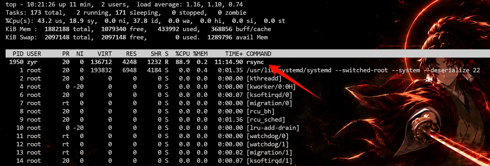
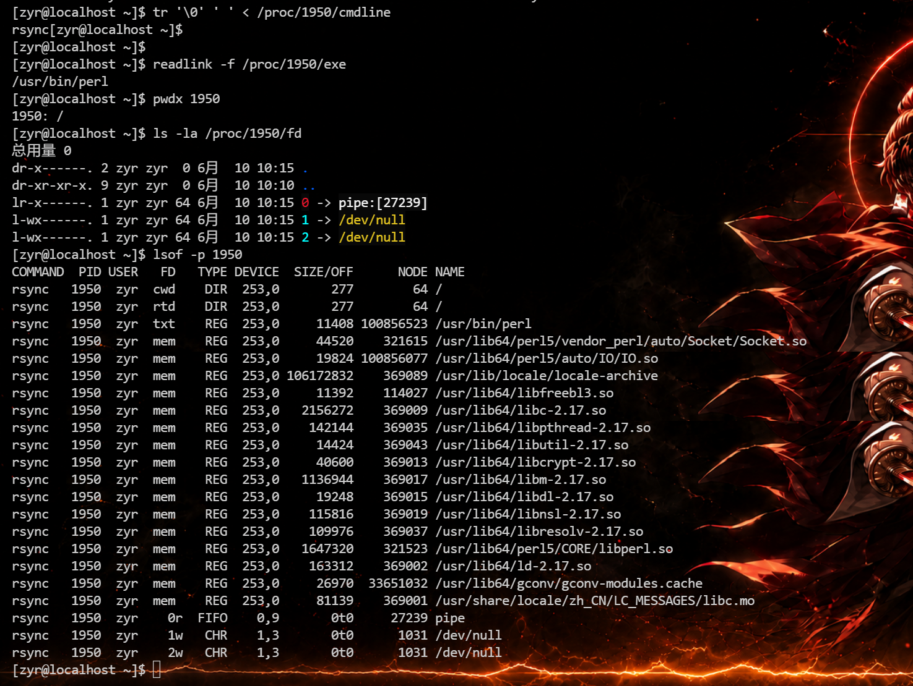
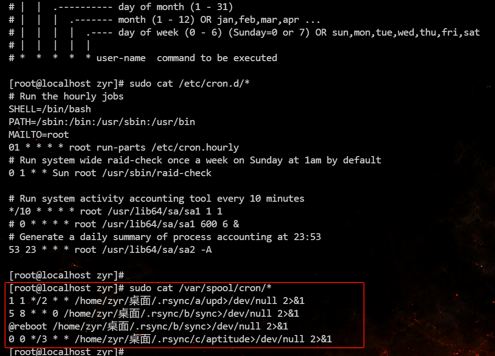
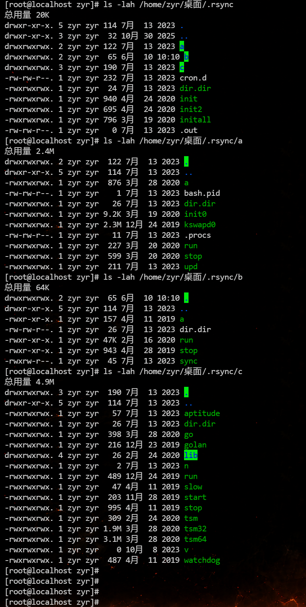
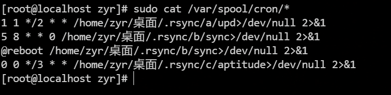
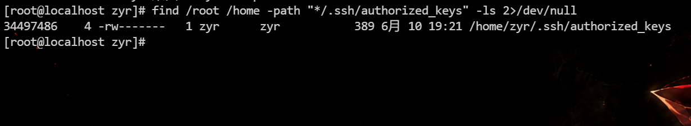
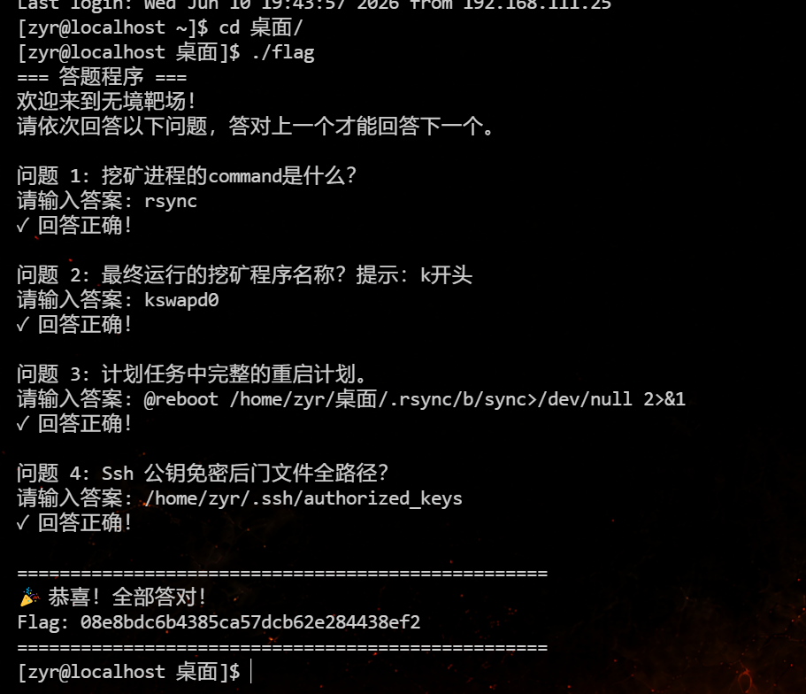

# Linux服务器挖矿病毒应急案例


# Linux服务器挖矿病毒应急案例

- [Linux服务器挖矿病毒应急案例 - 无境·网安靶场](https://bdziyi.com/ulab/lab.html?page=target-detail&id=71)

题目描述：

> 靶机来源于wxiaoge应急响应培训，请使用ssh访问机器，账户：zyr 密码：wxiaoge123 flag在用户桌面目录中，请答题获取最终flag目标是彻底清理挖矿程序，你的任务是尽快使机器恢复正常，检查重启后是否不再被挖矿，不溯源

## 问题 1: 挖矿进程的command是什么？

思路：

排查思路：

1. 找高 CPU 进程；
2. 看进程路径、命令行、父进程；
3. 看网络连接是否连矿池；
4. 查 cron/systemd 是否保活；
5. 查是否 `chattr +i` 防删除；

等

先看 CPU 异常：

```bash
top
top -c
ps aux --sort=-%cpu | head -20
```

可以发现第一个程序的 `CPU`​ 占有率到了 `88.9%` 猜测这就是一个挖矿程序，提交之后结果了



查看某个可疑 PID 的完整 command

```bash
ps -p 1950 -o pid,ppid,user,%cpu,%mem,lstart,etime,cmd		可疑 PID 是 1950

tr '\0' ' ' < /proc/1950/cmdline							查看 /proc 里的真实命令行

readlink -f /proc/1950/exe									查看真实可执行文件路径

pwdx 1950													查看当前工作目录

ls -la /proc/1950/fd										查看进程打开了哪些文件
	
lsof -p 1950
```



flag：rsync

## 问题 2: 最终运行的挖矿程序名称？提示：k开头

思路：

可以先切换到 root 用户，密码就是 wxiaoge123。

查 cron 持久化：

```bash
sudo cat /etc/crontab
sudo cat /etc/cron.d/*
sudo cat /var/spool/cron/*
```



这里已经抓到核心持久化了。最终运行链路在用户 `zyr` 的 crontab 里，可疑目录是：

```bash
/home/zyr/桌面/.rsync/
```

其中三个可疑任务：

```bash
/home/zyr/桌面/.rsync/a/upd
/home/zyr/桌面/.rsync/b/sync
/home/zyr/桌面/.rsync/c/aptitude
```

结合你前面看到的：

```bash
PID 1950 CMD: rsync
真实 exe: /usr/bin/perl
CPU: 99.9%
```

可以判断：cron 通过 `.rsync`​ 目录里的脚本拉起了伪装成 `rsync` 的 Perl 挖矿进程。

然后继续查 `.rsync` 目录内容

```bash
ls -lah /home/zyr/桌面/.rsync
ls -lah /home/zyr/桌面/.rsync/a
ls -lah /home/zyr/桌面/.rsync/b
ls -lah /home/zyr/桌面/.rsync/c
```



可以发现 `/home/zyr/桌面/.rsync/a`​ 目录下有一个 `kswapd0`，提交发现对了

flag：kswapd0

现在已有证据：

```
高 CPU 进程：
PID 1950
CMD: rsync
真实 exe: /usr/bin/perl
CPU: 99.9%

持久化：
/var/spool/cron/zyr

恶意目录：
/home/zyr/桌面/.rsync/

最终矿工：
/home/zyr/桌面/.rsync/a/kswapd0
```

已知攻击链大概是：

```
zyr 用户被植入 cron
    ↓
cron 调用 /home/zyr/桌面/.rsync/a/upd
cron 调用 /home/zyr/桌面/.rsync/b/sync
cron 调用 /home/zyr/桌面/.rsync/c/aptitude
    ↓
.rsync 脚本启动伪装进程 rsync/perl
    ↓
最终矿工 kswapd0
```

## 问题 3: 计划任务中完整的重启计划。

思路：

上面执行过了，找所有用户计划任务

```bash
sudo cat /var/spool/cron/*
```



这里面只有一条是“重启计划”：

```bash
@reboot /home/zyr/桌面/.rsync/b/sync>/dev/null 2>&1  
```

flag：@reboot /home/zyr/桌面/.rsync/b/sync>/dev/null 2>&1

## 问题 4: Ssh 公钥免密后门文件全路径？

思路：

先查所有用户的 SSH 公钥文件

```bash
find /root /home -path "*/.ssh/authorized_keys" -ls 2>/dev/null
```

发现只有一个 ssh 公钥文件，提交就对了



flag：/home/zyr/.ssh/authorized_keys




---

> 作者: [lpppp](/)  
> URL: https://lpppp.xyz/posts/linux%E6%9C%8D%E5%8A%A1%E5%99%A8%E6%8C%96%E7%9F%BF%E7%97%85%E6%AF%92%E5%BA%94%E6%80%A5%E6%A1%88%E4%BE%8B/  

