# Windows应急响应研判


# Windows应急响应研判

- https://mp.weixin.qq.com/s/k7VwLpn3XGMjobhUAZF22A?scene=1

> 服务器场景操作系统 Windows  
> 服务器账号密码 administrator P@ssw0rd  
> 题目来源公众号 ©州弟学安全

## 请找出攻击者攻击成功的端口，如多个端口，则从小到大{x,x,x,}

思路：

先使用 netstat 观察一下本地开放的端口

```python
netstat -nao
```

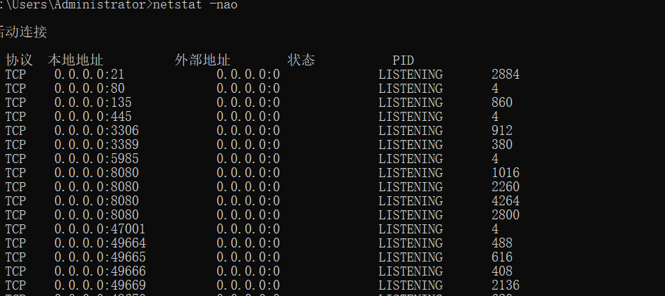

80 和 8080 端口就是小皮上启动的 2 个 web 服务，21 ftp 端口也是通过小皮搭建的

|端口|服务|说明|
| ------| -------| -------------------------------------------------|
|21|FTP|文件传输服务，可能是 FileZilla Server|
|80|HTTP|Web 服务（phpStudy）|
|135|RPC|Windows 远程过程调用，系统内置|
|445|SMB|文件共享/打印服务，永恒之蓝（MS17-010）的攻击面|
|3306|MySQL|数据库服务，phpStudy 自带的|
|3389|RDP|远程桌面|
|5985|WinRM|Windows 远程管理（HTTP），可用于横向移动|
|8080|HTTP|phpStudy|

### 分析 21 端口

先分析流量包，先过滤一下 21 端口的流量

```python
tcp.port == 21
```

|过滤器|含义|
| --------| --------------------------------|
|​`tcp.srcport`|TCP 源端口（发送方端口）|
|​`tcp.dstport`|TCP 目的端口（接收方端口）|
|​`tcp.port`|源或目的端口（任一匹配即显示）|

例如你浏览网页时，服务器回包的 `tcp.srcport`​ 是 80/443，`tcp.dstport` 是你本机的随机高端口。

发现有很多 ftp 流量，这就能确定攻击者对 21 端口就行了攻击

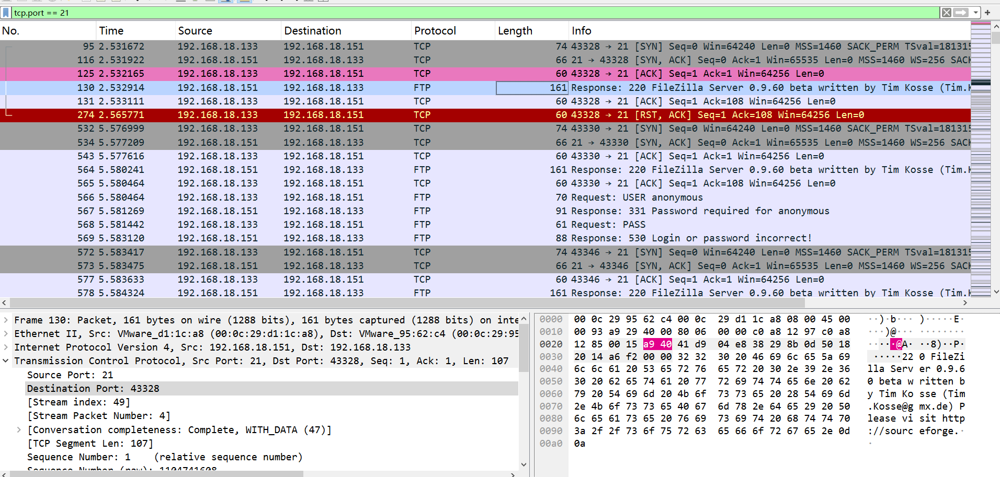

然后就是直接过滤 ftp 流量

```python
ftp
```

很明显能够发现攻击者在做爆破密码的操作，反复返回 `530 Login or password incorrect!`

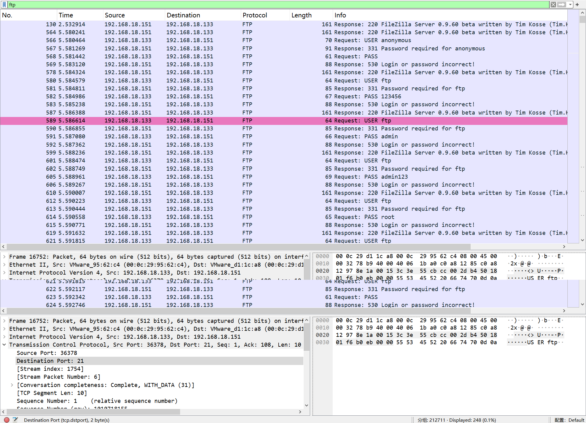

然后一直往下看，可以发现 230 Logged on → 登录成功，并且能看到用户名和密码 `admin / password`，说明 ftp 是通过明文传输，用户名密码直接可见

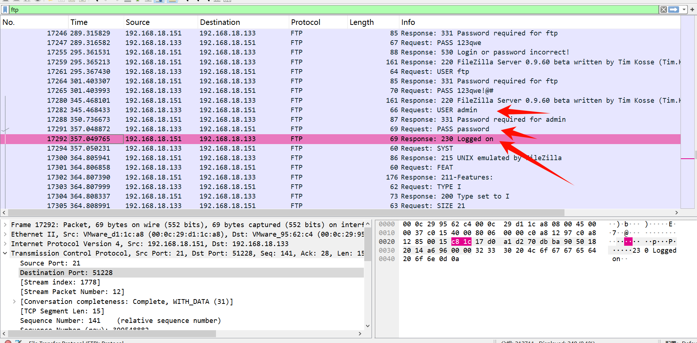

并且最后可以发现下载了一个名为**非常重要.txt**的文件

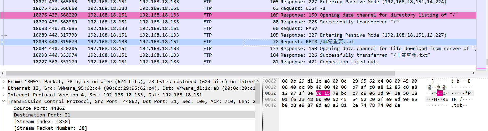

这里有个知识点，好像之前也有题目考过就是被动模式端口计算（也就是数据传输的端口）

服务器响应格式：

```
227 Entering Passive Mode (192,168,18,151,12,227)
                           |___IP地址____|  |h |l|
```

最后两个数字就是端口的高位和低位：

```python
端口 = 高位 × 256 + 低位
端口 = 12 × 256 + 227 = 3072 + 227 = 3299
```

再看另一个端口

```python
227 Entering Passive Mode (192,168,18,151,14,224)
端口 = 14 × 256 + 224 = 3584 + 224 = 3808
```

这两个端口就是 ftp 数据传输的端口，可以过滤一下看看

```python
tcp.port == 3299 || tcp.port == 3808
```

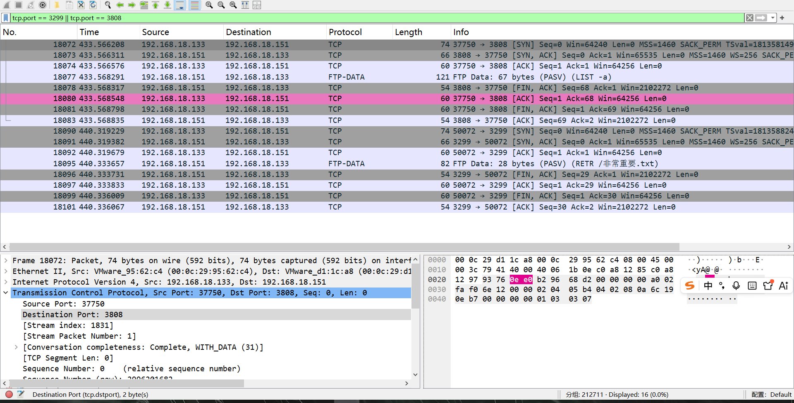

最后可以在导出对象- ftp-data 导出数据

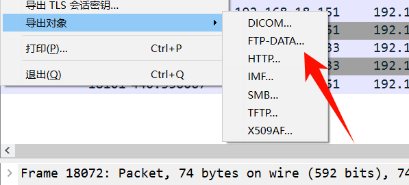

### 分析 8080 端口

把404 的响应包被排除一下，然后往下看可以看到使用 admin/adminadmin 登入成功了 dede 的后台

```python
tcp.port == 8080 && http && !(http.response.code == 404)
```

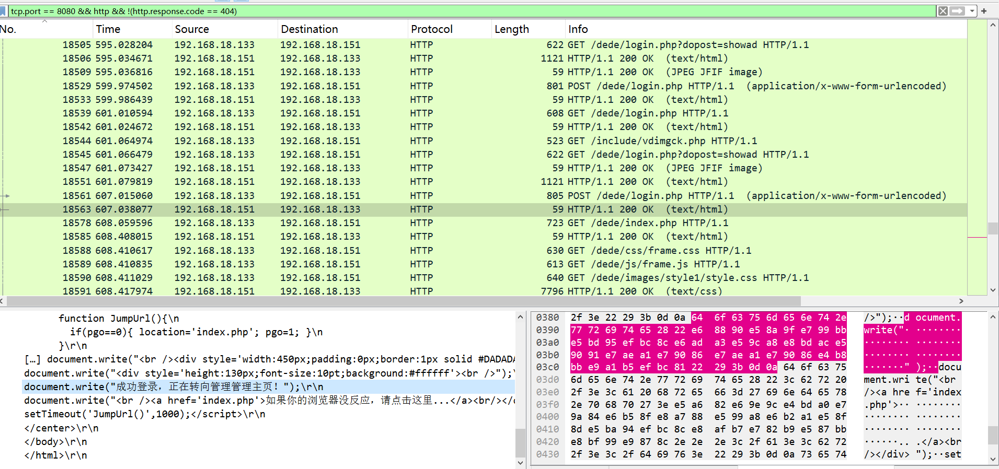

并且最下面还看到访问了一个可疑的文件 /dede/a/newfile1.php?1\=phpinfo();

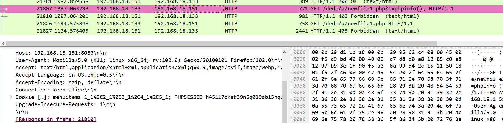

### 分析 3389 端口

知道攻击者的 ip 是 192.168.18.133，然后再过滤一下 rdp 协议

```python
rdp
```

很明显存在RDP 爆破行为，尝试了很多用户

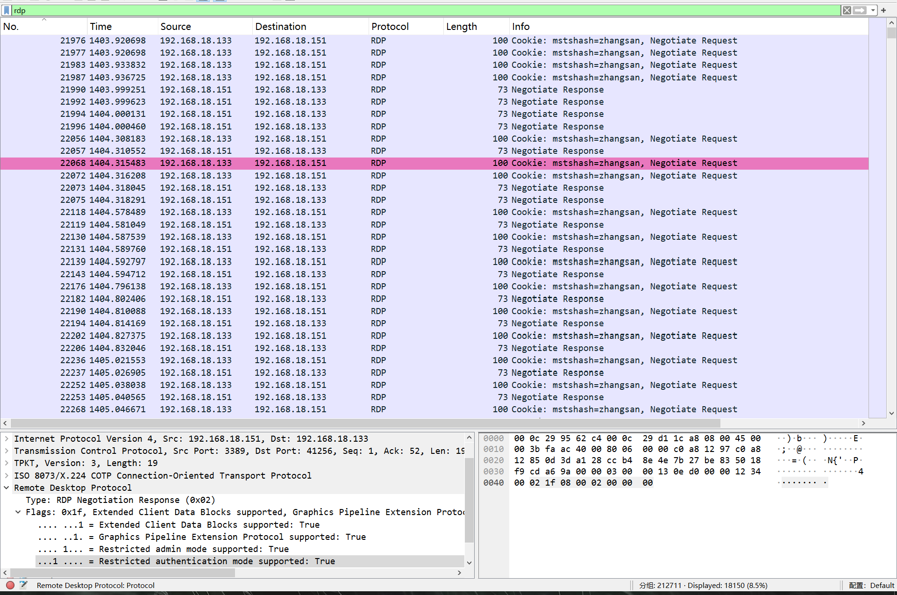

虽然看不到密码明文，但可以通过行为特征判断：（也可以通过这种方法确定）

```
tcp.port == 3389 && tcp.flags.syn == 1
```

短时间内大量 SYN 包 → 反复建立连接 → 爆破行为。

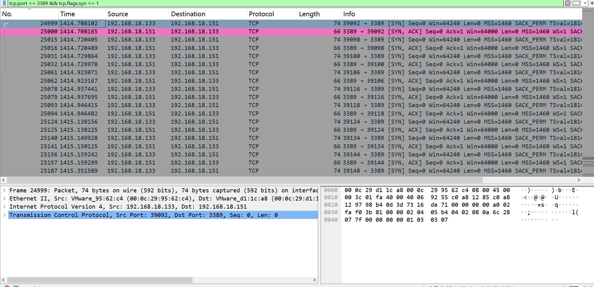

然后我们只看攻击者发出的包

```python
tcp.port == 3389 && ip.addr == 192.168.18.133
```

这里最后出现红色数据，表示请求断开，然后上面的数据都是在进行爆破的数据包，直到这里断开说明这个时候应该是登入成功了

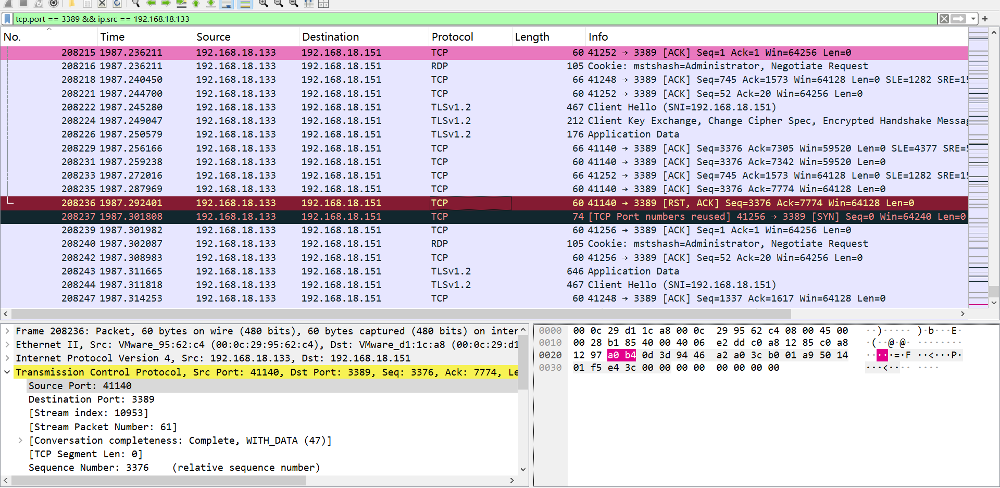

其他端口都看了一下，都不存在被攻击的可能。所以这里被攻击的端口就是 21,8080,3389

flag：flag{21,3389,8080}

## 请找出攻击者上传的恶意文件名

上面分析到了一个可疑的文件 newfile1.php，

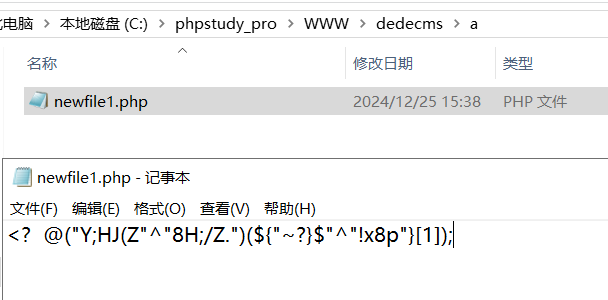

很明显的一个免杀马，这个免杀马也能够搜索到

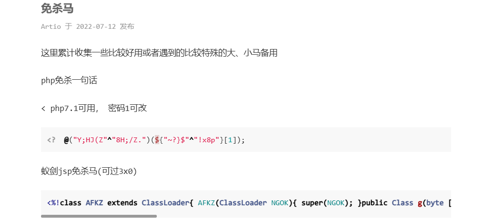

flag：flag{newfile1.php}

## 请找出攻击者最终攻击成功的端口

通过上面分析 21 端口，8080 端口都是进行了工具但是没有什么进行具体操作了。然后我们具体分析 window 的事件日志，可以发现有个 kali 的机器登入成功，并且后续还有 DESKTOP-OA5UKMA 也进行了登入

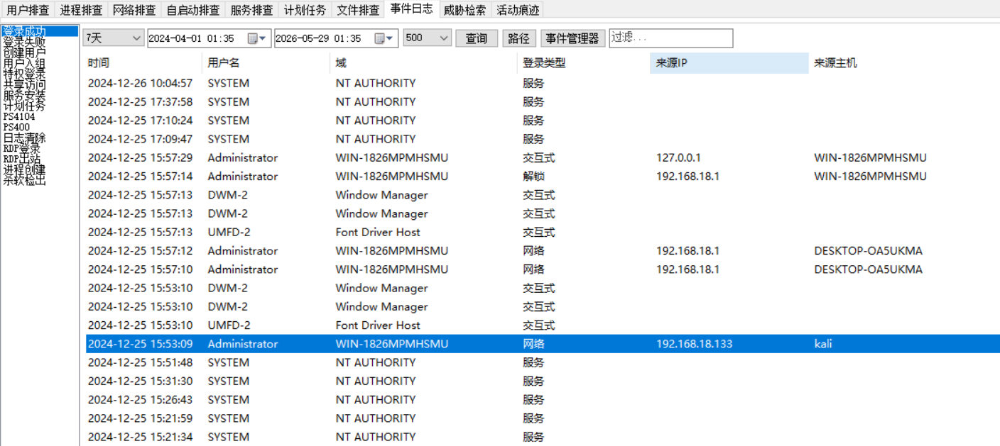

这里一样可以使用这个工具进行分析

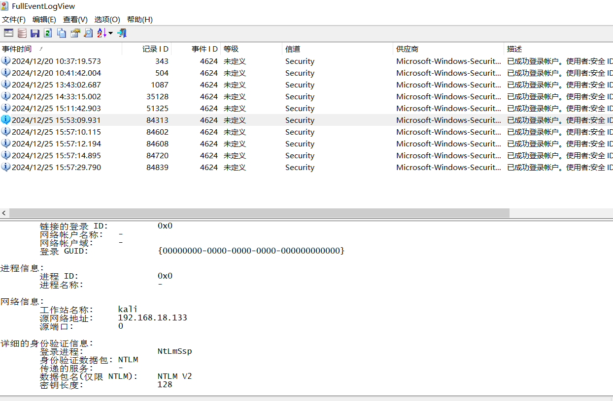

flag：flag{3389}

## 请找出攻击者最终攻击成功端口的IP

最终攻击成功肯定是 kali 那个 ip 攻击成功的

flag：flag{192.168.18.133}

## 请找出攻击者最后接管服务器的IP

攻击者使用 kali 工具成功后，然后又使用其他电脑进行了 rdp 远程登录，也就是最后接管服务器的电脑 ip

flag：flag{192.168.18.1}


---

> 作者: [lpppp](/)  
> URL: https://lpppp.xyz/posts/windows%E5%BA%94%E6%80%A5%E5%93%8D%E5%BA%94%E7%A0%94%E5%88%A4/  

