# 应急响应之Windows日志分析


# 应急响应之Windows日志分析

- https://mp.weixin.qq.com/s/eJpsOeaEczcPE-uipP7vCQ
- [第四章-windows日志分析 - 玄机](https://xj.edisec.net/challenges/89)

‍

```python

系统: Windows 7
CPU: 2颗
内存: 2G
空间: 保证不低于5G
其它傀儡机: 段内
账号/密码: winlog/winlog123

注意: 远控软件内IP为虚拟IP，如在进行进程中没有找到相关外连，应该是由于连接超时造成的断开了，重启环境服务器或软件即可继续对外发起请求，请见谅
注意: 按照题目提示可以根据系统功能分析，或桌面工具进行辅助分析
注意: winlog用户在操作关于系统权限功能时，一定要使用管理员权限打开工具再去执行
如: cmd直接打开则可能无法进行操作系统权限性操作，需右击cmd-使用管理员权限打开，才可以，其它工具也如此
注意: 题目中shell如需在本地分析，提前关闭杀毒软件，会被杀掉，非免杀

题目: 
  1. 审计桌面的logs日志，定位所有扫描IP，并提交扫描次数
  2. 审计相关日志，提交rdp被爆破失败次数
  3. 审计相关日志，提交成功登录rdp的远程IP地址，多个以&连接,以从小到大顺序排序提交
  4. 提交黑客创建的隐藏账号
  5. 提交黑客创建的影子账号
  6. 黑客植入了一个远程shell，审计相关进程和自启动项提交该程序名字
  7. 提交远程shell程序的连接IP+端口，以IP:port方式提交
  8. 黑客使用了计划任务来定时执行某shell程序，提交此程序名字
```

## 审计桌面的logs日志，定位所有扫描IP，并提交扫描次数

思路：

先统计一下有多少种 ip

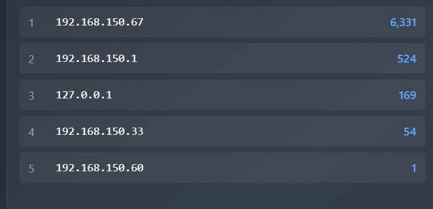

也可以使用命令

```python
awk '{print $1}' access.log | sort | uniq -c | sort -nr

   6331 192.168.150.67
    524 192.168.150.1
    169 127.0.0.1
     54 192.168.150.33
      1 192.168.150.60
```

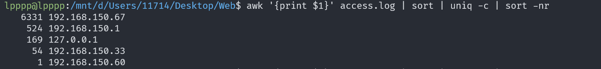

127.0.0.1 是本地 ip。历史记录中有 http://192.168.150.1:8000/ 这些 ip，也就是说：192.168.150.1 是服务器 / 靶站 / 业务站点 IP。所以重点分析 192.168.150.67 和 192.168.150.33 这两个 ip

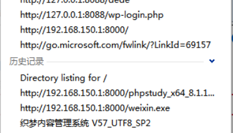

先分析一下 192.168.150.67 这个  ip 访问的日志。可以明显发现这个 ip 应该是在进行目录扫描

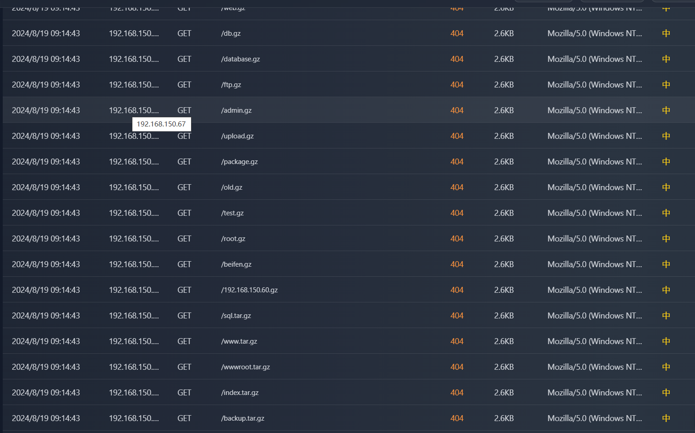

192.168.150.33 日志的 UA 头中有明显的 `Nmap` 标识，明显就是进行 namp 扫描

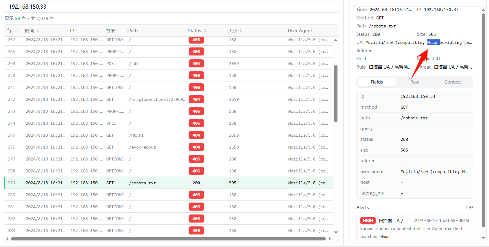

所以所有的扫描 ip 就是  192.168.150.67 和 192.168.150.33，总次数就是 6331 + 54 = 6385

flag：flag{6385}

## 审计相关日志，提交rdp被爆破失败次数

思路：

rdp 就是在尝试登入，也就是找登录失败的次数，过滤一下事件 id `4625` 即可。

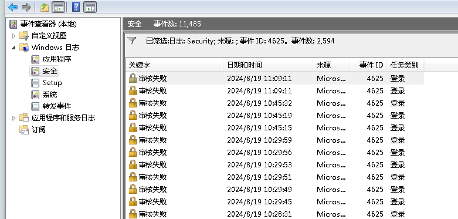

也可以把所有的日志都导出来用自己的工具分析一下。

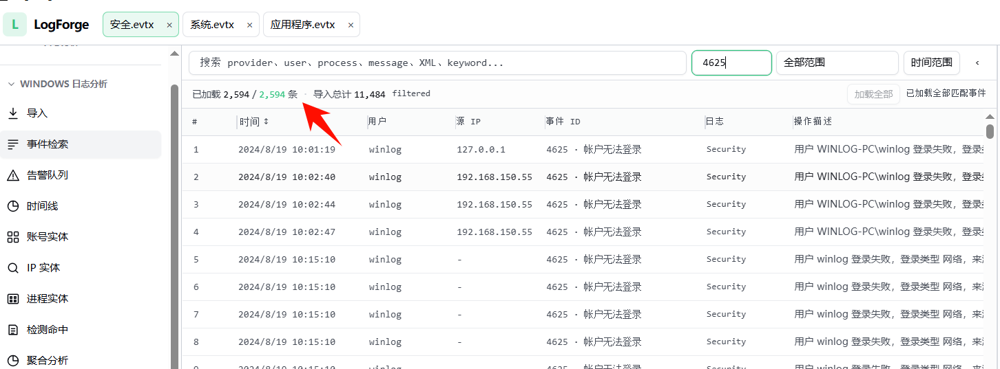

flag：flag{2594}

## 审计相关日志，提交成功登录rdp的远程IP地址，多个以&连接,以从小到大顺序排序提交

思路：

成功登入 rdp 一般就是直接使用账号密码登入，可以过滤一下事件 id 4648 显式凭据登录

> 4624 \= 登录成功(目标机视角,表示成功);
>
> 4648 \= 使用显式凭据发起登录(源机视角,表示用了另一组账号密码,常见于 runas、net use、横向移动),两者关联起来能还原"谁用谁的凭据从哪打到哪"。

这里能找到 3 个 ip：192.168.150.1，192.168.150.128，192.168.150.178

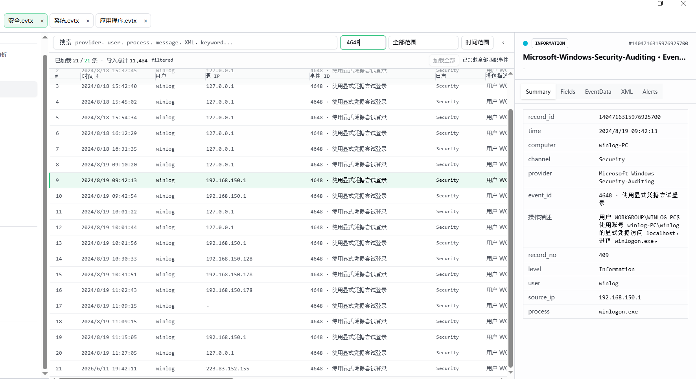

如果过滤的是 4624 的话还能看到一个 ip `192.168.150.33`。

这里也能看到 LogonType \= 3,不是 10

> 这是最核心的原因。
>
> ```
> RDP 远程交互登录 = LogonType 10 (RemoteInteractive)
> 192.168.150.33  = LogonType 3 (Network 网络登录)
> ```
>
> LogonType 3 是网络登录,常见于:
>
> ```
> SMB 访问
> 共享访问
> 网络服务探测
> 端口扫描
> ```
>
> 而 RDP 真正登录是 Type 10。

第二地方就是 WorkstationName \= nmap。这直接暴露了来源:这是 nmap 扫描器发起的探测。所以 192.168.150.33 是攻击者扫描机,不是 RDP 登录机。

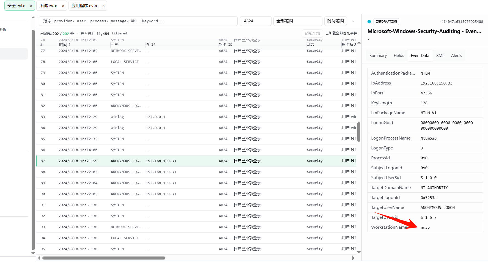

flag：flag{192.168.150.1&192.168.150.128&192.168.150.178}

## 提交黑客创建的隐藏账号

思路：

先通过 `net user` 看一下用户，这个看不到隐藏用户。

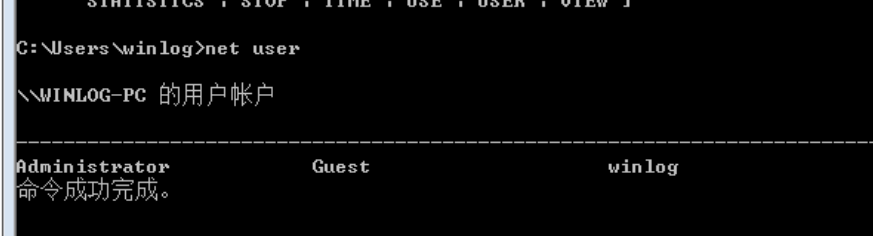

win + r 输入 **​`lusrmgr.msc`​** 打开本地用户和组，就能看到隐藏的用户 hacker$。看出题人的说法是

hackers$ 是影子账户，本来这个地方是看不到的。

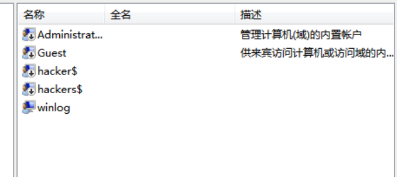

flag：flag{hacker$}

## 提交黑客创建的影子账号

思路：

影子账号真实环境中是无法在用户组 /netuser/ 用户面板中看到，但是可以在注册表中看到并删除， WIN+R 输入 regedit 启动注册表。注册表地址：

```python
HKEY_LOCAL_MACHINE\SAM\SAM\Domains\Account\Users\Names
```

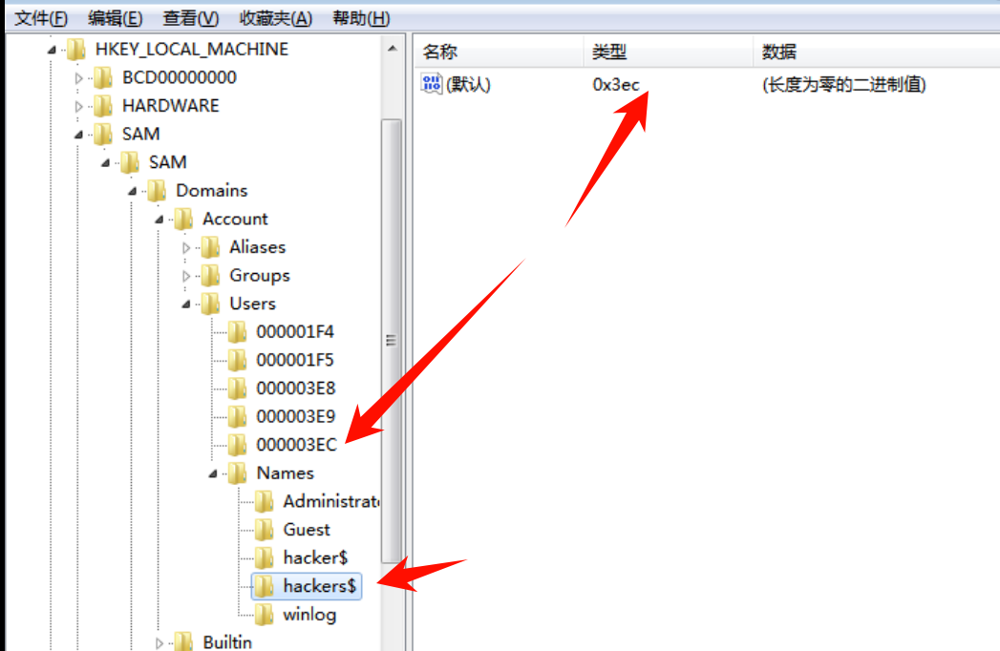

右击删除这两个就看不到改账号的信息了

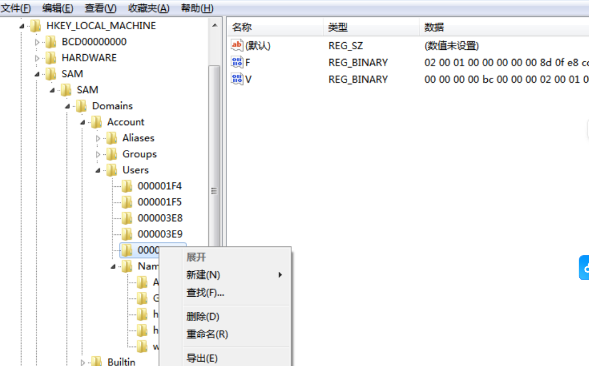

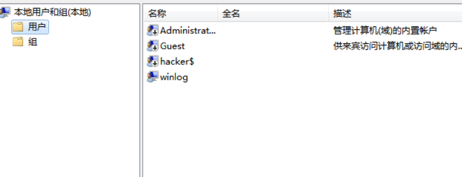

flag：flag{hackers$}

## 提交远程shell程序的连接IP+端口，以IP:port方式提交

思路：

可以通过命令` netstat -nao` 命令进行端口排查，可以发现可疑 ip 端口 185.117.118.21:4444

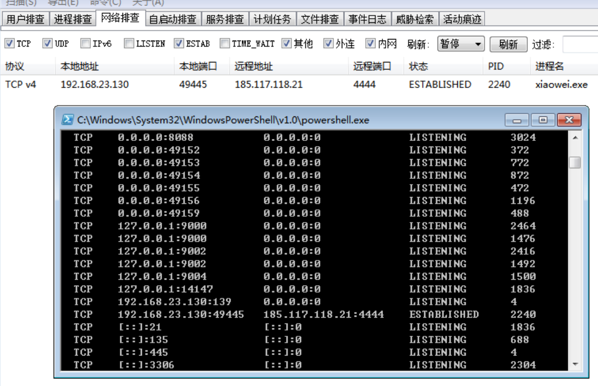

可看到对外连接不少的互联网IP，排查思路如下

```python
1. 根据外联IP地址进行排查，在情报平台进行查询
2. 根据端口进行排查，通常大端口或有特殊意义端口要确认
3. 依次根据PID进行排查
```

flag：flag{185.117.118.21:4444}

## 黑客植入了一个远程shell，审计相关进程和自启动项提交该程序名字

思路：

可以先看看自启动注册表的位置如下

```python
HKEY_CURRENT_USER\Software\Microsoft\Windows\CurrentVersion\Run
```

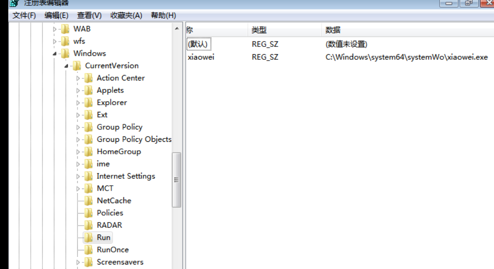

或者使用工具进行检测也行

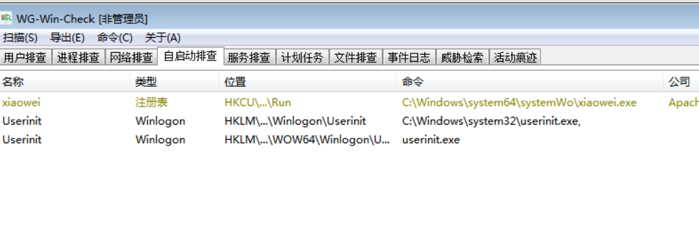

然后可以上传到微步进行分析一下，可以发现有明显的木马特征

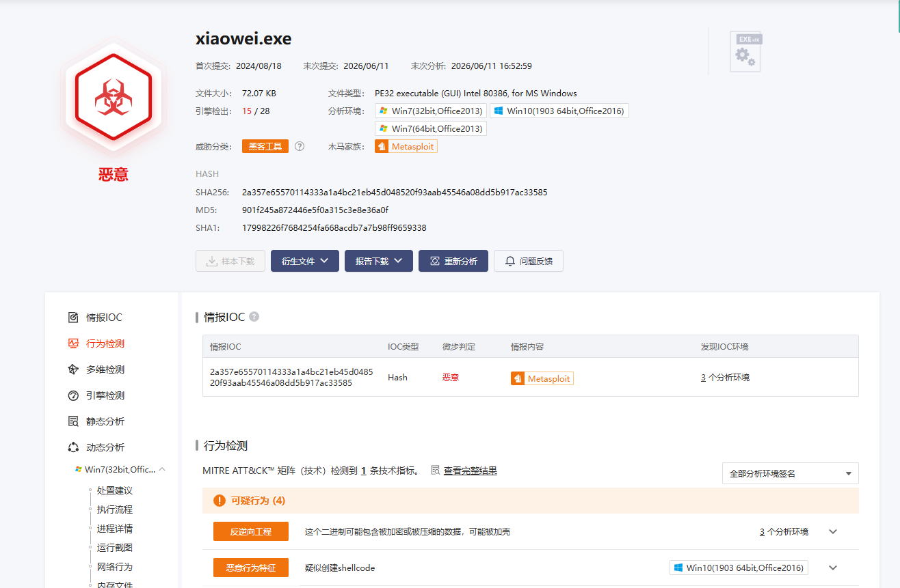

flag：flag{xiaowei.exe}

## 黑客使用了计划任务来定时执行某shell程序，提交此程序名字

思路：

win+r 输入 `taskschd.msc` ，可以发现每天的 23:07 会下载 xiaowei.exe

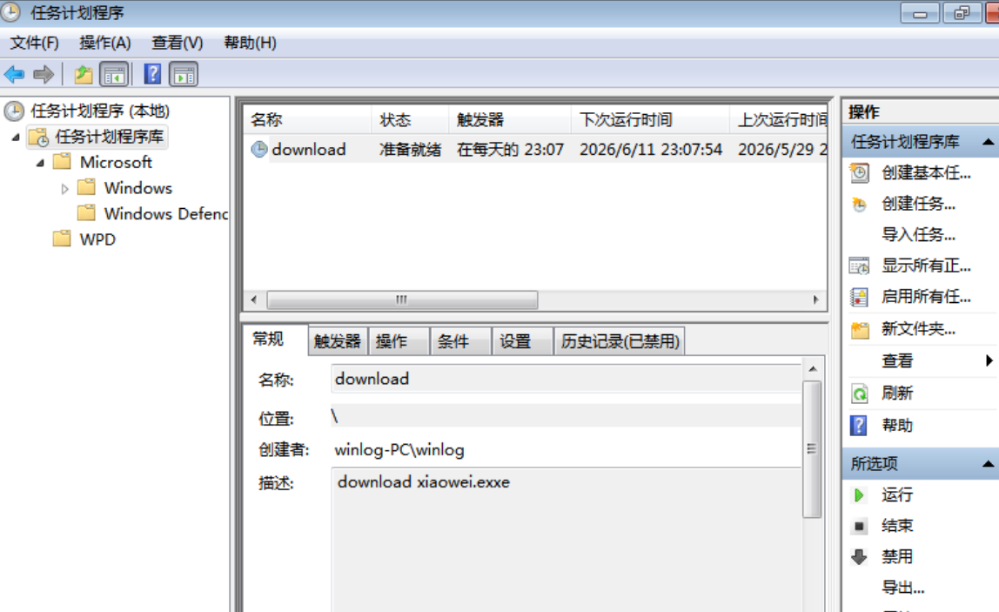

然后 定位到操是这个文件 C:Windows\zh-CN\download.bat

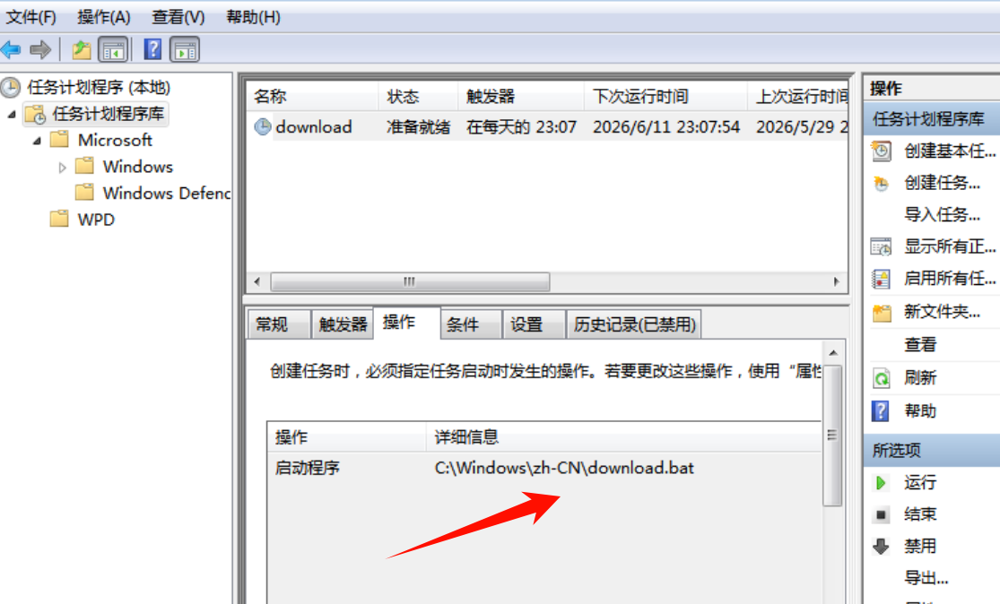

可以具体看看下载行为

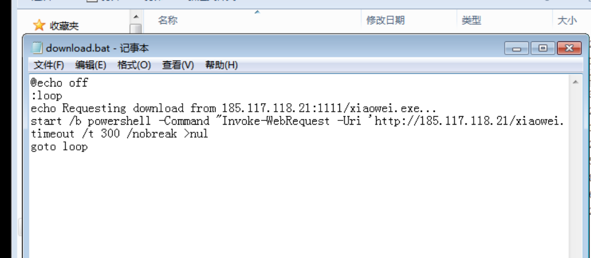

flag：flag{download.bat}


---

> 作者: [lpppp](/)  
> URL: https://lpppp.xyz/posts/%E5%BA%94%E6%80%A5%E5%93%8D%E5%BA%94%E4%B9%8Bwindows%E6%97%A5%E5%BF%97%E5%88%86%E6%9E%90/  

