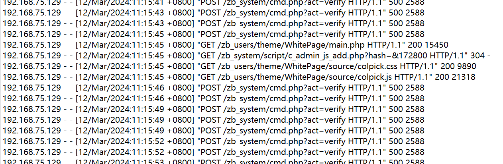
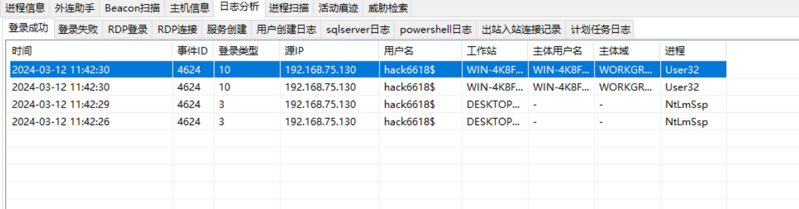
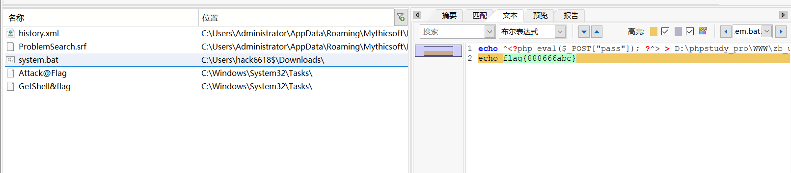
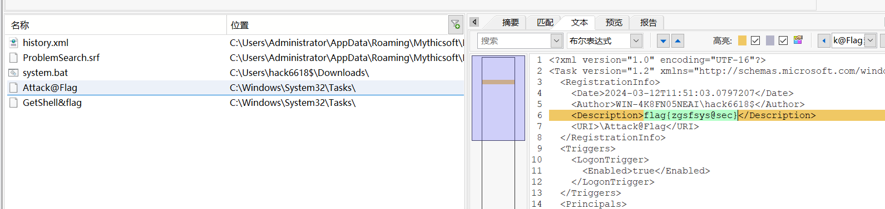
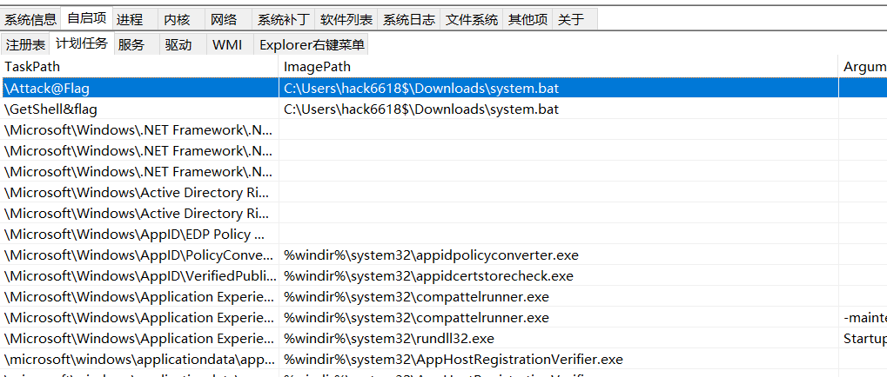
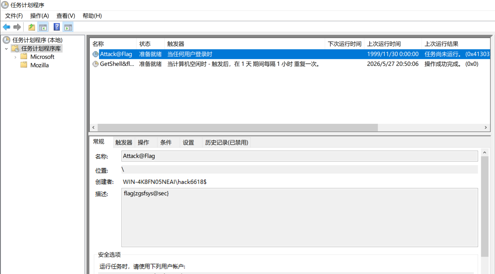
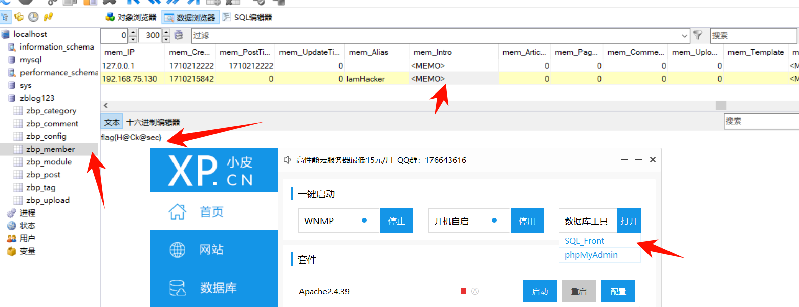

# 应急响应靶机训练--Web3


# 应急响应靶机训练--Web3

## 挑战内容

前景需要：小苕在省护值守中，在灵机一动情况下把设备停掉了，甲方问：为什么要停设备？小苕说：我第六感告诉我，这机器可能被黑了。

这是他的服务器，请你找出以下内容作为通关条件：

1. 攻击者的两个IP地址
2. 隐藏用户名称
3. 黑客遗留下的flag【3个】

本虚拟机的考点不在隐藏用户以及ip地址，仔细找找把。

**相关账户密码：**

Windows:administrator/xj@123456

## 攻击者的两个IP地址

思路：

先看日志 D:\phpstudy_pro\Extensions\Apache2.4.39\logs，确定第一个 ip， 192.168.75.129



可以看到第二个登录成功的 ip 192.168.75.130



flag：

> 192.168.75.129
>
> 192.168.75.130

## 隐藏用户名称

根据 web 1 的方法和上面能找到隐藏用户名称为 hack6618$

```python

PS C:\Users\Administrator> net user

\\WIN-4K8FN05NEAI 的用户帐户

-------------------------------------------------------------------------------
Administrator            DefaultAccount           Guest
WDAGUtilityAccount
命令成功完成。

PS C:\Users\Administrator> wmic useraccount get name,SID
Name                SID
Administrator       S-1-5-21-2693296791-3972653363-1307695630-500
DefaultAccount      S-1-5-21-2693296791-3972653363-1307695630-503
Guest               S-1-5-21-2693296791-3972653363-1307695630-501
hack6618$           S-1-5-21-2693296791-3972653363-1307695630-1000
WDAGUtilityAccount  S-1-5-21-2693296791-3972653363-1307695630-504

PS C:\Users\Administrator>

```

flag：hack6618$

## 黑客遗留下的flag【3个】

### flag1



flag：flag{888666abc}

### flag2



可以发现这个 flag 属于计划任务里面



win+r 输入 taskschd.msc，打开计划任务程序，这两个计划任务 flag 一样



flag：flag{zgsfsys@sec}

### flag3

直接在小皮中下载数据库管理工具，然后找到 flag



flag：flag{H@Ck@sec}


---

> 作者: [lpppp](/)  
> URL: https://lpppp.xyz/posts/%E5%BA%94%E6%80%A5%E5%93%8D%E5%BA%94%E9%9D%B6%E6%9C%BA%E8%AE%AD%E7%BB%83-web3/  

