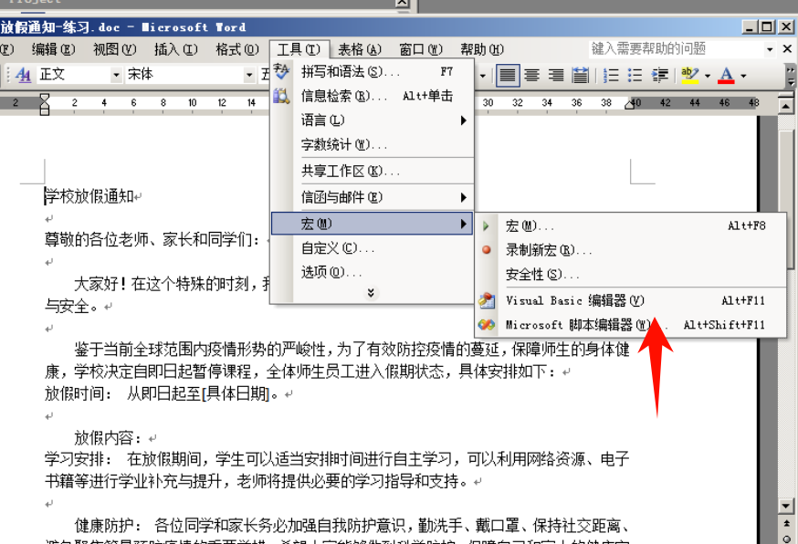
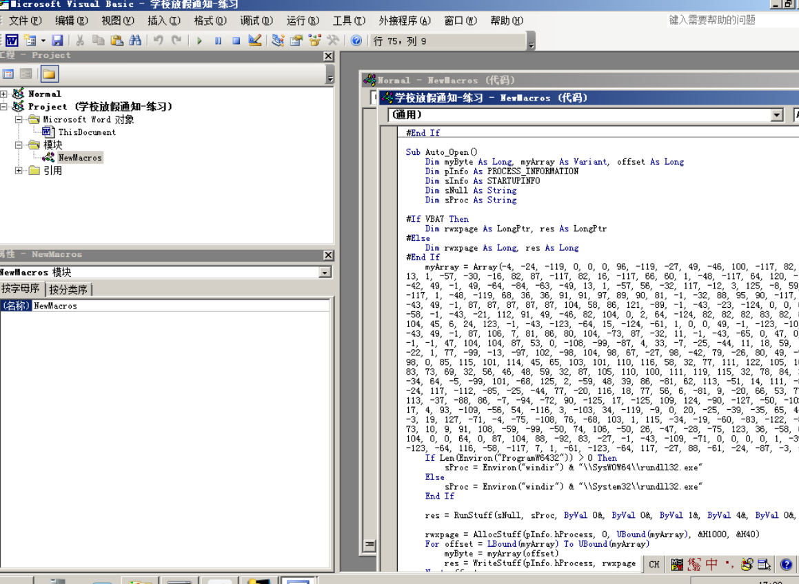
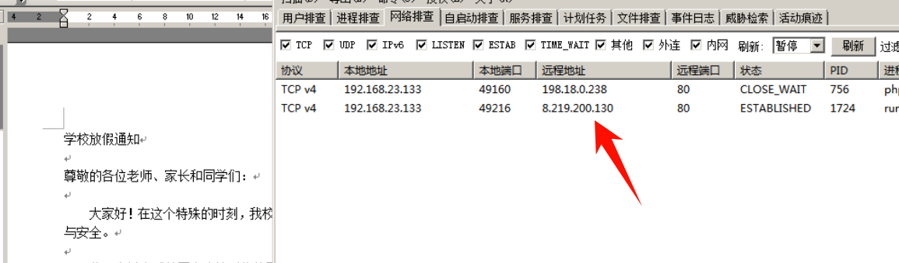
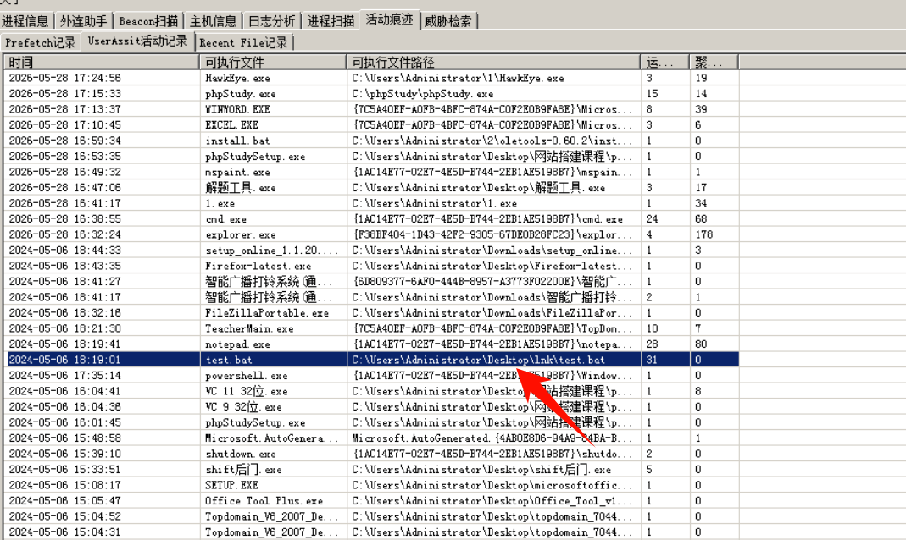
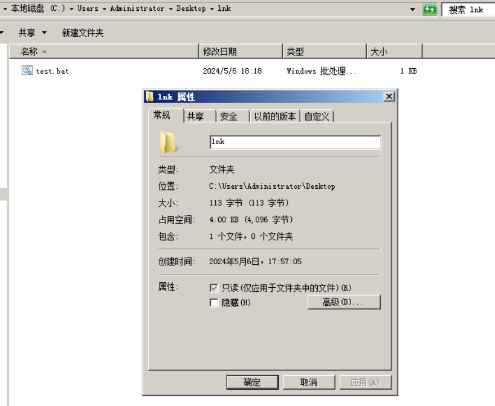
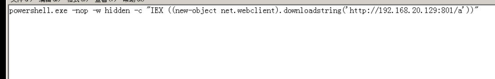
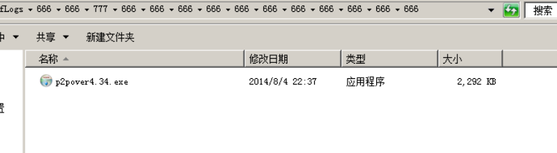
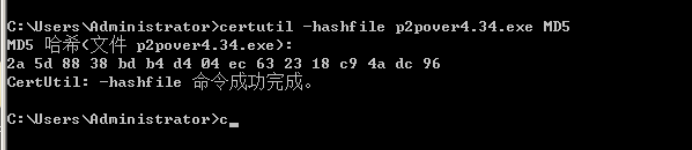
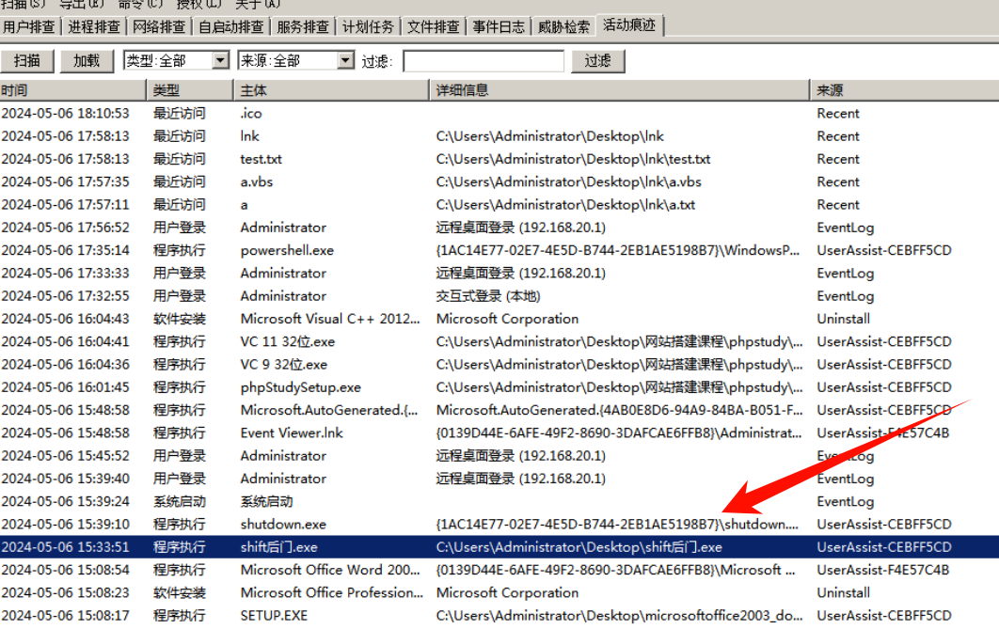
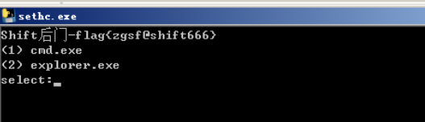

# 应急响应靶机训练-近源渗透OS-1


# 应急响应靶机训练-近源渗透OS-1

题目描述：

> 前景需要：小王从某安全大厂被优化掉后，来到了某私立小学当起了计算机老师。某一天上课的时候，发现鼠标在自己动弹，又发现除了某台电脑，其他电脑连不上网络。感觉肯定有学生捣乱，于是开启了应急。
>
> 1.攻击者的外网IP地址
>
> 2.攻击者的内网跳板IP地址
>
> 3.攻击者使用的限速软件的md5大写
>
> 4.攻击者的后门md5大写
>
> 5.攻击者留下的flag

**相关账户密码**

Administrator

zgsf@2024

## 1.攻击者的外网IP地址

先传一个应急响应的工具上去排查一下

```python
certutil -urlcache -split -f http://192.168.23.1:9000/1.exe
```

没有找到小皮相关的 web 日志。然后桌面有4个 office 文件， 打开学校放假通知-练习.doc 发现是开了宏的





并且看到了远程地址



flag：8.219.200.130

## 2.攻击者的内网跳板IP地址

在活动痕迹中看到一些可疑的 bat 文件



把隐藏取消掉就能看到文件



然后就能看到内网跳板IP地址 192.168.20.129



flag：192.168.20.129

## 3.攻击者使用的限速软件的md5大写

可以 c 盘有个  PerfLogs ，好多 666 目录，p2pover4.34. exe。就是一款局域网限速工具

- 全称：P2P终结者
- 原理：ARP 欺骗（伪装网关，劫持同网段流量）
- 功能：限制局域网内其他主机的网速、阻断 P2P 下载、监控网络活动
- 本质：套了 GUI 的 ARP 中间人攻击工具



计算一下 md5

```python
certutil -hashf ile p2pover4.34.exe MD5
```



flag：2a 5d 88 38 bd b4 d4 04 ec 63 23 18 c9 4a dc 96

## 4.攻击者的后门md5大写

桌面下就有个 shift 后门文件，但是好像被删除了。然后搜索了下 [沾滞键shift后门_3389shift-CSDN博客](https://blog.csdn.net/Jietewang/article/details/112480819)

### 后门原理

在C盘**C:\\Windows\\System32**目录下存在sethc.exe文件，正常情况下会执行sethc.exe文件，但是当我们将cmd.exe文件把sethc.exe文件通过更改名称给覆盖掉，当我们连续按下5次**shift**后执行的就是“cmd.exe”文件了。



然后连续按下5次 shift 就能看到 flag



flag：8C545F6F1BA83C15B8B02EE4AA62FF11

## 5.攻击者留下的flag

上面这个木马留下的

flag：flag{zgsfeshift666}


---

> 作者: [lpppp](/)  
> URL: https://lpppp.xyz/posts/%E5%BA%94%E6%80%A5%E5%93%8D%E5%BA%94%E9%9D%B6%E6%9C%BA%E8%AE%AD%E7%BB%83-%E8%BF%91%E6%BA%90%E6%B8%97%E9%80%8Fos-1/  

