# 日志排查


# 日志排查

来自：第二届Solar杯应急响应挑战赛

题目：

> 时间：2025年12月17日 事件：安全运营中心（SOC）监测到数据库服务器流量异常，随后发现管理员组中出现不明账号。任务：请根据提供的日志文件（MSSQL ERRORLOG、Windows 安全日志、系统镜像/注册表），按时间顺序回答以下问题

## 任务1

题目：

> 任务名称：任务1
>
> 任务分数：100.00
>
> 任务类型：静态Flag
>
> 在攻击真正发生之前，防火墙记录到了针对 SQL Server 的暴力破解行为。请找出发起暴力破解（大量登录失败）的 IP 地址。（按时间顺序用\_连接，FLAG格式为：flag{ip\_ip}

思路：

给了一些 windows 日志文件，最后还有一个注册表文件。

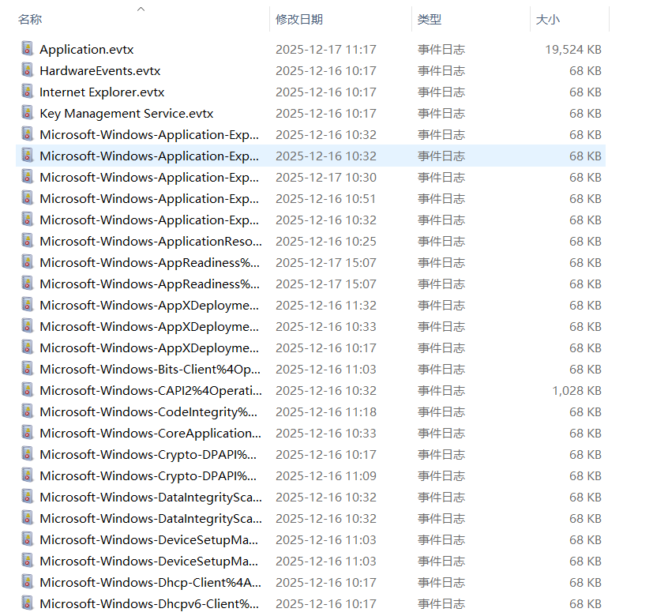

然后使用我们的工具直接导入整个 logs 目录

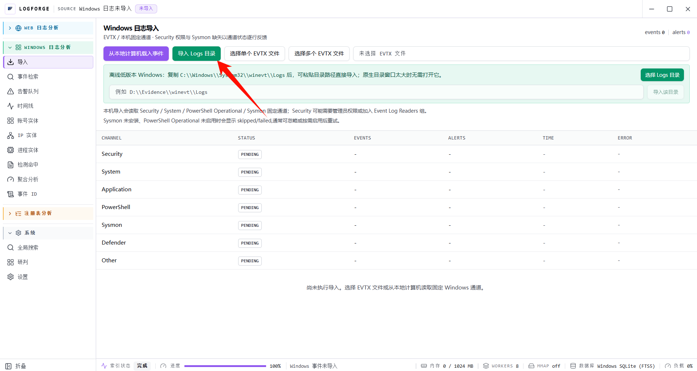

点击聚合分析看看，发现 18456·SQL Server登录失败，这条事件日志非常多

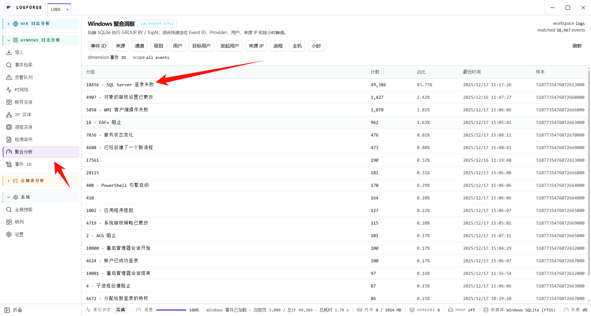

题目说找到发起暴力破解（大量登录失败）的 IP 地址，那很明显就是过滤 18456 这个事件 id。表示的就是SQL Server登录失败，直接点击上面第一条然后自己跳转到 事件检索 表格中进行过滤。

然后可以几点加载全部把全部数据加载出来，很明显看到 2025/12/17 11:12:54 这个时间点 192.168.146.161 这个 ip 在开始爆破

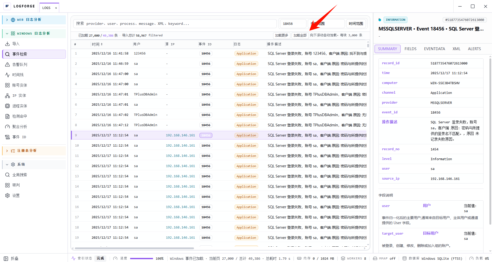

拉倒表格的最下面，这个事件点 2025/12/17 11:17:26 这个 192.168.146.135 ip 结束了爆破

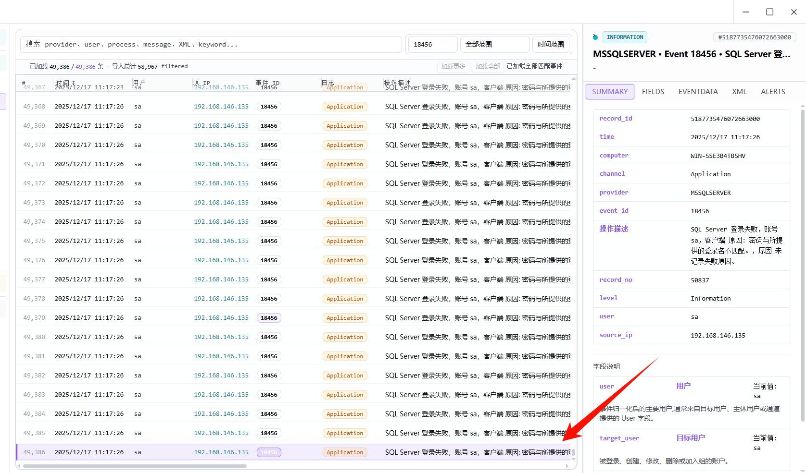

然后可以导入过滤这两个 ip 进行分析

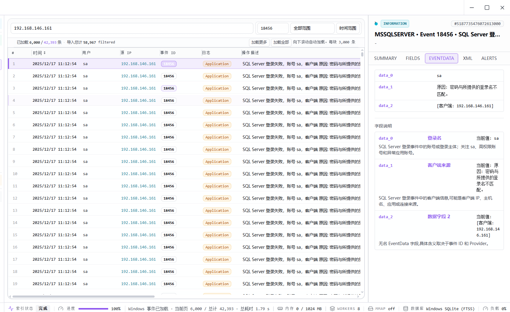

分析结果如下：

|IP|首次失败时间|末次失败时间|失败次数|
| -----------------| ---------------------| ---------------------| ----------|
|192.168.146.135|2025/12/17 11:17:10|2025/12/17 11:17:26|6985|
|192.168.146.161|2025/12/17 11:12:54|2025/12/17 11:14:22|42393|

题目要求"按时间顺序"，根据暴力破解**结束时间**排序：

- 192.168.146.161 结束于 11:14:22（先结束）
- 192.168.146.135 结束于 11:17:26（后结束）

因此答案为：`192.168.146.135_192.168.146.161`

flag：flag{192.168.146.135_192.168.146.161}

## 任务2

题目：

> 任务名称：任务2
>
> 任务分数：100.00
>
> 任务类型：静态Flag
>
> 请分析 MSSQL 日志文件，找到攻击者 IP 192.168.146.135 在结束暴力破解后，首次成功使用“SQL Server 身份验证”建立连接的时间。FLAG格式为：flag{2025/12/17 11:17:26}

思路：

建立连接时间就是登入成功，知道 SQL Server authentication 登录成功的事件 id 是 18454。

过滤一下该事件 id，就能发现攻击者 IP 192.168.146.135，登入的日志时间就是 2025/12/17 11:17:26

> 鼠标放到要复制的值上面鼠标左击一下就能复制

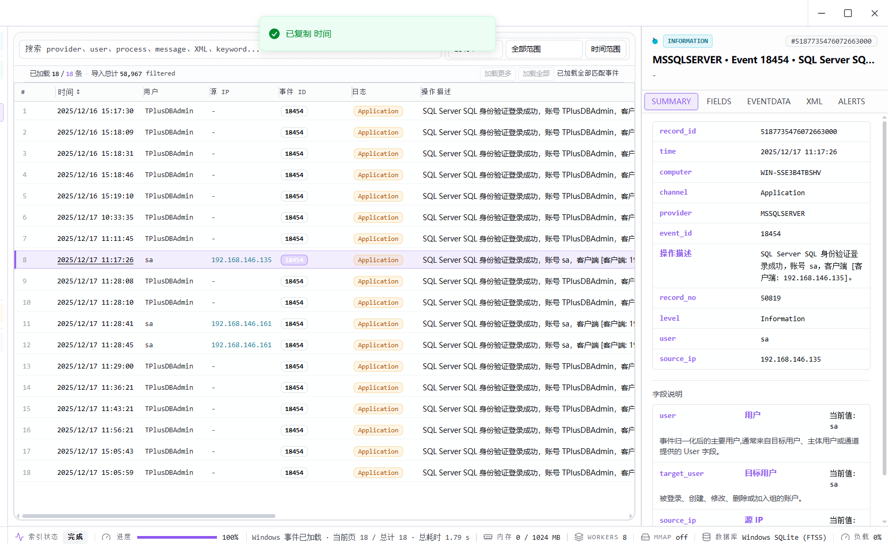

flag：flag{2025/12/17 11:17:26}

## 任务3

> 任务名称：任务3
>
> 任务分数：100.00
>
> 任务类型：静态Flag
>
> 经分析，攻击者登陆数据库后进行了关键配置更改以启用命令执行功能。 请还原攻击者在该时间点内的完整配置修改链（按日志记录顺序）。FLAG格式为：flag{配置名1\_配置名2}

思路：

攻击者通过暴力破解获取 SQL Server 的 sa 账户权限后，通常会尝试启用 `xp_cmdshell` 存储过程来执行系统命令。这是 SQL Server 渗透中最常见的提权手法。

在 SQL Server 中，`xp_cmdshell` 默认是禁用的，要启用它必须先开启高级配置选项。标准的启用流程是：

```sql
-- 第一步：启用高级选项
EXEC sp_configure 'show advanced options', 1;
RECONFIGURE;

-- 第二步：启用 xp_cmdshell
EXEC sp_configure 'xp_cmdshell', 1;
RECONFIGURE;
```

SQL Server 的配置更改会记录在 Application 事件日志中，Event ID 15457 专门用于记录 

​`sp_configure` 配置变更。通过筛选该事件可以还原攻击者的操作：

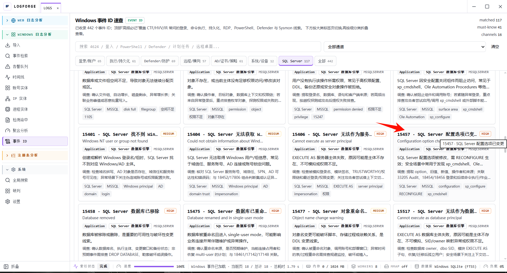

然后过滤一下事件 id 15457，然后我们知道攻击者登入的时间是 2025/12/17 11:17:26，所以看这个时间之后的日志就可以

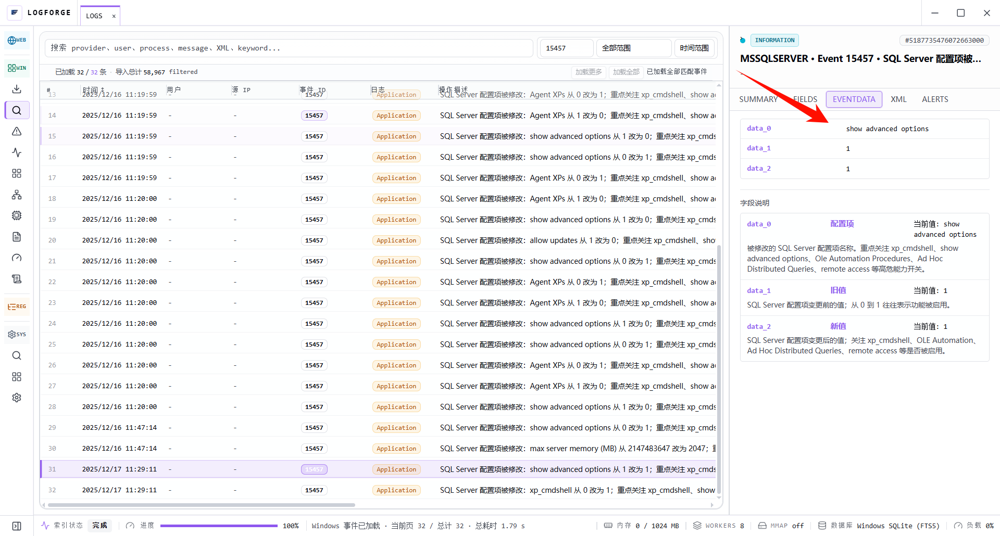

从日志中可以看到，在 2025-12-17 11:29:11（攻击者成功登录后约12分钟），连续出现了两条配置修改记录：

```
2025-12-17 11:29:11 | show advanced options | 1 | 1
2025-12-17 11:29:11 | xp_cmdshell | 0 | 1
```

第一条记录显示 `show advanced options`​ 被设置为1（启用），第二条记录显示 `xp_cmdshell` 从0变为1（从禁用变为启用）。这完全符合启用命令执行功能的标准攻击流程，按日志顺序拼接即为答案。

flag：flag{show advanced options_xp_cmdshell}

## 任务4

> 任务名称：任务4
>
> 任务分数：100.00
>
> 任务类型：静态Flag
>
> 攻击者在执行复杂的命令前，先写入了一个测试文件以验证写入权限。请提供该测试文件的完整绝对路径。FLAG格式为：flag{C:\\ABC\\def.txt}

思路：

攻击者通过 xp_cmdshell 执行系统命令时会通过 cmd.exe 运行，这些进程创建行为会被 Windows 安全审计记录。Event ID 4688 专门记录新进程创建事件，其中包含完整的命令行参数。

然后筛选一下事件 id 4688 进行分析，并且上面搜索框搜索只包含 cmd 的日志

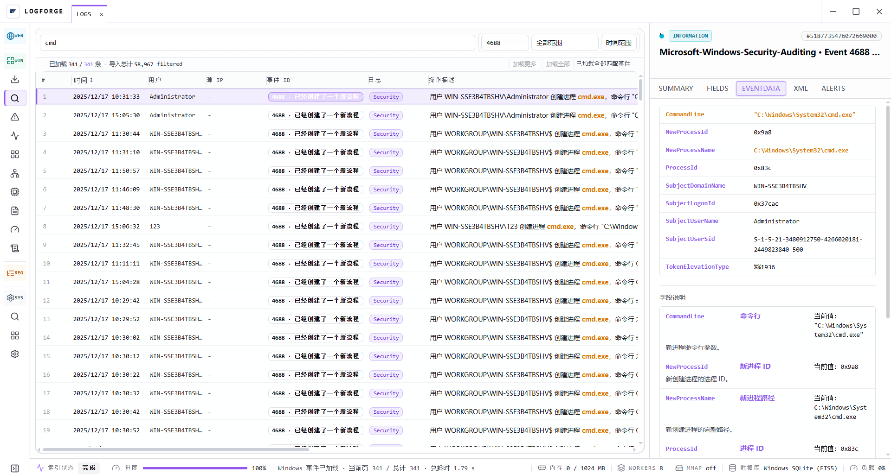

可以点击这里根据时间排序一下，因为知道修改完配置的时间是 2025-12-17 11:29:11 这个时候，所以看这个时间点之后的日志就行

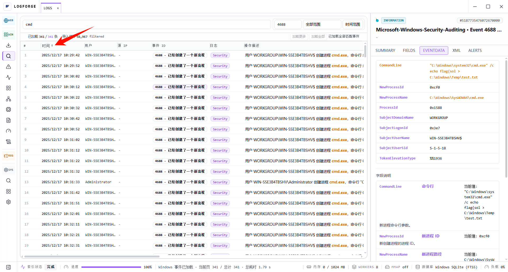

在攻击时间线上（xp_cmdshell 于 11:29:11 启用后），发现了一条关键记录：

```
2025-12-17 11:32:45 | "C:\Windows\system32\cmd.exe" /c echo flag{sol > C:\Windows\Temp\test.txt
```

很明显攻击者使用 `echo`​ 命令将一段测试内容重定向写入到 `C:\Windows\Temp\test.txt`​。选择 `C:\Windows\Temp` 目录是因为该目录通常对所有用户都有写入权限，是攻击者测试写入能力的常用位置。

> 并且在之前还执行了 whoami，ipconfig 这两个命令

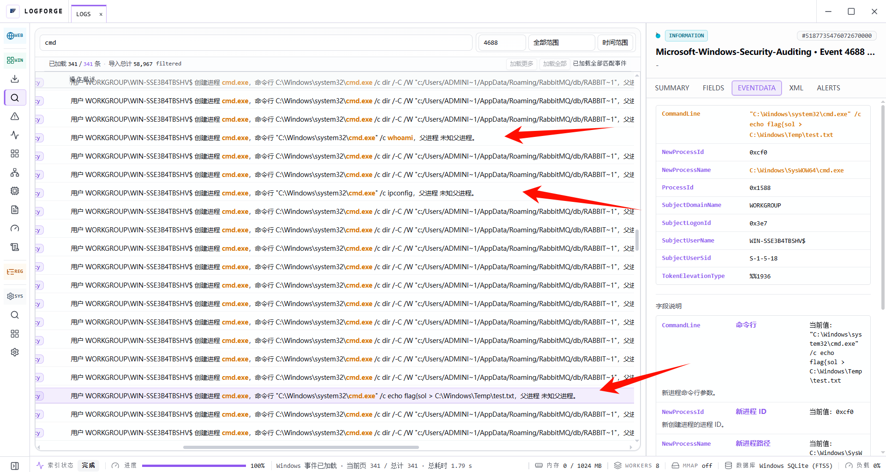

flag：flag{C:\Windows\Temp\test.txt}

## 任务5

思路：

> 任务名称：任务5
>
> 任务分数：100.00
>
> 任务类型：静态Flag
>
> 攻击者觉得通过数据库执行命令太麻烦，于是创建了一个系统后门用户 123。该后门用户的明文密码是什么？

思路：

依旧跟任务 4 一样继续分析 4688 事件 id，因为攻击者通过 xp_cmdshell 执行系统命令时会通过 cmd.exe 运行。然后搜索一下 `net` 关键字

> Windows 系统中创建用户的标准命令是 `net user <用户名> <密码> /add`，这个命令执行时会被安全审计记录。

从日志中发现了完整的后门用户创建过程：

```python
2025-12-17 11:46:09 | net user 123 33arsierting} /add
2025-12-17 11:48:30 | net localgroup administrators 123 /add
```

第一条命令创建了用户 `123`​，密码为 `33arsierting}`。第二条命令将该用户添加到 administrators 管理员组，使其获得系统最高权限。

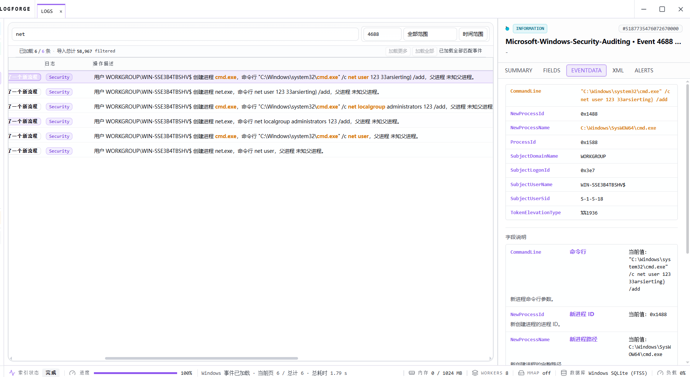

flag：flag{33arsierting}}

## 任务6

> 任务名称：任务6
>
> 任务分数：100.00
>
> 任务类型：静态Flag
>
> 在创建完后门用户后，攻击者使用远程桌面 (RDP) 登录了服务器。请找出用户 123 首次 RDP 登录成功的精确时间。flag格式为：flag{2025/01/01 15:00:00}

思路：

Event ID 4624 记录登录成功事件，其中 LogonType 字段标识登录类型：Type 10 表示远程交互式登录（RDP），Type 3 表示网络登录（RDP 认证过程中也会产生）。

直接过滤 4624 ，并且搜索一下 123 用户

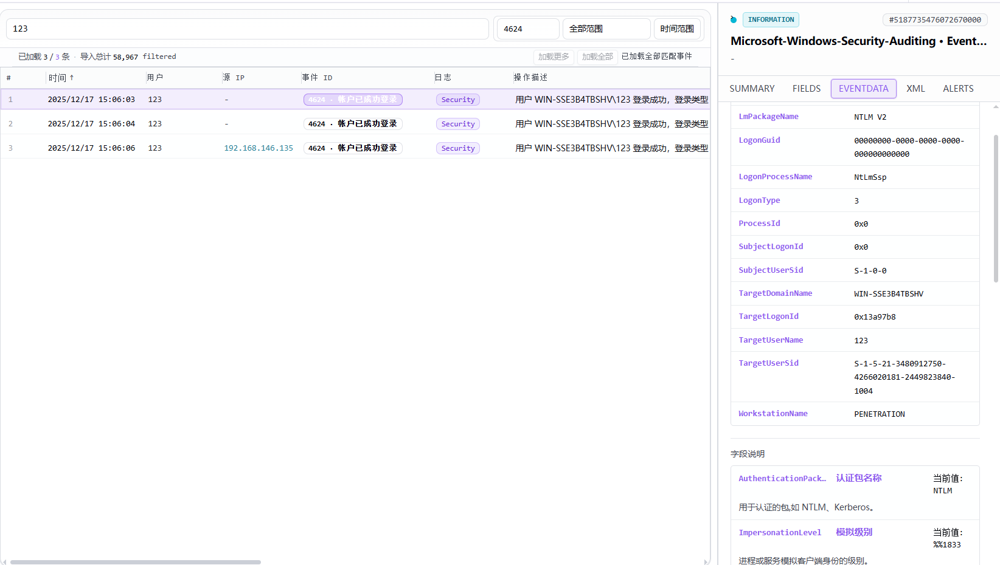

结果显示用户 123 有三条登录记录：

```
2025-12-17 15:06:03 | Type:3
2025-12-17 15:06:04 | Type:3  
2025-12-17 15:06:06 | Type:10
```

虽然 Type 10 是标准的 RDP 远程交互式登录类型，但 RDP 连接建立过程中会先进行网络认证（Type 3），然后才是交互式会话（Type 10）。题目要求的是"首次 RDP 登录成功"的时间，应该取整个 RDP 登录过程中最早的成功记录，即 15:06:03 的 Type 3 网络登录事件，这是 RDP 认证成功的第一个时间点。

flag：flag{2025/12/17 15:06:03}

## 任务7

> 任务名称：任务7
>
> 任务分数：100.00
>
> 任务类型：静态Flag
>
> 攻击者为了确保服务器重启后仍能控制机器，在系统中留下了三个持久化后门。 请找到这三处隐藏的字符串，并按以下顺序拼接：flag{flag1flag2flag3}

思路：

还给了一个注册表文件 regedit.reg，也导入我们的工具分析一下。

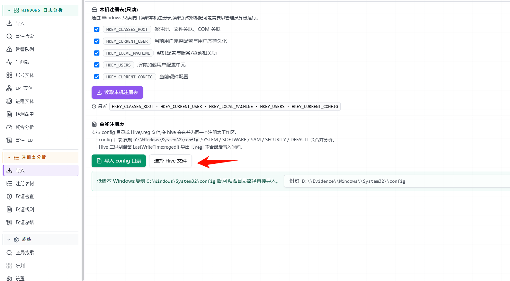

这里最快的方法就是去全局搜索，搜索flag1，flag2，flag3 这三个字符就能看到。

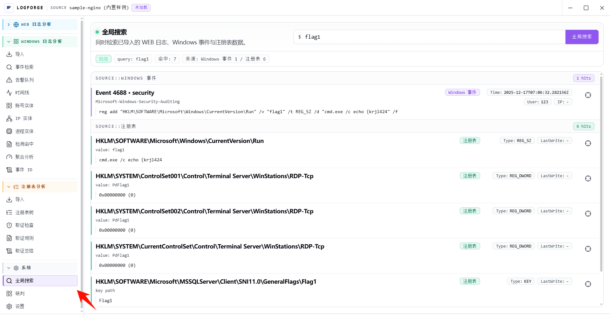

常规解法就是，题目说了留下了三个持久化后门，我们工具收集了一些注册表中常见的持久化路径，点击定位就能直接去看对应的注册表值

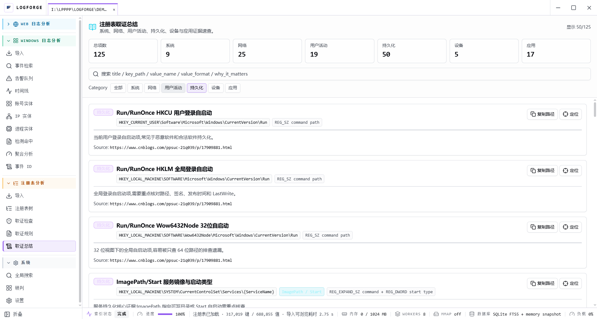

flag1  在 `HKEY_LOCAL_MACHINE\SOFTWARE\Microsoft\Windows\CurrentVersion\Run`

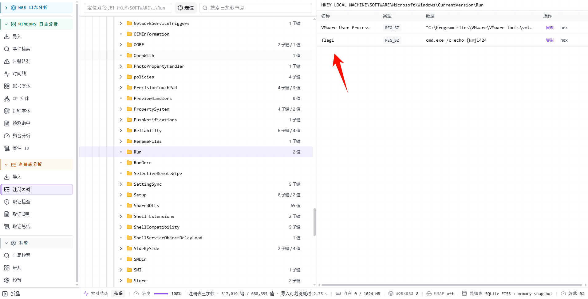

flag2

在计划任务树中找到 flag2 

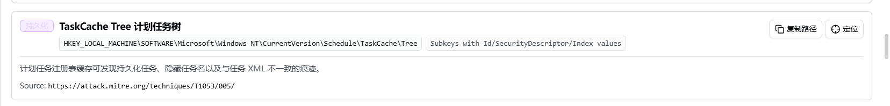

id 是 {1328DF70-1DD3-4DCA-B1DC-AAF70161C924}

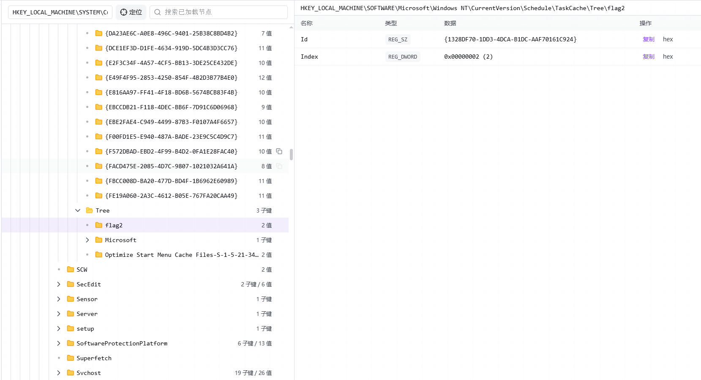

在 Tasks 找到对应的 id，hex 解密对应的就是 

```
cmd.exe /c echo wq3453dalb
```

> 这里是我工具的问题应该，没有显示完整字节。后面优化一下

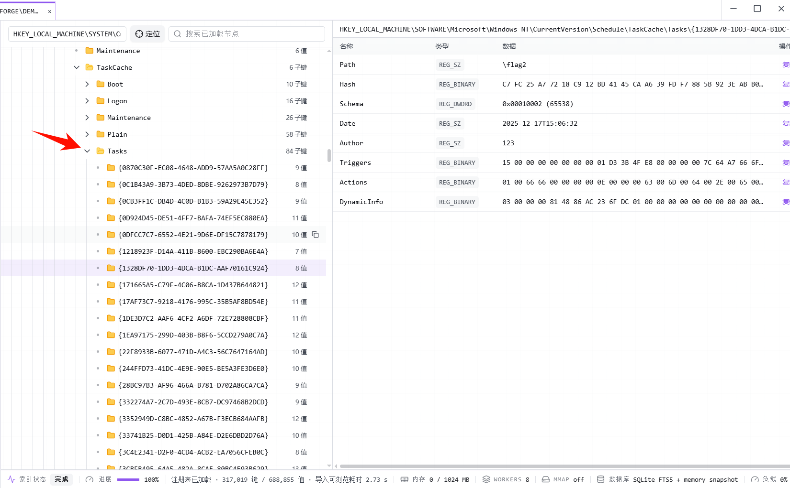

flag3

在系统服务中发现一个恶意服务

```python
HKEY_LOCAL_MACHINE\SYSTEM\CurrentControlSet\Services
```

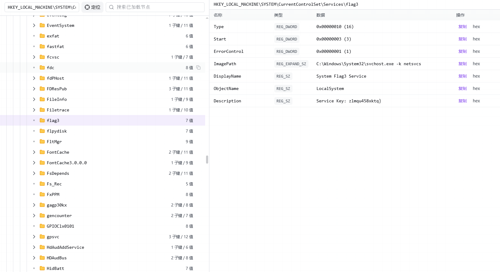

flag：flag{krjl424wq3453dalbzlmqu458xktq}

## 问题

这里我有个疑问，任务5 为什么事件 id 4720 没有记录到创建用户？

解答：

> 用过 ai 解答的，不一定准确

攻击链是：

```
sqlservr.exe -> cmd.exe -> net user 123 33arsierting} /add
```

你能看到 `4688`，说明当时启用了：

```
Audit Process Creation
```

所以系统记录了：

```
cmd.exe /c net user 123 33arsierting} /add
```

但 `4720` 属于另一类审计：

```
Audit User Account Management
```

如果这项没有启用成功审计，就不会记录，并且 `4720` 不记录命令行和密码

如果题目环境里有相关事件，可以搜这些：

|Event ID|含义|
| ----------| -------------------------------------|
|4719|系统审计策略被修改|
|4902|Per-user audit policy table created|
|4906|CrashOnAuditFail value changed|
|4907|Object auditing settings changed|
|4912|Per User Audit Policy changed|

我发现的是 4906 和 4912 没有找到相关的日志，所以感觉没有开启“User Account Management 成功审计”

> 4688 所属的 Process Creation 审计开启了；  
> 4720 所属的 User Account Management 审计没有开启，或没有成功事件审计；  
> 因此 net user 创建用户只留下了进程命令行，没有留下 4720 账户创建事件。

结论：

这题里 `4720` 记录不到后门用户创建事件，最合理解释是：

> 系统完整采集了 Security.evtx，但当时没有开启“User Account Management 成功审计”，所以创建用户行为没有生成 4720。与此同时，Process Creation 审计开启了，所以 4688 记录到了 `net user 123 33arsierting} /add` 的完整命令行。


---

> 作者: [lpppp](/)  
> URL: https://lpppp.xyz/posts/%E6%97%A5%E5%BF%97%E6%8E%92%E6%9F%A5/  

