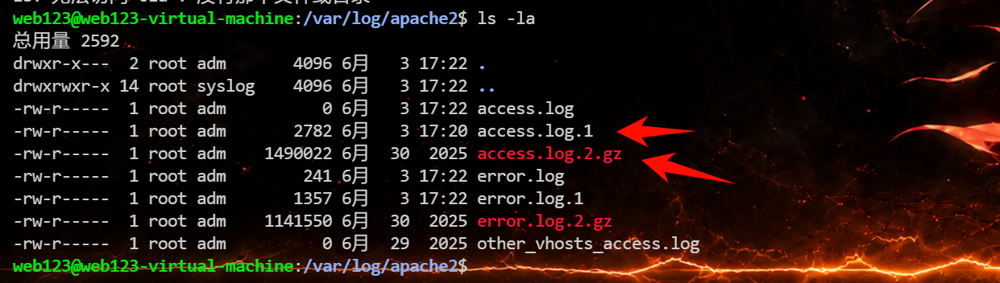
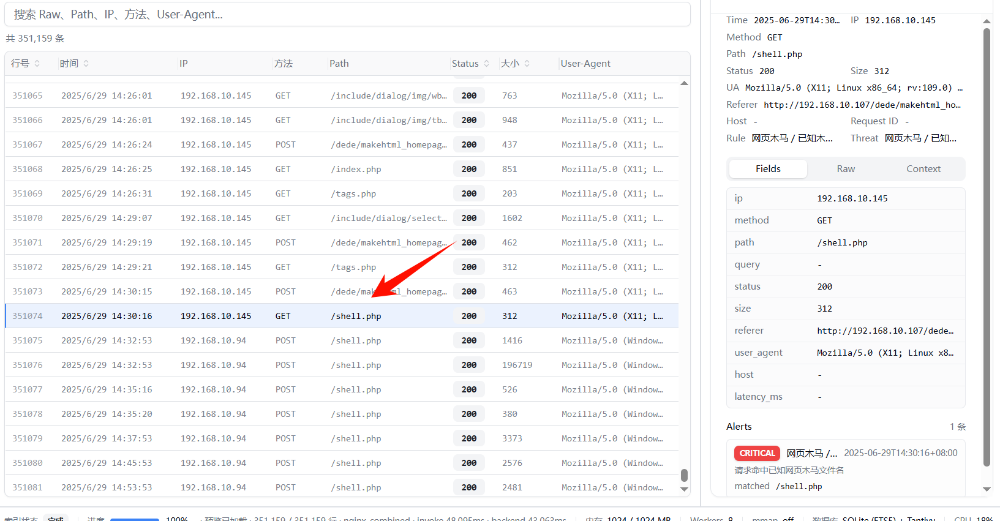
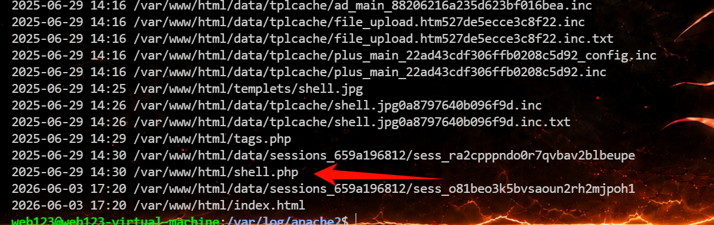
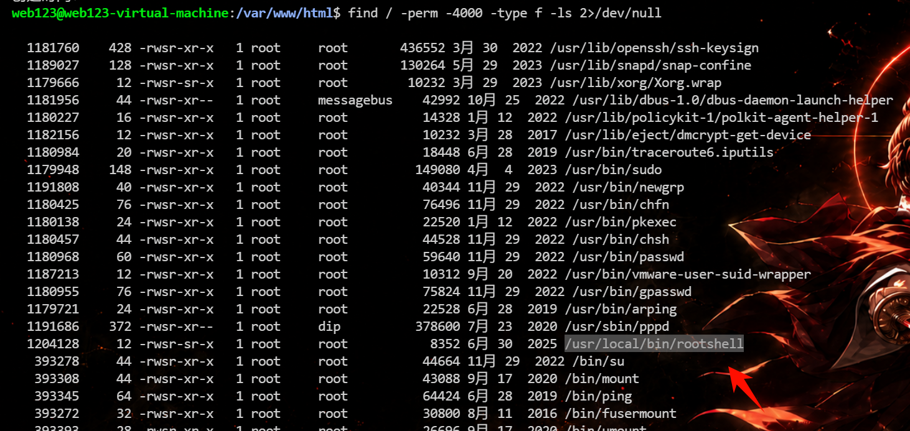
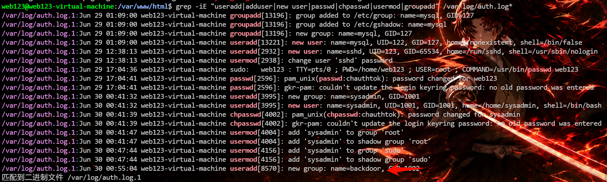
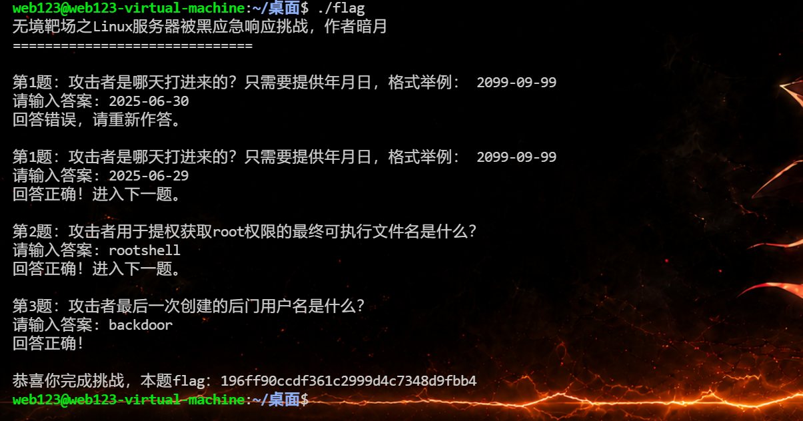

# 暗月：linux 服务器被黑应急响应


# 暗月：linux 服务器被黑应急响应

- [暗月：linux 服务器被黑应急响应 - 无境·网安靶场](https://bdziyi.com/ulab/lab.html?page=target-detail&id=38)

题目描述：

> Linux 服务器被黑应急响应靶场考点
>
> 该靶场环境来自暗月2025培训课程，请使用web123/Abc@1234 通过ssh远程连接，如需root使用sudo -i切换，flag答题程序在桌面文件夹中，执行后答题获取最终flag
>
> 1. 日志分析能力
>
> - Web 访问日志（Apache access.log / error.log）时间线提取与关键字检索
> - Linux 认证日志（/var/log/auth.log）登录成功/失败、sudo 使用记录解析
> - 日志轮换与压缩日志（\*.log.\* / \*.gz）的联合查询技巧（grep/zgrep）
> - 结合时间戳快速定位攻击路径与源头 IP
>
> 2. 文件系统取证
>
> - 基于 mtime/cmin 的近期文件查找（find -mtime -1 / -cmin -720）
> - 敏感后缀（\*.php \*.sh \*.so）与临时目录（/tmp /dev/shm /var/tmp）重点排查
> - 精确打印文件创建/改动时间（-printf %TY-%Tm-%Td %TH:%TM:%TS %p）
> - Web 根目录深掘与后门文件内容静态分析
>
> 3. 账号与权限审计
>
> - /etc/passwd、/etc/group 中 shell 用户与特权组（root、sudo）梳理
> - 用户家目录创建时间（ls -ld /home/\*）与系统新增账号定位
> - sudo 授权记录与提权操作复现
> - SUID 可执行文件扫描（find / -perm -u\=s -type f -mtime -2）与风险判定
>
> 4. 进程与网络监控
>
> - top / ps 实时进程观察，异常服务识别
> - netstat -anltp 网络连接清单，异常端口/外部 IP 定位
> - crontab、/etc/cron.\* 计划任务全面检查，持久化后门排查
>
> 5. Web 漏洞利用链复盘
>
> - 后台弱口令→登录→模板/缓存写入→GetShell 流程还原
> - 目录扫描（gobuster 特征）与后台功能滥用（makehtml\_homepage.php）关联分析
> - Webshell（加密 POST、AES128+eval）流量特征识别
>
> 6. 应急响应与加固
>
> - 攻击 IP 封禁、后门账号与文件清理
> - 系统与数据库口令重置、最小权限原则
> - 安全设备（防火墙、IPS、AV）部署与策略调优建议
> - 定期基线检测与日志集中收集方案

## 第1题：攻击者是哪天打进来的？只需要提供年月日，格式举例： 2099-09-99

思路：

​`netstat`​ 发现开了 80 端口，然后定位到 web 目录在 `/var/www/html/`

```python
web123@web123-virtual-machine:~$ netstat -nao
激活Internet连接 (服务器和已建立连接的)
Proto Recv-Q Send-Q Local Address           Foreign Address         State       Timer
tcp        0      0 127.0.0.1:3306          0.0.0.0:*               LISTEN      关闭 (0.00/0/0)
tcp        0      0 127.0.0.53:53           0.0.0.0:*               LISTEN      关闭 (0.00/0/0)
tcp        0      0 0.0.0.0:22              0.0.0.0:*               LISTEN      关闭 (0.00/0/0)
tcp        0      0 127.0.0.1:631           0.0.0.0:*               LISTEN      关闭 (0.00/0/0)
tcp        0      1 192.168.111.20:60104    1.1.1.1:53              SYN_SENT    打开 (0.14/1/0)
tcp        0     52 192.168.111.20:22       192.168.111.25:31937    ESTABLISHED 打开 (0.28/0/0)
tcp        0      1 192.168.111.20:55928    8.8.8.8:53              SYN_SENT    打开 (0.14/1/0)
tcp6       0      0 :::80                   :::*                    LISTEN      关闭 (0.00/0/0)
tcp6       0      0 :::22                   :::*                    LISTEN      关闭 (0.00/0/0)
tcp6       0      0 ::1:631                 :::*                    LISTEN      关闭 (0.00/0/0)
udp        0      0 0.0.0.0:43377           0.0.0.0:*                           关闭 (0.00/0/0)
udp        0      0 0.0.0.0:631             0.0.0.0:*                           关闭 (0.00/0/0)
udp        0      0 127.0.0.1:60496         127.0.0.53:53           ESTABLISHED 关闭 (0.00/0/0)
udp        0      0 0.0.0.0:5353            0.0.0.0:*                           关闭 (0.00/0/0)
udp        0      0 127.0.0.53:53           0.0.0.0:*                           关闭 (0.00/0/0)
udp6       0      0 :::52309                :::*                                关闭 (0.00/0/0)
udp6       0      0 :::5353                 :::*                                关闭 (0.00/0/0)
raw6       0      0 :::58                   :::*                    7           关闭 (0.00/0/0)
```

Web 服务器，查访问日志，常见路径：确实是 `apache2`​ 服务，最后分析一下 `access` 相关的日志

```
/var/log/nginx/access.log*
/var/log/apache2/access.log*
/var/log/httpd/access_log*
```



最后定位到日志中出现了  shell.php，第一条的时间就是 `2025/6/29 14:30:16`，并且在网站根目录下



然后回到服务器具体分析一下这个文件的时间，能确定答案就是 `2025-06-29`

```python
web123@web123-virtual-machine:/var/www/html$ stat shell.php 
  文件：shell.php
  大小：643             块：8          IO 块：4096   普通文件
设备：801h/2049d        Inode：661045      硬链接：1
权限：(0644/-rw-r--r--)  Uid：(   33/www-data)   Gid：(   33/www-data)
最近访问：2025-06-29 14:30:16.401849490 +0800
最近更改：2025-06-29 14:30:15.381843010 +0800
最近改动：2025-06-29 14:30:15.381843010 +0800
创建时间：-
web123@web12
```

也可以直接在服务上进行分析如下

查最近修改文件：

```
find /var/www -type f -printf "%TY-%Tm-%Td %TH:%TM %p\n" | sort
```



查可疑脚本：

```
find /var/www -type f \( -name "*.php" -o -name "*.jsp" -o -name "*.sh" \) -printf "%TY-%Tm-%Td %TH:%TM %p\n" | sort
```

flag：2025-06-29

## 第2题：攻击者用于提权获取root权限的最终可执行文件名是什么？

先 `sudo -i`​ 切换到 root 权限然后查看一下 `/root/.bash_history`​，这个文件保存了当前用户使用过的历史命令。也可以使用 `history` 命令查看

```bash
root@web123-virtual-machine:~# cat .bash_history
cd /var/www/html
ls
wget https://updatenew.dedecms.com/base-v57/package/patch-v57sp2&v57sp1&v57-20250219.zip
ls
rm -rf **
ls
wget https://updatenew.dedecms.com/base-v57/package/DedeCMS-V5.7.117-UTF8.zip
unzip
unzip DedeCMS-V5.7.117-UTF8.zip 
ls
cp -r uploads/* .
ls
cd uploads/
ls
rm -rf **
ls
cd ..
ls
cd ..
chown -R www-data:www-data /var/www/html
cd html
ls -al
ifconfig
sudo apt install openssh-server
ps aux
ps aux | ssh
ps aux | grep ssh
ifcofig
ifconfig
ls
cat tags.php
ls -al
cat tags.php
cat shell.php
exit
id
useradd -m -s /bin/bash sysadmin
echo 'sysadmin:My@StrongP@ssw0rd' | chpasswd
usermod -aG root sysadmin
su usermod -aG sudo sysadmin
usermod -aG sudo sysadmin
apt install gcc
vi #include <stdio.h>
ls
clear
ls
vi rootshell.c
gcc rootshell.c -o /usr/local/bin/rootshell
chmod +s /usr/local/bin/rootshell
exit
```

然后能看到一条命令，编译了一个 `rootshell`​ 程序 `gcc rootshell.c -o /usr/local/bin/rootshell`，很明显就知道是提升权限的工具

如果没有 root 权限，通过查 SUID 提权文件也能发现攻击者可能上传或生成 SUID root 后门。

```bash
find / -perm -4000 -type f -ls 2>/dev/null
```



flag：rootshell

## 第3题：攻击者最后一次创建的后门用户名是什么？

先看看 `/etc/passwd`​ ，很多攻击者会直接把后门用户追加到 `/etc/passwd` 末尾，

```bash
web123@web123-virtual-machine:/var/www/html$ cat /etc/passwd
root:x:0:0:root:/root:/bin/bash
daemon:x:1:1:daemon:/usr/sbin:/usr/sbin/nologin
bin:x:2:2:bin:/bin:/usr/sbin/nologin
sys:x:3:3:sys:/dev:/usr/sbin/nologin
sync:x:4:65534:sync:/bin:/bin/sync
games:x:5:60:games:/usr/games:/usr/sbin/nologin
man:x:6:12:man:/var/cache/man:/usr/sbin/nologin
lp:x:7:7:lp:/var/spool/lpd:/usr/sbin/nologin
mail:x:8:8:mail:/var/mail:/usr/sbin/nologin
news:x:9:9:news:/var/spool/news:/usr/sbin/nologin
uucp:x:10:10:uucp:/var/spool/uucp:/usr/sbin/nologin
proxy:x:13:13:proxy:/bin:/usr/sbin/nologin
www-data:x:33:33:www-data:/var/www:/usr/sbin/nologin
backup:x:34:34:backup:/var/backups:/usr/sbin/nologin
list:x:38:38:Mailing List Manager:/var/list:/usr/sbin/nologin
irc:x:39:39:ircd:/var/run/ircd:/usr/sbin/nologin
gnats:x:41:41:Gnats Bug-Reporting System (admin):/var/lib/gnats:/usr/sbin/nologin
nobody:x:65534:65534:nobody:/nonexistent:/usr/sbin/nologin
systemd-network:x:100:102:systemd Network Management,,,:/run/systemd/netif:/usr/sbin/nologin
systemd-resolve:x:101:103:systemd Resolver,,,:/run/systemd/resolve:/usr/sbin/nologin
syslog:x:102:106::/home/syslog:/usr/sbin/nologin
messagebus:x:103:107::/nonexistent:/usr/sbin/nologin
_apt:x:104:65534::/nonexistent:/usr/sbin/nologin
uuidd:x:105:111::/run/uuidd:/usr/sbin/nologin
avahi-autoipd:x:106:112:Avahi autoip daemon,,,:/var/lib/avahi-autoipd:/usr/sbin/nologin
usbmux:x:107:46:usbmux daemon,,,:/var/lib/usbmux:/usr/sbin/nologin
dnsmasq:x:108:65534:dnsmasq,,,:/var/lib/misc:/usr/sbin/nologin
rtkit:x:109:114:RealtimeKit,,,:/proc:/usr/sbin/nologin
cups-pk-helper:x:110:116:user for cups-pk-helper service,,,:/home/cups-pk-helper:/usr/sbin/nologin
speech-dispatcher:x:111:29:Speech Dispatcher,,,:/var/run/speech-dispatcher:/bin/false
whoopsie:x:112:117::/nonexistent:/bin/false
kernoops:x:113:65534:Kernel Oops Tracking Daemon,,,:/:/usr/sbin/nologin
saned:x:114:119::/var/lib/saned:/usr/sbin/nologin
avahi:x:115:120:Avahi mDNS daemon,,,:/var/run/avahi-daemon:/usr/sbin/nologin
colord:x:116:121:colord colour management daemon,,,:/var/lib/colord:/usr/sbin/nologin
hplip:x:117:7:HPLIP system user,,,:/var/run/hplip:/bin/false
geoclue:x:118:122::/var/lib/geoclue:/usr/sbin/nologin
pulse:x:119:123:PulseAudio daemon,,,:/var/run/pulse:/usr/sbin/nologin
gnome-initial-setup:x:120:65534::/run/gnome-initial-setup/:/bin/false
gdm:x:121:125:Gnome Display Manager:/var/lib/gdm3:/bin/false
web123:x:1000:1000:web123,,,:/home/web123:/bin/bash
mysql:x:122:127:MySQL Server,,,:/nonexistent:/bin/false
sshd:x:123:65534::/run/sshd:/usr/sbin/nologin
sysadmin:x:1001:1001::/home/sysadmin:/bin/bash
backdoor:x:1002:1002::/home/backdoor:/bin/bash
```

还能查用户创建日志

### Debian / Ubuntu

```
grep -iE "useradd|adduser|new user|passwd|chpasswd|usermod|groupadd" /var/log/auth.log*
```

### CentOS / RHEL

```
grep -iE "useradd|adduser|new user|passwd|chpasswd|usermod|groupadd" /var/log/secure*
```

‍

```bash
web123@web123-virtual-machine:/var/www/html$ grep -iE "useradd|adduser|new user|passwd|chpasswd|usermod|groupadd" /var/log/auth.log*
/var/log/auth.log.1:Jun 29 01:09:00 web123-virtual-machine groupadd[13196]: group added to /etc/group: name=mysql, GID=127
/var/log/auth.log.1:Jun 29 01:09:00 web123-virtual-machine groupadd[13196]: group added to /etc/gshadow: name=mysql
/var/log/auth.log.1:Jun 29 01:09:00 web123-virtual-machine groupadd[13196]: new group: name=mysql, GID=127
/var/log/auth.log.1:Jun 29 01:09:00 web123-virtual-machine useradd[13221]: new user: name=mysql, UID=122, GID=127, home=/nonexistent, shell=/bin/false
/var/log/auth.log.1:Jun 29 12:38:13 web123-virtual-machine useradd[2932]: new user: name=sshd, UID=123, GID=65534, home=/run/sshd, shell=/usr/sbin/nologin
/var/log/auth.log.1:Jun 29 12:38:13 web123-virtual-machine usermod[2938]: change user 'sshd' password
/var/log/auth.log.1:Jun 29 17:04:36 web123-virtual-machine sudo:   web123 : TTY=pts/0 ; PWD=/home/web123 ; USER=root ; COMMAND=/usr/bin/passwd web123
/var/log/auth.log.1:Jun 29 17:04:41 web123-virtual-machine passwd[2596]: pam_unix(passwd:chauthtok): password changed for web123
/var/log/auth.log.1:Jun 29 17:04:41 web123-virtual-machine passwd[2596]: gkr-pam: couldn't update the login keyring password: no old password was entered
/var/log/auth.log.1:Jun 30 00:41:32 web123-virtual-machine useradd[3995]: new group: name=sysadmin, GID=1001
/var/log/auth.log.1:Jun 30 00:41:32 web123-virtual-machine useradd[3995]: new user: name=sysadmin, UID=1001, GID=1001, home=/home/sysadmin, shell=/bin/bash
/var/log/auth.log.1:Jun 30 00:41:39 web123-virtual-machine chpasswd[4002]: pam_unix(chpasswd:chauthtok): password changed for sysadmin
/var/log/auth.log.1:Jun 30 00:41:39 web123-virtual-machine chpasswd[4002]: gkr-pam: couldn't update the login keyring password: no old password was entered
/var/log/auth.log.1:Jun 30 00:41:47 web123-virtual-machine usermod[4004]: add 'sysadmin' to group 'root'
/var/log/auth.log.1:Jun 30 00:41:47 web123-virtual-machine usermod[4004]: add 'sysadmin' to shadow group 'root'
/var/log/auth.log.1:Jun 30 00:47:44 web123-virtual-machine usermod[4156]: add 'sysadmin' to group 'sudo'
/var/log/auth.log.1:Jun 30 00:47:44 web123-virtual-machine usermod[4156]: add 'sysadmin' to shadow group 'sudo'
/var/log/auth.log.1:Jun 30 00:55:04 web123-virtual-machine useradd[8570]: new group: name=backdoor, GID=1002
匹配到二进制文件 /var/log/auth.log.1
```

日志中最后一次用户相关创建记录是：



```
Jun 30 00:55:04 useradd[8570]: new group: name=backdoor, GID=1002
```

结合 `/etc/passwd`​ 可确认后续创建了用户 `backdoor`。

另外：

```
sysadmin
```

也很可疑，因为它被加入了 `root`​ 和 `sudo` 组：

```
add 'sysadmin' to group 'root'
add 'sysadmin' to group 'sudo'
```

但它创建时间是：

```
Jun 30 00:41:32
```

早于 `backdoor` 的：

```
Jun 30 00:55:04
```

所以攻击者最后一次创建的后门用户名是：backdoor

flag：backdoor




---

> 作者: [lpppp](/)  
> URL: https://lpppp.xyz/posts/%E6%9A%97%E6%9C%88-linux-%E6%9C%8D%E5%8A%A1%E5%99%A8%E8%A2%AB%E9%BB%91%E5%BA%94%E6%80%A5%E5%93%8D%E5%BA%94/  

