# 环境搭建


# 环境搭建

- [javasec_study/java代码审计-环境搭建+前置知识.md at master · proudwind/javasec_study](https://github.com/proudwind/javasec_study/blob/master/java%E4%BB%A3%E7%A0%81%E5%AE%A1%E8%AE%A1-%E7%8E%AF%E5%A2%83%E6%90%AD%E5%BB%BA%2B%E5%89%8D%E7%BD%AE%E7%9F%A5%E8%AF%86.md)
- ‍

## 新建项目

使用 idea 创建

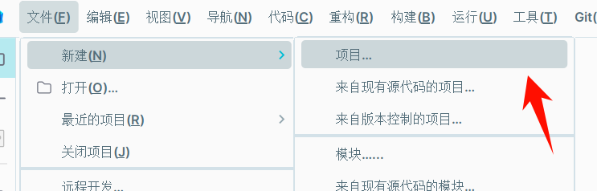

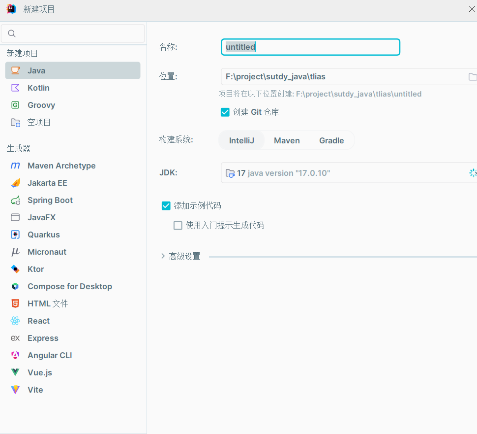

简单解释一下左边 IDEA 的项目模板 / 生成器

### Java

普通 Java 项目。

适合：

- 学 Java 基础
- 写算法题
- 写普通控制台程序
- 写简单工具类
- 不依赖复杂框架的小项目

右侧可以选构建系统：

|构建系统|适合场景|
| ----------| ---------------------------------------|
|IntelliJ|最简单，IDEA 自己管理项目|
|Maven|Java 最常用依赖管理工具|
|Gradle|更现代，Android / Kotlin / 大项目常见|

### Kotlin

Kotlin 是 JetBrains 推的 JVM 语言，能和 Java 互相调用。

适合：

- Android 开发
- Kotlin 后端
- Kotlin 脚本
- 想学更现代 JVM 语言

### Groovy

Groovy 项目。

Groovy 也是 JVM 语言，语法比 Java 动态。

常见用途：

- Gradle 构建脚本
- Jenkins Pipeline
- 一些自动化脚本

### Maven Archetype

基于 Maven 模板创建项目。

​`Archetype` 可以理解为 Maven 的项目脚手架。

适合：

- 创建标准 Maven 项目
- 创建老式 Java Web 项目
- 使用特定模板生成工程

比如会生成：

```
pom.xml
src/main/java
src/test/java
```

如果你学 Java 后端、依赖管理，可以选它。

但现在更常见的是直接选：

```
Java -> Maven
```

而不是 Maven Archetype。

### Jakarta EE

企业级 Java Web 项目。

以前叫 Java EE，后来改名 Jakarta EE。

适合：

- Servlet
- JSP
- JPA
- CDI
- WebSocket
- 企业级 Java Web 应用

常见部署到：

```
Tomcat
WildFly
GlassFish
Payara
```

如果你学的是传统 Java Web，比如：

```
Servlet + JSP + Tomcat
```

可以选它。

如果你学 Spring Boot，就不要选它。

### Spring Boot

最常用的 Java 后端项目模板。

适合：

- Web API
- 后端服务
- REST 接口
- 数据库项目
- 微服务
- Java 后端开发

会生成类似：

```
pom.xml / build.gradle
src/main/java
Application.java
application.yml
```

这是 Java 后端最推荐的入口。

### JavaFX

Java 桌面 GUI 项目。

适合写 Windows 桌面程序界面，例如：

- 小工具
- 客户端软件
- 图形界面程序
- 本地管理器

类似以前的 Swing，但更现代。

### Quarkus

Java 云原生框架。

特点：

- 启动快
- 内存占用低
- 适合容器化
- 支持 GraalVM Native Image

适合：

- 微服务
- Kubernetes
- 云原生应用
- 高性能后端服务

但生态和学习资料不如 Spring Boot 多。初学 Java 后端建议先学 Spring Boot。

### Micronaut

也是 Java / Kotlin 云原生框架。

特点：

- 编译期依赖注入
- 启动快
- 适合微服务
- 对 serverless 友好

和 Quarkus 类似，属于 Spring Boot 的替代方案。

### Ktor

Kotlin 后端框架。

适合：

- Kotlin Web API
- Kotlin 服务端
- 轻量后端

### Compose for Desktop

Kotlin 桌面 GUI 项目。

相当于用 Kotlin + Compose 写桌面应用。

适合：

- Windows 桌面工具
- 跨平台客户端
- Kotlin GUI 应用

## Tomcat

- https://tomcat.apache.org/

Tomcat 可以理解为“运行 Java Web 项目的服务器”。比如：

> 你写了一个 Java Web 项目，比如登录、注册、查询员工信息，这些代码不能直接像普通 `main` 方法那样独立处理浏览器请求。  
> 需要一个服务器接收浏览器请求，再把请求交给你的 Java 代码处理。这个服务器就可以是 Tomcat。

### Tomcat 是干什么的？

Tomcat 主要负责三件事：

**1）接收浏览器请求**

比如你访问：

```
http://localhost:8080/login
```

浏览器会把请求发给 Tomcat。

**2）找到对应的 Java 程序**

比如你的项目里有一个 Servlet：

```
@WebServlet("/login")
public class LoginServlet extends HttpServlet {
    // ...
}
```

Tomcat 看到 `/login`​ 这个地址，就会把请求交给 `LoginServlet`。

**3）把结果返回给浏览器**

你的 Java 代码处理完后，Tomcat 再把结果返回给浏览器。

比如返回：

```
登录成功
```

或者返回 JSON：

```
{
  "code": 1,
  "msg": "success"
}
```

### Tomcat 和 Servlet 的关系

**Servlet 是什么？**

Servlet 是 Java Web 里的一个组件，专门用来处理 HTTP 请求。

比如：

```java
@WebServlet("/hello")
public class HelloServlet extends HttpServlet {
    protected void doGet(HttpServletRequest request, HttpServletResponse response) {
        // 处理浏览器 GET 请求
    }
}
```

**Tomcat 是什么？**

Tomcat 是 Servlet 的运行环境。

也就是说：

```
Servlet 是你写的处理请求的代码
Tomcat 是运行 Servlet 的服务器
```

类似关系：

```
Java 代码 需要 JVM 运行
Servlet 需要 Tomcat 运行
```

### Tomcat 适合运行什么项目？

Tomcat 常用于运行：

```
Servlet 项目
JSP 项目
传统 Java Web 项目
Spring MVC 项目
```

### 安装Tomcat

下载 Tomcat 9 

[Apache Tomcat® - Apache Tomcat 9 Software Downloads](https://tomcat.apache.org/download-90.cgi)

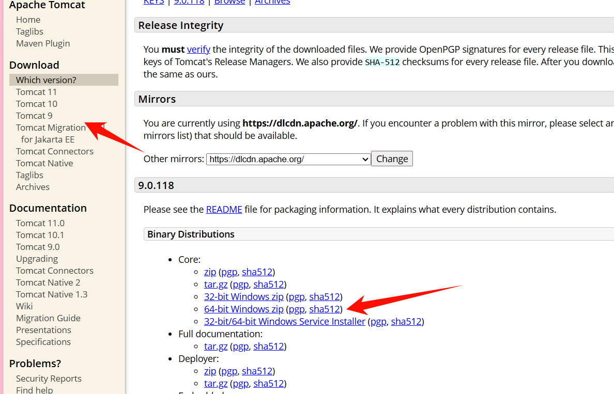

在安装 tomcat 之前必须安装 java 环境

测试一下 Tomcat

双击打开后找到 bin目录下的 startup.bat ，双击启动Tomcat

如果乱码的话，跟我下面一样

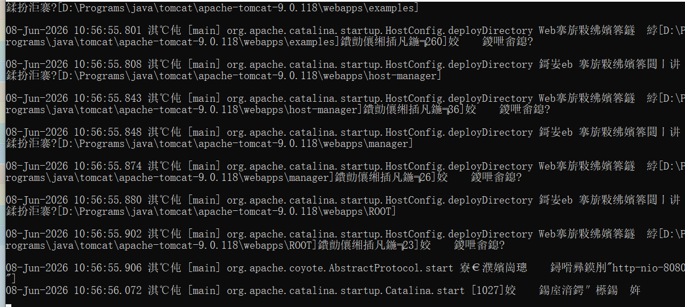

修改下面这个文件

```python
apache-tomcat-9.0.118\conf\logging.properties
```

把：

```
java.util.logging.ConsoleHandler.encoding = UTF-8
```

改成：

```
java.util.logging.ConsoleHandler.encoding = GBK
```

然后重启 Tomcat。

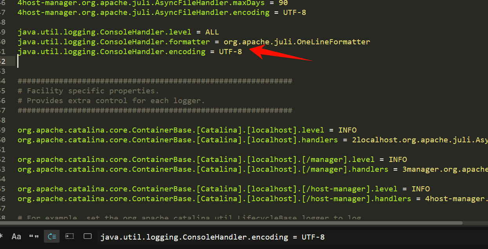

就不会乱码了，不过解不解决应该问题不大，主要就是测试一下

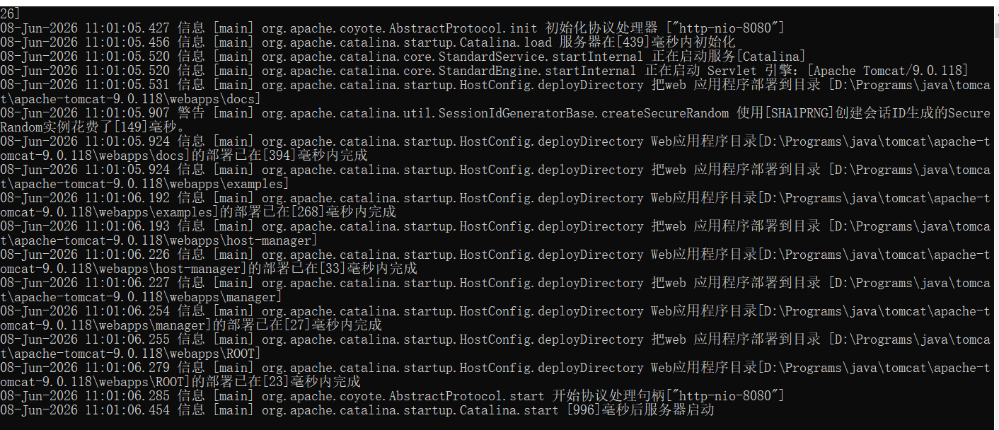

然后访问 http://localhost:8080 即可

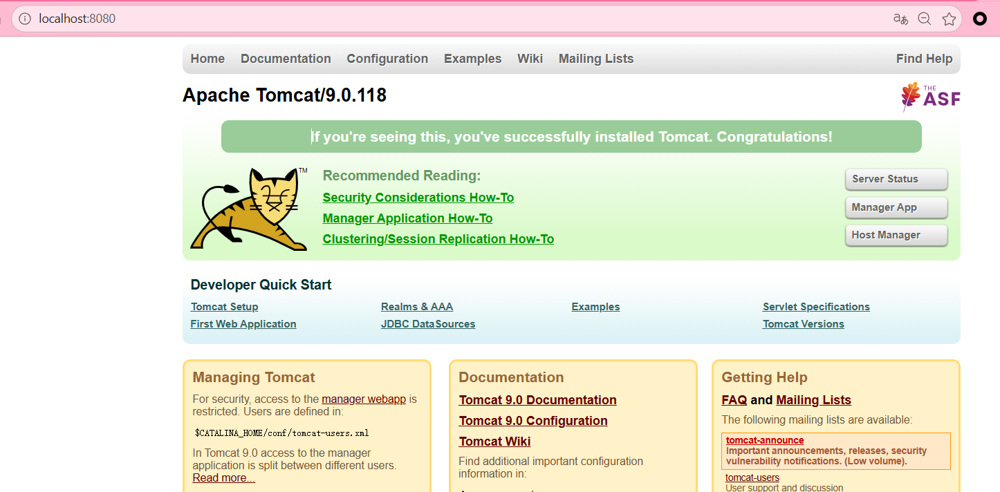

### IDEA 中配置 Tomcat

在 File 中选择 Settings

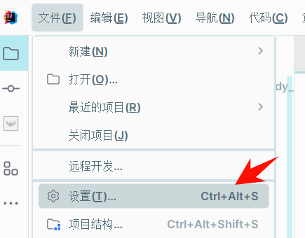

然后在Build,Execution,Deployment 中选择 Application Servers 点击加号“+”，就可以添加 Tomcat Server 

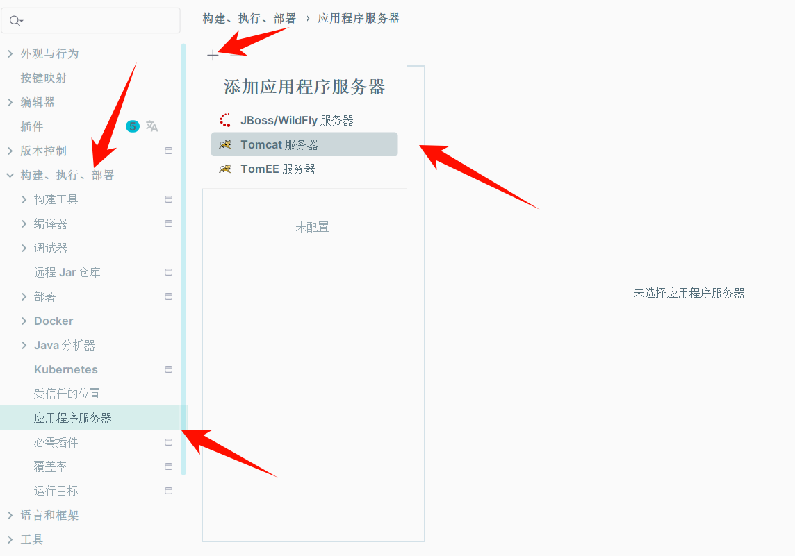

然后选择刚在安装的目录即可

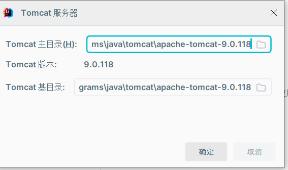

最后点击 Apply 再点 OK 就好了

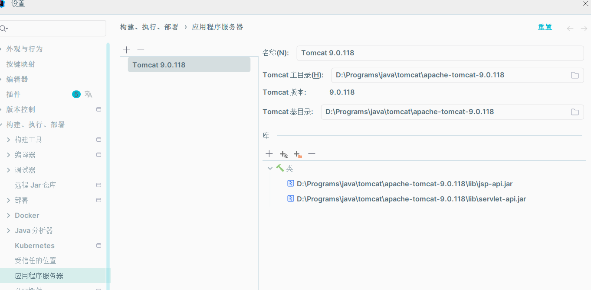

后面有些项目要用 Tomcat 启动，在说怎么配置。在 idea 上方工具栏中找到 Run，选择 Edit Configurations… 

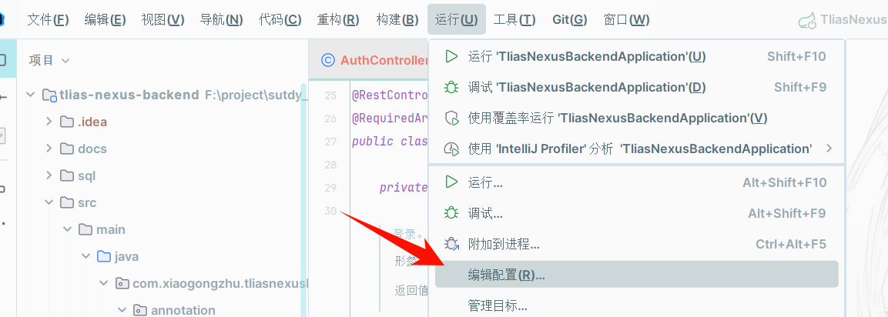

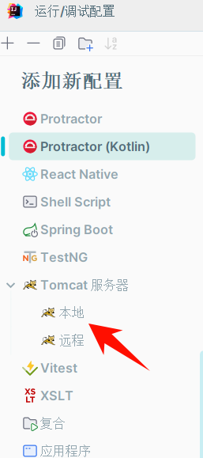

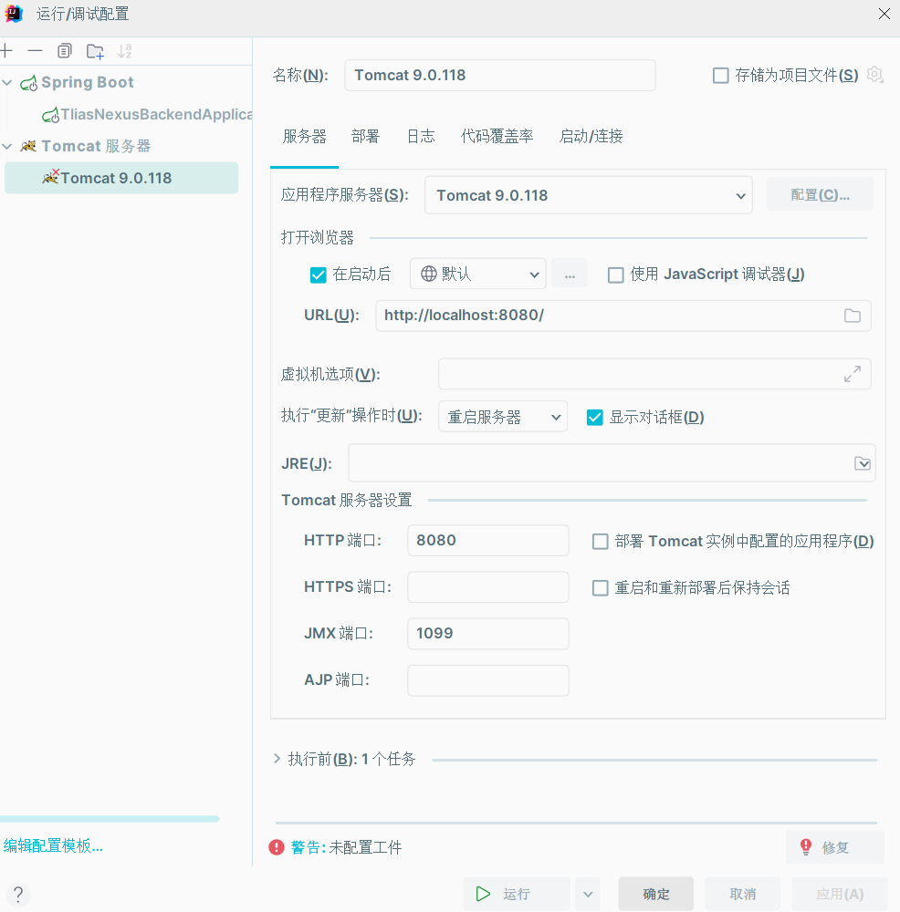

然后点击 Apply，再点击 OK 即可

## Maven 

### Maven 是什么

> Maven 是管理项目和依赖的工具。

以前写 Java，如果要用别人的库，比如 MySQL 驱动、JUnit、Spring，你需要自己去网上下载 `.jar` 文件，然后手动导入。

Maven 出现后，你只需要在 `pom.xml` 里写依赖，例如：

```xml
<dependency>
    <groupId>mysql</groupId>
    <artifactId>mysql-connector-j</artifactId>
    <version>8.4.0</version>
</dependency>
```

Maven 会自动去仓库下载这个 jar 以及它需要的其他 jar。

Maven 项目的核心文件：`pom.xml` 是 Maven 项目的配置文件。

比如：

```
<project>
    <modelVersion>4.0.0</modelVersion>

    <groupId>com.example</groupId>
    <artifactId>demo</artifactId>
    <version>1.0-SNAPSHOT</version>
</project>
```

常见含义：

|配置|含义|
| ------| ------------------------|
|​`groupId`|组织名 / 公司名 / 包名|
|​`artifactId`|项目名|
|​`version`|项目版本|
|​`dependencies`|依赖列表|
|​`build`|构建配置|

### Maven 标准目录结构

普通 Maven 项目一般长这样：

```
demo/
├─ pom.xml
└─ src/
   ├─ main/
   │  ├─ java/
   │  │  └─ com/example/App.java
   │  └─ resources/
   └─ test/
      └─ java/
```

含义：

```
src/main/java       放 Java 源码
src/main/resources  放配置文件
src/test/java       放测试代码
pom.xml             Maven 配置
```

Spring Boot 项目基本也遵循这个结构。

### Maven 下载安装

Maven 需要 Java 环境。必须先安装好 java

官网下载 Maven，https://maven.apache.org/download.cgi，

下载这个：

```
Binary zip archive
```

文件名类似：

```
apache-maven-3.9.11-bin.zip
```

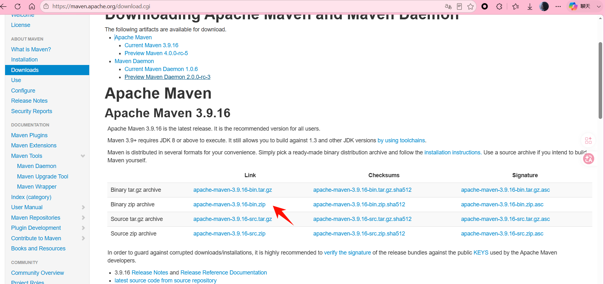

### 配置环境变量

在“系统变量”里新建：

```
变量名：MAVEN_HOME
变量值：D:\Programs\java\maven\apache-maven-3.9.9
```

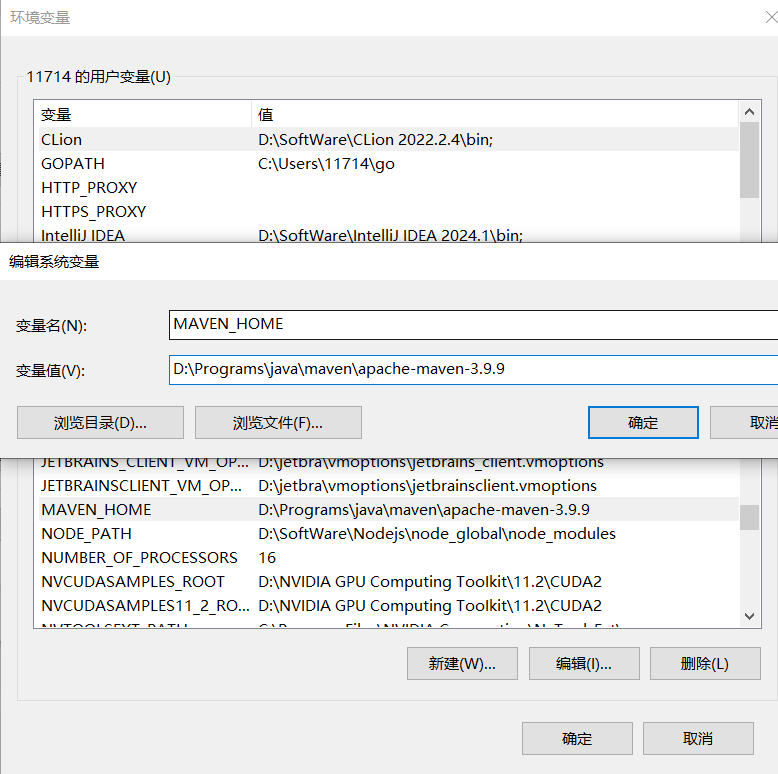

配置 `Path`，找到系统变量里的：Path

点编辑，新增：

```
%MAVEN_HOME%\bin
```

一路确定保存。

验证安装，执行

```xml
mvn -v
```

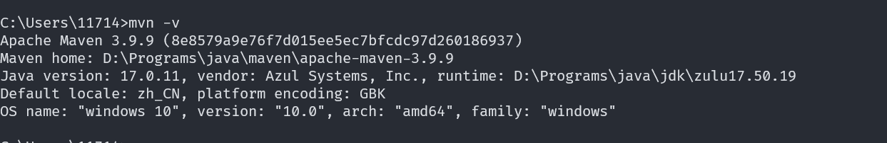

### 配置 Maven 本地仓库

Maven 下载的 jar 默认放在：

```
C:\Users\你的用户名\.m2\repository
```

你也可以改到 D 盘或 F 盘，例如：

```
D:\Programs\java\maven\repository
```

编辑：

```
D:\Programs\java\maven\apache-maven-3.9.9\conf\settings.xml
```

找到或添加：

```
<localRepository>D:\Programs\java\maven\repository</localRepository>
```

位置在 `<settings>` 标签里面。

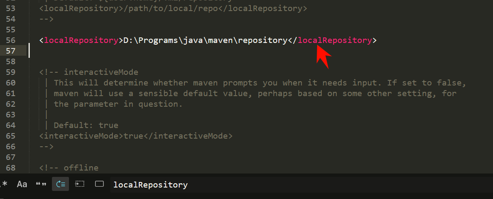

### 配置国内镜像，下载更快

编辑

```xml
D:\Programs\java\maven\apache-maven-3.9.9\conf\settings.xml
```

找到：

```
<mirrors>
```

添加阿里云镜像：

```xml
<mirror>
    <id>aliyunmaven</id>
    <mirrorOf>central</mirrorOf>
    <name>Aliyun Maven</name>
    <url>https://maven.aliyun.com/repository/central</url>
</mirror>
```

大概结构是：

```xml
<mirrors>
    <mirror>
        <id>aliyunmaven</id>
        <mirrorOf>central</mirrorOf>
        <name>Aliyun Maven</name>
        <url>https://maven.aliyun.com/repository/central</url>
    </mirror>
</mirrors>
```

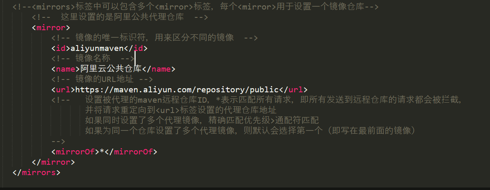

### IDEA 里配置 Maven

打开 IDEA：

```
File
→ Settings
→ Build, Execution, Deployment
→ Build Tools
→ Maven
```

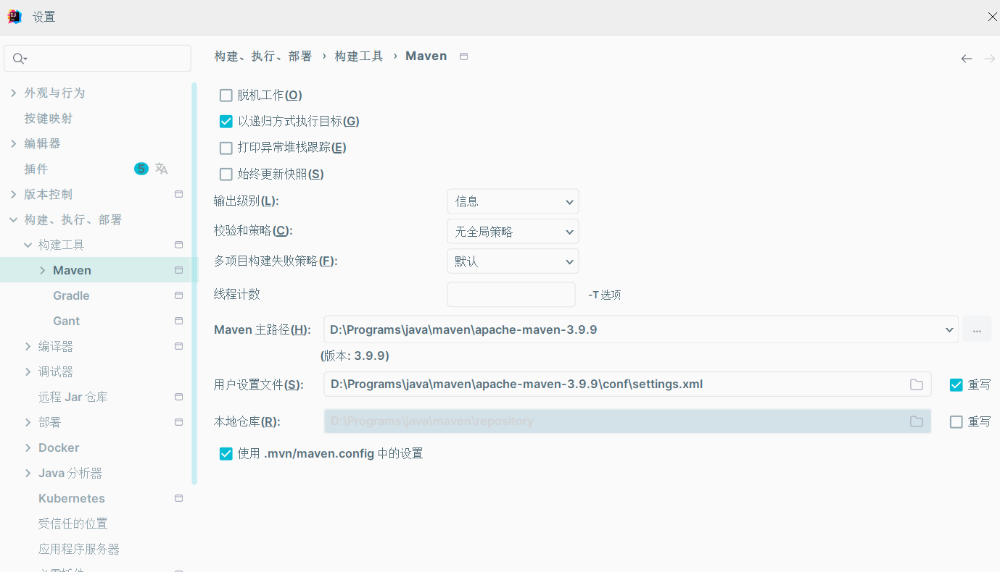

## 创建普通 Java / Maven 项目

- https://github.com/iamvisshu/StudentManagementSystem
- https://github.com/piczmar/pure-java-rest-api
- ‍

1. 点击 New Project
2. 选择 Java
3. 填写：

   - Name：项目名，例如 `java-basic-demo`
   - Location：项目路径
   - JDK：建议选 JDK 17 或 JDK 21
   - Build system：建议选择 Maven
4. 勾选 Add sample code
5. 点击 Create

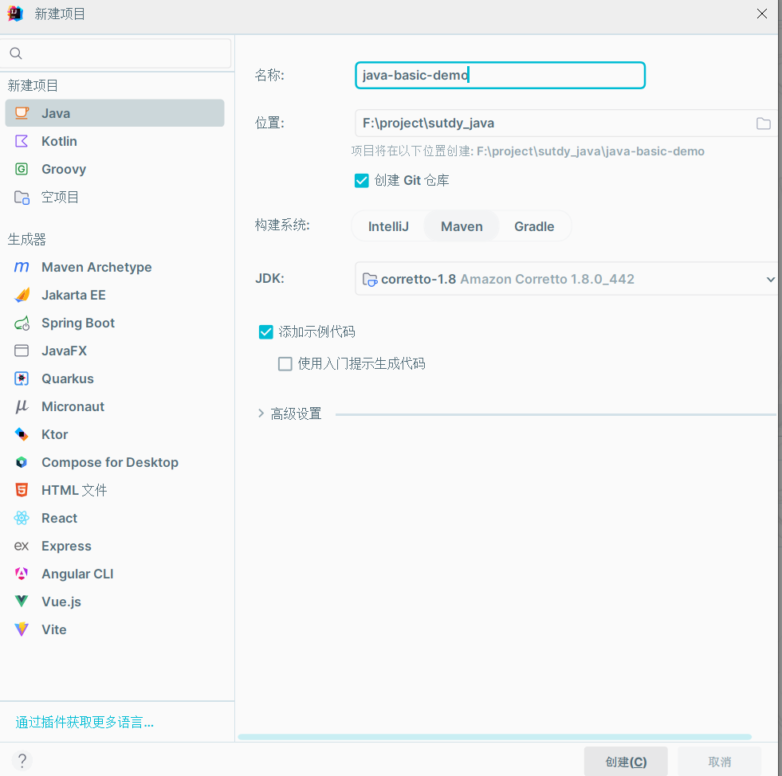

这里还有个高级设置，对应 Maven 的 `pom.xml` 里就是：

```
<groupId>com.xiaogongzhu</groupId>
<artifactId>untitled</artifactId>
<version>1.0-SNAPSHOT</version>
```

Group ID：它表示这个项目属于哪个组织、公司、个人或包名空间。

一般写成类似 Java 包名的形式：

```
com.example
com.company
org.apache
cn.itcast
com.xiaogongzhu
```

Artifact ID：它表示这个项目本身的名字。

比如你的项目叫：

```
java-study
```

那工件 ID 可以写：

```
java-study
```

在 `pom.xml` 里就是：

```
<artifactId>java-study</artifactId>
```

以后 Maven 打包时，生成的 jar 包名字通常会和它有关，比如：

```
java-study-1.0-SNAPSHOT.jar
```

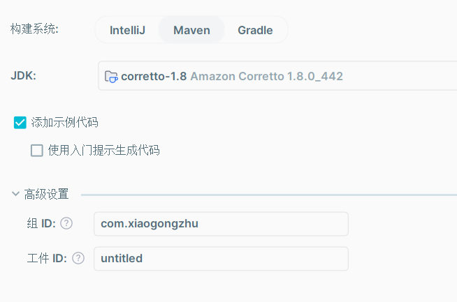

打开 `Main.java`，点击运行按钮即可。

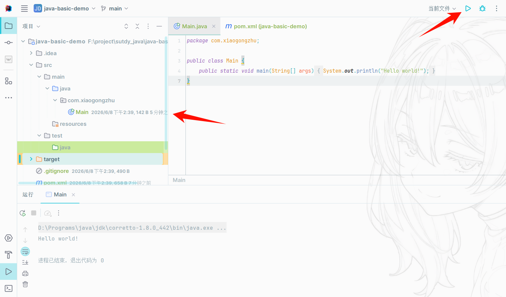

如果想用这个结果开发个一个后端，大概思路如下，也不一定准确

> Maven Web 项目 + Servlet 接口 + Service 业务层 + DAO 数据库层 + MySQL/JDBC + 打包成 WAR 部署到 Tomcat。

大概得一个目录结构就是这样子的。

- [java - 看完这篇，别人的开源项目结构应该能看懂了 - CodeSheep的专栏 - SegmentFault 思否](https://segmentfault.com/a/1190000022110134)
- [一文搞懂一文掌握：Java项目目录结构文档自动化生成：核心原理+实战案例 - mthoutai - 博客园](https://www.cnblogs.com/mthoutai/p/19613696)

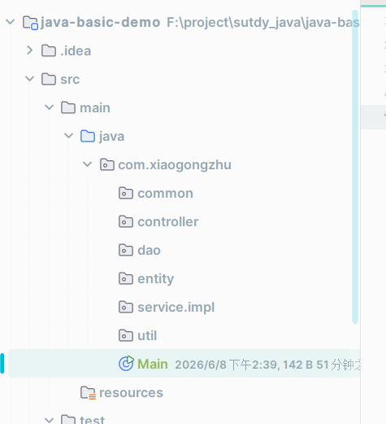

|目录|作用|
| ------| ---------------------------------|
|​`controller`|接口层，接收浏览器/Postman 请求|
|​`service`|业务层，写业务逻辑|
|​`dao`|数据访问层，专门查数据库|
|​`entity`|实体类，对应数据库表|
|​`util`|工具类，比如 JDBC 连接工具|
|​`common`|通用返回结果、常量、异常|
|​`resources`|配置文件|
|​`webapp`|Web 静态资源和 `WEB-INF/web.xml`|
|​`pom.xml`|Maven 配置、依赖、打包方式|

‍

‍

‍

## 创建 Spring Boot 项目

‍

https://start.aliyun.com/

‍

1. 点击 New Project
2. 左侧选择 Spring Boot
3. 配置：

   - Name：`springboot-audit-demo`
   - Language：Java
   - Type：Maven
   - JDK：17 或 21
   - Group：`com.example`
   - Artifact：`springboot-audit-demo`
   - Package name：`com.example.demo`
4. 选择 Spring Boot 版本
5. 添加依赖：

   - Spring Web
   - Lombok，可选
   - Spring Boot DevTools，可选
   - Validation
   - MyBatis Framework 或 Spring Data JPA，二选一
   - MySQL Driver，如果要连 MySQL
   - Spring Security，后续学习鉴权时再加也行
6. 点击 Create

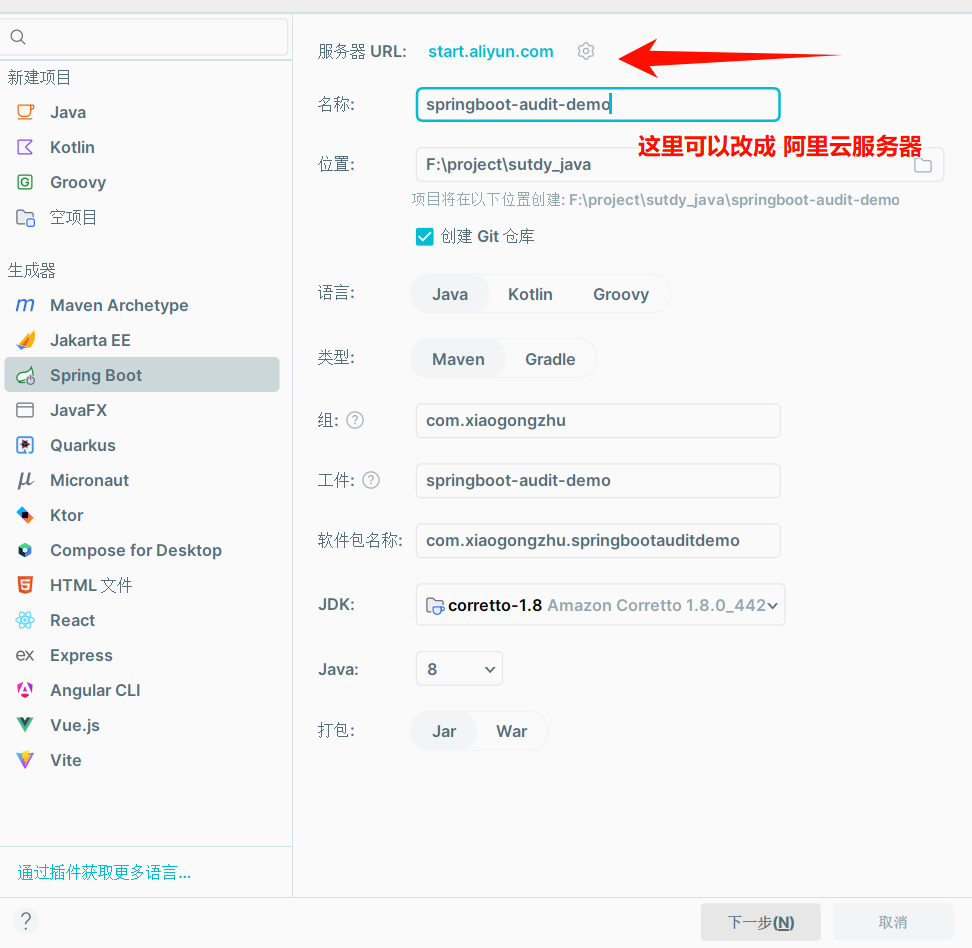

添加相关依赖，后续还要添加的在 pom.xml 中添加即可

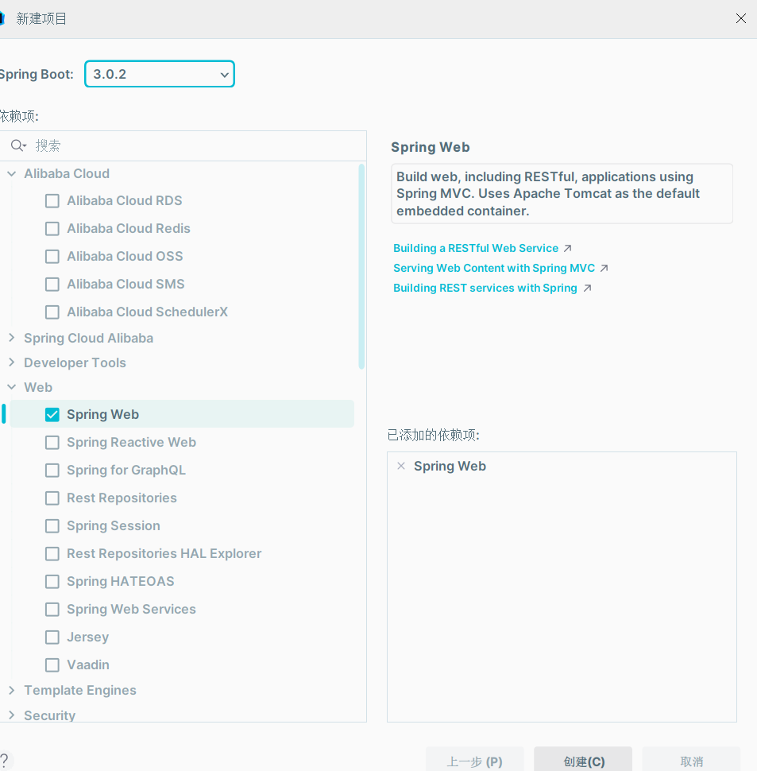


---

> 作者: [lpppp](/)  
> URL: https://lpppp.xyz/posts/%E7%8E%AF%E5%A2%83%E6%90%AD%E5%BB%BA/  

